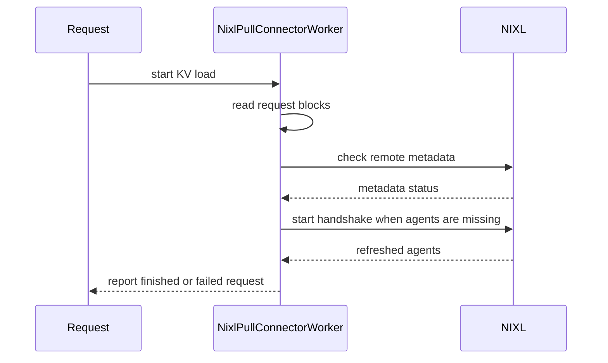

# [PR #55471] [Bugfix][NIXL] Recover locally invalidated pull peer metadata

source: https://github.com/vllm-project/vllm/pull/55471
state: open | updated: 2026-09-23T03:00:44Z
labels: bug, kv-connector

## 正文

## Summary

Recover a pull peer whose **local NIXL metadata is missing**, while Prefill is
still alive with the same engine ID. Otherwise, the cached `_remote_agents`
entry and prepared dlists can keep later requests on the stale path.

- On receive failure, query local metadata existence without descriptors.
  A transfer failure alone is not treated as evidence that Prefill is dead.
- Defer native checks/cleanup until background handshakes and the affected
  peer's receive handles finish, including handles outliving request metadata.
- Reuse existing cleanup, so a fresh request can handshake again. Preserve
  healthy peers; never replay a failed request's old remote block IDs.

Only `nixl/pull_worker.py` changes production behavior. Tests extend the existing
connector suite and initialize the HMA fixture. No new router API,
configuration, push-mode behavior, or successful-path native metadata query.

## Related Work

Related to #49238. #50047 also cleans peer state, but on a broader
dead-peer/address-replacement basis. This patch requires positive local
metadata absence and handles unchanged producer identity. There is cleanup
overlap, not a claim that the two proposals are unrelated. This narrower scope
is explained in the [#49238 discussion](https://github.com/vllm-project/vllm/issues/49238#issuecomment-5552206777). @YannikHinteregger, I would appreciate
your feedback on the overlap with #50047 and whether consolidation is preferable.

#52232 is a separate, necessary HMA fail-closed fix and is **not included here**.
Recovery alone does not prevent a failed HMA request from generating invalid
output. The integration experiment tested both changes, with attribution to
Tyler Michael Smith, and a small API terminal-error follow-up. #54689 (TTL)
and NIXL #1987 (native UCX race) are outside this patch's scope.

## Validation

### Rebase onto main (2026-09-23)

Rebased onto `8d16ca6cc21931481f6c6f9ec0365874a80c6bb2` without conflicts.
Initialized the three recovery fields in main's new HMA `region_pull_worker`
test fixture after full-import testing exposed the omission. This rebase adds
no production-code changes to the September 20 version. Recovery runs from
`get_transfer_results()` (also covering the legacy `get_finished()` wrapper).
The failure override forwards the current failure set, metric flag, and boolean
handle-release result. Main's wait-for-all-reads and notify-only/full-cache-hit
behavior is preserved; the obsolete descriptor-fixture changes were dropped.

Executed in isolated H20 containers, with full vLLM Python imports:

| Check | Result |
| --- | --- |
| Focused recovery tests, mocked NIXL boundary | 18 passed |
| Five connector files, `-m cpu_test` | 357 passed, 224 deselected |
| Same existing CPU cases on main, excluding recovery tests | 339 passed |
| Eight selected recovery/control cases on main | 3 expected assertion failures, 5 passed |
| Real NIXL UCX, 1 MiB CPU and GPU buffers | Both passed |

The 18 recovery cases are included in 357. The negative control replaces only
`pull_worker.py` with main's file; the tests and environment are otherwise the
same. The three failures are behavioral assertions, not import errors.

Runtime: NIXL 1.4.1, PyTorch 2.13.0+cu130, Python 3.12.3. The rebased Python
checkout used native extensions from the existing vLLM
`0.29.1rc1.dev422+gd05da62e9` image, not a fresh CUDA build of main.
The native probe keeps the peer alive, deliberately removes local metadata,
observes the stale-read error, invokes patched cleanup, and explicitly reloads
the same agent's metadata for a byte-checked read. Healthy-peer reads still work.
Automatic handshake behavior is covered by pytest; this batch is **not** a new
model-serving/accuracy run, natural-disconnect reproduction, or NVLink/RDMA claim.

Pre-commit (including mypy), Ruff, `compileall`, and `git diff --check` passed.
Earlier setup/download failures and the pre-fix fixture failures are not counted
as passing runs. No weights were loaded for this validation.

```bash
.venv/bin/python -m pytest \
  tests/v1/kv_connector/unit/test_nixl_connector.py \
  tests/v1/kv_connector/unit/test_nixl_connector_hma.py \
  tests/v1/kv_connector/unit/test_nixl_desc_geometry.py \
  tests/v1/kv_connector/unit/test_bidirectional_kv_transfer.py \
  tests/v1/kv_connector/unit/test_nixl_push_connector.py \
  -m cpu_test -v --tb=short
```

Focused command:

```bash
.venv/bin/python -m pytest \
  tests/v1/kv_connector/unit/test_nixl_connector.py \
  -m cpu_test -k peer_recovery -v
```

[September 23 commands, full selected-run logs, and native probe](https://gist.github.com/xijiaat/34c74ce35e1f68958e5881a1907bf84d).
Private test-root paths are replaced consistently; output lines from the six
selected final-run logs are retained.

### Previous validation (before this rebase)

The CPU and serving results below belong to the original implementation on
base `8369affa5428ca29a30f378d660fbffbad12e240`, not the rebased code.

```bash
.venv/bin/python -m pytest \
  tests/v1/kv_connector/unit/test_nixl_connector.py \
  -m cpu_test -k peer_recovery -v
# 14 passed, full vLLM imports, mocked NIXL boundary.

.venv/bin/python -m pytest \
  tests/v1/kv_connector/unit/test_nixl_connector.py \
  tests/v1/kv_connector/unit/test_nixl_connector_hma.py \
  tests/v1/kv_connector/unit/test_nixl_desc_geometry.py \
  tests/v1/kv_connector/unit/test_bidirectional_kv_transfer.py \
  tests/v1/kv_connector/unit/test_nixl_push_connector.py -m cpu_test -q
# 339 passed before marking the 14 new cases as cpu_test.
# The two selections together cover 353 distinct recovery-only cases.
```

The recovery-only CPU regression selections passed 353 distinct cases across
two runs. The later combined recovery + #52232 + API integration passed 425
selected tests; this is not claimed as 425 tests of the independent diff.
Pinned Ruff lint/format, `compileall`, and `git diff --check` passed. The full
pre-commit run could not initialize its `rhysd/actionlint` dependency because
GitHub Git HTTPS timed out; it is not reported as passed. Local commit hooks
were bypassed once after that infrastructure failure, not after a code-check
failure. CI/full hook validation remains pending.

Real serving validation used isolated TP1 P/D, DeepSeek-V4-Flash-0731,
NIXL 1.3.2, fp8 HMA KV, eager mode, and `UCX_TLS=tcp,cuda_copy` with the existing
TP1 packed-layout fix. With no active reads, a private hook removed only
Decode's local remote metadata, retaining the Python cache. The actual stale
read failed with `NIXL_ERR_NOT_FOUND`; fresh requests automatically re-handshook
with the same Prefill engine ID and returned the expected short answers.

Important limits: the recovery-only failed request still emitted 32 invalid
tokens. With #52232 and the API follow-up, the final 10-request scenario
passed: two normal requests, four controlled native failures across Chat and
Completion streaming/non-streaming, and four fresh Chat recoveries. The
failed requests emitted no generated content. Full logs retain the earlier
failure and an independently wrong pre-injection arithmetic control.

This is controlled failure-path validation, not general accuracy, natural
transport-failure reproduction, RDMA/NVLink, or multi-rank native-race coverage.
Stuck reads/handshakes defer recovery; they are not forcibly released.
Native cleanup exceptions are not swallowed; this patch does not add recovery
from a failed native resource release.

[Complete selected logs, response bodies/SSE, exact test commands and patches](https://gist.github.com/xijiaat/a975858a507d6c45fd394b3675cc0ab9).
The bundle distinguishes the original four-file recovery patch from the combined
HMA/API experiment. Internal addresses/paths are anonymized; selected log
lines are retained. The additional HMA/API evidence is also reported in
[#52232](https://github.com/vllm-project/vllm/pull/52232#issuecomment-5552174526).

## AI Assistance

OpenAI Codex assisted with implementation, testing, and this report.
The human submitter reviewed and approved the original contribution; the
September 20/23 compatibility adaptations still need human review. The limited
failure-path tests above are not a claim of comprehensive model evaluation
or production readiness.


## 评论 (9)

### coderabbitai[bot] · 2026-09-05

<!-- This is an auto-generated comment: summarize by coderabbit.ai -->
<!-- review_stack_entry_start -->

[](https://app.coderabbit.ai/change-stack/vllm-project/vllm/pull/55471)

<!-- review_stack_entry_end -->
<!-- recent_review_start -->

No actionable comments were generated in the recent review. 🎉

<details>
<summary>ℹ️ Recent review info</summary>

<details>
<summary>⚙️ Run configuration</summary>

**Configuration used**: Repository UI

**Review profile**: CHILL

**Plan**: Team

**Run ID**: `9271b0d2-b7c8-44df-8ea2-459a421024aa`

</details>

<details>
<summary>📥 Commits</summary>

Reviewing files that changed from the base of the PR and between bc96d76aa9946f3af81fabe508ae396088974b98 and 55fad382d19654329b836e2555bf76b8d663fcfb.

</details>

<details>
<summary>📒 Files selected for processing (4)</summary>

* `tests/v1/kv_connector/unit/test_nixl_connector.py`
* `tests/v1/kv_connector/unit/test_nixl_connector_hma.py`
* `tests/v1/kv_connector/unit/test_nixl_desc_geometry.py`
* `vllm/distributed/kv_transfer/kv_connector/v1/nixl/pull_worker.py`

</details>

**Included review availability:** Your plan provides up to 10 included reviews per hour; 9 remain after this review.

</details>

---


<!-- recent_review_end -->
<!-- walkthrough_start -->

## Walkthrough

The NIXL pull worker now tracks failed remote engines, probes metadata, re-handshakes peers, defers cleanup during active reads or handshakes, and records receiving engines. Tests cover peer recovery and updated worker state.

### Changes

**NIXL peer recovery**

|Layer / File(s)|Summary|
|---|---|
|**Engine failure tracking and recovery** <br> `vllm/distributed/kv_transfer/kv_connector/v1/nixl/pull_worker.py`|The worker tracks failed and invalid engines, maps requests to engines, checks remote metadata, cleans up invalid engines, and reports completed requests.|
|**Request read and handshake integration** <br> `vllm/distributed/kv_transfer/kv_connector/v1/nixl/pull_worker.py`|Missing-engine handshakes now start in `_read_blocks_for_req`. Reads record their receiving engine and stop early for invalid engines.|
|**Peer recovery test coverage** <br> `tests/v1/kv_connector/unit/test_nixl_connector.py`, `tests/v1/kv_connector/unit/test_nixl_connector_hma.py`, `tests/v1/kv_connector/unit/test_nixl_desc_geometry.py`|Tests cover metadata failures, re-handshakes, pending reads, cleanup ordering, handshake timing, late failures, shutdown behavior, and explicit remote-agent registration.|

**Estimated code review effort:** 4 (Complex) | ~45 minutes


### Sequence Diagram(s)



**Suggested reviewers:** `lucaswilkinson`, `njhill`

<!-- walkthrough_end -->
<!-- final_review_risk_start -->
**Merge Risk:** _⚪ Minimal_ · up to `55fad`
<!-- final_review_risk_coverage:{"sourceCommitId":"55fad382d19654329b836e2555bf76b8d663fcfb","coveredCommitId":"55fad382d19654329b836e2555bf76b8d663fcfb","kind":"reviewed"} -->

The pull-worker recovery path can re-handshake peers after invalid local metadata while preserving active reads and cleanup ordering. No concrete merge-blocking risk remains.
<!-- final_review_risk_end -->
<!-- pre_merge_checks_walkthrough_start -->

<details>
<summary>🚥 Pre-merge checks | ✅ 4 | ❌ 1</summary>

### ❌ Failed checks (1 warning)

|     Check name     | Status     | Explanation                                                                                                                                                                                 | Resolution                                                                         |
| :----------------: | :--------- | :------------------------------------------------------------------------------------------------------------------------------------------------------------------------------------------ | :--------------------------------------------------------------------------------- |
| Docstring Coverage | ⚠️ Warning | Docstring coverage is 21.43% which is insufficient. The required threshold is 80.00%. Docstring coverage is scoped to functions touched by this diff. Analyzed 28 functions across 4 files. | Write docstrings for the functions missing them to satisfy the coverage threshold. |

<details>
<summary>✅ Passed checks (4 passed)</summary>

|         Check name         | Status   | Explanation                                                                                           |
| :------------------------: | :------- | :---------------------------------------------------------------------------------------------------- |
|     Linked Issues check    | ✅ Passed | Check skipped because no linked issues were found for this pull request.                              |
| Out of Scope Changes check | ✅ Passed | Check skipped because no linked issues were found for this pull request.                              |
|         Title check        | ✅ Passed | The title clearly summarizes the main change: recovering pull-peer metadata after local invalidation. |
|      Description check     | ✅ Passed | The description explains the recovery behavior, scope, and validation, and it matches the changeset.  |

</details>

</details>

<!-- pre_merge_checks_walkthrough_end -->
<!-- finishing_touch_checkbox_start -->

<details>
<summary>✨ Finishing Touches 💡 1</summary>

<!-- finishing_touch_suggestion:fix_ci -->
<details open>
<summary>🛠️ Fix failing CI checks 💡</summary>

- [ ] <!-- {"checkboxId": "6d21cfe8-ec3f-40e2-9222-b8318b64d3b0", "radioGroupId": "fix-ci-output-choice-group-unknown_comment_id"} -->   Create stacked PR
- [ ] <!-- {"checkboxId": "9f0d24fb-b419-4f01-baf0-8b26b6424f34", "radioGroupId": "fix-ci-output-choice-group-unknown_comment_id"} -->   Commit on current branch

</details>

</details>

<!-- finishing_touch_checkbox_end -->
<!-- tips_start -->

---

Thanks for using [CodeRabbit](https://coderabbit.ai?utm_source=oss&utm_medium=github&utm_campaign=vllm-project/vllm&utm_content=55471)! It's free for OSS, and your support helps us grow. If you like it, consider giving us a shout-out.

<details>
<summary>❤️ Share</summary>

- [X](https://twitter.com/intent/tweet?text=I%20just%20used%20%40coderabbitai%20for%20my%20code%20review%2C%20and%20it%27s%20fantastic%21%20It%27s%20free%20for%20OSS%20and%20offers%20a%20free%20trial%20for%20the%20proprietary%20code.%20Check%20it%20out%3A&url=https%3A//coderabbit.ai)
- [Mastodon](https://mastodon.social/share?text=I%20just%20used%20%40coderabbitai%20for%20my%20code%20review%2C%20and%20it%27s%20fantastic%21%20It%27s%20free%20for%20OSS%20and%20offers%20a%20free%20trial%20for%20the%20proprietary%20code.%20Check%20it%20out%3A%20https%3A%2F%2Fcoderabbit.ai)
- [Reddit](https://www.reddit.com/submit?title=Great%20tool%20for%20code%20review%20-%20CodeRabbit&text=I%20just%20used%20CodeRabbit%20for%20my%20code%20review%2C%20and%20it%27s%20fantastic%21%20It%27s%20free%20for%20OSS%20and%20offers%20a%20free%20trial%20for%20proprietary%20code.%20Check%20it%20out%3A%20https%3A//coderabbit.ai)
- [LinkedIn](https://www.linkedin.com/sharing/share-offsite/?url=https%3A%2F%2Fcoderabbit.ai&mini=true&title=Great%20tool%20for%20code%20review%20-%20CodeRabbit&summary=I%20just%20used%20CodeRabbit%20for%20my%20code%20review%2C%20and%20it%27s%20fantastic%21%20It%27s%20free%20for%20OSS%20and%20offers%20a%20free%20trial%20for%20proprietary%20code)

</details>


<sub>Comment `@coderabbitai help` to get the list of available commands.</sub>

<!-- tips_end -->

### YannikHinteregger · 2026-09-05

@xijiaat thanks for contributing to this issue.

Some thoughts from my side: I'm not sure the failure mode your PR fixes can happen in vLLM. Your cleanup only runs when NIXL has lost the remote metadata but the Python cache still has it. In vLLM both are only changed together in `_cleanup_remote_engine`, so they should not drift apart on their own. Did I see this correctly that in your test you created a test hook to make the caches drift? Have you seen this happen in a real deployment, without the hook?

On my PR I got feedback from the maintainers (@NickLucche and @chaunceyjiang) that a higher level system (like the router) should be responsible for detecting engine failures and telling the other engines. I think their proposal makes sense. With that approach all of these failure modes would be handled in one place, including yours.

### xijiaat · 2026-09-05

@YannikHinteregger Thanks for the careful review. Yes, a real deployment incident motivated this, but I should distinguish the production observation from the controlled reproduction.

### What happened in the deployment

We were running DeepSeek-V4-Flash on vLLM v0.23.0 with multiple prefill/decode instances using NIXL/UCX. Under load, the transfer path between one prefill (P-A) and one decode (D-B) failed, while P-A's connections to other peers remained working. This was a pair-specific failure, not a loss of connectivity to every peer or evidence that the entire prefill engine had died. We subsequently removed the affected decode from the serving pool by scaling down.

I do not have synchronized Python/native cache snapshots from the onset of that incident to attach here, so I cannot claim that the production observation alone proves the exact cache-divergence sequence. The isolated hook test deliberately creates that state; it validates recovery from it, not the original network failure. The production incident was on v0.23.0; the candidate and controlled tests are based on the main commit documented in this PR.

For some more concrete context, our contemporaneous incident notes recorded the following P/D behavior (these are recorded log symptoms, not a newly captured raw-log attachment):

- **Prefill P-A:** requests reached Prefill and KV-transfer metadata was passed on to Decode. We found no Prefill Pod restart in the examined period. P-side logs also contained lease-expiry and `unrecognized request ... may have expired` warnings, but we did not establish these as the cause of the agent invalidation.
- **Decode D-B:** subsequent transfer attempts repeatedly reported the following messages, with agent/request IDs omitted here:

  ```text
  remote agent '<uuid>' was invalidated in between prepXferDlist and this call
  NIXL_ERR_NOT_FOUND
  NIXL transfer failure: transfer_setup_failed
  Skipping KV post-processing for failed request
  ```

- **Other pairs:** P-A -> D-A continued working, and the other prefills -> D-B also remained usable. The healthy D-A had no `transfer_setup_failed` entries in the comparison window. The repeating failure was associated with P-A -> D-B, rather than all traffic to/from P-A or D-B.

The important observed symptom was therefore repeated failure to set up transfers for an already-known peer, not a cluster-wide producer outage. We did **not** capture the initial UCX event that caused the invalidation, so I am not presenting an ACK timeout, reset, hardware fault, or a specific native race as the proven trigger. Nor do these setup failures by themselves prove that an incorrect remote KV read actually completed.

### Dashboard and mitigation


This is the dashboard screenshot retained from the incident, not the hook test. **We manually removed the affected decode by scaling down; the disappearance of the traces at the end is consistent with that mitigation, not evidence of automatic peer recovery.** Once that instance is stopped, it no longer serves requests or exposes its metrics, and its time series may become absent rather than report successful transfers. Our operational notes place the scale-down instructions at about 18:34-18:36 and confirmation at 18:47-18:50 (UTC+8). The crop omits the date, vertical axes and PromQL, so it cannot establish the exact stop/scrape-staleness time or quantify the failures. The upper panel title is also cropped; I am not assigning it a metric name.

### Separate HMA fail-closed issue

There was also a request-correctness concern: **a failed KV receive must not be treated as successful input for generation.** In the affected v0.23.0 path, failed receives are added to `done_recving`, while [`_handle_failed_transfer`](https://github.com/vllm-project/vllm/blob/v0.23.0/vllm/distributed/kv_transfer/kv_connector/v1/nixl/worker.py#L1915-L1934) skips the invalid-block reporting branch for HMA. This can let decoding proceed without correctly populated destination KV and return HTTP 200 with nonsensical output. It does not establish that every KV block was corrupted, or that a read of somebody else's KV completed.

Our separate [controlled serving validation](https://gist.github.com/xijiaat/a975858a507d6c45fd394b3675cc0ab9) reproduced HTTP 200 and 32 nonsensical output tokens with peer recovery alone. Adding the HMA failure propagation from #52232 made the non-streaming failure return HTTP 500 with zero generated tokens. Streaming additionally needed the documented API error-propagation follow-up; after headers are sent, an HTTP 200 status alone is not the success criterion, and the stream must carry the terminal error. These are separate correctness fixes: #55471 restores local peer state for subsequent requests, but does not itself guarantee that the already-failed request stops generating.

### Why the two caches can diverge without the hook

The important distinction is that `_cleanup_remote_engine` is not the only path that can remove metadata inside NIXL. In NIXL v1.3.2:

- [`nixlAgent::getXferStatus`](https://github.com/ai-dynamo/nixl/blob/v1.3.2/src/core/nixl_agent.cpp#L1124-L1142) calls `data->invalidateRemoteData(remoteAgent)` when the backend returns `NIXL_ERR_REMOTE_DISCONNECT`.
- [`nixlAgentData::invalidateRemoteData`](https://github.com/ai-dynamo/nixl/blob/v1.3.2/src/core/nixl_listener.cpp#L794-L816) erases the peer's `remoteSections_`, disconnects its backends, and erases `remoteBackends_`.

That is an internal NIXL error path, not a call through vLLM's `_cleanup_remote_engine`. On the tested main base, vLLM's [`_handle_failed_transfer`](https://github.com/vllm-project/vllm/blob/8369affa5428ca29a30f378d660fbffbad12e240/vllm/distributed/kv_transfer/kv_connector/v1/nixl/base_worker.py#L2534-L2557) reports the request/transfer failure and releases the transfer handle, but does not clear the corresponding Python peer/prepared-dlist caches. This is the source-level path the hook is intended to isolate. It is not an assumption that any failed transfer means the remote engine is dead.

### Router responsibility

I agree that engine membership and engine-death handling belong at the higher level. My concern is specifically the multi-P/multi-D case: P-A is still usable by other decoders, but D-B's local connection state for P-A is no longer valid. Treating P-A as globally unhealthy on that basis would also remove a producer that remains useful to the other decoders.

For this narrower case, I think the connector can recover its confirmed-invalid local state without requiring a router to declare P-A dead or remove it from the pool. A producer-health check and the validity of a particular decoder's local peer metadata are different things. This does not rule out router-coordinated, per-peer recovery; it is a distinction between repairing local transport state and changing global engine membership.

This PR only cleans up after confirming that local metadata is absent, with the relevant reads and background handshakes drained, so a later fresh request can use the existing handshake path. It does not retry the failed request's old KV descriptors or replace the separate fail-closed work. Would it make sense to treat this as a narrow complement to the higher-level engine-failure mechanism? I appreciate your feedback on where that boundary should sit.


### YannikHinteregger · 2026-09-05

@xijiaat Ah, thanks for clearing that up and for the additional context. That's great evidence.

I think we should coordinate on this and wait for a review from NickLucche. We have this [thread](https://vllm-dev.slack.com/archives/C07QT0LUF4K/p1786045914622659) on Slack. By now several people have posted different failure modes under the original bug report #49238. Some of them could be resolved by the router endpoint discussed there. Others need a fix like the ones you (#55471) and I (#50047) submitted.

I'd wait for a maintainer to make the call on how to proceed. With my current knowledge I'd suggest:
1. Fold your trigger into my PR, with a Co-authored-by line for you if that's okay.
2. Implement the router endpoint separately.

### xijiaat · 2026-09-06

@YannikHinteregger Thanks for the review and the offer to consolidate. I'm happy to fold the local-metadata recovery into #50047 with a Co-authored-by line, subject to NickLucche's review, and keep the router endpoint separate.

Could we preserve these behaviors and their regression tests when integrating?

- **Scoped trigger:** for this recovery path, confirm that local NIXL metadata is missing; a transfer error alone does not establish producer death.
- **Outstanding-read protection:** retain request-to-engine tracking until every receive handle settles, even after request metadata is removed. This also lets us attribute late failures to the correct peer.
- **Pending recovery:** keep a confirmed-invalid peer pending while reads drain, rather than requiring another transfer failure to trigger cleanup. Do not start new reads through that invalid state.
- **Handshake ordering:** prevent native metadata checks/releases from racing with background metadata loads, and recheck peer state before processing queued ready requests so they can re-handshake after cleanup.

The multi-handle case is particularly important: one handle can fail and cause request metadata to be removed while another handle is still running.

There is no need to preserve my exact helper structure; your serialized release path looks like a useful foundation. Recovery should remain for fresh requests, without replaying the failed request's old block IDs. Let's agree on the combined approach after the maintainer review.


### xijiaat · 2026-09-07

> Verified the full recovery machinery locally on CPU (mocked NIXL boundary, head [55fad38](https://github.com/vllm-project/vllm/commit/55fad382d19654329b836e2555bf76b8d663fcfb) vs merge-base [8369aff](https://github.com/vllm-project/vllm/commit/8369affa5428ca29a30f378d660fbffbad12e240)).
> 
> **Regression proof (executed):** head's test file transplanted onto the base tree → 10/14 `peer_recovery` cases FAIL there (missing-metadata cleanup, re-handshake of the unchanged engine id, wait-for-remaining-reads ordering, late failure without metadata, deferred cleanup during handshake, success-path no-probe, cleanup-exception propagation, reads-through-failure both params, re-handshake failure reporting) / all 14 PASS at head. The 4 base-passes are the positive controls (metadata present, probe raising) that must pass on both.
> 
> **Mechanism audit:** failure attribution via `_recv_engine_by_req` correctly outlives metadata pops (`_handle_failed_transfer` reads meta first, falls back to the map); the prune in `get_finished` keys on `_recving_transfers`, so an engine stays "busy" while any of its requests still has in-flight handles and cleanup is deferred until the last read settles; `_recover_remote_engines` iterates a copy (`set - set`) while removing from the live set; `_handshake_lock` is an RLock, so the nested acquisition in `_read_blocks_for_req` → `_background_nixl_handshake` → `_ensure_handshake` cannot deadlock, and the executor-thread `done_callback` writes to `_remote_agents`/`_handshake_futures` under the same lock. Writes to `_recv_engine_by_req` happen only on the main thread (start_load_kv / ready-queue drain), so the lock-free prune in `get_finished` cannot race.
> 
> **Native API dependency confirmed:** `nixl_wrapper.check_remote_metadata(agent)` resolves to `nixl_agent.checkRemoteMD` in the real bindings — present in both `nixl-cu12==1.3.2` and `nixl-cu13==1.3.2` `_api.py` (matches the repo's `nixl == 1.3.2` pin), returning bool for local metadata existence with an empty DRAM dlist default. Semantics match the fix intent exactly ("query local existence, not peer health").
> 
> **Collateral:** sibling connector suites at head: test_nixl_connector_hma.py + test_nixl_desc_geometry.py → 279 passed / 1 failed, where the single failure (`test_fewer_blocks_with_hma[google/gemma-3-1b-it-512]`) reproduces identically on the base tree (RuntimeError: Cannot access accelerator device — GPU-less host env noise, unrelated). ruff check + ruff format clean on all 4 changed files. pre-run-check CI failure is the standard label/merged-count gate, not code.
> 
> Two non-blocking nits: (1) `_recover_remote_engines` defers on ANY pending handshake future, not just one for the affected engine — coarse-grained but safe, since get_finished runs every scheduler step; (2) the expired turn-2-read decline path routes through `_handle_failed_transfer`, so it marks the engine failed and triggers a speculative `check_remote_metadata` probe even for healthy engines — the probe returns True and tears nothing down, so it is only a rare extra native call. Neither changes my assessment.

@Manny7717 Thanks for the thorough review and for running the baseline/head regression tests. I especially appreciate the checks on outstanding-read lifetimes, handshake synchronization, and the native API semantics. Both non-blocking observations are noted; I’d keep the conservative handshake gating for this focused fix. Thanks again for taking the time to validate it.

### mergify[bot] · 2026-09-12

This pull request has merge conflicts that must be resolved before it can be
merged. Please rebase the PR, @xijiaat.

https://docs.github.com/en/pull-requests/collaborating-with-pull-requests/working-with-forks/syncing-a-fork


### liuzijing2014 · 2026-09-23

Hi @xijiaat is this PR ready to review? We would like to accelerate the process and have it merged soon if possible.

cc @NickLucche @njhill 

### xijiaat · 2026-09-23

@liuzijing2014 Thanks for following up. Rebased onto September 23 main and ready for review.

357 selected connector CPU tests passed, including all 18 recovery cases. The main negative control has 3 expected recovery assertion failures and 5 passing controls. Real NIXL CPU/GPU controlled-metadata-loss checks and local pre-commit also passed; this is not a new model-serving or accuracy run.

The updated description links the commands and full selected-run logs. I would appreciate your review. Thank you!


## Review (2)

### claude[bot] · 2026-09-05 · COMMENTED

## Claude Code Review

This pull request is from a fork — automated review is disabled. A repository maintainer can comment `@claude review` to run a one-time review.

### Manny7717 · 2026-09-05 · APPROVED

Verified the full recovery machinery locally on CPU (mocked NIXL boundary, head 55fad382 vs merge-base 8369affa).

**Regression proof (executed):** head's test file transplanted onto the base tree → 10/14 `peer_recovery` cases FAIL there (missing-metadata cleanup, re-handshake of the unchanged engine id, wait-for-remaining-reads ordering, late failure without metadata, deferred cleanup during handshake, success-path no-probe, cleanup-exception propagation, reads-through-failure both params, re-handshake failure reporting) / all 14 PASS at head. The 4 base-passes are the positive controls (metadata present, probe raising) that must pass on both.

**Mechanism audit:** failure attribution via `_recv_engine_by_req` correctly outlives metadata pops (`_handle_failed_transfer` reads meta first, falls back to the map); the prune in `get_finished` keys on `_recving_transfers`, so an engine stays "busy" while any of its requests still has in-flight handles and cleanup is deferred until the last read settles; `_recover_remote_engines` iterates a copy (`set - set`) while removing from the live set; `_handshake_lock` is an RLock, so the nested acquisition in `_read_blocks_for_req` → `_background_nixl_handshake` → `_ensure_handshake` cannot deadlock, and the executor-thread `done_callback` writes to `_remote_agents`/`_handshake_futures` under the same lock. Writes to `_recv_engine_by_req` happen only on the main thread (start_load_kv / ready-queue drain), so the lock-free prune in `get_finished` cannot race.

**Native API dependency confirmed:** `nixl_wrapper.check_remote_metadata(agent)` resolves to `nixl_agent.checkRemoteMD` in the real bindings — present in both `nixl-cu12==1.3.2` and `nixl-cu13==1.3.2` `_api.py` (matches the repo's `nixl == 1.3.2` pin), returning bool for local metadata existence with an empty DRAM dlist default. Semantics match the fix intent exactly ("query local existence, not peer health").

**Collateral:** sibling connector suites at head: test_nixl_connector_hma.py + test_nixl_desc_geometry.py → 279 passed / 1 failed, where the single failure (`test_fewer_blocks_with_hma[google/gemma-3-1b-it-512]`) reproduces identically on the base tree (RuntimeError: Cannot access accelerator device — GPU-less host env noise, unrelated). ruff check + ruff format clean on all 4 changed files. pre-run-check CI failure is the standard label/merged-count gate, not code.

Two non-blocking nits: (1) `_recover_remote_engines` defers on ANY pending handshake future, not just one for the affected engine — coarse-grained but safe, since get_finished runs every scheduler step; (2) the expired turn-2-read decline path routes through `_handle_failed_transfer`, so it marks the engine failed and triggers a speculative `check_remote_metadata` probe even for healthy engines — the probe returns True and tears nothing down, so it is only a rare extra native call. Neither changes my assessment.
