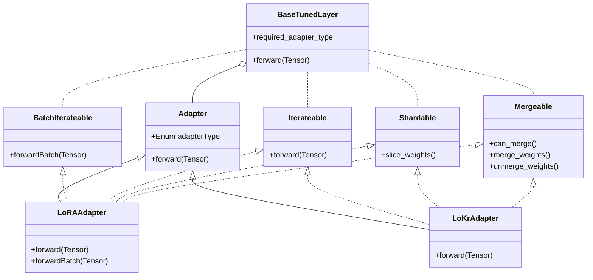

# [Issue #25897] [Roadmap] Extended Adapter support for Multimodal LLM

source: https://github.com/sgl-project/sglang/issues/25897
state: open | updated: 2026-09-21T22:43:21Z
labels: 

## 正文

Current Status and motivation
------------------------------------
Only LoRA adapter has been supported. But for diffusion models and multimodal there are also popular LoKr adapters and other.
Need to support various type of adapter for SGLang for diffusion  and multimodal.

Design 
------------------------------------
Adapters have been applied for layers with commutative property. $`func(X, W + \Delta w) = func(X, W) + func(X, \Delta w)`$
BaseLayerWithLoRA replace with BaseTunedLayer

Cuda Graph Design 
------------------------------------
Currently LoRA support for Multimodal is used torch native api and doesn't use custom operator 
There 3 possible implementation multi-typed adapters support:
1. One adapter per layer: validate used adapters per layer, if for one layer has been used only one adapter type, then generate 
2. One adapter type per batch: In case different adapter types, generate and call graph also by the adapter type, not only batch size
3. Many adapter types per batch: custom operators or graph should contain all possible adapters

Features
------------------------------------
- Adapter type detection. Some adapter doesn't have valid adapter_config.json files and store in Safetensor format.
  For example, Ostris AI-Toolkit framework doesn't provide adapter_config.json. [Link: ai-toolkit](https://github.com/ostris/ai-toolkit.git)
- Generalize config settings for general type adapter.
- Cuda support for different adapter types.
- Multi-types multi-adapters support

## 评论 (2)

### github-actions[bot] · 2026-08-06

This issue has been automatically closed due to inactivity. Please feel free to reopen it if needed.

### vlserov · 2026-08-28

PR for LoKr integration has been created
