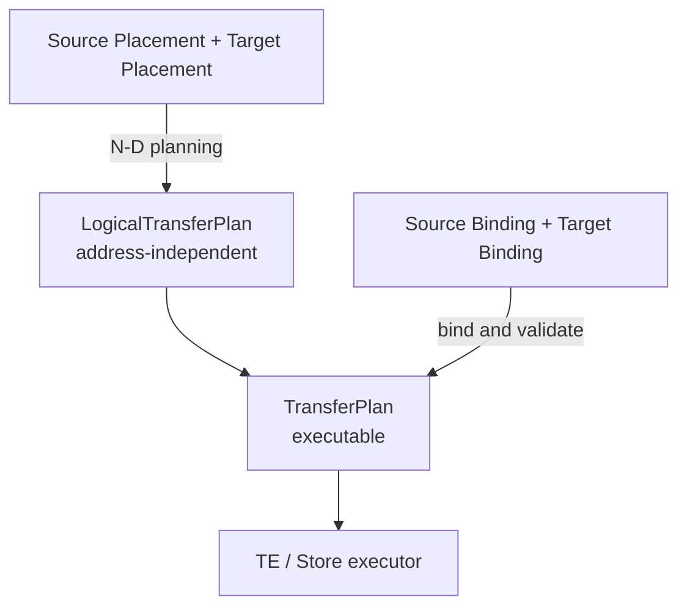

# [Issue #32335] [RFC]: Native Heterogeneous Weight Conversion in SGLang

source: https://github.com/sgl-project/sglang/issues/32335
state: closed | updated: 2026-09-23T00:27:18Z
labels: inactive

## 正文

## Motivation

SGLang can already load or update weights from checkpoints and remote instances, but these paths mainly assume compatible source and target layouts. That assumption does not hold when scaling, failover, RL training/inference transitions, or resource scheduling changes TP, PP, EP, and DP at the same time. SGLang needs a native, backend-neutral way to convert weights between these layouts.

The full workflow needs to:

1.  Export stable logical semantics for every runtime tensor.
    
2.  Describe the actual sharding, ownership, and physical location of source and target tensors.
    
3.  Jointly plan N-D resharding across TP, PP, EP, and DP.
    
4.  Bind the logical plan safely to live GPU, Store, or checkpoint data.
    
5.  Execute transfers through pluggable backends.
    
6.  Keep the source serving read-only traffic and activate the target only after full validation.
    

Without a shared conversion layer, model semantics, parallel layouts, and backend details remain scattered across `load_weights`, `ModelRunner`, distributed workers, and remote loaders. A transfer backend can move bytes, but it should not infer model structure from names such as `q_proj`, `down_proj`, or `expert`.

This RFC proposes a complete **SGLang-native heterogeneous weight conversion layer**. Runtime manifests, physical bindings, snapshot leases, and model adapters are components of this capability rather than separate end goals.

## Proposal



Placement is address-independent and is the only input to N-D planning. Runtime Binding adds the current addresses, endpoints, generation, and lease immediately before execution. Address changes therefore require rebinding, not replanning. For a Store source, the stored fragment/object-range mapping acts as the source binding; only the target requires a live Runtime Binding.

### Scope

This proposal covers:

*   Byte-compatible weight conversion when TP, PP, EP, and DP change together.
    
*   Live runtime, Store/L3, and checkpoint/OSS sources.
    
*   Model semantics, the canonical transfer plan, and target activation owned by SGLang.
    
*   Pluggable execution through Mooncake, local CUDA, NCCL M2N, or other backends.
    
*   Compatibility with existing one-dimensional TP, checkpoint loading, and remote update paths.
    

The first version does not perform arbitrary dtype conversion, quantization, swizzling, or backend-private packed-layout transforms. It also does not make Mooncake, NCCL M2N, or any transfer runtime a hard dependency.

### Architecture

| Component | Responsibility |
| --- | --- |
| Model adapter | Export tensor semantics, Placement, and Binding from the actual runtime |
| Snapshot/lifecycle | Pin the source generation and manage leases and target activation |
| N-D planner | Jointly plan TP/PP/EP/DP changes and produce backend-neutral regions |
| Binder/validator | Bind current physical locations and validate layout, coverage, and bounds |
| Executor provider | Lower validated regions to TE, CUDA, or another backend |

```text
source/target Placement -> N-D planner -> LogicalWeightTransferPlan
current Bindings        -> bind/validate -> executor -> barrier/activate

```

The model adapter and runtime manifest are the sources of truth for model semantics and physical locations. The planner does not read addresses, and the executor does not reinterpret model structure.

### Core contracts

| Contract | Content |
| --- | --- |
| Placement | model/revision, tensor ID, global/local box, layer/expert ownership, shard dimensions, dtype/layout |
| Binding | placement ID, generation/lease, and a GPU address, Store object range, or checkpoint range |
| LogicalWeightTransferPlan | tensor/fragment IDs, overlap offset/shape, base offsets, inner bytes, outer loops, and strides |

Placement is address-independent. Binding refers to one concrete resource instance. The logical plan contains no address, object key, lease, or backend handle, so the same plan can run against live G2G, Store/L3, or checkpoint/OSS sources.

Target parallelism values alone are not enough. SGLang must first create the non-serving target model and its final buffers, then export the actual target Placement and Binding. This is necessary for fused tensors, separate expert allocations, packed layouts, and real buffer addresses.

### Joint TP/PP/EP/DP planning

| Axis | Planning semantics |
| --- | --- |
| TP | N-D logical-box intersections, including TP4 to TP8, TP8 to TP4, and cross-dimension sharding |
| PP | Routing by explicit layer/tensor ownership through `(src_pp, dst_pp)` groups |
| EP | Expert ID as a leading logical coordinate, including EP8 to EP2 and EP/TP cross-dimension sharding |
| DP | Source replica selection without sharding weight contents; every target replica receives full coverage |

For `TP4/PP2/EP8/DP2 -> TP8/PP4/EP2/DP4`, the planner directly combines DP replica selection, PP routing, and expert/TP intersections. It does not build intermediate TP, PP, or EP layouts. PP does not rely on benchmark-specific layer formulas, and EP does not require independent allocations to be packed or all-gathered.

The legacy single `partition_dim` is adapted into a one-dimensional logical box, preserving the current TP4 to TP8 and TP8 to TP4 behavior.

### Execution and lifecycle

Before submission, the binder validates revision/layout compatibility, lease/generation state, physical bounds, full target coverage, and the absence of overlapping writes. Executors follow a common lifecycle:

```text
probe -> prepare -> submit -> wait/cancel -> synchronize -> release

```

Providers advertise capabilities such as G2G, Store ranges, scatter, strided regions, and cancellation. Lowering must keep the operation count bounded and must not expand a plan into one operation per row or element.

SGLang provides a local/mock executor as the baseline. The current N-D planner reference implementation is in Mooncake; SGLang will implement the same canonical planning semantics. Mooncake TE/Store remains an optional provider, and NCCL M2N can be used as an optional executor when its constraints are met.

A live source may continue serving read-only inference while its snapshot lease is valid, but the referenced weights cannot be modified, released, or reallocated. The target follows this flow:

```text
allocate final buffers -> export manifests -> plan/transfer
  -> validate/world barrier -> commit revision and activate

```

Failures, timeouts, stale generations, revoked leases, coverage gaps, and out-of-bounds regions fail closed. The target must not enter serving in any of these cases.

### Model and layout extensibility

Model adapters are implemented per architecture family. The first version only supports byte-compatible resharding. A future extension may add an explicit `LogicalWeightTransformPlan`:

```text
WeightConversionPlan
  = optional LogicalWeightTransformPlan
  + LogicalWeightTransferPlan

```

This can cover dtype conversion, W31/W13 transforms, fuse/split, pack/swizzle, and delta reuse. Each transform must be declared explicitly by the model adapter.

## Compatibility and failure behavior

*   Disabling the feature leaves normal serving and loading unchanged.
    
*   Legacy `runtime_v1` manifests and single `partition_dim` inputs remain available through adapters.
    
*   Existing loaders continue to own quantization, fuse, pack, and swizzle logic.
    
*   Schema or capability mismatches return explicit errors instead of falling back to an unvalidated copy.
    
*   Mooncake and other providers remain optional dependencies.
    

## Phasing

| Phase | Scope |
| --- | --- |
| 1. Core contract | Stabilize Placement, Binding, tensor identity, N-D regions, and legacy manifest compatibility |
| 2. Native planner | Implement joint TP/PP/EP/DP planning, coverage validation, bounded lowering, and a local/mock executor |
| 3. Executors and storage APIs | Provide backend-neutral loading from a live runtime, Store/L3, or checkpoint/OSS into a target runtime, as well as staging runtime snapshots or checkpoint/OSS weights into Store/L3 |
| 4. Models and transforms | Extend the Qwen baseline to DeepSeek, Llama/Mistral, Mixtral, multimodal models, and explicit transforms |

These phases are incremental steps toward one complete capability. The core contract is foundational infrastructure for the conversion layer, not a standalone end state.

## Acceptance criteria

*   TP4 to TP8 and TP8 to TP4, PP2 to PP4 and PP4 to PP2, and EP8 to EP2 and EP2 to EP8.
    
*   Dim0 to dim1 and dim0 to dim2 for `[experts, out, in]`.
    
*   `TP4/PP2/EP8/DP2 -> TP8/PP4/EP2/DP4`.
    
*   Regression coverage for live G2G, Store, checkpoint, and legacy manifests.
    
*   Byte-exact target tensors with full coverage and no overlapping writes.
    
*   Bounded operation counts, source-serving continuity, and successful target activation/rollback behavior.
    

## Open questions

1.  Should this design eventually support broader reuse scenarios such as FP16 to FP8 conversion?
    
2.  Should the first schema reserve a `LogicalWeightTransformPlan`?
    

## Related resources
    
*   [Mooncake heterogeneous weight transfer companion RFC](https://github.com/kvcache-ai/Mooncake/issues/3111)

## 评论 (1)

### github-actions[bot] · 2026-09-23

This issue has been automatically closed due to inactivity. Please feel free to reopen it if needed.
