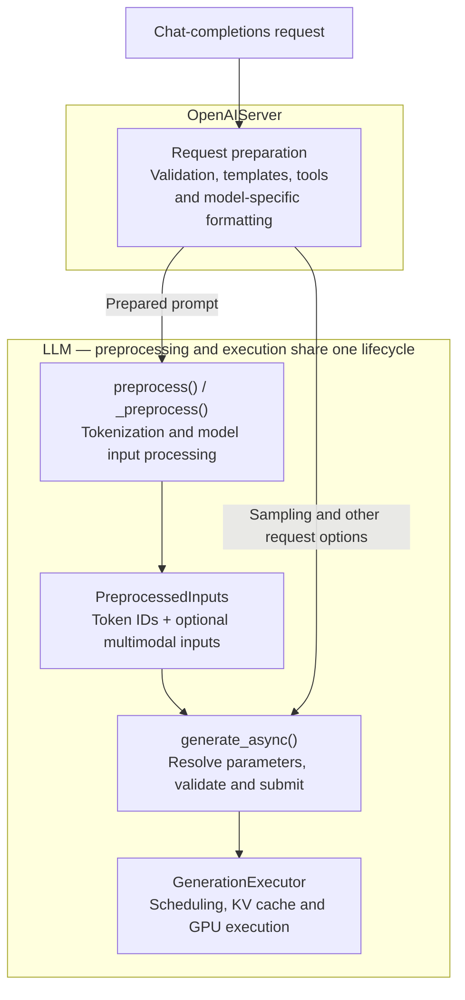
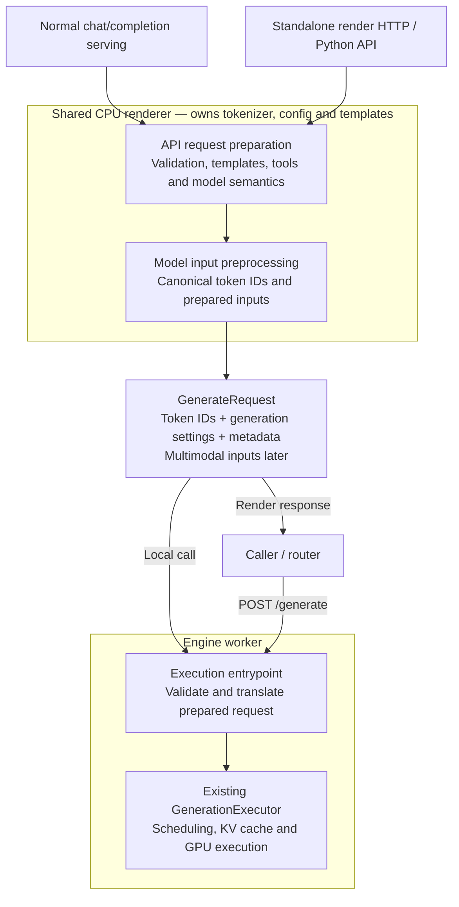

# [Issue #19232] [RFC]: Disaggregated request preprocessing

source: https://github.com/NVIDIA/TensorRT-LLM/issues/19232
state: open | updated: 2026-09-16T05:11:54Z
labels: triaged, Investigating, LLM API, Disaggregated serving, RFC, Frontend

## 正文

## Motivation

[Dynamo's standalone EPP DEP](https://github.com/ai-dynamo/dynamo/issues/11661), [llm-d](https://llm-d.ai/docs/dev/architecture/advanced/kv-management/prefix-cache-aware-routing), and other disaggregated serving frameworks place routing outside the inference engine. Disaggregated routers, including endpoint pickers (EPPs) adhering to [Gateway API Inference Extension (GAIE)](https://github.com/kubernetes-sigs/gateway-api-inference-extension), need the exact prompt token IDs the selected engine will execute for cache-aware routing. They use these IDs to measure request length and compare prompt prefixes with cached blocks reported through KV events.

Differences in chat templates, special tokens, or model-specific formatting can produce different token sequences and incorrect cache-overlap scores. TensorRT-LLM's existing [`/_internal/tokenize` endpoint](https://github.com/NVIDIA/TensorRT-LLM/pull/14397) accepts plain text, not a full chat request, and runs within the normal inference server. Callers still need to reproduce TensorRT-LLM's request preparation themselves.

Exposing the serving preprocessing path as a CPU-only service would let routers obtain accurate model inputs and let deployments prepare requests once, independently of GPU execution. Other engines provide useful design and implementation precedents:

- **vLLM:** the [disaggregated serving RFC](https://github.com/vllm-project/vllm/issues/22817) and [Renderer RFC](https://github.com/vllm-project/vllm/issues/22880), with the [merged CPU-only render service](https://github.com/vllm-project/vllm/pull/36166).
- **SGLang:** the [disaggregated request preprocessing RFC](https://github.com/sgl-project/sglang/issues/28669) and its [standalone renderer implementation PR](https://github.com/sgl-project/sglang/pull/36718).

TensorRT-LLM should expose the same separation while retaining its own preprocessing semantics and generate-request format.

## Proposed Change

Introduce a TensorRT-LLM renderer that converts chat and completion requests into a prepared **generate request** without running inference. Normal serving and standalone rendering must call the same preprocessing implementation, including request validation, chat templates, tools, reasoning options, and model-specific token handling.

For the same request and model/tokenizer configuration, the renderer must return exactly the token sequence passed to generation. The standalone service loads only the configuration, tokenizer, and preprocessing assets it needs; it must start on a CPU-only host without model weights or an inference engine.

### Current state

Request preparation is split between the serving layer and the engine-owning `LLM` object:

- The server obtains preprocessing resources through its generator. [LLM initialization](https://github.com/NVIDIA/TensorRT-LLM/blob/153cab509c2dab26934a5f0c37337682f81f9c6e/tensorrt_llm/llmapi/llm.py#L1931) loads the tokenizer and input processor and creates the executor.
- [`PreprocessedInputs`](https://github.com/NVIDIA/TensorRT-LLM/blob/153cab509c2dab26934a5f0c37337682f81f9c6e/tensorrt_llm/llmapi/llm.py#L341) already lets generation skip preprocessing, but generation settings and request metadata are passed separately. It is not yet a complete portable generate request.

### Proposed refactoring

Extract both preparation stages into a shared CPU renderer, used by normal serving and standalone rendering:

- Move API request preparation out of `OpenAIServer` and input preprocessing out of the `LLM` lifecycle. Load their CPU resources independently of the executor.
- Combine prepared inputs and generation settings into `GenerateRequest`, usable through either a local call or HTTP.
- Keep execution validation and submission on the worker, reusing the existing prepared-input path without repeating templates or tokenization.

### Python and CLI

Expose the renderer as a reusable Python API independent of an initialized `LLM`. Provide a standalone server through `trtllm-render --model MODEL`, also invocable as `python -m tensorrt_llm.serve.render --model MODEL`. These names are proposed.

### HTTP APIs

| Proposed endpoint | Input | Output |
| --- | --- | --- |
| `POST /v1/chat/completions/render` | Chat-completions request | Prepared generate request |
| `POST /v1/completions/render` | Completions request | Prepared generate request per prompt |

Both routes use the same request semantics as their inference counterparts and are available in standalone mode and normal serving.

### Delivery

1. **Text first:** share the existing preprocessing path and expose canonical prompt token IDs through the Python API and HTTP service. This immediately supports routing for text-only requests.
2. **Direct execution:** complete the generate-request contract with generation settings and required request metadata. A direct generation endpoint, provisionally `POST /generate`, consumes this output without repeating chat formatting or tokenization.
3. **Multimodal extension:** add the multimodal features and metadata needed by generation, including media identity and positions in the token sequence. Keep CPU preprocessing separate from GPU encoder execution.

Validate token equality against normal serving and startup on a host without GPUs. Initially reject unsupported multimodal requests rather than returning approximate inputs.

## Feedback Period

At least one week from posting.

## CC List

- @NVIDIA/trt-llm-runtime-devs — serving, input processing, and LLM API ownership.
- @QiJune @WeiHaocheng @KleinBlueC — reviewers and author of the existing tokenization endpoint.

## 评论 (1)

### JunyiXu-nv · 2026-09-16

We are also planning refactoring trtllm-serve to enhance modularity and reusibility of current code. A dedicated renderer could also help our decoupling the serving, pre/post processing and engine from current LLM runtime. CC @QiJune 
