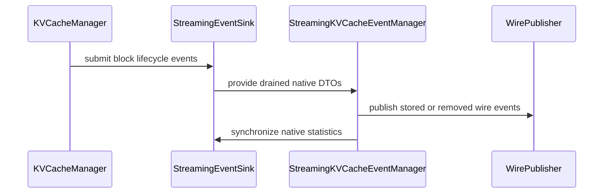

# [PR #19359] [None][feat] support streaming KV events with C++ backend

source: https://github.com/NVIDIA/TensorRT-LLM/pull/19359
state: open | updated: 2026-09-22T23:45:06Z
labels: 

## 正文

<!-- This is an auto-generated comment: release notes by coderabbit.ai -->
## Dev Engineer Review

The PR adds native C++ streaming KV-cache events with lifecycle filtering, event coalescing, bounded buffering, statistics, and multimodal metadata. Nanobind exposes the native sink and event DTOs. Python converts DTOs into `BlockStored` and `BlockRemoved` events.

The C++ backend uses the native sink. The Python backend retains its existing event path. Verify event ordering, overflow handling, shutdown flushing, lifecycle selection, multimodal key alignment, and API compatibility.

## QA Engineer Review

Changed tests cover native stored and removed events, event coalescing, payload conversion, lifecycle filtering, statistics, multimodal metadata, backend validation, attention-layer window filtering, unpublished-parent drops, and negative lifecycle IDs.

No changed test-list files are present in the supplied change summary. Registration in CI or manual-QA lists and current test results are not established. Coverage verdict: **needs follow-up**.

## Per-File QA Perspective

- `cpp/tensorrt_llm/batch_manager/kv_cache_manager_v2/CMakeLists.txt`: Adds event sources to the build. Verify compilation and linking.
- `cpp/tensorrt_llm/batch_manager/kv_cache_manager_v2/streamingEventSink.cpp`: Adds filtering, coalescing, bounded buffering, removal handling, and statistics. Verify invalid, duplicate, multimodal, orphan, and overflow cases.
- `cpp/tensorrt_llm/batch_manager/kv_cache_manager_v2/streamingEventSink.h`: Defines native event data and sink APIs. Verify binding compatibility and constructor defaults.
- `cpp/tensorrt_llm/batch_manager/kv_cache_manager_v2/eventData.cpp`: Decodes tokens, digests, and multimodal metadata. Verify hexadecimal encoding and block context.
- `cpp/tensorrt_llm/batch_manager/kv_cache_manager_v2/eventData.h`: Adds shared event-token and multimodal-key types. Verify parity with Python event structures.
- `cpp/tensorrt_llm/batch_manager/kv_cache_manager_v2/eventManager.cpp`: Uses shared event decoding for stored blocks. Verify cache metadata and event payloads.
- `cpp/tensorrt_llm/batch_manager/kv_cache_manager_v2/eventManager.h`: Removes duplicate event-data declarations. Verify dependent C++ interfaces.
- `cpp/tensorrt_llm/nanobind/batch_manager/kvCacheManagerV2.cpp`: Exposes sink types, DTOs, statistics, and sink inputs. Verify binding signatures and accepted event-sink types.
- `tensorrt_llm/_torch/pyexecutor/kv_cache_manager_v2.py`: Moves backend-specific sink selection into the event manager. Verify C++ selection and attention-layer filtering.
- `tensorrt_llm/_torch/pyexecutor/kv_cache_events.py`: Adds backend-specific sources and native DTO conversion. Verify flushing, shutdown, statistics, digest handling, and removal behavior.
- `tensorrt_llm/runtime/kv_cache_manager_v2/__init__.py`: Exports native event types for non-Python backends. Verify imports and `__all__`.
- `tensorrt_llm/runtime/kv_cache_manager_v2/__init__.pyi`: Declares native event types and accepted manager inputs. Verify stub and binding parity.
- `tensorrt_llm/runtime/kv_cache_manager_v2/_introspection.py`: Adds native sink test helpers. Verify event forwarding and unavailable-backend errors.
- `docs/source/features/kvcache.md`: Documents the streaming event contract and multimodal token representation. Verify backend constraints and consumer requirements.
- `tests/unittest/_torch/executor/kv_cache/test_kv_cache_manager_v2.py`: Covers attention-layer window filtering without private backend state. Test-list registration is not established.
- `tests/unittest/kv_cache_manager_v2_tests/test_kv_cache_event_manager.py`: Covers native event handling, unpublished-parent drops, and negative lifecycle IDs. Test-list registration is not established.
- `tests/unittest/kv_cache_manager_v2_tests/test_streaming_kv_events.py`: Covers stored and removed events, multimodal payloads, backend validation, and parallelism constraints. Test-list registration is not established.
<!-- end of auto-generated comment: release notes by coderabbit.ai -->

## Description

The Python KV cache manager backend is being removed, but the streaming KV-event publisher introduced by #17023 currently depends on Python-side KV manager events.

This change keeps streaming KV events available with the C++ KV cache manager V2 backend:

- Add a native `StreamingEventSink` that captures stored and removed block events as compact C++ DTOs.
- Expose batched DTO draining through nanobind.
- Translate the DTOs to Python `BlockStored` and `BlockRemoved` msgspec structures and reuse the existing serialization and publisher path.
- Select the native event lifecycle automatically when the C++ backend is active while preserving the Python backend behavior.
- Add unit coverage and update the KV-cache documentation.

The boundary intentionally remains semantic rather than serialized:

```text
C++ KV cache manager -> native event DTOs -> nanobind -> Python BlockStored/BlockRemoved -> existing publisher
```


## Multimodal wire compatibility

**Breaking change for V2 multimodal streaming consumers:** previously, streaming `token_ids` contained integers and digest-bearing blocks were suppressed. This PR can emit hexadecimal digest strings in `token_ids` and add `mm_keys` to `BlockStored`. Consumers that assume every token ID is an integer are incompatible. Text-only payloads are unchanged.

The final cross-project interface is still being finalized by [Dynamo #15095](https://github.com/ai-dynamo/dynamo/pull/15095) and [TensorRT-LLM #19529](https://github.com/NVIDIA/TensorRT-LLM/pull/19529). We will revisit multimodal streaming handling separately after both PRs merge, when the interface is finalized, rather than define that final contract in this DTO/backend PR.

## Test Coverage

- Native C++ library and nanobindings build: passed.
- Native KV-event manager tests: 55 passed.
- Legacy Python streaming-event tests: 34 passed.
- C++ backend lifecycle regression: 1 passed, 133 deselected.
- Earlier Dynamo two-worker KV-aware routing E2E with the C++ backend and ZMQ events: 1 passed in 84.31 seconds; both workers received stored-block state. This was not rerun for the source-ownership refactor.
- Relevant formatting, lint, and pre-commit checks: passed.

## PR Checklist

Please review the following before submitting your PR:
- PR description clearly explains what and why. If using CodeRabbit's summary, please make sure it makes sense.
- PR Follows [TRT-LLM CODING GUIDELINES](https://github.com/NVIDIA/TensorRT-LLM/blob/main/CODING_GUIDELINES.md) to the best of your knowledge.
- Test cases are provided for new code paths (see [test instructions](https://github.com/NVIDIA/TensorRT-LLM/tree/main/tests#1-how-does-the-ci-work)).
- If PR introduces API changes, an appropriate PR label is added - either `api-compatible` or `api-breaking`. For `api-breaking`, include `BREAKING` in the PR title.
- Any new dependencies have been scanned for license and vulnerabilities.
- [CODEOWNERS](https://github.com/NVIDIA/TensorRT-LLM/blob/main/.github/CODEOWNERS) updated if ownership changes.
- Documentation updated as needed.
- Update [tava architecture diagram](https://github.com/NVIDIA/TensorRT-LLM/blob/main/.github/tava_architecture_diagram.md) if there is a significant design change in PR.
- The reviewers assigned automatically/manually are appropriate for the PR.

- [x] Please check this after reviewing the above items as appropriate for this PR.

## GitHub Bot Help

To see a list of available CI bot commands, comment `/bot help`.

## 评论 (7)

### coderabbitai[bot] · 2026-09-21

<!-- This is an auto-generated comment: summarize by coderabbit.ai -->
<!-- review_stack_entry_start -->

<a href="https://app.coderabbit.ai/change-stack/NVIDIA/TensorRT-LLM/pull/19359"></a>

Navigate logical layers of code changes, visualize relationships, and explore their blast radius.

<!-- review_stack_entry_end -->
<!-- This is an auto-generated comment: review paused by coderabbit.ai -->

> [!NOTE]
> ## Reviews paused
> 
> It looks like this branch is under active development. To avoid overwhelming you with review comments due to an influx of new commits, CodeRabbit has automatically paused this review. You can configure this behavior by changing the `reviews.auto_review.auto_pause_after_reviewed_commits` setting.
> 
> Use the following commands to manage reviews:
> - `@coderabbitai resume` to resume automatic reviews.
> - `@coderabbitai review` to trigger a single review.
> 
> Use the checkboxes below for quick actions:
> - [ ] <!-- {"checkboxId":"7f6cc2e2-2e4e-497a-8c31-c9e4573e93d1"} --> ▶️ Resume reviews
> - [ ] <!-- {"checkboxId":"e9bb8d72-00e8-4f67-9cb2-caf3b22574fe"} --> 🔍 Trigger review

<!-- end of auto-generated comment: review paused by coderabbit.ai -->
<!-- recent_review_start -->

No actionable comments were generated in the recent review. 🎉

<details>
<summary>ℹ️ Recent review info</summary>

<details>
<summary>⚙️ Run configuration</summary>

**Configuration used**: Repository: NVIDIA/TensorRT-LLM/.coderabbit.yaml

**Review profile**: CHILL

**Plan**: Enterprise

**Run ID**: `fca6fac8-f25a-4524-9c6a-6c6e7c535626`

</details>

<details>
<summary>📥 Commits</summary>

Reviewing files that changed from the base of the PR and between b3971b0ee9300dc88e6f5f7aca75c3ff19c4a38d and 99f18104154966e40af76d24855ebef25750e9bd.

</details>

<details>
<summary>📒 Files selected for processing (1)</summary>

* `cpp/tensorrt_llm/batch_manager/kv_cache_manager_v2/eventData.h`

</details>

**Included review availability:** Your plan provides up to 12 included reviews per hour; 11 remain after this review.

</details>

---


<!-- recent_review_end -->
<!-- walkthrough_start -->

## Walkthrough

The PR adds native C++ streaming events for KV-cache blocks. It exposes the sink through bindings, integrates native event draining with Python publication, supports both V2 backends, and adds multimodal event handling and tests.

### Changes

**Native streaming KV-cache events**

|Layer / File(s)|Summary|
|---|---|
|**Event data and collection** <br> `cpp/tensorrt_llm/batch_manager/kv_cache_manager_v2/*`|Defines event payloads, digest and multimodal decoding, lifecycle filtering, event coalescing, bounded pending storage, and statistics.|
|**Native bindings and exports** <br> `cpp/tensorrt_llm/nanobind/batch_manager/kvCacheManagerV2.cpp`, `tensorrt_llm/runtime/kv_cache_manager_v2/*`|Exposes the sink and event data, adds event-submission helpers, exports runtime symbols, and accepts the common `EventSink` interface.|
|**Python event integration** <br> `tensorrt_llm/_torch/pyexecutor/kv_cache_events.py`, `tensorrt_llm/_torch/pyexecutor/kv_cache/kv_cache_manager_v2.py`|Selects the backend-specific sink, propagates it through cache-manager construction, drains native events, converts DTOs to wire events, and synchronizes statistics.|
|**Validation and documented backend support** <br> `docs/source/features/kvcache.md`, `tests/unittest/...`|Documents C++ backend support and tests multimodal payloads, lifecycle filtering, event counters, bounded publication, event-window filtering, and backend validation.|

<!-- change_assessment_start -->
**Priority:** ➖ Normal

**Estimated code review effort:** 4 (Complex) | ~45 minutes

<!-- change_assessment_commit:"99f18104154966e40af76d24855ebef25750e9bd" -->
**Change:** Feature
<!-- change_assessment_end -->

### Sequence Diagram(s)



**Suggested reviewers:** `juney-nvidia`

<!-- walkthrough_end -->
<!-- final_review_risk_start -->
**Merge Risk:** _⚪ Minimal_ · up to `99f18`
<!-- final_review_risk_coverage:{"sourceCommitId":"99f18104154966e40af76d24855ebef25750e9bd","coveredCommitId":"99f18104154966e40af76d24855ebef25750e9bd","kind":"reviewed"} -->

This change declares the native KV-event data types and decoder interface consistently with their implementation and consumer. No merge-blocking risk is identified.
<!-- final_review_risk_end -->
<!-- pre_merge_checks_walkthrough_start -->

<details>
<summary>🚥 Pre-merge checks | ✅ 4 | ❌ 1</summary>

### ❌ Failed checks (1 warning)

|     Check name     | Status     | Explanation                                                                                                                                                                                   | Resolution                                                                         |
| :----------------: | :--------- | :-------------------------------------------------------------------------------------------------------------------------------------------------------------------------------------------- | :--------------------------------------------------------------------------------- |
| Docstring Coverage | ⚠️ Warning | Docstring coverage is 16.07% which is insufficient. The required threshold is 80.00%. Docstring coverage is scoped to functions touched by this diff. Analyzed 112 functions across 15 files. | Write docstrings for the functions missing them to satisfy the coverage threshold. |

<details>
<summary>✅ Passed checks (4 passed)</summary>

|         Check name         | Status   | Explanation                                                                                                                                                                                               |
| :------------------------: | :------- | :-------------------------------------------------------------------------------------------------------------------------------------------------------------------------------------------------------- |
|         Title check        | ✅ Passed | The title clearly and concisely describes the main change: adding streaming KV-event support for the C++ backend.                                                                                         |
|      Description check     | ✅ Passed | The description includes the required Description, Test Coverage, and PR Checklist sections. It explains the motivation, implementation, multimodal compatibility impact, tests, and known E2E limitatio… |
|     Linked Issues check    | ✅ Passed | Check skipped because no linked issues were found for this pull request.                                                                                                                                  |
| Out of Scope Changes check | ✅ Passed | Check skipped because no linked issues were found for this pull request.                                                                                                                                  |

</details>

</details>

<!-- pre_merge_checks_walkthrough_end -->

- [ ] <!-- {"checkboxId":"585bb3f6-faf5-4dbf-96d2-74e382adf19a"} --> Fix all pre-merge checks with AI
<!-- finishing_touch_checkbox_start -->

<details>
<summary>✨ Finishing Touches</summary>

<details open>
<summary>🧪 Generate unit tests (beta)</summary>

- [ ] <!-- {"checkboxId": "f47ac10b-58cc-4372-a567-0e02b2c3d479", "radioGroupId": "utg-output-choice-group-unknown_comment_id"} --> Create a new PR

</details>

</details>

<!-- finishing_touch_checkbox_end -->
<!-- tips_start -->

---


<sub>Comment `@coderabbitai help` to get the list of available commands.</sub>

<!-- tips_end -->

### tanmayv25 · 2026-09-22

/bot run --disable-fail-fast


### tensorrt-cicd · 2026-09-22

[PR_Github #75118](https://nv/trt-llm-cicd/job/helpers/job/PR_Github/75118/) [ run ] triggered by Bot. Commit: `7f9e71b` [Link to invocation](https://github.com/NVIDIA/TensorRT-LLM/pull/19359#issuecomment-5785022820)

### tensorrt-cicd · 2026-09-22

[PR_Github #75118](https://nv/trt-llm-cicd/job/helpers/job/PR_Github/75118/) [ run ] completed with state `FAILURE`. Commit: `7f9e71b` 
[/LLM/main/L0_MergeRequest_PR pipeline #61871](https://nv/trt-llm-cicd/job/main/job/L0_MergeRequest_PR/61871/) completed with status: 'FAILURE'

[CI Report](http://tensorrt-llm.tensorrt-llm-ci-report.sc2-paas.nvidia.com/?job=%2FLLM%2Fmain%2FL0_MergeRequest_PR&build=61871)

⚠️ **Action Required:**
- Please check the failed tests and fix your PR
- If you cannot view the failures, ask the CI triggerer to share details
- Once fixed, request an NVIDIA team member to trigger CI again

[CI Agent Failure Analysis](https://pbss.s8k.io/v1/AUTH_svc_tensorrt/sw-tensorrt-ci-analysis/LLM/main/L0_MergeRequest_PR/61871/failure_analysis.html)


[Link to invocation](https://github.com/NVIDIA/TensorRT-LLM/pull/19359#issuecomment-5785022820)

### GuanLuo · 2026-09-23

/bot run

### GuanLuo · 2026-09-23

Fixed the x86_64/SBSA `-Wmismatched-tags` build failure in `99f1810415` by aligning the `Block` forward declaration with its canonical `struct` definition. Verified the affected header combination with Clang on Linux using `-Wmismatched-tags -Werror`; the compile passes. A fresh `/bot run` is in progress.

### tensorrt-cicd · 2026-09-23

[PR_Github #75203](https://nv/trt-llm-cicd/job/helpers/job/PR_Github/75203/) [ run ] triggered by Bot. Commit: `99f1810` [Link to invocation](https://github.com/NVIDIA/TensorRT-LLM/pull/19359#issuecomment-5789647273)

## Review (7)

### zhaoyangwang-nvidia · 2026-09-21 · COMMENTED

(no text)

### zhaoyangwang-nvidia · 2026-09-21 · APPROVED

Approve with nits.

### GuanLuo · 2026-09-22 · COMMENTED

(no text)

### GuanLuo · 2026-09-22 · COMMENTED

(no text)

### GuanLuo · 2026-09-22 · COMMENTED

(no text)

### GuanLuo · 2026-09-22 · COMMENTED

(no text)

### GuanLuo · 2026-09-22 · COMMENTED

(no text)
