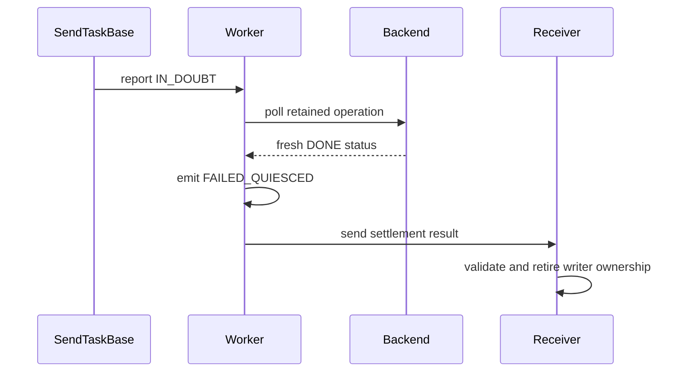

# [PR #19378] [None][fix] Retire KV transfer ownership after late backend completion

source: https://github.com/NVIDIA/TensorRT-LLM/pull/19378
state: open | updated: 2026-09-23T03:55:58Z
labels: ci: full pre-merge approved

## 正文

## Summary

Allow an ownership-enabled Python KV transfer that became `IN_DOUBT` to retire safely when its **exact retained backend operation** later proves DONE. Logical failure/cancellation stays unchanged, and admission quarantine remains closed.

Depends on #19377; merge it first. Both target `main` and were rebased onto `1a36f4fed`; review this PR's [isolated change](https://github.com/chienchunhung/TensorRT-LLM/compare/6f0b43a23dc86516c07beaf6f56ff75fb442168e...f372733fe8906c0f4c1225d8ac5278b8627e9c9a).

## Major changes

- [Same-handle settlement](https://github.com/chienchunhung/TensorRT-LLM/blob/f372733fe8906c0f4c1225d8ac5278b8627e9c9a/tensorrt_llm/_torch/disaggregation/native/transfer.py#L674): recheck retained request/status identity, require positive DONE, and retire the physical claim idempotently.
- [Ordered reporting and cleanup](https://github.com/chienchunhung/TensorRT-LLM/blob/f372733fe8906c0f4c1225d8ac5278b8627e9c9a/tensorrt_llm/_torch/disaggregation/native/transfer.py#L1125): retry `IN_DOUBT → FAILED_QUIESCED` evidence in worker order; prevent later failure reports overtaking it; release retained storage once.
- [Receiver settlement](https://github.com/chienchunhung/TensorRT-LLM/blob/f372733fe8906c0f4c1225d8ac5278b8627e9c9a/tensorrt_llm/_torch/disaggregation/native/transfer.py#L364): retain sibling/publication/local-completion gates and permanently reject invalid evidence. `FAILED_QUIESCED` is physical proof, not delivery success.

Existing opt-in bridge only: matching binaries/configuration, unique request IDs, one immutable selected ADP writer group, and no retry/reroute remain required. No new activation profile, deadline, abort, or restart policy; unproven operations remain retained.

## Verification

- **Unit-test delta:** [36 new cases / 15 test functions](https://github.com/chienchunhung/TensorRT-LLM/blob/f372733fe8906c0f4c1225d8ac5278b8627e9c9a/tests/unittest/disaggregated/test_transfer_late_settlement.py) cover exact-handle identity, duplicate/concurrent settlement, report ordering/retries, sibling retention and shutdown; **12 cases** check unchanged failure/cancellation outcomes.
- **Native Linux CI, pre-rebase head `5760bc13b`:** all **36/36 new cases passed on each x86 and ARM stage** ([results #61069](https://nv/trt-llm-cicd/job/main/job/L0_MergeRequest_PR/61069/)).
- **Current head `f372733fe8`:** [full CI #61879](https://nv/trt-llm-cicd/job/main/job/L0_MergeRequest_PR/61879/) is running.
- **Changed-line unit-test coverage:** not yet measured in native CI; measure this PR's isolated delta against #19377, not the combined stack.

These CPU unit tests do not establish real NIXL/CUDA or multi-rank qualification.

Rebase is patch-equivalent. Isolated size, excluding #19377: **216 production + 527 test lines changed**.

<!-- This is an auto-generated comment: release notes by coderabbit.ai -->

## Dev Engineer Review

- Separates committed logical outcomes from physical settlement state.
- Retains `IN_DOUBT` ownership until the exact backend operation reports `DONE`.
- Adds `FAILED_QUIESCED`, identity validation, idempotent writer settlement, ordered retries, and receiver-side settlement checks.
- Keeps failure and cancellation outcomes stable after late reports, sibling events, or session termination.
- Updates `TaskHandle` construction and removes fallback outcome inference.
- Requires compatibility checks for the new `FAILED_QUIESCED` wire status.
- Full-CI completion and review-finding counts are unavailable.

## QA Engineer Review

- Modified `test_peer_fetch.py`, `test_task_handle.py`, and `test_transceiver_bounded_polling.py`.
- Added `test_transfer_late_settlement.py`.
- Modified `test_transfer_ownership_regressions.py`.
- Covers 36 new or updated cases across logical outcome stability, late settlement, ownership quarantine, identity validation, retry ordering, cancellation, failure preservation, shutdown, queue routing, auxiliary transfers, and exactly-once resource release.
- No `tests/integration/test_lists/test-db/` or `tests/integration/test_lists/qa/` files changed, so no list-entry update is required.
- Coverage verdict: needs follow-up. The tests are CPU-only and do not validate real NIXL, CUDA, or multi-rank behavior. Current full-CI status is unavailable.

## Per-File QA Perspective

- `tensorrt_llm/_torch/disaggregation/base/backend.py`: Verify stable logical outcomes while report state changes.
- `tensorrt_llm/_torch/disaggregation/native/handle.py`: Verify stable terminal results and the updated typed constructor.
- `tensorrt_llm/_torch/disaggregation/native/transfer.py`: Verify `FAILED_QUIESCED` encoding, ownership validation, ordered settlement, shutdown blocking, and unchanged failure or cancellation behavior.
- `tests/unittest/disaggregated/test_peer_fetch.py`: Covers native receive tasks, admission failures, cancellation metadata, and failure causes. No integration test-list entry applies.
- `tests/unittest/disaggregated/test_task_handle.py`: Covers ownership, terminal outcomes, late reports, cancellation, sibling events, scatter completion, and resource draining. No integration test-list entry applies.
- `tests/unittest/disaggregated/test_transceiver_bounded_polling.py`: Covers logical-outcome setup and bounded polling behavior. No integration test-list entry applies.
- `tests/unittest/disaggregated/test_transfer_late_settlement.py`: Covers late settlement, sender and receiver paths, KV and auxiliary transfers, retries, quarantine, and shutdown. No integration test-list entry applies.
- `tests/unittest/disaggregated/test_transfer_ownership_regressions.py`: Covers ownership, cancellation, shutdown, publication, and auxiliary settlement regressions. No integration test-list entry applies.

<!-- end of auto-generated comment: release notes by coderabbit.ai -->

## 评论 (8)

### chienchunhung · 2026-09-18

/bot run --disable-fail-fast

### tensorrt-cicd · 2026-09-18

[PR_Github #74245](https://nv/trt-llm-cicd/job/helpers/job/PR_Github/74245/) [ run ] triggered by Bot. Commit: `5760bc1` [Link to invocation](https://github.com/NVIDIA/TensorRT-LLM/pull/19378#issuecomment-5723131084)

### tensorrt-cicd · 2026-09-18

[PR_Github #74245](https://nv/trt-llm-cicd/job/helpers/job/PR_Github/74245/) [ run ] completed with state `FAILURE`. Commit: `5760bc1` 
[/LLM/main/L0_MergeRequest_PR pipeline #61069](https://nv/trt-llm-cicd/job/main/job/L0_MergeRequest_PR/61069/) completed with status: 'FAILURE'

[CI Report](http://tensorrt-llm.tensorrt-llm-ci-report.sc2-paas.nvidia.com/?job=%2FLLM%2Fmain%2FL0_MergeRequest_PR&build=61069)

⚠️ **Action Required:**
- Please check the failed tests and fix your PR
- If you cannot view the failures, ask the CI triggerer to share details
- Once fixed, request an NVIDIA team member to trigger CI again

[CI Agent Failure Analysis](https://pbss.s8k.io/v1/AUTH_svc_tensorrt/sw-tensorrt-ci-analysis/LLM/main/L0_MergeRequest_PR/61069/failure_analysis.html)

[Link to invocation](https://github.com/NVIDIA/TensorRT-LLM/pull/19378#issuecomment-5723131084)

### chienchunhung · 2026-09-22

/bot run --disable-fail-fast

### tensorrt-cicd · 2026-09-22

[PR_Github #75126](https://nv/trt-llm-cicd/job/helpers/job/PR_Github/75126/) [ run ] triggered by Bot. Commit: `f372733` [Link to invocation](https://github.com/NVIDIA/TensorRT-LLM/pull/19378#issuecomment-5785807935)

### coderabbitai[bot] · 2026-09-23

<!-- This is an auto-generated comment: summarize by coderabbit.ai -->
<!-- review_stack_entry_start -->

Navigate logical layers of code changes, visualize relationships, and explore their blast radius.

<!-- review_stack_entry_end -->
<!-- recent_review_start -->

No actionable comments were generated in the recent review. 🎉

ℹ️ Recent review info

⚙️ Run configuration

**Configuration used**: Repository: NVIDIA/TensorRT-LLM/.coderabbit.yaml

**Review profile**: CHILL

**Plan**: Enterprise

**Run ID**: `85903da2-eda8-4756-95e9-a7668cdca635`

📥 Commits

Reviewing files that changed from the base of the PR and between 134fa245fe7fc731f5207d9152e36c6cd68643fc and f372733fe8906c0f4c1225d8ac5278b8627e9c9a.

📒 Files selected for processing (8)

* `tensorrt_llm/_torch/disaggregation/base/backend.py`
* `tensorrt_llm/_torch/disaggregation/native/handle.py`
* `tensorrt_llm/_torch/disaggregation/native/transfer.py`
* `tests/unittest/disaggregated/test_peer_fetch.py`
* `tests/unittest/disaggregated/test_task_handle.py`
* `tests/unittest/disaggregated/test_transceiver_bounded_polling.py`
* `tests/unittest/disaggregated/test_transfer_late_settlement.py`
* `tests/unittest/disaggregated/test_transfer_ownership_regressions.py`

**Included review availability:** Your plan provides up to 12 included reviews per hour; 10 remain after this review.

---

<!-- recent_review_end -->
<!-- walkthrough_start -->

## Walkthrough

The transfer system now commits task outcomes separately from report progress and physical quiescence. It retains ambiguous transfers until backend settlement, adds `FAILED_QUIESCED`, preserves report ordering, and expands tests for cancellation, failure, ownership, and late settlement.

### Changes

**Transfer outcomes and settlement**

|Layer / File(s)|Summary|
|---|---|
|**Logical outcome arbitration and polling**   `tensorrt_llm/_torch/disaggregation/base/backend.py`, `tensorrt_llm/_torch/disaggregation/native/handle.py`, `tensorrt_llm/_torch/disaggregation/native/transfer.py`, `tests/unittest/disaggregated/test_peer_fetch.py`, `tests/unittest/disaggregated/test_task_handle.py`, `tests/unittest/disaggregated/test_transceiver_bounded_polling.py`|Tasks and sessions commit logical transfer, failure, or cancellation outcomes. `TaskHandle.poll()` reads the committed outcome and preserves its cause or peer attribution while report obligations continue to change.|
|**Physical ownership and settlement state**   `tensorrt_llm/_torch/disaggregation/native/transfer.py`, `tests/unittest/disaggregated/test_transfer_late_settlement.py`, `tests/unittest/disaggregated/test_transfer_ownership_regressions.py`|In-doubt operations remain non-drained until fresh backend completion evidence arrives. `FAILED_QUIESCED` settlement validates prior evidence, retires writer ownership, and preserves the original logical outcome.|
|**Deferred reporting and worker ordering**   `tensorrt_llm/_torch/disaggregation/native/transfer.py`, `tests/unittest/disaggregated/test_transfer_late_settlement.py`|Workers retain ambiguous KV and auxiliary results, retry reports in order, poll retained backend status, and reject shutdown while settlement reports remain pending.|

<!-- change_assessment_start -->
**Priority:** ➖ Normal

**Estimated code review effort:** 4 (Complex) | ~60 minutes

<!-- change_assessment_commit:"f372733fe8906c0f4c1225d8ac5278b8627e9c9a" -->
**Change:** Bug fix
<!-- change_assessment_end -->

### Sequence Diagram(s)

**Suggested reviewers:** `bowenfu`

<!-- walkthrough_end -->
<!-- pre_merge_checks_walkthrough_start -->

🚥 Pre-merge checks | ✅ 4 | ❌ 1

### ❌ Failed checks (1 warning)

|     Check name     | Status     | Explanation                                                                                                                                                                                  | Resolution                                                                         |
| :----------------: | :--------- | :------------------------------------------------------------------------------------------------------------------------------------------------------------------------------------------- | :--------------------------------------------------------------------------------- |
| Docstring Coverage | ⚠️ Warning | Docstring coverage is 20.34% which is insufficient. The required threshold is 80.00%. Docstring coverage is scoped to functions touched by this diff. Analyzed 118 functions across 8 files. | Write docstrings for the functions missing them to satisfy the coverage threshold. |

✅ Passed checks (4 passed)

|         Check name         | Status   | Explanation                                                                                                                                                                                               |
| :------------------------: | :------- | :-------------------------------------------------------------------------------------------------------------------------------------------------------------------------------------------------------- |
|         Title check        | ✅ Passed | The title clearly identifies a fix for retiring KV transfer ownership after late backend completion. It follows the required [None][fix] format and matches the main change.                              |
|      Description check     | ✅ Passed | The description clearly explains the problem, solution, implementation details, dependencies, test coverage, and CI status. It does not use the template headings exactly and omits the explicit PR Chec… |
|     Linked Issues check    | ✅ Passed | Check skipped because no linked issues were found for this pull request.                                                                                                                                  |
| Out of Scope Changes check | ✅ Passed | Check skipped because no linked issues were found for this pull request.                                                                                                                                  |

<!-- pre_merge_checks_walkthrough_end -->

- [ ] <!-- {"checkboxId":"585bb3f6-faf5-4dbf-96d2-74e382adf19a"} --> Fix all pre-merge checks with AI
<!-- finishing_touch_checkbox_start -->

✨ Finishing Touches

🧪 Generate unit tests (beta)

- [ ] <!-- {"checkboxId": "f47ac10b-58cc-4372-a567-0e02b2c3d479", "radioGroupId": "utg-output-choice-group-unknown_comment_id"} --> Create a new PR

<!-- finishing_touch_checkbox_end -->
<!-- tips_start -->

---

Comment `@coderabbitai help` to get the list of available commands.

<!-- tips_end -->

### tensorrt-cicd · 2026-09-23

[PR_Github #75126](https://nv/trt-llm-cicd/job/helpers/job/PR_Github/75126/) [ run ] completed with state `FAILURE`. Commit: `f372733` 
[/LLM/main/L0_MergeRequest_PR pipeline #61879](https://nv/trt-llm-cicd/job/main/job/L0_MergeRequest_PR/61879/) completed with status: 'FAILURE'

[CI Report](http://tensorrt-llm.tensorrt-llm-ci-report.sc2-paas.nvidia.com/?job=%2FLLM%2Fmain%2FL0_MergeRequest_PR&build=61879)

⚠️ **Action Required:**
- Please check the failed tests and fix your PR
- If you cannot view the failures, ask the CI triggerer to share details
- Once fixed, request an NVIDIA team member to trigger CI again

[CI Agent Failure Analysis](https://pbss.s8k.io/v1/AUTH_svc_tensorrt/sw-tensorrt-ci-analysis/LLM/main/L0_MergeRequest_PR/61879/failure_analysis.html)

[Link to invocation](https://github.com/NVIDIA/TensorRT-LLM/pull/19378#issuecomment-5785807935)

### github-actions[bot] · 2026-09-23

Automatically added "ci: full pre-merge approved" because this PR has satisfied the required GitHub review approvals. Unresolved review conversations and other required checks remain independent merge requirements.

## Review (1)

### Shixiaowei02 · 2026-09-23 · APPROVED

(no text)
