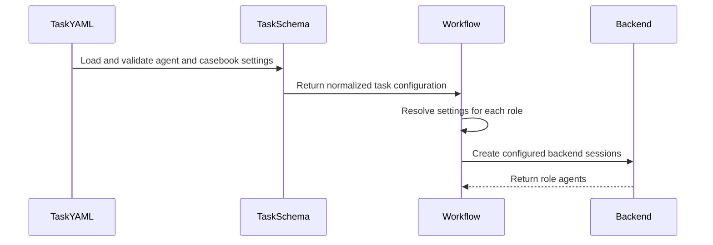

# [PR #19522] [None][feat] agent flow: add per-role backend routing & casebook switch

source: https://github.com/NVIDIA/TensorRT-LLM/pull/19522
state: open | updated: 2026-09-23T03:35:19Z
labels: ci: full pre-merge approved

## 正文

## What changed

- Add per-role backend, model, reasoning-effort, and external MCP routing for the `perf-analyze` and `perf-optimize` workflows.
- Add an A/B experiment switch for the optimization casebook. The casebook remains enabled by default; disabling it removes the casebook instructions and blocks both the bare and fully-qualified casebook skills for Claude Code and Codex sessions.
- Keep the backend implementation aligned with the backend-independent tool and required-tool policy introduced by #19236.

## Usage

### Per-role backend routing

Add an optional top-level `agents` block to either workflow's `task.yaml`. Values under `defaults` apply to every role, while `roles.<name>` overrides individual fields:

```yaml
agents:
  defaults:
    backend: claude-code
    model: claude-opus-5
    reasoning_effort: max
  roles:
    projector:
      backend: claude-code
      model: claude-fable-5-1
      reasoning_effort: ultracode
    analyzer:
      backend: claude-code
      model: claude-fable-5-1
      reasoning_effort: ultracode
```

Omitting `agents` preserves the historical backend/model assignment. On resume, the normalized `task.yaml` saved in the workspace remains authoritative.

### Casebook experiment switch

The optimization casebook is enabled by default. For a control arm in an A/B experiment, disable it in `task.yaml`:

```yaml
casebook:
  enabled: false
```

When disabled, the workflow omits casebook-specific instructions and prevents agents from invoking `perf-optimization-casebook` or `trtllm-agent-toolkit:perf-optimization-casebook`. Omit the block, or set `enabled: true`, for the treatment arm.

## Validation

- 609 focused agent-flow tests passed.
- Commit-time pre-commit checks passed, including ruff, formatting, YAML/TOML validation, merge-conflict checks, and DCO validation.

## Related

- Builds on the backend-independent agent-flow abstractions merged in #19236.


<!-- This is an auto-generated comment: release notes by coderabbit.ai -->

## Dev Engineer Review

- Adds per-role backend, model, reasoning-effort, and MCP routing for both performance workflows.
- Preserves historical defaults when `agents` is omitted and uses checkpointed `task.yaml` during resume.
- Adds enabled-by-default casebook control. Disabling it removes prompt guidance and blocks casebook skills in Claude Code and Codex.
- Main risk areas are backend-specific model defaults, resume configuration authority, and consistent skill blocking across all roles.
- Review finding counts are unavailable from the supplied evidence.

## QA Engineer Review

- Adds tests for agent routing, validation errors, backend defaults, casebook configuration, prompt behavior, workflow wiring, resume behavior, checkpoint handling, MCP settings, and disabled skills.
- Updates progress-tool tests for direct YAML and text responses.
- No changed test-list entries were found in the supplied repository output.
- Coverage verdict: sufficient based on the supplied test scope.

## Per-File QA Perspective

- `agent-flow/agent_flow/agent_runtime.py`: Verify role overrides, backend model selection, MCP propagation, and validation errors.
- `agent-flow/agent_flow/config.py`: Verify omitted reasoning and disabled-skill settings retain historical defaults.
- `agent-flow/agent_flow/backends/__init__.py`: Verify configuration reaches Claude Code and Codex.
- `agent-flow/agent_flow/backends/claude_code.py`: Verify reasoning effort and disabled skills reach SDK requests.
- `agent-flow/agent_flow/backends/codex.py`: Verify Codex skill-disable overrides and reasoning effort.
- `agent-flow/agent_flow/workflows/perf_analyze/task_schema.py`: Verify casebook defaults and supported-role validation.
- `agent-flow/agent_flow/workflows/perf_analyze/workflow.py`: Verify lazy role setup, tool retention, and casebook propagation.
- `agent-flow/agent_flow/workflows/perf_optimize/task_schema.py`: Verify all optimize roles remain valid.
- `agent-flow/agent_flow/workflows/perf_optimize/workflow.py`: Verify routing, resume behavior, checkpoint handling, and casebook propagation.
- `agent-flow/agent_flow/workflows/*/cli.py`: Verify task configuration reaches prompt construction.
- `agent-flow/agent_flow/workflows/*/prompts/*.py`: Verify casebook instructions appear or disappear as configured.
- `agent-flow/agent_flow/workflows/*/README.md` and `task.example.yaml`: Verify documented configuration matches runtime defaults.
- `agent-flow/tests/test_agent_runtime.py`: Covers routing and validation; no test-list entry was found.
- `agent-flow/tests/test_backends.py`: Covers backend configuration propagation; no test-list entry was found.
- `agent-flow/tests/test_codex_backend.py`: Covers Codex overrides; no test-list entry was found.
- `agent-flow/tests/workflows/perf_analyze/*`: Covers progress output, prompts, schema validation, and workflow wiring; no test-list entries were found.
- `agent-flow/tests/workflows/perf_optimize/*`: Covers progress output, prompts, schema validation, and workflow behavior; no test-list entries were found.

<!-- end of auto-generated comment: release notes by coderabbit.ai -->

## 评论 (8)

### coderabbitai[bot] · 2026-09-22

<!-- This is an auto-generated comment: summarize by coderabbit.ai -->
<!-- review_stack_entry_start -->

<a href="https://app.coderabbit.ai/change-stack/NVIDIA/TensorRT-LLM/pull/19522"></a>

Navigate logical layers of code changes, visualize relationships, and explore their blast radius.

<!-- review_stack_entry_end -->
<!-- recent_review_start -->

No actionable comments were generated in the recent review. 🎉

<details>
<summary>ℹ️ Recent review info</summary>

<details>
<summary>⚙️ Run configuration</summary>

**Configuration used**: Repository: NVIDIA/TensorRT-LLM/.coderabbit.yaml

**Review profile**: CHILL

**Plan**: Enterprise

**Run ID**: `232f0257-b368-4840-a601-5f004e7c15aa`

</details>

<details>
<summary>📥 Commits</summary>

Reviewing files that changed from the base of the PR and between f7aeaef16348080a2d87fa80ee69f18936a78d93 and c4f6cc4b728b6746e32fd5bdf8795ba993c57012.

</details>

<details>
<summary>📒 Files selected for processing (31)</summary>

* `agent-flow/agent_flow/agent_runtime.py`
* `agent-flow/agent_flow/backends/__init__.py`
* `agent-flow/agent_flow/backends/claude_code.py`
* `agent-flow/agent_flow/backends/codex.py`
* `agent-flow/agent_flow/config.py`
* `agent-flow/agent_flow/workflows/perf_analyze/README.md`
* `agent-flow/agent_flow/workflows/perf_analyze/cli.py`
* `agent-flow/agent_flow/workflows/perf_analyze/prompts/__init__.py`
* `agent-flow/agent_flow/workflows/perf_analyze/prompts/_common.py`
* `agent-flow/agent_flow/workflows/perf_analyze/roles.py`
* `agent-flow/agent_flow/workflows/perf_analyze/task.example.yaml`
* `agent-flow/agent_flow/workflows/perf_analyze/task_schema.py`
* `agent-flow/agent_flow/workflows/perf_analyze/workflow.py`
* `agent-flow/agent_flow/workflows/perf_optimize/README.md`
* `agent-flow/agent_flow/workflows/perf_optimize/cli.py`
* `agent-flow/agent_flow/workflows/perf_optimize/prompts/__init__.py`
* `agent-flow/agent_flow/workflows/perf_optimize/roles.py`
* `agent-flow/agent_flow/workflows/perf_optimize/task.example.yaml`
* `agent-flow/agent_flow/workflows/perf_optimize/task_schema.py`
* `agent-flow/agent_flow/workflows/perf_optimize/workflow.py`
* `agent-flow/tests/test_agent_runtime.py`
* `agent-flow/tests/test_backends.py`
* `agent-flow/tests/test_codex_backend.py`
* `agent-flow/tests/workflows/perf_analyze/test_progress.py`
* `agent-flow/tests/workflows/perf_analyze/test_prompts.py`
* `agent-flow/tests/workflows/perf_analyze/test_task_schema.py`
* `agent-flow/tests/workflows/perf_analyze/test_workflow.py`
* `agent-flow/tests/workflows/perf_optimize/test_progress.py`
* `agent-flow/tests/workflows/perf_optimize/test_prompts.py`
* `agent-flow/tests/workflows/perf_optimize/test_task_schema.py`
* `agent-flow/tests/workflows/perf_optimize/test_workflow.py`

</details>

**Included review availability:** Your plan provides up to 12 included reviews per hour; 11 remain after this review.

</details>

---


<!-- recent_review_end -->
<!-- walkthrough_start -->

## Walkthrough

The PR adds per-role backend, model, reasoning, MCP-server, and disabled-skill configuration. It validates these settings for both workflows. It also adds casebook enablement controls, conditional prompts, lazy agent setup, resume handling, documentation, and tests.

### Changes

**Agent routing and backend controls**

|Layer / File(s)|Summary|
|---|---|
|**Runtime configuration and backend controls** <br> `agent-flow/agent_flow/agent_runtime.py`, `agent-flow/agent_flow/config.py`, `agent-flow/agent_flow/backends/*`, `agent-flow/tests/test_agent_runtime.py`, `agent-flow/tests/test_backends.py`, `agent-flow/tests/test_codex_backend.py`|Adds validated role configuration resolution. Backend configuration now carries reasoning effort and disabled skills. Claude Code and Codex apply these settings to SDK options, sessions, and skill restrictions.|

**Performance-analysis workflow**

|Layer / File(s)|Summary|
|---|---|
|**Task schema and prompt controls** <br> `agent-flow/agent_flow/workflows/perf_analyze/task_schema.py`, `agent-flow/agent_flow/workflows/perf_analyze/prompts/*`, `agent-flow/agent_flow/workflows/perf_analyze/cli.py`, `agent-flow/agent_flow/workflows/perf_analyze/roles.py`, `agent-flow/agent_flow/workflows/perf_analyze/README.md`, `agent-flow/tests/workflows/perf_analyze/test_task_schema.py`, `agent-flow/tests/workflows/perf_analyze/test_prompts.py`|Adds supported role validation and normalized `casebook.enabled` defaults. Prompt builders add explicit disabled-casebook guidance when requested.|
|**Workflow agent setup** <br> `agent-flow/agent_flow/workflows/perf_analyze/workflow.py`, `agent-flow/tests/workflows/perf_analyze/test_workflow.py`|Agents are configured after task validation from resolved role settings. Casebook skills and prompt instructions are omitted when disabled.|
|**Progress handler test updates** <br> `agent-flow/tests/workflows/perf_analyze/test_progress.py`|Tests now parse direct handler return values.|

**Performance-optimization workflow**

|Layer / File(s)|Summary|
|---|---|
|**Task schema and prompt controls** <br> `agent-flow/agent_flow/workflows/perf_optimize/task_schema.py`, `agent-flow/agent_flow/workflows/perf_optimize/prompts/*`, `agent-flow/agent_flow/workflows/perf_optimize/cli.py`, `agent-flow/agent_flow/workflows/perf_optimize/roles.py`, `agent-flow/agent_flow/workflows/perf_optimize/task.example.yaml`, `agent-flow/agent_flow/workflows/perf_optimize/README.md`, `agent-flow/tests/workflows/perf_optimize/test_task_schema.py`, `agent-flow/tests/workflows/perf_optimize/test_prompts.py`|Passes the eight optimization roles to shared validation. Documents agent routing and casebook settings. Prompt builders conditionally add disabled-casebook guidance.|
|**Workflow agent setup and resume behavior** <br> `agent-flow/agent_flow/workflows/perf_optimize/workflow.py`, `agent-flow/tests/workflows/perf_optimize/test_workflow.py`|Lazily creates workflow and per-item agents from resolved settings. Resume uses checkpointed task configuration, and completed checkpoints skip agent construction.|
|**Progress handler test updates** <br> `agent-flow/tests/workflows/perf_optimize/test_progress.py`|Tests now parse direct YAML and text handler results.|

<!-- change_assessment_start -->
**Priority:** ➖ Normal


**Estimated code review effort:** 4 (Complex) | ~60 minutes

<!-- change_assessment_commit:"c4f6cc4b728b6746e32fd5bdf8795ba993c57012" -->
**Change:** Feature
<!-- change_assessment_end -->

### Sequence Diagram(s)



**Suggested reviewers:** `bowenfu`, `kaiyux`

<!-- walkthrough_end -->
<!-- final_review_risk_start -->
**Merge Risk:** _⚪ Minimal_ · up to `c4f6c`
<!-- final_review_risk_coverage:{"sourceCommitId":"c4f6cc4b728b6746e32fd5bdf8795ba993c57012","coveredCommitId":"c4f6cc4b728b6746e32fd5bdf8795ba993c57012","kind":"reviewed"} -->

The PR adds validated per-role backend routing and casebook controls without an established production-impacting defect, so it is ready to merge.
<!-- final_review_risk_end -->
<!-- pre_merge_checks_walkthrough_start -->

<details>
<summary>🚥 Pre-merge checks | ✅ 4 | ❌ 1</summary>

### ❌ Failed checks (1 warning)

|     Check name     | Status     | Explanation                                                                                                                                                                                               | Resolution                                                                         |
| :----------------: | :--------- | :-------------------------------------------------------------------------------------------------------------------------------------------------------------------------------------------------------- | :--------------------------------------------------------------------------------- |
| Docstring Coverage | ⚠️ Warning | Docstring coverage is 22.45% which is insufficient. The required threshold is 80.00%. Docstring coverage is scoped to functions touched by this diff. Analyzed 98 functions across 27 files. (4 skipped:… | Write docstrings for the functions missing them to satisfy the coverage threshold. |

<details>
<summary>✅ Passed checks (4 passed)</summary>

|         Check name         | Status   | Explanation                                                                                                                                                                                               |
| :------------------------: | :------- | :-------------------------------------------------------------------------------------------------------------------------------------------------------------------------------------------------------- |
|     Linked Issues check    | ✅ Passed | Check skipped because no linked issues were found for this pull request.                                                                                                                                  |
| Out of Scope Changes check | ✅ Passed | Check skipped because no linked issues were found for this pull request.                                                                                                                                  |
|         Title check        | ✅ Passed | The title clearly identifies the feature type and summarizes the two main changes: per-role backend routing and the casebook switch.                                                                      |
|      Description check     | ✅ Passed | The description clearly explains the changes, configuration usage, default behavior, resume behavior, validation results, and related work. It does not include the template's explicit PR Checklist sec… |

</details>

<details>
<summary>Full details: Docstring Coverage</summary>

**Explanation**

Docstring coverage is 22.45% which is insufficient. The required threshold is 80.00%. Docstring coverage is scoped to functions touched by this diff. Analyzed 98 functions across 27 files. (4 skipped: 4 unsupported.)

</details>

</details>

<!-- pre_merge_checks_walkthrough_end -->

- [ ] <!-- {"checkboxId":"585bb3f6-faf5-4dbf-96d2-74e382adf19a"} --> Fix all pre-merge checks with AI
<!-- finishing_touch_checkbox_start -->

<details>
<summary>✨ Finishing Touches 💡 1</summary>

<!-- finishing_touch_suggestion:fix_ci -->
<details open>
<summary>🛠️ Fix failing CI checks 💡</summary>

- [ ] <!-- {"checkboxId": "9f0d24fb-b419-4f01-baf0-8b26b6424f34", "radioGroupId": "fix-ci-output-choice-group-unknown_comment_id"} --> Commit to this branch
- [ ] <!-- {"checkboxId": "6d21cfe8-ec3f-40e2-9222-b8318b64d3b0", "radioGroupId": "fix-ci-output-choice-group-unknown_comment_id"} --> Create a new PR

</details>
<details open>
<summary>🧪 Generate unit tests (beta)</summary>

- [ ] <!-- {"checkboxId": "f47ac10b-58cc-4372-a567-0e02b2c3d479", "radioGroupId": "utg-output-choice-group-unknown_comment_id"} --> Create a new PR

</details>

</details>

<!-- finishing_touch_checkbox_end -->
<!-- tips_start -->

---


<sub>Comment `@coderabbitai help` to get the list of available commands.</sub>

<!-- tips_end -->

### github-actions[bot] · 2026-09-22

Automatically added "ci: full pre-merge approved" because this PR has satisfied the required GitHub review approvals. Unresolved review conversations and other required checks remain independent merge requirements.

### GuanhuaWang2001 · 2026-09-22

/bot run

### tensorrt-cicd · 2026-09-22

[PR_Github #75018](https://nv/trt-llm-cicd/job/helpers/job/PR_Github/75018/) [ run ] triggered by Bot. Commit: `c4f6cc4` [Link to invocation](https://github.com/NVIDIA/TensorRT-LLM/pull/19522#issuecomment-5774179311)

### tensorrt-cicd · 2026-09-22

[PR_Github #75018](https://nv/trt-llm-cicd/job/helpers/job/PR_Github/75018/) [ run ] completed with state `SUCCESS`. Commit: `c4f6cc4` 
[/LLM/main/L0_MergeRequest_PR pipeline #61773](https://nv/trt-llm-cicd/job/main/job/L0_MergeRequest_PR/61773/) completed with status: 'FAILURE'

[CI Report](http://tensorrt-llm.tensorrt-llm-ci-report.sc2-paas.nvidia.com/?job=%2FLLM%2Fmain%2FL0_MergeRequest_PR&build=61773)

⚠️ **Action Required:**
- Please check the failed tests and fix your PR
- If you cannot view the failures, ask the CI triggerer to share details
- Once fixed, request an NVIDIA team member to trigger CI again

[CI Agent Failure Analysis](https://pbss.s8k.io/v1/AUTH_svc_tensorrt/sw-tensorrt-ci-analysis/LLM/main/L0_MergeRequest_PR/61773/failure_analysis.html)


[Link to invocation](https://github.com/NVIDIA/TensorRT-LLM/pull/19522#issuecomment-5774179311)

### GuanhuaWang2001 · 2026-09-23

/bot run

### tensorrt-cicd · 2026-09-23

[PR_Github #75177](https://nv/trt-llm-cicd/job/helpers/job/PR_Github/75177/) [ run ] triggered by Bot. Commit: `c4f6cc4` [Link to invocation](https://github.com/NVIDIA/TensorRT-LLM/pull/19522#issuecomment-5788444870)

### tensorrt-cicd · 2026-09-23

[PR_Github #75177](https://nv/trt-llm-cicd/job/helpers/job/PR_Github/75177/) [ run ] completed with state `FAILURE`. Commit: `c4f6cc4` 
[/LLM/main/L0_MergeRequest_PR pipeline #61927](https://nv/trt-llm-cicd/job/main/job/L0_MergeRequest_PR/61927/) completed with status: 'FAILURE'

[CI Report](http://tensorrt-llm.tensorrt-llm-ci-report.sc2-paas.nvidia.com/?job=%2FLLM%2Fmain%2FL0_MergeRequest_PR&build=61927)

⚠️ **Action Required:**
- Please check the failed tests and fix your PR
- If you cannot view the failures, ask the CI triggerer to share details
- Once fixed, request an NVIDIA team member to trigger CI again

[CI Agent Failure Analysis](https://pbss.s8k.io/v1/AUTH_svc_tensorrt/sw-tensorrt-ci-analysis/LLM/main/L0_MergeRequest_PR/61927/failure_analysis.html)


[Link to invocation](https://github.com/NVIDIA/TensorRT-LLM/pull/19522#issuecomment-5788444870)

## Review (1)

### hyukn · 2026-09-22 · APPROVED

LGTM. One thing to confirm is no overfitting in case that only the mentioned skills are disabled and no other skills are affected.
