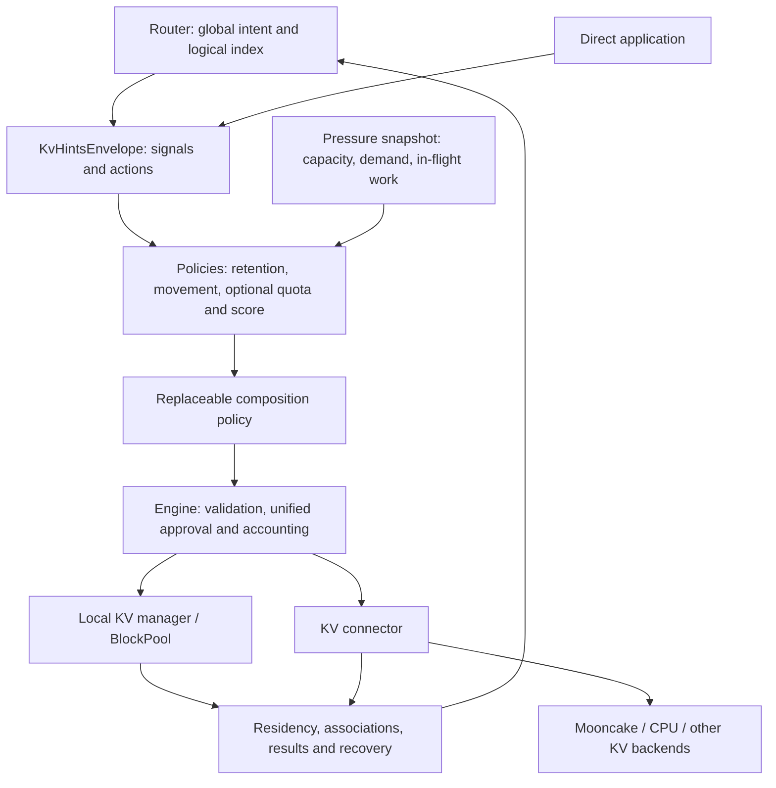

# [Issue #57103] [RFC]: Programmable KV Cache: Composable Policies for Agentic Serving

source: https://github.com/vllm-project/vllm/issues/57103
state: open | updated: 2026-09-24T13:23:02Z
labels: RFC, kimi

## 正文

## TL;DR

This RFC defines a provider-neutral Programmable KV Cache abstraction in which routers supply session lifecycle and placement intent, composable engine policies propose retention, movement, and quota actions against a shared pressure snapshot, and the engine provides unified resource approval and completion contracts above existing connectors.

## Motivation

Agentic applications are not one continuous generation. A task can:

1. generate one model response;
2. call an external tool and pause;
3. create several child agents from the same context;
4. complete or abandon a branch;
5. resume on the same or another engine.

During a pause, the KV is often the most valuable prefix for the next request, yet it may have no active request reference and enter an ordinary LRU eviction order. During spatial contention, a non-critical request can consume capacity and evict a critical-path prefix. The next turn needs to load an external copy or recompute the context if no usable copy is available.

The [vLLM AgentX post](https://vllm.ai/blog/2026-09-08-vllm-agentx) describes representative traffic: a median of 43 turns per session, a median 142K-token input and 444-token output, prefix-cache hit rates above 96%, and subagents in 44% of sessions. These patterns require a cache policy that can combine lifecycle information with local resource state.

## Existing foundations and related RFCs/PRs

### 1. Identity and events: associating multiple requests

[Identity RFC #48049](https://github.com/vllm-project/vllm/issues/48049) separates session_id from request_id: the former persists across calls; the latter retains per-request output, cancellation, and scheduling semantics. Its implementation [#48048](https://github.com/vllm-project/vllm/pull/48048) is merged and supplies typed session identity through the request path.

[Event PR #51381](https://github.com/vllm-project/vllm/pull/51381) is merged. It adds the triggering session_id to GPU BlockStored and supports full reporting of prefixes hit by the current request. [#54325](https://github.com/vllm-project/vllm/pull/54325) is also merged and corrects SimpleCPU offload event metadata and tier labels. These report cache activity; they do not automatically provide a complete session↔block index. [#50732](https://github.com/vllm-project/vllm/pull/50732) still proposes BlockInactive to distinguish active references from reclaimable cache; inactivity does not mean session completion.

[#48501](https://github.com/vllm-project/vllm/issues/48501) extends this direction with session-centric orchestration, continuation_id coordinates, event attribution, and publisher epochs. Logical coordinates help upper layers interpret cache activity, but must remain distinct from content hashes and physical copies. The first session triggering an event is not the exclusive owner of shared content.

### 2. Programmatic KV: existing actions, indexes, and execution boundaries

[#51428](https://github.com/vllm-project/vllm/issues/51428) is the overarching architecture proposal. It defines Share, Prefetch, Demote, Pin, and Retain, and explicitly allows engine acceptance, clipping, deferral, and rejection. It considers both engine-local SessionPrefixIndex and external orchestrator resolution, including many-to-many associations, cache-hit membership, and bidirectional outcomes.

This establishes important foundations. We do not claim engine authority or action results as unique additions. The remaining contract is how multiple local policies use common observations, produce executable plans, share finite capacity, and connect those plans to existing connectors.

[#52113](https://github.com/vllm-project/vllm/issues/52113) starts from application events. It proposes agent_hint, a SessionAwareManager (SAM), parent/child sessions, TTLs, and context management. SAM owns detailed associations and updates block metadata through a guarded KVCacheManager interface; the proposal also discusses a remote SPM adapter and a direct connector-capability direction. It provides a broader lifecycle model than a retention parameter and already recognizes remote observation and completion.

The coordination question is not whether a separate manager is valid. It is whether agent_hint and KvHintsEnvelope become competing ingress contracts, whether SAM and another session index duplicate tracking, and whether concrete fields, timers, or adapters unnecessarily constrain the public interface.

### 3. Retention: expressing value over token ranges

[#37003](https://github.com/vllm-project/vllm/issues/37003) proposes token-range priority/duration to distinguish shared prefixes, tool-wait contexts, and lower-value tails. Its implementation [#38514](https://github.com/vllm-project/vllm/pull/38514) remains open. It keeps the existing LRU and adds a priority queue and TTL handling for annotated blocks, with retention_scope semantics.

Its strength is separating cache priority from request scheduling priority and directly addressing victim order. Its scope is primarily GPU retention; it does not independently choose request-free prefetch timing, a retention backend, or competition with future request capacity. This RFC adopts range/priority/TTL semantics, permits replacement algorithms as policy implementations, and retains independent declarations for different sessions’ lifetimes.

### 4. Common envelope: unified ingress without rebuilding transport

[#53421](https://github.com/vllm-project/vllm/issues/53421) defines KvHintsEnvelope and KvHintAction. The envelope carries protocol_version, message_id, and actions; actions carry identity, type, version, and payload. [#53423](https://github.com/vllm-project/vllm/pull/53423) remains open and provides Python/Rust typed plumbing and kv_hints propagation. Its description includes public HTTP/gRPC fields, but it neither defines nor executes individual actions.

That is an intentional transport boundary. We reuse it and define the cache-operation, policy-input, and result contracts above it. A second envelope is unnecessary; the absence of an executor is not a defect in the transport PR.

### 5. Dynamo: global indexing, hint production, and external execution

[Dynamo DEP #13279](https://github.com/ai-dynamo/dynamo/issues/13279) proposes a router-side SessionPrefixIndexer, separating session/frontier/shared-ancestor structure from FlashIndexer residency observations. Known matches and newly stored content update logical relations; Removed/Cleared update residency rather than deleting task lineage. It remains a proposal.

[Dynamo #13134](https://github.com/ai-dynamo/dynamo/pull/13134) is merged and provides typed hints with a transitional engine bridge through kv_transfer_params.kv_hint, to be aligned with vLLM kv_hints. It demonstrates extensible router-produced inputs, not engine execution of every proposed action.

[KVCC #11673](https://github.com/ai-dynamo/dynamo/issues/11673), the [KVCR project](https://github.com/ai-dynamo/kvcr), and the open [vLLM adapter #53624](https://github.com/vllm-project/vllm/pull/53624) address pooled caches and external execution. An adapter keeps storage and transfer in an independent backend; it should not also be the only implementation of all engine GPU retention, request-capacity, and policy-composition decisions.

### 6. Agentic API and agentic router: how application state reaches the engine

[agentic-api #195](https://github.com/vllm-project/agentic-api/pull/195) is a draft for Messages server-managed cache state, covering affinity, checkpoints, retention, and branches while preserving the conversation-stateless public Messages contract. Its boundary is explicit: Agentic API derives trusted logical coordinates and lifecycle intent, llm-d selects the worker, and vLLM resolves and executes physical KV operations.

[#52567](https://github.com/vllm-project/vllm/issues/52567) discusses the broader vLLM/Agentic API relationship and links [llm-d-router #1979](https://github.com/llm-d/llm-d-router/issues/1979) on session-centric orchestration, [#2003](https://github.com/llm-d/llm-d-router/issues/2003) on session control, and [#1867](https://github.com/llm-d/llm-d-router/issues/1867) on agentic routing profiles. These represent the agentic-router role here: cross-request task interpretation, affinity, and global routing, rather than another cache allocator.

There is a substantive tradeoff. Router-led approaches centralize semantics and reduce engine application awareness. However, a wholly policy-unaware engine cannot autonomously exploit immediate demand and capacity changes. We retain router ownership of global decisions while permitting local policies to act on reusable runtime information. Hard session affinity and migratable shared KV are also different capabilities and are not bound to one interface here.

### 7. SGLang and cross-system semantics

[SGLang #27574](https://github.com/sgl-project/sglang/issues/27574) uses a similar router-to-engine taxonomy with tiered storage, cross-engine sharing, and Mooncake-related retention. It demonstrates that these requirements extend beyond vLLM. Action meanings can align without making SGLang’s internal session structure or a backend lease a mandatory vLLM implementation.

## Concrete contribution of this RFC

**We propose an engine policy interface separate from connectors, with a complete contract from observation and proposals through composition, resource approval, and completion.**

Existing work already provides session identity, logical cache actions, a common envelope, and backend execution paths. We define the local decision boundaries between those pieces so different algorithms can run in one engine without each adding another set of fields, session managers, and resource accounts.

| Addition                           | Concrete contract proposed here                              | Value to consumers                                           |
| ---------------------------------- | ------------------------------------------------------------ | ------------------------------------------------------------ |
| Common observations                | Reclaimable capacity, valid Pins, in-flight reservations, request growth, and backend capabilities in one view | Retention, movement, and quota policies can use the same facts |
| Composable policy interface        | Policies propose; a replaceable composer produces one plan; the engine approves resources | Identical prefetches coalesce and competing operations cannot independently spend the same capacity |
| Two inputs, one execution boundary | Explicit router actions and runtime signals enter the same planning/execution flow | Orchestrated and autonomous local policies coexist without mirroring instantaneous scheduler state in the router |
| Control across request lifetimes   | Resolve explicit prefixes and retain, demote, or prefetch after a request completes | Tool waits and branch completion have executable semantics without synthetic inference requests |
| Resource and completion contract   | Distinguish proposal, receipt, approval, in-flight work, and availability; define resource holders and release | Adapters have explicit inputs/outputs and observed benefits follow actual completion |
| Request/KV cooperation             | Demand observations and request-score proposals usable by quota examples | More optimization space without prescribing a queue, preemption, or partitioning algorithm |

For example, two policies request the same 8 GiB prefix on the same GPU, with only 10 GiB available for new work. This design coalesces them into one 8 GiB reservation. If they target different prefixes, some work must be selected, clipped, or deferred. The envelope can carry both requests, but does not determine that engine resource decision. **The common arbitration and execution interface is the contribution, not the action names themselves.**

These numbers illustrate capacity accounting. Benefits of the common implementation still need evaluation; observation, indexing, composition, and backend adapters also consume CPU, memory, and engineering effort.

## Goals

The RFC provides:

- logical KV targets based on BlockHash, Session, Continuation, and logical token ranges;
- session-to-logical-block associations, parent/child lineage, and multiple branches;
- common semantics for Retain, bounded-TTL Pin, Prefetch, Demote, Share, Evict, and Release;
- a pressure snapshot readable by engine policies;
- composition of multiple policy proposals with one engine-level resource decision;
- optional admission, agent-class quota, and request-score extensions;
- connector capability advertisement, asynchronous movement, and completion results;
- observation contracts for association, residency, inactivity, action results, restart, and event gaps;
- useful degradation when no router or no particular connector is present.

## Proposed Change

### Responsibility boundaries



This RFC uses the following boundary:

| Component           | Owns                                                         | Does not own                                                 |
| ------------------- | ------------------------------------------------------------ | ------------------------------------------------------------ |
| Router/orchestrator | Global worker selection, cross-engine placement, task/branch relations, lifecycle intent | Whether this engine can allocate space or whether a local copy still exists |
| Engine policy       | Local target resolution, capacity/reference checks, final local feasibility of retention, admission, and movement | Cluster routing and backend-specific transfer                |
| Connector           | Remote lookup, copy/move, tier selection, asynchronous completion, backend errors | Global session policy and request ordering                   |

A router directive is a request, not a resource grant. The engine may accept, clip, defer, reject, or report a missing target. If it reports that a bounded-TTL Pin is active, it must honor the accepted target layer and duration; a best-effort receive path must not silently revoke an accepted guarantee.

Request and KV scheduling are allowed to cooperate: a policy can read waiting demand and provide a request score proposal. The RFC does not replace the waiting queue or preemption algorithm.

### From envelope to execution: interface responsibilities

These are conceptual interfaces, not fixed Python classes or RPC signatures. They define what each participant can observe, what it returns, and which boundary changes resource state.

| Responsibility        | Input                                             | Output                                                      | Allowed effect                                               |
| --------------------- | ------------------------------------------------- | ----------------------------------------------------------- | ------------------------------------------------------------ |
| Receive and normalize | KvHintsEnvelope and optional request context      | Logical actions and runtime information                     | Record and correlate input; a signal does not automatically allocate memory |
| Resolve targets       | Hash / session / continuation / range             | Explicit content boundaries, known copies, missing portions | Do not infer a current physical block from an obsolete session name |
| Observe runtime       | Engine, KV manager, and connector state           | Read-only PolicyView / pressure snapshot                    | Supply facts and labeled estimates, not capacity grants      |
| Propose policy        | Runtime information, targets, shared observations | Retention, movement, quota, or score proposals              | Do not mutate allocators/queues or start backend transfers   |
| Compose proposals     | Policies plus explicit actions                    | Consistent pending KVPlan                                   | Coalesce duplicate intent and arbitrate local policy competition |
| Approve in engine     | KVPlan and current state                          | Accepted scope/reservation or deferral/rejection            | Sole approval boundary for physical capacity and operation holds |
| Execute backend       | Approved targets, space, and requirements         | In-flight state and completion                              | Use existing managers/connectors without expanding approved scope |
| Complete and report   | Completion, failure, or target changes            | Availability, released resources, events, queryable results | Update actual residency for subsequent router/policy decisions |

Conceptually:

```bash
    inputs = normalize(envelope, optional_request_context)
    targets = resolve(inputs.targets)
    view = observe_engine_and_backends()
    proposals = [policy.propose(inputs, targets, view) for policy in policies]
    plan = composer.combine(inputs.explicit_actions, proposals, view)
    approved = engine.validate_and_reserve(plan)
    executor.submit(approved)
    # Later completion: register usable content, release resources, report.
```

Explicit actions still need engine approval. The composer can arbitrate competition, but cannot silently convert a caller’s GPU Pin into CPU Retain. Allowed clipping or unsupported guarantees must be reflected in the result.

### What the core records express

| Record                     | Content                                                      | Distinction                                                  |
| -------------------------- | ------------------------------------------------------------ | ------------------------------------------------------------ |
| KVTarget                   | Logical selector, branch/range, cache compatibility context  | No externally stable physical block ID                       |
| WorkloadSignal             | Pause, resume, completion, parent/continuation, optional importance/resume time | Fact or prediction, not resource authorization               |
| ProtectionDeclaration      | Target, declarant, Pin/Retain, priority, lifetime, target tier | Session association alone does not imply Pin                 |
| KVProposal                 | A policy’s suggested action, rationale, resource demand, or score | May be dropped by composition or deferred by the engine      |
| KVPlan                     | Pending actions and dependencies, such as cold completion before GPU reclamation | Does not mean execution succeeded                            |
| ApprovedOperation / Result | Actual approved scope, execution stage, result               | Correlated to message_id/action_id; physical resources charged once |

Implementations can extend or adapt existing records; these do not require a second public wire schema.

## Terminology and logical model

### Logical content, association, and residency

These are separate:

- **Logical content:** a reusable prefix identified using the compatible model, cache salt, KV group, and BlockHash.
- **Association:** a session or continuation may use the prefix; one logical block can be associated with multiple sessions.
- **Residency:** the engines, GPUs, CPU tiers, disks, or remote stores holding valid copies.

Removing a GPU copy does not remove the session association. Ending one session does not authorize deletion of a prefix still used by another.

### Session and continuation

A Session represents task-level lifecycle. A Continuation represents an explicit continuation or branch boundary inside that task. It may be generated by an upper layer and carried as opaque metadata; it does not replace BlockHash as the cache identity.

### Active references and policy protection

- **Active reference:** a request or transfer reference required for correctness. A replaceable policy cannot revoke it arbitrarily.
- **Retain:** a relative eviction priority, optionally bounded by a TTL; it may yield under pressure.
- **Pin:** a bounded-TTL strong protection. Once accepted, it is excluded from ordinary eviction within the accepted target layer or valid-copy scope. Its effective result reports the accepted layer/scope and TTL.
- **Prefetch reservation:** destination capacity held before a request arrives; it counts against the engine’s current capacity.

## Control protocol

### KvHintsEnvelope

The RFC reuses the typed KvHintsEnvelope and request field kv_hints from [RFC #53421](https://github.com/vllm-project/vllm/issues/53421) and [PR #53423](https://github.com/vllm-project/vllm/pull/53423). The envelope carries:

```
    KvHintsEnvelope(protocol_version, message_id, actions[])
    KvHintAction(action_id, action_type, action_version, payload)
```

The same envelope can accompany an inference request or arrive through a control entry point while no generation is active. This makes retention, demotion, and prefetch during tool pauses ordinary capabilities, without synthetic inference requests. HTTP, gRPC, and internal utility paths are not prescribed here.

Signals and commands may share the envelope, but their semantics differ:

- a command asks the engine to attempt a specific operation;
- a signal reports tool waiting, a branch transition, importance, or an estimated resume time, leaving the policy to decide what operation is useful.

This RFC defines the meaning and resource contract above the envelope. It does not fork the transport format.

### Target addressing

The portable interface should support:

- **BlockHash:** the router or connector already knows a logical hash;
- **Session:** operate on associated content, optionally qualified by an explicit continuation and half-open logical token range;
- **Active RequestRange:** operate on a cache range belonging to a still-active request.

Continuation and range qualify a logical target rather than introducing physical addressing. A whole-session operation covers its relevant branches. Historical branch or range operations bind to an explicit continuation/prefix boundary, not an implicitly changing “latest” branch. Token-range retention does not delete text from model input.

Selectors identify logical content. The engine resolves them to group-specific cache entries and current residency.

### Action semantics

| Action   | Meaning                                                      |
| -------- | ------------------------------------------------------------ |
| Retain   | Add a relative priority, optionally with a TTL; equal priorities use LRU |
| Pin      | Provide bounded-TTL strong protection; the target can be GPU, CPU, remote, or at least one valid copy |
| Prefetch | Prepare KV at a target engine/tier before expected use, including CPU-to-GPU preparation before resume; do not report availability before completion |
| Demote   | Confirm a valid colder copy; once active references and valid GPU Pins permit reclamation, invalidate the GPU hash and make its space reusable |
| Share    | Ensure a valid copy at a target engine; do not implicitly remove the source |
| Evict    | Remove a selected engine/tier residency when active references and valid Pins permit |
| Release  | Remove a session/continuation Pin/Retain declaration without deleting unrelated copies |

A Retain TTL expires the declaration’s priority; it does not require immediate deletion. Independent session declarations remain independent: if A’s high priority expires while B’s lower priority remains valid, B’s protection remains. A layer’s Pin protection ends only when all valid Pin declarations for that layer have expired or been released.

A declaration with a TTL starts when it becomes effective. Only an explicit update renews it; a cache hit does not renew it implicitly. Every Pin acceptance or renewal is bounded, and the engine may clip, defer, or reject requests beyond its capability or capacity. A valid GPU Pin prevents ordinary demotion; a cold-tier Pin permits reclamation of the GPU copy. Retain without a TTL remains an evictable priority bias.

A shared block’s effective priority is the maximum among still-valid declarations. A’s high priority must not be combined with B’s longer TTL into a stronger declaration. Expiration or release affects only the corresponding declaration. Bytes remaining on the GPU after demotion are not a registered cache hit.

Share does not implicitly delete its source. A migration explicitly handles the source after the destination is valid; copy completion alone does not authorize revoking source references or protection.

### Agentic lifecycle

A parent session remains logically hot throughout a task: its associations remain valid and its cache is valuable, but all KV need not remain on the GPU. Tool pauses may trigger Demote to a cold tier, followed by Prefetch before the expected resume. Misprediction or insufficient capacity is handled through the existing load/recompute paths.

One LLM request returning a tool call does not end the task. Parent-task completion releases associations and protection declarations for the entire task tree, including the parent session, without deleting content shared with other tasks or revoking active references. Waiting for an unknown future user reply after task completion returns to ordinary cache policy.

## Engine policies: observation, composition, and resource approval

### 1. PolicyView supplies facts, not a fixed algorithm

| Observation                                            | Producer                                        | Policy use                                                   |
| ------------------------------------------------------ | ----------------------------------------------- | ------------------------------------------------------------ |
| GPU/cold-tier capacity, occupancy, reclaimable cache   | KV manager and connector                        | Determine whether protection/movement consumes scarce resources |
| Active references, valid Pins, in-flight reservations  | Engine operation/resource records               | Exclude capacity already committed or not currently reclaimable |
| Incremental demand from waiting/running requests       | Scheduler and KV manager                        | Estimate whether movement creates useful capacity for requests |
| Admitted requests’ remaining unallocated growth        | Engine observations or optional capacity policy | Avoid treating committed future demand as unlimited spare space |
| Backend hits/unknown state, queues, transfer estimates | Connector                                       | Estimate recovery cost and completion time                   |
| Session, continuation, tool state, importance          | Router/application and optional local index     | Relate content location to task value                        |

Physical facts, estimated demand, and policy commitments must be distinguishable. A maximum output budget is an upper bound, not a prediction of actual use. The view requires neither a complete DAG nor one sampling interval or memory layout.

### 2. Policies return composable proposals

Policies and connectors are registered independently. Policies may propose:

- Retain/Pin declarations for a logical range;
- Prefetch, Demote, or Share based on expected use;
- capacity guidance for an agent class;
- request-score recommendations.

They do not directly execute backend work or remove blocks from the free queue. Engine/KV-manager paths own physical mutation, so replacement algorithms can change without duplicating lifecycle handling.

The composer first removes duplicate work, then arbitrates retention versus movement, destinations, quotas, and request demand. Shared Pin/Retain declarations preserve independent lifetimes; this is a defined protection rule, not arbitrary score weighting. Composition of heuristic advice remains replaceable and does not assume equal score scales.

### 3. Approval is a separate engine decision

Before execution, the engine rechecks content, protection, active references, and current capacity instead of trusting an earlier snapshot. Approval identifies the actual scope and reservation. Failure returns missing, unsupported, deferred, or rejected as appropriate.

Data may be referenced by a task and participate in a transfer simultaneously, but physical capacity is charged once. GPU allocations, pending destination reservations, and a quota example’s logical cost shares are not independent sources of space. Completion/cancellation release operation resources through their records; removing a proposal cannot reclaim memory still accessed by a transfer.

### 4. Request/KV cooperation boundary

KV policies consume request demand and growth information; scheduler extensions can consume request scores. They share facts without allowing cache plugins to reorder the waiting queue or choose preemption victims directly.

Dynamic quota is an example enabled by the interface: a request belongs to at most one agent class, shared content can be apportioned across logical session references, and physical copies are counted once. A quota limit is not guaranteed space. Borrowing, over-quota handling, and ordering remain example-policy choices. TokenCake-like algorithms can integrate without imposing one partitioning model on every deployment.

## SessionPrefixIndex: functions, placement, and updates

The RFC first defines the questions the index answers, then where information belongs. The router is preferred for global sessions and branches. An engine adds a local index when it accepts session addressing directly or its policies need session-level decisions.

### Query and update contract

| Capability       | Question or state change                                     |
| ---------------- | ------------------------------------------------------------ |
| Associate        | Which logical prefix does a session/continuation use, and from which parent position? |
| Resolve          | Which logical blocks belong to all relevant session branches or a selected continuation/range? |
| Reverse lookup   | Which sessions still associate with or protect one logical block? |
| Update residency | A copy appears, becomes inactive, or disappears on an engine/tier; global lineage is not erased |
| End a task tree  | Remove parent/descendant associations and declarations while preserving externally shared content |

Shared ancestors, frontiers, or compressed structures may implement these functions; bidirectional queries do not require two fully expanded tables. A parent-only node records logical connectivity, not proof of resident KV.

### Why two indexes may coexist

The router establishes associations from known prefix matches and updates locations from BlockStored and other facts. An engine with a local index also records new cache-hit associations and reports increments. Without a local index, the router can resolve sessions into exact logical hashes for the engine to validate.

A local index need not know every global session; router residency cannot replace local feasibility checks. Lazy index creation needs resolved hashes or another explicit record for untracked history. Limits and index eviction cannot implicitly revoke a valid Pin.

### Branch and range example

Prefix H forks into H+B and H+C. A Session selector covers relevant branches; selecting one branch requires an explicit continuation. Ranges use logical token coordinates at that position, not reusable physical block IDs.

The engine maps a range to supported cache granularity and reports its actual coverage or lack of support. Uncomputed content or a range lacking required prefix state cannot be reported as fully reusable. Detailed partial-block and hybrid-group handling remains implementation TODO.

An LLM turn completing, a tool pause, and a task completing are different events. The task stays logically hot during tools, permitting cold-tier residency and pre-resume prefetch. The task tree is cleaned up at actual task completion; an unknown future user reply does not extend task-period protection.

## Events and results: informing the next decision

### What residency, association, and operation results each update

| Observed fact                        | Consumer update                                          | Invalid inference                                |
| ------------------------------------ | -------------------------------------------------------- | ------------------------------------------------ |
| New copy available                   | Content is accessible on an engine/tier                  | Every engine now has a GPU hit                   |
| New session/continuation association | Logical task-prefix relationship                         | The task exclusively owns the content            |
| Removed at one location              | Remove that copy’s location                              | All copies and global lineage disappeared        |
| BlockInactive (optional)             | Cache currently has no active references                 | Task completion, TTL expiry, or content deletion |
| Operation result                     | Execution state and actual scope for the original action | Receipt means transfer completion                |

### Observable operation stages

Receipt is acknowledged synchronously; target resolution or resources may still be pending. After engine approval, execution can begin. Effectiveness or completion is reported only when the operation’s goal is met:

- Pin reports the effective layer, scope, and finite TTL.
- Prefetch reports data delivered and registered as reusable, not merely a load being submitted.
- Demote distinguishes cold-copy completion from GPU reclamation. With active references, “cold save succeeded” does not mean GPU capacity was released.
- Share reports actual destination accessibility, not backend replica count as GPU residency.
- Release revokes this declaration without implying shared data was physically deleted.

Deferral, partial completion, unsupported capability, missing content, and failure are distinguishable and correlated with the original message_id/action_id. Exact enums and query methods are not fixed here. Events and queries derive from the same operation record so they agree on whether the action became effective.

### Gaps and restart recovery

Reuse existing event sequence numbers and bounded replay. Consumers identify publisher restarts and gaps, attempt replay, and mark affected residency unknown if repair is impossible. Queries or later reports restore observations. A potentially stale global location does not replace execution-time engine checks.

Current full reporting re-emits prefixes hit by the current request, not a complete engine snapshot. Restart clears engine-local runtime state; the router invalidates that engine’s old locations while keeping other copies and global task relations. DP dispatch, queue settings, and wire encoding are not expanded here.

## Mooncake’s role and integration value

Mooncake transfer and storage capabilities are adopted across major inference systems, including vLLM, SGLang, and TensorRT-LLM. The [PyTorch ecosystem announcement](https://pytorch.org/blog/mooncake-joins-pytorch-ecosystem/) and [project documentation](https://github.com/kvcache-ai/Mooncake) describe these integrations. It provides an established cross-instance KV backend without requiring this work to build another distributed cache pool.

vLLM already has distinct paths:

```
- [MooncakeConnector](https://docs.vllm.ai/en/stable/features/mooncake_connector_usage/) uses the Transfer Engine for point-to-point P/D KV transfer.
- [MooncakeStoreConnector](https://docs.vllm.ai/en/stable/features/mooncake_store_connector_usage/) looks up, saves, and restores prefixes through a distributed shared Store, using the CPU/DRAM/SSD tiers available in the backend deployment for cross-instance reuse; actual tiers depend on connector and Store configuration.
- MultiConnector composes connector data paths; it is not the multi-policy arbiter proposed here.
```

The [vLLM Mooncake Store post](https://vllm.ai/blog/2026-05-06-mooncake-store) reports, for its Codex-trace experiment using Kimi-2.5 NVFP4, an NIXL baseline, 1P1D, and 12 GB200 GPUs: cache hits increase from 1.7% to 92.2%, throughput improves 3.8×, P50 TTFT falls to approximately 1/46 of baseline, and end-to-end latency to approximately 1/8.6. This is evidence for an existing storage/transfer integration, separate from the TokenCake v0.22.0 experiments below.

This RFC supplies application runtime information and engine resource arbitration so shared KV backends can be invoked before expected resumes or when a task no longer needs its context. Integration can extend local CPU reuse into task-aware caching across engines and tiers. Its additional benefit requires separate evaluation; the Mooncake throughput factor and TokenCake speedup must not be multiplied.

## Integration plan: connecting the interface to vLLM and Mooncake

This section maps the design to existing components. “New adaptation” identifies proposed work, not a claim that current connectors already implement complete session control or predictive prefetch.

### 1. Layers and reuse boundaries

| Layer           | Existing foundation                                          | New adaptation in this RFC                                   |
| --------------- | ------------------------------------------------------------ | ------------------------------------------------------------ |
| Ingress         | #53423 kv_hints, request plumbing, envelope types            | Normalize signals/actions and accept control without generation |
| Logical targets | Router SessionPrefixIndexer, BlockHash, optional local index | Common resolution of Session/Continuation/Range into logical blocks |
| Local policy    | Observable scheduler demand and KV-manager resources         | PolicyView, proposals, composer, unified approval            |
| GPU resources   | BlockPool, KVCacheManager, existing reference/allocation paths | Approved operations hold reservations/protection; managers mutate physical state |
| Backend         | MooncakeConnector, MooncakeStoreConnector, or OffloadingManager/KVCR | Capabilities, logical control adapters, independent execution/completion correlation |
| Feedback        | KV events and connector completion metadata                  | Associate residency/results with original hints for events and queries |

Policy side metadata avoids enlarging every block for optional functionality. Existing free queues and physical management remain, with an extension for candidate selection rather than another allocator per policy. SimpleCPU and the general OffloadingConnector may expose different support; merging them is not required.

### 2. Mooncake target and capability adaptation

Resolution follows:

    Session / Continuation / Range / BlockHash
        -> logical blocks + cache compatibility context
        -> connector-owned layout and Mooncake object keys
        -> required copies/shards and destination buffers

Existing Mooncake Store [key/layout code](https://github.com/vllm-project/vllm/blob/main/vllm/distributed/kv_transfer/kv_connector/v1/mooncake/store/data.py) can continue to own PoolKey, layout, and shard interpretation. The public protocol does not require routers to construct backend keys or replace content hashes with session IDs.

Mooncake object groups organize related-object lifecycles; they are not the many-to-many session↔logical-block relation. Shared prefixes still need router/optional local associations, not an object group used as a substitute for SessionPrefixIndex. See the [Mooncake Store design](https://github.com/kvcache-ai/Mooncake/blob/main/docs/source/design/store/mooncake-store.md).

Capability advertisement must describe guarantees that can actually be fulfilled:

| Operation     | Required adaptation check                                    |
| ------------- | ------------------------------------------------------------ |
| Share         | Whether source/destination means an engine, shared Store, or backend replica; replication is not a GPU load |
| Prefetch      | Supported target layout, engine destination reservation, request-free progress and completion |
| Demote        | A recoverable cold copy, with source-engine GPU reclamation handled separately |
| Retain        | Numeric priority support versus a weaker retention preference; report actual accepted scope |
| Pin           | Protection against ordinary eviction in the accepted tier for a finite lifetime, with shared-declaration-aware release |
| Evict/Release | Separate location deletion from declaration release so unrelated shared backend objects are not removed |

### 3. Pin names do not establish semantic equivalence

Mooncake Store soft pins may still be evicted under pressure by default. Hard pin is an object attribute that does not expire and cannot be changed after creation. Neither name alone establishes this RFC’s bounded-TTL Pin. See [Soft/Hard Pin semantics](https://github.com/kvcache-ai/Mooncake/blob/main/docs/source/design/store/mooncake-store.md#soft-pin).

An adapter advertises a Pin capability only when its configuration or backend extension can honor the tier and lifetime. Weaker protection must be reported as such or the operation unsupported; Pin must not silently become Retain. Creating a permanent hard pin and deleting the whole object at expiry is not a valid release implementation when other declarations may remain.

The same rule applies to other backends: the public interface defines the guarantee, and the connector reports whether and how it can fulfill it. Mooncake-specific settings are not mandatory portable payload fields.

### 4. Attach independent operations to existing asynchronous paths

Current [MooncakeStoreConnector](https://github.com/vllm-project/vllm/blob/main/vllm/distributed/kv_transfer/kv_connector/v1/mooncake/store/connector.py) has request-driven lookup, post-allocation updates, worker metadata, and completion reporting. The RFC reuses those foundations while giving request-free control its own lifecycle.

| Stage    | Reusable hook/path                                        | New adaptation                                               |
| -------- | --------------------------------------------------------- | ------------------------------------------------------------ |
| Lookup   | get_num_new_matched_tokens, Store lookup/key construction | Accept resolved logical control targets without constructing inference requests |
| Prepare  | Engine KV allocation, update_state_after_alloc            | Approve destination capacity before submission and map operation reservations to existing buffers |
| Dispatch | build_connector_meta, start_load_kv, Store send path      | Send approved operations to workers and progress relevant work without a forward pass |
| Transfer | Store batch Get/Put and transfer threads                  | Reuse layouts, buffers, and in-flight references; policies do not read/write KV directly |
| Complete | get_finished, update_connector_output                     | Translate request/job results into control-operation completion |
| Observe  | take_events and residency/completion metadata             | Publish reusable content and actual accepted scope, outcomes, and failures |

Renaming a call to get_num_new_matched_tokens does not create proactive prefetch: request context, GPU allocation, and completion correlation all need adaptation. The benefit is a new control contract over an existing data path.

MultiConnector composes data paths. The approved plan/adapter identifies the connector responsible for an operation; MultiConnector is not the policy composer, and P/D transfer support does not imply arbitrary cross-engine Share for completed sessions.

### 5. Cross-engine resume example

1. Task S’s branch S1 enters a tool wait on engine A. The router preserves continuation/shared ancestry and supplies a pause signal with optional resume prediction.
2. A’s composer proposes saving a reclaimable suffix to Mooncake Store. If ancestor H is still used by another running branch, the engine keeps its GPU references and reports the actual approved scope.
3. The connector confirms that required cold objects are readable. A removes the reclaimable entries from its local GPU lookup/residency; logical hashes and session associations persist.
4. The router selects B for the next turn and submits Prefetch for the explicit prefix. B checks its existing GPU hits and reserves capacity only for the missing portion.
5. B loads from the Store and reports GPU availability after completion and registration. Routing can use that result instead of treating receipt as a warm destination.
6. Share does not delete A’s source. Migration requires explicit source handling. Task S’s completion releases its declarations, while other tasks sharing H retain theirs.

The expected opportunity is to overlap transfers with tool waits and avoid premature reservations on an unsuitable engine. The router evaluates global placement benefit; B’s engine decides immediate feasibility. Combined gains require new end-to-end experiments.

## TokenCake integration example: experiments on vLLM 0.22.0

The [TokenCake paper (EuroSys ’27)](https://arxiv.org/abs/2510.18586) motivates coordination of runtime information, agent importance, and KV management. Its [reference implementation](https://github.com/zhhangBian/vLLM-TokenCake) does not prescribe this interface. **All performance evidence in this section comes from the author-provided experiment report based on vLLM 0.22.0; the older paper implementation’s performance figures are not used.**

An integration can supply tool state as signals, expose admitted requests’ remaining growth through the pressure snapshot, and use agent importance in retention and movement proposals. DAGs, predictors, quota formulas, ordering, and preemption algorithms remain policy or scheduler extensions.

### Baseline and common settings

The native baseline already enables GPU prefix caching, chunked prefill, asynchronous scheduling, and full-input-length admission checks. Comparisons retain native model kernels and chunked-prefill budgets.

| Item                                  | Setting                                                      |
| ------------------------------------- | ------------------------------------------------------------ |
| Model                                 | Qwen2.5-14B-Instruct, BF16                                   |
| GPU per group                         | One A800-SXM4-80GB, TP=1, PP=1                               |
| GPU memory fraction / maximum context | 0.5 / 32,768 tokens                                          |
| GPU KV pool                           | 3,050 blocks, 16 tokens/block in both groups                 |
| Batch token budget                    | 8,192                                                        |
| CPU KV                                | Disabled for native and scheduling-only; 100 GiB for tool-window-save-only and combined configurations |

This is a **system comparison with equal GPU KV capacity and different CPU-cache provisioning**. Combined gains include scheduling changes and additional CPU KV capacity; they are not a policy-only speedup under equal total memory resources.

### Static DAGs: batch completion time

Each run contains 24 complete DAGs, 648 model calls, and 155,136 output tokens. Dependencies, arrivals, initial inputs, and output budgets are fixed. The model generates real outputs that extend subsequent inputs; tool results and waits are simulated.

“Total E2E” is wall-clock time from client start until the entire DAG batch finishes, including arrivals and tool waits. It is not mean model-request latency.

| Application QPS | Native total E2E (s) | TokenCake total E2E (s) | Approximate reduction |
| --------------- | -------------------: | ----------------------: | --------------------: |
| 0.05            |               875.74 |                  676.86 |                 22.7% |
| 0.1             |               940.76 |                  671.28 |                 28.6% |
| 0.2             |               938.79 |                  640.45 |                 31.8% |
| 0.5             |               938.99 |                  648.05 |                 31.0% |
| 1.0             |               960.44 |                  631.77 |                 34.2% |

The report gives a **22.71–34.22%** reduction across these loads. At 1.0 QPS, application P95 falls from **929.12 s to 604.50 s (34.94%)**. Native/combined configurations at 0.05 and 0.1 QPS have three runs each; other configuration/QPS combinations have one. The table uses per-metric medians. Finite batches and limited repetitions do not establish maximum sustainable serving capacity.

### Static DAGs: component contribution and input reuse

At 1.0 QPS:

| Configuration                  | Total E2E (s) | Reduction versus native | Preemptions |
| ------------------------------ | ------------: | ----------------------: | ----------: |
| Native vLLM                    |        960.44 |                       — |          41 |
| TokenCake scheduling only      |        837.78 |                  12.77% |           0 |
| Tool-window saving only        |        691.01 |                  28.05% |          58 |
| Scheduling and saving combined |        631.77 |                  34.22% |           0 |

Tool-window saving alone supplies a substantial completion-time benefit; composition reduces it by a further **8.57%**. The components overlap, so 12.77% and 28.05% must not be added. “Saving only” still uses eligibility and importance metadata; it is not indiscriminate, agent-unaware offload.

Prefill computation during first input processing falls from **3,282,597 to 952,780 tokens (70.97%)**. Input reuse from GPU hits plus CPU reloads rises from **44.12% to 83.78% (39.66 percentage points)**. This accounting excludes repeated prefill after a request is preempted; it must not be described as a 70.97% reduction in all recomputation. Zero preemptions is an observation from those runs, not a guarantee for arbitrary workloads.

These results motivate shared observations and unified resource approval: preserving reusable prefixes and accounting for admitted requests’ future capacity needs can complement each other. They do not isolate the gain of each proposed interface.

### Real coding agents: output throughput and waiting tradeoffs

The report runs the first 20 SWE-bench Verified tasks through mini-swe-agent 2.4.6, with real repository edits and tool calls. Each group has at most 16 tasks in flight and uses the same problems and initial settings; actual request counts, lengths, and trajectories differ. The groups run concurrently on one GPU each, sharing a 36-core CPU quota and a 240 GiB host-memory limit.

The throughput rows use the fixed 1,800-second window. Other rows retain the report’s run-level aggregates and are not asserted to use the same time window.

| Metric                                   | Native vLLM | TokenCake | Interpretation                                       |
| ---------------------------------------- | ----------: | --------: | ---------------------------------------------------- |
| Output tokens in the same 1,800 s window |      83,292 |   106,239 | Equal observation window                             |
| Output throughput (tokens/s/GPU)         |       46.27 |     59.02 | **27.6% improvement**                                |
| Mean per-request TPOT                    |    51.73 ms |  36.55 ms | 29.3% reduction                                      |
| Preemptions                              |          11 |         0 | Observed in these runs                               |
| Sampled peak GPU KV usage                |        100% |    91.83% | 8.17 percentage points lower, not total VRAM savings |
| Actual input cache reuse                 |       9.97% |    10.39% | Only 0.42 percentage points higher                   |
| Mean request queue time                  |     18.06 s |   34.65 s | **Waiting increases**                                |

Faster generation and fewer preemptions coexist with longer admission waits, showing a capacity-protection tradeoff. CPU reloads account for 1.14% of the combined group’s input. The small change in cache reuse does not support attributing all coding-throughput gains to CPU KV or applying the static-DAG input-computation explanation to this workload. The 27.6% result measures output throughput; the report does not establish a corresponding improvement in task-resolution accuracy.

### What these results establish and what they do not

These are TokenCake system results on vLLM 0.22.0. They motivate coordination of runtime state, future capacity demand, and KV reuse; they do not demonstrate an implementation of this RFC or guarantee the same gains.

Current TokenCake changes ordering, admission, and preemption selection. This RFC exposes observations, capacity guidance, and request-score proposals without replacing waiting-queue/preemption algorithms. The entire system gain cannot be credited to its KV action interface.

**Current CPU-to-GPU reload is triggered by a subsequent request’s actual cache hit; predictive ahead-of-request reload is not implemented.** Predictive prefetch remains a target capability requiring separate evaluation. These experiments directly support tool-window saving, subsequent reuse, and capacity coordination.

### Other examples using the same abstraction

| Example                    | Inputs and behavior                                          | Specialized prerequisite it does not need               |
| -------------------------- | ------------------------------------------------------------ | ------------------------------------------------------- |
| Simple TTL policy          | Retain/Pin a logical prefix and observe the actual scope     | Complete DAG or resume predictor                        |
| Router-driven shared cache | Select a target, Share/Prefetch through Mooncake or another backend, and track locations through events | Cluster routing reimplemented inside the engine         |
| Quota policy example       | Propose capacity guidance from future demand and logical cost sharing, with unified engine approval | One partitioning algorithm required in every deployment |

These examples test generality; they do not claim that the corresponding integrations already exist.

## Evaluation plan

The evaluation should include:

- AgentX-style long sessions, tool pauses, short outputs, and subagent fork/join;
- TokenCake-style critical-path contention;
- LRU-only, movement-only, priority-only, and composed-policy ablations;
- Prefetch misprediction, cancellation, and budget limits;
- Mooncake/remote connectors and local CPU tiers;
- cache hit rate, recomputed prompt tokens, TTFT, end-to-end task latency, throughput, and effective GPU utilization;
- movement bytes, migration churn, admission delay, and fairness;
- policy CPU cost, index memory, and unhinted-path overhead.

The interface requires fresh validation on current vLLM and connector configurations. Evaluation should distinguish cached-copy availability, actual cache hits, and avoided recomputation.


## 评论 (5)

### yinli-systems · 2026-09-18

**Measurements on request-free prefetch: what the transfer costs, whether timing needs predicting, and where the capacity boundary is**

Data from one L20 (Qwen3-4B, vLLM 0.29.0, native CPU offloading via `--kv-offloading-size` / `OffloadingConnector`, PCIe-4-class host). Raw JSON, harness and exact commands: https://github.com/yinli-systems/single-gpu-inference-lab/tree/kv-prefetch/benchmarks/results/l20-kv-prefetch-oracle

**1. Reload is request-triggered today, and it sits on the resume's critical path.** A paused session's blocks are stored on finish and loaded only when the next request's prefix lookup hits the CPU tier. The load costs 6.4 µs/prefix token (~23 GB/s): 34 / 65 / 104 ms for 4k / 8k / 16k prefixes, i.e. 1.2–1.4× the resume's own prefill of a 64-token append. Resume TTFT 75 / 121 / 194 ms reactive vs 42 / 57 / 91 ms when the blocks are still GPU-resident.

**2. A request-free prefetch during the tool wait recovers almost all of it.** Emulated with a prefix-only `max_tokens=1` probe `lead` ms before the resume (the synthetic request this RFC wants to make unnecessary, so a real primitive should do slightly better): resume TTFT −52…−57% (4k: 75→35, 8k: 121→52, 16k: 194→90 ms; 3 interleaved repeats), useful lead = the load time. An unfinished prefetch is worse than reactive (lead 0: +20%; the two loads contend).

**3. Timing prediction is not required.** The error frontier is asymmetric: prefetching early costs only GPU residency (linear in the error), prefetching late by one load time forfeits the whole gain, and +50 ms late is worse than reactive. Under 8 concurrent decoders the load itself slows (34 → 80 ms at 4k), so the safe region moves earlier. With lognormal tool waits (p10/50/90 = 0.34/0.6/1.8 s) fixed-lead or EWMA predictors fire late in 2–5 of 6 trials and keep 5–50% of the gain; "prefetch at pause" keeps 95–100% of the oracle. An optional resume-time hint in `WorkloadSignal` is fine, but the primitive should not depend on one.

**4. The capacity check is the policy.** With 8 decoders and paused sessions whose KV exceeds free GPU capacity (≈1.2× and ≈2×), every admission policy — including one that knows the true resume order and admits only within a nominal free budget — raises aggregate resume latency (+10…+57%) and decoder ITL p95 (+20–60%): admitted sessions get the full gain (68–75 ms), the others pay more than that (263–331 vs 131–175 ms). Below ~60% occupancy nothing is evicted to begin with. Prefetch pays only into slack that appeared after the eviction, which the block pool sees directly. This supports the RFC's "prefetch reservation counts against current capacity" and suggests the engine approval boundary can be a local feasibility rule — `free_blocks − reserve ≥ session_blocks` — rather than a utility-ranked composer, for this action.

Caveats: single GPU/model, an artificially small GPU cache (host RAM caps the CPU tier at 7 GiB), random-token prefixes, block-level emulation rather than a hook.

If it fits the boundary you are settling here, I'd propose a minimal `[KV Offload]` PR: a request-free CPU→GPU prefetch execution primitive (resolve CPU-resident blocks → capacity check with reserve → reserve destination → async load → accepted/deferred/completed), default off, no predictor, no ranking.


### zhhangBian · 2026-09-20

```bash
> **Measurements on request-free prefetch: what the transfer costs, whether timing needs predicting, and where the capacity boundary is**
> 
> Data from one L20 (Qwen3-4B, vLLM 0.29.0, native CPU offloading via `--kv-offloading-size` / `OffloadingConnector`, PCIe-4-class host). Raw JSON, harness and exact commands: https://github.com/yinli-systems/single-gpu-inference-lab/tree/kv-prefetch/benchmarks/results/l20-kv-prefetch-oracle
> 
> **1. Reload is request-triggered today, and it sits on the resume's critical path.** A paused session's blocks are stored on finish and loaded only when the next request's prefix lookup hits the CPU tier. The load costs 6.4 µs/prefix token (~23 GB/s): 34 / 65 / 104 ms for 4k / 8k / 16k prefixes, i.e. 1.2–1.4× the resume's own prefill of a 64-token append. Resume TTFT 75 / 121 / 194 ms reactive vs 42 / 57 / 91 ms when the blocks are still GPU-resident.
> 
> **2. A request-free prefetch during the tool wait recovers almost all of it.** Emulated with a prefix-only `max_tokens=1` probe `lead` ms before the resume (the synthetic request this RFC wants to make unnecessary, so a real primitive should do slightly better): resume TTFT −52…−57% (4k: 75→35, 8k: 121→52, 16k: 194→90 ms; 3 interleaved repeats), useful lead = the load time. An unfinished prefetch is worse than reactive (lead 0: +20%; the two loads contend).
> 
> **3. Timing prediction is not required.** The error frontier is asymmetric: prefetching early costs only GPU residency (linear in the error), prefetching late by one load time forfeits the whole gain, and +50 ms late is worse than reactive. Under 8 concurrent decoders the load itself slows (34 → 80 ms at 4k), so the safe region moves earlier. With lognormal tool waits (p10/50/90 = 0.34/0.6/1.8 s) fixed-lead or EWMA predictors fire late in 2–5 of 6 trials and keep 5–50% of the gain; "prefetch at pause" keeps 95–100% of the oracle. An optional resume-time hint in `WorkloadSignal` is fine, but the primitive should not depend on one.
> 
> **4. The capacity check is the policy.** With 8 decoders and paused sessions whose KV exceeds free GPU capacity (≈1.2× and ≈2×), every admission policy — including one that knows the true resume order and admits only within a nominal free budget — raises aggregate resume latency (+10…+57%) and decoder ITL p95 (+20–60%): admitted sessions get the full gain (68–75 ms), the others pay more than that (263–331 vs 131–175 ms). Below ~60% occupancy nothing is evicted to begin with. Prefetch pays only into slack that appeared after the eviction, which the block pool sees directly. This supports the RFC's "prefetch reservation counts against current capacity" and suggests the engine approval boundary can be a local feasibility rule — `free_blocks − reserve ≥ session_blocks` — rather than a utility-ranked composer, for this action.
> 
> Caveats: single GPU/model, an artificially small GPU cache (host RAM caps the CPU tier at 7 GiB), random-token prefixes, block-level emulation rather than a hook.
> 
> If it fits the boundary you are settling here, I'd propose a minimal `[KV Offload]` PR: a request-free CPU→GPU prefetch execution primitive (resolve CPU-resident blocks → capacity check with reserve → reserve destination → async load → accepted/deferred/completed), default off, no predictor, no ranking.
```

Thanks for the thorough measurements — this is exactly the kind of empirical grounding the discussion needs.

The data aligns well with the RFC's design assumptions. In particular, the finding that "prefetch at pause" captures 95–100% of the oracle gain while fixed-lead or EWMA predictors keep only 5–50% is strong evidence for the RFC's position that the primitive should not depend on a timing predictor. The asymmetric error frontier you describe (early costs only residency, late forfeits the whole gain) is a clean way to frame this.

I think the decomposition you propose makes sense: a minimal request-free CPU→GPU prefetch execution primitive (resolve → capacity check with reserve → async load → accepted/deferred/completed), default off, no predictor, no ranking. This fits naturally as a first concrete PR that the broader interface can build on. Happy to discuss scope and review once you're ready to put it up.

Looking forward to more discussion on this — especially as we get data from other GPU/model configurations and real connector hooks rather than block-level emulation.

### franciscojavierarceo · 2026-09-23

There is a concrete Agentic API consumer for the lifecycle/control boundary here: [agentic-api #359](https://github.com/vllm-project/agentic-api/issues/359), especially [#364](https://github.com/vllm-project/agentic-api/issues/364). Agentic API executes built-in tools and coordinates inference rounds, so it can report tool waits, resumes, branches, and compaction directly. llm-d can translate that context into distributed placement and session policy.

The distinction here between router intent, local capacity approval, and completed operations is useful. We should reconcile it explicitly with #48501's “policy-unaware engine” wording so the two RFCs describe a compatible boundary. Engine-local feasibility and resource arbitration remain necessary even when llm-d owns global policy.

Also, #53423 has merged, so we can build on the existing `KvHintsEnvelope`. For the request-free prefetch slice discussed above, we should agree on the control entry point, supported capabilities, and results correlated by `message_id` / `action_id`. Receipt or acceptance must remain distinguishable from completion and usable residency.

We can use [the integration validation plan](https://github.com/vllm-project/agentic-api/issues/367) to connect that engine primitive to actual tool pauses, with shared prefixes, memory pressure, and worker loss in the workload. Basic native API integration can proceed while those cache-control capabilities are developed.

### yinli-systems · 2026-09-23

Thanks. This gives us a concrete consumer, and it makes the boundary easier to state consistently across the RFCs.

**Boundary with #48501.** I think the two descriptions are compatible if we separate global policy from execution-time feasibility. Agentic API / llm-d decides whether, where and when a prefetch is useful. The engine does not rank sessions, predict resume times, preempt requests or take KV that a request references in order to satisfy the directive. It still has to resolve the target against current state, validate the source, reserve destination capacity, and defer if the operation is not feasible. I would treat that as mechanism-level resource validation rather than cache policy. One point where the boundary needs care: the reservation is an ordinary free-pool allocation, so, like any allocation, it can reclaim idle (unreferenced) prefix-cache blocks LRU-first. Whether a prefetch may displace idle cached content at all is a policy decision. If the control plane needs a strict no-displacement mode, that is a capability the engine would have to add (allocating only uncached free blocks), and it would be advertised like any other.

That is also the boundary I want #58198 to keep: it is only the CPU→GPU execution primitive. It resolves offloaded content, checks available GPU capacity behind a configured reserve, reserves destination blocks, submits the existing asynchronous load, and publishes the blocks into the prefix cache when the load actually finishes. It does not choose when to invoke the primitive.

**Control entry point.** Since #53423 has landed, I agree that a request-free control path should reuse `KvHintsEnvelope` rather than introduce another ingress contract. The missing piece is a way to submit the same envelope without an inference request attached.

I would avoid fixing the public Prefetch payload to one addressing mode yet. The first implementation can support a BlockHash target, because that maps directly to the primitive in #58198. The action contract can leave room for Session / Continuation / Range targets, resolved by the router or an engine-local index. That keeps the initial implementation small without making orchestrators permanently mirror engine-internal hash state.

**Results.** I agree that submission and completion need to be separate:
- Receipt only means the envelope was accepted for processing.
- Engine approval means resources were reserved and the load was submitted.
- Prefetch completion should only be reported once the transferred blocks are registered as reusable GPU residency.

Deferred, unsupported, missing-target, failed and completed outcomes should remain distinguishable and be correlated by `(message_id, action_id)`.

I've tightened #58198 around the same distinction (pushed). The synchronous result no longer implies usable residency: it is `ACCEPTED` / `DEFERRED` / `MISSING` / `ALREADY_AVAILABLE` / `UNSUPPORTED`, and `ALREADY_AVAILABLE` is only returned after checking every block in the GPU prefix cache. Each accepted prefetch then yields exactly one completion: `COMPLETED` once its blocks are registered in the prefix cache, or `CANCELLED` if it is abandoned. The correlated result/event surface can be added with the control entry point rather than coupling that transport work into the primitive PR.

**Validation.** I can cover the single-engine pieces from #367 (real tool pauses, long/shared prefixes, concurrent decoding and memory pressure) using the same setups as the existing measurements. Worker-loss/restart behavior should be exercised once the multi-worker control path exists, since that requires infrastructure beyond the local primitive itself.

My preference would therefore be:
1. keep #58198 as the minimal engine execution primitive;
2. agree here on the request-free `KvHintsEnvelope` entry point, the target/capability contract and the operation-result lifecycle;
3. add that ingress/result layer as a follow-up;
4. connect Agentic API / llm-d lifecycle signals to it and run the #367 integration matrix.


### zhhangBian · 2026-09-24

Thanks @yinli-systems and @franciscojavierarceo. This is converging, so here are the positions I'll fold back into the RFC body. I'd also like to invite @vMaroon to check the boundary with #48501 below.

**On #58198 and the prefetch slice (@yinli-systems)**

- Agreed that the destination reservation is an ordinary free-pool allocation. Like any allocation, it may reclaim idle (unreferenced) prefix-cache blocks LRU-first, never blocks under an active reference. Please report the number of displaced cached blocks in the result so the control plane can see the cost.
- Please keep **FAILED** (transfer or backend error) separate from **CANCELLED** (intentional abandonment).
- If a resume request arrives while a prefetch for the same blocks is in flight, the request should wait on that load rather than issue a second one. Your lead=0 measurement (+20%) shows the contention is real.
- +1 to reusing the merged `KvHintsEnvelope`; no second ingress contract.
- Please continue with #58198. I see it as one execution path under this RFC, not the final interface. On its own, a CPU→GPU primitive isn't enough: it becomes useful once a request-free `KvHintsEnvelope` entry point and results correlated by `(message_id, action_id)` exist. You're welcome to take that follow-up too. The exact public shape should wait for more community feedback.

**Boundary with #48501 (@vMaroon, @franciscojavierarceo)**

I'll restructure this RFC so the two are compatible by default:

- **The default is #48501's mechanism engine.** With no local policy registered, the engine only resolves, validates, reserves, executes explicit directives, and reports outcomes. It does not interpret session semantics.
- **Pin is dropped.** I agree with #48501 and #37003 that retention should be an eviction-priority bias with an optional TTL, with no pinning. Correctness still comes from active references. I'll remove the Pin semantics, the Mooncake pin mapping, and the related guarantees from the RFC body.
- **Workload signals and local policies are an opt-in extension.** The engine exposes an interface to receive signals (tool wait, resume, importance, expected resume time) through `KvHintsEnvelope`. Without a registered policy, signals have no side effects, and the result says they were not consumed. Explicit commands are never rewritten by local policies: they only go through feasibility approval.

**Why keep the local-policy extension at all**

The decisions that matter under pressure combine low-frequency semantic context, which only the control plane has and which changes per turn, with high-frequency runtime state, which only the engine has and which changes per scheduler step: free blocks, in-flight reservations, remaining growth of admitted requests, transfer queue depth.

A pure router-driven design has to mirror that runtime state upward at high frequency. That is the same coupling #48501 argues against for block hashes, only faster and staler. Pushing the low-frequency side down as hints avoids it.

Concretely, from the measurements in this thread:

- After a DEFERRED prefetch, the useful moment is when slack appears. The block pool sees that directly, while a router has to retry within a window of one load time (34–104 ms, and longer under concurrent decode).
- Under rising pressure, choosing which paused sessions to demote before an allocation stall needs both "who is waiting on a tool" and "how much headroom remains".
- When slack appears and several paused sessions compete for it, choosing which to prefetch needs both expected resume and load cost on the same snapshot.

I don't expect an advantage at low occupancy, and for one-off explicit operations router-driven plus feasibility is enough. I'll provide a reference policy behind the opt-in interface and evaluate it against a #48501-mode baseline (router-issued Retain/Prefetch, engine feasibility only, router retry on DEFERRED). The workload sweeps occupancy and injected control-loop latency, and the results will be reported either way.

@vMaroon , would you be open to describing the #48501 engine as "semantics-free by default" rather than strictly "policy-unaware", with the local-policy layer as an optional extension on top? I'm happy to discuss wording in either RFC.
