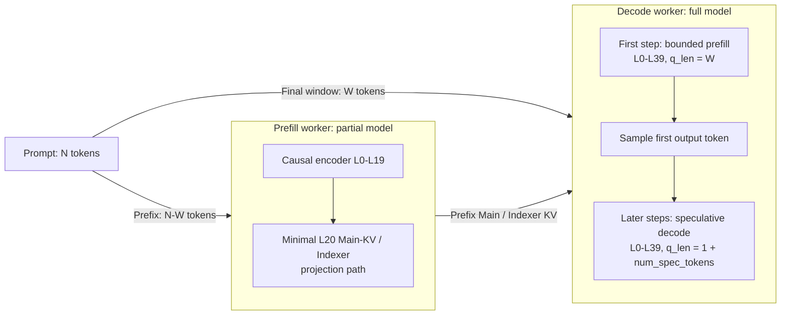
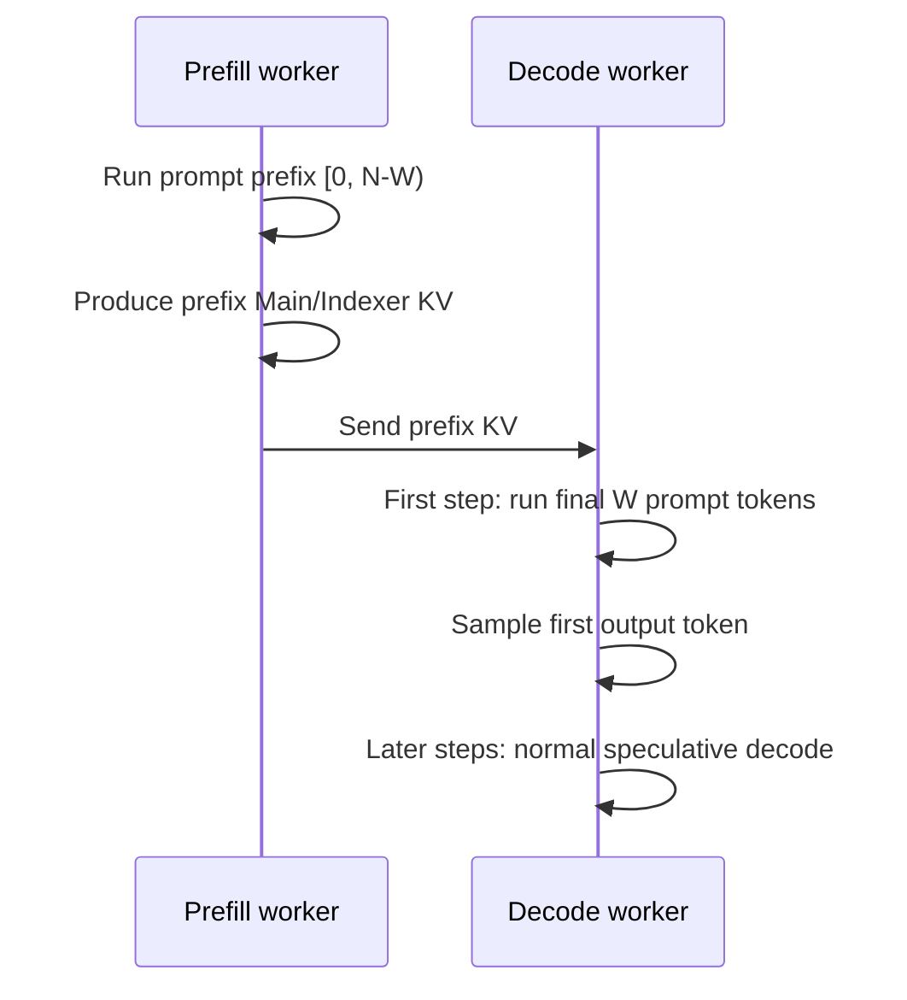

# [Issue #57383] [RFC]: Asymmetric P/D Deployment for DeepSeek-V4.1 Flash

source: https://github.com/vllm-project/vllm/issues/57383
state: open | updated: 2026-09-23T06:35:20Z
labels: RFC, deepseek, DSv4.1

## 正文

## Summary.

DeepSeek-V4.1's bounded-replay structure creates an opportunity to make Prefill/Decode disaggregation substantially more asymmetric.

Today, a Prefill worker still loads the full 40-layer model even though, after layer 20, only the final 128 prompt tokens need to be processed. This keeps almost half of the model weights resident on P for a small decoder-layer workload whose MoE utilization is likely poor.

This RFC proposes moving that final 128-token window entirely to the Decode worker:

- For a prompt of length `N`, P computes only `[0, N-128)` and transfers the resulting prefix KV state.
- D computes `[N-128, N)` as its first full-model step and samples the first output token.
- The request then continues through normal speculative decode with `q_len = 1 + num_spec_tokens`.

This asymmetry has two main benefits. 
- First, P would load only the causal encoder plus the minimal layer-20 KV/Indexer projection path, potentially removing close to half of its transformer-layer weights; a key target is fitting a production Prefill replica on one B300 GPU. 
- Second, moving the decoder-layer work to D increases the computational intensity of that work by executing it as part of D's much larger token batches, improving utilization relative to processing the 128-token replay on P.

The execution model on D also becomes simpler than layer-local decoder replay. D never needs separate encoder and decoder token batches:

```text
first D step:   all L0-L39 process the same 128 prompt tokens
later D steps:  all L0-L39 process the same 1 + num_spec_tokens tokens
```

The trade-off is that each newly admitted request contributes 128 bounded-prefill tokens to a D step, which can temporarily increase the Decode token count and affect ITL (TPOT). This incremental cost is expected to be modest for DeepSeek-V4.1 Flash: its light KV cache permits large Decode batches, and DSpark also makes each Decode batch process many tokens. Against that baseline, adding 128 tokens when a new request is admitted is a relatively small increase.

This RFC is a design proposal for discussion. I do not currently plan to implement it, and there is no prototype or benchmark result yet. Implementation ownership is open.

## Proposed Change.

### Model placement and token ownership



For prompts no longer than `W`, P performs no model forward and D processes the complete prompt.

Conceptually, P would retain:

- embeddings and complete layers L0-L19;
- the minimal layer-20 projections needed to produce its canonical C1 Main KV and Indexer K; and
- the state required by the KV connector handoff.

P would not retain the complete layer-20 attention/MoE path, layers 21–39, final normalization, or the LM head.

### Request flow



```
Moving first-token generation to Decode is intentional.
To minimize changes to the P-node scheduler, the P-node can compute the entire prompt (N tokens) instead of (N−W) tokens, since W is generally much smaller than N and the resulting redundant computation is negligible.
```

### Uniform Decode execution

Decode has two full-model step shapes:

```text
new request, first step:
  q_len = W
  active layers = L0-L39

later speculative decode steps:
  q_len = 1 + num_spec_tokens
  active layers = L0-L39
```

The first step is a bounded prefill using the transferred prefix state. After sampling, the request joins normal speculative decoding.

This avoids changing the token set after layer 20. The attention history differs by cache group, but the query rows do not:

- prefix-cacheable Main/Indexer groups read the transferred prefix state;
- SWA groups are rebuilt locally over the replay window, following the mechanism in #56227; and
- every layer executes the same `W` query rows in the first D step.

If bounded-prefill requests and ongoing decode requests are scheduled together, their request-level `q_len` values differ. This step is a non-uniform batch and may fallback to piecewise cudagraph. 

## Why This May Help.

### Smaller Prefill replicas

Prefill node no longer needs the complete decoder stack or LM head. This is expected to remove close to **`half of the weights`** from each Prefill node.

The exact saving depends on embeddings, KV pools, connector buffers, CUDA graphs, and allocator headroom. For DeepSeek-V4.1 Flash, savings map straight to GPUs: tiny KV cache + offloading make Prefill HBM weight-bound, so halving transformer weights nearly halves the Prefill GPU count. A key target is fitting one production Prefill replica on a single B300 GPU. 

### Avoid a low-density late-decoder tail on P

The bounded replay contains at most 128 tokens per new request. Running it on P produces a small decoder-layer token workload and low arithmetic intensity because Prefill batchsize is usually small.

In this proposal, D executes the final window as an ordinary full-model bounded-prefill step. It can batch multiple newly admitted requests and coordinate them with the larger Decode workload to get a **`higher arithmetic intensity`**.

### Simpler, unified model execution

The split is by workers and token ranges, not by layer ranges within a forward: 

```
- P runs the entire model (encoder + layer-20 KV/Indexer projection path) on the prompt, using the same workload throughout each step—no workload reset between encoder and decoder layers.
- D runs the entire model (encoder + decoder) on the bounded final window or normal decode workload.
```

This makes the execution architecture **`simpler and more uniform`**, while naturally accommodating Chunked Prefill, Prefix Caching, and Context Parallelism.

### Cost and Trade-offs.

The main cost is a larger first step on D:

```text
new request, first step:  q_len <= 128
later steps:              q_len = 1 + num_spec_tokens
```

Potential costs include:

- D must support both bounded-prefill and speculative-decode shapes.
- Admission bursts may increase ITL/TPOT for running requests.
- Mixing both request types in one scheduler iteration may require piecewise CUDA graphs or eager fallback.

This is likely **`acceptable`** for DeepSeek-V4.1 Flash because its compressed KV cache permits a **`large Decode batch`**, and steps admitting new requests are usually a small fraction of all Decode steps. This requires measurement.

## Relationship to Existing vLLM Work.

This proposal builds on, but is different from, two open vLLM PRs.

### #56227: encoder-side SWA bounded replay

[#56227](https://github.com/vllm-project/vllm/pull/56227) already provides much of the required runtime behavior:

- after a local or KV-connector prefix hit ending at `H`, the scheduler rewinds the final window;
- the worker recomputes `[H-W, H)` locally;
- Main/Indexer KV remains cached or transferred, while SWA is rebuilt locally; and
- `Request.replay_start` and attention metadata floor the replay window.

This PR is nearly orthogonal to the current RFC and provides sound logic for the P node's execution.

### #56752: decoder-side SWA bounded replay

[#56752](https://github.com/vllm-project/vllm/pull/56752) compacts the batch after layer 20 so layers 21–39 process only each request's trailing window.

That design still performs one forward in which different layer ranges process different token sets:

```text
L0-L20:  full prompt rows
L21-L39: trailing W rows
```

This RFC proposes a different deployment boundary:

```text
P: [0, N-W), L0-L19 and L20's KV/Indexer projection path
D: [N-W, N), through all L0-L39
```

Within a Decode step, every layer processes the same rows. There is no layer-20 compaction boundary, internal gather/scatter, or replay-layer sub-batch.

### Feedback Period.

### CC List.

_No response_

### Any Other Things.

_No response_

### Before submitting a new issue...

- [x] Make sure you already searched for relevant issues, and asked the chatbot living at the bottom right corner of the [documentation page](https://docs.vllm.ai/en/latest/), which can answer lots of frequently asked questions.

## 评论 (5)

### tlrmchlsmth · 2026-09-17

We should definitely do this!

### eddiegaoo · 2026-09-20

absolute genius 🔥 Excited to see this feature be supported soon

### wangyicong52 · 2026-09-23

Thanks @gz944367214 for proposing this asymmetric P/D direction. I’ve also been exploring ways to improve DeepSeek-V4.1-Flash prefill performance, and your RFC has been very helpful.

By the way, I found a related proposal, #57738. Unlike your design, #57738 still computes the final [N-W, N) window in the encoder layers on P. In my opinion, for long prompts, the cost of that extra window may be relatively small, while #57738 seems simpler to implement. Given this trade-off, I followed #57738 for an initial implementation with Mooncake in #57872. It builds on the direction you proposed here, but does not implement this RFC’s primary split. Initial H20 P/D benchmarks show substantial TTFT improvements, although the PR still needs further refinement.

Whichever approach vLLM maintainers prefer—this RFC or #57738—I’d be happy to coordinate with you and contribute complementary Mooncake integration, and perhaps even Prefill PP support if feasible. If someone opens a shared implementation PR, I’d be happy to stack that work on it. If no such PR comes forward, I’d also be interested in helping develop the chosen approach further. Happy to work together to move this feature forward.

### gz944367214 · 2026-09-23

```bash
Thanks @wangyicong52  for driving this forward and sharing the benchmark results in #57872. The substantial TTFT improvement on H20 is encouraging.
This RFC mainly aims to share a deployment pattern derived from the architecture of DeepSeek-V4.1-Flash and explain its theoretical benefits: reducing the P-node weight footprint, improving compute density for decoder-bound replay, and unifying inter-layer forward logic. It intentionally focuses on the high-level design rather than implementation details.
I agree with the minimal-change approach in #57738 and prefer reusing the existing framework logic. As noted in the RFC:
>To minimize changes to the P-node scheduler, the P-node can compute the entire prompt (N tokens) instead of (N−W) tokens, since W is generally much smaller than N and the resulting redundant computation is negligible. 
```

I believe framework simplicity and robustness far outweigh this negligible performance gap.
Really glad this idea is proving useful to the community, and thrilled to see concrete progress already. I'm excited to see more momentum behind this idea and hope it can bring tangible benefits to users.

### wangyicong52 · 2026-09-23

Thank you @gz944367214 for the encouragement and thoughtful feedback—I’ll keep refining and validating #57872 (and maybe add support for NIXL), and try my best to make this feature robust and useful for the community.
