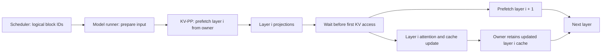

# [Issue #58329] [RFC]: KVPP (KV pipeline parallel, LayerSplit) for vLLM

source: https://github.com/vllm-project/vllm/issues/58329
state: open | updated: 2026-09-24T17:12:34Z
labels: rocm, RFC

## 正文

### Motivation.

This proposal is inspired by **Section 4, “LayerSplit,”** of Z.ai's [*Scaling Pain of Coding Agent Serving: Lessons from Debugging GLM-5 at Scale*](https://z.ai/blog/scaling-pain). LayerSplit introduces layer-wise ownership of KV-cache storage and makes the cache available to the other ranks when a layer runs. This RFC describes how to express that idea in vLLM's KV-cache planning and model-execution lifecycle.

An experimental implementation already exists in [vllm-ascend's KVPP design](https://docs.vllm.ai/projects/ascend/en/main/developer_guide/Design_Documents/kvpp/) and [feature guide](https://docs.vllm.ai/projects/ascend/en/main/user_guide/feature_guide/kvpp/).

### Terminology: why “KV-PP”

The existing implementation calls this feature **KVPP**, short for **KV pipeline parallel**. We propose writing the same name as **KV-PP** when explaining the parallelism axis. If vLLM's Decode Context Parallelism (DCP) is viewed, at the KV-storage level, as **KV-CP**—partitioning a sequence's KV tokens across ranks—then KV-PP is the complementary **layer-axis** partition: ranks persist different layers' KV caches and obtain a complete layer before using it.

| Conceptual axis | Persistent KV ownership | Access during attention |
| --- | --- | --- |
| KV-CP analogy (DCP) | Different token or context portions of a layer | Distributed attention uses the rank-local context and combines results. |
| KV-PP (this RFC) | Different complete layers | The layer owner makes its cache available to all computing ranks before cache access. |

### Goals

- Increase the logical cache-block capacity when replicated, persistent KV storage is the limiting resource.
- Keep scheduler block IDs, prefix-cache semantics, and request admission based on one complete logical KV-cache specification.
- Allow a device backend to choose layer owners, physical layouts, and a collective transport without teaching the scheduler about those details.
- Define synchronization and connector rules so that a cache read, write, offload, or remote transfer cannot observe an incomplete layer.

### Expected serving benefit and supporting evidence

The primary benefit is **higher throughput when a tiered KV pool serves long, repeatedly reused prefixes that exceed HBM capacity**. KV-PP reduces persistent per-rank KV storage by assigning each layer to an owner, leaving room for more cache blocks and more prefixes in HBM. A pool can then serve more prefix hits from HBM instead of loading them from a slower tier. The [vllm-ascend KVPP PR #16094](https://github.com/vllm-project/vllm-ascend/pull/16094) describes this supporting *follow-up integration benchmark* on Ascend A5 with an AscendStoreConnector/Memcache CPU pool of 32 GB per device, warmed prefix families larger than HBM, and approximately 90% shared prefix:

| Configuration | Input-token throughput, KV-PP off → on | HBM prefix-hit rate, off → on |
| --- | ---: | ---: |
| One node, 8 dies | 66,362.5 → 97,318.3 tokens/s (**+46.65%**) | 8.46% → 45.46% |
| Two nodes, 16 dies, PP2 | 86,438.8 → 125,699.3 tokens/s (**+45.42%**) | 0.59% → 53.87% |

PR #16094 itself reports a **5.35×–8.17× increase in logical KV-cache token capacity** across its tested configurations; that capacity creates the opportunity for the observed pooling benefit.

This is consistent with the *scenario and mechanism* in [Z.ai's LayerSplit report, Section 4](https://z.ai/blog/scaling-pain): long-context requests with high cache reuse benefit when layer-wise KV placement relieves device-memory pressure. Z.ai reports **10%–132% throughput gains** for 40K–120K requests at a 90% cache-hit rate. Its workload, model, hardware, and throughput metric differ from the Ascend integration benchmark, so the percentages are independent results rather than a direct comparison.

Without a capacity-constrained KV pool, the extra full-layer broadcasts can outweigh the memory benefit: PR #16094 reports **2.30%–12.77% lower input-token throughput** across its A5 non-pooling tests. This is the counterexample that motivates evaluating KV-PP together with cache residency and transfer metrics, rather than treating capacity growth as an unconditional speedup.

### Proposed Change.

### 1. Separate logical KV planning from physical placement

The model runner continues to report the **complete per-layer `KVCacheSpec`**. vLLM's engine groups those specs, chooses a common block count, and supplies the same logical block numbering to the scheduler and workers. A backend-provided placement plan then maps each layer to an owner rank and describes the worker-local physical cost.

For a first implementation, use a group contained within one data-parallel replica and one pipeline-parallel stage. A group may span TP ranks, or TP × PCP ranks when the backend produces replicated KV in that domain. Replicated, identical KV updates across the group are a prerequisite for retaining updates only on the owner; a backend with TP-sharded KV heads would need a different gather or writeback protocol. Layers local to the PP stage are ordered deterministically and assigned in balanced, contiguous partitions. A layer's main KV, indexer cache, and associated scales form one ownership bundle. Draft-model caches that must remain local are excluded from target-layer partitioning.

For rank `r`, a simple conservative budget is:

```text
bytes_per_logical_block(r) =
    bytes_for_layers_owned_by(r)
  + bytes_for_rank_local_draft_caches(r)
  + 2 × bytes_for_largest_target_layer_bundle

max_blocks(r) = floor(available_KV_bytes(r) / bytes_per_logical_block(r))
```

The engine still selects a block count that every worker can allocate. The placement plan must use the same group-relative rank and layout in both memory budgeting and allocation. The two scratch buffers permit one layer to be consumed while the next is prefetched. Backends may later provide a different buffer policy, but any such policy must be included in the budget.

### 2. Allocate owner storage and reusable receive buffers

On each rank, allocate persistent storage only for its owned target layers and any independent local caches. Allocate two reusable scratch buffers sized for the largest target-layer bundle. Every component of one bundle must have a stable, agreed byte layout so one collective can transfer it. Attention layers still receive normal cache tensor views; they need not know whether the view points to persistent storage or a scratch buffer.

The physical allocator must consume the **final** `KVCacheConfig.num_blocks` returned by the engine. A backend that cannot represent a cache spec, aliasing relationship, or physical layout must reject KV-PP during configuration or planning rather than allocate an incomplete cache.

### 3. Prefetch one layer ahead during model execution

For a forward pass with previously computed KV, start the first layer's prefetch before its attention work. The owner broadcasts the complete historical bundle to the other ranks on a transfer stream. After Q/KV projections, but before the first cache read or write, the attention backend waits for transfer completion and starts prefetching the next layer. The owner retains the updated cache after the layer executes. A forward pass with no historical KV does not need a historical-cache broadcast.



The readiness event must cover preceding cache writes, and the completion event must cover device-side reads of the owner's source and writes to receivers. Every rank in a group must make the same broadcast decision and issue collectives in the same layer order. With PCP, that decision must use the global scheduled batch rather than a rank-local token segment.

The initial scope is **prefill nodes** in disaggregated serving, where layer prefetch can be scheduled ahead of cache-consuming attention and has a meaningful opportunity to overlap communication with computation. Decode has much less computation per token, so simple one-layer-ahead prefetch is unlikely to hide the broadcast reliably. Decode-side KV-PP requires finer control over transfer timing and cache use in the actual attention backend and operators; it will be a separate follow-up.

### 4. Make external KV transfer ownership-aware

KV connectors should register only persistent owner buffers and independent local caches; scratch buffers are temporary and must never be advertised as durable KV. A producer with layer-sharded storage must publish per-layer ownership so a consumer can select a rank that actually holds each layer. A pool lookup must account for every required owner shard before declaring a prefix complete. Connector load completion must precede the attention-side KV-PP wait and cache access.

The first version should define explicit compatibility gates for each connector and parallelism combination. A connector should opt in only after its layer-ownership, completeness, and load-before-use contracts have been verified. This keeps the core vLLM contract independent of any particular KV pool or transfer implementation.

### Trade-offs and alternatives

KV-PP exchanges persistent cache memory for full-layer broadcast traffic. The first implementation broadcasts all allocated blocks in a layer, including inactive blocks; its communication volume therefore grows with provisioned capacity. Prefetch can overlap some of that cost with projections and attention, but the overlap is workload- and backend-dependent. Per-request or per-active-block transfer could reduce bytes but requires a more complex ownership, packing, and synchronization protocol. Replicating all layers avoids the collective but retains the memory bottleneck. DCP shards the context axis and changes attention execution, so it addresses a different dimension and is not an interchangeable implementation of layer ownership.


### Feedback Period.

~2 weeks

### CC List.

@ZJY0516 @NickLucche @LucasWilkinson @GirasoleY @ivanium 

### Any Other Things.

```python
### Co-Author
@recky-c

- Reference implementation: [vllm-ascend KVPP documentation](https://docs.vllm.ai/projects/ascend/en/main/user_guide/feature_guide/kvpp/).
- Original inspiration and attribution: [Z.ai, Section 4 “LayerSplit”](https://z.ai/blog/scaling-pain).
```

### Before submitting a new issue...

- [x] Make sure you already searched for relevant issues, and asked the chatbot living at the bottom right corner of the [documentation page](https://docs.vllm.ai/en/latest/), which can answer lots of frequently asked questions.

## 评论 (4)

### github-actions[bot] · 2026-09-23

CC @hongxiayang @tjtanaa @vllmellm @giuseppegrossi for ROCm-related issue

### sjsreehari · 2026-09-23

This looks like a very interesting direction for bringing LayerSplit / KV-PP into core vLLM v1, especially for long-context agentic serving and tiered prefix caching.

I went through the proposal against the current v1 KV engine (`vllm/v1/kv_cache_interface.py` & `vllm/v1/core/kv_cache_utils.py`) and had a few architectural observations and questions. I’d also be interested in contributing to the implementation, review, and testing of this work.

**Logical Planning vs. Physical Placement Decoupling:**

Decoupling KVCacheSpec from physical placement is the right abstraction. In `kv_cache_utils.py`, `_get_kv_cache_bytes_per_block` currently assumes uniform full-layer residency across all workers.

When calculating `bytes_per_logical_block(r)` for rank `r`, ensuring contiguous balanced partitions for PP stages makes sense. How should asymmetric layer architectures (e.g., hybrid models where only certain layers have sliding windows or MLA indexers, such as DeepSeek-V3/GLM-5) handle layer balancing across ranks to prevent memory skew?

**CUDA / ROCm Stream Synchronization & Graph Capture:**

Overlapping the full-layer broadcast on a dedicated `transfer_stream` with projection kernels on the main compute stream requires precise event synchronization (`cudaEventRecord` / `cudaStreamWaitEvent`).

For CUDAGraph/HIPGraph execution, will KV-PP prefetch collectives be captured directly into the graph, or will KV-PP initially be scoped to eager-mode prefill phases before being integrated into graph-captured decode steps?

**EAGLE / MTP Draft Models & Speculative Decoding:**

Excluding draft-model / speculative verification caches from layer partitioning (keeping them rank-local) is essential to avoid collective overhead on tiny draft verification passes. Marking them via `KVCacheGroupSpec.is_eagle_group = True` or role tags in `KVCacheConfig` fits cleanly into the existing v1 spec hierarchy.

**KV Transfer / Connector Contract:**

Restricting external KV connector registration exclusively to persistent owner buffers (and rejecting scratch transit buffers) guarantees data durability.

For distributed pool lookups (e.g., LMCache / AscendStoreConnector), we will need a metadata manifest mapping `layer_id -> owner_rank_id` so remote transfer agents only dispatch pull requests to the owning rank.

I’m interested in working on this as a contributor and would be happy to help with implementation, review, or testing as the design evolves.

### sjsreehari · 2026-09-23

Hi @pisceskkk and @vllm-project maintainers,

```
Thank you for opening this RFC. To help move the discussion forward and validate the feasibility in core vLLM v1, I have prototyped **Phase 1 (Decoupled KV-Cache Planning and Layer Placement)** on my fork:
 **Branch**: [`feature/kvpp-layersplit-v1`](https://github.com/sjsreehari/vllm/tree/feature/kvpp-layersplit-v1)
```

### Key Architectural Components Implemented
1. **Decoupled Planning vs. Placement**:
   - Scheduler & Engine Coordinator maintain a uniform logical view of block capacity (`num_blocks`, block indices, common logical block footprint) across ranks to keep scheduling synchronized.
   - Workers physically allocate tensors only for their assigned target layers via `KVPPPlacementPlan`.
2. **Contiguous & Balanced Layer Partitioning**:
   - Implemented `compute_kv_pp_placement_plan` to distribute model layers contiguously across `kv_pipeline_parallel_size` ranks using balanced divmod slicing (handling odd layer counts gracefully).
3. **Speculative Decoding / Draft Model Isolation**:
   - Preserves draft model groups (e.g., EAGLE, MTP `is_eagle_group=True`) as strictly rank-local across all ranks; draft weights and KV buffers are never partitioned.
4. **Scratch Transit Buffer Budgeting**:
   - Budgets `scratch_buffer_bytes_per_block = 2 * max_target_layer_bytes` per rank to support double-buffering inter-stage transfers (one layer executing while the next is prefetched).
5. **Full Unit Test Coverage**:
   - Added suite in `tests/v1/core/test_kv_pp_planning.py` validating uniform models, remainder distribution, draft isolation, and ~3.2x block capacity expansion at PP4 (all 6 tests passing, zero regressions on existing `test_kv_cache_utils.py`).

Looking forward to your thoughts on this decoupled interface and whether you'd like to review Phase 1 as an incremental foundation or align further on Phase 2 (runtime execution & communication) first!
```

### sjsreehari · 2026-09-24

Hi @pisceskkk, @recky-c, and maintainers (@ZJY0516, @NickLucche, @LucasWilkinson, @GirasoleY, @ivanium),

To support the discussion on Phase 1 (Logical KV Planning vs Physical Placement Decoupling), I have prepared an initial prototype / draft PR in #58428:
- Implements `KVPPPlacementPlan` and decouples logical `num_blocks` from rank-local physical allocations.
- Handles contiguous layer partitioning with remainder balancing.
- Isolates draft-model / speculative groups (`is_eagle_group = True`) as rank-local.
- Budgets 2× ping-pong scratch buffers for inter-rank layer prefetch.
- Includes comprehensive unit tests in `tests/v1/core/test_kv_pp_planning.py`.

Looking forward to your feedback on the planning interface!

