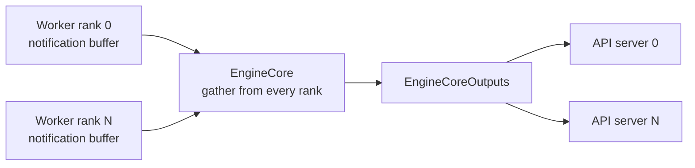
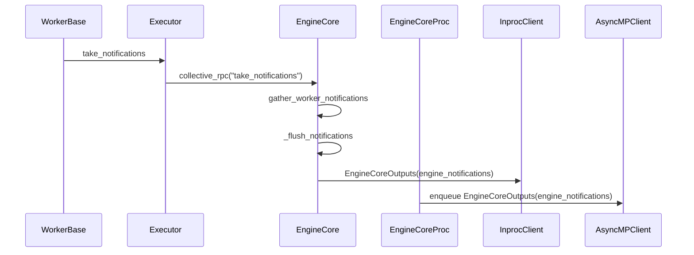

# [PR #51433] [Engine Core] Gather engine notifications from workers to frontends

source: https://github.com/vllm-project/vllm/pull/51433
state: open | updated: 2026-09-25T01:00:16Z
labels: ready, mrv2, rust

## 正文

First split of #45411. Notification channel only; LoRA events, the Rust frontend consumer, and the scheduler hook will follow as separate stacked PRs.



- `vllm/v1/notifications.py`: tagged msgspec union with `CustomNotification(key, payload)`, and a process-local worker buffer.
- `WorkerBase.take_notifications()`: drains that buffer. One default implementation covers every worker type.
- `EngineCore.gather_worker_notifications()`: `collective_rpc("take_notifications")`, keeping every rank.
- `EngineCoreOutputs.engine_notifications`: appended field, plus the matching Rust `WireEngineCoreOutputs` field and `protocol/notifications.rs`.
- `EngineCoreProc` broadcasts to all API servers so their `/metrics` agree.

Why gather instead of piggybacking on `ModelRunnerOutput`: the executor only reads one rank's reply, so anything the other ranks published would just get dropped, and some paths (non-last PP rank via `with_kv_conn_output_only`) return early without a full output.

The gather itself fires once when the serving loop starts, then only if you opt in with `VLLM_WORKER_NOTIFICATION_POLL_INTERVAL` (off by default). This keeps the rpc off of the engine steps path.

#54830 adds a doorbell on top of this (the output rank flags a non-empty buffer on `ModelRunnerOutput`, and the engine core gathers after that step), so in-tree producers do not depend on polling.

`cargo test -p vllm-engine-core-client --lib`: 101 passed. `pytest tests/v1/engine/test_notifications.py`: 13 passed.

## Stack

1. #51433 engine notification channel (this PR)
2. #54830 LoRA load events, doorbell, and Python Prometheus metrics
3. #54833 Rust frontend consumer for the same metrics

Each PR is based on `main` and includes the commits of the ones before it; review only the last commits of each.

## AI assistance disclosure

Developed code and the test harness with AI assistance (Claude Code). All changes were reviewed line-by-line by myself, who ran the tests and reviewed output.

## 评论 (10)

### wseaton · 2026-08-07

Something non-obvious here is that certain consumer use-cases for this channel (Like if you wanted `nixl` transfer metrics from different TP ranks to fold back to the frontend, eg. when using `modelexpress` as a weight loader plugin) require that rank output from ranks other than rank=0 are not discarded. Marking as draft until I settle on a design that works for both cases.

Edit: The stated use case (weight transfer metrics) is moot until vllm can serve metrics before/during engine initialization.

### mergify[bot] · 2026-08-13

This pull request has merge conflicts that must be resolved before it can be
merged. Please rebase the PR, @wseaton.

https://docs.github.com/en/pull-requests/collaborating-with-pull-requests/working-with-forks/syncing-a-fork


### mergify[bot] · 2026-08-21

This pull request has merge conflicts that must be resolved before it can be
merged. Please rebase the PR, @wseaton.

https://docs.github.com/en/pull-requests/collaborating-with-pull-requests/working-with-forks/syncing-a-fork


### github-actions[bot] · 2026-09-01

✅ @wseaton, CI is now available for this PR.

- `/ci run` starts upstream CI; `/amd-ci run` starts AMD CI only.
- `/ci retry` retries failed jobs in the CI build for the current PR head. If the current head has no CI build, it starts a new CI build for the current head containing only jobs that failed in the latest earlier CI build for this PR.
- `/amd-ci retry` retries failed jobs in AMD CI for the current PR head. Use `/amd-ci run` when the current head has no AMD CI build.
- `/ci cancel` cancels scheduled or running CI builds for this PR branch; `/amd-ci cancel` does the same for AMD CI only.

<!-- vllm-ci-authorized -->

### coderabbitai[bot] · 2026-09-02

```html
<!-- This is an auto-generated comment: summarize by coderabbit.ai -->
<!-- review_stack_entry_start -->
```

[](https://app.coderabbit.ai/change-stack/vllm-project/vllm/pull/51433)

```html
<!-- review_stack_entry_end -->
<!-- recent_review_start -->
```

No actionable comments were generated in the recent review. 🎉

<details>
<summary>ℹ️ Recent review info</summary>

<details>
<summary>⚙️ Run configuration</summary>

**Configuration used**: Repository UI

**Review profile**: CHILL

**Plan**: Team

**Run ID**: `82cbd4bf-82c3-4d1b-9460-b13713dc0518`

</details>

<details>
<summary>📥 Commits</summary>

Reviewing files that changed from the base of the PR and between f2e2936f91a794513af74d009286c69e3fb2592b and 90fd7ec99e6a8b0f5bf6a02f3a9dc05367ba1627.

</details>

<details>
<summary>📒 Files selected for processing (12)</summary>

* `rust/src/engine-core-client/src/protocol/mod.rs`
* `rust/src/engine-core-client/src/protocol/notifications.rs`
* `rust/src/engine-core-client/src/protocol/output.rs`
* `rust/src/engine-core-client/src/tests/client.rs`
* `rust/src/engine-core-client/src/tests/python_compat.py`
* `tests/v1/engine/test_notifications.py`
* `vllm/envs.py`
* `vllm/v1/engine/__init__.py`
* `vllm/v1/engine/core.py`
* `vllm/v1/engine/core_client.py`
* `vllm/v1/notifications.py`
* `vllm/v1/worker/worker_base.py`

</details>

<details>
<summary>🚧 Files skipped from review as they are similar to previous changes (12)</summary>

* vllm/v1/worker/worker_base.py
* rust/src/engine-core-client/src/protocol/mod.rs
* vllm/envs.py
* vllm/v1/engine/__init__.py
* rust/src/engine-core-client/src/protocol/output.rs
* rust/src/engine-core-client/src/tests/client.rs
* vllm/v1/engine/core_client.py
* vllm/v1/engine/core.py
* rust/src/engine-core-client/src/protocol/notifications.rs
* tests/v1/engine/test_notifications.py
* vllm/v1/notifications.py
* rust/src/engine-core-client/src/tests/python_compat.py

</details>

**Included review availability:** Your plan provides up to 10 included reviews per hour; 9 remain after this review.

</details>

---


```html
<!-- recent_review_end -->
<!-- walkthrough_start -->
```

<details>
<summary>📝 Summary</summary>

<!-- This is an auto-generated comment: release notes by coderabbit.ai -->

## Summary by CodeRabbit

* **New Features**
  * Added support for custom engine notifications from workers to frontends.
  * Notifications are delivered across in-process and multi-process execution paths, including cross-rank gathering.
  * Added configurable notification polling, disabled by default.
  * Added bounded buffering with ordered delivery to prevent excessive queue growth.

* **Bug Fixes**
  * Notification-only outputs are now preserved and transmitted correctly.

* **Tests**
  * Added coverage for buffering, polling, broadcasting, serialization compatibility, and end-to-end notification delivery.

<!-- end of auto-generated comment: release notes by coderabbit.ai -->
## Walkthrough

Adds tagged custom notification types to the Rust and Python protocols, a bounded worker queue, rank gathering, polling, and frontend delivery. Engine outputs carry optional notifications through in-process and multiprocessing clients. Tests cover serialization, buffering, concurrency, polling, fan-out, and end-to-end delivery.

### Changes

**Engine notification pipeline**

|Layer / File(s)|Summary|
|---|---|
|**Notification protocol and wire contract** <br> `rust/src/engine-core-client/src/protocol/*`, `rust/src/engine-core-client/src/tests/*`, `vllm/v1/engine/__init__.py`|Defines tagged custom notifications and adds optional notification fields to Rust and Python engine output messages.|
|**Worker notification buffering** <br> `vllm/v1/notifications.py`, `vllm/v1/worker/worker_base.py`, `tests/v1/engine/test_notifications.py`|Adds a bounded, thread-safe queue with ordered draining, overflow handling, and worker drain coverage.|
|**Engine gathering and frontend delivery** <br> `vllm/v1/engine/core.py`, `vllm/v1/engine/core_client.py`, `vllm/envs.py`, `tests/v1/engine/test_notifications.py`|Gathers notifications across ranks, polls workers using the configured interval, flushes in-process outputs, broadcasts process outputs, and validates polling and end-to-end delivery.|

**Estimated code review effort:** 4 (Complex) | ~45 minutes

<!-- final_review_risk_start -->
**Merge Risk:** _⚪ Minimal_ · up to `90fd7`
<!-- final_review_risk_coverage:{"sourceCommitId":"90fd7ec99e6a8b0f5bf6a02f3a9dc05367ba1627","coveredCommitId":"90fd7ec99e6a8b0f5bf6a02f3a9dc05367ba1627","kind":"reviewed"} -->

```
This change adds a worker-to-frontend notification channel with optional polling disabled by default. No concrete merge-blocking risk is established for the current implementation.
<!-- final_review_risk_end -->
```

### Sequence Diagram(s)



</details>

```html
<!-- walkthrough_end -->
<!-- pre_merge_checks_walkthrough_start -->
```

<details>
<summary>🚥 Pre-merge checks | ✅ 4 | ❌ 1</summary>

### ❌ Failed checks (1 warning)

|     Check name     | Status     | Explanation                                                                                                                                                                                  | Resolution                                                                         |
| :----------------: | :--------- | :------------------------------------------------------------------------------------------------------------------------------------------------------------------------------------------- | :--------------------------------------------------------------------------------- |
| Docstring Coverage | ⚠️ Warning | Docstring coverage is 67.16% which is insufficient. The required threshold is 80.00%. Docstring coverage is scoped to functions touched by this diff. Analyzed 67 functions across 12 files. | Write docstrings for the functions missing them to satisfy the coverage threshold. |

<details>
<summary>✅ Passed checks (4 passed)</summary>

|         Check name         | Status   | Explanation                                                                                                                                  |
| :------------------------: | :------- | :------------------------------------------------------------------------------------------------------------------------------------------- |
|         Title check        | ✅ Passed | The title clearly and concisely describes the primary change: gathering engine notifications from workers and delivering them to frontends.  |
|      Description check     | ✅ Passed | The description directly explains the notification channel, affected components, data flow, configuration, follow-up work, and test results. |
|     Linked Issues check    | ✅ Passed | Check skipped because no linked issues were found for this pull request.                                                                     |
| Out of Scope Changes check | ✅ Passed | Check skipped because no linked issues were found for this pull request.                                                                     |

</details>

</details>

<!-- pre_merge_checks_walkthrough_end -->

```json
- [ ] <!-- {"checkboxId":"585bb3f6-faf5-4dbf-96d2-74e382adf19a"} --> Fix all pre-merge checks with AI
<!-- tips_start -->
```

---

Thanks for using [CodeRabbit](https://coderabbit.ai?utm_source=oss&utm_medium=github&utm_campaign=vllm-project/vllm&utm_content=51433)! It's free for OSS, and your support helps us grow. If you like it, consider giving us a shout-out.

<details>
<summary>❤️ Share</summary>

```
- [X](https://twitter.com/intent/tweet?text=I%20just%20used%20%40coderabbitai%20for%20my%20code%20review%2C%20and%20it%27s%20fantastic%21%20It%27s%20free%20for%20OSS%20and%20offers%20a%20free%20trial%20for%20the%20proprietary%20code.%20Check%20it%20out%3A&url=https%3A//coderabbit.ai)
- [Mastodon](https://mastodon.social/share?text=I%20just%20used%20%40coderabbitai%20for%20my%20code%20review%2C%20and%20it%27s%20fantastic%21%20It%27s%20free%20for%20OSS%20and%20offers%20a%20free%20trial%20for%20the%20proprietary%20code.%20Check%20it%20out%3A%20https%3A%2F%2Fcoderabbit.ai)
- [Reddit](https://www.reddit.com/submit?title=Great%20tool%20for%20code%20review%20-%20CodeRabbit&text=I%20just%20used%20CodeRabbit%20for%20my%20code%20review%2C%20and%20it%27s%20fantastic%21%20It%27s%20free%20for%20OSS%20and%20offers%20a%20free%20trial%20for%20proprietary%20code.%20Check%20it%20out%3A%20https%3A//coderabbit.ai)
- [LinkedIn](https://www.linkedin.com/sharing/share-offsite/?url=https%3A%2F%2Fcoderabbit.ai&mini=true&title=Great%20tool%20for%20code%20review%20-%20CodeRabbit&summary=I%20just%20used%20CodeRabbit%20for%20my%20code%20review%2C%20and%20it%27s%20fantastic%21%20It%27s%20free%20for%20OSS%20and%20offers%20a%20free%20trial%20for%20proprietary%20code)
```

</details>


<sub>Comment `@coderabbitai help` to get the list of available commands.</sub>

<!-- tips_end -->

### coderabbitai[bot] · 2026-09-03

<!-- This is an auto-generated comment by CodeRabbit -->
> [!NOTE]
> GitHub couldn't provide a complete incremental comparison for this pull request, so CodeRabbit is performing a full review instead. This review may take a little longer.

### coderabbitai[bot] · 2026-09-06

<!-- This is an auto-generated comment by CodeRabbit -->
<!-- coderabbit-full-review-fallback-pr-51433-head-90fd7ec99e6a8b0f5bf6a02f3a9dc05367ba1627 -->
> [!NOTE]
> GitHub couldn't provide a complete incremental comparison for this pull request, so CodeRabbit is performing a full review instead. This review may take a little longer.

### wseaton · 2026-09-09

@njhill @BugenZhao bumping this one, trying to optimistically get it and https://github.com/vllm-project/vllm/pull/54830 in before the dev cut so we can ship some llm-d routing optimizations for LoRA

### mergify[bot] · 2026-09-17

This pull request has merge conflicts that must be resolved before it can be
merged. Please rebase the PR, @wseaton.

https://docs.github.com/en/pull-requests/collaborating-with-pull-requests/working-with-forks/syncing-a-fork


### mergify[bot] · 2026-09-24

This pull request has merge conflicts that must be resolved before it can be
merged. Please rebase the PR, @wseaton.

https://docs.github.com/en/pull-requests/collaborating-with-pull-requests/working-with-forks/syncing-a-fork


## Review (4)

### claude[bot] · 2026-08-07 · COMMENTED

## Claude Code Review

This pull request is from a fork — automated review is disabled. A repository maintainer can comment `@claude review` to run a one-time review.

### claude[bot] · 2026-08-10 · COMMENTED

## Claude Code Review

This pull request is from a fork — automated review is disabled. A repository maintainer can comment `@claude review` to run a one-time review.

### yewentao256 · 2026-09-01 · COMMENTED

Generally LGTM, thanks for the work!

Also want an approval from @njhill  or @BugenZhao 

### wseaton · 2026-09-02 · COMMENTED

(no text)
