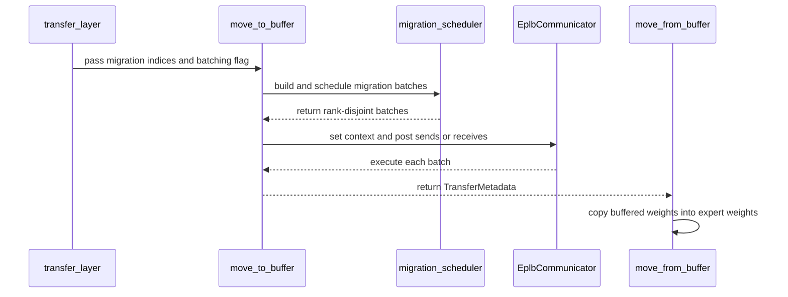

# [PR #52641] [EPLB] Add contention-aware expert migration batching

source: https://github.com/vllm-project/vllm/pull/52641
state: open | updated: 2026-09-25T00:58:47Z
labels: ci/build

## 正文

Partially addresses #31671.

## Summary

During async EPLB, several expert weights can be transferred through the same rank and NIC at once. These traffic bursts compete with inference and can increase serving latency.

This change adds an opt-in scheduler that groups migrations by source and destination rank, then splits them into batches. In each batch, a rank communicates with at most one peer, while independent rank pairs still transfer concurrently. Expert weights still move one layer at a time, but schedules for all MoE layers are prepared once per rebalance cycle to reduce Python overhead.

`enable_migration_batching` remains `false` by default. Setting it to `true` enables the new path only when `use_async=true`; synchronous EPLB always keeps the existing path because inference is paused and serial batches would extend the pause. NIXL transfer context is restored before every batch because `execute()` drains it.

I checked open EPLB migration/scheduling PRs and found no duplicate implementation. AI assistance was used; I (a human contributor) reviewed every changed line and am responsible for the contribution.

## Tests

```bash
.venv/bin/python -m pytest tests/distributed/test_eplb_migration_scheduler.py -q

.venv/bin/pre-commit run --files \
  vllm/config/parallel.py \
  vllm/distributed/eplb/async_worker.py \
  vllm/distributed/eplb/eplb_state.py \
  vllm/distributed/eplb/migration_scheduler.py \
  vllm/distributed/eplb/rebalance_execute.py \
  tests/distributed/test_eplb_migration_scheduler.py
```

Result: `12 passed`; selected pre-commit hooks passed.

## End-to-end serving benchmark

One four-node run used Ubuntu 22.04.5, one Quadro RTX 6000 24 GB GPU per node, Ray 2.56.1, NIXL 1.3.2 over 10 GbE without RDMA, and prefix caching enabled. The model was `Qwen/Qwen3-30B-A3B-Instruct-2507` with TP=4 and 32-way concurrency. Each case used a fresh server; 500/500 requests completed.

Server command:

```bash
MODEL=Qwen/Qwen3-30B-A3B-Instruct-2507
USE_BATCHING=true  # repeat with false
EPLB_CONFIG="{\"window_size\":50,\"step_interval\":50,\"num_redundant_experts\":32,\"log_balancedness\":false,\"use_async\":true,\"communicator\":\"nixl\",\"enable_migration_batching\":$USE_BATCHING}"

vllm serve "$MODEL" --dtype float16 --port 8000 \
  --gpu-memory-utilization 0.9 --max-model-len 4096 \
  --enable-prefix-caching --tensor-parallel-size 4 \
  --distributed-executor-backend ray --enable-expert-parallel \
  --enable-eplb --eplb-config "$EPLB_CONFIG" --enforce-eager
```

Bench command:

```bash
vllm bench serve --backend vllm --model "$MODEL" --port 8000 \
  --dataset-name random --random-prefix-len 300 \
  --random-input-len 200 --random-output-len 300 \
  --num-prompts 500 --max-concurrency 32 --seed 0 --temperature 0 \
  --percentile-metrics ttft,tpot,e2el --metric-percentiles 50,99 \
  --ignore-eos --disable-tqdm --save-result \
  --result-dir "$RESULTS" --result-filename bench.json
```

| Batching | Duration (s) | Request/s | Output tok/s | TTFT P50/P99 (ms) | TPOT P50/P99 (ms) | E2EL P50/P99 (ms) |
| --- | ---: | ---: | ---: | ---: | ---: | ---: |
| off | 4,756.10 | 0.1051 | 31.54 | 49,180.71 / 75,740.25 | 828.53 / 1,007.82 | 303,462.69 / 322,184.88 |
| on | 4,650.17 | 0.1075 | 32.26 | 48,599.04 / 74,756.17 | 812.44 / 999.01 | 293,821.76 / 317,351.61 |

Async batching improved request throughput by 2.28%, TTFT P50/P99 by 1.18%/1.30%, TPOT P50/P99 by 1.94%/0.87%, and E2EL P50/P99 by 3.18%/1.50%.

The head node's total network traffic (bytes received + bytes transmitted) was sampled from Linux byte counters once per second; it is not a `vllm bench serve` metric. NIC P99 decreased from 599.81 to 538.40 MB/s (10.24%). The plots and unmodified JSON/log files are in [`results/serving_nixl_20260911_async_random500`](https://github.com/DOCCA0/vllm/tree/ilp/benchmarks/eplb_rebalance/results/serving_nixl_20260911_async_random500).


## Scheduler profiling

The profiling run used the same server and workload parameters, with only NVTX-only Nsight capture enabled. The exact commands are documented in [`COMMANDS.md`](https://github.com/DOCCA0/vllm/blob/ilp/benchmarks/eplb_rebalance/results/serving_nixl_20260911_async_random500_profile/COMMANDS.md). Open the four [`rank*.nsys-rep`](https://github.com/DOCCA0/vllm/tree/ilp/benchmarks/eplb_rebalance/results/serving_nixl_20260911_async_random500_profile/trace) files with Nsight Systems 2024.5.1 or newer and search for `eplb: schedule migration batches`.

Each range is one scheduler call covering all 48 MoE layers in a rebalance cycle, rather than one call per layer. The transfers themselves remain layer-by-layer. The measured per-rank results were:

| Rank | Calls | P50/call (ms) | Total time across all calls (ms) |
| ---: | ---: | ---: | ---: |
| 0 | 34 | 7.819 | 302.081 |
| 1 | 34 | 7.090 | 253.152 |
| 2 | 34 | 7.035 | 255.239 |
| 3 | 34 | 7.005 | 241.190 |

The four ranks schedule concurrently, so their times are not added. Across the 34 cycle-wide scheduler calls, rank 0 had the largest measured total scheduling time: 302.081 ms. The independent clean A/B benchmark completed 105.932 s faster with batching. Comparing these two measured values gives a scheduler-cost-to-serving-time-saved ratio of 0.285%.


Thanks to my advisor Massimo Tornatore (massimo.tornatore@polimi.it) and Assistant Professor [Qiaolun Zhang](https://github.com/qiaolunzhang) (qiaolun.zhang@polimi.it) for their professional support.

## 评论 (13)

### DOCCA0 · 2026-08-31

> The PR looks good. Some cosmetic changes required.
> 
> Regarding the benchmarking, why didn't you use the default nixl eplb communicator? Also, from the command line it's unclear what were the eplb parameters (most importantly step interval).

I did both gloo and nixl. But the bench.json file of nixl is coverd by bench.json of torch_gloo .
I will redo all the bench using nixl and show you the results.

### ilmarkov · 2026-09-03

/ci run

### github-actions[bot] · 2026-09-03

❌ @ilmarkov, Only reviewers with write access can use CI commands before CI is delegated to the PR author.

<!-- vllm-ci-command:5523353136 -->

### tlrmchlsmth · 2026-09-03

/ci run

### github-actions[bot] · 2026-09-03

✅ Triggered [Buildkite CI #87080](https://buildkite.com/vllm/ci/builds/87080) for commit `c57337e51c1e`.

### coderabbitai[bot] · 2026-09-03

```html
<!-- This is an auto-generated comment: summarize by coderabbit.ai -->
<!-- review_stack_entry_start -->
```

[](https://app.coderabbit.ai/change-stack/vllm-project/vllm/pull/52641)

```html
<!-- review_stack_entry_end -->
<!-- This is an auto-generated comment: review paused by coderabbit.ai -->
```

> [!NOTE]
```bash
> ## Reviews paused
> 
> It looks like this branch is under active development. To avoid overwhelming you with review comments due to an influx of new commits, CodeRabbit has automatically paused this review. You can configure this behavior by changing the `reviews.auto_review.auto_pause_after_reviewed_commits` setting.
> 
> Use the following commands to manage reviews:
> - `@coderabbitai resume` to resume automatic reviews.
> - `@coderabbitai review` to trigger a single review.
> 
> Use the checkboxes below for quick actions:
> - [ ] <!-- {"checkboxId":"7f6cc2e2-2e4e-497a-8c31-c9e4573e93d1"} --> ▶️ Resume reviews
> - [ ] <!-- {"checkboxId":"e9bb8d72-00e8-4f67-9cb2-caf3b22574fe"} --> 🔍 Trigger review
```

```html
<!-- end of auto-generated comment: review paused by coderabbit.ai -->
<!-- recent_review_start -->
```

No actionable comments were generated in the recent review. 🎉

<details>
<summary>ℹ️ Recent review info</summary>

<details>
<summary>⚙️ Run configuration</summary>

**Configuration used**: Repository UI

**Review profile**: CHILL

**Plan**: Team

**Run ID**: `9a3a0e17-6a75-41dd-b97d-33c263406d6c`

</details>

<details>
<summary>📥 Commits</summary>

Reviewing files that changed from the base of the PR and between 4f6321805051733b10815b6e0810529f35cd1764 and a3db9bd1c32865c02b59d24ac2d407331e0990db.

</details>

<details>
<summary>📒 Files selected for processing (1)</summary>

* `vllm/config/parallel.py`

</details>

**Included review availability:** Your plan provides up to 10 included reviews per hour; 9 remain after this review.

</details>

---


```html
<!-- recent_review_end -->
<!-- walkthrough_start -->
```

## Walkthrough

EPLB expert migrations now support deterministic, rank-disjoint batching. Configuration enables batching by default, and transfer call sites forward the setting. Tests cover scheduling, buffered transfers, configuration, and validation behavior.

### Changes

**EPLB migration batching**

|Layer / File(s)|Summary|
|---|---|
|**Migration instruction building and batch scheduling** <br> `vllm/distributed/eplb/migration_scheduler.py`, `tests/distributed/test_eplb_migration_scheduler.py`|Adds immutable migration flows, expert index mapping, balanced sender assignment, deterministic rank-disjoint batching, and scheduler validation tests.|
|**Batched migration transfer execution** <br> `vllm/distributed/eplb/rebalance_execute.py`, `tests/distributed/test_eplb_migration_scheduler.py`|Adds batched send/receive execution, local row resolution, metadata reuse, and buffered transfer tests.|
|**Batching configuration and transfer-state integration** <br> `vllm/config/parallel.py`, `vllm/distributed/eplb/async_worker.py`, `vllm/distributed/eplb/eplb_state.py`, `tests/distributed/test_eplb_migration_scheduler.py`|Adds migration batching and data-parallel synchronization settings, ubatching threshold validation, transfer-path wiring, and pinned-memory map copies.|

**Estimated code review effort:** 3 (Moderate) | ~25 minutes


### Sequence Diagram(s)



<!-- walkthrough_end -->
<!-- final_review_risk_start -->
**Merge Risk:** _⚪ Minimal_ · up to `a3db9`
<!-- final_review_risk_coverage:{"sourceCommitId":"a3db9bd1c32865c02b59d24ac2d407331e0990db","coveredCommitId":"a3db9bd1c32865c02b59d24ac2d407331e0990db","kind":"reviewed"} -->

```
This change enables contention-aware EPLB expert-migration batching by default while retaining an opt-out path. The supplied test and implementation summaries identify no unresolved correctness, availability, or deployment risk that blocks merging.
<!-- final_review_risk_end -->
<!-- pre_merge_checks_walkthrough_start -->
```

<details>
<summary>🚥 Pre-merge checks | ✅ 4 | ❌ 1</summary>

### ❌ Failed checks (1 warning)

|     Check name     | Status     | Explanation                                                                                                                                                                                 | Resolution                                                                         |
| :----------------: | :--------- | :------------------------------------------------------------------------------------------------------------------------------------------------------------------------------------------ | :--------------------------------------------------------------------------------- |
| Docstring Coverage | ⚠️ Warning | Docstring coverage is 30.00% which is insufficient. The required threshold is 80.00%. Docstring coverage is scoped to functions touched by this diff. Analyzed 30 functions across 6 files. | Write docstrings for the functions missing them to satisfy the coverage threshold. |

<details>
<summary>✅ Passed checks (4 passed)</summary>

|         Check name         | Status   | Explanation                                                                                                                                            |
| :------------------------: | :------- | :----------------------------------------------------------------------------------------------------------------------------------------------------- |
|     Linked Issues check    | ✅ Passed | Check skipped because no linked issues were found for this pull request.                                                                               |
| Out of Scope Changes check | ✅ Passed | Check skipped because no linked issues were found for this pull request.                                                                               |
|         Title check        | ✅ Passed | The title clearly and concisely identifies the main change: adding contention-aware expert migration batching for EPLB.                                |
|      Description check     | ✅ Passed | The description directly explains the migration batching design, configuration, tests, benchmarks, and performance results described in the changeset. |

</details>

</details>

```html
<!-- pre_merge_checks_walkthrough_end -->
<!-- finishing_touch_checkbox_start -->
```

<details>
<summary>✨ Finishing Touches 💡 1</summary>

```json
<!-- finishing_touch_suggestion:fix_ci -->
<details open>
<summary>🛠️ Fix failing CI checks 💡</summary>

- [ ] <!-- {"checkboxId": "6d21cfe8-ec3f-40e2-9222-b8318b64d3b0", "radioGroupId": "fix-ci-output-choice-group-unknown_comment_id"} -->   Create stacked PR
- [ ] <!-- {"checkboxId": "9f0d24fb-b419-4f01-baf0-8b26b6424f34", "radioGroupId": "fix-ci-output-choice-group-unknown_comment_id"} -->   Commit on current branch
```

</details>

</details>

```html
<!-- finishing_touch_checkbox_end -->
<!-- tips_start -->
```

---

Thanks for using [CodeRabbit](https://coderabbit.ai?utm_source=oss&utm_medium=github&utm_campaign=vllm-project/vllm&utm_content=52641)! It's free for OSS, and your support helps us grow. If you like it, consider giving us a shout-out.

<details>
<summary>❤️ Share</summary>

```
- [X](https://twitter.com/intent/tweet?text=I%20just%20used%20%40coderabbitai%20for%20my%20code%20review%2C%20and%20it%27s%20fantastic%21%20It%27s%20free%20for%20OSS%20and%20offers%20a%20free%20trial%20for%20the%20proprietary%20code.%20Check%20it%20out%3A&url=https%3A//coderabbit.ai)
- [Mastodon](https://mastodon.social/share?text=I%20just%20used%20%40coderabbitai%20for%20my%20code%20review%2C%20and%20it%27s%20fantastic%21%20It%27s%20free%20for%20OSS%20and%20offers%20a%20free%20trial%20for%20the%20proprietary%20code.%20Check%20it%20out%3A%20https%3A%2F%2Fcoderabbit.ai)
- [Reddit](https://www.reddit.com/submit?title=Great%20tool%20for%20code%20review%20-%20CodeRabbit&text=I%20just%20used%20CodeRabbit%20for%20my%20code%20review%2C%20and%20it%27s%20fantastic%21%20It%27s%20free%20for%20OSS%20and%20offers%20a%20free%20trial%20for%20proprietary%20code.%20Check%20it%20out%3A%20https%3A//coderabbit.ai)
- [LinkedIn](https://www.linkedin.com/sharing/share-offsite/?url=https%3A%2F%2Fcoderabbit.ai&mini=true&title=Great%20tool%20for%20code%20review%20-%20CodeRabbit&summary=I%20just%20used%20CodeRabbit%20for%20my%20code%20review%2C%20and%20it%27s%20fantastic%21%20It%27s%20free%20for%20OSS%20and%20offers%20a%20free%20trial%20for%20proprietary%20code)
```

</details>


<sub>Comment `@coderabbitai help` to get the list of available commands.</sub>

<!-- tips_end -->

### github-actions[bot] · 2026-09-03

❌ @DOCCA0, A reviewer with write access must run `/ci run`, approve the PR, or add the `ready` label first.

<!-- vllm-ci-command:5532137863 -->

### tlrmchlsmth · 2026-09-03

/ci run

### github-actions[bot] · 2026-09-03

✅ Triggered [Buildkite CI #87146](https://buildkite.com/vllm/ci/builds/87146) for commit `71fad4e55870`.

### coderabbitai[bot] · 2026-09-04

<!-- This is an auto-generated comment by CodeRabbit -->
> [!NOTE]
> GitHub couldn't provide a complete incremental comparison for this pull request, so CodeRabbit is performing a full review instead. This review may take a little longer.

### taostronger · 2026-09-11

Thanks！

A great PR!

On Tue, Aug 18, 2026 at 10:27 AM DOCCA0 ***@***.***> wrote:

> *DOCCA0* left a comment (vllm-project/vllm#52641)
> <https://github.com/vllm-project/vllm/pull/52641#issuecomment-5322718452>
>
> Hi @ilmarkov <https://github.com/ilmarkov> @tlrmchlsmth
> <https://github.com/tlrmchlsmth> @SageMoore <https://github.com/SageMoore>
> @wangxiyuan <https://github.com/wangxiyuan> @taostronger
> <https://github.com/taostronger>,
>
> I'd appreciate your feedback on this PR since it touches the EPLB
> expert-migration and async communication path.
>
> This PR partially addresses #31671
> <https://github.com/vllm-project/vllm/issues/31671>, focusing on
> instruction scheduling/reordering to reduce communication contention during
> expert migration. The batching strategy is inspired by a greedy scheduling
> approach from Omni/OmniInfer, adapted to vLLM’s EPLB communicator and
> sync/async migration paths.
>
> The idea is to greedily batch migration transfers so each rank
> communicates with at most one peer per batch, reducing NIC contention
> during async EPLB.
>
> I also ran 4-node serving benchmarks. For async EPLB, batching reduced NIC
> P99 by 8.2–11.8% and peak NIC traffic by 12.5–15.8%, while improving
> throughput by 1.6–3.6%.
>
> I'd especially appreciate feedback on whether this fits the current EPLB
> design and roadmap, and if any architectural changes are preferred before
> further iteration.
>
> Thanks!
>
> —
> Reply to this email directly, view it on GitHub
> <https://github.com/vllm-project/vllm/pull/52641?email_source=notifications&email_token=AMGDWPKZANDYMV2DBFQ7HQ35KO5KXA5CNFSNUABFM5UWIORPF5TWS5BNNB2WEL2JONZXKZKDN5WW2ZLOOQXTKMZSGI3TCOBUGUZKM4TFMFZW63VHNVSW45DJN5XKKZLWMVXHJLDGN5XXIZLSL5RWY2LDNM#issuecomment-5322718452>,
> or unsubscribe
> <https://github.com/notifications/unsubscribe-auth/AMGDWPJ2DE7LNX7KHRMWEUL5KO5KXAVCNFSNUABFKJSXA33TNF2G64TZHM2TSOJVGQ3TKMJYHNEXG43VMU5TKMJXGQYDAMRQGI42C5QC>
> .
> You are receiving this because you were mentioned.Message ID:
> ***@***.***>
>


### DOCCA0 · 2026-09-12


> Code looks reasonable, but I'm uncomfortable turning this on by default without more rigorous experiments in multi-node deployments with server class chips (H100, H200, B200, B300, etc). I'm open to merging with minor cosmetic changes if we turn it off by default.
> 

@SageMoore Thanks for your helpful feedback. I’ve updated the code:
1. Migration batching is disabled by default for async EPLB.
2. It is always disabled in sync mode.
3. I found a faster approach that builds the migration schedule only once for all layers in each rebalance cycle.
In the E2E benchmark, throughput, TTFT, TPOT, E2EL, and NIC tail traffic all improved, with no regression in the reported metrics.


### mergify[bot] · 2026-09-17

This pull request has merge conflicts that must be resolved before it can be
merged. Please rebase the PR, @DOCCA0.

https://docs.github.com/en/pull-requests/collaborating-with-pull-requests/working-with-forks/syncing-a-fork


## Review (22)

### claude[bot] · 2026-08-17 · COMMENTED

## Claude Code Review

This pull request is from a fork — automated review is disabled. A repository maintainer can comment `@claude review` to run a one-time review.

### ilmarkov · 2026-08-31 · COMMENTED

The PR looks good. Some cosmetic changes required.

Regarding the benchmarking, why didn't you use the default nixl eplb communicator? Also, from the command line it's unclear what were the eplb parameters (most importantly step interval).

### SageMoore · 2026-08-31 · COMMENTED

Thanks for the work! I have some initial comments/questions.

### DOCCA0 · 2026-09-01 · COMMENTED

(no text)

### DOCCA0 · 2026-09-01 · COMMENTED

(no text)

### DOCCA0 · 2026-09-01 · COMMENTED

(no text)

### DOCCA0 · 2026-09-01 · COMMENTED

(no text)

### DOCCA0 · 2026-09-01 · COMMENTED

(no text)

### DOCCA0 · 2026-09-01 · COMMENTED

(no text)

### ilmarkov · 2026-09-01 · COMMENTED

Thank you for the benchmarks updates.
1. Short comment on `set_transfer_context` in `_execute_migration_batch`
2. I would suggest to make the limit of peer number in a batch configurable (at the moment each rank has only one peer per batch which could be left as default value). It could reduce the number of steps, and allow saturate high-bandwidth NICs.

### DOCCA0 · 2026-09-01 · COMMENTED

(no text)

### DOCCA0 · 2026-09-01 · COMMENTED

(no text)

### DOCCA0 · 2026-09-01 · COMMENTED

(no text)

### ilmarkov · 2026-09-03 · COMMENTED

(no text)

### DOCCA0 · 2026-09-04 · COMMENTED

reviewed line by line

### DOCCA0 · 2026-09-05 · COMMENTED

viewed line by line

### SageMoore · 2026-09-09 · COMMENTED

Code looks reasonable, but I'm uncomfortable turning this on by default without more rigorous experiments in multi-node deployments with server class chips (H100, H200, B200, B300, etc). I'm open to merging with minor cosmetic changes if we turn it off by default.

Users can try this scheduling scheme in their multi node workloads and we can revisit turning it on by default later if we see benefits there.

### DOCCA0 · 2026-09-12 · COMMENTED

(no text)

### DOCCA0 · 2026-09-12 · COMMENTED

(no text)

### SageMoore · 2026-09-24 · COMMENTED

(no text)

### DOCCA0 · 2026-09-25 · COMMENTED

(no text)

### DOCCA0 · 2026-09-25 · COMMENTED

(no text)
