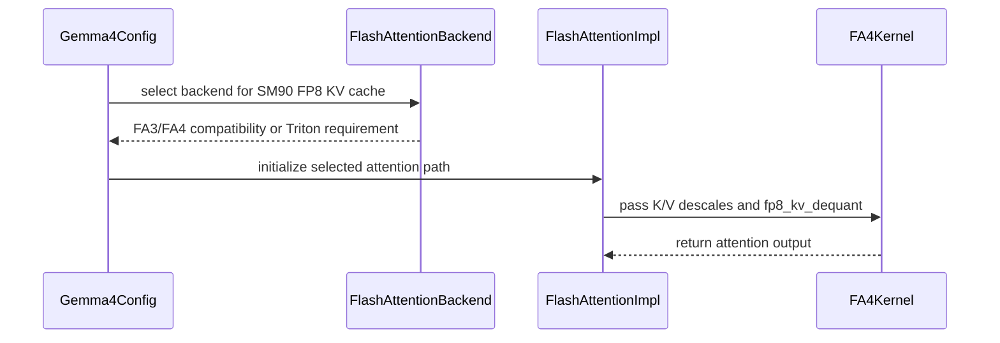

# [PR #53175] [Kernel] Resubmit PR 48666 - Gemma4 FP8 KV FA4 head dim 512 backend selection

source: https://github.com/vllm-project/vllm/pull/53175
state: open | updated: 2026-09-23T03:59:01Z
labels: speculative-decoding, ready, ci/build, mrv2

## 正文

## Purpose

```
Re-submit https://github.com/vllm-project/vllm/pull/48666 due to https://github.com/vllm-project/vllm/pull/52987.
Flagged by CI for perf regression, but the regressed perf is resulting from Model emitting special token.
```

The model emits the special token because plain serving with [RedHatAI/gemma-4-31B-it-FP8-dynamic](https://huggingface.co/RedHatAI/gemma-4-31B-it-FP8-dynamic) before https://github.com/vllm-project/vllm/pull/48666 uses Triton, but #48666 upgraded to FA4 wrongly because the FA4 FP8-KV kernel does not support bidirectional attention (mm-prefix).

After https://github.com/vllm-project/vllm/pull/56305, serving without `--language-model-only` can use the `TRITON_FLASH_ATTN` composite backend: causal text uses FA3/FA4 per layer, while an actual mm-prefix request uses Triton. Therefore, `--language-model-only` is no longer needed.

There's also a silent upgrade after unifying FA4 globally for all layers after https://github.com/vllm-project/vllm/pull/42175.

The correct table of kernels to be used when serving `vllm serve RedHatAI/gemma-4-31B-it-FP8-dynamic --kv-cache-dtype fp8`:

| Serve mode | Before PR #48666 | After PR #48666, before this PR | After this PR |
|---|---|---|---|
| None (multimodal-prefix enabled) | head dim 256: **TRITON_ATTN**<br>head dim 512: **TRITON_ATTN** | head dim 256: **FA4 (wrong)**<br>head dim 512: **FA4** | **TRITON_FLASH_ATTN** composite:<br>head dim 256 causal: **FA3**<br>head dim 512 causal: **FA4**<br>mm-prefix: **TRITON_ATTN** |

`FA3` is used for the head-dim 256 R-SWA layers even without mm-prefix because forcing FA4 with FP8 KV cache on SM90 causes output corruption.

The config if-else guards are included in separated commits.

## Test Plan

Same as the latest https://github.com/vllm-project/perf-eval/blob/main/workloads/gemma_4_31b_it_h200.yaml.

```bash
vllm serve RedHatAI/gemma-4-31B-it-FP8-dynamic \
  --tensor-parallel-size 1 \
  --kv-cache-dtype fp8 \
  --reasoning-parser gemma4 \
  --tool-call-parser gemma4 \
  --enable-auto-tool-choice
```

```bash
vllm bench serve \
  --backend openai \
  --base-url http://127.0.0.1:18000 \
  --model RedHatAI/gemma-4-31B-it-FP8-dynamic \
  --dataset-name random \
  --num-prompts 512 \
  --max-concurrency 128 \
  --random-input-len 8192 \
  --random-output-len 1024 \
  --ignore-eos \
  --num-warmups 128
```

CI runs this configuration for three repetitions; the before/after comparison below reports one run for each revision.

## Test Result

Before, using `TRITON_ATTN`:

```
============ Serving Benchmark Result ============
Successful requests:                     512
Failed requests:                         0
Maximum request concurrency:             128
Benchmark duration (s):                  958.75
Total input tokens:                      4194304
Total generated tokens:                  524288
Request throughput (req/s):              0.53
Output token throughput (tok/s):         546.84
Peak output token throughput (tok/s):    1512.00
Peak concurrent requests:                134.00
Total token throughput (tok/s):          4921.59
---------------Time to First Token----------------
Mean TTFT (ms):                          31806.59
Median TTFT (ms):                        16375.95
P99 TTFT (ms):                           140616.45
-----Time per Output Token (excl. 1st token)------
Mean TPOT (ms):                          195.10
Median TPOT (ms):                        209.39
P99 TPOT (ms):                           219.68
---------------Inter-token Latency----------------
Mean ITL (ms):                           195.10
Median ITL (ms):                         85.68
P99 ITL (ms):                            1172.52
==================================================
```

After, using `TRITON_FLASH_ATTN`:

```
============ Serving Benchmark Result ============
Successful requests:                     512
Failed requests:                         0
Maximum request concurrency:             128
Benchmark duration (s):                  662.32
Total input tokens:                      4194304
Total generated tokens:                  524288
Request throughput (req/s):              0.77
Output token throughput (tok/s):         791.60
Peak output token throughput (tok/s):    1652.00
Peak concurrent requests:                134.00
Total token throughput (tok/s):          7124.39
---------------Time to First Token----------------
Mean TTFT (ms):                          26563.93
Median TTFT (ms):                        14289.54
P99 TTFT (ms):                           151069.14
-----Time per Output Token (excl. 1st token)------
Mean TPOT (ms):                          129.67
Median TPOT (ms):                        139.23
P99 TPOT (ms):                           144.40
---------------Inter-token Latency----------------
Mean ITL (ms):                           129.67
Median ITL (ms):                         76.59
P99 ITL (ms):                            672.11
==================================================
```

`TRITON_FLASH_ATTN` improves output throughput from 546.84 to 791.60 tok/s (1.45x). `--language-model-only` is not required to reach the FA3/FA4 causal path after this PR.

---

<details>
<summary> Essential Elements of an Effective PR Description Checklist </summary>

- [x] The purpose of the PR, such as "Fix some issue (link existing issues this PR will resolve)".
- [x] The test plan, such as providing test command.
- [x] The test results, such as pasting the results comparison before and after, or e2e results.
- [ ] (Optional) The necessary documentation update, such as updating `supported_models.md` and `examples` for a new model.

</details>


## 评论 (55)

### jhaotingc · 2026-08-20

Hi @ywang96 , this PR only adds 2nd commit to guard the use of FA from default model behavior. The 1st commit is reverting-revert. Please help guiding the CI and review. Thank you!

### khluu · 2026-08-21

/ci run

### github-actions[bot] · 2026-08-21

✅ Triggered [Buildkite CI #85088](https://buildkite.com/vllm/ci/builds/85088) for commit `28d3f0753228`.

### mergify[bot] · 2026-08-22

This pull request has merge conflicts that must be resolved before it can be
merged. Please rebase the PR, @jhaotingc.

https://docs.github.com/en/pull-requests/collaborating-with-pull-requests/working-with-forks/syncing-a-fork


### jhaotingc · 2026-08-22

Hi @khluu , 2 tests that's fixed by https://github.com/vllm-project/vllm/pull/53170 didn't passed in my last CI.
Also there was a merge conflict fixed in latest commit.
Please trigger the CI again, thank you!

### jhaotingc · 2026-08-24

/ci run

### github-actions[bot] · 2026-08-24

❌ @jhaotingc, A reviewer with write access must run `/ci run`, approve the PR, or add the `ready` label first.

<!-- vllm-ci-command:5389692169 -->

### github-actions[bot] · 2026-08-24

✅ @jhaotingc, CI is now available for this PR.

- `/ci run` starts upstream CI; `/amd-ci run` starts AMD CI only.
- `/ci retry` retries failed jobs in the CI build for the current PR head. If the current head has no CI build, it starts a new CI build for the current head containing only jobs that failed in the latest earlier CI build for this PR.
- `/amd-ci retry` retries failed jobs in AMD CI for the current PR head. Use `/amd-ci run` when the current head has no AMD CI build.
- `/ci cancel` cancels scheduled or running CI builds for this PR branch; `/amd-ci cancel` does the same for AMD CI only.

<!-- vllm-ci-authorized -->

### jhaotingc · 2026-08-24

/ci run

### github-actions[bot] · 2026-08-24

✅ Triggered [Buildkite CI #85403](https://buildkite.com/vllm/ci/builds/85403) for commit `94958046e72b`.

### mergify[bot] · 2026-08-26

This pull request has merge conflicts that must be resolved before it can be
merged. Please rebase the PR, @jhaotingc.

https://docs.github.com/en/pull-requests/collaborating-with-pull-requests/working-with-forks/syncing-a-fork


### jhaotingc · 2026-08-26

Letting CI run again

### jhaotingc · 2026-08-26

/ci run

### github-actions[bot] · 2026-08-26

✅ Triggered [Buildkite CI #85683](https://buildkite.com/vllm/ci/builds/85683) for commit `eb6d9faeaed0`.

### simon-veitner-redhat · 2026-08-26

thanks @jhaotingc i'll give it another pass tmr

### jhaotingc · 2026-08-26

Hi @simon-veitner-redhat, a cross comparison to https://github.com/vllm-project/vllm/pull/52980 on B200 gives a fix [cfa4bc1](https://github.com/vllm-project/vllm/pull/53175/commits/cfa4bc1901b79532774275ce84edb82002468d7b) during merge to main commit.

Short message is: to avoid `with set_current_vllm_config(vllm_config):` I added helper function to parse `vllm_config` to determine each block size. This is suggested in a review in #48666. 

If you would like the original `with set_current_vllm_config(vllm_config):`  back, lmk. 

Test from 52980 ran on this PR:

```
   Test                                                              Result
  ━━━━━━━━━━━━━━━━━━━━━━━━━━━━━━━━━━━━━━━━━━━━━━━━━━━━━━━━━━━━━━━━  ━━━━━━━━━━━━━━━━━━━━━━━━━━━━━━━━━━━━━━━━━━━━━━━━━━━━━━━━━━━━━━━━━━━━━━━━
   pytest tests/kernels/attention/test_attention_selector.py         56 passed, 10 skipped
  ────────────────────────────────────────────────────────────────  ────────────────────────────────────────────────────────────────────────
   pytest tests/kernels/attention/test_flash_attn.py -k fa4_hd256    8 passed, 640 deselected
  ────────────────────────────────────────────────────────────────  ────────────────────────────────────────────────────────────────────────
   pytest tests/kernels/attention/test_flash_attn.py                 168 passed, 480 skipped
```

Agent reason for the helper function changes:

  > Using the explicit vllm_config here is intentional. We originally used with set_current_vllm_config(vllm_config) solely to make the
  > configuration available implicitly during block-size selection. In this PR #48666 discussion
  > (https://github.com/vllm-project/vllm/pull/48666#discussion_r3732643749), we refactored that into the *_for_config() APIs so cache planning
  > receives the engine configuration directly instead of depending on ambient global state.
  >
  > This is particularly useful because block-size selection is also used by cache-planning paths outside normal model initialization. Existing
  > callers remain compatible: when no explicit config is supplied, the implementation still falls back to get_current_vllm_config_or_none().
  >
  > This patch completes that plumbing for the upstream B200 FA4 HD256 path, including get_flash_attn_version(), so configuration-dependent
  > fallbacks such as mm-prefix, softcap, quantized KV cache, R-SWA, and DCP are preserved.

### jhaotingc · 2026-08-26

/ci run 

### jhaotingc · 2026-08-27

/ci run

### github-actions[bot] · 2026-08-27

✅ Triggered [Buildkite CI #85837](https://buildkite.com/vllm/ci/builds/85837) for commit `cfa4bc1901b7`.

### simon-veitner-redhat · 2026-08-27

hello @jhaotingc there are some further issues i will comment on in next days after local verification on hopper.

### simon-veitner-redhat · 2026-09-04

For `d=384`, three checks combine to accept a configuration that the kernel cannot execute:

1. The backend advertises every 8-aligned head size up to 512 when FA4 is installed:

   ```python
   if head_size % 8 != 0:
       return False
   if head_size <= 256:
       return True
   if is_fa_version_supported(4):
       return head_size <= 512
   ```

   Therefore `supports_head_size(384)` returns `True`. See `flash_attn.py:220`

2. Hopper normally starts with FA3, but FA3 cannot handle heads above 256. The selector responds by promoting the same shape to FA4:

   ```python
   if fa_version == 3 and device_capability.major == 9:
       if head_size is not None and head_size > 256:
           fa_version = 4
   ```

   Thus `d=384` resolves to FA4 rather than being rejected. See `fa_utils.py:144`

3. The FP8-KV check only verifies the resolved FA version and GPU family:

   ```python
   return (
       fa_version in (3, 4)
       and current_platform.is_device_capability_family(90)
   )
   ```

   Because step 2 returned FA4 on SM90, this check also passes. It does not verify that the SM90 FP8 kernel implements `d=384`. See `fa_utils.py:311`
   
As a result, `supports_combination(...)` returns `None`, which means the backend considers the full `d=384` + SM90 + FP8-KV combination valid. The missing constraint is the kernel's actual supported head dimension.

See below for Reproduction:

```python
import torch

from vllm.platforms import current_platform
from vllm.v1.attention.backends.fa_utils import get_flash_attn_version
from vllm.v1.attention.backends.flash_attn import FlashAttentionBackend

capability = current_platform.get_device_capability()
error = FlashAttentionBackend.supports_combination(
    384,
    torch.bfloat16,
    "fp8_e4m3",
    16,
    False,
    False,
    False,
    False,
    capability,
)
print(
    f"capability=SM{capability.major}{capability.minor} "
    f"supports_head={FlashAttentionBackend.supports_head_size(384)} "
    f"selected=FA{get_flash_attn_version(head_size=384)} "
    f"combination_error={error}"
)
```

Observed:

```text
capability=SM90 supports_head=True selected=FA4 combination_error=None
```

when passed down to FA4 this will assert in interface

```python
import torch

from vllm.vllm_flash_attn import flash_attn_varlen_func


def run(page_size: int) -> None:
    q = torch.randn(1, 1, 384, device="cuda", dtype=torch.bfloat16)
    k = torch.randn(1, page_size, 1, 384, device="cuda").to(
        torch.float8_e4m3fn
    )
    cu_seqlens = torch.tensor([0, 1], device="cuda", dtype=torch.int32)
    used_k = torch.tensor([page_size], device="cuda", dtype=torch.int32)
    block_table = torch.zeros(1, 1, device="cuda", dtype=torch.int32)
    scale = torch.tensor([[2.0]], device="cuda")

    flash_attn_varlen_func(
        q,
        k,
        k.clone(),
        1,
        cu_seqlens,
        page_size,
        seqused_k=used_k,
        block_table=block_table,
        k_descale=scale,
        v_descale=scale,
        fa_version=4,
    )


for page_size in (16, 64):
    try:
        run(page_size)
    except Exception as error:
        print(f"page_size={page_size}: {type(error).__name__}: {error}")
```

Observed:

```text
page_size=16: AssertionError: ... page_size == tile_n (64); got page_size=16
page_size=64: MLIRError: ... failed to partition ... (64,384) ... with tiled_mma
```

We should make selection logic more robust!

---
Disclaimer: AI was used to create this writeup and analyse the issue

### simon-veitner-redhat · 2026-09-04

Problem: Take following serving

```bash
vllm serve RedHatAI/gemma-4-31B-it-FP8-dynamic \
  --kv-cache-dtype fp8 \
  --attention-config.flash_attn_version 4 \
  --port 18004
```

Observed server output:

```text
Using FlashAttention version 4
Application startup complete.
```

In another shell, a text request succeeds:

```bash
curl -sS -o /dev/null -w 'text HTTP %{http_code}\n' \
  http://127.0.0.1:18004/v1/chat/completions \
  -H 'Content-Type: application/json' \
  -d '{"model":"RedHatAI/gemma-4-31B-it-FP8-dynamic","messages":[{"role":"user","content":"Say OK"}],"max_tokens":1,"temperature":0}'
```

Observed: `text HTTP 200`.

The following self-contained request contains a valid 1x1 RGB PNG. It returns HTTP 500 and kills the engine:

```bash
curl -sS -o /dev/null -w 'image HTTP %{http_code}\n' \
  http://127.0.0.1:18004/v1/chat/completions \
  -H 'Content-Type: application/json' \
  -d '{"model":"RedHatAI/gemma-4-31B-it-FP8-dynamic","messages":[{"role":"user","content":[{"type":"image_url","image_url":{"url":"data:image/png;base64,iVBORw0KGgoAAAANSUhEUgAAAAEAAAABCAIAAACQd1PeAAAADElEQVR42mP4z8AAAAMBAQDJ/pLvAAAAAElFTkSuQmCC"}},{"type":"text","text":"?"}]}],"max_tokens":1,"temperature":0}'
```

Essential output:

```text
image HTTP 500
AssertionError: FA4 SM90 fp8-KV-dequant requires ...
page_size == tile_n (80); got page_size=64
EngineDeadError: EngineCore encountered an issue
```

The failure is deterministic: a real multimodal range makes vLLM express the sliding window inside `mask_mod`, then disables FA's built-in causal/local flags:

```python
mm_mask_mod = _make_mm_prefix_mask_mod(...)
...
causal = False
sliding_window_size = None
```

See `flash_attn.py:1171`. FA consequently treats the `d=256` layer as non-local, chooses `tile_n=80` at `interface.py:153`, and rejects Gemma4's shared page size 64 at `interface.py:678`. The stack reaches the kernel through `attention.py:770` and `flash_attn.py:1224`.

The forced version should either route safely or be rejected before the server allocates weights. A request must not be able to terminate a server that declared itself ready.

---
Disclaimer: AI was used to create this writeup and analyse the issue


### coderabbitai[bot] · 2026-09-04

```html
<!-- This is an auto-generated comment: summarize by coderabbit.ai -->
<!-- review_stack_entry_start -->
```

[](https://app.coderabbit.ai/change-stack/vllm-project/vllm/pull/53175)

```html
<!-- review_stack_entry_end -->
<!-- recent_review_start -->
```

No actionable comments were generated in the recent review. 🎉

<details>
<summary>ℹ️ Recent review info</summary>

<details>
<summary>⚙️ Run configuration</summary>

**Configuration used**: Repository UI

**Review profile**: CHILL

**Plan**: Team

**Run ID**: `ef786289-69a5-4e9e-89ae-508d2e334625`

</details>

<details>
<summary>📥 Commits</summary>

Reviewing files that changed from the base of the PR and between a11dfcff8921247c119b9356ae1c4bbd3a7f7f57 and b4217ffb6d59a86e40d7f310f723faf4b10a9160.

</details>

<details>
<summary>📒 Files selected for processing (9)</summary>

* `tests/kernels/attention/test_attention_selector.py`
* `vllm/model_executor/layers/attention/attention.py`
* `vllm/model_executor/models/config.py`
* `vllm/platforms/interface.py`
* `vllm/v1/attention/backend.py`
* `vllm/v1/attention/backends/fa_utils.py`
* `vllm/v1/attention/backends/flash_attn.py`
* `vllm/v1/worker/gpu/spec_decode/gemma4/speculator.py`
* `vllm/vllm_flash_attn/flash_attn_interface.py`

</details>

**Included review availability:** Your plan provides up to 10 included reviews per hour; 9 remain after this review.

</details>

---


```html
<!-- recent_review_end -->
<!-- walkthrough_start -->
```

## Walkthrough

The pull request adds SM90 FA4 support for FP8 KV caches, passes vLLM configuration directly into block-size selection, updates Gemma4 backend selection, adds selector tests, and copies target KV scales during Gemma4 speculative decoding.

### Changes

**SM90 FP8 attention support**

|Layer / File(s)|Summary|
|---|---|
|**Configuration-aware block-size APIs** <br> `vllm/v1/attention/backend.py`, `vllm/platforms/interface.py`, `vllm/model_executor/layers/attention/attention.py`|Attention backends accept explicit configuration objects for supported and preferred kernel block-size lookups.|
|**SM90 FA4 FP8 KV selection and execution** <br> `vllm/v1/attention/backends/fa_utils.py`, `vllm/v1/attention/backends/flash_attn.py`, `vllm/vllm_flash_attn/flash_attn_interface.py`|FlashAttention recognizes SM90 FA4 FP8 KV configurations, applies block-size and compatibility rules, disables quantized query input for this path, and passes FP8 KV dequantization data to FA4.|
|**Gemma4 backend selection and coverage** <br> `vllm/model_executor/models/config.py`, `tests/kernels/attention/test_attention_selector.py`|Gemma4 uses per-layer FA3/FA4 selection on SM90 with FP8 KV cache, selects Triton for multimodal prefixes, and tests supported head sizes and rejection messages.|

**Gemma4 speculative KV-scale sharing**

|Layer / File(s)|Summary|
|---|---|
|**Target attention mapping and KV-scale copying** <br> `vllm/v1/worker/gpu/spec_decode/gemma4/speculator.py`|Gemma4 speculative decoding resolves registered target attention names and copies target KV scales to draft attention modules.|

**Estimated code review effort:** 4 (Complex) | ~45 minutes


### Sequence Diagram(s)



**Suggested reviewers:** `wzhao18`

<!-- walkthrough_end -->
<!-- final_review_risk_start -->
**Merge Risk:** _⚪ Minimal_ · up to `b4217`
<!-- final_review_risk_coverage:{"sourceCommitId":"b4217ffb6d59a86e40d7f310f723faf4b10a9160","coveredCommitId":"b4217ffb6d59a86e40d7f310f723faf4b10a9160","kind":"reviewed"} -->

```
This change restores supported Gemma-4 SM90 FP8 KV-cache serving paths while routing incompatible multimodal-prefix cases away from FlashAttention. Unsupported configurations are covered by selection guards, with no remaining concrete merge-blocking risk.
<!-- final_review_risk_end -->
<!-- pre_merge_checks_walkthrough_start -->
```

<details>
<summary>🚥 Pre-merge checks | ✅ 4 | ❌ 1</summary>

### ❌ Failed checks (1 warning)

|     Check name     | Status     | Explanation                                                                                                                                                                                 | Resolution                                                                         |
| :----------------: | :--------- | :------------------------------------------------------------------------------------------------------------------------------------------------------------------------------------------ | :--------------------------------------------------------------------------------- |
| Docstring Coverage | ⚠️ Warning | Docstring coverage is 26.67% which is insufficient. The required threshold is 80.00%. Docstring coverage is scoped to functions touched by this diff. Analyzed 30 functions across 9 files. | Write docstrings for the functions missing them to satisfy the coverage threshold. |

<details>
<summary>✅ Passed checks (4 passed)</summary>

|         Check name         | Status   | Explanation                                                                                                                   |
| :------------------------: | :------- | :---------------------------------------------------------------------------------------------------------------------------- |
|     Linked Issues check    | ✅ Passed | Check skipped because no linked issues were found for this pull request.                                                      |
| Out of Scope Changes check | ✅ Passed | Check skipped because no linked issues were found for this pull request.                                                      |
|         Title check        | ✅ Passed | The title clearly identifies the main change: restoring Gemma4 FP8 KV-cache FA4 backend selection for head dimension 512.     |
|      Description check     | ✅ Passed | The description directly explains the kernel-selection changes, multimodal-prefix handling, test plan, and benchmark results. |

</details>

</details>

```html
<!-- pre_merge_checks_walkthrough_end -->
<!-- tips_start -->
```

---

Thanks for using [CodeRabbit](https://coderabbit.ai?utm_source=oss&utm_medium=github&utm_campaign=vllm-project/vllm&utm_content=53175)! It's free for OSS, and your support helps us grow. If you like it, consider giving us a shout-out.

<details>
<summary>❤️ Share</summary>

```
- [X](https://twitter.com/intent/tweet?text=I%20just%20used%20%40coderabbitai%20for%20my%20code%20review%2C%20and%20it%27s%20fantastic%21%20It%27s%20free%20for%20OSS%20and%20offers%20a%20free%20trial%20for%20the%20proprietary%20code.%20Check%20it%20out%3A&url=https%3A//coderabbit.ai)
- [Mastodon](https://mastodon.social/share?text=I%20just%20used%20%40coderabbitai%20for%20my%20code%20review%2C%20and%20it%27s%20fantastic%21%20It%27s%20free%20for%20OSS%20and%20offers%20a%20free%20trial%20for%20the%20proprietary%20code.%20Check%20it%20out%3A%20https%3A%2F%2Fcoderabbit.ai)
- [Reddit](https://www.reddit.com/submit?title=Great%20tool%20for%20code%20review%20-%20CodeRabbit&text=I%20just%20used%20CodeRabbit%20for%20my%20code%20review%2C%20and%20it%27s%20fantastic%21%20It%27s%20free%20for%20OSS%20and%20offers%20a%20free%20trial%20for%20proprietary%20code.%20Check%20it%20out%3A%20https%3A//coderabbit.ai)
- [LinkedIn](https://www.linkedin.com/sharing/share-offsite/?url=https%3A%2F%2Fcoderabbit.ai&mini=true&title=Great%20tool%20for%20code%20review%20-%20CodeRabbit&summary=I%20just%20used%20CodeRabbit%20for%20my%20code%20review%2C%20and%20it%27s%20fantastic%21%20It%27s%20free%20for%20OSS%20and%20offers%20a%20free%20trial%20for%20proprietary%20code)
```

</details>


<sub>Comment `@coderabbitai help` to get the list of available commands.</sub>

<!-- tips_end -->

### jhaotingc · 2026-09-04

Thanks @simon-veitner-redhat. 
1st issue is covered in newly added 918eb7e
```
sm90_fp8_kv_supported = fa_version == 3 or (
      fa_version == 4 and head_size in (None, 512)
  )
```
2nd issue is blocked by the 1st commit, but added a verbal text log in 2nd commit 0b5aa3f:
```
  if (
      use_mm_prefix
      and kv_cache_dtype is not None
      and is_quantized_kv_cache(kv_cache_dtype)
      and device_capability == DeviceCapability(9, 0)
  ):
      return "SM90 FP8 KV with mm_prefix requires Triton"
```
Tests were added to verify SM90 FP8-KV routing for d=256 (FA3), d=384 (rejected), and d=512 (FA4), plus ensure mm-prefix configurations at both d=256 and d=512 deselect FlashAttention in favor of Triton.

### simon-veitner-redhat · 2026-09-08

LGTM. Thanks!

### jhaotingc · 2026-09-08

/ci run

### github-actions[bot] · 2026-09-08

✅ Triggered [Buildkite CI #87743](https://buildkite.com/vllm/ci/builds/87743) for commit `8703dde27e48`.

### mergify[bot] · 2026-09-08

This pull request has merge conflicts that must be resolved before it can be
merged. Please rebase the PR, @jhaotingc.

https://docs.github.com/en/pull-requests/collaborating-with-pull-requests/working-with-forks/syncing-a-fork


### jhaotingc · 2026-09-09

/ci run


### jhaotingc · 2026-09-09

/ci run


### jhaotingc · 2026-09-09

/ci run

### github-actions[bot] · 2026-09-09

✅ Triggered [Buildkite CI #87951](https://buildkite.com/vllm/ci/builds/87951) for commit `4363bc12a2c3`.

### jonzhep · 2026-09-09

gods work!

### jhaotingc · 2026-09-09

/ci run 

### jhaotingc · 2026-09-10

/ci run

### github-actions[bot] · 2026-09-10

✅ Triggered [Buildkite CI #88174](https://buildkite.com/vllm/ci/builds/88174) for commit `1fe63bd63701`.

### jhaotingc · 2026-09-11

/ci run 

### jhaotingc · 2026-09-11

/ci run

### github-actions[bot] · 2026-09-11

✅ Triggered [Buildkite CI #88428](https://buildkite.com/vllm/ci/builds/88428) for commit `0ba070965650`.

### mergify[bot] · 2026-09-12

This pull request has merge conflicts that must be resolved before it can be
merged. Please rebase the PR, @jhaotingc.

https://docs.github.com/en/pull-requests/collaborating-with-pull-requests/working-with-forks/syncing-a-fork


### ywang96 · 2026-09-12

@MatthewBonanni Could you follow up with the final review? Thanks

### jhaotingc · 2026-09-14

/ci run


### jhaotingc · 2026-09-14

(CI passed but having merge conflict with upstream, fixed merge conflict and CI again)

### OmarHory · 2026-09-20

We need this :D

### jhaotingc · 2026-09-22

/ci run

### github-actions[bot] · 2026-09-22

❌ This PR is 28 commits behind upstream `main`. Your branch must contain every commit currently on upstream `main`. No new CI build was started. Merge or rebase onto the latest `main`, then rerun `/ci run`. To test this branch at your own risk, use `/ci run --allow-stale`.

<!-- vllm-ci-command:5780576880 -->

### jhaotingc · 2026-09-22

Thanks @LucasWilkinson , changed the logics to use TRITON_FLASH_ATTN, allow FA3 to be in the TRITON_FLASH_ATTN by renaming to FABackend (instead of FA4Backend

### jhaotingc · 2026-09-22

/ci run

### github-actions[bot] · 2026-09-22

✅ Triggered [Buildkite CI #90459](https://buildkite.com/vllm/ci/builds/90459) for commit `f163a609dc55`.

### jhaotingc · 2026-09-22

/ci cancel

### github-actions[bot] · 2026-09-22

✅ No cancelable CI build is running for branch `resubmit-pr48666`.

### jhaotingc · 2026-09-22

/ci cancel

### github-actions[bot] · 2026-09-22

✅ No cancelable CI build is running for branch `resubmit-pr48666`.

### jhaotingc · 2026-09-22

/ci run

### github-actions[bot] · 2026-09-22

✅ Triggered [Buildkite CI #90521](https://buildkite.com/vllm/ci/builds/90521) for commit `2b07a71e30c5`.

## Review (17)

### claude[bot] · 2026-08-20 · COMMENTED

## Claude Code Review

This pull request is from a fork — automated review is disabled. A repository maintainer can comment `@claude review` to run a one-time review.

### MatthewBonanni · 2026-08-26 · COMMENTED

(no text)

### simon-veitner-redhat · 2026-08-26 · COMMENTED

(no text)

### simon-veitner-redhat · 2026-08-26 · COMMENTED

(no text)

### jhaotingc · 2026-08-26 · COMMENTED

(no text)

### jhaotingc · 2026-08-26 · COMMENTED

(no text)

### jhaotingc · 2026-08-26 · COMMENTED

(no text)

### jhaotingc · 2026-08-26 · COMMENTED

(no text)

### MatthewBonanni · 2026-09-08 · COMMENTED

Thanks! Left a few comments

### jhaotingc · 2026-09-09 · COMMENTED

(no text)

### jhaotingc · 2026-09-09 · COMMENTED

(no text)

### LucasWilkinson · 2026-09-22 · COMMENTED

On current main (post #56305), SM90 + FP8 + mm-prefix already falls through to `TRITON_ATTN`, so the new `Gemma4Config` branch forcing `TRITON_ATTN` is a no-op by default and blocks new composite backend: `TRITON_FLASH_ATTN` introduced in #56305.

I think we should just try to get the composite backend end here to work so we can use FA with FP8 kv-cache regardless of whether `--language-model-only` is set or not. iiuc the composite only fails here because `_FA4Backend.supports_combination` requires FA4, while hd256 resolves to FA3 under FP8. So it should hopefully be as simple as relaxing `_FA4Backend.supports_combination` to support FA3 too

### LucasWilkinson · 2026-09-22 · COMMENTED

(no text)

### jhaotingc · 2026-09-22 · COMMENTED

(no text)

### jhaotingc · 2026-09-22 · COMMENTED

(no text)

### jhaotingc · 2026-09-22 · COMMENTED

(no text)

### LucasWilkinson · 2026-09-23 · COMMENTED

(no text)
