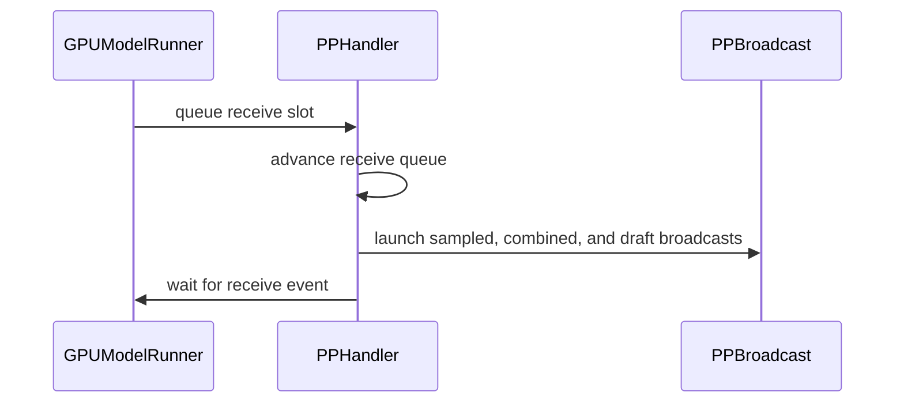

# [PR #53948] [MRV2][PP] Prototype deferred sampled-result receives

source: https://github.com/vllm-project/vllm/pull/53948
state: open | updated: 2026-09-23T06:18:54Z
labels: ready, mrv2

## 正文

## Purpose

Related to #53810.

Non-last pipeline-parallel stages currently post the sampled-result receive as
soon as the receive buffers are created, although the result is not consumed
until a later scheduler step. For small sampled-result broadcasts, the
receiver-side NCCL kernel can remain resident while model kernels execute.

This PR adds an opt-in Model Runner V2 prototype that separates buffer creation
from collective launch. The receive can be delayed by a configurable number of
scheduler steps and, optionally, placed after the destination rank's model work.

## Configuration

```bash
# Post a receive selected at step T at step T + N.
VLLM_PP_DEFER_SAMPLED_TOKEN_RECV=<N>

# Place the selected receive after model work at step T + N.
VLLM_PP_POST_MODEL_SAMPLED_TOKEN_RECV=1

# Optional end-of-run wait and drain diagnostics.
VLLM_PP_DEFER_SAMPLED_TOKEN_RECV_STATS=1
```

The feature is disabled by default. When enabled, it currently requires:

- Model Runner V2;
- async scheduling;
- CUDA; and
- `0 < N < pipeline_parallel_size`.

The last PP rank remains the immediate broadcast source. A result produced at
step `T` is still consumed at `T + PP`; only the receiver launch is moved.

## Correctness and lifecycle guarantees

- Default settings preserve the existing immediate-receive path.
- Compilation and warmup retain immediate collective timing; deferral is
  enabled only after warmup completes.
- Sampled tokens, sample counts, rejection counts, and speculative draft tokens
  preserve their FIFO collective order.
- CUDA stream ownership is recorded for tensors retained across the delay.
- Pending receives are flushed at idle boundaries and shutdown.
- A consume-time fallback prevents an unposted receive from being consumed.
- Optional diagnostics report delayed launches, idle flushes, fallback launches,
  and measured waits without adding timing events to normal runs.

The environment variables are intentionally prototype controls. If the design
is accepted, they can be promoted to a public configuration surface separately.

## Validation

Focused tests cover:

- PP2 with delay 1 and PP4 with delays 1, 2, and 3;
- immediate and post-model launch modes;
- skipped-broadcast scheduler steps and collective ordering;
- finite, idempotent idle and shutdown drains;
- consume-time fallback behavior;
- last-rank behavior; and
- configuration and environment parsing.

Formatting, lint, and Python compilation checks pass locally.

### H100 profiling

A matched 32 x H100, TP8/PP4 profile held the workload and model configuration
fixed with delay 3 (`max_num_batched_tokens=8192`, `max_model_len=1024`, and
`max_num_seqs=710`). Moving the selected receive from before model work to
after model work reduced PP0's mean dominant-Marlin duration from 3.648 ms to
3.009 ms (17.5%). PP1-PP3 changed by approximately 1% or less, consistent with
the observed interference being concentrated on PP0.

In a matched throughput run using the same `22,24,24,23` layer partition,
post-model launch increased output throughput from 757.2 to 800.6 tokens/s/node
(+5.7%).

### Current-main end-to-end check

An integration image based on main commit `e962733e` plus this PR and #55426
was tested on 32 x H100 with TP8/PP4, Model Runner V2, async scheduling, CUDA
graphs, delay 3, and post-model launch enabled:

- 4,000/4,000 OpenAI-compatible requests succeeded;
- all responses returned HTTP 200;
- every response reported the expected 615 prompt and 130 completion tokens;
- PP0-PP2 reported delay 3 with post-model launch enabled, while PP3 remained
  the immediate source; and
- output throughput was 3,437.1 tokens/s across the deployment.

The throughput numbers are workload-specific. The integration run also contains
#55426, while the matched pre/post-model comparison isolates the receive-placement
change.


## 评论 (25)

### mergify[bot] · 2026-09-01

This pull request has merge conflicts that must be resolved before it can be
merged. Please rebase the PR, @chengchengpei.

https://docs.github.com/en/pull-requests/collaborating-with-pull-requests/working-with-forks/syncing-a-fork


### coderabbitai[bot] · 2026-09-05

```html
<!-- This is an auto-generated comment: summarize by coderabbit.ai -->
<!-- review_stack_entry_start -->
```

[](https://app.coderabbit.ai/change-stack/vllm-project/vllm/pull/53948)

```html
<!-- review_stack_entry_end -->
<!-- recent_review_start -->
```

No actionable comments were generated in the recent review. 🎉

<details>
<summary>ℹ️ Recent review info</summary>

<details>
<summary>⚙️ Run configuration</summary>

**Configuration used**: Repository UI

**Review profile**: CHILL

**Plan**: Team

**Run ID**: `355b4657-30a9-4393-900a-dfbd9a6f69cf`

</details>

<details>
<summary>📥 Commits</summary>

Reviewing files that changed from the base of the PR and between 42c50a73c4a25d4c14572936a010fd24a1608214 and 5e19e157001a5a68c6f91d9af26db15323857357.

</details>

<details>
<summary>📒 Files selected for processing (2)</summary>

* `tests/test_config.py`
* `vllm/config/vllm.py`

</details>

**Included review availability:** Your plan provides up to 10 included reviews per hour; 9 remain after this review.

</details>

---


```html
<!-- recent_review_end -->
<!-- walkthrough_start -->
```

<details>
<summary>📝 Summary</summary>

<!-- This is an auto-generated comment: release notes by coderabbit.ai -->

## Summary by CodeRabbit

* **New Features**
  * Added configurable pipeline-parallel sampled-token receive delays.
  * Added options for post-model receive scheduling and CUDA timing statistics.
  * Deferred receives can now be queued, launched, and flushed automatically during idle periods, shutdown, or model execution.
  * Added validation for compatible runtime configurations and delay values.
  * Added support for additional Qwen4Exp architectures with breakable CUDA graphs.

* **Bug Fixes**
  * Improved pending-receive ordering and completion during pipeline-parallel execution.

<!-- end of auto-generated comment: release notes by coderabbit.ai -->
## Walkthrough

Adds configurable deferred pipeline-parallel sampled-token receives. The change validates environment settings, queues and schedules receives, handles idle and shutdown flushing, integrates GPU execution paths, and adds configuration, environment, and PP utility tests.

### Changes

**Deferred PP sampled-token receives**

|Layer / File(s)|Summary|
|---|---|
|**Configuration and environment contracts** <br> `vllm/envs.py`, `vllm/config/vllm.py`, `tests/test_envs.py`, `tests/test_config.py`|Adds three environment settings, integer parsing, configuration validation, Qwen4Exp breakable CUDA-graph defaults, and tests for valid and invalid combinations.|
|**Deferred receive queue and synchronization** <br> `vllm/v1/worker/gpu/pp_utils.py`, `tests/v1/worker/test_pp_utils.py`|Adds delayed receive queues, post-model launches, idle and explicit flushes, fallback launching, synchronization, statistics, and lifecycle tests.|
|**GPU execution integration** <br> `vllm/v1/worker/gpu/model_runner.py`, `vllm/v1/worker/gpu_worker.py`|Enables deferred collectives after warmup, launches receives around model execution, flushes idle and shutdown collectives, and logs statistics.|

**Estimated code review effort:** 4 (Complex) | ~45 minutes

<!-- final_review_risk_start -->
**Merge Risk:** _⚪ Minimal_ · up to `f426a`
<!-- final_review_risk_coverage:{"sourceCommitId":"5e19e157001a5a68c6f91d9af26db15323857357","coveredCommitId":"f426a049a186c8beffdccc78d12d8c7fccd8e41e","kind":"target_branch_merge_carry_forward"} -->

```
This adds an opt-in deferred pipeline-parallel receive path while retaining immediate receives by default. Supported configurations are validated and the covered lifecycle paths show no current merge-blocking risk.
<!-- final_review_risk_end -->
```

**Suggested reviewers:** `aoshen02`, `zjy0516`

### Sequence Diagram(s)



</details>

```html
<!-- walkthrough_end -->
<!-- pre_merge_checks_walkthrough_start -->
```

<details>
<summary>🚥 Pre-merge checks | ✅ 4 | ❌ 1</summary>

### ❌ Failed checks (1 warning)

|     Check name     | Status     | Explanation                                                                                                                                                                                 | Resolution                                                                         |
| :----------------: | :--------- | :------------------------------------------------------------------------------------------------------------------------------------------------------------------------------------------ | :--------------------------------------------------------------------------------- |
| Docstring Coverage | ⚠️ Warning | Docstring coverage is 29.09% which is insufficient. The required threshold is 80.00%. Docstring coverage is scoped to functions touched by this diff. Analyzed 55 functions across 8 files. | Write docstrings for the functions missing them to satisfy the coverage threshold. |

<details>
<summary>✅ Passed checks (4 passed)</summary>

|         Check name         | Status   | Explanation                                                                                                                                      |
| :------------------------: | :------- | :----------------------------------------------------------------------------------------------------------------------------------------------- |
|         Title check        | ✅ Passed | The title clearly identifies the prototype and the main change: deferred sampled-result receives for pipeline parallelism.                       |
|      Description check     | ✅ Passed | The description directly explains the deferred receive feature, configuration, constraints, lifecycle guarantees, tests, and validation results. |
|     Linked Issues check    | ✅ Passed | Check skipped because no linked issues were found for this pull request.                                                                         |
| Out of Scope Changes check | ✅ Passed | Check skipped because no linked issues were found for this pull request.                                                                         |

</details>

</details>

```html
<!-- pre_merge_checks_walkthrough_end -->
<!-- finishing_touch_checkbox_start -->
```

<details>
<summary>✨ Finishing Touches 💡 1</summary>

```json
<!-- finishing_touch_suggestion:fix_ci -->
<details open>
<summary>🛠️ Fix failing CI checks 💡</summary>

- [ ] <!-- {"checkboxId": "6d21cfe8-ec3f-40e2-9222-b8318b64d3b0", "radioGroupId": "fix-ci-output-choice-group-unknown_comment_id"} -->   Create stacked PR
- [ ] <!-- {"checkboxId": "9f0d24fb-b419-4f01-baf0-8b26b6424f34", "radioGroupId": "fix-ci-output-choice-group-unknown_comment_id"} -->   Commit on current branch
```

</details>

</details>

```html
<!-- finishing_touch_checkbox_end -->
<!-- tips_start -->
```

---

Thanks for using [CodeRabbit](https://coderabbit.ai?utm_source=oss&utm_medium=github&utm_campaign=vllm-project/vllm&utm_content=53948)! It's free for OSS, and your support helps us grow. If you like it, consider giving us a shout-out.

<details>
<summary>❤️ Share</summary>

```
- [X](https://twitter.com/intent/tweet?text=I%20just%20used%20%40coderabbitai%20for%20my%20code%20review%2C%20and%20it%27s%20fantastic%21%20It%27s%20free%20for%20OSS%20and%20offers%20a%20free%20trial%20for%20the%20proprietary%20code.%20Check%20it%20out%3A&url=https%3A//coderabbit.ai)
- [Mastodon](https://mastodon.social/share?text=I%20just%20used%20%40coderabbitai%20for%20my%20code%20review%2C%20and%20it%27s%20fantastic%21%20It%27s%20free%20for%20OSS%20and%20offers%20a%20free%20trial%20for%20the%20proprietary%20code.%20Check%20it%20out%3A%20https%3A%2F%2Fcoderabbit.ai)
- [Reddit](https://www.reddit.com/submit?title=Great%20tool%20for%20code%20review%20-%20CodeRabbit&text=I%20just%20used%20CodeRabbit%20for%20my%20code%20review%2C%20and%20it%27s%20fantastic%21%20It%27s%20free%20for%20OSS%20and%20offers%20a%20free%20trial%20for%20proprietary%20code.%20Check%20it%20out%3A%20https%3A//coderabbit.ai)
- [LinkedIn](https://www.linkedin.com/sharing/share-offsite/?url=https%3A%2F%2Fcoderabbit.ai&mini=true&title=Great%20tool%20for%20code%20review%20-%20CodeRabbit&summary=I%20just%20used%20CodeRabbit%20for%20my%20code%20review%2C%20and%20it%27s%20fantastic%21%20It%27s%20free%20for%20OSS%20and%20offers%20a%20free%20trial%20for%20proprietary%20code)
```

</details>


<sub>Comment `@coderabbitai help` to get the list of available commands.</sub>

<!-- tips_end -->

### mergify[bot] · 2026-09-09

This pull request has merge conflicts that must be resolved before it can be
merged. Please rebase the PR, @chengchengpei.

https://docs.github.com/en/pull-requests/collaborating-with-pull-requests/working-with-forks/syncing-a-fork


### mergify[bot] · 2026-09-14

This pull request has merge conflicts that must be resolved before it can be
merged. Please rebase the PR, @chengchengpei.

https://docs.github.com/en/pull-requests/collaborating-with-pull-requests/working-with-forks/syncing-a-fork


### chengchengpei · 2026-09-17

@yewentao256 

Thanks for the review. I addressed the three requested items:

- Rebased onto current `main` (`e6b1a5e5e3`) and reduced the PR to **278 additions / 24 deletions across 5 files**. The new head is `a22bb93967`.
- Ran an end-to-end accuracy comparison with `lm_eval`.
- Ran an end-to-end four-node W1 benchmark with the standard `vllm bench serve` CLI.

Sanitized complete result summaries are included below. Raw cluster logs are
retained privately because they contain internal paths and hostnames.

### End-to-end accuracy: `lm_eval`

Configuration: Qwen3.5-2B, one H100 node, TP1/PP2, Model Runner V2, async scheduling, full GSM8K test split (1,319 rows), 5-shot, temperature 0, and 32 concurrent requests. I compared the default immediate receive path with delay 1 plus post-model receive placement.

| Arm | GSM8K strict exact match | GSM8K flexible exact match |
|---|---:|---:|
| Immediate receive | 53.07% ± 1.37 pp | 63.46% ± 1.33 pp |
| Deferred/post-model receive | 52.92% ± 1.37 pp | 62.70% ± 1.33 pp |
| Deferred − immediate | −0.15 pp | −0.76 pp |

Both deltas are smaller than one reported standard error. This shows no measurable aggregate accuracy regression at this sample size; it is not a claim of bit-for-bit output identity.

<details>
<summary>Raw lm_eval result tables</summary>

```text
=== arm=immediate delay=0 post_model=0 ===
|Tasks|Version|     Filter     |n-shot|  Metric   |   |Value |   |Stderr|
|-----|------:|----------------|-----:|-----------|---|-----:|---|-----:|
|gsm8k|      3|flexible-extract|     5|exact_match|↑  |0.6346|±  |0.0133|
|     |       |strict-match    |     5|exact_match|↑  |0.5307|±  |0.0137|

=== arm=deferred_post_model delay=1 post_model=1 ===
|Tasks|Version|     Filter     |n-shot|  Metric   |   |Value |   |Stderr|
|-----|------:|----------------|-----:|-----------|---|-----:|---|-----:|
|gsm8k|      3|flexible-extract|     5|exact_match|↑  |0.6270|±  |0.0133|
|     |       |strict-match    |     5|exact_match|↑  |0.5292|±  |0.0137|

PR53948_ONE_NODE_VALIDATION=PASS
```

</details>

### End-to-end benchmark: `vllm bench serve`

Configuration: Kimi-K3 on 32 H100s (TP8/PP4, four nodes), Model Runner V2, async scheduling, CUDA graphs, PP layers `23,24,23,23`, receive delay 3 after model work, MML=1024, MBT=8192, S=710, GMU=0.90, and prefix caching disabled.

The standard CLI used `openai-chat` with `/v1/chat/completions` and the Kimi-K3 tokenizer. The custom dataset was preflight-checked to produce exactly 527 user-prompt tokens, 615 server-side prompt tokens after the chat template, and 130 output tokens. The run used 4,000 requests, concurrency 710, temperature 0, and `--ignore-eos`.

- **4,000/4,000 requests succeeded; 0 failed**
- Shape check: every request was exactly **615 input / 130 output tokens**
- Duration: **156.43 s**
- Request throughput: **25.57 req/s** across the deployment
- Output throughput: **3,324.21 tok/s** across the deployment
- Total throughput: **19,050.30 tok/s** across the deployment
- Median / p90 / p99 TTFT: **2,027.93 / 8,780.46 / 16,534.98 ms**
- Median / p90 / p99 TPOT: **196.77 / 200.01 / 204.24 ms**
- Median / p90 / p99 E2E latency: **27,540.35 / 33,685.66 / 41,486.69 ms**

The output throughput is within **+0.19%** of the existing matched W1 anchor (3,318.0 tok/s), so the end-to-end standard-client result reproduces the prior throughput.

<details>
<summary>Raw vllm bench serve summary</summary>

```text
============ Serving Benchmark Result ============
Successful requests:                     4000
Failed requests:                         0
Maximum request concurrency:             710
Benchmark duration (s):                  156.43
Total input tokens:                      2460000
Total generated tokens:                  520000
Request throughput (req/s):              25.57
Output token throughput (tok/s):         3324.21
Peak output token throughput (tok/s):    9012.00
Peak concurrent requests:                775.00
Total token throughput (tok/s):          19050.30
---------------Time to First Token----------------
Mean TTFT (ms):                          3290.84
Median TTFT (ms):                        2027.93
P50 TTFT (ms):                           2027.93
P90 TTFT (ms):                           8780.46
P99 TTFT (ms):                           16534.98
-----Time per Output Token (excl. 1st token)------
Mean TPOT (ms):                          185.33
Median TPOT (ms):                        196.77
P50 TPOT (ms):                           196.77
P90 TPOT (ms):                           200.01
P99 TPOT (ms):                           204.24
----------------End-to-end Latency----------------
Mean E2EL (ms):                          27198.06
Median E2EL (ms):                        27540.35
P50 E2EL (ms):                           27540.35
P90 E2EL (ms):                           33685.66
P99 E2EL (ms):                           41486.69
==================================================
VLLM_BENCH_SHAPE_CHECK status=ok completed=4000 failed=0 input=615 output=130
K3_SERVER_TEST: PASS
```

</details>

The validation image used pinned nightly commit `af1c01499b` plus runtime patch SHA-256 `31d91ec56bcce00359b232e3093903e3f23a638eebd8f75db0cced9f73b4a8ef`; Kimi-K3 Hopper fix #55426 was already present. After these runs, I rebased the same reduced implementation cleanly onto current `main`; formatting, Ruff, Python compilation, and `git diff --check` pass on the pushed head.


### chengchengpei · 2026-09-17

> (pull latest)?

@yewentao256 

below is our previous (last week) benchmark output token per second per node on 4*H100 nodes

```

  | Workload                                                   | Initially tuned |       Final | Improvement |
  |------------------------------------------------------------|----------------:|------------:|------------:|
  | W1: short prefill/short decode (prefill 537, decode 130)   |           634.7 |   **829.5** |  **+30.7%** |
  | W2: medium prefill/long decode (prefill 1000, decode 3000) |           982.9 | **1,127.8** |  **+14.7%** |
  | W3: short prefill/32K decode   (prefill 100, decode 32000) |           429.0 |   **476.5** |  **+11.1%** |
```

To compare to main (pull latest), we need to rerun... i am sure that the numbers are close the above..

### chengchengpei · 2026-09-18

@yewentao256 

A/B comparison:
  - Same 4,000 requests, 615 input tokens/request, 130 output tokens/request
  - Same concurrency: 710
  - Zero failures in both
  - Fix throughput: 3,324 vs 2,376 output tok/s (+39.9%)
  - Duration: 156.43s vs 218.82s (-28.5%)
  - P99 TTFT: 16.53s vs 33.51s (-50.7%)
  - P99 TPOT: 204ms vs 348ms (-41.3%)
  - P99 E2E: 41.49s vs 70.96s (-41.5%)
 

the benchmark results of my fix:

```
============ Serving Benchmark Result ============
Successful requests:                     4000
Failed requests:                         0
Maximum request concurrency:             710
Benchmark duration (s):                  156.43
Total input tokens:                      2460000
Total generated tokens:                  520000
Request throughput (req/s):              25.57
Output token throughput (tok/s):         3324.21
Peak output token throughput (tok/s):    9012.00
Peak concurrent requests:                775.00
Total token throughput (tok/s):          19050.30
---------------Time to First Token----------------
Mean TTFT (ms):                          3290.84
Median TTFT (ms):                        2027.93
P50 TTFT (ms):                           2027.93
P90 TTFT (ms):                           8780.46
P99 TTFT (ms):                           16534.98
-----Time per Output Token (excl. 1st token)------
Mean TPOT (ms):                          185.33
Median TPOT (ms):                        196.77
P50 TPOT (ms):                           196.77
P90 TPOT (ms):                           200.01
P99 TPOT (ms):                           204.24
----------------End-to-end Latency----------------
Mean E2EL (ms):                          27198.06
Median E2EL (ms):                        27540.35
P50 E2EL (ms):                           27540.35
P90 E2EL (ms):                           33685.66
P99 E2EL (ms):                           41486.69
==================================================
```

the benchmark results of main branch:

```
============ Serving Benchmark Result ============
Successful requests:                     4000      
Failed requests:                         0         
Maximum request concurrency:             710       
Benchmark duration (s):                  218.82    
Total input tokens:                      2460000   
Total generated tokens:                  520000    
Request throughput (req/s):              18.28     
Output token throughput (tok/s):         2376.35   
Peak output token throughput (tok/s):    7911.00   
Peak concurrent requests:                762.00    
Total token throughput (tok/s):          13618.29  
---------------Time to First Token----------------
Mean TTFT (ms):                          5813.82   
Median TTFT (ms):                        2365.55   
P50 TTFT (ms):                           2365.55   
P90 TTFT (ms):                           19492.17  
P99 TTFT (ms):                           33509.97  
-----Time per Output Token (excl. 1st token)------
Mean TPOT (ms):                          251.01    
Median TPOT (ms):                        259.51    
P50 TPOT (ms):                           259.51    
P90 TPOT (ms):                           289.81    
P99 TPOT (ms):                           347.86    
----------------End-to-end Latency----------------
Mean E2EL (ms):                          38193.89  
Median E2EL (ms):                        36348.52  
P50 E2EL (ms):                           36348.52  
P90 E2EL (ms):                           58006.79  
P99 E2EL (ms):                           70958.76  
==================================================
```

### yanghoeg · 2026-09-18

Datapoint from an RDNA4 / PP3 setup where this change is the difference between
no pipelining and pipelining.

```bash
Setup: 6x Radeon AI PRO R9700 (gfx1201, 32 GB), 3 nodes, TP2 x PP3 over Ray,
100 GbE TCP (no RDMA, NCCL socket transport, NCCL_PROTO=Simple), ROCm 7.14 /
torch 2.11, vLLM main 861a299 + this PR at a22bb93967 (one local change: the
platform gate `is_cuda()` -> `is_cuda_alike()`), Qwen3.8-Flash-Next-FP8,
Model Runner V2, async scheduling, GPU_MAX_HW_QUEUES=1.
```

Why the single HW queue: on gfx1201 the default 4 HW queues cost us 10.2 -> 38.5
tok/s single stream (cross-queue barrier polling), so we run one queue. With one
queue the early-posted sampled-result receive kernel sits in front of the next
microbatch's forward and serializes it: batch 1/2/3 step time = 27/51/77 ms,
i.e. linear in batch size (dividing out, aggregate ~37-39 tok/s at all three).

```
With VLLM_PP_DEFER_SAMPLED_TOKEN_RECV=2 and VLLM_PP_POST_MODEL_SAMPLED_TOKEN_RECV=1
(max-num-seqs 16, temperature 0, ~150-word prompts): batch 1/4/8/16 step
28/33/56/66 ms, aggregate 36/122/143/244 tok/s, per-stream 36/30/18/15.
```

```bash
Unchanged after applying: a 5-prompt correctness check (5/5), 4 long-context
needle retrievals (4/4), a 16-prompt CJK-leak probe (0 leaks). Limits: no greedy
text diff against the pre-PR build; the pre-PR run only covered batch 1-3, so
"linear" is for that range; no CUDA run; no comparison against DEFER=1.
```

AI assistance was used for diagnosis and drafting; all numbers were measured on
the hardware above.


### github-actions[bot] · 2026-09-21

✅ @chengchengpei, CI is now available for this PR.

- `/ci run` starts upstream CI; `/amd-ci run` starts AMD CI only.
- Your branch must contain every commit currently on its upstream target branch. Merge or rebase onto the latest target branch, then rerun the command. Append `--allow-stale` to a run command to test an outdated branch at your own risk.
- `/ci retry` retries failed jobs in the CI build for the current PR head. If the current head has no CI build, it starts a new CI build for the current head containing only jobs that failed in the latest earlier CI build for this PR.
- `/amd-ci retry` retries failed jobs in AMD CI for the current PR head. Use `/amd-ci run` when the current head has no AMD CI build.
- `/ci cancel` cancels scheduled or running CI builds for this PR branch; `/amd-ci cancel` does the same for AMD CI only.

<!-- vllm-ci-authorized -->

### mergify[bot] · 2026-09-21

Hi @chengchengpei, the pre-commit checks have failed. Please run:

```bash 
uv pip install pre-commit>=4.5.1
pre-commit install
pre-commit run --all-files
```

Then, commit the changes and push to your branch.

For future commits, `pre-commit` will run automatically on changed files before each commit.


### chengchengpei · 2026-09-22

/ci run

### github-actions[bot] · 2026-09-22

❌ This PR is 6 commits behind upstream `main`. Your branch must contain every commit currently on upstream `main`. No new CI build was started. Merge or rebase onto the latest `main`, then rerun `/ci run`. To test this branch at your own risk, use `/ci run --allow-stale`.

<!-- vllm-ci-command:5769361668 -->

### chengchengpei · 2026-09-22

/ci run

### github-actions[bot] · 2026-09-22

✅ Triggered [Buildkite CI #90362](https://buildkite.com/vllm/ci/builds/90362) for commit `9c2a52615dbb`.

### chengchengpei · 2026-09-22

/ci run

### github-actions[bot] · 2026-09-22

✅ Triggered [Buildkite CI #90453](https://buildkite.com/vllm/ci/builds/90453) for commit `8ed9df461794`.

### chengchengpei · 2026-09-22

/ci run

### github-actions[bot] · 2026-09-22

✅ Triggered [Buildkite CI #90457](https://buildkite.com/vllm/ci/builds/90457) for commit `2650caa70181`.

### mergify[bot] · 2026-09-23

This pull request has merge conflicts that must be resolved before it can be
merged. Please rebase the PR, @chengchengpei.

https://docs.github.com/en/pull-requests/collaborating-with-pull-requests/working-with-forks/syncing-a-fork


### chengchengpei · 2026-09-23

/ci run

### github-actions[bot] · 2026-09-23

✅ Triggered [Buildkite CI #90572](https://buildkite.com/vllm/ci/builds/90572) for commit `e4fb26d4a9b3`.

### chengchengpei · 2026-09-23

/ci run

### github-actions[bot] · 2026-09-23

✅ Triggered [Buildkite CI #90582](https://buildkite.com/vllm/ci/builds/90582) for commit `d288342f2231`.

### chengchengpei · 2026-09-23

/ci run

### github-actions[bot] · 2026-09-23

✅ Triggered [Buildkite CI #90591](https://buildkite.com/vllm/ci/builds/90591) for commit `04da6db50649`.

## Review (6)

### claude[bot] · 2026-08-26 · COMMENTED

## Claude Code Review

This pull request is from a fork — automated review is disabled. A repository maintainer can comment `@claude review` to run a one-time review.

### claude[bot] · 2026-09-05 · COMMENTED

## Claude Code Review

This pull request is from a fork — automated review is disabled. A repository maintainer can comment `@claude review` to run a one-time review.

### yewentao256 · 2026-09-16 · COMMENTED

Thanks for the work!

Please do the following:
- [ ] shrink the diff, idealy < 300 LOC
- [ ] e2e accuracy using `lm_eval`...
- [ ] e2e benchmark using `vllm bench serve...`

When doing e2e test, please attach with full output log in case some agents fake the data.

### yewentao256 · 2026-09-17 · COMMENTED

What's the perf improvement comparing to main (pull latest)?

### yewentao256 · 2026-09-21 · COMMENTED

Thanks for the work!

### chengchengpei · 2026-09-22 · COMMENTED

(no text)
