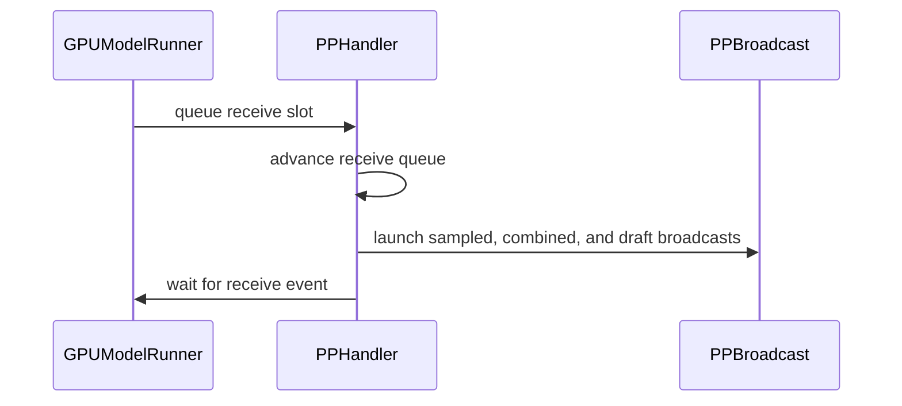

# [PR #53948] [MRV2][PP] Prototype deferred sampled-result receives

source: https://github.com/vllm-project/vllm/pull/53948
state: open | updated: 2026-09-27T05:22:40Z
labels: ready, mrv2

## 正文

## Purpose

Related to #53810.

On non-last pipeline-parallel stages, sampled-result receives are currently
posted as soon as their buffers are allocated, although the results are not
consumed until a later scheduler step. For small broadcasts, the receiver-side
NCCL kernel can remain resident while model kernels execute.

This change delays those receives on CUDA Model Runner V2 workers until the
last safe pipeline step and places them after that step's model work. The last
PP rank remains the immediate broadcast source. A result produced at step `T`
is still consumed at `T + PP`; only the receiver launch moves.

## Activation and scope

The behavior is automatic when all of these are true:

- Model Runner V2 is active;
- async scheduling is enabled;
- pipeline parallel size is greater than one; and
- the platform is CUDA.

Synchronous scheduling, CPU, ROCm, and single-stage execution retain immediate
receive posting. There are no environment-variable gates. `async_scheduling`
is resolved from `None` to a concrete boolean during `VllmConfig` validation,
before `PPHandler` is constructed.

## Correctness and lifecycle guarantees

- Warmup retains immediate collective timing; receive deferral starts only
  after warmup finishes.
- Sampled tokens, sample/rejection counts, and speculative draft tokens retain
  FIFO collective order.
- The sender stays immediate to avoid a cycle with inter-stage activation
  traffic. Its broadcasts are serialized on one dedicated stream; receiver
  deferral can leave the head send waiting, but does not make all queued sends
  simultaneously resident.
- A consume-time fallback posts any receive that missed its scheduled launch.
- Pending receives are flushed at PP-group-uniform idle, shutdown, and
  pause/sleep boundaries before device synchronization. The zero-token worker
  flush and model-runner launch are intentionally redundant: the latter also
  protects direct runner invocations.
- CPU stream placeholders use an explicit `launched` flag because their event
  recording is a no-op.
- PP-only post-update kernels are warmed before serving, including Mamba's
  sampled-count scatter and align-state fused postprocess specialization. The
  warmup uses an all-`-1` request mapping; both kernels return before any
  persistent-state load/store, and a CUDA regression test checks that the
  bookkeeping and recurrent-state buffers remain unchanged.

## Sender-side validation envelope

The H100 W1 runs used CUDA 13.3 and NCCL 2.30.7 with TP8/PP4, concurrency 710,
and no speculative draft tokens. The two per-step broadcasts were about 5.7
KiB each. NCCL protocol selection was left automatic and was not printed by
the logs, so this PR does not claim a specific LL/LL128/Simple protocol or a
validated payload-size cutoff. Larger speculative payloads retain the same
ordering and flush invariants in tests, but still need hardware performance
validation.

## Validation

Focused tests cover receive cadence, immediate/deferred launch idempotency,
FIFO recovery, speculative draft propagation, idle flushing, CPU no-op events,
warmup specialization and state neutrality, and pause-before-synchronize
ordering.

A matched same-base H100 TP8/PP4 A/B was run on the current PR head with 4,000
requests, 615 input tokens, 130 output tokens, concurrency 710, and isolated
cold caches. Both arms completed 4,000/4,000 requests with zero failures:

| Receive mode | Output tok/s | Total tok/s | Mean TTFT | Mean TPOT |
| --- | ---: | ---: | ---: | ---: |
| Forced immediate after warmup | 2,431.4 | 13,933.9 | 5,622.0 ms | 245.8 ms |
| Automatic deferred (this PR) | 3,368.2 | 19,302.1 | 3,303.8 ms | 182.5 ms |

Automatic deferral improved output and total throughput by **38.5%**, reduced
mean TTFT by 41.2%, and reduced mean TPOT by 25.7%. The deferred run had no
errors, tracebacks, NCCL warnings, or CUDA errors. This run also exercised the
immediate last-rank sender under the validated payload envelope without a hang
or observed throughput regression.

AI assistance was used to analyze failures and prepare the changes; the final
implementation and results should be reviewed by the author.


## 评论 (78)

### mergify[bot] · 2026-09-01

This pull request has merge conflicts that must be resolved before it can be
merged. Please rebase the PR, @chengchengpei.

https://docs.github.com/en/pull-requests/collaborating-with-pull-requests/working-with-forks/syncing-a-fork


### coderabbitai[bot] · 2026-09-05

<!-- This is an auto-generated comment: summarize by coderabbit.ai -->
<!-- review_stack_entry_start -->

[](https://app.coderabbit.ai/change-stack/vllm-project/vllm/pull/53948)

<!-- review_stack_entry_end -->
<!-- recent_review_start -->

No actionable comments were generated in the recent review. 🎉

<details>
<summary>ℹ️ Recent review info</summary>

<details>
<summary>⚙️ Run configuration</summary>

**Configuration used**: Repository UI

**Review profile**: CHILL

**Plan**: Team

**Run ID**: `355b4657-30a9-4393-900a-dfbd9a6f69cf`

</details>

<details>
<summary>📥 Commits</summary>

Reviewing files that changed from the base of the PR and between 42c50a73c4a25d4c14572936a010fd24a1608214 and 5e19e157001a5a68c6f91d9af26db15323857357.

</details>

<details>
<summary>📒 Files selected for processing (2)</summary>

* `tests/test_config.py`
* `vllm/config/vllm.py`

</details>

**Included review availability:** Your plan provides up to 10 included reviews per hour; 9 remain after this review.

</details>

---


<!-- recent_review_end -->
<!-- walkthrough_start -->

## Walkthrough

Adds configurable deferred pipeline-parallel sampled-token receives. The change validates environment settings, queues and schedules receives, handles idle and shutdown flushing, integrates GPU execution paths, and adds configuration, environment, and PP utility tests.

### Changes

**Deferred PP sampled-token receives**

|Layer / File(s)|Summary|
|---|---|
|**Configuration and environment contracts** <br> `vllm/envs.py`, `vllm/config/vllm.py`, `tests/test_envs.py`, `tests/test_config.py`|Adds three environment settings, integer parsing, configuration validation, Qwen4Exp breakable CUDA-graph defaults, and tests for valid and invalid combinations.|
|**Deferred receive queue and synchronization** <br> `vllm/v1/worker/gpu/pp_utils.py`, `tests/v1/worker/test_pp_utils.py`|Adds delayed receive queues, post-model launches, idle and explicit flushes, fallback launching, synchronization, statistics, and lifecycle tests.|
|**GPU execution integration** <br> `vllm/v1/worker/gpu/model_runner.py`, `vllm/v1/worker/gpu_worker.py`|Enables deferred collectives after warmup, launches receives around model execution, flushes idle and shutdown collectives, and logs statistics.|

**Estimated code review effort:** 4 (Complex) | ~45 minutes


**Suggested reviewers:** `aoshen02`, `zjy0516`

### Sequence Diagram(s)



<!-- walkthrough_end -->
<!-- final_review_risk_start -->
**Merge Risk:** _⚪ Minimal_ · up to `f426a`
<!-- final_review_risk_coverage:{"sourceCommitId":"5e19e157001a5a68c6f91d9af26db15323857357","coveredCommitId":"f426a049a186c8beffdccc78d12d8c7fccd8e41e","kind":"target_branch_merge_carry_forward"} -->

This adds an opt-in deferred pipeline-parallel receive path while retaining immediate receives by default. Supported configurations are validated and the covered lifecycle paths show no current merge-blocking risk.
<!-- final_review_risk_end -->
<!-- pre_merge_checks_walkthrough_start -->

<details>
<summary>🚥 Pre-merge checks | ✅ 4 | ❌ 1</summary>

### ❌ Failed checks (1 warning)

|     Check name     | Status     | Explanation                                                                                                                                                                                 | Resolution                                                                         |
| :----------------: | :--------- | :------------------------------------------------------------------------------------------------------------------------------------------------------------------------------------------ | :--------------------------------------------------------------------------------- |
| Docstring Coverage | ⚠️ Warning | Docstring coverage is 29.09% which is insufficient. The required threshold is 80.00%. Docstring coverage is scoped to functions touched by this diff. Analyzed 55 functions across 8 files. | Write docstrings for the functions missing them to satisfy the coverage threshold. |

<details>
<summary>✅ Passed checks (4 passed)</summary>

|         Check name         | Status   | Explanation                                                                                                                                                    |
| :------------------------: | :------- | :------------------------------------------------------------------------------------------------------------------------------------------------------------- |
|     Linked Issues check    | ✅ Passed | Check skipped because no linked issues were found for this pull request.                                                                                       |
| Out of Scope Changes check | ✅ Passed | Check skipped because no linked issues were found for this pull request.                                                                                       |
|         Title check        | ✅ Passed | The title clearly describes the main change: a prototype that defers pipeline-parallel sampled-result receives.                                                |
|      Description check     | ✅ Passed | The description is detailed and directly explains the deferred receive behavior, activation conditions, correctness guarantees, tests, and validation results. |

</details>

</details>

<!-- pre_merge_checks_walkthrough_end -->
<!-- finishing_touch_checkbox_start -->

<details>
<summary>✨ Finishing Touches 💡 1</summary>

<!-- finishing_touch_suggestion:fix_ci -->
<details open>
<summary>🛠️ Fix failing CI checks 💡</summary>

- [ ] <!-- {"checkboxId": "6d21cfe8-ec3f-40e2-9222-b8318b64d3b0", "radioGroupId": "fix-ci-output-choice-group-unknown_comment_id"} -->   Create stacked PR
- [ ] <!-- {"checkboxId": "9f0d24fb-b419-4f01-baf0-8b26b6424f34", "radioGroupId": "fix-ci-output-choice-group-unknown_comment_id"} -->   Commit on current branch

</details>

</details>

<!-- finishing_touch_checkbox_end -->
<!-- tips_start -->

---

Thanks for using [CodeRabbit](https://coderabbit.ai?utm_source=oss&utm_medium=github&utm_campaign=vllm-project/vllm&utm_content=53948)! It's free for OSS, and your support helps us grow. If you like it, consider giving us a shout-out.

<details>
<summary>❤️ Share</summary>

- [X](https://twitter.com/intent/tweet?text=I%20just%20used%20%40coderabbitai%20for%20my%20code%20review%2C%20and%20it%27s%20fantastic%21%20It%27s%20free%20for%20OSS%20and%20offers%20a%20free%20trial%20for%20the%20proprietary%20code.%20Check%20it%20out%3A&url=https%3A//coderabbit.ai)
- [Mastodon](https://mastodon.social/share?text=I%20just%20used%20%40coderabbitai%20for%20my%20code%20review%2C%20and%20it%27s%20fantastic%21%20It%27s%20free%20for%20OSS%20and%20offers%20a%20free%20trial%20for%20the%20proprietary%20code.%20Check%20it%20out%3A%20https%3A%2F%2Fcoderabbit.ai)
- [Reddit](https://www.reddit.com/submit?title=Great%20tool%20for%20code%20review%20-%20CodeRabbit&text=I%20just%20used%20CodeRabbit%20for%20my%20code%20review%2C%20and%20it%27s%20fantastic%21%20It%27s%20free%20for%20OSS%20and%20offers%20a%20free%20trial%20for%20proprietary%20code.%20Check%20it%20out%3A%20https%3A//coderabbit.ai)
- [LinkedIn](https://www.linkedin.com/sharing/share-offsite/?url=https%3A%2F%2Fcoderabbit.ai&mini=true&title=Great%20tool%20for%20code%20review%20-%20CodeRabbit&summary=I%20just%20used%20CodeRabbit%20for%20my%20code%20review%2C%20and%20it%27s%20fantastic%21%20It%27s%20free%20for%20OSS%20and%20offers%20a%20free%20trial%20for%20proprietary%20code)

</details>


<sub>Comment `@coderabbitai help` to get the list of available commands.</sub>

<!-- tips_end -->

### mergify[bot] · 2026-09-09

This pull request has merge conflicts that must be resolved before it can be
merged. Please rebase the PR, @chengchengpei.

https://docs.github.com/en/pull-requests/collaborating-with-pull-requests/working-with-forks/syncing-a-fork


### mergify[bot] · 2026-09-14

This pull request has merge conflicts that must be resolved before it can be
merged. Please rebase the PR, @chengchengpei.

https://docs.github.com/en/pull-requests/collaborating-with-pull-requests/working-with-forks/syncing-a-fork


### chengchengpei · 2026-09-17

@yewentao256 

Thanks for the review. I addressed the three requested items:

- Rebased onto current `main` (`e6b1a5e5e3`) and reduced the PR to **278 additions / 24 deletions across 5 files**. The new head is `a22bb93967`.
- Ran an end-to-end accuracy comparison with `lm_eval`.
- Ran an end-to-end four-node W1 benchmark with the standard `vllm bench serve` CLI.

Sanitized complete result summaries are included below. Raw cluster logs are
retained privately because they contain internal paths and hostnames.

### End-to-end accuracy: `lm_eval`

Configuration: Qwen3.5-2B, one H100 node, TP1/PP2, Model Runner V2, async scheduling, full GSM8K test split (1,319 rows), 5-shot, temperature 0, and 32 concurrent requests. I compared the default immediate receive path with delay 1 plus post-model receive placement.

| Arm | GSM8K strict exact match | GSM8K flexible exact match |
|---|---:|---:|
| Immediate receive | 53.07% ± 1.37 pp | 63.46% ± 1.33 pp |
| Deferred/post-model receive | 52.92% ± 1.37 pp | 62.70% ± 1.33 pp |
| Deferred − immediate | −0.15 pp | −0.76 pp |

Both deltas are smaller than one reported standard error. This shows no measurable aggregate accuracy regression at this sample size; it is not a claim of bit-for-bit output identity.

<details>
<summary>Raw lm_eval result tables</summary>

```text
=== arm=immediate delay=0 post_model=0 ===
|Tasks|Version|     Filter     |n-shot|  Metric   |   |Value |   |Stderr|
|-----|------:|----------------|-----:|-----------|---|-----:|---|-----:|
|gsm8k|      3|flexible-extract|     5|exact_match|↑  |0.6346|±  |0.0133|
|     |       |strict-match    |     5|exact_match|↑  |0.5307|±  |0.0137|

=== arm=deferred_post_model delay=1 post_model=1 ===
|Tasks|Version|     Filter     |n-shot|  Metric   |   |Value |   |Stderr|
|-----|------:|----------------|-----:|-----------|---|-----:|---|-----:|
|gsm8k|      3|flexible-extract|     5|exact_match|↑  |0.6270|±  |0.0133|
|     |       |strict-match    |     5|exact_match|↑  |0.5292|±  |0.0137|

PR53948_ONE_NODE_VALIDATION=PASS
```

</details>

### End-to-end benchmark: `vllm bench serve`

Configuration: Kimi-K3 on 32 H100s (TP8/PP4, four nodes), Model Runner V2, async scheduling, CUDA graphs, PP layers `23,24,23,23`, receive delay 3 after model work, MML=1024, MBT=8192, S=710, GMU=0.90, and prefix caching disabled.

The standard CLI used `openai-chat` with `/v1/chat/completions` and the Kimi-K3 tokenizer. The custom dataset was preflight-checked to produce exactly 527 user-prompt tokens, 615 server-side prompt tokens after the chat template, and 130 output tokens. The run used 4,000 requests, concurrency 710, temperature 0, and `--ignore-eos`.

- **4,000/4,000 requests succeeded; 0 failed**
- Shape check: every request was exactly **615 input / 130 output tokens**
- Duration: **156.43 s**
- Request throughput: **25.57 req/s** across the deployment
- Output throughput: **3,324.21 tok/s** across the deployment
- Total throughput: **19,050.30 tok/s** across the deployment
- Median / p90 / p99 TTFT: **2,027.93 / 8,780.46 / 16,534.98 ms**
- Median / p90 / p99 TPOT: **196.77 / 200.01 / 204.24 ms**
- Median / p90 / p99 E2E latency: **27,540.35 / 33,685.66 / 41,486.69 ms**

The output throughput is within **+0.19%** of the existing matched W1 anchor (3,318.0 tok/s), so the end-to-end standard-client result reproduces the prior throughput.

<details>
<summary>Raw vllm bench serve summary</summary>

```text
============ Serving Benchmark Result ============
Successful requests:                     4000
Failed requests:                         0
Maximum request concurrency:             710
Benchmark duration (s):                  156.43
Total input tokens:                      2460000
Total generated tokens:                  520000
Request throughput (req/s):              25.57
Output token throughput (tok/s):         3324.21
Peak output token throughput (tok/s):    9012.00
Peak concurrent requests:                775.00
Total token throughput (tok/s):          19050.30
---------------Time to First Token----------------
Mean TTFT (ms):                          3290.84
Median TTFT (ms):                        2027.93
P50 TTFT (ms):                           2027.93
P90 TTFT (ms):                           8780.46
P99 TTFT (ms):                           16534.98
-----Time per Output Token (excl. 1st token)------
Mean TPOT (ms):                          185.33
Median TPOT (ms):                        196.77
P50 TPOT (ms):                           196.77
P90 TPOT (ms):                           200.01
P99 TPOT (ms):                           204.24
----------------End-to-end Latency----------------
Mean E2EL (ms):                          27198.06
Median E2EL (ms):                        27540.35
P50 E2EL (ms):                           27540.35
P90 E2EL (ms):                           33685.66
P99 E2EL (ms):                           41486.69
==================================================
VLLM_BENCH_SHAPE_CHECK status=ok completed=4000 failed=0 input=615 output=130
K3_SERVER_TEST: PASS
```

</details>

The validation image used pinned nightly commit `af1c01499b` plus runtime patch SHA-256 `31d91ec56bcce00359b232e3093903e3f23a638eebd8f75db0cced9f73b4a8ef`; Kimi-K3 Hopper fix #55426 was already present. After these runs, I rebased the same reduced implementation cleanly onto current `main`; formatting, Ruff, Python compilation, and `git diff --check` pass on the pushed head.


### chengchengpei · 2026-09-17

> (pull latest)?

@yewentao256 

below is our previous (last week) benchmark output token per second per node on 4*H100 nodes

```

  | Workload                                                   | Initially tuned |       Final | Improvement |
  |------------------------------------------------------------|----------------:|------------:|------------:|
  | W1: short prefill/short decode (prefill 537, decode 130)   |           634.7 |   **829.5** |  **+30.7%** |
  | W2: medium prefill/long decode (prefill 1000, decode 3000) |           982.9 | **1,127.8** |  **+14.7%** |
  | W3: short prefill/32K decode   (prefill 100, decode 32000) |           429.0 |   **476.5** |  **+11.1%** |
```

To compare to main (pull latest), we need to rerun... i am sure that the numbers are close the above..

### chengchengpei · 2026-09-18

@yewentao256 

A/B comparison:
  - Same 4,000 requests, 615 input tokens/request, 130 output tokens/request
  - Same concurrency: 710
  - Zero failures in both
  - Fix throughput: 3,324 vs 2,376 output tok/s (+39.9%)
  - Duration: 156.43s vs 218.82s (-28.5%)
  - P99 TTFT: 16.53s vs 33.51s (-50.7%)
  - P99 TPOT: 204ms vs 348ms (-41.3%)
  - P99 E2E: 41.49s vs 70.96s (-41.5%)
 

the benchmark results of my fix:

```
============ Serving Benchmark Result ============
Successful requests:                     4000
Failed requests:                         0
Maximum request concurrency:             710
Benchmark duration (s):                  156.43
Total input tokens:                      2460000
Total generated tokens:                  520000
Request throughput (req/s):              25.57
Output token throughput (tok/s):         3324.21
Peak output token throughput (tok/s):    9012.00
Peak concurrent requests:                775.00
Total token throughput (tok/s):          19050.30
---------------Time to First Token----------------
Mean TTFT (ms):                          3290.84
Median TTFT (ms):                        2027.93
P50 TTFT (ms):                           2027.93
P90 TTFT (ms):                           8780.46
P99 TTFT (ms):                           16534.98
-----Time per Output Token (excl. 1st token)------
Mean TPOT (ms):                          185.33
Median TPOT (ms):                        196.77
P50 TPOT (ms):                           196.77
P90 TPOT (ms):                           200.01
P99 TPOT (ms):                           204.24
----------------End-to-end Latency----------------
Mean E2EL (ms):                          27198.06
Median E2EL (ms):                        27540.35
P50 E2EL (ms):                           27540.35
P90 E2EL (ms):                           33685.66
P99 E2EL (ms):                           41486.69
==================================================
```

the benchmark results of main branch:

```
============ Serving Benchmark Result ============
Successful requests:                     4000      
Failed requests:                         0         
Maximum request concurrency:             710       
Benchmark duration (s):                  218.82    
Total input tokens:                      2460000   
Total generated tokens:                  520000    
Request throughput (req/s):              18.28     
Output token throughput (tok/s):         2376.35   
Peak output token throughput (tok/s):    7911.00   
Peak concurrent requests:                762.00    
Total token throughput (tok/s):          13618.29  
---------------Time to First Token----------------
Mean TTFT (ms):                          5813.82   
Median TTFT (ms):                        2365.55   
P50 TTFT (ms):                           2365.55   
P90 TTFT (ms):                           19492.17  
P99 TTFT (ms):                           33509.97  
-----Time per Output Token (excl. 1st token)------
Mean TPOT (ms):                          251.01    
Median TPOT (ms):                        259.51    
P50 TPOT (ms):                           259.51    
P90 TPOT (ms):                           289.81    
P99 TPOT (ms):                           347.86    
----------------End-to-end Latency----------------
Mean E2EL (ms):                          38193.89  
Median E2EL (ms):                        36348.52  
P50 E2EL (ms):                           36348.52  
P90 E2EL (ms):                           58006.79  
P99 E2EL (ms):                           70958.76  
==================================================
```

### yanghoeg · 2026-09-18

Datapoint from an RDNA4 / PP3 setup where this change is the difference between
no pipelining and pipelining.

Setup: 6x Radeon AI PRO R9700 (gfx1201, 32 GB), 3 nodes, TP2 x PP3 over Ray,
100 GbE TCP (no RDMA, NCCL socket transport, NCCL_PROTO=Simple), ROCm 7.14 /
torch 2.11, vLLM main 861a299 + this PR at a22bb93967 (one local change: the
platform gate `is_cuda()` -> `is_cuda_alike()`), Qwen3.8-Flash-Next-FP8,
Model Runner V2, async scheduling, GPU_MAX_HW_QUEUES=1.

Why the single HW queue: on gfx1201 the default 4 HW queues cost us 10.2 -> 38.5
tok/s single stream (cross-queue barrier polling), so we run one queue. With one
queue the early-posted sampled-result receive kernel sits in front of the next
microbatch's forward and serializes it: batch 1/2/3 step time = 27/51/77 ms,
i.e. linear in batch size (dividing out, aggregate ~37-39 tok/s at all three).

With VLLM_PP_DEFER_SAMPLED_TOKEN_RECV=2 and VLLM_PP_POST_MODEL_SAMPLED_TOKEN_RECV=1
(max-num-seqs 16, temperature 0, ~150-word prompts): batch 1/4/8/16 step
28/33/56/66 ms, aggregate 36/122/143/244 tok/s, per-stream 36/30/18/15.

Unchanged after applying: a 5-prompt correctness check (5/5), 4 long-context
needle retrievals (4/4), a 16-prompt CJK-leak probe (0 leaks). Limits: no greedy
text diff against the pre-PR build; the pre-PR run only covered batch 1-3, so
"linear" is for that range; no CUDA run; no comparison against DEFER=1.

AI assistance was used for diagnosis and drafting; all numbers were measured on
the hardware above.


### github-actions[bot] · 2026-09-21

✅ @chengchengpei, CI is now available for this PR.

- `/ci run` starts upstream CI; `/amd-ci run` starts AMD CI only.
- Your branch must contain every commit currently on its upstream target branch. Merge or rebase onto the latest target branch, then rerun the command. Append `--allow-stale` to a run command to test an outdated branch at your own risk.
- `/ci retry` retries failed jobs in the CI build for the current PR head. If the current head has no CI build, it starts a new CI build for the current head containing only jobs that failed in the latest earlier CI build for this PR.
- `/amd-ci retry` retries failed jobs in AMD CI for the current PR head. Use `/amd-ci run` when the current head has no AMD CI build.
- `/ci cancel` cancels scheduled or running CI builds for this PR branch; `/amd-ci cancel` does the same for AMD CI only.

<!-- vllm-ci-authorized -->

### mergify[bot] · 2026-09-21

Hi @chengchengpei, the pre-commit checks have failed. Please run:

```bash 
uv pip install pre-commit>=4.5.1
pre-commit install
pre-commit run --all-files
```

Then, commit the changes and push to your branch.

For future commits, `pre-commit` will run automatically on changed files before each commit.


### chengchengpei · 2026-09-22

/ci run

### github-actions[bot] · 2026-09-22

❌ This PR is 6 commits behind upstream `main`. Your branch must contain every commit currently on upstream `main`. No new CI build was started. Merge or rebase onto the latest `main`, then rerun `/ci run`. To test this branch at your own risk, use `/ci run --allow-stale`.

<!-- vllm-ci-command:5769361668 -->

### chengchengpei · 2026-09-22

/ci run

### github-actions[bot] · 2026-09-22

✅ Triggered [Buildkite CI #90362](https://buildkite.com/vllm/ci/builds/90362) for commit `9c2a52615dbb`.

### chengchengpei · 2026-09-22

/ci run

### github-actions[bot] · 2026-09-22

✅ Triggered [Buildkite CI #90453](https://buildkite.com/vllm/ci/builds/90453) for commit `8ed9df461794`.

### chengchengpei · 2026-09-22

/ci run

### github-actions[bot] · 2026-09-22

✅ Triggered [Buildkite CI #90457](https://buildkite.com/vllm/ci/builds/90457) for commit `2650caa70181`.

### mergify[bot] · 2026-09-23

This pull request has merge conflicts that must be resolved before it can be
merged. Please rebase the PR, @chengchengpei.

https://docs.github.com/en/pull-requests/collaborating-with-pull-requests/working-with-forks/syncing-a-fork


### chengchengpei · 2026-09-23

/ci run

### github-actions[bot] · 2026-09-23

✅ Triggered [Buildkite CI #90572](https://buildkite.com/vllm/ci/builds/90572) for commit `e4fb26d4a9b3`.

### chengchengpei · 2026-09-23

/ci run

### github-actions[bot] · 2026-09-23

✅ Triggered [Buildkite CI #90582](https://buildkite.com/vllm/ci/builds/90582) for commit `d288342f2231`.

### chengchengpei · 2026-09-23

/ci run

### github-actions[bot] · 2026-09-23

✅ Triggered [Buildkite CI #90591](https://buildkite.com/vllm/ci/builds/90591) for commit `04da6db50649`.

### chengchengpei · 2026-09-23

/ci run

### github-actions[bot] · 2026-09-23

✅ Triggered [Buildkite CI #90678](https://buildkite.com/vllm/ci/builds/90678) for commit `54c5d1df3806`.

### chengchengpei · 2026-09-23

/ci run

### github-actions[bot] · 2026-09-23

❌ This PR is 10 commits behind upstream `main`. Your branch must contain every commit currently on upstream `main`. No new CI build was started. Merge or rebase onto the latest `main`, then rerun `/ci run`. To test this branch at your own risk, use `/ci run --allow-stale`.

<!-- vllm-ci-command:5800778170 -->

### chengchengpei · 2026-09-23

/ci run

### github-actions[bot] · 2026-09-23

❌ This PR is 10 commits behind upstream `main`. Your branch must contain every commit currently on upstream `main`. No new CI build was started. Merge or rebase onto the latest `main`, then rerun `/ci run`. To test this branch at your own risk, use `/ci run --allow-stale`.

<!-- vllm-ci-command:5800931254 -->

### chengchengpei · 2026-09-23

/ci run

### github-actions[bot] · 2026-09-23

✅ Triggered [Buildkite CI #90735](https://buildkite.com/vllm/ci/builds/90735) for commit `d0c923049bf8`.

### chengchengpei · 2026-09-23

/ci run

### github-actions[bot] · 2026-09-23

✅ Triggered [Buildkite CI #90772](https://buildkite.com/vllm/ci/builds/90772) for commit `c516255c9067`.

### yewentao256 · 2026-09-23

/ci run

### github-actions[bot] · 2026-09-23

✅ Triggered [Buildkite CI #90785](https://buildkite.com/vllm/ci/builds/90785) for commit `55d9d8f9dd52`.

### chengchengpei · 2026-09-23

@yewentao256 

 All failures from the previous run also occurred on main or unrelated PRs:

  - Gumbel runtime JIT: already fixed by #58410 (https://github.com/vllm-project/vllm/pull/58410).
  - Related warmup problems: #58462 (https://github.com/vllm-project/vllm/pull/58462) and #58465 (https://github.com/vllm-project/vllm/pull/58465).
  - ECR/S3/DNS, GPU-memory profiling, entrypoint, and AMD sharded-sampling failures: shared CI/infrastructure flakes.
  
  
  in fact, this PR is long lived. in order to merge it, i even help fixed bug like https://github.com/vllm-project/vllm/pull/55426  :)


### chengchengpei · 2026-09-24

Follow-up CI triage for [Buildkite #90785](https://buildkite.com/vllm/ci/builds/90785): I did not find dedicated GitHub issue tickets for these failures, but the relevant upstream fix/bisect PRs are:

- AMD MRV2 sampler runtime JIT: [#58462](https://github.com/vllm-project/vllm/pull/58462) and [#58465](https://github.com/vllm-project/vllm/pull/58465) are merged. [#58410](https://github.com/vllm-project/vllm/pull/58410) was closed as no longer necessary.
- H100 fault-tolerance E2E rank-health detection hang: tracked by the upstream bisect probes [#58317](https://github.com/vllm-project/vllm/pull/58317) and [#58318](https://github.com/vllm-project/vllm/pull/58318).
- CPU tokenizer lane Hugging Face HTTP 499: narrow retry fix proposed in [#58475](https://github.com/vllm-project/vllm/pull/58475).

These failures have matching occurrences on main or unrelated PRs, so they appear to be upstream/CI issues rather than regressions in #53948.

### chengchengpei · 2026-09-24

Anyone can take over this PR if necessary..

this idea is good. it can increase K3 throughputs from 10%-39% depending on the workload. 


### chengchengpei · 2026-09-24

/ci run

### github-actions[bot] · 2026-09-24

✅ Triggered [Buildkite CI #90846](https://buildkite.com/vllm/ci/builds/90846) for commit `eeb3a4396450`.

### chengchengpei · 2026-09-24

Addressed the latest review: rebased to current main as one clean commit; reduced the patch from 516 to 300 added lines; flush deferred PP receives before pause/sleep synchronization; warm both the Mamba sampled-count scatter and fused align postprocess specializations; keep automatic enablement CUDA-only (ROCm/CPU retain immediate receives); and updated the PR description. Local ruff, format, py_compile, and diff checks pass. Full runtime validation is being rerun on CI/cluster.

### chengchengpei · 2026-09-24

/ci run

### github-actions[bot] · 2026-09-24

✅ Triggered [Buildkite CI #90851](https://buildkite.com/vllm/ci/builds/90851) for commit `2967a465003d`.

### chengchengpei · 2026-09-24

/ci run

### github-actions[bot] · 2026-09-24

❌ This PR is 1 commit behind upstream `main`. Your branch must contain every commit currently on upstream `main`. No new CI build was started. Merge or rebase onto the latest `main`, then rerun `/ci run`. To test this branch at your own risk, use `/ci run --allow-stale`.

<!-- vllm-ci-command:5807687471 -->

### chengchengpei · 2026-09-24

Addressed the latest review at `d77cc2bba5`:

- Documented the immediate sender contract, single-stream serialization, and
  the requirement to flush collectively before device synchronization.
- Documented the actual hardware envelope (CUDA 13.3, NCCL 2.30.7, TP8/PP4,
  ~5.7 KiB broadcasts, no drafts) without claiming an unobserved NCCL protocol
  or payload cutoff.
- Added the PP-group-uniformity rationale at the zero-forward worker flush and
  explained why the runner-level zero-token launch remains as a safety net.
- Replaced the mock-only Mamba warmup test with a CUDA regression that invokes
  the exact scatter + fused-align warmup path and verifies both accepted-token
  bookkeeping and recurrent state remain unchanged for the all-`-1` mapping.
- Clarified that `async_scheduling=None` is resolved to a concrete bool during
  `VllmConfig` validation before `PPHandler` construction, so no runtime assert
  is needed.
- Updated the validation section to distinguish successful prior hardware runs
  from the still-needed same-base/current-head A/B instead of presenting an
  absolute number as a performance delta.

Local ruff check/format and syntax checks pass. Local pytest collection is
blocked by the existing local PyTorch/vLLM annotation-version mismatch; the
new state-neutrality test is CUDA-only and is included in the fresh `/ci run`.


### chengchengpei · 2026-09-24

/ci run

### github-actions[bot] · 2026-09-24

✅ Triggered [Buildkite CI #90853](https://buildkite.com/vllm/ci/builds/90853) for commit `2646e9b3c724`.

### chengchengpei · 2026-09-24

/ci run

### github-actions[bot] · 2026-09-24

✅ Triggered [Buildkite CI #90854](https://buildkite.com/vllm/ci/builds/90854) for commit `2b36c97251fd`.

### mergify[bot] · 2026-09-24

Hi @chengchengpei, the pre-commit checks have failed. Please run:

```bash 
uv pip install pre-commit>=4.5.1
pre-commit install
pre-commit run --all-files
```

Then, commit the changes and push to your branch.

For future commits, `pre-commit` will run automatically on changed files before each commit.


### chengchengpei · 2026-09-24

/ci run

### chengchengpei · 2026-09-24

Follow-up at `4d15853320`: fixed the pre-commit/mypy failure by retaining the config field's `bool | None` boundary type while asserting at runtime that `None` was resolved before `PPHandler` construction.

The sender invariant now also states that broadcasts share one ordered CUDA stream, so only the head send can be active while later sends remain queued. Local `mypy-3.13`, Ruff, formatting, and diff checks pass. Rebased onto current `main` (`7f1a5398e9`).

The remaining review item is empirical: a same-image immediate-vs-deferred TP8/PP4 A/B on this head.


### github-actions[bot] · 2026-09-24

✅ Triggered [Buildkite CI #90857](https://buildkite.com/vllm/ci/builds/90857) for commit `4d15853320ea`.

### chengchengpei · 2026-09-24

CI update for head `4d15853320ea`:

- pre-commit: PASS
- CPU distributed PP+TP: PASS
- AMD MI355 MRV2 sampler JIT warmup: PASS
- NVIDIA H100 fault-tolerance E2E: failed in `test_injected_fault_retry_recovers_all_ranks` with `rank 0 did not report UNHEALTHY within 45s`

I inspected the full H100 log. That test launches DP2/EP with TP1 and no pipeline parallelism, so this PR's PP>1 receive-deferral path is inactive. The signature is identical to the recurring failures from prior CI runs and is also called out as a likely upstream fault-tolerance regression in #58498. I am treating it as unrelated to this PR.

A matched current-head TP8/PP4 A/B (immediate receive vs automatic deferred receive, 4,000 requests at concurrency 710) is running separately; I will post those results when both arms finish.


### chengchengpei · 2026-09-24

Matched same-base H100 TP8/PP4 A/B is complete on head `4d15853320ea9a6ee8a6bb9585d8b5c4ef29713b` (base image commit `e9757321527ca1ecd514c07c1418dd2c53da3d19`). Both arms used 4,000 requests, 615 input tokens, 130 output tokens, concurrency 710, and isolated cold caches; both completed 4,000/4,000 with zero failures.

| Receive mode | Output tok/s | Total tok/s | Mean TTFT | Mean TPOT |
| --- | ---: | ---: | ---: | ---: |
| Forced immediate after warmup | 2,431.4 | 13,933.9 | 5,622.0 ms | 245.8 ms |
| Automatic deferred | 3,368.2 | 19,302.1 | 3,303.8 ms | 182.5 ms |

Deferred receive improved output and total throughput by **38.5%**, reduced mean TTFT by 41.2%, and reduced mean TPOT by 25.7%. Both runs passed image/config and exact-shape checks. Neither log contains an error, traceback, NCCL warning, or CUDA error. This also exercised the immediate last-rank sender for the validated payload without a hang or observed regression.

The PR description now includes this result and explicitly limits the sender-side validation envelope.

### chengchengpei · 2026-09-24

@yewentao256 The current-head matched A/B and the requested correctness follow-ups are now complete; results are in the comment above and in the updated description. All PR-relevant CI lanes passed. The only red lane is the recurring H100 fault-tolerance test running DP2/EP with PP disabled, so this PR path is inactive there. When you have time, could you please review the current revision?

### chengchengpei · 2026-09-24

/ci run

### github-actions[bot] · 2026-09-24

❌ This PR is 1 commit behind upstream `main`. Your branch must contain every commit currently on upstream `main`. No new CI build was started. Merge or rebase onto the latest `main`, then rerun `/ci run`. To test this branch at your own risk, use `/ci run --allow-stale`.

<!-- vllm-ci-command:5819032364 -->

### chengchengpei · 2026-09-24

/ci run

### github-actions[bot] · 2026-09-24

✅ Triggered [Buildkite CI #91003](https://buildkite.com/vllm/ci/builds/91003) for commit `f984de55444a`.

### chengchengpei · 2026-09-24

/ci run

### github-actions[bot] · 2026-09-24

❌ This PR is 4 commits behind upstream `main`. Your branch must contain every commit currently on upstream `main`. No new CI build was started. Merge or rebase onto the latest `main`, then rerun `/ci run`. To test this branch at your own risk, use `/ci run --allow-stale`.

<!-- vllm-ci-command:5820791713 -->

### chengchengpei · 2026-09-24

/ci run

### github-actions[bot] · 2026-09-24

✅ Triggered [Buildkite CI #91025](https://buildkite.com/vllm/ci/builds/91025) for commit `7e57cef17633`.

### mergify[bot] · 2026-09-25

This pull request has merge conflicts that must be resolved before it can be
merged. Please rebase the PR, @chengchengpei.

https://docs.github.com/en/pull-requests/collaborating-with-pull-requests/working-with-forks/syncing-a-fork


### chengchengpei · 2026-09-25

/ci run

### github-actions[bot] · 2026-09-25

❌ This PR is 11 commits behind upstream `main`. Your branch must contain every commit currently on upstream `main`. No new CI build was started. Merge or rebase onto the latest `main`, then rerun `/ci run`. To test this branch at your own risk, use `/ci run --allow-stale`.

<!-- vllm-ci-command:5834799635 -->

### chengchengpei · 2026-09-25

/ci run

### github-actions[bot] · 2026-09-25

❌ This PR is 1 commit behind upstream `main`. Your branch must contain every commit currently on upstream `main`. No new CI build was started. Merge or rebase onto the latest `main`, then rerun `/ci run`. To test this branch at your own risk, use `/ci run --allow-stale`.

<!-- vllm-ci-command:5836748793 -->

### chengchengpei · 2026-09-25

/ci run

### github-actions[bot] · 2026-09-25

✅ Triggered [Buildkite CI #91266](https://buildkite.com/vllm/ci/builds/91266) for commit `86bebb5cf7ca`.

### chengchengpei · 2026-09-26

/ci run

### github-actions[bot] · 2026-09-26

❌ This PR is 42 commits behind upstream `main`. Your branch must contain every commit currently on upstream `main`. No new CI build was started. Merge or rebase onto the latest `main`, then rerun `/ci run`. To test this branch at your own risk, use `/ci run --allow-stale`.

<!-- vllm-ci-command:5847961490 -->

### chengchengpei · 2026-09-27

/ci run

### github-actions[bot] · 2026-09-27

✅ Triggered [Buildkite CI #91443](https://buildkite.com/vllm/ci/builds/91443) for commit `823cc09aa008`.

## Review (8)

### claude[bot] · 2026-08-26 · COMMENTED

## Claude Code Review

This pull request is from a fork — automated review is disabled. A repository maintainer can comment `@claude review` to run a one-time review.

### claude[bot] · 2026-09-05 · COMMENTED

## Claude Code Review

This pull request is from a fork — automated review is disabled. A repository maintainer can comment `@claude review` to run a one-time review.

### yewentao256 · 2026-09-16 · COMMENTED

Thanks for the work!

Please do the following:
- [ ] shrink the diff, idealy < 300 LOC
- [ ] e2e accuracy using `lm_eval`...
- [ ] e2e benchmark using `vllm bench serve...`

When doing e2e test, please attach with full output log in case some agents fake the data.

### yewentao256 · 2026-09-17 · COMMENTED

What's the perf improvement comparing to main (pull latest)?

### yewentao256 · 2026-09-21 · COMMENTED

Thanks for the work!

### chengchengpei · 2026-09-22 · COMMENTED

(no text)

### yewentao256 · 2026-09-23 · COMMENTED

Thanks! Please solve the current conflict

### yewentao256 · 2026-09-24 · COMMENTED

Please shrink the diff, idealy < 300 LOC

Also take a look at these AI generated comments

```bash
### 1. Pause/sleep may synchronize with deferred receives still unposted

I think there is a potential hang around pause/sleep boundaries.

The last PP rank posts the sampled-token broadcast immediately, while earlier PP ranks may defer the matching receive for `pp_size - 1` steps. The normal idle/shutdown paths flush these receives, but `_finish_pause()` appears to call `synchronize_device` without first flushing pending PP collectives.

If a pause/abort happens after the sender has posted the broadcast but before the receiver reaches its scheduled launch step, the sender could synchronize on a collective whose matching receive has not been posted yet.

Could we flush pending deferred receives on all PP ranks before the pause/sleep synchronization boundary? A regression test that pauses immediately after a sampled step, without allowing the normal drain steps to run, would also be useful.

### 2. Mamba align warmup seems to miss `postprocess_mamba_fused_kernel`

The new warmup is intended to avoid first-use Triton compilation while deferred NCCL collectives are outstanding, but I think the Mamba align path is only partially covered.

`warmup_postprocess_state()` warms `_scatter_num_accepted_kernel`, while the actual align path can subsequently call `run_fused_postprocess_align()`, which launches `postprocess_mamba_fused_kernel`.

That means the first real inference request using this path may still JIT-compile a Triton kernel while deferred receives are outstanding, which appears to reintroduce the deadlock scenario this warmup is trying to avoid.

Should the warmup also exercise the fused align kernel specialization used at runtime?

### 3. PR description no longer matches the current behavior

The PR description still describes this as an opt-in CUDA-only path controlled by `VLLM_PP_DEFER_SAMPLED_TOKEN_RECV`, but the current implementation appears to enable deferred receives automatically for async scheduling on `is_cuda_alike()` platforms.

Since `is_cuda_alike()` also includes ROCm, the current rollout scope seems broader than what is described and tested here.

Could we update the PR description accordingly, and either document/validate the ROCm path or gate this to CUDA until that coverage exists?

```
