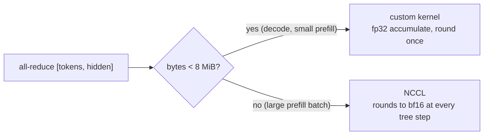

# [PR #58623] [Distributed] Enable custom all-reduce under VLLM_BATCH_INVARIANT

source: https://github.com/vllm-project/vllm/pull/58623
state: open | updated: 2026-09-27T09:09:41Z
labels: nvidia

## 正文

Fixes #50136

## Problem

`VLLM_BATCH_INVARIANT=1` forces custom all-reduce off and runs every TP all-reduce through NCCL pinned to one channel. Custom all-reduce cannot simply be re-enabled because `should_custom_ar()` picks the backend by tensor size, and the tensor is `[num_tokens, hidden]`:

The same request is reduced by different summation orders depending on what else the scheduler batched with it. Measured on 4xH100, TP=4, bf16: NCCL and the custom kernel disagree in 33% of output elements. End to end (Qwen2.5-1.5B, bs=1 vs bs=24, custom all-reduce on): 24/24 prompts diverge, starting at position 0.

## Fix

Under batch invariance, make the backend choice size-independent and keep the custom kernel on a fixed reduction order:

1. Stop forcing `disable_custom_all_reduce` (`config/parallel.py`).
2. `should_custom_ar()` ignores the size threshold; `all_reduce()` reduces inputs above `max_size` in `max_size` chunks. The 1-stage kernel sums each element independently in rank order 0..N-1, so chunking is bit-exact (`custom_all_reduce.py`).
3. Pin `VLLM_CUSTOM_ALLREDUCE_ALGO=1stage` in `override_envs_for_invariance()`. The 2-stage kernel rotates the rank order per slice, which is size-dependent (fp32: 20-30% of elements differ between sizes).
4. Gate AITER all-reduce and QuickReduce off under batch invariance, next to the existing FlashInfer gate. Without the forced disable they would become reachable on ROCm, and neither has a fixed reduction order (`cuda_communicator.py`).

Chunking is chosen over sizing the IPC buffer to `max_num_batched_tokens x hidden` at init: no extra memory, no model info needed in the communicator, and it works for any all-reduce shape (vision towers, MoE). Outside batch invariance nothing changes.

Latency inside a CUDA graph, bf16, TP=4 H100, per all-reduce:

| Size | custom 1-stage | NCCL (pinned, current BI path) |
|---|---|---|
| 24 KiB (decode) | 5 us | 39 us |
| 8 MiB | 81 us | 693 us |

## Test plan

All on H100, TP=4 unless noted.

- New `test_custom_allreduce_chunked[2,4]`: 3-chunk 17.6 MiB input matches the fp32 sequential reference bitwise, eager and inside a CUDA graph. New unit test for the size gate under batch invariance. Full `tests/distributed/test_custom_all_reduce.py`: 19 passed, 1 skipped (SM100-only).
- `tests/v1/determinism/test_batch_invariance.py` with `VLLM_TEST_TP_SIZE=4`: 22/22 pass (all attention backends), custom all-reduce now active.
- `tests/v1/determinism/test_online_batch_invariance.py` with `VLLM_TP_SIZE=4`: 3/3 pass.
- VLM (`Qwen3-VL-2B-Instruct`, image inputs) bs=1 vs bsN at TP=4 with batch invariance: bitwise identical.
- Standalone bs=1 vs bs=24 on Qwen2.5-1.5B with prefix caching off: 24/24 diverge before, 0/24 after.

## 评论 (2)

### mosafariuk · 2026-09-27

Glad to see #50136 (the issue behind #50505) getting this treatment — chunking neatly sidesteps the memory trade-off my init-time sizing had to cap at 256 MiB, and the shape-generality argument is a real win for the vision/MoE paths.

Two pieces from #50505 that may be useful here: (1) its standalone determinism test suite (+228 lines, both-directions bitwise checks across sizes) has zero overlap with your diff and ports directly onto the chunked path — happy to rebase it onto this PR or file it as a follow-up, whichever you prefer; (2) on the 1-stage pin: agreed it drops out once #57042 lands — that branch is mergeable against current main with the A/B evidence in-thread.

If this lands first, I'll close #50505 in its favor.

### mosafariuk · 2026-09-27

One more thing from a closer read of the diff, as a question: `fused_allreduce_gemma_rms_norm()` is called directly by MiniMax M3, Kimi K3 and DeepSeek V3.2 (bypassing the communicator), and its `_can_use_flashinfer` has no batch-invariance check — so those models still switch implementations at `num_tokens <= max_token_num` (~146 tokens at TP=4 / 36 at TP=8 for hidden 7168 bf16, per the size table). Pre-existing on main, not introduced here — but since the PR's goal is removing size-dependent dispatch under BI, should that path be guarded here too? #50505 carried a 5-line guard + a CPU test for exactly this; it drops in without touching your design if useful.

## Review (2)

### sfeng33 · 2026-09-24 · COMMENTED

(no text)

### claude[bot] · 2026-09-24 · COMMENTED

## Claude Code Review

This pull request is from a fork — automated review is disabled. A repository maintainer can comment `@claude review` to run a one-time review.
