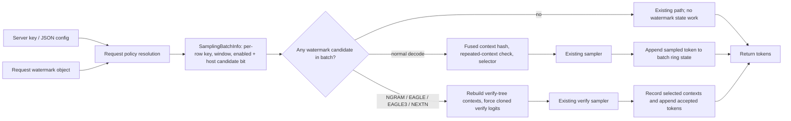

# [PR #37577] [Feature] Add Aaronson-Gumbel text watermarking

source: https://github.com/sgl-project/sglang/pull/37577
state: open | updated: 2026-09-25T08:19:57Z
labels: documentation, run-ci, jit-kernel

## 正文

## Motivation

Some deployments need a machine-readable signal that text was generated by an AI system, for provenance workflows and transparency obligations such as [Article 50 of the EU AI Act](https://eur-lex.europa.eu/eli/reg/2024/1689/oj/eng). This PR adds opt-in text watermarking to the SGLang sampler. It adds no tokens and makes no reader-visible change to the text, and default serving behavior is unchanged.

## Design

### Algorithm: Aaronson-Gumbel keyed sampling

Sampling from `p` is equivalent to the Gumbel-max rule `argmax_v u_v^(1/p_v)` with `u_v ~ Uniform(0, 1)`. The watermark replaces the random `u` with keyed, deterministic values:

```
context_hash = MurmurHash3_x86_32(last h committed tokens)
u[v]         = (mix32(key_lo, key_hi, context_hash, v) + 0.5) / 2^32
token        = argmax_v  log(u[v]) / p[v]      # over the top-k/top-p/min-p truncated distribution
```

- **Why this family.** With ideal uniforms, each selection follows `p` exactly, so there is no quality/signal trade-off. KGW green-list schemes add a logit bias δ that shifts the distribution by design, which is hard to justify for compliance marking. SynthID-Text tournament sampling belongs to the same family and gets more signal per token, but needs multi-layer g-value tournaments and, for speculative decoding, probabilistic draft sampling with retained proposal probabilities. SGLang's default EAGLE/NEXTN drafts are deterministic argmax, so that path is left as future work.
- **Keyed, not cryptographic.** MurmurHash3 is a fixed non-cryptographic mix. Without the key, a third party cannot practically score text against it, but there is no indistinguishability or unforgeability guarantee: whoever holds the key can both detect and forge. The hash is isolated behind one function, so a PRF-based protocol version can be added later with its own known-answer vectors.

### Detection: model-free Gamma test

The detector needs the key and exact token IDs (or a tokenizer for its text convenience API). It replays `u_t` for each generated token and computes `S = Σ -ln(1 - u_t)`. Under the null, each term is Exp(1), so `S ~ Gamma(n, 1)` and an exact one-sided p-value follows. Each distinct `h`-token context is scored once. This matches the generation-side repeated-context rule below, so repeated spans cannot inflate the statistic. The complete hash and detector contract is specified in `docs/docs/advanced_features/text_watermarking.mdx`, and `sglang.srt.sampling.watermarking.WatermarkDetector` ships as its in-tree reference detector (single and dual key, 4,096-context prefix, exact-tuple deduplication, log-space Gamma tail).

### Engineering choices



- **Package layout.** `python/sglang/srt/sampling/watermarking/` contains request policy resolution, batch config, and runtime state (`core.py`), server config loading (`config.py`), and the detector (`detector.py`, standard library plus msgspec, with no direct Torch import). The package root exports only the detector API; runtime code imports `core` and `config` explicitly. The detector and the runtime's retraction path share one scalar Murmur implementation.
- **Per-request GPU ring buffer.** `req.output_ids` on the CPU lags one step behind under the overlap scheduler, and a whole variable-length round behind under speculative decoding. The last `h` committed tokens therefore live in a GPU ring buffer indexed by `req_pool_idx`. It is initialized from the full logical prompt tail at prefill (so chunked prefill and radix hits keep the true context) and appended right after sampling or verify acceptance. The detector rule is simply "the true preceding `h` tokens" in every serving mode.
- **Repeated-context masking.** Because the hash is deterministic, a repeated context forces the same token again, and a short cycle can shut out EOS entirely. End-to-end gates showed this as no-EOS runaway completions. Each request keeps a history of already-watermarked context hashes, and a repeated context falls back to the ordinary distribution. Retracted requests rebuild this history from accepted output. At most `min(4,096, per-request token-pool capacity)` unique contexts per request are watermarked, which bounds history memory.
- **Greedy bypass.** Rows with `top_k <= 1` (including normalized temperature 0) are never forced or recorded, so greedy output is identical to unwatermarked serving.
- **Speculative forcing on a clone.** EAGLE/EAGLE3/NEXTN and NGRAM verify rebuild each draft position's context from the tree mask, draft tokens, positions, and committed ring tail. Forcing writes to a clone of the verify logits because `compute_spec_logprobs` reads the original tensor after verify. Only accepted-path tokens update watermark state.
- **Fused Triton selector with a finite-top-k fast path.** A profile of the unfused path measured about 3.1 ms of host time per step across 176–179 kernel launches, mostly from context hashing and truncation. The state and selector kernels fuse context hashing, repeated-context admission, truncation support, Murmur scoring, argmax, recording, and one-hot writeback across the finite-top-k and full-sort paths. When the batch's maximum `top_k` is finite and at most 8,192, `torch.topk` plus a tie-canonicalizing pass replaces the full-vocabulary sort/cumsum. The PyTorch implementation is the bit-exact parity reference.
- **Disabled-batch bypass.** A host-side candidate bit (policy-enabled and non-greedy) is maintained through batch filter/merge. When no row is a candidate, prompt init, selection, the speculative clone, and append are all skipped, with no device readback.

## Feature overview

### Server arguments

| Argument | Default | Meaning |
|---|---|---|
| `--enable-watermark` | off | Capability gate; validates the serving mode and fails closed on unsupported paths |
| `--watermark-key <hex>` | — | Server-held 64-bit key (visible in `/proc/*/cmdline`; prefer the config file) |
| `--watermark-config <path>` | — | JSON with `key`, optional `key_b`, `context_window`; mutually exclusive with `--watermark-key` |
| `--watermark-default-enabled` | off | Watermark requests that omit the `watermark` field |
| `--watermark-enforce-all` | off | Watermark every request and reject opt-out with HTTP 400 |
| `--watermark-context-window` | 4 | Default and allocation maximum `h` (1–64) |
| `--watermark-key-b <hex>` | — | Opt-in dual-key mode |
| `--watermark-mixing-probability` | 0.5 | Per-position probability of key A in dual-key mode, in `(0, 1)` |
| `--watermark-max-probability` | 1.0 | Skip forcing (and recording) when the truncated distribution's max probability exceeds this value |

### Per-request `watermark` object

OpenAI chat/completions and native `/generate` accept `{"enabled": bool, "key": hex, "context_window": int}`.

| Request | default off | default-enabled | enforce-all |
|---|---|---|---|
| omitted | unwatermarked | server key | server key |
| `{"enabled": false}` | unwatermarked | unwatermarked | **400** |
| `{"enabled": true}` | server key (**400** if none) | server key | server key |
| `{"key": "<hex>"}` | request key | request key | request key |

Mixed batches are native. Contradictory objects, missing keys, and oversized windows return 400 rather than silently producing unwatermarked text. Keys and config paths are redacted from startup logs, `/server_info` (HTTP and gRPC), request logs, representations, validation errors, and SGLang request crash-dump payloads. Process and GPU core dumps can still contain in-memory keys and should be protected as secret-bearing artifacts.

### Dual-key mode

With `--watermark-key-b`, a deterministic position coin, computed from both keys and the context hash, picks key A or B at each eligible position. One vocabulary pass computes both token hashes. A holder of both keys partitions contexts by the coin and runs the Gamma test per key, while a single-key holder still detects a weaker signal. Omitting key B compiles out the second hash, and single-key output is byte-identical to the path without dual-key support.

### Compatibility

| Mode | Status |
|---|---|
| Normal decode with CUDA graphs and overlap scheduling | verified |
| Tensor parallelism TP2 / TP4 (`SYNC_TOKEN_IDS_ACROSS_TP` unset) | verified |
| NGRAM, EAGLE / EAGLE3 (tree, top-k > 1), NEXTN via EAGLE | verified |
| Structured output (JSON schema, regex), streaming, `n > 1`, logprobs, penalties / logit bias | verified |
| Chunked prefill, radix-cache reuse, decode retraction, abort / slot reuse | verified |
| VLM (Qwen3-VL-4B-Instruct), mixed watermarked / unwatermarked traffic | verified |
| DP attention | untested; admitted without a support claim |
| DFLASH, DSPARK, and other speculative algorithms; pipeline-parallel speculative decoding; `--speculative-use-rejection-sampling`; beam search; PD disaggregation; diffusion LLM; embedded Rust server; custom logit processors; non-CUDA devices | rejected at startup or request time |

## Code composition

The diff is +5,455/−46 across 39 files. Per-file breakdown by area:

**Watermark package** (`python/sglang/srt/sampling/watermarking/`, +1,451)

| File | +/- | Role |
|---|---:|---|
| `core.py` | +1,095 | Request state: GPU ring buffer, repeated-context masking, policy resolution, retract rebuild, entropy gate, Torch parity selector (parity oracle). |
| `detector.py` | +247 | Torch-free detection library: Murmur contract, dual-key position coin, prefix cap, Gamma test with log-p underflow handling. Standalone-usable by copying the package dir. |
| `config.py` | +96 | Bounded JSON/key loading, key parsing, shared protocol constants (4,096-context cap). |
| `__init__.py` | +13 | Exports only the detector API (4 symbols); runtime internals stay module-private. |

**Fused selector** (`python/sglang/kernels/ops/sampling/`, +1,072)

| File | +/- | Role |
|---|---:|---|
| `textseal_selector.py` | +1,072 | Triton kernels: context preparation, keyed Murmur scoring with fp32-safe `log1p` boundary handling, partial/global argmax, tie-canonicalized finite-top-k fast path, one-hot writeback. Kernel structure adapted from Meta TextSeal (Apache-2.0, `Co-authored-by` on the port commit); hash contract is ours. |

**Runtime integration** (+142)

| File | +/- | Role |
|---|---:|---|
| `model_executor/model_runner.py` | +51 | Sampling injection point; class-level `watermark_state` default so partial-construction instances are safe. |
| `sampling/sampling_batch_info.py` | +55 | Per-row key/window/enabled tensors; host candidate bit tracked through filter/merge; disabled-batch early exit. |
| `model_executor/forward_batch_info.py` | +15 | Prompt-tail and retracted-history transport to the sampler. |
| `sampling/sampling_params.py` | +7 | Per-request `watermark` object normalization. |

**Speculative decoding** (+72)

| File | +/- | Role |
|---|---:|---|
| `speculative/eagle_utils.py` | +39 | Clone-before-force verify watermarking; per-draft-position tree-context rebuild from the verify mask. |
| `speculative/ngram_worker.py` | +18 | Accepted-token state append for the NGRAM path. |
| `speculative/eagle_worker_common.py` | +15 | Round-end accepted-token ring append (EAGLE/EAGLE3/NEXTN shared). |

**Config & admission** (+177)

| File | +/- | Role |
|---|---:|---|
| `arg_groups/validation_hook.py` | +88 | Fail-closed validation: unsupported modes (DFLASH/DSPARK, beam, PD, diffusion, rejection sampling, Rust embedded, non-CUDA, custom logit processors, PP+spec) and key policy checks. |
| `arg_groups/fields/exec_.py` | +44 | `--enable-watermark`, `--watermark-key`, `--watermark-key-b`, `--watermark-default-enabled`, `--watermark-enforce-all`, `--watermark-context-window`, `--watermark-max-probability`, `--watermark-config`, `--watermark-mixing-probability` fields. |
| `arg_groups/serving_hook.py` | +27 | Config-file loading into resolved server key (either source accepted). |
| `server_args.py` | +14 | Wiring and redacted repr. |
| `arg_groups/{pipeline,resolution_hooks}.py` | +3 | Registration glue. |

**API & redaction** (+158)

| File | +/- | Role |
|---|---:|---|
| `managers/tokenizer_manager.py` | +46 | Request admission, per-request policy validation, crash-dump redaction. |
| `entrypoints/engine.py` | +22 | Redaction in engine info paths. |
| `entrypoints/http_server.py` | +16 | `/server_info` redaction. |
| `utils/request_logger.py` | +17 | Request-log redaction. |
| `entrypoints/openai/protocol.py` | +15 | `watermark` object on chat/completion requests. |
| `managers/io_struct.py` | +13 | Tokenized request plumbing. |
| `entrypoints/openai/serving_completions.py`, `entrypoints/grpc_bridge.py` | +5 | Pass-through and gRPC info redaction. |

**Rust schema** (+43): `rust/sglang-server/src/message/sampling.rs` — SamplingParams schema lockstep with Python (guarded by a CPU lockstep test).

**Tests** (+2,006)

| File | +/- | Role |
|---|---:|---|
| `unit/sampling/test_watermark_config.py` | +430 | Policy matrix, admission rejections, redaction completeness, file guards, interval boundaries. |
| `kernels/ops/sampling/test_watermark_selector.py` | +417 | Triton↔Torch parity, finite-top-k ties, 8,191/8,192 boundary lanes, fp32 `u≈1` regression on both production paths. |
| `kernels/ops/sampling/test_watermark_state.py` | +322 | State machine: wraparound, retraction, spec recording, inactive-batch zero-activity. |
| `unit/sampling/test_watermark_detector.py` | +272 | Detector contract vectors, dual-key partition, prefix cap, standalone copy-dir usage. |
| `unit/sampling/test_watermark.py` | +266 | Disabled-batch zero cost, greedy bypass, per-request batch config. |
| `e2e/openai_server/test_watermark.py` | +239 | HTTP-level: four policy modes, cross-key isolation, key non-echo on 400. |
| Existing-file alignments | +45 | `test_sampling_batch_info.py` filter/merge lifecycle, `test_sampling_metadata_staging.py`, `test_mamba_prefill_track_metadata.py`, `test_model_overrides.py` — mocks aligned with the real interfaces. |

**Docs** (+388): `docs/advanced_features/text_watermarking.mdx` (operator guide: algorithm, server args, request matrix, detector spec + standalone usage, limitations, compatibility matrix) and `docs.json` registration.


## Performance and evidence

Unless stated otherwise, runs used public `Qwen/Qwen3-8B` at TP1 with default overlap scheduling, CUDA graphs, temperature 1.0, and top-p 0.95. Each change was gated on a fresh devbox.

### GSM8K (full 1,319, sgl-eval)

EAGLE3 used the public `Tengyunw/qwen3_8b_eagle3` draft with steps 5, top-k 8, and 64 draft tokens.

| Decode path | Configuration | Seed 0 | Seed 1 | Stop rate |
|---|---|---:|---:|---:|
| Normal | Baseline | 93.03% | 92.27% | 2638/2638 |
| Normal | Watermark | 93.10% | 92.57% | 2638/2638 |
| NGRAM | Baseline | 92.57% | 93.25% | 2638/2638 |
| NGRAM | Watermark | 92.80% | 92.95% | 2638/2638 |
| EAGLE3 | Baseline | 91.96% | — | 1319/1319 |
| EAGLE3 | Watermark | 92.57% | — | 1319/1319 |

Every run had zero length truncations and zero request errors. After per-request keys were added, the full 1,319 NGRAM gate scored 92.72% with a 100% stop rate. Later runtime changes were each re-gated with GSM8K-100 (93–98% accuracy, 99–100% stop rate), detector positive and negative controls, and a greedy request.

### Long-horizon agentic A/B (Terminal-Bench 2.1)

An internal 27B hybrid-attention model ran all 89 tasks twice. Both arms used the same checkpoint, build, template, sampling, NEXTN 3/1/4, TP1, and Harbor concurrency 8; only the watermark flags changed.

| Configuration | Passed | Pass rate |
|---|---:|---:|
| Watermark ON | 68/89 | 76.40% |
| Watermark OFF | 71/89 | 79.78% |

Paired outcomes were 64 both-pass, 13 both-fail, 4 ON-only, and 7 OFF-only. The exact two-sided paired binomial test gives p = 0.5488, so this single matched pass@1 A/B found no statistically significant capability loss. The full ON trajectories (5,242,946 unique scored contexts) gave z = 783.89 (p underflows to 0). The same-key OFF control stayed negative at p = 0.42.

### Detection

One-sided p-values; lower means stronger watermark evidence.

| Decode path | Watermarked | Baseline output | Human-written |
|---|---:|---:|---:|
| Normal | 4.60e-14 | 0.839 | 0.529 |
| NGRAM | 4.64e-26 | 0.552 | 0.470 |
| EAGLE3 | 3.48e-6 | 0.286 | 0.470 |

Cross-key isolation: concurrent 2,048-token NGRAM requests gave p = 1.8e-31 for a default-key output under key A versus 0.996 under key B, and p = 3.3e-26 for a request-key output under key B versus 0.772 under key A. On a default-enabled server, an explicit second key was positive only under that key (p = 2.65e-41 vs 0.807 under the server key), and `{"enabled": false}` output stayed negative under both keys (p = 0.319 and 0.540). In dual-key mode the per-key partitions gave p = 1.7e-12 (A) and 1.3e-16 (B), with an unrelated key at p = 0.836.

### Throughput

Non-speculative decode after fusion: 800-token streams, mean of three repetitions, output tok/s per stream.

| Hardware | Load | OFF | ON | Change |
|---|---|---:|---:|---:|
| GB300 | c1 | 270.25 | 260.44 | −3.63% |
| GB300 | c8 | 224.88 | 212.84 | −5.35% |
| B300 | c1 | 258.84 | 247.69 | −4.31% |
| B300 | c8 | 196.26 | 182.04 | −7.24% |
| H200 (with finite-top-k path) | c1 | 178.40 | 171.95 | −3.61% |
| H200 (with finite-top-k path) | c8 | 150.83 | 146.65 | −2.77% |

The GB300 c8 row was remeasured after the score-precision fix on one default-off server, comparing omitted requests with request-level opt-in.

Finite-top-k selector microbenchmark: CUDA events, full forcing path including softmax, top-k 20.

| Hardware / logits | Batch | Full sort | Top-k path | Change |
|---|---:|---:|---:|---:|
| H200 / bf16, vocab 151,936 | 1 | 126.73 µs | 201.20 µs | +58.8% |
| H200 / bf16, vocab 151,936 | 8 | 429.34 µs | 221.16 µs | −48.5% |
| GB300 / fp32, vocab 129,280 | 1 | 238.24 µs | 223.05 µs | −6.4% |
| GB300 / fp32, vocab 129,280 | 8 | 386.55 µs | 230.39 µs | −40.4% |

Disabled batches: one GB300, EAGLE3 3/1/4, c8, 100 random 1024/512 prompts, mean of three runs.

| Arm | Mean TPOT |
|---|---:|
| Merge-base, feature absent | 2.465 ms |
| This PR, `--enable-watermark` not set | 2.493 ms |
| This PR, capability on, default-off traffic | 2.469 ms (+0.14% vs merge-base) |

Dual-key marginal cost versus single key on one GB300: −0.21% at c1 and −1.50% at c8. Both are within c8 repetition variance.

Speculative decode after state fusion: public `Qwen/Qwen3.5-9B`, TP2 on one 2x GB300 node, NEXTN 3/1/4, c8, random 1024/512, temperature 0.8, top-p 0.95, top-k 20, mean of three repetitions.

| Watermark | Mean TPOT | Aggregate output tok/s | Mean accept length |
|---|---:|---:|---:|
| OFF | 2.246 ms | 3188.9 | 2.759 |
| ON | 2.451 ms | 2922.2 | 2.783 |
| Change | +9.17% | −8.36% | +0.85% |

The +9.17% TPOT delta is below the +14.24% measured for vLLM's speculative dual-key watermark on the same public-model workload. Tree-context reconstruction, repeated-context admission, accepted-context recording, and ring-buffer append are fused GPU operations; keyed selection still runs for each speculative row.

Speculative acceptance (average accept length):

| Workload | Decode path | OFF | ON |
|---|---|---:|---:|
| GSM8K, Qwen3-8B | NGRAM | 2.011 | 2.456 |
| GSM8K, Qwen3-8B | EAGLE3 5/8/64 | 4.563 | 4.535 |
| Random 1024/512, c8, top-k 20 | Qwen3-8B EAGLE3 | 2.221 | 2.202 |
| Random 1024/512, c8, top-k 20 | Qwen3.5-4B NEXTN | 2.676 | 2.705 |
| Random 1024/512, c8, top-k 20 | Qwen3.5-9B NEXTN | 2.759 | 2.783 |

The public models show no material acceptance loss in these runs.

### Tensor parallelism

Default FA3 attention and PyTorch sampling, with `SYNC_TOKEN_IDS_ACROSS_TP` unset so every rank selects independently.

| Model / path | TP | Accuracy / stop | Detection (2,048-token samples) |
|---|---:|---|---|
| Qwen3-8B normal decode | 2 | GSM8K-100 94/100, 100% stop (TP1: 95/100) | p = 1.2e-15, 1.1e-14, 2.5e-37 |
| Qwen3-8B normal decode | 4 | greedy request: `finish_reason=stop` | p = 3.3e-25, 4.2e-21 |
| Qwen3.5-9B NEXTN 3/1/4 | 2 | greedy request: `finish_reason=stop`; accept length 2.50 | p = 6.1e-50 |

No scheduler exceptions, NCCL warnings, or rank-divergence symptoms were observed.

## Limitations

- Temperature 0 carries no signal by design. Low-entropy spans and short texts carry little signal, and no calibrated minimum length is claimed.
- Paraphrase or translation erases the signal. Light edits are tolerated because the score is a sum over positions.
- The key is the trust root: detecting and forging both require it. Murmur32 is not a cryptographic PRF.
- Top-k-1 chained speculative decoding (NEXTN) can lose acceptance, because each draft token must exactly match the watermark-selected token. The fused public NEXTN benchmark measured +9.17% TPOT with no material acceptance loss, but the impact remains model- and workload-dependent.
- At most `min(4,096, per-request token-pool capacity)` unique contexts per request are watermarked, and later tokens are sampled normally, so detectors should use the same prefix budget. Runtime deduplication uses 32-bit context hashes while the detector deduplicates exact token tuples. Rare collisions, and sibling-duplicate contexts in wide verify trees, only reduce signal.
- DP attention has no service-level gate yet.

## Relationship to other work

#37568 ports Meta's TextSeal to SGLang. It is an algorithmic cousin that also selects with `argmax(log u / p)`. This PR adapts its blocked partial-argmax Triton kernel structure (Apache-2.0, re-implemented on this PR's Murmur contract to keep the detector contract) and its per-request key design. The commit carries `Co-authored-by: Nihar Patel`. This PR differs in serving-mode coverage (CUDA graphs, NGRAM/EAGLE/EAGLE3/NEXTN, TP > 1, repeated-context loop safety, policy modes, dual key) and in its quality, long-horizon, and detection evidence. vLLM's Gumbel-max watermarking (vllm-project/vllm#54053) belongs to the same family.

## Test plan

Registered tests:

- CPU (`base-a-test-cpu`): `test/registered/unit/sampling/test_watermark.py`, `test_watermark_config.py`, and `test_watermark_detector.py`. The detector tests cover the known-answer hash vectors, parity with the torch reference across variable-length contexts, the strict coin partition, the prefix cap, tuple deduplication, and cross-key isolation. The other two cover the server × request policy matrix, startup validation, config-file resolution and mutual exclusion, secret redaction, and the disabled-batch skip for normal and speculative paths. The sampling batch-info and metadata tests are extended for the new fields.
- CUDA kernel (`base-b-kernel-unit`): `test/registered/kernels/ops/sampling/test_watermark_selector.py` and `test_watermark_state.py`. They cover a fixed hash-boundary regression, torch/Triton parity across dtypes and the 8,192 split boundary with ties, the finite-top-k versus full-sort boundary, dual-key selection, ring-buffer wraparound, repeated-context fallback, speculative multi-row expansion, and zero work on inactive batches.
- E2E (`base-b`, 1 GPU): `test/registered/e2e/openai_server/test_watermark.py`. It covers request-key isolation and redaction, default-enabled opt-out, enforce-all rejection, and strict JSON-schema output that stays valid and detectable, scoring every response with the in-tree detector.
- Rust: sampling-schema lockstep and key redaction in `rust/sglang-server/src/message/sampling.rs`.

Final-head gate after the score-precision fix: the affected CPU battery passed 305 tests with 2 capability skips and 120 subtests; the complete CUDA selector/state suite passed 20/20, including both production forcing paths for the upper-hash-boundary regression; and the OpenAI endpoint suite passed 5/5. Public Qwen3-8B GSM8K-100 scored 96% with a 100% stop rate and no truncations or request errors. A 2,048-token opted-in sample produced p = 1.01e-38 over 1,916 contexts, the opted-out control stayed negative at p = 0.429, and temperature-zero generation returned `finish_reason=stop`. Changed-file pre-commit, the registered-test taxonomy check, and the complete Mintlify docs validation pass.

<!-- pr-states:start -->
---
### CI States

Latest PR Test (Base): <!-- slot:pr-test:start -->:hourglass_flowing_sand: [Run #36112262548](https://github.com/sgl-project/sglang/actions/runs/36112262548)<!-- slot:pr-test:end -->
Latest PR Test (Extra): <!-- slot:pr-test-extra:start -->:x: [Run #36112262101](https://github.com/sgl-project/sglang/actions/runs/36112262101)<!-- slot:pr-test-extra:end -->
Latest PR Test (AMD ROCm 10): <!-- slot:pr-test-amd:start -->:hourglass_flowing_sand: [Run #36112262357](https://github.com/sgl-project/sglang/actions/runs/36112262357)<!-- slot:pr-test-amd:end -->
<!-- pr-states:end -->


## 评论 (12)

### JustinTong0323 · 2026-09-04

/tag-and-rerun-ci

### JustinTong0323 · 2026-09-04

/rerun-failed-ci

### JustinTong0323 · 2026-09-05

/rerun-failed-ci

### JustinTong0323 · 2026-09-08

/rerun-failed-ci

### JustinTong0323 · 2026-09-08

/rerun-failed-ci

### JustinTong0323 · 2026-09-09

/rerun-failed-ci

### JustinTong0323 · 2026-09-11

/rerun-failed-ci

### JustinTong0323 · 2026-09-11

/rerun-failed-ci

### JustinTong0323 · 2026-09-12

/rerun-failed-ci

### dakl · 2026-09-14

We're very much looking forward to this 👋 🎉! Keep up the good work 🦾

### JustinTong0323 · 2026-09-17

/rerun-failed-ci

### sichidambara · 2026-09-23

Can we also see if we can pair it with a detector library that teams can use? With only watermarking and no detection , each team would have to build their detectors. 
