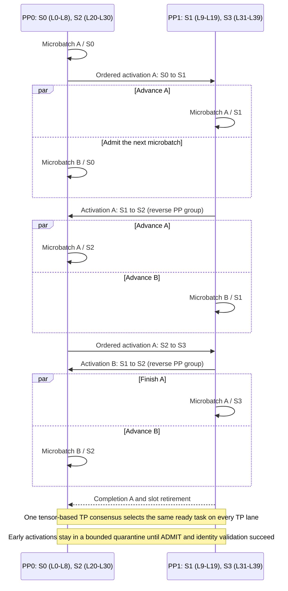

# [PR #41212] perf(dsv4.1): add virtual pipeline parallelism scheduler

source: https://github.com/sgl-project/sglang/pull/41212
state: open | updated: 2026-09-25T07:04:50Z
labels: deepseek, apple-silicon, memory-pool

## 正文

## Motivation

DeepSeek-V4.1 disaggregated prefill leaves pipeline capacity unused with equal physical-stage partitioning. This PR adds an opt-in VPP2 execution path that supports nonuniform logical-stage partitioning while preserving the existing generic PP scheduler behavior.

## Modifications

- Add a dedicated `SchedulerVPPMixin` with a rank-local wavefront scheduler, keeping VPP lifecycle and control-plane logic separate from `SchedulerPPMixin`.
- Preserve source-side activation ordering and accept early activations through a bounded receiver quarantine. Activations enter the ready queue only after protocol, runtime epoch, layout digest, batch, generation, slot, and stage validation.
- Merge receiver readiness and ready-task state into one tensor-based TP consensus per tick using preallocated CPU buffers.
- Add batched asynchronous tensor-dict P2P transport and a reverse PP group for PP2 activation traffic.
- Add logical pipeline layout digests and explicit nonuniform partitions, including `SGLANG_PP_LAYER_PARTITION=9,11,11,9`.
- Extend DeepSeek-V4.1 model execution, memory-pool ownership, and disaggregated KV/state transfer to support noncontiguous logical-stage layer IDs.
- Add startup gates for the validated PP4 x TP2 and PP2 x TP4 VPP2 disaggregated-prefill configurations.

## VPP2 Scheduling Overview

The validated `9/11/11/9` partition maps four logical stages onto two physical PP ranks. Different microbatches advance as a rank-local wavefront, allowing each rank to alternate between its early and late logical stages.

Source ranks enqueue activations in original forward order. Receivers validate protocol version, runtime epoch, layout digest, batch, generation, slot, and stage before moving quarantined data into the ready queue.

## Accuracy Tests

- 256/256 requests matched the equal-partition baseline exactly for tokens, generated text, and logprobs.
- 157 focused unit tests passed, including scheduler/layout races, DeepSeek-V4.1 replay, memory-pool ownership, startup gates, and a real two-process Gloo asynchronous P2P test.

## Speed Tests and Profiling

DeepSeek-V4.1 disaggregated prefill, VPP2, using the nonuniform 9/11/11/9 logical-stage partition:

- Equal-partition baseline median: **10,179.62 tok/s**
- Nonuniform-partition candidate median: **10,453.31 tok/s**
- Improvement: **+2.69%**
- Final paired runs: **10,287.32 tok/s** (equal) vs **10,469.20 tok/s** (nonuniform)

## Checklist

- [x] Format code with pre-commit.
- [x] Add focused unit tests.
- [x] Provide exact-match accuracy results.
- [x] Provide throughput benchmark results.
- [x] Follow the SGLang code style guidance.
- [ ] Update documentation (no user-facing documentation change required for this opt-in path).

<!-- pr-states:start -->
---
### CI States

Latest PR Test (Base): <!-- slot:pr-test:start -->:x: [Run #36094190513](https://github.com/sgl-project/sglang/actions/runs/36094190513)<!-- slot:pr-test:end -->
Latest PR Test (Extra): <!-- slot:pr-test-extra:start -->:x: [Run #36094190226](https://github.com/sgl-project/sglang/actions/runs/36094190226)<!-- slot:pr-test-extra:end -->
Latest PR Test (AMD ROCm 10): <!-- slot:pr-test-amd:start -->:x: [Run #36094190588](https://github.com/sgl-project/sglang/actions/runs/36094190588)<!-- slot:pr-test-amd:end -->
<!-- pr-states:end -->

## 评论 (0)
