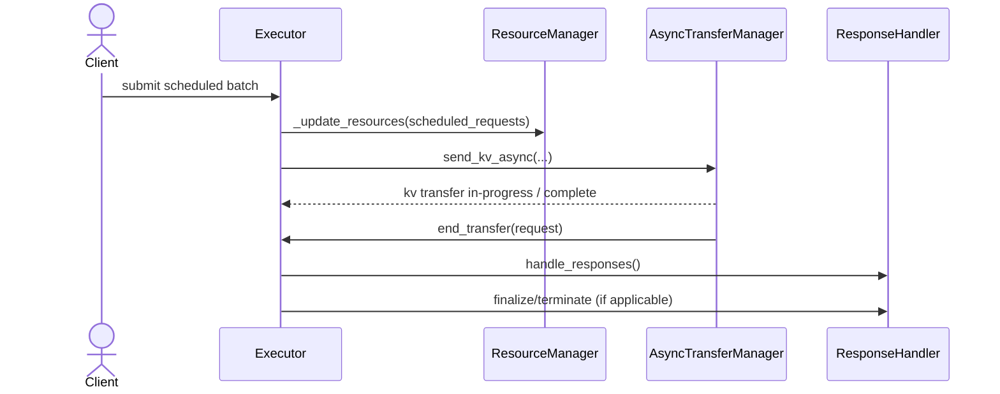

# [PR #12945] [https://nvbugs/6066969][fix] Store context blocks before request termination

source: https://github.com/NVIDIA/TensorRT-LLM/pull/12945
state: open | updated: 2026-09-25T02:21:15Z
labels: 

## 正文

<!-- This is an auto-generated comment: release notes by coderabbit.ai -->
## Summary by CodeRabbit

* **Bug Fixes**
  * Centralized resource-update logic and moved resource-tracking earlier across execution paths so resources are updated before request cancellation and response handling.
  * Simplified transfer completion/termination handling to call termination paths directly, improving KV-cache/context transfer reliability and preventing lost or inconsistent request state during execution.
<!-- end of auto-generated comment: release notes by coderabbit.ai -->

## Description

Move `update_resources` (which calls `store_context_blocks`) before `_handle_responses` in all three PyExecutor paths.

`_handle_responses` can terminate requests and remove sequences from the KV cache manager, causing `store_context_blocks` to fail with a `[kv cache manager] storeContextBlocks: Can not find sequence for request` warning.

**Fix:** Reorder `update_resources` to run before any code path that can terminate requests:
- `_handle_executed_batch` (overlap/PP path)
- Non-overlap executor loop
- `_process_previous_batch`

## Test Coverage

- Verified with disaggregated serving (Qwen3-0.6B, context + generation servers on single node)
- Ran 200 concurrent requests via aiperf (concurrency 10) — zero `storeContextBlocks` warnings
- No crashes or errors in context/generation server logs
- Existing disagg CI tests should cover regression

## PR Checklist

Please review the following before submitting your PR:
- PR description clearly explains what and why. If using CodeRabbit's summary, please make sure it makes sense.
- PR Follows [TRT-LLM CODING GUIDELINES](https://github.com/NVIDIA/TensorRT-LLM/blob/main/CODING_GUIDELINES.md) to the best of your knowledge.
- Test cases are provided for new code paths (see [test instructions](https://github.com/NVIDIA/TensorRT-LLM/tree/main/tests#1-how-does-the-ci-work))
- Any new dependencies have been scanned for license and vulnerabilities
- [CODEOWNERS](https://github.com/NVIDIA/TensorRT-LLM/blob/main/.github/CODEOWNERS) updated if ownership changes
- Documentation updated as needed
- Update [tava architecture diagram](https://github.com/NVIDIA/TensorRT-LLM/blob/main/.github/tava_architecture_diagram.md) if there is a significant design change in PR.
- The reviewers assigned automatically/manually are appropriate for the PR.


- [x] Please check this after reviewing the above items as appropriate for this PR.

## GitHub Bot Help

To see a list of available CI bot commands, please comment `/bot help`.

## 评论 (69)

### Tabrizian · 2026-04-11

/bot run --disable-fail-fast

### coderabbitai[bot] · 2026-04-11

<!-- This is an auto-generated comment: summarize by coderabbit.ai -->
<!-- walkthrough_start -->

<details>
<summary>📝 Walkthrough</summary>

## Walkthrough

Centralized resource updates into a new `_update_resources(scheduled_requests)`, moved resource update calls earlier across executor paths, and removed `_end_transfer_and_maybe_terminate(...)`, replacing callers with direct `async_transfer_manager.end_transfer(request)` calls.

## Changes

|Cohort / File(s)|Summary|
|---|---|
|**Executor core** <br> `tensorrt_llm/_torch/pyexecutor/py_executor.py`|Added `_update_resources(scheduled_requests)` helper; relocated `resource_manager.update_resources(...)` invocations earlier in `_handle_executed_batch`, `_executor_loop`, and `_process_previous_batch`; removed `_end_transfer_and_maybe_terminate(...)`; updated KV/disaggregated-context transfer completion sites to call `async_transfer_manager.end_transfer(request)` directly.|

## Sequence Diagram(s)



## Estimated code review effort

🎯 3 (Moderate) | ⏱️ ~25 minutes

</details>

<!-- walkthrough_end -->


<!-- pre_merge_checks_walkthrough_start -->

<details>
<summary>🚥 Pre-merge checks | ✅ 2 | ❌ 1</summary>

### ❌ Failed checks (1 warning)

|     Check name     | Status     | Explanation                                                                           | Resolution                                                                         |
| :----------------: | :--------- | :------------------------------------------------------------------------------------ | :--------------------------------------------------------------------------------- |
| Docstring Coverage | ⚠️ Warning | Docstring coverage is 11.11% which is insufficient. The required threshold is 80.00%. | Write docstrings for the functions missing them to satisfy the coverage threshold. |

<details>
<summary>✅ Passed checks (2 passed)</summary>

|     Check name    | Status   | Explanation                                                                                                                                                            |
| :---------------: | :------- | :--------------------------------------------------------------------------------------------------------------------------------------------------------------------- |
|    Title check    | ✅ Passed | The title clearly specifies the main change: storing context blocks before request termination, with proper format including NVBugs ticket and fix type.               |
| Description check | ✅ Passed | The PR description fully addresses the template requirements with clear explanation of the issue, solution, test coverage verification, and completed checklist items. |

</details>

<sub>✏️ Tip: You can configure your own custom pre-merge checks in the settings.</sub>

</details>

<!-- pre_merge_checks_walkthrough_end -->

<!-- finishing_touch_checkbox_start -->

<details>
<summary>✨ Finishing Touches</summary>

<details>
<summary>🧪 Generate unit tests (beta)</summary>

- [ ] <!-- {"checkboxId": "f47ac10b-58cc-4372-a567-0e02b2c3d479", "radioGroupId": "utg-output-choice-group-4238852004"} -->   Create PR with unit tests

</details>

</details>

<!-- finishing_touch_checkbox_end -->

<!-- tips_start -->

---


<sub>Comment `@coderabbitai help` to get the list of available commands and usage tips.</sub>

<!-- tips_end -->

<!-- internal state start -->


<!-- DwQgtGAEAqAWCWBnSTIEMB26CuAXA9mAOYCmGJATmriQCaQDG+Ats2bgFyQAOFk+AIwBWJBrngA3EsgEBPRvlqU0AgfFwA6NPEgQAfACgjoCEYDEZyAAUASpETZWaCrKPR1AGxJcA2gDN4AA8AXUgAZQIKEgUMGkDcSAEPfAYAaxkSP3woyCiAR2xpBJoKZngManh8LAAKW0gzAEYAJgBOABYAVgBKSEgDAFVESi5oFQp4AC94TEhAFAJw/GwKBm9IAMCAekRIkjAmWJJ4sCSU9JPM7L2SsoqaSEAkwhhnUk5IZm1a/G4yXv6BmwAGS4sFwuG4iA4m02RHUsGwAg0TGYmwAcgA1ACSABFMQBBTbQMiIbI2aBgQGAgCym242A8Hk2LQ6nXmkAAwlFqHQuM0AAzNABsYD57TAjUa0D5fI4AGYAOxyzoALTZNhIEngJAA7pRITwGGgdtUiNg0LIADSQIT4WSYIhgDASIzY6QMCbccTVDgGKBU/BSSDYbi0bkAfSiJOWq2QNW1CAYsEYaAZyGNUTDBziuDDpzSiF6BFy2CwAkuOTDsEwtC8Eek3Gqw2Q5XQDMguFgUWiVlkAFFAqI8NkeNRYMgi2gJPh4PR0yRM9Vs7nkvn1toPOUiJB42R7CQCmQY+gclFmAG6Il5PlCjt25RbpVqhpfZA8X4/KIaPQmEoRx3IQYfRQJW1a1kcg5frm1CJpANTnhQHhoNwmxWFYf6wN0gG6JAqLVGA8GIdwkDgQwQ58Mk3xYcBvApNIiBhrwGpVNg9ECNBsAvjYj4VF4XAgRgNbzpGDYYE2yZYDc5Tcrk+43rgyDVjJZ6BsMB4YEefgUCw7awNEADS6LJom0QfBUpAUFahosZu6CQIAOAQ+KkEhGbp7yYGg5mhHO7KLkcuAAEIrukXDsrMGD4AkAQCXuamrOsw7XkUgC4BNuzgYDZO5YHOC6HPEy5nMgFAlgpfglNqzi0M+UBEreTBSFQpDoNF9XwAEhpehgPpAZA6KUK1Wr0NqcKQLQSAeUQURENys6UJqGBbjUACKuoYLKIoaIK/kANwxNmkAANSQKQ5BUB1e4UPVyDVLZiCbl4kDhUo3TPt1XFYPyfIxKRFBRLEMkHjsyCamg6DwD8FB+LBBzfb9DDyI0fK9AskyUPg9i7D5uUBUFyDlRQ6XzYgL3YbhjBUIgulXXwlBaRQV0CMMF0Xi2WZ+TCZDKGdjP1ZAyREETVGQP2SDiPNI1jUQE0kFNX4cpid6A8RgQ/GIF5FnVlAyVLiC3U+L71GwuBoKGRtcKijhlnwzJdDtxlpBut7qCQzAKdFP42aaM4kBu5AyR+sPSCg6keNgSj0C29RKIg7pgx1z4GBYHIsGwsRpo4HwuEY1XjFMMwSRMkuUBe7Ly0NHY6dEyKmbQXCbAIEXFlgECjYgKheGAfjrh3RqaC+NCidkFC4Ps8AMPQUQNkPF4g7YYYAOJwgikC6R44PWoIsFmO0zTyoKsq9EVWBZHwVfqJA7Syu0tDtAwzTbgmSbItwXiyw4DAxogfj0h4sg7R2JmfB4GDb25Rog+E2JSGkHxygQL5GGKklBSDqgBjmeoZhZSX3aHyUIT8X4XjLkmHY1AWKQAAGJ4kxICAEvYmrj1kkUaeYgqgSTRnbVIa54BeHoDQQGVVngCAmNMWYURcAF3MsXUuw064N0ProMALc257E7pw7uOw+H9xJD9YeDBR50MnrLEGwwDj0FngvDsS8V5rxtAITe28AAcfIeiN3inwf+9g0BsAUKwM+8ZR6PxYM/Egr9sDvzol/Bkv8K5uRbNwYBPswEQOpJsaBGBYHwMQSQZBckwxoIwe0eUdicEBLwYNYaRDcAkLCAMdk7JexhDCOgUqms0BDg+OIBgMlRFaiJpAdUsjFIlxkvo3m5R0jbiLjwLSmow58LGAI3OsxyhTlSBeaRCR+lTRbMfLxZQEjyjQIKQUnRBTtFgqYxeNit6yj5K0eUz0XxzMEXnf6clp4yU1DqdYWlmCQAAAI/mUKodQfCAVUCBUbHQNQfJKC4uCxIEVegtIIGACeG4LwHACKUGyUQPnanbGIou9BFKIRKDETFtwtzhI8O8rUeKumFyiLQHa4UeFB1Gu1aI5R3TO3YCmRIJAqyamHDUWg+BA4spkiipinyUxcloFeaVupvzJ3UIgW2ydFJIWfqPRR/AMA/3vruJFLBKgdJxbShSORuAtOGLQe5vowCGAMCYKAZB6D4Ehsa4gHNTrouTuwLgvB+DCE/JIQOcgFBKDBWoTQ2g5GGBdTABAzZXY4GRcdTmfrWABtyGgPFDgnAuEvJGwFMatA6H0EYZ14AwBGA0YPHMDIURhkiImWksgSJkXbWGTtkQNDcFkD6AARCOhOlgKHepOtNew6dnDyA9YwKs81pBZ16c7c83DXIAAMe0CRbVQUS/swzVjDB8WQZYW33ikjQGoiUdjdC3cvb24MrRcpDqNMWqq1w7DAKIzAn9NbCUbJXLkZ1rXl0ypAAy+L/2rDDSfYpQTmHLy1cSbccIWxuNbp43tw4nanWYVaRSX7JJ3GYWARAqQwaxLFgIzAMFINbqNLIdS+7/1HtMh5SgGgKZLA8LQMM2U8zpEfagURhQ+F4loGHSAO7gwmyEtIJYKxpA1GjrpWg9I6B1hQQWR96t2BUA3CjWTkZlOrFPe5cyGh5PhjM9GVTGgnMPqDLdMWW6zxKA8Lu2E5AtBggwKeoJxtqBoEfYpDzihvY+dARoJymY0DGTDLQXAsgfi5lkDQQTUwSBbr4eyJdpA6FRhU0GEM0lxAUq6thTEWAd1LsEj2gcpFIJsVwImR9dQ0LgYwlaZSF57Olds6yosKRvooGzaNbkBq0BNL4HJ8rWW73yRqE5jQD6rRlmPpXej3s6BSpQShgSPsiBWiA6JaIDWTtEeijuthyWJZEEzLgQICWkt/sPZQQTRsKmIBqIjPLgtauyaaxBbIYYKLcE6+FDA+F6qEXQt0PrG6ZIlbisNwOJBnBotcWjMbyxcjwCIKCRppKFsKZ03JP7a2XOKS21cEHww93xeY+pVbzmt2WV21wg7ckjs1k3Gd+swH+fXdobJ8GfhLNmW40/PA842uJjDEQOkLb4BsGpxz4mUBgc7poh/Bi5qlisXYp1giSF7DGU014PgPWkfvBR4N9Hi3A5Fiw0bIe/BIZuMNrARQm3yzRHq6Bechp1J7YE8tv7tPbv8Ua+dpsNQH3a7Xf1zd0RGJCpIeUeJpmlMOel1xigNmXd1jR45jniQcZfO0h2fAwxeYpG4rGVFiWLwRvJ3Z/PKnNfrcfYaVM9yoADBd/QaDH2AMIeYIEjqmxSPcWTG2W6I20ZyGtTrKJp4UeWJGILHd8WDjkDEOD+fS36GAy3VwcKeKB8eGQFu4YHg/BaEQCxhgbHPsUEL9Zt1H/J+3v3Bc1GiiDEB/hTzu10jSAe1bklme1e0NHewPUn2+2IUQEvwenwBvxTDv1k0f2f1Z3fwnw4ys241/yIMoAAJQRc22XrnLlwSCWnmikq32yWGKCvTI2unoLA1HAFjHVfA8BKGb3bDRjcSUAYEQgI0bC9yVn0QvGHDpCSFHmIliHUG6SMFwj8yMEBFAWQETHtB5AOkaHaE2DAHySMF7B2HV2nQBRpU+UyGPjeAAAkicOIR0h0s5HVjAa1lD3VPUhxJ1M1lVs1YguAqB81Z0i0I1QUVAy041K1E1T4cwZx6JzUdRtMiFPdK1q0IBz5L5r5b5ZRWg7FOhOhL5RBOg7FGgSA7FaBOgGA7EhRmg7E7FWhZRmhjkOgFQ754jvD9lDljl2g/AGBWg+RGg/ABA+Q/A8jWgx5GhBQ0BmhjZVhCjZRGhWghjBQ7FBR40vCcjEiwxki6xcVtM3UdjE1GIgsKBSBMxID0gUDMjPCDAABvLCIdJAWwQKM4OgHyYI3AKwevL8IdLgTuO/EgC0V4pAAAeXqgmGkzICBLXFBPBL6CHVFQYB2AmHmh8nqi41qxKB4giG5ARJeL6BRPrS0Qhw8GbVbVgHbVwwoG7XpP7VkGJKwlJMgCHQICNg8FIRLCYUbARNaGRPZI5K/nUg6kQAAHU4RsQUgMTNxEAETGg2TIAABfLCVU4UodAFWFGNSUrSGgKwCgdwXALwBEkE4YLU3jekWgT4tIWwc0lMS0140aWgGwEsWUhgCITE/mArUQVIBE8TMEl0mcd0jAE0rwP0tIQMoqYMlE10sM10aOD0DqKMgMrgIMrUn2FZWgTEHWG8b0hEkdLMnuNM9UBwAQxU3wFUkkkU7U241EDxEgIsiMyuW4odYU9kodcpFiGMwoTs0kodI4Z+dyDqFs1ycQU0yuLwbHeQRAFWfqV3VyFJRdfQrgdMGyVmeIKvAqflbbF5IoO8LFDgjAK0AhSZb4TWY+NpIOcQ0OGyDEfybAfmdsUeFZBIRSDYdsNLEgDQDslUlEszEOMcq/b+AclEzzZsrgIdPGAmIgf8kUjkkA6oAIU0KIR0pEgCjk7IInKSDwNMxstgIsycs0lUzUmsrC+s/0wiqCjkpMmOT0ZDNhBCusnsqs/Ffsyi4cxCE88c7sOwKOBis6KleQY2WgSMMSNxGgafElaIa8eAU8dgXGYacQrHamZWHihfBdNxJABwME+wfAYCwjBWBIDWBqaIFqNqbiG7IImfdFW4h2BIJ2F2P88CpCpTIy6oBEjAMCyiyCos2CzcFirs5CjAVC5YWii0uMusnC3zFMAipsoswSlM5hdw9k8i9k2srsthGiosz0+UsWbE5QUgYKwctijC50xCocjS0c1K6C/KrpMWMyrjFAZACUDQCUAAUnvj8VaqDgcHfFHi1FiA0CTTktkgUrVk7GkD934z6ocQ0GlE6tcsoqArwDqo5P1KdhGjlMapfO2TcTFP5NEneF0psn/h+SLFbnEE/nkDcWasag7EjFmsqlKogqiwCrSiCrcqHVirwoSqIugrRIKv5jStJPVL6GCBLJ2FsHopSq8ugvaLQFaBUHaFaFuXlD8DaFaE6EcTGLLFlAYHfEaFWDsSGIEGaLWIKTGIORaMFExvaBOUFGaHKNaEFAEHaHaDLFoBYqHUQhhrJE8Fou1IEAYGZtoE2MS2aAloYHaFm06D8FaAEEvjaE2PZtoFvnRrsXyUVrsTYjoAYBVr8BltlE6FoEaGRo5pvmKPcPVOyKgAuLYCuND1uPolOJ6JyONQYhtXnHKV9o9wSCyKeL5p7isB9toDxFwHVGONoB+N2R8hLFwCBL5DtsTS9utRYn9vDHdsdSAA -->

<!-- internal state end -->

### tensorrt-cicd · 2026-04-11

[PR_Github #42763](https://nv/trt-llm-cicd/job/helpers/job/PR_Github/42763/) [ run ] triggered by Bot. Commit: `434d4c2` [Link to invocation](https://github.com/NVIDIA/TensorRT-LLM/pull/12945#issuecomment-4227478150)

### tensorrt-cicd · 2026-04-11

[PR_Github #42763](https://nv/trt-llm-cicd/job/helpers/job/PR_Github/42763/) [ run ] completed with state `SUCCESS`. Commit: `434d4c2` 
[/LLM/main/L0_MergeRequest_PR pipeline #33440](https://nv/trt-llm-cicd/job/main/job/L0_MergeRequest_PR/33440/) completed with status: 'FAILURE'

[CI Report](http://tensorrt-llm.tensorrt-llm-ci-report.sc2-paas.nvidia.com/?job=%2FLLM%2Fmain%2FL0_MergeRequest_PR&build=33440)

⚠️ **Action Required:**
- Please check the failed tests and fix your PR
- If you cannot view the failures, ask the CI triggerer to share details
- Once fixed, request an NVIDIA team member to trigger CI again


[Link to invocation](https://github.com/NVIDIA/TensorRT-LLM/pull/12945#issuecomment-4227478150)

### Tabrizian · 2026-04-11

/bot run --disable-fail-fast

### tensorrt-cicd · 2026-04-11

[PR_Github #42805](https://nv/trt-llm-cicd/job/helpers/job/PR_Github/42805/) [ run ] triggered by Bot. Commit: `434d4c2` [Link to invocation](https://github.com/NVIDIA/TensorRT-LLM/pull/12945#issuecomment-4229775269)

### tensorrt-cicd · 2026-04-11

[PR_Github #42805](https://nv/trt-llm-cicd/job/helpers/job/PR_Github/42805/) [ run ] completed with state `SUCCESS`. Commit: `434d4c2` 
[/LLM/main/L0_MergeRequest_PR pipeline #33478](https://nv/trt-llm-cicd/job/main/job/L0_MergeRequest_PR/33478/) completed with status: 'SUCCESS'
Pipeline passed with automatic retried tests. Check the [rerun report](https://urm.nvidia.com/artifactory/sw-tensorrt-generic/llm-artifacts//LLM/main/L0_MergeRequest_PR/33478/test-results/rerun_report.html) for details.

[CI Report](http://tensorrt-llm.tensorrt-llm-ci-report.sc2-paas.nvidia.com/?job=%2FLLM%2Fmain%2FL0_MergeRequest_PR&build=33478)


[Link to invocation](https://github.com/NVIDIA/TensorRT-LLM/pull/12945#issuecomment-4229775269)

### Tabrizian · 2026-04-13

@coderabbit review

### coderabbitai[bot] · 2026-04-13

<!-- This is an auto-generated reply by CodeRabbit -->
<details>
<summary>✅ Actions performed</summary>

Review triggered.

> Note: CodeRabbit is an incremental review system and does not re-review already reviewed commits. This command is applicable only when automatic reviews are paused.

</details>

### Tabrizian · 2026-04-13

/bot run --disable-fail-fast

### tensorrt-cicd · 2026-04-13

[PR_Github #43097](https://nv/trt-llm-cicd/job/helpers/job/PR_Github/43097/) [ run ] triggered by Bot. Commit: `7a66564` [Link to invocation](https://github.com/NVIDIA/TensorRT-LLM/pull/12945#issuecomment-4238686893)

### Tabrizian · 2026-04-13

@CodeRabbit full review

### coderabbitai[bot] · 2026-04-13

<!-- This is an auto-generated reply by CodeRabbit -->
<details>
<summary>✅ Actions performed</summary>

Full review triggered.

</details>

### tensorrt-cicd · 2026-04-13

[PR_Github #43097](https://nv/trt-llm-cicd/job/helpers/job/PR_Github/43097/) [ run ] completed with state `ABORTED`. Commit: `7a66564` 


[Link to invocation](https://github.com/NVIDIA/TensorRT-LLM/pull/12945#issuecomment-4238686893)

### Tabrizian · 2026-04-14

/bot run --disable-fail-fast

### tensorrt-cicd · 2026-04-14

[PR_Github #43268](https://nv/trt-llm-cicd/job/helpers/job/PR_Github/43268/) [ run ] triggered by Bot. Commit: `7a66564` [Link to invocation](https://github.com/NVIDIA/TensorRT-LLM/pull/12945#issuecomment-4245730124)

### tensorrt-cicd · 2026-04-14

[PR_Github #43268](https://nv/trt-llm-cicd/job/helpers/job/PR_Github/43268/) [ run ] completed with state `SUCCESS`. Commit: `7a66564` 
[/LLM/main/L0_MergeRequest_PR pipeline #33819](https://nv/trt-llm-cicd/job/main/job/L0_MergeRequest_PR/33819/) completed with status: 'FAILURE'

[CI Report](http://tensorrt-llm.tensorrt-llm-ci-report.sc2-paas.nvidia.com/?job=%2FLLM%2Fmain%2FL0_MergeRequest_PR&build=33819)

⚠️ **Action Required:**
- Please check the failed tests and fix your PR
- If you cannot view the failures, ask the CI triggerer to share details
- Once fixed, request an NVIDIA team member to trigger CI again


[Link to invocation](https://github.com/NVIDIA/TensorRT-LLM/pull/12945#issuecomment-4245730124)

### Tabrizian · 2026-04-14

/bot run --disable-fail-fast

### tensorrt-cicd · 2026-04-14

[PR_Github #43288](https://nv/trt-llm-cicd/job/helpers/job/PR_Github/43288/) [ run ] triggered by Bot. Commit: `7e03f71` [Link to invocation](https://github.com/NVIDIA/TensorRT-LLM/pull/12945#issuecomment-4247519370)

### Tabrizian · 2026-04-14

/bot run --disable-fail-fast

### tensorrt-cicd · 2026-04-14

[PR_Github #43304](https://nv/trt-llm-cicd/job/helpers/job/PR_Github/43304/) [ run ] triggered by Bot. Commit: `a77a59a` [Link to invocation](https://github.com/NVIDIA/TensorRT-LLM/pull/12945#issuecomment-4248065699)

### tensorrt-cicd · 2026-04-15

[PR_Github #43304](https://nv/trt-llm-cicd/job/helpers/job/PR_Github/43304/) [ run ] completed with state `FAILURE`. Commit: `a77a59a` 
[/LLM/main/L0_MergeRequest_PR pipeline #33846](https://nv/trt-llm-cicd/job/main/job/L0_MergeRequest_PR/33846/) completed with status: 'FAILURE'

[CI Report](http://tensorrt-llm.tensorrt-llm-ci-report.sc2-paas.nvidia.com/?job=%2FLLM%2Fmain%2FL0_MergeRequest_PR&build=33846)

⚠️ **Action Required:**
- Please check the failed tests and fix your PR
- If you cannot view the failures, ask the CI triggerer to share details
- Once fixed, request an NVIDIA team member to trigger CI again


[Link to invocation](https://github.com/NVIDIA/TensorRT-LLM/pull/12945#issuecomment-4248065699)

### Tabrizian · 2026-04-15

/bot run --disable-fail-fast

### tensorrt-cicd · 2026-04-15

[PR_Github #43549](https://nv/trt-llm-cicd/job/helpers/job/PR_Github/43549/) [ run ] triggered by Bot. Commit: `64d8d90` [Link to invocation](https://github.com/NVIDIA/TensorRT-LLM/pull/12945#issuecomment-4254112335)

### tensorrt-cicd · 2026-04-16

[PR_Github #43549](https://nv/trt-llm-cicd/job/helpers/job/PR_Github/43549/) [ run ] completed with state `SUCCESS`. Commit: `64d8d90` 
[/LLM/main/L0_MergeRequest_PR pipeline #34053](https://nv/trt-llm-cicd/job/main/job/L0_MergeRequest_PR/34053/) completed with status: 'FAILURE'

[CI Report](http://tensorrt-llm.tensorrt-llm-ci-report.sc2-paas.nvidia.com/?job=%2FLLM%2Fmain%2FL0_MergeRequest_PR&build=34053)

⚠️ **Action Required:**
- Please check the failed tests and fix your PR
- If you cannot view the failures, ask the CI triggerer to share details
- Once fixed, request an NVIDIA team member to trigger CI again


[Link to invocation](https://github.com/NVIDIA/TensorRT-LLM/pull/12945#issuecomment-4254112335)

### Tabrizian · 2026-04-16

/bot run --disable-fail-fast

### Tabrizian · 2026-04-16

/bot run --disable-fail-fast

### tensorrt-cicd · 2026-04-16

[PR_Github #43692](https://nv/trt-llm-cicd/job/helpers/job/PR_Github/43692/) [ run ] triggered by Bot. Commit: `64d8d90` [Link to invocation](https://github.com/NVIDIA/TensorRT-LLM/pull/12945#issuecomment-4258089625)

### tensorrt-cicd · 2026-04-17

[PR_Github #43692](https://nv/trt-llm-cicd/job/helpers/job/PR_Github/43692/) [ run ] completed with state `FAILURE`. Commit: `64d8d90` 
[/LLM/main/L0_MergeRequest_PR pipeline #34175](https://nv/trt-llm-cicd/job/main/job/L0_MergeRequest_PR/34175/) completed with status: 'FAILURE'

[CI Report](http://tensorrt-llm.tensorrt-llm-ci-report.sc2-paas.nvidia.com/?job=%2FLLM%2Fmain%2FL0_MergeRequest_PR&build=34175)

⚠️ **Action Required:**
- Please check the failed tests and fix your PR
- If you cannot view the failures, ask the CI triggerer to share details
- Once fixed, request an NVIDIA team member to trigger CI again


[Link to invocation](https://github.com/NVIDIA/TensorRT-LLM/pull/12945#issuecomment-4258089625)

### Tabrizian · 2026-04-17

/bot run --disable-fail-fast

### tensorrt-cicd · 2026-04-17

[PR_Github #44075](https://nv/trt-llm-cicd/job/helpers/job/PR_Github/44075/) [ run ] triggered by Bot. Commit: `64d8d90` [Link to invocation](https://github.com/NVIDIA/TensorRT-LLM/pull/12945#issuecomment-4271685122)

### tensorrt-cicd · 2026-04-18

[PR_Github #44075](https://nv/trt-llm-cicd/job/helpers/job/PR_Github/44075/) [ run ] completed with state `SUCCESS`. Commit: `64d8d90` 
[/LLM/main/L0_MergeRequest_PR pipeline #34505](https://nv/trt-llm-cicd/job/main/job/L0_MergeRequest_PR/34505/) completed with status: 'FAILURE'

[CI Report](http://tensorrt-llm.tensorrt-llm-ci-report.sc2-paas.nvidia.com/?job=%2FLLM%2Fmain%2FL0_MergeRequest_PR&build=34505)

⚠️ **Action Required:**
- Please check the failed tests and fix your PR
- If you cannot view the failures, ask the CI triggerer to share details
- Once fixed, request an NVIDIA team member to trigger CI again


[Link to invocation](https://github.com/NVIDIA/TensorRT-LLM/pull/12945#issuecomment-4271685122)

### pcastonguay · 2026-04-27

/bot run --disable-fail-fast


### tensorrt-cicd · 2026-04-27

[PR_Github #45780](https://nv/trt-llm-cicd/job/helpers/job/PR_Github/45780/) [ run ] triggered by Bot. Commit: `64d8d90` [Link to invocation](https://github.com/NVIDIA/TensorRT-LLM/pull/12945#issuecomment-4330045508)

### tensorrt-cicd · 2026-04-28

[PR_Github #45780](https://nv/trt-llm-cicd/job/helpers/job/PR_Github/45780/) [ run ] completed with state `ABORTED`. Commit: `64d8d90` 
[/LLM/main/L0_MergeRequest_PR pipeline #35970](https://nv/trt-llm-cicd/job/main/job/L0_MergeRequest_PR/35970/) completed with status: 'FAILURE'

[CI Report](http://tensorrt-llm.tensorrt-llm-ci-report.sc2-paas.nvidia.com/?job=%2FLLM%2Fmain%2FL0_MergeRequest_PR&build=35970)

⚠️ **Action Required:**
- Please check the failed tests and fix your PR
- If you cannot view the failures, ask the CI triggerer to share details
- Once fixed, request an NVIDIA team member to trigger CI again


[Link to invocation](https://github.com/NVIDIA/TensorRT-LLM/pull/12945#issuecomment-4330045508)

### pcastonguay · 2026-04-30

Lower priority than DS v4 but looks like some of the disagg unit tests are failing with the changes:
```
unittest/A100X-PyTorch-1/unittest/llmapi/test_llm_pytorch.py::test_llm_context_only_timed_out_kv_cache_exhausted[NIXL-100]
```

### Tabrizian · 2026-04-30

Yes, I'm aware of this failure. Just didn't have bw to investigate it.

### github-actions[bot] · 2026-08-29

@Tabrizian this pull request has had no activity for more than 120 days and currently has merge conflicts. Is it still active? Please resolve the conflicts or post an update. Otherwise, it will be closed after another 60 days of inactivity.

<!-- stale-pr-cleanup:33231726053:12945:conflict-warning -->

### pcastonguay · 2026-08-31

@Tabrizian is this PR still relevant? If so, can we rebase and have it ready for review?

### Tabrizian · 2026-09-15

/bot run

### Tabrizian · 2026-09-15

/bot run

### Tabrizian · 2026-09-16

/bot run

### Tabrizian · 2026-09-16

/bot run

### Tabrizian · 2026-09-16

/bot run

### Tabrizian · 2026-09-17

/bot run

### Tabrizian · 2026-09-17

/bot run

### Tabrizian · 2026-09-17

/bot run

### Tabrizian · 2026-09-18

/bot run

### Tabrizian · 2026-09-18

/bot run

### Tabrizian · 2026-09-18

/bot run

### Tabrizian · 2026-09-19

/bot run

### Tabrizian · 2026-09-19

/bot run

### Tabrizian · 2026-09-19

/bot run

### Tabrizian · 2026-09-20

/bot run

### Tabrizian · 2026-09-20

/bot run

### Tabrizian · 2026-09-20

/bot run

### Tabrizian · 2026-09-21

/bot run

### Tabrizian · 2026-09-21

/bot run

### Tabrizian · 2026-09-21

/bot run

### Tabrizian · 2026-09-22

/bot run

### Tabrizian · 2026-09-22

/bot run

### Tabrizian · 2026-09-22

/bot run

### Tabrizian · 2026-09-23

/bot run

### Tabrizian · 2026-09-23

/bot run

### Tabrizian · 2026-09-24

/bot run

### Tabrizian · 2026-09-24

/bot run

### Tabrizian · 2026-09-24

/bot run

### Tabrizian · 2026-09-25

/bot run

### Tabrizian · 2026-09-25

/bot run

## Review (8)

### coderabbitai[bot] · 2026-04-11 · COMMENTED

**Actionable comments posted: 1**

<details>
<summary>🤖 Prompt for all review comments with AI agents</summary>

```
Verify each finding against the current code and only fix it if needed.

Inline comments:
In `@tensorrt_llm/_torch/pyexecutor/py_executor.py`:
- Around line 2518-2524: The resource_manager.update_resources(...) call is
happening too late and can race with the overlap path where _send_kv_async()
triggers _check_disagg_ctx_cache_transfer_status(0) ->
_end_transfer_and_maybe_terminate() and free sequences before update_resources
runs; move the update up so it runs immediately after
_update_requests(self.previous_batch.sample_state) and before calling
_send_kv_async(...) (preserving the same arguments: scheduled_requests,
attn_metadata, kv_cache_dtype_byte_size) so storeContextBlocks state is recorded
before any async KV send/termination can occur.
```

</details>

<details>
<summary>🪄 Autofix (Beta)</summary>

Fix all unresolved CodeRabbit comments on this PR:

- [ ] <!-- {"checkboxId": "4b0d0e0a-96d7-4f10-b296-3a18ea78f0b9"} --> Push a commit to this branch (recommended)
- [ ] <!-- {"checkboxId": "ff5b1114-7d8c-49e6-8ac1-43f82af23a33"} --> Create a new PR with the fixes

</details>

---

<details>
<summary>ℹ️ Review info</summary>

<details>
<summary>⚙️ Run configuration</summary>

**Configuration used**: Path: .coderabbit.yaml

**Review profile**: CHILL

**Plan**: Pro

**Run ID**: `608a3c7f-0570-451f-a045-4b4e817630ee`

</details>

<details>
<summary>📥 Commits</summary>

Reviewing files that changed from the base of the PR and between 5e1a98e6ba8a888e1c9646b321895032f7ec0337 and 434d4c23985534ec581e8d5c8262889325694372.

</details>

<details>
<summary>📒 Files selected for processing (1)</summary>

* `tensorrt_llm/_torch/pyexecutor/py_executor.py`

</details>

</details>

<!-- This is an auto-generated comment by CodeRabbit for review status -->

### pcastonguay · 2026-04-13 · COMMENTED

(no text)

### coderabbitai[bot] · 2026-04-13 · COMMENTED

(no text)

### Tabrizian · 2026-04-13 · COMMENTED

(no text)

### coderabbitai[bot] · 2026-04-13 · COMMENTED

(no text)

### coderabbitai[bot] · 2026-04-13 · COMMENTED


> [!CAUTION]
> Some comments are outside the diff and can’t be posted inline due to platform limitations.
> 
> 
> 
> <details>
> <summary>⚠️ Outside diff range comments (1)</summary><blockquote>
> 
> <details>
> <summary>tensorrt_llm/_torch/pyexecutor/py_executor.py (1)</summary><blockquote>
> 
> `1902-1906`: _⚠️ Potential issue_ | _🔴 Critical_
> 
> **Direct `end_transfer()` leaves completed disagg-context requests un-terminated.**
> 
> These call sites now only flip the request to `DISAGG_CONTEXT_COMPLETE`. `_handle_responses()` still assumes that state means the request was *already* terminated, so it drops the request from `active_requests` without calling `_terminate_request()`. That leaks the sequence/KV resources for connector/transceiver completions.
> 
> If the intent is to centralize termination in `_handle_responses()`, that branch needs to terminate `DISAGG_CONTEXT_COMPLETE` requests instead of just counting them for stats.
> 
> <details>
> <summary>Possible fix if `_handle_responses()` is now the single termination path</summary>
> 
> ```diff
> -        # Requests terminated by _check_disagg_ctx_cache_transfer_status (DISAGG_CONTEXT_COMPLETE);
> -        # included in the return value for stats but not re-terminated here.
> -        requests_finished_by_transfer = []
> @@
> -                if request.is_disagg_context_complete_state:
> -                    # Already terminated by _check_disagg_ctx_cache_transfer_status;
> -                    # track for stats only to avoid double-free (nvbug/5961736).
> -                    requests_finished_by_transfer.append(request)
> +                if request.is_disagg_context_complete_state:
> +                    requests_to_terminate.append(request)
> @@
> -        return requests_to_terminate + requests_finished_by_transfer
> +        return requests_to_terminate
> ```
> </details>
> 
> 
> 
> Also applies to: 3228-3245
> 
> <details>
> <summary>🤖 Prompt for AI Agents</summary>
> 
> ```
> Verify each finding against the current code and only fix it if needed.
> 
> In `@tensorrt_llm/_torch/pyexecutor/py_executor.py` around lines 1902 - 1906,
> _kv_connector_terminate_requests currently calls
> async_transfer_manager.end_transfer on finished connector requests but leaves
> their state as DISAGG_CONTEXT_COMPLETE, while _handle_responses assumes that
> state means the request was already terminated and drops it from active_requests
> without calling _terminate_request, leaking resources; fix by making termination
> consistent: either (A) have _kv_connector_terminate_requests call the full
> termination path (invoke _terminate_request or the same cleanup used by
> _handle_responses) for each req returned by kv_connector_manager.get_finished,
> or (B) update _handle_responses to detect DISAGG_CONTEXT_COMPLETE and call
> _terminate_request before removing from active_requests; implement the chosen
> approach by modifying _kv_connector_terminate_requests or _handle_responses to
> ensure DISAGG_CONTEXT_COMPLETE requests are passed through the same termination
> routine (use _terminate_request, release sequence/KV resources, and remove from
> active_requests) and keep references to kv_connector_manager.get_finished,
> async_transfer_manager.end_transfer, DISAGG_CONTEXT_COMPLETE, _terminate_request
> and active_requests to locate the change.
> ```
> 
> </details>
> 
> </blockquote></details>
> 
> </blockquote></details>

<details>
<summary>🧹 Nitpick comments (1)</summary><blockquote>

<details>
<summary>tensorrt_llm/_torch/pyexecutor/py_executor.py (1)</summary><blockquote>

`613-619`: **Add the missing `ScheduledRequests` annotation.**

This new helper leaves `scheduled_requests` untyped, which makes the new API surface less clear than the surrounding executor code.

<details>
<summary>Suggested change</summary>

```diff
-    def _update_resources(self, scheduled_requests) -> None:
+    def _update_resources(self,
+                          scheduled_requests: ScheduledRequests) -> None:
```
</details>


As per coding guidelines, "Use static type annotations for all functions; always annotate return types including `None` if no return value."

<details>
<summary>🤖 Prompt for AI Agents</summary>

```
Verify each finding against the current code and only fix it if needed.

In `@tensorrt_llm/_torch/pyexecutor/py_executor.py` around lines 613 - 619, The
_update_resources method currently has an untyped scheduled_requests parameter;
add the ScheduledRequests type annotation to the parameter and keep the return
type as -> None. Ensure you import or reference the ScheduledRequests type used
elsewhere in the executor codebase (so the signature becomes def
_update_resources(self, scheduled_requests: ScheduledRequests) -> None:) and run
quick static/type checks to confirm resource_manager.update_resources and any
callsites accept this typed ScheduledRequests.
```

</details>

</blockquote></details>

</blockquote></details>

<details>
<summary>🤖 Prompt for all review comments with AI agents</summary>

```
Verify each finding against the current code and only fix it if needed.

Outside diff comments:
In `@tensorrt_llm/_torch/pyexecutor/py_executor.py`:
- Around line 1902-1906: _kv_connector_terminate_requests currently calls
async_transfer_manager.end_transfer on finished connector requests but leaves
their state as DISAGG_CONTEXT_COMPLETE, while _handle_responses assumes that
state means the request was already terminated and drops it from active_requests
without calling _terminate_request, leaking resources; fix by making termination
consistent: either (A) have _kv_connector_terminate_requests call the full
termination path (invoke _terminate_request or the same cleanup used by
_handle_responses) for each req returned by kv_connector_manager.get_finished,
or (B) update _handle_responses to detect DISAGG_CONTEXT_COMPLETE and call
_terminate_request before removing from active_requests; implement the chosen
approach by modifying _kv_connector_terminate_requests or _handle_responses to
ensure DISAGG_CONTEXT_COMPLETE requests are passed through the same termination
routine (use _terminate_request, release sequence/KV resources, and remove from
active_requests) and keep references to kv_connector_manager.get_finished,
async_transfer_manager.end_transfer, DISAGG_CONTEXT_COMPLETE, _terminate_request
and active_requests to locate the change.

---

Nitpick comments:
In `@tensorrt_llm/_torch/pyexecutor/py_executor.py`:
- Around line 613-619: The _update_resources method currently has an untyped
scheduled_requests parameter; add the ScheduledRequests type annotation to the
parameter and keep the return type as -> None. Ensure you import or reference
the ScheduledRequests type used elsewhere in the executor codebase (so the
signature becomes def _update_resources(self, scheduled_requests:
ScheduledRequests) -> None:) and run quick static/type checks to confirm
resource_manager.update_resources and any callsites accept this typed
ScheduledRequests.
```

</details>

---

<details>
<summary>ℹ️ Review info</summary>

<details>
<summary>⚙️ Run configuration</summary>

**Configuration used**: Path: .coderabbit.yaml

**Review profile**: CHILL

**Plan**: Pro Plus

**Run ID**: `1f492f56-d1a3-4c0f-83b2-b9d101d5fa3a`

</details>

<details>
<summary>📥 Commits</summary>

Reviewing files that changed from the base of the PR and between fc2ba322d0e826e3f6716b292a6d199edb3cee83 and 7a66564fc901fb0f34d9cd16a2adce39319fc686.

</details>

<details>
<summary>📒 Files selected for processing (1)</summary>

* `tensorrt_llm/_torch/pyexecutor/py_executor.py`

</details>

</details>

<!-- This is an auto-generated comment by CodeRabbit for review status -->

### pcastonguay · 2026-04-14 · COMMENTED

(no text)

### pcastonguay · 2026-04-15 · APPROVED

(no text)
