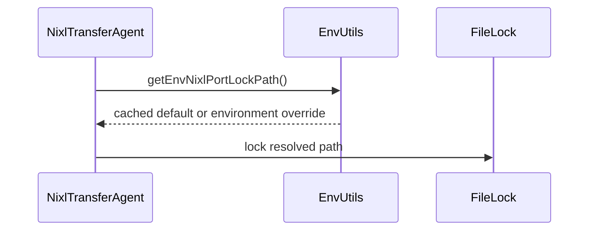

# [PR #15500] [None][fix] Make NIXL port-lock path configurable via TRTLLM_NIXL_PORT_LOCK_PATH

source: https://github.com/NVIDIA/TensorRT-LLM/pull/15500
state: open | updated: 2026-09-24T15:05:29Z
labels: Community want to contribute

## 正文

## Description

`NixlTransferAgent` hardcodes the port-selection file lock at `/tmp/trtllm_nixl_port.lock`. On a shared `/tmp` (multi-tenant hosts, colocated containers), independent deployments contend on the same lock, serializing the startup of otherwise-unrelated agents.

This adds `getEnvNixlPortLockPath()`, overridable via the `TRTLLM_NIXL_PORT_LOCK_PATH` env var and defaulting to the existing `/tmp/trtllm_nixl_port.lock` so **behavior is unchanged unless the var is set**. The lock still serializes port selection among agents that share the path, preserving the coordination it exists for — operators just scope it per deployment to avoid cross-tenant contention.

An env var (rather than a config field) keeps parity with the existing NIXL env helpers (`TRTLLM_NIXL_PORT`, `TRTLLM_NIXL_INTERFACE`, …) and is a deployment-time ops knob, not a model parameter.

Fixes #13950

## Changes
- `common/envUtils.{h,cpp}`: add `getEnvNixlPortLockPath()` (same `std::call_once` pattern as the other NIXL env helpers), with a pure `resolveNixlPortLockPath()` underneath for testability — mirrors `populateIterationIndexesImpl` in `cudaProfilerUtils`.
- `nixl_utils/transferAgent.cpp`: use it for the `FileLock` and the throw message (which now prints the resolved path).

## Test Coverage
- `cpp/tests/unit_tests/common/envUtilsTest.cpp` (new): `resolveNixlPortLockPath` returns the default on null and on set-but-empty, and the override verbatim when set.
- Default path preserved → no behavior change without the env var; no functional CUDA path altered.

## PR Checklist
- [x] Commits are DCO signed-off
- [x] Default behavior unchanged
- [x] Unit test added
- [x] clang-format (v16.0.0) clean

<!-- This is an auto-generated comment: release notes by coderabbit.ai -->
## Summary by CodeRabbit

* **New Features**
  * Added `TRTLLM_NIXL_PORT_LOCK_PATH` to configure the NIXL port lock file location (default remains `/tmp/trtllm_nixl_port.lock` when unset/empty), reducing contention when multiple independent processes share `/tmp`.

* **Code Changes**
  * Implemented `resolveNixlPortLockPath(char const* envValue)` and `getEnvNixlPortLockPath()` in `cpp/tensorrt_llm/common/envUtils.{h,cpp}` (cached via `std::once_flag`).
  * Updated `NixlTransferAgent` to use the resolved lock path for `FileLock` and the lock-acquisition failure message (`cpp/tensorrt_llm/executor/cache_transmission/nixl_utils/transferAgent.cpp`).

* **Tests**
  * Added `cpp/tests/unit_tests/common/envUtilsTest.cpp` covering default (`nullptr`), empty (`""`), and override env values.
  * Registered the new `envUtilsTest` target in `cpp/tests/unit_tests/common/CMakeLists.txt`.

* **Documentation**
  * Documented `TRTLLM_NIXL_PORT_LOCK_PATH` in `docs/source/features/disagg-serving.md`.

## Dev Engineer Review
* Correctness: Resolver preserves legacy behavior by defaulting to `/tmp/trtllm_nixl_port.lock` when the env var is unset or empty; non-empty values are used verbatim.
* Error handling: Lock failure now reports the selected `lockPath`, improving diagnostics for misconfiguration.
* Performance: Env resolution is cached with `std::once_flag` to avoid repeated `getenv` calls.
* API consistency/style: Added testable resolver helper and centralized the default path as a named constant; production uses the cached accessor.

## QA Engineer Review
* **Test changes**
  * Added/modified test functions in `cpp/tests/unit_tests/common/envUtilsTest.cpp`:
    * `resolveNixlPortLockPath` resolves `nullptr` to `/tmp/trtllm_nixl_port.lock`
    * `resolveNixlPortLockPath` resolves `""` to `/tmp/trtllm_nixl_port.lock`
    * `resolveNixlPortLockPath` returns the provided override path verbatim
  * Added `envUtilsTest` to `cpp/tests/unit_tests/common/CMakeLists.txt`.
* **Test list coverage mapping**
  * These are unit tests; no `tests/integration/test_lists/` (test-db/qa entries) changes were identified in the provided change set.
* **Verdict:** sufficient
<!-- end of auto-generated comment: release notes by coderabbit.ai -->

## 评论 (8)

### coderabbitai[bot] · 2026-06-19

<!-- This is an auto-generated comment: summarize by coderabbit.ai -->
<!-- review_stack_entry_start -->

[](https://app.coderabbit.ai/change-stack/NVIDIA/TensorRT-LLM/pull/15500?utm_source=github_walkthrough&utm_medium=github&utm_campaign=change_stack)

<!-- review_stack_entry_end -->
No actionable comments were generated in the recent review. 🎉

<details>
<summary>ℹ️ Recent review info</summary>

<details>
<summary>⚙️ Run configuration</summary>

**Configuration used**: Path: .coderabbit.yaml

**Review profile**: CHILL

**Plan**: Enterprise

**Run ID**: `f584ae82-f7c9-4d40-b118-d62a5af65745`

</details>

<details>
<summary>📥 Commits</summary>

Reviewing files that changed from the base of the PR and between bf4d402aaf196cf9622d178a34371aa56de4c279 and 2bf7e33f13143ef6f8c43bc9635c5edbdd907970.

</details>

<details>
<summary>📒 Files selected for processing (3)</summary>

* `cpp/tensorrt_llm/common/envUtils.cpp`
* `cpp/tensorrt_llm/common/envUtils.h`
* `cpp/tensorrt_llm/executor/cache_transmission/nixl_utils/transferAgent.cpp`

</details>

<details>
<summary>🚧 Files skipped from review as they are similar to previous changes (3)</summary>

* cpp/tensorrt_llm/common/envUtils.h
* cpp/tensorrt_llm/executor/cache_transmission/nixl_utils/transferAgent.cpp
* cpp/tensorrt_llm/common/envUtils.cpp

</details>

</details>

---
<!-- walkthrough_start -->

## Walkthrough

Adds environment-variable-based NIXL port lock-path resolution with a cached accessor and the existing default path. `NixlTransferAgent` uses the resolved path for listen-port locking, and unit tests cover fallback and override behavior.

### Changes

**Configurable NIXL Port Lock Path**

| Layer / File(s) | Summary |
|---|---|
| **Lock-path resolution and agent integration** <br> `cpp/tensorrt_llm/common/envUtils.h`, `cpp/tensorrt_llm/common/envUtils.cpp`, `cpp/tensorrt_llm/executor/cache_transmission/nixl_utils/transferAgent.cpp` | Adds public resolver and accessor helpers, caches `TRTLLM_NIXL_PORT_LOCK_PATH` resolution, and uses the resulting path for NIXL locking and error reporting. |
| **Resolver unit-test coverage** <br> `cpp/tests/unit_tests/common/CMakeLists.txt`, `cpp/tests/unit_tests/common/envUtilsTest.cpp` | Registers `envUtilsTest` and tests default fallback plus verbatim non-empty overrides. |

**Estimated code review effort:** 2 (Simple) | ~10 minutes

### Sequence Diagram(s)



**Suggested reviewers:** `reasonsolo`, `arysef`, `qijune`, `junyixu-nv`, `bo-nv`

<!-- walkthrough_end -->
<!-- pre_merge_checks_walkthrough_start -->

<details>
<summary>🚥 Pre-merge checks | ✅ 4 | ❌ 1</summary>

### ❌ Failed checks (1 warning)

|     Check name     | Status     | Explanation                                                                          | Resolution                                                                         |
| :----------------: | :--------- | :----------------------------------------------------------------------------------- | :--------------------------------------------------------------------------------- |
| Docstring Coverage | ⚠️ Warning | Docstring coverage is 0.00% which is insufficient. The required threshold is 80.00%. | Write docstrings for the functions missing them to satisfy the coverage threshold. |

<details>
<summary>✅ Passed checks (4 passed)</summary>

|         Check name         | Status   | Explanation                                                                                                               |
| :------------------------: | :------- | :------------------------------------------------------------------------------------------------------------------------ |
|         Title check        | ✅ Passed | The title is specific, concise, and matches the main change: making the NIXL port-lock path configurable.                 |
|      Description check     | ✅ Passed | The description follows the template and includes the problem, solution, tests, and checklist items.                      |
|     Linked Issues check    | ✅ Passed | The code implements the requested env-based lock-path override while preserving the default behavior and adding coverage. |
| Out of Scope Changes check | ✅ Passed | The changes stay focused on the NIXL lock-path override, related helpers, and tests without unrelated scope creep.        |

</details>

</details>

<!-- pre_merge_checks_walkthrough_end -->
<!-- finishing_touch_checkbox_start -->

<details>
<summary>✨ Finishing Touches</summary>

<details>
<summary>🧪 Generate unit tests (beta)</summary>

- [ ] <!-- {"checkboxId": "f47ac10b-58cc-4372-a567-0e02b2c3d479", "radioGroupId": "utg-output-choice-group-unknown_comment_id"} -->   Create PR with unit tests

</details>

</details>

<!-- finishing_touch_checkbox_end -->
<!-- tips_start -->

---


<sub>Comment `@coderabbitai help` to get the list of available commands.</sub>

<!-- tips_end -->

### CodersAcademy006 · 2026-06-19

Thanks for the review. Addressed in 8b12101:

**Nitpicks (both applied):**
- `envUtils.cpp` — extracted the default into `kDefaultNixlPortLockPath` (anonymous namespace, k-prefixed per the coding guideline) and reference it from `resolveNixlPortLockPath`.
- `envUtilsTest.cpp` — replaced the inline literals with named `kDefaultNixlPortLockPath` / `kOverrideNixlPortLockPath` constants in the assertions.

**Docstring Coverage check (warning):** holding on this one. The 0% is the file-wide baseline — none of the existing `envUtils` helpers (`getEnvNixlPort`, `getEnvNixlInterface`, `getEnvNixlBackend`, etc.) carry docstrings, so adding Doxygen to only the two new functions would break local consistency. The new declarations already have explanatory header comments describing the env var, default, and rationale — more than the surrounding helpers. Happy to add formal docstrings if maintainers want them, but didn't want to introduce a one-off convention.

For context on the design: the `FileLock` ctor takes `std::string const&`, so passing the resolved `std::string` binds directly (no `.c_str()` needed), and the default path is now defined in a single place. `clang-format` (v16.0.0, matching the pinned pre-commit rev) is clean across all changed files.

### CodersAcademy006 · 2026-06-30

@reasonsolo Documented `TRTLLM_NIXL_PORT_LOCK_PATH` in docs/source/features/disagg-serving.md as requested; ready for another look.

### CodersAcademy006 · 2026-07-27

Rebased onto current main (was behind and had drifted into a merge-conflict state). Diff is unchanged in substance, still the 4 commits: env-var resolver, unit test, named-constant refactor, and the disagg-serving doc note. Clean against main now (`mergeable: true`), just needs CI.

@reasonsolo could you or another maintainer kick off `/bot run` when you get a chance?

### CodersAcademy006 · 2026-07-28

Still green and mergeable on main as of the last rebase — just needs `/bot run` whenever someone has a moment. Happy to rebase again if it's drifted further.

### BowenFu · 2026-08-02

Reviewed. The change itself is sound and I could not find a regression path:

- `resolveNixlPortLockPath(nullptr)` and `("")` both return the same `/tmp/trtllm_nixl_port.lock` the call site had hardcoded, so an unset `TRTLLM_NIXL_PORT_LOCK_PATH` is byte-identical to today.
- `FileLock` already takes `std::string const&` (`transferAgent.cpp:56`), so passing the resolved string is a no-op at the call site.
- `std::call_once` + function-local static matches the convention of the neighbouring `getEnvNixlInterface()`/`getEnvNixlPort()` helpers, and the pure-resolver split keeps the env read out of the unit test.
- Splitting the lock per deployment doesn't weaken the invariant the lock exists for: it still serializes port selection among every agent that shares a path, and agents that don't share a path were never at risk of picking the same port for each other's benefit anyway.

The one thing holding this up is not the code — **blossom-ci has never run on this PR.** The green checkmark is only `DCO` / `Pre-commit` / title / base-freshness; none of them compile C++, so the new `envUtilsTest` target and the `transferAgent.cpp` edit have no build evidence. That is what your `/bot run` requests since 07-27 have been asking for.

Heads-up on why they went nowhere: the Blossom pipeline is currently frozen for maintenance — other PRs this week got `Pipeline is freezed and top-1 instance is under maintenance` back from `/bot run`. Worth waiting for that to clear rather than burning more attempts.


### CodersAcademy006 · 2026-08-02

Thanks for the careful read, @BowenFu, and especially for tracing the regression paths explicitly rather than taking the description at face value. Your reading matches mine on every point, including that the green checks here are DCO / pre-commit / title / base-freshness and none of them compile the new `envUtilsTest` target.

Good to know the Blossom pipeline is frozen for maintenance; I will stop retrying `/bot run` and wait for it to clear. Ping me whenever it is back and I will rebase first if main has drifted.

### CodersAcademy006 · 2026-09-24

@mikeiovine thanks for the read. `std::tmpnam` would break the lock rather than simplify it: it hands back a fresh, unique, not-yet-existing path on every call, so two colocated agents on the same host would each lock a file of their own, neither would ever contend, and the listen-port race this `FileLock` exists to serialise would be back. A cross-process advisory lock only serialises when every participant opens the same path, so determinism is the property that matters here and per-call uniqueness actively defeats it. `std::tmpnam` is also the TOCTOU-unsafe one that both glibc and MSVC warn on at link time.

The problem the variable solves is the opposite direction. The path today is hardcoded to `/tmp/trtllm_nixl_port.lock`, which is deterministic but process-global, so unrelated deployments sharing a `/tmp` serialise against each other for no reason, and one tenant's stale or wrong-owner lock file blocks every other instance on the node. `TRTLLM_NIXL_PORT_LOCK_PATH` lets an operator move it somewhere still shared inside one deployment but private to it, for example `/run/deployA/nixl_port.lock`, and the default is byte-for-byte the old behaviour. If you would rather not grow the env-var surface, I am happy to derive the path from something already carried in `BaseAgentConfig` so it is automatic instead, just say which you prefer and I will push that.


## Review (4)

### coderabbitai[bot] · 2026-06-19 · COMMENTED


<details>
<summary>🧹 Nitpick comments (2)</summary><blockquote>

<details>
<summary>cpp/tensorrt_llm/common/envUtils.cpp (1)</summary><blockquote>

`312-314`: _⚡ Quick win_

**Extract the default lock path into a named constant.**

Line 314 embeds the default path literal directly; please move it to a `k`-prefixed constant and reuse it in the resolver.

<details>
<summary>Proposed change</summary>

```diff
+namespace
+{
+char const* const kDefaultNixlPortLockPath = "/tmp/trtllm_nixl_port.lock";
+} // namespace
+
 std::string resolveNixlPortLockPath(char const* envValue)
 {
-    return (envValue && *envValue) ? std::string(envValue) : std::string("/tmp/trtllm_nixl_port.lock");
+    return (envValue && *envValue) ? std::string(envValue) : std::string(kDefaultNixlPortLockPath);
 }
```
</details>

As per coding guidelines, non-exempt literals should be extracted into named constants, and constants should use `k`-prefixed camelCase names.

<details>
<summary>🤖 Prompt for AI Agents</summary>

```
Verify each finding against current code. Fix only still-valid issues, skip the
rest with a brief reason, keep changes minimal, and validate.

In `@cpp/tensorrt_llm/common/envUtils.cpp` around lines 312 - 314, The function
`resolveNixlPortLockPath` contains a hardcoded string literal
"/tmp/trtllm_nixl_port.lock" in its return statement on line 314. Extract this
literal into a module-level constant using the k-prefix naming convention (e.g.,
kDefaultNixlPortLockPath or similar) and replace the embedded string in the
function with a reference to this constant. Ensure the constant is defined
before the function and follows the k-prefixed camelCase naming pattern as per
coding guidelines.
```

</details>

<!-- cr-comment:v1:1756efcf47b7db72d92ca738 -->

_Source: Coding guidelines_

</blockquote></details>
<details>
<summary>cpp/tests/unit_tests/common/envUtilsTest.cpp (1)</summary><blockquote>

`26-27`: _⚡ Quick win_

**Use named constants for expected lock paths in assertions.**

Please initialize the expected paths as `k`-prefixed constants and reference them in `EXPECT_EQ` calls instead of inline literals.

<details>
<summary>Proposed change</summary>

```diff
 TEST(EnvUtils, ResolveNixlPortLockPathDefault)
 {
+    std::string const kDefaultNixlPortLockPath = "/tmp/trtllm_nixl_port.lock";
     // Unset (nullptr) and set-but-empty both fall back to the default path.
-    EXPECT_EQ(tc::resolveNixlPortLockPath(nullptr), "/tmp/trtllm_nixl_port.lock");
-    EXPECT_EQ(tc::resolveNixlPortLockPath(""), "/tmp/trtllm_nixl_port.lock");
+    EXPECT_EQ(tc::resolveNixlPortLockPath(nullptr), kDefaultNixlPortLockPath);
+    EXPECT_EQ(tc::resolveNixlPortLockPath(""), kDefaultNixlPortLockPath);
 }
 
 TEST(EnvUtils, ResolveNixlPortLockPathOverride)
 {
+    std::string const kOverrideNixlPortLockPath = "/run/deployA/nixl_port.lock";
     // A non-empty value is used verbatim.
-    EXPECT_EQ(tc::resolveNixlPortLockPath("/run/deployA/nixl_port.lock"), "/run/deployA/nixl_port.lock");
+    EXPECT_EQ(tc::resolveNixlPortLockPath(kOverrideNixlPortLockPath.c_str()), kOverrideNixlPortLockPath);
 }
```
</details>

As per coding guidelines, non-exempt literals should be extracted into named constants, and constants should use `k`-prefixed camelCase names.


Also applies to: 33-33

<details>
<summary>🤖 Prompt for AI Agents</summary>

```
Verify each finding against current code. Fix only still-valid issues, skip the
rest with a brief reason, keep changes minimal, and validate.

In `@cpp/tests/unit_tests/common/envUtilsTest.cpp` around lines 26 - 27, The test
file contains hardcoded string literals "/tmp/trtllm_nixl_port.lock" repeated in
multiple EXPECT_EQ assertions when testing the resolveNixlPortLockPath function.
Extract this literal into a k-prefixed named constant (e.g.,
kExpectedNixlPortLockPath) at the top of the test file or test class, then
replace all inline string literals in the EXPECT_EQ calls with references to
this constant to follow the coding guidelines for non-exempt literals.
```

</details>

<!-- cr-comment:v1:9ef7407135f222a5816b9a30 -->

_Source: Coding guidelines_

</blockquote></details>

</blockquote></details>

<details>
<summary>🤖 Prompt for all review comments with AI agents</summary>

```
Verify each finding against current code. Fix only still-valid issues, skip the
rest with a brief reason, keep changes minimal, and validate.

Nitpick comments:
In `@cpp/tensorrt_llm/common/envUtils.cpp`:
- Around line 312-314: The function `resolveNixlPortLockPath` contains a
hardcoded string literal "/tmp/trtllm_nixl_port.lock" in its return statement on
line 314. Extract this literal into a module-level constant using the k-prefix
naming convention (e.g., kDefaultNixlPortLockPath or similar) and replace the
embedded string in the function with a reference to this constant. Ensure the
constant is defined before the function and follows the k-prefixed camelCase
naming pattern as per coding guidelines.

In `@cpp/tests/unit_tests/common/envUtilsTest.cpp`:
- Around line 26-27: The test file contains hardcoded string literals
"/tmp/trtllm_nixl_port.lock" repeated in multiple EXPECT_EQ assertions when
testing the resolveNixlPortLockPath function. Extract this literal into a
k-prefixed named constant (e.g., kExpectedNixlPortLockPath) at the top of the
test file or test class, then replace all inline string literals in the
EXPECT_EQ calls with references to this constant to follow the coding guidelines
for non-exempt literals.
```

</details>

---

<details>
<summary>ℹ️ Review info</summary>

<details>
<summary>⚙️ Run configuration</summary>

**Configuration used**: Path: .coderabbit.yaml

**Review profile**: CHILL

**Plan**: Enterprise

**Run ID**: `194b5dc1-2adf-49eb-9a53-d556445c291a`

</details>

<details>
<summary>📥 Commits</summary>

Reviewing files that changed from the base of the PR and between a76c818cd96b0c91966a1b80b7663e0b994704da and bf4d402aaf196cf9622d178a34371aa56de4c279.

</details>

<details>
<summary>📒 Files selected for processing (5)</summary>

* `cpp/tensorrt_llm/common/envUtils.cpp`
* `cpp/tensorrt_llm/common/envUtils.h`
* `cpp/tensorrt_llm/executor/cache_transmission/nixl_utils/transferAgent.cpp`
* `cpp/tests/unit_tests/common/CMakeLists.txt`
* `cpp/tests/unit_tests/common/envUtilsTest.cpp`

</details>

</details>

<!-- This is an auto-generated comment by CodeRabbit for review status -->

### reasonsolo · 2026-06-29 · COMMENTED

The code looks good to me, but could you document the new env var in `docs/source/features/disagg-serving.md`? Thanks!

### reasonsolo · 2026-07-01 · APPROVED

(no text)

### mikeiovine · 2026-09-01 · COMMENTED

(no text)
