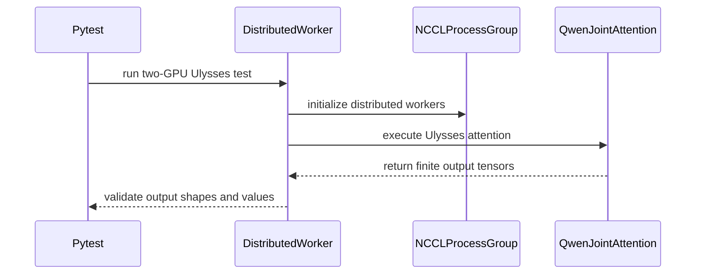

# [PR #17147] [None][feat] Qwen Image Ulysses perf enhancement

source: https://github.com/NVIDIA/TensorRT-LLM/pull/17147
state: open | updated: 2026-09-23T01:46:47Z
labels: VisualGen, ci: full pre-merge approved

## 正文

## Summary

This PR improves Qwen Image Ulysses execution and documents Qwen-Image-Edit-2511 Ulysses support.

- Adds a BF16 fused post-Ulysses post-unscatter custom op for Q/K/V layout conversion after all-to-all.
- Uses the fused op only for multi-rank Ulysses (`U > 1`); `U = 1` stays on the original local path.
- Adds a 2-GPU Qwen-Image-Edit-2511 FP8 Ulysses example config with `VANILLA` attention, because padded text/image streams require key-padding-mask support.
- Keeps masked prompt handling in the transformer path: the sharder pads/gathers a joint key-padding mask, `VANILLA` Ulysses consumes it, and non-mask-capable sequence-parallel backends raise from the transformer layer.
- Restores the Qwen-Image-Edit-2511 `trtllm-serve` support matrix entries from #16987 while enabling Ulysses support.
- Adds direct packed-op tests, safer distributed-test setup, and Qwen Image Edit multi-GPU attention coverage.

## Implementation Notes

Qwen Image Ulysses gathers sequence shards and shards heads before attention. The previous path converted post-all-to-all tensors back to backend layout through eager PyTorch layout operations for Q, K, and V. The new native op fuses that post-unscatter layout conversion and removes launch/layout overhead on the multi-rank Ulysses path.

Runtime behavior:

- `U > 1`: BF16 Ulysses attention uses the fused post-unscatter op when Q/K/V are same-shaped BF16 CUDA tensors and the kernel shape constraints are satisfied.
- `U = 1`: the fused op is not used, because there is no multi-rank all-to-all/post-unscatter work.
- Unsupported packed-op shapes/devices fall back to the existing unfused Ulysses path.

## Validation

Tests/coverage added or updated:

- `tests/unittest/_torch/thop/parallel_hw_agnostic/test_ulysses_post_unscatter.py`
  - exact HND/NHD tests for `ulysses_packed_qkv_post_unscatter`
  - invalid layout, invalid packed QKV dim, `D % 8`, and oversized-block rejection tests
- `tests/unittest/_torch/visual_gen/multi_gpu/test_qwen_image_edit_ulysses.py`
  - 2-GPU Ulysses attention parity against a single-rank reference
  - masked prompt/key-padding-mask coverage
  - clean GPU skip, `gpu2` mark, distributed barrier, and MPI-env restoration
- `tests/integration/test_lists/test-db/l0_dgx_b200.yml`
  - registers the Qwen Image Edit multi-GPU VisualGen unit test

Manual image-quality check:

BF16 Qwen Image U=2

Prompt:

```text
A serene mountain lake at sunrise, watercolor style, highly detailed
```

LPIPS score: 0

| new op | baseline |
|---|---|
|  |  |

## Performance Notes

Manual B200 runs with the Python VisualGen scripts showed the fused post-unscatter op helps the multi-rank Ulysses path. The final branch gates the op to `U > 1`; `U = 1` is intentionally baseline-only.

### BF16

| Ulysses | baseline ms/step | new op ms/step | perf speedup | baseline denoise (s) | new op denoise (s) |
|---:|---:|---:|---:|---:|---:|
| 2 | 231.26 | 229.90 | 0.59% reduction | 11.56 | 11.49 |
| 4 | 163.88 | 161.38 | 1.53% reduction | 8.19 | 8.06 |
| 8 | 124.06 | 118.18 | 4.74% reduction | 6.20 | 5.90 |

## PR Checklist

- [x] PR description clearly explains what and why.
- [x] Test cases are provided for new code paths.
- [x] Documentation updated as needed.
- [x] No public API change is introduced.


## 评论 (151)

### coderabbitai[bot] · 2026-08-03

<!-- This is an auto-generated comment: summarize by coderabbit.ai -->
<!-- review_stack_entry_start -->

[](https://app.coderabbit.ai/change-stack/NVIDIA/TensorRT-LLM/pull/17147?utm_source=github_walkthrough&utm_medium=github&utm_campaign=change_stack)

<!-- review_stack_entry_end -->
<!-- This is an auto-generated comment: review paused by coderabbit.ai -->

> [!NOTE]
```bash
> ## Reviews paused
> 
> It looks like this branch is under active development. To avoid overwhelming you with review comments due to an influx of new commits, CodeRabbit has automatically paused this review. You can configure this behavior by changing the `reviews.auto_review.auto_pause_after_reviewed_commits` setting.
> 
> Use the following commands to manage reviews:
> - `@coderabbitai resume` to resume automatic reviews.
> - `@coderabbitai review` to trigger a single review.
> 
> Use the checkboxes below for quick actions:
> - [ ] <!-- {"checkboxId": "7f6cc2e2-2e4e-497a-8c31-c9e4573e93d1"} --> ▶️ Resume reviews
> - [ ] <!-- {"checkboxId": "e9bb8d72-00e8-4f67-9cb2-caf3b22574fe"} --> 🔍 Trigger review
```

<!-- end of auto-generated comment: review paused by coderabbit.ai -->
<!-- walkthrough_start -->

## Walkthrough

Qwen-Image-Edit-2511 now has a 2-GPU Ulysses configuration, updated support declarations, revised prompt encoding, and distributed attention tests. The B200 test list includes the pipeline configuration test.

### Changes

**Qwen Image Edit Ulysses Support**

|Layer / File(s)|Summary|
|---|---|
|**Ulysses configuration and capability declarations** <br> `examples/visual_gen/configs/*`, `docs/source/models/*`|Adds FP8, 2-way Ulysses configuration and marks Qwen-Image-Edit-2511 as supported.|
|**Prompt encoding path** <br> `tensorrt_llm/_torch/visual_gen/models/qwen_image/pipeline_qwen_image.py`|Removes Ulysses prompt-mask validation from the forward path.|
|**Distributed Ulysses validation** <br> `tests/unittest/_torch/visual_gen/multi_gpu/test_qwen_image_edit_ulysses.py`, `tests/integration/test_lists/test-db/l0_b200.yml`|Adds NCCL-based two-GPU attention validation and includes the pipeline configuration test in B200 coverage.|

**Estimated code review effort:** 3 (Moderate) | ~20 minutes

### Sequence Diagram(s)



**Suggested reviewers:** `bowenfu`

<!-- walkthrough_end -->
<!-- pre_merge_checks_walkthrough_start -->

<details>
<summary>🚥 Pre-merge checks | ✅ 3 | ❌ 2</summary>

### ❌ Failed checks (2 warnings)

|     Check name     | Status     | Explanation                                                                                                                | Resolution                                                                                                                   |
| :----------------: | :--------- | :------------------------------------------------------------------------------------------------------------------------- | :--------------------------------------------------------------------------------------------------------------------------- |
| Docstring Coverage | ⚠️ Warning | Docstring coverage is 33.33% which is insufficient. The required threshold is 80.00%.                                      | Write docstrings for the functions missing them to satisfy the coverage threshold.                                           |
|  Description check | ⚠️ Warning | The description includes the template but provides no issue summary, implementation details, or test coverage information. | Add a concise description of the problem and solution, list the relevant tests, and complete the applicable checklist items. |

<details>
<summary>✅ Passed checks (3 passed)</summary>

|         Check name         | Status   | Explanation                                                                                                      |
| :------------------------: | :------- | :--------------------------------------------------------------------------------------------------------------- |
|     Linked Issues check    | ✅ Passed | Check skipped because no linked issues were found for this pull request.                                         |
| Out of Scope Changes check | ✅ Passed | Check skipped because no linked issues were found for this pull request.                                         |
|         Title check        | ✅ Passed | The title follows the required format and clearly identifies Qwen Image Edit Ulysses support as the main change. |

</details>

</details>

<!-- pre_merge_checks_walkthrough_end -->
<!-- finishing_touch_checkbox_start -->

<details>
<summary>✨ Finishing Touches</summary>

<details>
<summary>🧪 Generate unit tests (beta)</summary>

- [ ] <!-- {"checkboxId": "f47ac10b-58cc-4372-a567-0e02b2c3d479", "radioGroupId": "utg-output-choice-group-5199954435"} -->   Create PR with unit tests

</details>

</details>

<!-- finishing_touch_checkbox_end -->
<!-- tips_start -->

---


<sub>Comment `@coderabbitai help` to get the list of available commands.</sub>

<!-- tips_end -->

### yibinl-nvidia · 2026-08-04

/bot run

### tensorrt-cicd · 2026-08-04

[PR_Github #63650](https://nv/trt-llm-cicd/job/helpers/job/PR_Github/63650/) [ run ] triggered by Bot. Commit: `4ce7034` [Link to invocation](https://github.com/NVIDIA/TensorRT-LLM/pull/17147#issuecomment-5174432673)

### tensorrt-cicd · 2026-08-04

[PR_Github #63650](https://nv/trt-llm-cicd/job/helpers/job/PR_Github/63650/) [ run ] completed with state `FAILURE`. Commit: `4ce7034` 
[/LLM/main/L0_MergeRequest_PR pipeline #51604](https://nv/trt-llm-cicd/job/main/job/L0_MergeRequest_PR/51604/) completed with status: 'FAILURE'

[CI Report](http://tensorrt-llm.tensorrt-llm-ci-report.sc2-paas.nvidia.com/?job=%2FLLM%2Fmain%2FL0_MergeRequest_PR&build=51604)

⚠️ **Action Required:**
- Please check the failed tests and fix your PR
- If you cannot view the failures, ask the CI triggerer to share details
- Once fixed, request an NVIDIA team member to trigger CI again

[CI Agent Failure Analysis](https://pbss.s8k.io/v1/AUTH_svc_tensorrt/sw-tensorrt-ci-analysis/LLM/main/L0_MergeRequest_PR/51604/failure_analysis.html)


[Link to invocation](https://github.com/NVIDIA/TensorRT-LLM/pull/17147#issuecomment-5174432673)

### yibinl-nvidia · 2026-08-04

/bot run

### tensorrt-cicd · 2026-08-04

[PR_Github #63671](https://nv/trt-llm-cicd/job/helpers/job/PR_Github/63671/) [ run ] triggered by Bot. Commit: `4ce7034` [Link to invocation](https://github.com/NVIDIA/TensorRT-LLM/pull/17147#issuecomment-5174804396)

### tensorrt-cicd · 2026-08-04

[PR_Github #63671](https://nv/trt-llm-cicd/job/helpers/job/PR_Github/63671/) [ run ] completed with state `SUCCESS`. Commit: `4ce7034` 
[/LLM/main/L0_MergeRequest_PR pipeline #51622](https://nv/trt-llm-cicd/job/main/job/L0_MergeRequest_PR/51622/) completed with status: 'SUCCESS'

[CI Report](http://tensorrt-llm.tensorrt-llm-ci-report.sc2-paas.nvidia.com/?job=%2FLLM%2Fmain%2FL0_MergeRequest_PR&build=51622)


[Link to invocation](https://github.com/NVIDIA/TensorRT-LLM/pull/17147#issuecomment-5174804396)

### yibinl-nvidia · 2026-08-04

/bot run

### tensorrt-cicd · 2026-08-04

[PR_Github #63845](https://nv/trt-llm-cicd/job/helpers/job/PR_Github/63845/) [ run ] triggered by Bot. Commit: `6346b13` [Link to invocation](https://github.com/NVIDIA/TensorRT-LLM/pull/17147#issuecomment-5185102595)

### tensorrt-cicd · 2026-08-04

[PR_Github #63845](https://nv/trt-llm-cicd/job/helpers/job/PR_Github/63845/) [ run ] completed with state `FAILURE`. Commit: `6346b13` 
[/LLM/main/L0_MergeRequest_PR pipeline #51785](https://nv/trt-llm-cicd/job/main/job/L0_MergeRequest_PR/51785/) completed with status: 'FAILURE'

[CI Report](http://tensorrt-llm.tensorrt-llm-ci-report.sc2-paas.nvidia.com/?job=%2FLLM%2Fmain%2FL0_MergeRequest_PR&build=51785)

⚠️ **Action Required:**
- Please check the failed tests and fix your PR
- If you cannot view the failures, ask the CI triggerer to share details
- Once fixed, request an NVIDIA team member to trigger CI again

[CI Agent Failure Analysis](https://pbss.s8k.io/v1/AUTH_svc_tensorrt/sw-tensorrt-ci-analysis/LLM/main/L0_MergeRequest_PR/51785/failure_analysis.html)


[Link to invocation](https://github.com/NVIDIA/TensorRT-LLM/pull/17147#issuecomment-5185102595)

### yibinl-nvidia · 2026-08-06

@coderabbitai summary

### coderabbitai[bot] · 2026-08-06

<!-- This is an auto-generated reply by CodeRabbit -->
<details>
<summary>✅ Action performed</summary>

Summary regeneration triggered.

</details>

### yibinl-nvidia · 2026-08-06

/bot run

### tensorrt-cicd · 2026-08-06

[PR_Github #64197](https://nv/trt-llm-cicd/job/helpers/job/PR_Github/64197/) [ run ] triggered by Bot. Commit: `8933e0b` [Link to invocation](https://github.com/NVIDIA/TensorRT-LLM/pull/17147#issuecomment-5199991996)

### tensorrt-cicd · 2026-08-06

[PR_Github #64197](https://nv/trt-llm-cicd/job/helpers/job/PR_Github/64197/) [ run ] completed with state `FAILURE`. Commit: `8933e0b` 
[/LLM/main/L0_MergeRequest_PR pipeline #52112](https://nv/trt-llm-cicd/job/main/job/L0_MergeRequest_PR/52112/) completed with status: 'FAILURE'

[CI Report](http://tensorrt-llm.tensorrt-llm-ci-report.sc2-paas.nvidia.com/?job=%2FLLM%2Fmain%2FL0_MergeRequest_PR&build=52112)

⚠️ **Action Required:**
- Please check the failed tests and fix your PR
- If you cannot view the failures, ask the CI triggerer to share details
- Once fixed, request an NVIDIA team member to trigger CI again

[CI Agent Failure Analysis](https://pbss.s8k.io/v1/AUTH_svc_tensorrt/sw-tensorrt-ci-analysis/LLM/main/L0_MergeRequest_PR/52112/failure_analysis.html)


[Link to invocation](https://github.com/NVIDIA/TensorRT-LLM/pull/17147#issuecomment-5199991996)

### yibinl-nvidia · 2026-08-06

/bot run

### tensorrt-cicd · 2026-08-06

[PR_Github #64232](https://nv/trt-llm-cicd/job/helpers/job/PR_Github/64232/) [ run ] triggered by Bot. Commit: `8933e0b` [Link to invocation](https://github.com/NVIDIA/TensorRT-LLM/pull/17147#issuecomment-5200720766)

### tensorrt-cicd · 2026-08-06

[PR_Github #64232](https://nv/trt-llm-cicd/job/helpers/job/PR_Github/64232/) [ run ] completed with state `FAILURE`. Commit: `8933e0b` 
[/LLM/main/L0_MergeRequest_PR pipeline #52139](https://nv/trt-llm-cicd/job/main/job/L0_MergeRequest_PR/52139/) completed with status: 'FAILURE'

[CI Report](http://tensorrt-llm.tensorrt-llm-ci-report.sc2-paas.nvidia.com/?job=%2FLLM%2Fmain%2FL0_MergeRequest_PR&build=52139)

⚠️ **Action Required:**
- Please check the failed tests and fix your PR
- If you cannot view the failures, ask the CI triggerer to share details
- Once fixed, request an NVIDIA team member to trigger CI again

[CI Agent Failure Analysis](https://pbss.s8k.io/v1/AUTH_svc_tensorrt/sw-tensorrt-ci-analysis/LLM/main/L0_MergeRequest_PR/52139/failure_analysis.html)


[Link to invocation](https://github.com/NVIDIA/TensorRT-LLM/pull/17147#issuecomment-5200720766)

### yibinl-nvidia · 2026-08-06

/bot run

### tensorrt-cicd · 2026-08-06

[PR_Github #64249](https://nv/trt-llm-cicd/job/helpers/job/PR_Github/64249/) [ run ] triggered by Bot. Commit: `8933e0b` [Link to invocation](https://github.com/NVIDIA/TensorRT-LLM/pull/17147#issuecomment-5201186371)

### tensorrt-cicd · 2026-08-06

[PR_Github #64249](https://nv/trt-llm-cicd/job/helpers/job/PR_Github/64249/) [ run ] completed with state `FAILURE`. Commit: `8933e0b` 
[/LLM/main/L0_MergeRequest_PR pipeline #52154](https://nv/trt-llm-cicd/job/main/job/L0_MergeRequest_PR/52154/) completed with status: 'FAILURE'

[CI Report](http://tensorrt-llm.tensorrt-llm-ci-report.sc2-paas.nvidia.com/?job=%2FLLM%2Fmain%2FL0_MergeRequest_PR&build=52154)

⚠️ **Action Required:**
- Please check the failed tests and fix your PR
- If you cannot view the failures, ask the CI triggerer to share details
- Once fixed, request an NVIDIA team member to trigger CI again

[CI Agent Failure Analysis](https://pbss.s8k.io/v1/AUTH_svc_tensorrt/sw-tensorrt-ci-analysis/LLM/main/L0_MergeRequest_PR/52154/failure_analysis.html)


[Link to invocation](https://github.com/NVIDIA/TensorRT-LLM/pull/17147#issuecomment-5201186371)

### yibinl-nvidia · 2026-08-06

/bot run

### tensorrt-cicd · 2026-08-06

[PR_Github #64259](https://nv/trt-llm-cicd/job/helpers/job/PR_Github/64259/) [ run ] triggered by Bot. Commit: `8933e0b` [Link to invocation](https://github.com/NVIDIA/TensorRT-LLM/pull/17147#issuecomment-5201510732)

### tensorrt-cicd · 2026-08-06

[PR_Github #64259](https://nv/trt-llm-cicd/job/helpers/job/PR_Github/64259/) [ run ] completed with state `FAILURE`. Commit: `8933e0b` 
[/LLM/main/L0_MergeRequest_PR pipeline #52164](https://nv/trt-llm-cicd/job/main/job/L0_MergeRequest_PR/52164/) completed with status: 'FAILURE'

[CI Report](http://tensorrt-llm.tensorrt-llm-ci-report.sc2-paas.nvidia.com/?job=%2FLLM%2Fmain%2FL0_MergeRequest_PR&build=52164)

⚠️ **Action Required:**
- Please check the failed tests and fix your PR
- If you cannot view the failures, ask the CI triggerer to share details
- Once fixed, request an NVIDIA team member to trigger CI again

[CI Agent Failure Analysis](https://pbss.s8k.io/v1/AUTH_svc_tensorrt/sw-tensorrt-ci-analysis/LLM/main/L0_MergeRequest_PR/52164/failure_analysis.html)


[Link to invocation](https://github.com/NVIDIA/TensorRT-LLM/pull/17147#issuecomment-5201510732)

### yibinl-nvidia · 2026-08-06

/bot run

### tensorrt-cicd · 2026-08-06

[PR_Github #64273](https://nv/trt-llm-cicd/job/helpers/job/PR_Github/64273/) [ run ] triggered by Bot. Commit: `8933e0b` [Link to invocation](https://github.com/NVIDIA/TensorRT-LLM/pull/17147#issuecomment-5201960508)

### tensorrt-cicd · 2026-08-06

[PR_Github #64273](https://nv/trt-llm-cicd/job/helpers/job/PR_Github/64273/) [ run ] completed with state `FAILURE`. Commit: `8933e0b` 
[/LLM/main/L0_MergeRequest_PR pipeline #52175](https://nv/trt-llm-cicd/job/main/job/L0_MergeRequest_PR/52175/) completed with status: 'FAILURE'

[CI Report](http://tensorrt-llm.tensorrt-llm-ci-report.sc2-paas.nvidia.com/?job=%2FLLM%2Fmain%2FL0_MergeRequest_PR&build=52175)

⚠️ **Action Required:**
- Please check the failed tests and fix your PR
- If you cannot view the failures, ask the CI triggerer to share details
- Once fixed, request an NVIDIA team member to trigger CI again

[CI Agent Failure Analysis](https://pbss.s8k.io/v1/AUTH_svc_tensorrt/sw-tensorrt-ci-analysis/LLM/main/L0_MergeRequest_PR/52175/failure_analysis.html)


[Link to invocation](https://github.com/NVIDIA/TensorRT-LLM/pull/17147#issuecomment-5201960508)

### yibinl-nvidia · 2026-08-06

/bot run

### tensorrt-cicd · 2026-08-06

[PR_Github #64282](https://nv/trt-llm-cicd/job/helpers/job/PR_Github/64282/) [ run ] triggered by Bot. Commit: `8933e0b` [Link to invocation](https://github.com/NVIDIA/TensorRT-LLM/pull/17147#issuecomment-5202405644)

### tensorrt-cicd · 2026-08-06

[PR_Github #64282](https://nv/trt-llm-cicd/job/helpers/job/PR_Github/64282/) [ run ] completed with state `FAILURE`. Commit: `8933e0b` 
[/LLM/main/L0_MergeRequest_PR pipeline #52183](https://nv/trt-llm-cicd/job/main/job/L0_MergeRequest_PR/52183/) completed with status: 'FAILURE'

[CI Report](http://tensorrt-llm.tensorrt-llm-ci-report.sc2-paas.nvidia.com/?job=%2FLLM%2Fmain%2FL0_MergeRequest_PR&build=52183)

⚠️ **Action Required:**
- Please check the failed tests and fix your PR
- If you cannot view the failures, ask the CI triggerer to share details
- Once fixed, request an NVIDIA team member to trigger CI again

[CI Agent Failure Analysis](https://pbss.s8k.io/v1/AUTH_svc_tensorrt/sw-tensorrt-ci-analysis/LLM/main/L0_MergeRequest_PR/52183/failure_analysis.html)


[Link to invocation](https://github.com/NVIDIA/TensorRT-LLM/pull/17147#issuecomment-5202405644)

### yibinl-nvidia · 2026-08-06

/bot run

### tensorrt-cicd · 2026-08-06

[PR_Github #64305](https://nv/trt-llm-cicd/job/helpers/job/PR_Github/64305/) [ run ] triggered by Bot. Commit: `8933e0b` [Link to invocation](https://github.com/NVIDIA/TensorRT-LLM/pull/17147#issuecomment-5203368961)

### tensorrt-cicd · 2026-08-06

[PR_Github #64305](https://nv/trt-llm-cicd/job/helpers/job/PR_Github/64305/) [ run ] completed with state `FAILURE`. Commit: `8933e0b` 
[/LLM/main/L0_MergeRequest_PR pipeline #52203](https://nv/trt-llm-cicd/job/main/job/L0_MergeRequest_PR/52203/) completed with status: 'FAILURE'

[CI Report](http://tensorrt-llm.tensorrt-llm-ci-report.sc2-paas.nvidia.com/?job=%2FLLM%2Fmain%2FL0_MergeRequest_PR&build=52203)

⚠️ **Action Required:**
- Please check the failed tests and fix your PR
- If you cannot view the failures, ask the CI triggerer to share details
- Once fixed, request an NVIDIA team member to trigger CI again

[CI Agent Failure Analysis](https://pbss.s8k.io/v1/AUTH_svc_tensorrt/sw-tensorrt-ci-analysis/LLM/main/L0_MergeRequest_PR/52203/failure_analysis.html)


[Link to invocation](https://github.com/NVIDIA/TensorRT-LLM/pull/17147#issuecomment-5203368961)

### yibinl-nvidia · 2026-08-06

/bot run

### yibinl-nvidia · 2026-08-06

/bot run

### tensorrt-cicd · 2026-08-06

[PR_Github #64316](https://nv/trt-llm-cicd/job/helpers/job/PR_Github/64316/) [ run ] triggered by Bot. Commit: `8933e0b` [Link to invocation](https://github.com/NVIDIA/TensorRT-LLM/pull/17147#issuecomment-5203934101)

### tensorrt-cicd · 2026-08-06

[PR_Github #64316](https://nv/trt-llm-cicd/job/helpers/job/PR_Github/64316/) [ run ] completed with state `SUCCESS`. Commit: `8933e0b` 
[/LLM/main/L0_MergeRequest_PR pipeline #52213](https://nv/trt-llm-cicd/job/main/job/L0_MergeRequest_PR/52213/) completed with status: 'SUCCESS'

[CI Report](http://tensorrt-llm.tensorrt-llm-ci-report.sc2-paas.nvidia.com/?job=%2FLLM%2Fmain%2FL0_MergeRequest_PR&build=52213)


[Link to invocation](https://github.com/NVIDIA/TensorRT-LLM/pull/17147#issuecomment-5203934101)

### yibinl-nvidia · 2026-08-08

/bot run

### tensorrt-cicd · 2026-08-08

[PR_Github #64755](https://nv/trt-llm-cicd/job/helpers/job/PR_Github/64755/) [ run ] triggered by Bot. Commit: `c3573bf` [Link to invocation](https://github.com/NVIDIA/TensorRT-LLM/pull/17147#issuecomment-5224430869)

### tensorrt-cicd · 2026-08-08

[PR_Github #64755](https://nv/trt-llm-cicd/job/helpers/job/PR_Github/64755/) [ run ] completed with state `FAILURE`. Commit: `c3573bf` 
[/LLM/main/L0_MergeRequest_PR pipeline #52604](https://nv/trt-llm-cicd/job/main/job/L0_MergeRequest_PR/52604/) completed with status: 'FAILURE'

[CI Report](http://tensorrt-llm.tensorrt-llm-ci-report.sc2-paas.nvidia.com/?job=%2FLLM%2Fmain%2FL0_MergeRequest_PR&build=52604)

⚠️ **Action Required:**
- Please check the failed tests and fix your PR
- If you cannot view the failures, ask the CI triggerer to share details
- Once fixed, request an NVIDIA team member to trigger CI again

[CI Agent Failure Analysis](https://pbss.s8k.io/v1/AUTH_svc_tensorrt/sw-tensorrt-ci-analysis/LLM/main/L0_MergeRequest_PR/52604/failure_analysis.html)


[Link to invocation](https://github.com/NVIDIA/TensorRT-LLM/pull/17147#issuecomment-5224430869)

### yibinl-nvidia · 2026-08-10

/bot run

### tensorrt-cicd · 2026-08-10

[PR_Github #65103](https://nv/trt-llm-cicd/job/helpers/job/PR_Github/65103/) [ run ] triggered by Bot. Commit: `9f1385e` [Link to invocation](https://github.com/NVIDIA/TensorRT-LLM/pull/17147#issuecomment-5244750315)

### tensorrt-cicd · 2026-08-10

[PR_Github #65103](https://nv/trt-llm-cicd/job/helpers/job/PR_Github/65103/) [ run ] completed with state `SUCCESS`. Commit: `9f1385e` 
[/LLM/main/L0_MergeRequest_PR pipeline #52903](https://nv/trt-llm-cicd/job/main/job/L0_MergeRequest_PR/52903/) completed with status: 'UNSTABLE'

[CI Report](http://tensorrt-llm.tensorrt-llm-ci-report.sc2-paas.nvidia.com/?job=%2FLLM%2Fmain%2FL0_MergeRequest_PR&build=52903)

⚠️ **Multi-GPU Label Required:**
Multi-GPU tests require the `ci: full pre-merge approved` label on this PR. Ask a member of `NVIDIA/trt-llm-ci-approvers` to add the label, then re-trigger CI with the same bot command (no rebase needed).

⚠️ **Action Required:**
- Please check the failed tests and fix your PR
- If you cannot view the failures, ask the CI triggerer to share details
- Once fixed, request an NVIDIA team member to trigger CI again


[Link to invocation](https://github.com/NVIDIA/TensorRT-LLM/pull/17147#issuecomment-5244750315)

### yibinl-nvidia · 2026-08-20

/bot run

### tensorrt-cicd · 2026-08-20

[PR_Github #67973](https://nv/trt-llm-cicd/job/helpers/job/PR_Github/67973/) [ run ] triggered by Bot. Commit: `4092ade` [Link to invocation](https://github.com/NVIDIA/TensorRT-LLM/pull/17147#issuecomment-5361907371)

### tensorrt-cicd · 2026-08-20

[PR_Github #67973](https://nv/trt-llm-cicd/job/helpers/job/PR_Github/67973/) [ run ] completed with state `FAILURE`. Commit: `4092ade` 
[/LLM/main/L0_MergeRequest_PR pipeline #55424](https://nv/trt-llm-cicd/job/main/job/L0_MergeRequest_PR/55424/) completed with status: 'FAILURE'

[CI Report](http://tensorrt-llm.tensorrt-llm-ci-report.sc2-paas.nvidia.com/?job=%2FLLM%2Fmain%2FL0_MergeRequest_PR&build=55424)

⚠️ **Action Required:**
- Please check the failed tests and fix your PR
- If you cannot view the failures, ask the CI triggerer to share details
- Once fixed, request an NVIDIA team member to trigger CI again

[CI Agent Failure Analysis](https://pbss.s8k.io/v1/AUTH_svc_tensorrt/sw-tensorrt-ci-analysis/LLM/main/L0_MergeRequest_PR/55424/failure_analysis.html)


[Link to invocation](https://github.com/NVIDIA/TensorRT-LLM/pull/17147#issuecomment-5361907371)

### yibinl-nvidia · 2026-08-21

/bot run

### tensorrt-cicd · 2026-08-21

[PR_Github #68123](https://nv/trt-llm-cicd/job/helpers/job/PR_Github/68123/) [ run ] triggered by Bot. Commit: `66eb318` [Link to invocation](https://github.com/NVIDIA/TensorRT-LLM/pull/17147#issuecomment-5364882990)

### tensorrt-cicd · 2026-08-21

[PR_Github #68123](https://nv/trt-llm-cicd/job/helpers/job/PR_Github/68123/) [ run ] completed with state `SUCCESS`. Commit: `66eb318` 
[/LLM/main/L0_MergeRequest_PR pipeline #55568](https://nv/trt-llm-cicd/job/main/job/L0_MergeRequest_PR/55568/) completed with status: 'FAILURE'

[CI Report](http://tensorrt-llm.tensorrt-llm-ci-report.sc2-paas.nvidia.com/?job=%2FLLM%2Fmain%2FL0_MergeRequest_PR&build=55568)

⚠️ **Action Required:**
- Please check the failed tests and fix your PR
- If you cannot view the failures, ask the CI triggerer to share details
- Once fixed, request an NVIDIA team member to trigger CI again

[CI Agent Failure Analysis](https://pbss.s8k.io/v1/AUTH_svc_tensorrt/sw-tensorrt-ci-analysis/LLM/main/L0_MergeRequest_PR/55568/failure_analysis.html)


[Link to invocation](https://github.com/NVIDIA/TensorRT-LLM/pull/17147#issuecomment-5364882990)

### yibinl-nvidia · 2026-08-21

/bot run

### tensorrt-cicd · 2026-08-21

[PR_Github #68159](https://nv/trt-llm-cicd/job/helpers/job/PR_Github/68159/) [ run ] triggered by Bot. Commit: `66eb318` [Link to invocation](https://github.com/NVIDIA/TensorRT-LLM/pull/17147#issuecomment-5365516926)

### tensorrt-cicd · 2026-08-21

[PR_Github #68159](https://nv/trt-llm-cicd/job/helpers/job/PR_Github/68159/) [ run ] completed with state `FAILURE`. Commit: `66eb318` 
[/LLM/main/L0_MergeRequest_PR pipeline #55602](https://nv/trt-llm-cicd/job/main/job/L0_MergeRequest_PR/55602/) completed with status: 'FAILURE'

[CI Report](http://tensorrt-llm.tensorrt-llm-ci-report.sc2-paas.nvidia.com/?job=%2FLLM%2Fmain%2FL0_MergeRequest_PR&build=55602)

⚠️ **Action Required:**
- Please check the failed tests and fix your PR
- If you cannot view the failures, ask the CI triggerer to share details
- Once fixed, request an NVIDIA team member to trigger CI again

[CI Agent Failure Analysis](https://pbss.s8k.io/v1/AUTH_svc_tensorrt/sw-tensorrt-ci-analysis/LLM/main/L0_MergeRequest_PR/55602/failure_analysis.html)


[Link to invocation](https://github.com/NVIDIA/TensorRT-LLM/pull/17147#issuecomment-5365516926)

### yibinl-nvidia · 2026-08-25

/bot run

### tensorrt-cicd · 2026-08-25

[PR_Github #69006](https://nv/trt-llm-cicd/job/helpers/job/PR_Github/69006/) [ run ] triggered by Bot. Commit: `8ffeff9` [Link to invocation](https://github.com/NVIDIA/TensorRT-LLM/pull/17147#issuecomment-5405737881)

### tensorrt-cicd · 2026-08-25

[PR_Github #69006](https://nv/trt-llm-cicd/job/helpers/job/PR_Github/69006/) [ run ] completed with state `FAILURE`. Commit: `8ffeff9` 
[/LLM/main/L0_MergeRequest_PR pipeline #56382](https://nv/trt-llm-cicd/job/main/job/L0_MergeRequest_PR/56382/) completed with status: 'FAILURE'

[CI Report](http://tensorrt-llm.tensorrt-llm-ci-report.sc2-paas.nvidia.com/?job=%2FLLM%2Fmain%2FL0_MergeRequest_PR&build=56382)

⚠️ **Action Required:**
- Please check the failed tests and fix your PR
- If you cannot view the failures, ask the CI triggerer to share details
- Once fixed, request an NVIDIA team member to trigger CI again

[CI Agent Failure Analysis](https://pbss.s8k.io/v1/AUTH_svc_tensorrt/sw-tensorrt-ci-analysis/LLM/main/L0_MergeRequest_PR/56382/failure_analysis.html)


[Link to invocation](https://github.com/NVIDIA/TensorRT-LLM/pull/17147#issuecomment-5405737881)

### yibinl-nvidia · 2026-08-25

/bot run

### tensorrt-cicd · 2026-08-25

[PR_Github #69133](https://nv/trt-llm-cicd/job/helpers/job/PR_Github/69133/) [ run ] triggered by Bot. Commit: `8ffeff9` [Link to invocation](https://github.com/NVIDIA/TensorRT-LLM/pull/17147#issuecomment-5411748863)

### tensorrt-cicd · 2026-08-25

[PR_Github #69133](https://nv/trt-llm-cicd/job/helpers/job/PR_Github/69133/) [ run ] completed with state `SUCCESS`. Commit: `8ffeff9` 
[/LLM/main/L0_MergeRequest_PR pipeline #56500](https://nv/trt-llm-cicd/job/main/job/L0_MergeRequest_PR/56500/) completed with status: 'FAILURE'

[CI Report](http://tensorrt-llm.tensorrt-llm-ci-report.sc2-paas.nvidia.com/?job=%2FLLM%2Fmain%2FL0_MergeRequest_PR&build=56500)

⚠️ **Action Required:**
- Please check the failed tests and fix your PR
- If you cannot view the failures, ask the CI triggerer to share details
- Once fixed, request an NVIDIA team member to trigger CI again

[CI Agent Failure Analysis](https://pbss.s8k.io/v1/AUTH_svc_tensorrt/sw-tensorrt-ci-analysis/LLM/main/L0_MergeRequest_PR/56500/failure_analysis.html)


[Link to invocation](https://github.com/NVIDIA/TensorRT-LLM/pull/17147#issuecomment-5411748863)

### yibinl-nvidia · 2026-08-25

/bot run

### yibinl-nvidia · 2026-08-25

/bot run

### tensorrt-cicd · 2026-08-25

[PR_Github #69153](https://nv/trt-llm-cicd/job/helpers/job/PR_Github/69153/) [ run ] triggered by Bot. Commit: `8ffeff9` [Link to invocation](https://github.com/NVIDIA/TensorRT-LLM/pull/17147#issuecomment-5413560666)

### tensorrt-cicd · 2026-08-25

[PR_Github #69154](https://nv/trt-llm-cicd/job/helpers/job/PR_Github/69154/) [ run ] triggered by Bot. Commit: `8ffeff9` [Link to invocation](https://github.com/NVIDIA/TensorRT-LLM/pull/17147#issuecomment-5413606346)

### tensorrt-cicd · 2026-08-25

[PR_Github #69153](https://nv/trt-llm-cicd/job/helpers/job/PR_Github/69153/) [ run ] completed with state `ABORTED`. Commit: `8ffeff9` 


[Link to invocation](https://github.com/NVIDIA/TensorRT-LLM/pull/17147#issuecomment-5413560666)

### tensorrt-cicd · 2026-08-25

[PR_Github #69154](https://nv/trt-llm-cicd/job/helpers/job/PR_Github/69154/) [ run ] completed with state `SUCCESS`. Commit: `8ffeff9` 
[/LLM/main/L0_MergeRequest_PR pipeline #56518](https://nv/trt-llm-cicd/job/main/job/L0_MergeRequest_PR/56518/) completed with status: 'FAILURE'

[CI Report](http://tensorrt-llm.tensorrt-llm-ci-report.sc2-paas.nvidia.com/?job=%2FLLM%2Fmain%2FL0_MergeRequest_PR&build=56518)

⚠️ **Action Required:**
- Please check the failed tests and fix your PR
- If you cannot view the failures, ask the CI triggerer to share details
- Once fixed, request an NVIDIA team member to trigger CI again

[CI Agent Failure Analysis](https://pbss.s8k.io/v1/AUTH_svc_tensorrt/sw-tensorrt-ci-analysis/LLM/main/L0_MergeRequest_PR/56518/failure_analysis.html)


[Link to invocation](https://github.com/NVIDIA/TensorRT-LLM/pull/17147#issuecomment-5413606346)

### yibinl-nvidia · 2026-08-26

/bot run

### tensorrt-cicd · 2026-08-26

[PR_Github #69491](https://nv/trt-llm-cicd/job/helpers/job/PR_Github/69491/) [ run ] triggered by Bot. Commit: `8ffeff9` [Link to invocation](https://github.com/NVIDIA/TensorRT-LLM/pull/17147#issuecomment-5429009704)

### tensorrt-cicd · 2026-08-26

[PR_Github #69491](https://nv/trt-llm-cicd/job/helpers/job/PR_Github/69491/) [ run ] completed with state `SUCCESS`. Commit: `8ffeff9` 
[/LLM/main/L0_MergeRequest_PR pipeline #56818](https://nv/trt-llm-cicd/job/main/job/L0_MergeRequest_PR/56818/) completed with status: 'FAILURE'

[CI Report](http://tensorrt-llm.tensorrt-llm-ci-report.sc2-paas.nvidia.com/?job=%2FLLM%2Fmain%2FL0_MergeRequest_PR&build=56818)

⚠️ **Action Required:**
- Please check the failed tests and fix your PR
- If you cannot view the failures, ask the CI triggerer to share details
- Once fixed, request an NVIDIA team member to trigger CI again

[CI Agent Failure Analysis](https://pbss.s8k.io/v1/AUTH_svc_tensorrt/sw-tensorrt-ci-analysis/LLM/main/L0_MergeRequest_PR/56818/failure_analysis.html)


[Link to invocation](https://github.com/NVIDIA/TensorRT-LLM/pull/17147#issuecomment-5429009704)

### yibinl-nvidia · 2026-08-26

/bot run

### yibinl-nvidia · 2026-08-26

/bot run

### tensorrt-cicd · 2026-08-26

[PR_Github #69553](https://nv/trt-llm-cicd/job/helpers/job/PR_Github/69553/) [ run ] triggered by Bot. Commit: `8ffeff9` [Link to invocation](https://github.com/NVIDIA/TensorRT-LLM/pull/17147#issuecomment-5431988462)

### tensorrt-cicd · 2026-08-27

[PR_Github #69553](https://nv/trt-llm-cicd/job/helpers/job/PR_Github/69553/) [ run ] completed with state `SUCCESS`. Commit: `8ffeff9` 
[/LLM/main/L0_MergeRequest_PR pipeline #56873](https://nv/trt-llm-cicd/job/main/job/L0_MergeRequest_PR/56873/) completed with status: 'FAILURE'

[CI Report](http://tensorrt-llm.tensorrt-llm-ci-report.sc2-paas.nvidia.com/?job=%2FLLM%2Fmain%2FL0_MergeRequest_PR&build=56873)

⚠️ **Action Required:**
- Please check the failed tests and fix your PR
- If you cannot view the failures, ask the CI triggerer to share details
- Once fixed, request an NVIDIA team member to trigger CI again

[CI Agent Failure Analysis](https://pbss.s8k.io/v1/AUTH_svc_tensorrt/sw-tensorrt-ci-analysis/LLM/main/L0_MergeRequest_PR/56873/failure_analysis.html)


[Link to invocation](https://github.com/NVIDIA/TensorRT-LLM/pull/17147#issuecomment-5431988462)

### yibinl-nvidia · 2026-08-27

/bot run

### tensorrt-cicd · 2026-08-27

[PR_Github #69750](https://nv/trt-llm-cicd/job/helpers/job/PR_Github/69750/) [ run ] triggered by Bot. Commit: `65497d0` [Link to invocation](https://github.com/NVIDIA/TensorRT-LLM/pull/17147#issuecomment-5441397434)

### tensorrt-cicd · 2026-08-27

[PR_Github #69750](https://nv/trt-llm-cicd/job/helpers/job/PR_Github/69750/) [ run ] completed with state `SUCCESS`. Commit: `65497d0` 
[/LLM/main/L0_MergeRequest_PR pipeline #57047](https://nv/trt-llm-cicd/job/main/job/L0_MergeRequest_PR/57047/) completed with status: 'FAILURE'

[CI Report](http://tensorrt-llm.tensorrt-llm-ci-report.sc2-paas.nvidia.com/?job=%2FLLM%2Fmain%2FL0_MergeRequest_PR&build=57047)

⚠️ **Action Required:**
- Please check the failed tests and fix your PR
- If you cannot view the failures, ask the CI triggerer to share details
- Once fixed, request an NVIDIA team member to trigger CI again

[CI Agent Failure Analysis](https://pbss.s8k.io/v1/AUTH_svc_tensorrt/sw-tensorrt-ci-analysis/LLM/main/L0_MergeRequest_PR/57047/failure_analysis.html)


[Link to invocation](https://github.com/NVIDIA/TensorRT-LLM/pull/17147#issuecomment-5441397434)

### yibinl-nvidia · 2026-08-27

/bot run

### tensorrt-cicd · 2026-08-27

[PR_Github #69775](https://nv/trt-llm-cicd/job/helpers/job/PR_Github/69775/) [ run ] triggered by Bot. Commit: `65497d0` [Link to invocation](https://github.com/NVIDIA/TensorRT-LLM/pull/17147#issuecomment-5442593264)

### tensorrt-cicd · 2026-08-27

[PR_Github #69775](https://nv/trt-llm-cicd/job/helpers/job/PR_Github/69775/) [ run ] completed with state `SUCCESS`. Commit: `65497d0` 
[/LLM/main/L0_MergeRequest_PR pipeline #57071](https://nv/trt-llm-cicd/job/main/job/L0_MergeRequest_PR/57071/) completed with status: 'FAILURE'

[CI Report](http://tensorrt-llm.tensorrt-llm-ci-report.sc2-paas.nvidia.com/?job=%2FLLM%2Fmain%2FL0_MergeRequest_PR&build=57071)

⚠️ **Action Required:**
- Please check the failed tests and fix your PR
- If you cannot view the failures, ask the CI triggerer to share details
- Once fixed, request an NVIDIA team member to trigger CI again

[CI Agent Failure Analysis](https://pbss.s8k.io/v1/AUTH_svc_tensorrt/sw-tensorrt-ci-analysis/LLM/main/L0_MergeRequest_PR/57071/failure_analysis.html)


[Link to invocation](https://github.com/NVIDIA/TensorRT-LLM/pull/17147#issuecomment-5442593264)

### yibinl-nvidia · 2026-08-27

/bot run

### tensorrt-cicd · 2026-08-27

[PR_Github #69791](https://nv/trt-llm-cicd/job/helpers/job/PR_Github/69791/) [ run ] triggered by Bot. Commit: `65497d0` [Link to invocation](https://github.com/NVIDIA/TensorRT-LLM/pull/17147#issuecomment-5443381424)

### tensorrt-cicd · 2026-08-27

[PR_Github #69791](https://nv/trt-llm-cicd/job/helpers/job/PR_Github/69791/) [ run ] completed with state `SUCCESS`. Commit: `65497d0` 
[/LLM/main/L0_MergeRequest_PR pipeline #57083](https://nv/trt-llm-cicd/job/main/job/L0_MergeRequest_PR/57083/) completed with status: 'FAILURE'

[CI Report](http://tensorrt-llm.tensorrt-llm-ci-report.sc2-paas.nvidia.com/?job=%2FLLM%2Fmain%2FL0_MergeRequest_PR&build=57083)

⚠️ **Action Required:**
- Please check the failed tests and fix your PR
- If you cannot view the failures, ask the CI triggerer to share details
- Once fixed, request an NVIDIA team member to trigger CI again

[CI Agent Failure Analysis](https://pbss.s8k.io/v1/AUTH_svc_tensorrt/sw-tensorrt-ci-analysis/LLM/main/L0_MergeRequest_PR/57083/failure_analysis.html)


[Link to invocation](https://github.com/NVIDIA/TensorRT-LLM/pull/17147#issuecomment-5443381424)

### yibinl-nvidia · 2026-08-27

/bot run

### tensorrt-cicd · 2026-08-27

[PR_Github #69795](https://nv/trt-llm-cicd/job/helpers/job/PR_Github/69795/) [ run ] triggered by Bot. Commit: `65497d0` [Link to invocation](https://github.com/NVIDIA/TensorRT-LLM/pull/17147#issuecomment-5444173911)

### tensorrt-cicd · 2026-08-27

[PR_Github #69795](https://nv/trt-llm-cicd/job/helpers/job/PR_Github/69795/) [ run ] completed with state `SUCCESS`. Commit: `65497d0` 
[/LLM/main/L0_MergeRequest_PR pipeline #57089](https://nv/trt-llm-cicd/job/main/job/L0_MergeRequest_PR/57089/) completed with status: 'FAILURE'

[CI Report](http://tensorrt-llm.tensorrt-llm-ci-report.sc2-paas.nvidia.com/?job=%2FLLM%2Fmain%2FL0_MergeRequest_PR&build=57089)

⚠️ **Action Required:**
- Please check the failed tests and fix your PR
- If you cannot view the failures, ask the CI triggerer to share details
- Once fixed, request an NVIDIA team member to trigger CI again

[CI Agent Failure Analysis](https://pbss.s8k.io/v1/AUTH_svc_tensorrt/sw-tensorrt-ci-analysis/LLM/main/L0_MergeRequest_PR/57089/failure_analysis.html)


[Link to invocation](https://github.com/NVIDIA/TensorRT-LLM/pull/17147#issuecomment-5444173911)

### yibinl-nvidia · 2026-08-27

/bot run

### tensorrt-cicd · 2026-08-27

[PR_Github #69817](https://nv/trt-llm-cicd/job/helpers/job/PR_Github/69817/) [ run ] triggered by Bot. Commit: `a21f320` [Link to invocation](https://github.com/NVIDIA/TensorRT-LLM/pull/17147#issuecomment-5446170276)

### tensorrt-cicd · 2026-08-28

[PR_Github #69817](https://nv/trt-llm-cicd/job/helpers/job/PR_Github/69817/) [ run ] completed with state `SUCCESS`. Commit: `a21f320` 
[/LLM/main/L0_MergeRequest_PR pipeline #57109](https://nv/trt-llm-cicd/job/main/job/L0_MergeRequest_PR/57109/) completed with status: 'FAILURE'

[CI Report](http://tensorrt-llm.tensorrt-llm-ci-report.sc2-paas.nvidia.com/?job=%2FLLM%2Fmain%2FL0_MergeRequest_PR&build=57109)

⚠️ **Action Required:**
- Please check the failed tests and fix your PR
- If you cannot view the failures, ask the CI triggerer to share details
- Once fixed, request an NVIDIA team member to trigger CI again

[CI Agent Failure Analysis](https://pbss.s8k.io/v1/AUTH_svc_tensorrt/sw-tensorrt-ci-analysis/LLM/main/L0_MergeRequest_PR/57109/failure_analysis.html)


[Link to invocation](https://github.com/NVIDIA/TensorRT-LLM/pull/17147#issuecomment-5446170276)

### yibinl-nvidia · 2026-08-28

/bot run

### tensorrt-cicd · 2026-08-28

[PR_Github #69915](https://nv/trt-llm-cicd/job/helpers/job/PR_Github/69915/) [ run ] triggered by Bot. Commit: `a21f320` [Link to invocation](https://github.com/NVIDIA/TensorRT-LLM/pull/17147#issuecomment-5449424958)

### tensorrt-cicd · 2026-08-28

[PR_Github #69915](https://nv/trt-llm-cicd/job/helpers/job/PR_Github/69915/) [ run ] completed with state `FAILURE`. Commit: `a21f320` 
[/LLM/main/L0_MergeRequest_PR pipeline #57200](https://nv/trt-llm-cicd/job/main/job/L0_MergeRequest_PR/57200/) completed with status: 'UNSTABLE'

[CI Report](http://tensorrt-llm.tensorrt-llm-ci-report.sc2-paas.nvidia.com/?job=%2FLLM%2Fmain%2FL0_MergeRequest_PR&build=57200)

⚠️ **Multi-GPU Label Required:**
Multi-GPU tests require the `ci: full pre-merge approved` label on this PR. Ask a member of `NVIDIA/trt-llm-ci-approvers` to add the label, then re-trigger CI with the same bot command (no rebase needed).

⚠️ **Action Required:**
- Please check the failed tests and fix your PR
- If you cannot view the failures, ask the CI triggerer to share details
- Once fixed, request an NVIDIA team member to trigger CI again


[Link to invocation](https://github.com/NVIDIA/TensorRT-LLM/pull/17147#issuecomment-5449424958)

### yibinl-nvidia · 2026-08-28

/bot run

### tensorrt-cicd · 2026-08-28

[PR_Github #70053](https://nv/trt-llm-cicd/job/helpers/job/PR_Github/70053/) [ run ] triggered by Bot. Commit: `a21f320` [Link to invocation](https://github.com/NVIDIA/TensorRT-LLM/pull/17147#issuecomment-5457202549)

### tensorrt-cicd · 2026-08-28

[PR_Github #70053](https://nv/trt-llm-cicd/job/helpers/job/PR_Github/70053/) [ run ] completed with state `FAILURE`. Commit: `a21f320` 
[/LLM/main/L0_MergeRequest_PR pipeline #57327](https://nv/trt-llm-cicd/job/main/job/L0_MergeRequest_PR/57327/) completed with status: 'FAILURE'

[CI Report](http://tensorrt-llm.tensorrt-llm-ci-report.sc2-paas.nvidia.com/?job=%2FLLM%2Fmain%2FL0_MergeRequest_PR&build=57327)

⚠️ **Action Required:**
- Please check the failed tests and fix your PR
- If you cannot view the failures, ask the CI triggerer to share details
- Once fixed, request an NVIDIA team member to trigger CI again

[CI Agent Failure Analysis](https://pbss.s8k.io/v1/AUTH_svc_tensorrt/sw-tensorrt-ci-analysis/LLM/main/L0_MergeRequest_PR/57327/failure_analysis.html)


[Link to invocation](https://github.com/NVIDIA/TensorRT-LLM/pull/17147#issuecomment-5457202549)

### yibinl-nvidia · 2026-08-29

/bot run

### tensorrt-cicd · 2026-08-29

[PR_Github #70097](https://nv/trt-llm-cicd/job/helpers/job/PR_Github/70097/) [ run ] triggered by Bot. Commit: `a21f320` [Link to invocation](https://github.com/NVIDIA/TensorRT-LLM/pull/17147#issuecomment-5459355671)

### tensorrt-cicd · 2026-08-29

[PR_Github #70097](https://nv/trt-llm-cicd/job/helpers/job/PR_Github/70097/) [ run ] completed with state `SUCCESS`. Commit: `a21f320` 
[/LLM/main/L0_MergeRequest_PR pipeline #57364](https://nv/trt-llm-cicd/job/main/job/L0_MergeRequest_PR/57364/) completed with status: 'FAILURE'

[CI Report](http://tensorrt-llm.tensorrt-llm-ci-report.sc2-paas.nvidia.com/?job=%2FLLM%2Fmain%2FL0_MergeRequest_PR&build=57364)

⚠️ **Action Required:**
- Please check the failed tests and fix your PR
- If you cannot view the failures, ask the CI triggerer to share details
- Once fixed, request an NVIDIA team member to trigger CI again

[CI Agent Failure Analysis](https://pbss.s8k.io/v1/AUTH_svc_tensorrt/sw-tensorrt-ci-analysis/LLM/main/L0_MergeRequest_PR/57364/failure_analysis.html)


[Link to invocation](https://github.com/NVIDIA/TensorRT-LLM/pull/17147#issuecomment-5459355671)

### yibinl-nvidia · 2026-09-01

/bot run

### tensorrt-cicd · 2026-09-01

[PR_Github #70495](https://nv/trt-llm-cicd/job/helpers/job/PR_Github/70495/) [ run ] triggered by Bot. Commit: `cb0b1ce` [Link to invocation](https://github.com/NVIDIA/TensorRT-LLM/pull/17147#issuecomment-5486741593)

### tensorrt-cicd · 2026-09-01

[PR_Github #70495](https://nv/trt-llm-cicd/job/helpers/job/PR_Github/70495/) [ run ] completed with state `FAILURE`. Commit: `cb0b1ce` 
[/LLM/main/L0_MergeRequest_PR pipeline #57715](https://nv/trt-llm-cicd/job/main/job/L0_MergeRequest_PR/57715/) completed with status: 'FAILURE'

[CI Report](http://tensorrt-llm.tensorrt-llm-ci-report.sc2-paas.nvidia.com/?job=%2FLLM%2Fmain%2FL0_MergeRequest_PR&build=57715)

⚠️ **Action Required:**
- Please check the failed tests and fix your PR
- If you cannot view the failures, ask the CI triggerer to share details
- Once fixed, request an NVIDIA team member to trigger CI again

[CI Agent Failure Analysis](https://pbss.s8k.io/v1/AUTH_svc_tensorrt/sw-tensorrt-ci-analysis/LLM/main/L0_MergeRequest_PR/57715/failure_analysis.html)


[Link to invocation](https://github.com/NVIDIA/TensorRT-LLM/pull/17147#issuecomment-5486741593)

### yibinl-nvidia · 2026-09-01

/bot run

### tensorrt-cicd · 2026-09-01

[PR_Github #70537](https://nv/trt-llm-cicd/job/helpers/job/PR_Github/70537/) [ run ] triggered by Bot. Commit: `cb0b1ce` [Link to invocation](https://github.com/NVIDIA/TensorRT-LLM/pull/17147#issuecomment-5488105660)

### tensorrt-cicd · 2026-09-01

[PR_Github #70537](https://nv/trt-llm-cicd/job/helpers/job/PR_Github/70537/) [ run ] completed with state `FAILURE`. Commit: `cb0b1ce` 
[/LLM/main/L0_MergeRequest_PR pipeline #57750](https://nv/trt-llm-cicd/job/main/job/L0_MergeRequest_PR/57750/) completed with status: 'FAILURE'

[CI Report](http://tensorrt-llm.tensorrt-llm-ci-report.sc2-paas.nvidia.com/?job=%2FLLM%2Fmain%2FL0_MergeRequest_PR&build=57750)

⚠️ **Action Required:**
- Please check the failed tests and fix your PR
- If you cannot view the failures, ask the CI triggerer to share details
- Once fixed, request an NVIDIA team member to trigger CI again

[CI Agent Failure Analysis](https://pbss.s8k.io/v1/AUTH_svc_tensorrt/sw-tensorrt-ci-analysis/LLM/main/L0_MergeRequest_PR/57750/failure_analysis.html)


[Link to invocation](https://github.com/NVIDIA/TensorRT-LLM/pull/17147#issuecomment-5488105660)

### yibinl-nvidia · 2026-09-01

/bot run

### tensorrt-cicd · 2026-09-01

[PR_Github #70568](https://nv/trt-llm-cicd/job/helpers/job/PR_Github/70568/) [ run ] triggered by Bot. Commit: `cb0b1ce` [Link to invocation](https://github.com/NVIDIA/TensorRT-LLM/pull/17147#issuecomment-5488689115)

### tensorrt-cicd · 2026-09-01

[PR_Github #70568](https://nv/trt-llm-cicd/job/helpers/job/PR_Github/70568/) [ run ] completed with state `FAILURE`. Commit: `cb0b1ce` 
[/LLM/main/L0_MergeRequest_PR pipeline #57780](https://nv/trt-llm-cicd/job/main/job/L0_MergeRequest_PR/57780/) completed with status: 'FAILURE'

[CI Report](http://tensorrt-llm.tensorrt-llm-ci-report.sc2-paas.nvidia.com/?job=%2FLLM%2Fmain%2FL0_MergeRequest_PR&build=57780)

⚠️ **Action Required:**
- Please check the failed tests and fix your PR
- If you cannot view the failures, ask the CI triggerer to share details
- Once fixed, request an NVIDIA team member to trigger CI again

[CI Agent Failure Analysis](https://pbss.s8k.io/v1/AUTH_svc_tensorrt/sw-tensorrt-ci-analysis/LLM/main/L0_MergeRequest_PR/57780/failure_analysis.html)


[Link to invocation](https://github.com/NVIDIA/TensorRT-LLM/pull/17147#issuecomment-5488689115)

### yibinl-nvidia · 2026-09-01

/bot help

### github-actions[bot] · 2026-09-01

## GitHub Bot Help

`/bot [-h] ['run', 'kill', 'skip', 'reuse-pipeline'] ...`

Provide a user friendly way for developers to interact with a Jenkins server.

Run `/bot [-h|--help]` to print this help message.

See details below for each supported subcommand.

<details>

`run  [--reuse-test (optional)pipeline-id --disable-fail-fast --skip-test --stage-list "A10-PyTorch-1, xxx" --gpu-type "A30, H100_PCIe" --test-backend "pytorch, cpp" --add-multi-gpu-test --only-multi-gpu-test --disable-multi-gpu-test --post-merge --extra-stage "H100_PCIe-TensorRT-Post-Merge-1, xxx" --detailed-log --debug(experimental) --high-priority]`

Launch build/test pipelines. All previously running jobs will be killed.

`--reuse-test (optional)pipeline-id ` *(OPTIONAL)* : Allow the new pipeline to reuse build artifacts and skip successful test stages from a specified pipeline or the last pipeline if no pipeline-id is indicated. If the Git commit ID has changed, this option will be always ignored. The DEFAULT behavior of the bot is to reuse build artifacts and successful test results from the last pipeline.

`--disable-reuse-test ` *(OPTIONAL)* : Explicitly prevent the pipeline from reusing build artifacts and skipping successful test stages from a previous pipeline. Ensure that all builds and tests are run regardless of previous successes.

`--disable-fail-fast ` *(OPTIONAL)* : Disable fail fast on build/tests/infra failures.

`--skip-test ` *(OPTIONAL)* : Skip all test stages, but still run build stages, package stages and sanity check stages. Note: Does **NOT** update GitHub check status.

`--stage-list "A10-PyTorch-1, xxx"` *(OPTIONAL)* : Only run the specified test stages. Supports wildcard `*` for pattern matching (e.g., `"*PerfSanity*"` matches all stages containing PerfSanity). Examples: "A10-PyTorch-1, xxx", "*PerfSanity*". The patterns `"*"`, `"*Post-Merge*"`, and `"*PerfSanity*"`, including equivalent escaped or repeated-star forms and their use in comma-separated lists, require the `ci: post-merge approved` PR label. Note: Does **NOT** update GitHub check status.

`--gpu-type "A30, H100_PCIe"` *(OPTIONAL)* : Only run the test stages on the specified GPU types. Examples: "A30, H100_PCIe". Note: Does **NOT** update GitHub check status.

`--test-backend "pytorch, cpp"` *(OPTIONAL)* : Skip test stages which don't match the specified backends. Only support [pytorch, cpp, tensorrt, triton]. Examples: "pytorch, cpp" (does not run test stages with tensorrt or triton backend). Note: Does **NOT** update GitHub pipeline status.

`--only-multi-gpu-test ` *(OPTIONAL)* : Only run the multi-GPU tests. Requires the `ci: full pre-merge approved` label on the PR (ask a member of NVIDIA/trt-llm-ci-approvers). Note: Does **NOT** update GitHub check status.

`--disable-multi-gpu-test ` *(OPTIONAL)* : Disable the multi-GPU tests. Note: Does **NOT** update GitHub check status.

`--add-multi-gpu-test ` *(OPTIONAL)* : Force run the multi-GPU tests in addition to running L0 pre-merge pipeline. Requires the `ci: full pre-merge approved` label on the PR (ask a member of NVIDIA/trt-llm-ci-approvers).

`--post-merge ` *(OPTIONAL)* : Run the L0 post-merge pipeline instead of the ordinary L0 pre-merge pipeline. Requires the `ci: post-merge approved` PR label applied by an active member of `NVIDIA/trt-llm-ci-approvers`. The approval label remains in place when new commits are pushed.

`--extra-stage "H100_PCIe-TensorRT-Post-Merge-1, xxx"` *(OPTIONAL)* : Run the ordinary L0 pre-merge pipeline and specified test stages. Supports wildcard `*` for pattern matching. Examples: --extra-stage "H100_PCIe-TensorRT-Post-Merge-1, xxx", --extra-stage "*Post-Merge*". The patterns `"*"`, `"*Post-Merge*"`, and `"*PerfSanity*"`, including equivalent escaped or repeated-star forms and their use in comma-separated lists, require the `ci: post-merge approved` PR label.

`--detailed-log ` *(OPTIONAL)* : Enable flushing out all logs to the Jenkins console. This will significantly increase the log volume and may slow down the job.

`--debug ` *(OPTIONAL)* : **Experimental feature**. Enable access to the CI container for debugging purpose. Note: Specify exactly one stage in the `stage-list` parameter to access the appropriate container environment. Note: Does **NOT** update GitHub check status.

`--high-priority ` *(OPTIONAL)* : Run the pipeline with high priority. This option is restricted to authorized users only and will route the job to a high-priority queue.

### kill

`kill  `

Kill all running builds associated with pull request.

### skip

`skip --comment COMMENT `

Skip testing for latest commit on pull request. `--comment "Reason for skipping build/test"` is required. IMPORTANT NOTE: This is dangerous since lack of user care and validation can cause top of tree to break.

### reuse-pipeline

`reuse-pipeline `

Reuse a previous pipeline to validate current commit. This action will also kill all currently running builds associated with the pull request. IMPORTANT NOTE: This is dangerous since lack of user care and validation can cause top of tree to break.

</details>

### yibinl-nvidia · 2026-09-01

/bot run

### tensorrt-cicd · 2026-09-01

[PR_Github #70799](https://nv/trt-llm-cicd/job/helpers/job/PR_Github/70799/) [ run ] triggered by Bot. Commit: `cb0b1ce` [Link to invocation](https://github.com/NVIDIA/TensorRT-LLM/pull/17147#issuecomment-5500425568)

### tensorrt-cicd · 2026-09-01

[PR_Github #70799](https://nv/trt-llm-cicd/job/helpers/job/PR_Github/70799/) [ run ] completed with state `FAILURE`. Commit: `cb0b1ce` 
[/LLM/main/L0_MergeRequest_PR pipeline #57984](https://nv/trt-llm-cicd/job/main/job/L0_MergeRequest_PR/57984/) completed with status: 'FAILURE'

[CI Report](http://tensorrt-llm.tensorrt-llm-ci-report.sc2-paas.nvidia.com/?job=%2FLLM%2Fmain%2FL0_MergeRequest_PR&build=57984)

⚠️ **Action Required:**
- Please check the failed tests and fix your PR
- If you cannot view the failures, ask the CI triggerer to share details
- Once fixed, request an NVIDIA team member to trigger CI again

[CI Agent Failure Analysis](https://pbss.s8k.io/v1/AUTH_svc_tensorrt/sw-tensorrt-ci-analysis/LLM/main/L0_MergeRequest_PR/57984/failure_analysis.html)


[Link to invocation](https://github.com/NVIDIA/TensorRT-LLM/pull/17147#issuecomment-5500425568)

### yibinl-nvidia · 2026-09-02

/bot run

### tensorrt-cicd · 2026-09-02

[PR_Github #71043](https://nv/trt-llm-cicd/job/helpers/job/PR_Github/71043/) [ run ] triggered by Bot. Commit: `cb0b1ce` [Link to invocation](https://github.com/NVIDIA/TensorRT-LLM/pull/17147#issuecomment-5514174028)

### tensorrt-cicd · 2026-09-02

[PR_Github #71043](https://nv/trt-llm-cicd/job/helpers/job/PR_Github/71043/) [ run ] completed with state `SUCCESS`. Commit: `cb0b1ce` 
[/LLM/main/L0_MergeRequest_PR pipeline #58197](https://nv/trt-llm-cicd/job/main/job/L0_MergeRequest_PR/58197/) completed with status: 'FAILURE'

[CI Report](http://tensorrt-llm.tensorrt-llm-ci-report.sc2-paas.nvidia.com/?job=%2FLLM%2Fmain%2FL0_MergeRequest_PR&build=58197)

⚠️ **Action Required:**
- Please check the failed tests and fix your PR
- If you cannot view the failures, ask the CI triggerer to share details
- Once fixed, request an NVIDIA team member to trigger CI again

[CI Agent Failure Analysis](https://pbss.s8k.io/v1/AUTH_svc_tensorrt/sw-tensorrt-ci-analysis/LLM/main/L0_MergeRequest_PR/58197/failure_analysis.html)


[Link to invocation](https://github.com/NVIDIA/TensorRT-LLM/pull/17147#issuecomment-5514174028)

### yibinl-nvidia · 2026-09-03

/bot run

### tensorrt-cicd · 2026-09-03

[PR_Github #71296](https://nv/trt-llm-cicd/job/helpers/job/PR_Github/71296/) [ run ] triggered by Bot. Commit: `cb0b1ce` [Link to invocation](https://github.com/NVIDIA/TensorRT-LLM/pull/17147#issuecomment-5529575460)

### tensorrt-cicd · 2026-09-03

[PR_Github #71296](https://nv/trt-llm-cicd/job/helpers/job/PR_Github/71296/) [ run ] completed with state `SUCCESS`. Commit: `cb0b1ce` 
[/LLM/main/L0_MergeRequest_PR pipeline #58425](https://nv/trt-llm-cicd/job/main/job/L0_MergeRequest_PR/58425/) completed with status: 'FAILURE'

[CI Report](http://tensorrt-llm.tensorrt-llm-ci-report.sc2-paas.nvidia.com/?job=%2FLLM%2Fmain%2FL0_MergeRequest_PR&build=58425)

⚠️ **Action Required:**
- Please check the failed tests and fix your PR
- If you cannot view the failures, ask the CI triggerer to share details
- Once fixed, request an NVIDIA team member to trigger CI again

[CI Agent Failure Analysis](https://pbss.s8k.io/v1/AUTH_svc_tensorrt/sw-tensorrt-ci-analysis/LLM/main/L0_MergeRequest_PR/58425/failure_analysis.html)


[Link to invocation](https://github.com/NVIDIA/TensorRT-LLM/pull/17147#issuecomment-5529575460)

### yibinl-nvidia · 2026-09-04

/bot run

### tensorrt-cicd · 2026-09-04

[PR_Github #71579](https://nv/trt-llm-cicd/job/helpers/job/PR_Github/71579/) [ run ] triggered by Bot. Commit: `b11b79a` [Link to invocation](https://github.com/NVIDIA/TensorRT-LLM/pull/17147#issuecomment-5543884257)

### tensorrt-cicd · 2026-09-04

[PR_Github #71579](https://nv/trt-llm-cicd/job/helpers/job/PR_Github/71579/) [ run ] completed with state `SUCCESS`. Commit: `b11b79a` 
[/LLM/main/L0_MergeRequest_PR pipeline #58664](https://nv/trt-llm-cicd/job/main/job/L0_MergeRequest_PR/58664/) completed with status: 'FAILURE'

[CI Report](http://tensorrt-llm.tensorrt-llm-ci-report.sc2-paas.nvidia.com/?job=%2FLLM%2Fmain%2FL0_MergeRequest_PR&build=58664)

⚠️ **Action Required:**
- Please check the failed tests and fix your PR
- If you cannot view the failures, ask the CI triggerer to share details
- Once fixed, request an NVIDIA team member to trigger CI again

[CI Agent Failure Analysis](https://pbss.s8k.io/v1/AUTH_svc_tensorrt/sw-tensorrt-ci-analysis/LLM/main/L0_MergeRequest_PR/58664/failure_analysis.html)


[Link to invocation](https://github.com/NVIDIA/TensorRT-LLM/pull/17147#issuecomment-5543884257)

### yibinl-nvidia · 2026-09-04

/bot run

### tensorrt-cicd · 2026-09-04

[PR_Github #71602](https://nv/trt-llm-cicd/job/helpers/job/PR_Github/71602/) [ run ] triggered by Bot. Commit: `b11b79a` [Link to invocation](https://github.com/NVIDIA/TensorRT-LLM/pull/17147#issuecomment-5545411023)

### tensorrt-cicd · 2026-09-04

[PR_Github #71602](https://nv/trt-llm-cicd/job/helpers/job/PR_Github/71602/) [ run ] completed with state `SUCCESS`. Commit: `b11b79a` 
[/LLM/main/L0_MergeRequest_PR pipeline #58686](https://nv/trt-llm-cicd/job/main/job/L0_MergeRequest_PR/58686/) completed with status: 'FAILURE'

[CI Report](http://tensorrt-llm.tensorrt-llm-ci-report.sc2-paas.nvidia.com/?job=%2FLLM%2Fmain%2FL0_MergeRequest_PR&build=58686)

⚠️ **Action Required:**
- Please check the failed tests and fix your PR
- If you cannot view the failures, ask the CI triggerer to share details
- Once fixed, request an NVIDIA team member to trigger CI again

[CI Agent Failure Analysis](https://pbss.s8k.io/v1/AUTH_svc_tensorrt/sw-tensorrt-ci-analysis/LLM/main/L0_MergeRequest_PR/58686/failure_analysis.html)


[Link to invocation](https://github.com/NVIDIA/TensorRT-LLM/pull/17147#issuecomment-5545411023)

### yibinl-nvidia · 2026-09-04

/bot run

### tensorrt-cicd · 2026-09-04

[PR_Github #71610](https://nv/trt-llm-cicd/job/helpers/job/PR_Github/71610/) [ run ] triggered by Bot. Commit: `b11b79a` [Link to invocation](https://github.com/NVIDIA/TensorRT-LLM/pull/17147#issuecomment-5546116693)

### tensorrt-cicd · 2026-09-04

[PR_Github #71610](https://nv/trt-llm-cicd/job/helpers/job/PR_Github/71610/) [ run ] completed with state `SUCCESS`. Commit: `b11b79a` 
[/LLM/main/L0_MergeRequest_PR pipeline #58695](https://nv/trt-llm-cicd/job/main/job/L0_MergeRequest_PR/58695/) completed with status: 'FAILURE'

[CI Report](http://tensorrt-llm.tensorrt-llm-ci-report.sc2-paas.nvidia.com/?job=%2FLLM%2Fmain%2FL0_MergeRequest_PR&build=58695)

⚠️ **Action Required:**
- Please check the failed tests and fix your PR
- If you cannot view the failures, ask the CI triggerer to share details
- Once fixed, request an NVIDIA team member to trigger CI again

[CI Agent Failure Analysis](https://pbss.s8k.io/v1/AUTH_svc_tensorrt/sw-tensorrt-ci-analysis/LLM/main/L0_MergeRequest_PR/58695/failure_analysis.html)


[Link to invocation](https://github.com/NVIDIA/TensorRT-LLM/pull/17147#issuecomment-5546116693)

### yibinl-nvidia · 2026-09-04

/bot run

### tensorrt-cicd · 2026-09-04

[PR_Github #71621](https://nv/trt-llm-cicd/job/helpers/job/PR_Github/71621/) [ run ] triggered by Bot. Commit: `b11b79a` [Link to invocation](https://github.com/NVIDIA/TensorRT-LLM/pull/17147#issuecomment-5546788189)

### tensorrt-cicd · 2026-09-04

[PR_Github #71621](https://nv/trt-llm-cicd/job/helpers/job/PR_Github/71621/) [ run ] completed with state `SUCCESS`. Commit: `b11b79a` 
[/LLM/main/L0_MergeRequest_PR pipeline #58704](https://nv/trt-llm-cicd/job/main/job/L0_MergeRequest_PR/58704/) completed with status: 'FAILURE'

[CI Report](http://tensorrt-llm.tensorrt-llm-ci-report.sc2-paas.nvidia.com/?job=%2FLLM%2Fmain%2FL0_MergeRequest_PR&build=58704)

⚠️ **Action Required:**
- Please check the failed tests and fix your PR
- If you cannot view the failures, ask the CI triggerer to share details
- Once fixed, request an NVIDIA team member to trigger CI again

[CI Agent Failure Analysis](https://pbss.s8k.io/v1/AUTH_svc_tensorrt/sw-tensorrt-ci-analysis/LLM/main/L0_MergeRequest_PR/58704/failure_analysis.html)


[Link to invocation](https://github.com/NVIDIA/TensorRT-LLM/pull/17147#issuecomment-5546788189)

### yibinl-nvidia · 2026-09-15

/bot run

### tensorrt-cicd · 2026-09-16

[PR_Github #73700](https://nv/trt-llm-cicd/job/helpers/job/PR_Github/73700/) [ run ] triggered by Bot. Commit: `864a286` [Link to invocation](https://github.com/NVIDIA/TensorRT-LLM/pull/17147#issuecomment-5689797105)

### tensorrt-cicd · 2026-09-16

[PR_Github #73700](https://nv/trt-llm-cicd/job/helpers/job/PR_Github/73700/) [ run ] completed with state `FAILURE`. Commit: `864a286` 
[/LLM/main/L0_MergeRequest_PR pipeline #60568](https://nv/trt-llm-cicd/job/main/job/L0_MergeRequest_PR/60568/) completed with status: 'FAILURE'

[CI Report](http://tensorrt-llm.tensorrt-llm-ci-report.sc2-paas.nvidia.com/?job=%2FLLM%2Fmain%2FL0_MergeRequest_PR&build=60568)

⚠️ **Action Required:**
- Please check the failed tests and fix your PR
- If you cannot view the failures, ask the CI triggerer to share details
- Once fixed, request an NVIDIA team member to trigger CI again

[CI Agent Failure Analysis](https://pbss.s8k.io/v1/AUTH_svc_tensorrt/sw-tensorrt-ci-analysis/LLM/main/L0_MergeRequest_PR/60568/failure_analysis.html)


[Link to invocation](https://github.com/NVIDIA/TensorRT-LLM/pull/17147#issuecomment-5689797105)

### yibinl-nvidia · 2026-09-17

/bot run

### tensorrt-cicd · 2026-09-17

[PR_Github #74169](https://nv/trt-llm-cicd/job/helpers/job/PR_Github/74169/) [ run ] triggered by Bot. Commit: `f104e08` [Link to invocation](https://github.com/NVIDIA/TensorRT-LLM/pull/17147#issuecomment-5718745919)

### tensorrt-cicd · 2026-09-17

[PR_Github #74169](https://nv/trt-llm-cicd/job/helpers/job/PR_Github/74169/) [ run ] completed with state `FAILURE`. Commit: `f104e08` 
[/LLM/main/L0_MergeRequest_PR pipeline #61004](https://nv/trt-llm-cicd/job/main/job/L0_MergeRequest_PR/61004/) completed with status: 'FAILURE'

[CI Report](http://tensorrt-llm.tensorrt-llm-ci-report.sc2-paas.nvidia.com/?job=%2FLLM%2Fmain%2FL0_MergeRequest_PR&build=61004)

⚠️ **Action Required:**
- Please check the failed tests and fix your PR
- If you cannot view the failures, ask the CI triggerer to share details
- Once fixed, request an NVIDIA team member to trigger CI again

[CI Agent Failure Analysis](https://pbss.s8k.io/v1/AUTH_svc_tensorrt/sw-tensorrt-ci-analysis/LLM/main/L0_MergeRequest_PR/61004/failure_analysis.html)


[Link to invocation](https://github.com/NVIDIA/TensorRT-LLM/pull/17147#issuecomment-5718745919)

### yibinl-nvidia · 2026-09-17

/bot run

### tensorrt-cicd · 2026-09-17

[PR_Github #74206](https://nv/trt-llm-cicd/job/helpers/job/PR_Github/74206/) [ run ] triggered by Bot. Commit: `f104e08` [Link to invocation](https://github.com/NVIDIA/TensorRT-LLM/pull/17147#issuecomment-5720973902)

### tensorrt-cicd · 2026-09-18

[PR_Github #74206](https://nv/trt-llm-cicd/job/helpers/job/PR_Github/74206/) [ run ] completed with state `FAILURE`. Commit: `f104e08` 
[/LLM/main/L0_MergeRequest_PR pipeline #61033](https://nv/trt-llm-cicd/job/main/job/L0_MergeRequest_PR/61033/) completed with status: 'FAILURE'

[CI Report](http://tensorrt-llm.tensorrt-llm-ci-report.sc2-paas.nvidia.com/?job=%2FLLM%2Fmain%2FL0_MergeRequest_PR&build=61033)

⚠️ **Action Required:**
- Please check the failed tests and fix your PR
- If you cannot view the failures, ask the CI triggerer to share details
- Once fixed, request an NVIDIA team member to trigger CI again

[CI Agent Failure Analysis](https://pbss.s8k.io/v1/AUTH_svc_tensorrt/sw-tensorrt-ci-analysis/LLM/main/L0_MergeRequest_PR/61033/failure_analysis.html)


[Link to invocation](https://github.com/NVIDIA/TensorRT-LLM/pull/17147#issuecomment-5720973902)

### yibinl-nvidia · 2026-09-22

/bot run

### tensorrt-cicd · 2026-09-22

[PR_Github #75077](https://nv/trt-llm-cicd/job/helpers/job/PR_Github/75077/) [ run ] triggered by Bot. Commit: `f70acb0` [Link to invocation](https://github.com/NVIDIA/TensorRT-LLM/pull/17147#issuecomment-5780660907)

### tensorrt-cicd · 2026-09-22

[PR_Github #75077](https://nv/trt-llm-cicd/job/helpers/job/PR_Github/75077/) [ run ] completed with state `SUCCESS`. Commit: `f70acb0` 
[/LLM/main/L0_MergeRequest_PR pipeline #61830](https://nv/trt-llm-cicd/job/main/job/L0_MergeRequest_PR/61830/) completed with status: 'FAILURE'

[CI Report](http://tensorrt-llm.tensorrt-llm-ci-report.sc2-paas.nvidia.com/?job=%2FLLM%2Fmain%2FL0_MergeRequest_PR&build=61830)

⚠️ **Action Required:**
- Please check the failed tests and fix your PR
- If you cannot view the failures, ask the CI triggerer to share details
- Once fixed, request an NVIDIA team member to trigger CI again

[CI Agent Failure Analysis](https://pbss.s8k.io/v1/AUTH_svc_tensorrt/sw-tensorrt-ci-analysis/LLM/main/L0_MergeRequest_PR/61830/failure_analysis.html)


[Link to invocation](https://github.com/NVIDIA/TensorRT-LLM/pull/17147#issuecomment-5780660907)

### yibinl-nvidia · 2026-09-22

/bot run

### tensorrt-cicd · 2026-09-22

[PR_Github #75095](https://nv/trt-llm-cicd/job/helpers/job/PR_Github/75095/) [ run ] triggered by Bot. Commit: `f70acb0` [Link to invocation](https://github.com/NVIDIA/TensorRT-LLM/pull/17147#issuecomment-5782770849)

### tensorrt-cicd · 2026-09-22

[PR_Github #75095](https://nv/trt-llm-cicd/job/helpers/job/PR_Github/75095/) [ run ] completed with state `SUCCESS`. Commit: `f70acb0` 
[/LLM/main/L0_MergeRequest_PR pipeline #61848](https://nv/trt-llm-cicd/job/main/job/L0_MergeRequest_PR/61848/) completed with status: 'FAILURE'

[CI Report](http://tensorrt-llm.tensorrt-llm-ci-report.sc2-paas.nvidia.com/?job=%2FLLM%2Fmain%2FL0_MergeRequest_PR&build=61848)

⚠️ **Action Required:**
- Please check the failed tests and fix your PR
- If you cannot view the failures, ask the CI triggerer to share details
- Once fixed, request an NVIDIA team member to trigger CI again

[CI Agent Failure Analysis](https://pbss.s8k.io/v1/AUTH_svc_tensorrt/sw-tensorrt-ci-analysis/LLM/main/L0_MergeRequest_PR/61848/failure_analysis.html)


[Link to invocation](https://github.com/NVIDIA/TensorRT-LLM/pull/17147#issuecomment-5782770849)

### yibinl-nvidia · 2026-09-22

/bot run

### tensorrt-cicd · 2026-09-22

[PR_Github #75114](https://nv/trt-llm-cicd/job/helpers/job/PR_Github/75114/) [ run ] triggered by Bot. Commit: `f70acb0` [Link to invocation](https://github.com/NVIDIA/TensorRT-LLM/pull/17147#issuecomment-5784603246)

### tensorrt-cicd · 2026-09-22

[PR_Github #75114](https://nv/trt-llm-cicd/job/helpers/job/PR_Github/75114/) [ run ] completed with state `SUCCESS`. Commit: `f70acb0` 
[/LLM/main/L0_MergeRequest_PR pipeline #61867](https://nv/trt-llm-cicd/job/main/job/L0_MergeRequest_PR/61867/) completed with status: 'FAILURE'

[CI Report](http://tensorrt-llm.tensorrt-llm-ci-report.sc2-paas.nvidia.com/?job=%2FLLM%2Fmain%2FL0_MergeRequest_PR&build=61867)

⚠️ **Action Required:**
- Please check the failed tests and fix your PR
- If you cannot view the failures, ask the CI triggerer to share details
- Once fixed, request an NVIDIA team member to trigger CI again

[CI Agent Failure Analysis](https://pbss.s8k.io/v1/AUTH_svc_tensorrt/sw-tensorrt-ci-analysis/LLM/main/L0_MergeRequest_PR/61867/failure_analysis.html)


[Link to invocation](https://github.com/NVIDIA/TensorRT-LLM/pull/17147#issuecomment-5784603246)

### yibinl-nvidia · 2026-09-22

/bot run

### tensorrt-cicd · 2026-09-22

[PR_Github #75127](https://nv/trt-llm-cicd/job/helpers/job/PR_Github/75127/) [ run ] triggered by Bot. Commit: `f70acb0` [Link to invocation](https://github.com/NVIDIA/TensorRT-LLM/pull/17147#issuecomment-5785802919)

### tensorrt-cicd · 2026-09-23

[PR_Github #75127](https://nv/trt-llm-cicd/job/helpers/job/PR_Github/75127/) [ run ] completed with state `FAILURE`. Commit: `f70acb0` 
[/LLM/main/L0_MergeRequest_PR pipeline #61880](https://nv/trt-llm-cicd/job/main/job/L0_MergeRequest_PR/61880/) completed with status: 'FAILURE'

[CI Report](http://tensorrt-llm.tensorrt-llm-ci-report.sc2-paas.nvidia.com/?job=%2FLLM%2Fmain%2FL0_MergeRequest_PR&build=61880)

⚠️ **Action Required:**
- Please check the failed tests and fix your PR
- If you cannot view the failures, ask the CI triggerer to share details
- Once fixed, request an NVIDIA team member to trigger CI again

[CI Agent Failure Analysis](https://pbss.s8k.io/v1/AUTH_svc_tensorrt/sw-tensorrt-ci-analysis/LLM/main/L0_MergeRequest_PR/61880/failure_analysis.html)


[Link to invocation](https://github.com/NVIDIA/TensorRT-LLM/pull/17147#issuecomment-5785802919)

### yibinl-nvidia · 2026-09-23

/bot run

### tensorrt-cicd · 2026-09-23

[PR_Github #75141](https://nv/trt-llm-cicd/job/helpers/job/PR_Github/75141/) [ run ] triggered by Bot. Commit: `f70acb0` [Link to invocation](https://github.com/NVIDIA/TensorRT-LLM/pull/17147#issuecomment-5786992211)

### tensorrt-cicd · 2026-09-23

[PR_Github #75141](https://nv/trt-llm-cicd/job/helpers/job/PR_Github/75141/) [ run ] completed with state `FAILURE`. Commit: `f70acb0` 
[/LLM/main/L0_MergeRequest_PR pipeline #61894](https://nv/trt-llm-cicd/job/main/job/L0_MergeRequest_PR/61894/) completed with status: 'FAILURE'

[CI Report](http://tensorrt-llm.tensorrt-llm-ci-report.sc2-paas.nvidia.com/?job=%2FLLM%2Fmain%2FL0_MergeRequest_PR&build=61894)

⚠️ **Action Required:**
- Please check the failed tests and fix your PR
- If you cannot view the failures, ask the CI triggerer to share details
- Once fixed, request an NVIDIA team member to trigger CI again

[CI Agent Failure Analysis](https://pbss.s8k.io/v1/AUTH_svc_tensorrt/sw-tensorrt-ci-analysis/LLM/main/L0_MergeRequest_PR/61894/failure_analysis.html)


[Link to invocation](https://github.com/NVIDIA/TensorRT-LLM/pull/17147#issuecomment-5786992211)

## Review (28)

### coderabbitai[bot] · 2026-08-03 · COMMENTED

**Actionable comments posted: 1**

<details>
<summary>🧹 Nitpick comments (4)</summary><blockquote>

<details>
<summary>tensorrt_llm/_torch/visual_gen/models/qwen_image/pipeline_qwen_image_edit.py (1)</summary><blockquote>

`14-14`: _📐 Maintainability & Code Quality_ | _🔵 Trivial_ | _💤 Low value_

**Use union syntax for `prompt_masks`.**

Replace `Optional[torch.Tensor]` with `torch.Tensor | None`. Remove `Optional` from Line 14.

<details>
<summary>Proposed change</summary>

```diff
-from typing import Any, Optional
+from typing import Any
...
-        *prompt_masks: Optional[torch.Tensor],
+        *prompt_masks: torch.Tensor | None,
```
</details>


As per coding guidelines, use built-in generic types and `|`. 


Also applies to: 262-266

<details>
<summary>🤖 Prompt for AI Agents</summary>

```
Verify each finding against current code. Fix only still-valid issues, skip the
rest with a brief reason, keep changes minimal, and validate.

In `@tensorrt_llm/_torch/visual_gen/models/qwen_image/pipeline_qwen_image_edit.py`
at line 14, Update the prompt_masks type annotations in the affected definitions
to use torch.Tensor | None instead of Optional[torch.Tensor], and remove the
unused Optional import while preserving the existing annotation behavior.
```

</details>

<!-- cr-comment:v1:ada7da3e48ac04f17d6332f9 -->

_Source: Coding guidelines_

</blockquote></details>
<details>
<summary>tests/unittest/_torch/visual_gen/multi_gpu/test_qwen_image_edit_ulysses.py (3)</summary><blockquote>

`39-40`: _📐 Maintainability & Code Quality_ | _🔵 Trivial_ | _💤 Low value_

**Complete the callable annotations.**

Add a generator return type to `_cleanup_mpi_env`. Parameterize `Callable` as `Callable[[int, int], None]`. Add `-> None` to `test_qwen_image_edit_ulysses_attention_2gpu`.


As per coding guidelines, “Annotate every function” and use precise `Callable` types. 


Also applies to: 61-72, 148-149

<details>
<summary>🤖 Prompt for AI Agents</summary>

```
Verify each finding against current code. Fix only still-valid issues, skip the
rest with a brief reason, keep changes minimal, and validate.

In `@tests/unittest/_torch/visual_gen/multi_gpu/test_qwen_image_edit_ulysses.py`
around lines 39 - 40, Complete annotations for _cleanup_mpi_env by adding its
generator return type and annotate callback parameters with Callable[[int, int],
None]. Add -> None to test_qwen_image_edit_ulysses_attention_2gpu and the other
affected test functions, preserving their existing behavior.
```

</details>

<!-- cr-comment:v1:3cc04f7931e7eaf333de30a1 -->

_Source: Coding guidelines_

---

`61-69`: _📐 Maintainability & Code Quality_ | _🔵 Trivial_ | _💤 Low value_

**Remove the broad exception handler.**

The `finally` block already runs cleanup for success and failure. Remove `except Exception` and let the original worker exception propagate.


As per coding guidelines, “Catch specific exceptions instead of broad or bare exception handling such as `except:`.”

<details>
<summary>🤖 Prompt for AI Agents</summary>

```
Verify each finding against current code. Fix only still-valid issues, skip the
rest with a brief reason, keep changes minimal, and validate.

In `@tests/unittest/_torch/visual_gen/multi_gpu/test_qwen_image_edit_ulysses.py`
around lines 61 - 69, Remove the broad except Exception handler from
_distributed_worker and its error print, allowing test_fn or initialization
exceptions to propagate unchanged while retaining the finally block’s
cleanup_distributed() call for both success and failure.
```

</details>

<!-- cr-comment:v1:f0f9e12b3eb918f06c8eb119 -->

_Source: Coding guidelines_

---

`99-149`: _📐 Maintainability & Code Quality_ | _🔵 Trivial_ | _🏗️ Heavy lift_

**Add pipeline-level Ulysses coverage and register both tests.**

`test_qwen_image_edit_ulysses_attention_2gpu` and `test_qwen_image_edit_ulysses_rejects_masked_prompt_conditioning` do not call `QwenImageEditPlusPipeline.forward`. Add a test that sets `ulysses_size=2`, returns a non-`None` prompt mask, and asserts `forward` raises before `_prepare_edit_latents` runs.

Test coverage summary:
- Added: `test_qwen_image_edit_ulysses_attention_2gpu`.
- Changed: `test_qwen_image_edit_ulysses_rejects_masked_prompt_conditioning`.
- CI and QA membership: neither test is listed.
- Add the multi-GPU test to `tests/integration/test_lists/test-db/l0_dgx_b200.yml` and the pipeline-config test to `tests/integration/test_lists/test-db/l0_b200.yml`.
- Coverage verdict: insufficient.

<details>
<summary>🤖 Prompt for AI Agents</summary>

```
Verify each finding against current code. Fix only still-valid issues, skip the
rest with a brief reason, keep changes minimal, and validate.

In `@tests/unittest/_torch/visual_gen/multi_gpu/test_qwen_image_edit_ulysses.py`
around lines 99 - 149, Add pipeline-level Ulysses coverage alongside
_test_qwen_image_edit_ulysses_attention: create or update
test_qwen_image_edit_ulysses_rejects_masked_prompt_conditioning with
ulysses_size=2, a non-None prompt mask, and an assertion that
QwenImageEditPlusPipeline.forward raises before _prepare_edit_latents executes.
Register test_qwen_image_edit_ulysses_attention_2gpu in l0_dgx_b200.yml and the
pipeline-config rejection test in l0_b200.yml.
```

</details>

<!-- cr-comment:v1:cd0f96dd3dde05f1c8bc2d14 -->

_Source: Path instructions_

</blockquote></details>

</blockquote></details>

<details>
<summary>🤖 Prompt for all review comments with AI agents</summary>

```
Verify each finding against current code. Fix only still-valid issues, skip the
rest with a brief reason, keep changes minimal, and validate.

Inline comments:
In `@tests/unittest/_torch/visual_gen/multi_gpu/test_qwen_image_edit_ulysses.py`:
- Line 8: Preserve the test runner’s original TLLM_DISABLE_MPI value before the
assignment near the module setup, then restore that value during teardown
instead of always removing the variable. Update the teardown logic around the
existing cleanup at lines 39-42 so an originally set value is reinstated and an
originally absent value is removed.

---

Nitpick comments:
In
`@tensorrt_llm/_torch/visual_gen/models/qwen_image/pipeline_qwen_image_edit.py`:
- Line 14: Update the prompt_masks type annotations in the affected definitions
to use torch.Tensor | None instead of Optional[torch.Tensor], and remove the
unused Optional import while preserving the existing annotation behavior.

In `@tests/unittest/_torch/visual_gen/multi_gpu/test_qwen_image_edit_ulysses.py`:
- Around line 39-40: Complete annotations for _cleanup_mpi_env by adding its
generator return type and annotate callback parameters with Callable[[int, int],
None]. Add -> None to test_qwen_image_edit_ulysses_attention_2gpu and the other
affected test functions, preserving their existing behavior.
- Around line 61-69: Remove the broad except Exception handler from
_distributed_worker and its error print, allowing test_fn or initialization
exceptions to propagate unchanged while retaining the finally block’s
cleanup_distributed() call for both success and failure.
- Around line 99-149: Add pipeline-level Ulysses coverage alongside
_test_qwen_image_edit_ulysses_attention: create or update
test_qwen_image_edit_ulysses_rejects_masked_prompt_conditioning with
ulysses_size=2, a non-None prompt mask, and an assertion that
QwenImageEditPlusPipeline.forward raises before _prepare_edit_latents executes.
Register test_qwen_image_edit_ulysses_attention_2gpu in l0_dgx_b200.yml and the
pipeline-config rejection test in l0_b200.yml.
```

</details>

<details>
<summary>🪄 Autofix (Beta)</summary>

Fix all unresolved CodeRabbit comments on this PR:

- [ ] <!-- {"checkboxId": "4b0d0e0a-96d7-4f10-b296-3a18ea78f0b9"} --> Push a commit to this branch (recommended)
- [ ] <!-- {"checkboxId": "ff5b1114-7d8c-49e6-8ac1-43f82af23a33"} --> Create a new PR with the fixes

</details>

---

<details>
<summary>ℹ️ Review info</summary>

<details>
<summary>⚙️ Run configuration</summary>

**Configuration used**: Path: .coderabbit.yaml

**Review profile**: CHILL

**Plan**: Enterprise

**Run ID**: `f1f68866-877e-4229-8b97-ca1802cf4d54`

</details>

<details>
<summary>📥 Commits</summary>

Reviewing files that changed from the base of the PR and between 0a0de1c3eddb0c93cff9d22ef3786cd68120af3f and 7fb2c86b755726f0676f92eaef264511425fe7ef.

</details>

<details>
<summary>📒 Files selected for processing (6)</summary>

* `docs/source/models/supported-models.md`
* `docs/source/models/visual-generation.md`
* `examples/visual_gen/configs/qwen-image-edit-2511-fp8-2gpu-ulysses.yaml`
* `tensorrt_llm/_torch/visual_gen/models/qwen_image/pipeline_qwen_image_edit.py`
* `tests/unittest/_torch/visual_gen/multi_gpu/test_qwen_image_edit_ulysses.py`
* `tests/unittest/_torch/visual_gen/test_qwen_image_pipeline_config.py`

</details>

</details>

<!-- This is an auto-generated comment by CodeRabbit for review status -->

### coderabbitai[bot] · 2026-08-04 · COMMENTED

**Actionable comments posted: 1**

<details>
<summary>🤖 Prompt for all review comments with AI agents</summary>

```
Verify each finding against current code. Fix only still-valid issues, skip the
rest with a brief reason, keep changes minimal, and validate.

Inline comments:
In `@tests/unittest/_torch/visual_gen/multi_gpu/test_qwen_image_edit_ulysses.py`:
- Around line 149-150: Register both changed test modules in the appropriate
test lists: add
tests/unittest/_torch/visual_gen/multi_gpu/test_qwen_image_edit_ulysses.py to
l0_dgx_b200.yml and
tests/unittest/_torch/visual_gen/test_qwen_image_pipeline_config.py to
l0_b200.yml, or equivalent applicable lists, so
test_qwen_image_edit_ulysses_attention_2gpu and the configuration test coverage
are included.
```

</details>

<details>
<summary>🪄 Autofix (Beta)</summary>

Fix all unresolved CodeRabbit comments on this PR:

- [ ] <!-- {"checkboxId": "4b0d0e0a-96d7-4f10-b296-3a18ea78f0b9"} --> Push a commit to this branch (recommended)
- [ ] <!-- {"checkboxId": "ff5b1114-7d8c-49e6-8ac1-43f82af23a33"} --> Create a new PR with the fixes

</details>

---

<details>
<summary>ℹ️ Review info</summary>

<details>
<summary>⚙️ Run configuration</summary>

**Configuration used**: Path: .coderabbit.yaml

**Review profile**: CHILL

**Plan**: Enterprise

**Run ID**: `c2c82e34-fca1-4493-8148-ab2a20a20d30`

</details>

<details>
<summary>📥 Commits</summary>

Reviewing files that changed from the base of the PR and between 7fb2c86b755726f0676f92eaef264511425fe7ef and 617d9bb1dc811f63b4e717548a48098dff883b3a.

</details>

<details>
<summary>📒 Files selected for processing (4)</summary>

* `tensorrt_llm/_torch/visual_gen/models/qwen_image/pipeline_qwen_image.py`
* `tests/integration/defs/accuracy/test_cli_flow.py`
* `tests/unittest/_torch/visual_gen/multi_gpu/test_qwen_image_edit_ulysses.py`
* `tests/unittest/_torch/visual_gen/test_qwen_image_pipeline_config.py`

</details>

</details>

<!-- This is an auto-generated comment by CodeRabbit for review status -->

### yibinl-nvidia · 2026-08-04 · COMMENTED

(no text)

### coderabbitai[bot] · 2026-08-04 · COMMENTED

(no text)

### yingguo-trt · 2026-08-05 · COMMENTED

(no text)

### yibinl-nvidia · 2026-08-05 · COMMENTED

(no text)

### coderabbitai[bot] · 2026-08-05 · COMMENTED

(no text)

### yibinl-nvidia · 2026-08-06 · COMMENTED

(no text)

### brnguyen2 · 2026-08-06 · COMMENTED

Two things to sort out before this lands.

**The description doesn't match the diff.** It describes a guard rejecting masked prompt conditioning under `ulysses_size > 1` plus two `*_rejects_masked_prompt_conditioning` tests, and an `l0_dgx_b200.yml` entry. None of those are in the head — commit 8933e0b8b removed the guard and its tests, and `l0_dgx_b200.yml` is untouched. Please rewrite the description to say what the PR actually does: docs matrix flip, example config, CI registration for `test_qwen_image_pipeline_config.py`, and one new multi-GPU test. Removing the guard looks correct (the sharded path already builds a joint key-padding mask and errors on non-VANILLA backends), but that reasoning should be in the description rather than inferred from commit archaeology.

**The docs flip is a support claim, and the coverage behind it is thin.** Flipping Ulysses to "Yes" for Qwen-Image-Edit-2511 tells users a config is supported; what backs it here is a synthetic `QwenJointAttention` forward that is unregistered in CI, has no edit-specific content, and asserts only shape and finiteness. If there is a real 2-GPU run behind this, please note the numbers in the description; otherwise a pipeline-level test with a padded prompt mask would be the thing that actually protects the claim.

Also: `[None]` in the title for a feature enablement that changes the published support matrix — please attach a JIRA ticket.

### yibinl-nvidia · 2026-08-08 · COMMENTED

(no text)

### yibinl-nvidia · 2026-08-08 · COMMENTED

(no text)

### yibinl-nvidia · 2026-08-08 · COMMENTED

(no text)

### yibinl-nvidia · 2026-08-08 · COMMENTED

(no text)

### yibinl-nvidia · 2026-08-08 · COMMENTED

(no text)

### luyiyun1021 · 2026-08-21 · COMMENTED

Reviewed the kernel math, the collective restructuring, and the dispatch gate — the core of the change looks correct to me.

Verified: index math for the `[P,B,Sp,3,H,D]` → `[B,P*Sp,H,D]` mapping; `uint4` alignment (follows from `D % 8 == 0`, both bases land on multiples of 8); int64 index computation; the contiguity contract into `CHECK_INPUT` (`stack` → `contiguous` → `empty_like(flatten())` → `view_as`); output equivalence with `_forward_unfused` for both HND and NHD including strides; the `register_fake` shape and transpose; the VSA `gate_compress`/`gate_fine` exclusion; and head-divisibility already being enforced by `forward` before dispatch. The op is pure `uint4` movement with no arithmetic, so bit-exactness is structurally guaranteed — consistent with the reported LPIPS 0.

Comments inline. The one that matters is the docs change: the Qwen-Image-Edit-2511 row also flips `trtllm-serve` from `Yes` back to `No` in both feature matrices, which looks like a stale-rebase clobber of #16987.

### yibinl-nvidia · 2026-08-24 · COMMENTED

(no text)

### yibinl-nvidia · 2026-08-24 · COMMENTED

(no text)

### yibinl-nvidia · 2026-08-24 · COMMENTED

(no text)

### yibinl-nvidia · 2026-08-25 · COMMENTED

(no text)

### yibinl-nvidia · 2026-08-25 · COMMENTED

(no text)

### yibinl-nvidia · 2026-08-25 · COMMENTED

(no text)

### mikeiovine · 2026-08-25 · APPROVED

(no text)

### crazydemo · 2026-08-26 · APPROVED

## Review summary - Approve

Reviewed the full diff; no blocking or major issues found.

Left 2 non-blocking note(s) inline on the diff:
- **[MINOR]** `tests/integration/test_lists/test-db/l0_dgx_b200.yml:214` - Unrelated multi-GPU tests registered in the same PR
- **[MINOR]** `tensorrt_llm/_torch/visual_gen/attention_backend/parallel.py:216` - Packed-path gate assumes head-divisibility enforced upstream

_Automated review by NVCortex Lite, run by @crazydemo._

<!-- nvcortex-pr-review:v1 sha=8ffeff9a verdict=APPROVE -->

### yibinl-nvidia · 2026-08-26 · COMMENTED

(no text)

### yibinl-nvidia · 2026-08-27 · COMMENTED

(no text)

### arysef · 2026-09-03 · COMMENTED

(no text)

### arysef · 2026-09-03 · APPROVED

looks fine other than trtllm-serve yes->no change in support models documentation

### luyiyun1021 · 2026-09-04 · APPROVED

(no text)
