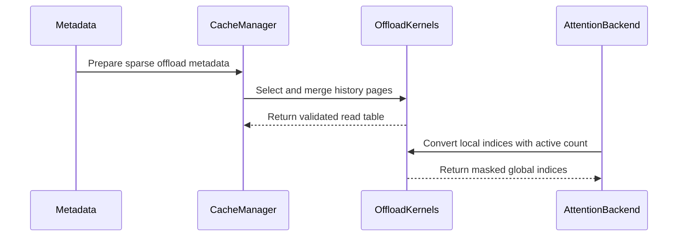

# [PR #19502] [TRTLLM-16283][feat] Prepare DeepSeek V4 attention for sparse KV offload

source: https://github.com/NVIDIA/TensorRT-LLM/pull/19502
state: open | updated: 2026-09-24T06:01:16Z
labels: api-compatible

## 正文

## Description

DeepSeek V4 ratio-4 sparse attention currently assumes compressed KV is GPU-resident. This PR adds the attention-side integration for keeping completed compressed-KV history on the host and fetching each layer's selected history pages back to the GPU. It prepares the KVCM fetch inputs and consumes the returned GPU page table through the existing sparse MLA/FMHA path.

The initial target is single-token ratio-4 decode with BF16 or per-tensor FP8 main KV. The feature is default-off, and enabling `enable_kv_cache_offload` still raises `NotImplementedError` until the KVCM runtime and end-to-end validation are complete.

## Workflow and PR scope

The diagram shows the full intended workflow: **blue = this PR**, **gray = existing execution**, and **orange = pending KVCM runtime work**.

| Stage in the diagram | Added by this PR (blue) |
|---|---|
| Declare ratio-4 compressed KV sparse | Add the opt-in configuration and separate sparse main `COMPRESS` buffers from resident indexer/SWA caches. |
| Prepare each batch | Wait for prior cache work, upload mixed-tier page tables in request order with `copy_base_page_indices_to_device()`, record history counts, and build the resident GPU write table in persistent metadata. |
| Decode: select and request history pages | After the indexer/compressor streams join, convert top-k token indices to unique history-page ordinals and call `fetch_sparse_pages()` for this layer's `COMPRESS` buffer. Repeat for each ratio-4 sparse layer. |
| Decode: consume fetched KV | Merge fetched history with the resident tail into a separate read table, validate required pages and bounds, mask padded rows, and convert the original top-k tokens to GPU indices for sparse MLA/FMHA. |
| After all model layers and sampling | Order cache work after model readers/writers, then use the existing `resize()` history update to make newly completed pages eligible for offload. The next batch waits for that cache work before refreshing its tables. |

Fresh prefill uses the resident write table and existing attention path without a history fetch. The existing compressor, indexer, and sparse MLA/FMHA kernels remain the compute path shown in gray.

The timing and data distinctions are:

- History becomes eligible for offload **after the whole model step**; selected history is refetched **per sparse layer** during decode.
- Page selection deduplicates transfers. Attention retains the original top-k token order, duplicates, and within-page positions.
- The compressor writes resident GPU pages through the write table; attention reads fetched history plus the resident tail through a separate read table.

**Pending KVCM work (orange):** allocate host storage, resident GPU pages, and fetch scratch; move newly completed history from GPU to host and safely release its GPU slots; copy selected host pages to GPU scratch and populate the fetched-page table. KVCM sparse API declarations and runtime implementation are separate work. Fetch-output units, scratch sizing/lifetime, and native offloaded-attention parity must be established before enabling inference. This PR also rejects unsupported batch layouts and history policies.

## Test Coverage

- The complete rerun passed 149 tests on H100 in 72.76 seconds, with no failures or skips. It covers every newly added or modified test function, plus configuration regressions and the golden manifest check.
- Coverage includes metadata preparation, page selection/merge, per-layer fetch/address consumption, history boundaries and stream ordering, required-page coverage, FP8 scheduler preparation, CUDA graph replay/padding, and rejection paths.
- Earlier B200 validation passed 120 offload tests in 34.85 seconds.
- Commit hooks, lint/formatting, Python compilation, and diff whitespace checks passed.

GPU validation used KVCM test doubles, real Torch/Triton kernels, and real Torch D2H/H2D copies in the stream-ordering test. The shared runtime/source overlay had native operator initialization disabled. Real KVCM transfers and native offloaded attention parity remain unvalidated.

## PR Checklist

- [x] New paths have focused tests covered by the existing CPU/B200 test lists.
- [x] Generated the LLM args golden manifest for the additive configuration field.
- [x] Telemetry/privacy CODEOWNER approval for the new public configuration field.
- [x] Confirm the implemented KVCM contracts and native attention correctness before enabling offload.
- [x] Please check this after reviewing the repository PR checklist as appropriate for this PR.

<!-- This is an auto-generated comment: release notes by coderabbit.ai -->

## Dev Engineer Review

- The supplied diff contains changes only in `tensorrt_llm/llmapi/llm_args.py` and `tests/unittest/llmapi/test_llm_args.py`.
- The configuration change adds or updates DeepSeek V4 sparse-attention argument handling. Verify default behavior, validation, parameter propagation, and JSON compatibility.
- No cache-manager, kernel, metadata, runtime, or KVCM implementation changes are present in the supplied diff.
- No review finding counts or test execution results were supplied.

## QA Engineer Review

- `tests/unittest/llmapi/test_llm_args.py` changes configuration tests for DeepSeek V4 sparse attention, including offload defaults, propagation, JSON round trips, ratio-4 validation, and positive `index_topk` validation.
- No integration test-list file changed. Existing DeepSeek V4 entries were found in `tests/integration/test_lists/test-db/l0_b200.yml`, but no new entry for these changes was supplied.
- Coverage verdict: **needs follow-up** until the updated unit tests run successfully and the relevant CI listing is confirmed.

## Per-File QA Perspective

- `tensorrt_llm/llmapi/llm_args.py`: Verify the `enable_kv_cache_offload` configuration default, validation conditions, and propagation to sparse and metadata parameters.
- `tests/unittest/llmapi/test_llm_args.py`: Covers configuration defaults, propagation, JSON serialization, and invalid ratio/top-k combinations. The test file is not shown as newly listed in `tests/integration/test_lists/test-db/` or `tests/integration/test_lists/qa/`.

<!-- end of auto-generated comment: release notes by coderabbit.ai -->

## 评论 (7)

### cascade812 · 2026-09-21

/bot run

### tensorrt-cicd · 2026-09-21

[PR_Github #74864](https://nv/trt-llm-cicd/job/helpers/job/PR_Github/74864/) [ run ] triggered by Bot. Commit: `269e99e` [Link to invocation](https://github.com/NVIDIA/TensorRT-LLM/pull/19502#issuecomment-5766369370)

### coderabbitai[bot] · 2026-09-21

<!-- This is an auto-generated comment: summarize by coderabbit.ai -->
<!-- review_stack_entry_start -->

**Understand this PR’s impact**

Explore downstream dependencies and potential security impact with Blast Radius.

[View blast radius →](<https://app.coderabbit.ai/change-stack/NVIDIA/TensorRT-LLM/pull/19502?view=blast-radius>)

<!-- review_stack_entry_end -->
<!-- recent_review_start -->

No actionable comments were generated in the recent review. 🎉

ℹ️ Recent review info

⚙️ Run configuration

**Configuration used**: Repository: NVIDIA/TensorRT-LLM/.coderabbit.yaml

**Review profile**: CHILL

**Plan**: Enterprise

**Run ID**: `bb0ded58-7018-47d0-b296-ddb9d3348957`

📥 Commits

Reviewing files that changed from the base of the PR and between 5b07ab8bc67b6c3cbb3bdebae50a6e5837f1048b and 269e99e0feb8bb1ccf6f6a4827f88627b8f01eb6.

📒 Files selected for processing (14)

* `tensorrt_llm/_torch/attention/backends/sparse/deepseek_v4/backend.py`
* `tensorrt_llm/_torch/attention/backends/sparse/deepseek_v4/cache_manager.py`
* `tensorrt_llm/_torch/attention/backends/sparse/deepseek_v4/kernels.py`
* `tensorrt_llm/_torch/attention/backends/sparse/deepseek_v4/metadata.py`
* `tensorrt_llm/_torch/attention/backends/sparse/deepseek_v4/offload.py`
* `tensorrt_llm/_torch/attention/backends/sparse/deepseek_v4/params.py`
* `tensorrt_llm/llmapi/llm_args.py`
* `tensorrt_llm/usage/llm_args_golden_manifest.json`
* `tests/unittest/_torch/attention/sparse/deepseek_v4/test_deepseek_v4_cache_manager.py`
* `tests/unittest/_torch/attention/sparse/deepseek_v4/test_deepseek_v4_offload_attention.py`
* `tests/unittest/_torch/attention/sparse/deepseek_v4/test_deepseek_v4_offload_kernels.py`
* `tests/unittest/_torch/attention/sparse/deepseek_v4/test_deepseek_v4_offload_lifecycle.py`
* `tests/unittest/_torch/attention/sparse/deepseek_v4/test_deepseek_v4_offload_metadata.py`
* `tests/unittest/llmapi/test_llm_args.py`

**Included review availability:** Your plan provides up to 12 included reviews per hour; 11 remain after this review.

---

<!-- recent_review_end -->
<!-- walkthrough_start -->

## Walkthrough

### Changes

**DeepSeek V4 sparse KV-cache offload**

|Layer / File(s)|Summary|
|---|---|
|**Offload configuration and state**   `tensorrt_llm/llmapi/llm_args.py`, `tensorrt_llm/_torch/attention/backends/sparse/deepseek_v4/offload.py`, `.../metadata.py`, `.../params.py`, `tensorrt_llm/usage/llm_args_golden_manifest.json`, `tests/unittest/llmapi/test_llm_args.py`|Adds the offload option, validation, parameter propagation, fixed-capacity state, metadata routing, and configuration tests.|
|**Cache lifecycle and mixed-tier preparation**   `tensorrt_llm/_torch/attention/backends/sparse/deepseek_v4/cache_manager.py`, `tests/unittest/_torch/attention/sparse/deepseek_v4/test_deepseek_v4_cache_manager.py`, `.../test_deepseek_v4_offload_metadata.py`, `.../test_deepseek_v4_offload_lifecycle.py`|Adds sparse layer descriptors, resource updates, stream ordering, resident write-table preparation, historical-page fetching, read-table validation, and lifecycle tests.|
|**Sparse kernels and attention integration**   `tensorrt_llm/_torch/attention/backends/sparse/deepseek_v4/kernels.py`, `.../backend.py`, `tests/unittest/_torch/attention/sparse/deepseek_v4/test_deepseek_v4_offload_kernels.py`, `.../test_deepseek_v4_offload_attention.py`|Adds page selection, table merging and validation, inactive-request masking, active-count propagation, phase handling, CUDA graph coverage, and attention tests.|

<!-- change_assessment_start -->
**Priority:** ➖ Normal

**Estimated code review effort:** 4 (Complex) | ~60 minutes

<!-- change_assessment_commit:"269e99e0feb8bb1ccf6f6a4827f88627b8f01eb6" -->
**Change:** Feature
<!-- change_assessment_end -->

### Sequence Diagram(s)

**Suggested reviewers:** `juney-nvidia`

<!-- walkthrough_end -->
<!-- pre_merge_checks_walkthrough_start -->

🚥 Pre-merge checks | ✅ 4 | ❌ 1

### ❌ Failed checks (1 warning)

|     Check name     | Status     | Explanation                                                                                                                                                                                               | Resolution                                                                         |
| :----------------: | :--------- | :-------------------------------------------------------------------------------------------------------------------------------------------------------------------------------------------------------- | :--------------------------------------------------------------------------------- |
| Docstring Coverage | ⚠️ Warning | Docstring coverage is 17.27% which is insufficient. The required threshold is 80.00%. Docstring coverage is scoped to functions touched by this diff. Analyzed 110 functions across 13 files. (1 skipped… | Write docstrings for the functions missing them to satisfy the coverage threshold. |

✅ Passed checks (4 passed)

|         Check name         | Status   | Explanation                                                                                                                                                             |
| :------------------------: | :------- | :---------------------------------------------------------------------------------------------------------------------------------------------------------------------- |
|     Linked Issues check    | ✅ Passed | Check skipped because no linked issues were found for this pull request.                                                                                                |
| Out of Scope Changes check | ✅ Passed | Check skipped because no linked issues were found for this pull request.                                                                                                |
|         Title check        | ✅ Passed | The title follows the repository format and clearly identifies the DeepSeek V4 sparse KV offload preparation as the main change.                                        |
|      Description check     | ✅ Passed | The description explains the change, scope, workflow, pending runtime work, and test coverage. It also includes the PR checklist and marks the relevant items complete. |

Full details: Docstring Coverage

**Explanation**

Docstring coverage is 17.27% which is insufficient. The required threshold is 80.00%. Docstring coverage is scoped to functions touched by this diff. Analyzed 110 functions across 13 files. (1 skipped: 1 unsupported.)

<!-- pre_merge_checks_walkthrough_end -->

- [ ] <!-- {"checkboxId":"585bb3f6-faf5-4dbf-96d2-74e382adf19a"} --> Fix all pre-merge checks with AI
<!-- finishing_touch_checkbox_start -->

✨ Finishing Touches 💡 1

<!-- finishing_touch_suggestion:fix_ci -->

🛠️ Fix failing CI checks 💡

- [ ] <!-- {"checkboxId": "9f0d24fb-b419-4f01-baf0-8b26b6424f34", "radioGroupId": "fix-ci-output-choice-group-unknown_comment_id"} --> Commit to this branch
- [ ] <!-- {"checkboxId": "6d21cfe8-ec3f-40e2-9222-b8318b64d3b0", "radioGroupId": "fix-ci-output-choice-group-unknown_comment_id"} --> Create a new PR

🧪 Generate unit tests (beta)

- [ ] <!-- {"checkboxId": "f47ac10b-58cc-4372-a567-0e02b2c3d479", "radioGroupId": "utg-output-choice-group-unknown_comment_id"} --> Create a new PR

<!-- finishing_touch_checkbox_end -->
<!-- tips_start -->

---

Comment `@coderabbitai help` to get the list of available commands.

<!-- tips_end -->

### tensorrt-cicd · 2026-09-21

[PR_Github #74864](https://nv/trt-llm-cicd/job/helpers/job/PR_Github/74864/) [ run ] completed with state `SUCCESS`. Commit: `269e99e` 
[/LLM/main/L0_MergeRequest_PR pipeline #61633](https://nv/trt-llm-cicd/job/main/job/L0_MergeRequest_PR/61633/) completed with status: 'FAILURE'

[CI Report](http://tensorrt-llm.tensorrt-llm-ci-report.sc2-paas.nvidia.com/?job=%2FLLM%2Fmain%2FL0_MergeRequest_PR&build=61633)

⚠️ **Action Required:**
- Please check the failed tests and fix your PR
- If you cannot view the failures, ask the CI triggerer to share details
- Once fixed, request an NVIDIA team member to trigger CI again

[CI Agent Failure Analysis](https://pbss.s8k.io/v1/AUTH_svc_tensorrt/sw-tensorrt-ci-analysis/LLM/main/L0_MergeRequest_PR/61633/failure_analysis.html)

[Link to invocation](https://github.com/NVIDIA/TensorRT-LLM/pull/19502#issuecomment-5766369370)

### cascade812 · 2026-09-22

/bot run

### tensorrt-cicd · 2026-09-22

[PR_Github #74905](https://nv/trt-llm-cicd/job/helpers/job/PR_Github/74905/) [ run ] triggered by Bot. Commit: `269e99e` [Link to invocation](https://github.com/NVIDIA/TensorRT-LLM/pull/19502#issuecomment-5769440398)

### tensorrt-cicd · 2026-09-22

[PR_Github #74905](https://nv/trt-llm-cicd/job/helpers/job/PR_Github/74905/) [ run ] completed with state `SUCCESS`. Commit: `269e99e` 
[/LLM/main/L0_MergeRequest_PR pipeline #61674](https://nv/trt-llm-cicd/job/main/job/L0_MergeRequest_PR/61674/) completed with status: 'FAILURE'

[CI Report](http://tensorrt-llm.tensorrt-llm-ci-report.sc2-paas.nvidia.com/?job=%2FLLM%2Fmain%2FL0_MergeRequest_PR&build=61674)

⚠️ **Action Required:**
- Please check the failed tests and fix your PR
- If you cannot view the failures, ask the CI triggerer to share details
- Once fixed, request an NVIDIA team member to trigger CI again

[CI Agent Failure Analysis](https://pbss.s8k.io/v1/AUTH_svc_tensorrt/sw-tensorrt-ci-analysis/LLM/main/L0_MergeRequest_PR/61674/failure_analysis.html)

[Link to invocation](https://github.com/NVIDIA/TensorRT-LLM/pull/19502#issuecomment-5769440398)

## Review (4)

### lfr-0531 · 2026-09-22 · COMMENTED

(no text)

### Mgluhovskoi · 2026-09-23 · APPROVED

(no text)

### mikeiovine · 2026-09-23 · APPROVED

Looks like this one needs careful review from the attention and KV cache teams; stamp on behalf of the runtime team to reduce the number of approvals we need.

### cascade812 · 2026-09-24 · COMMENTED

(no text)
