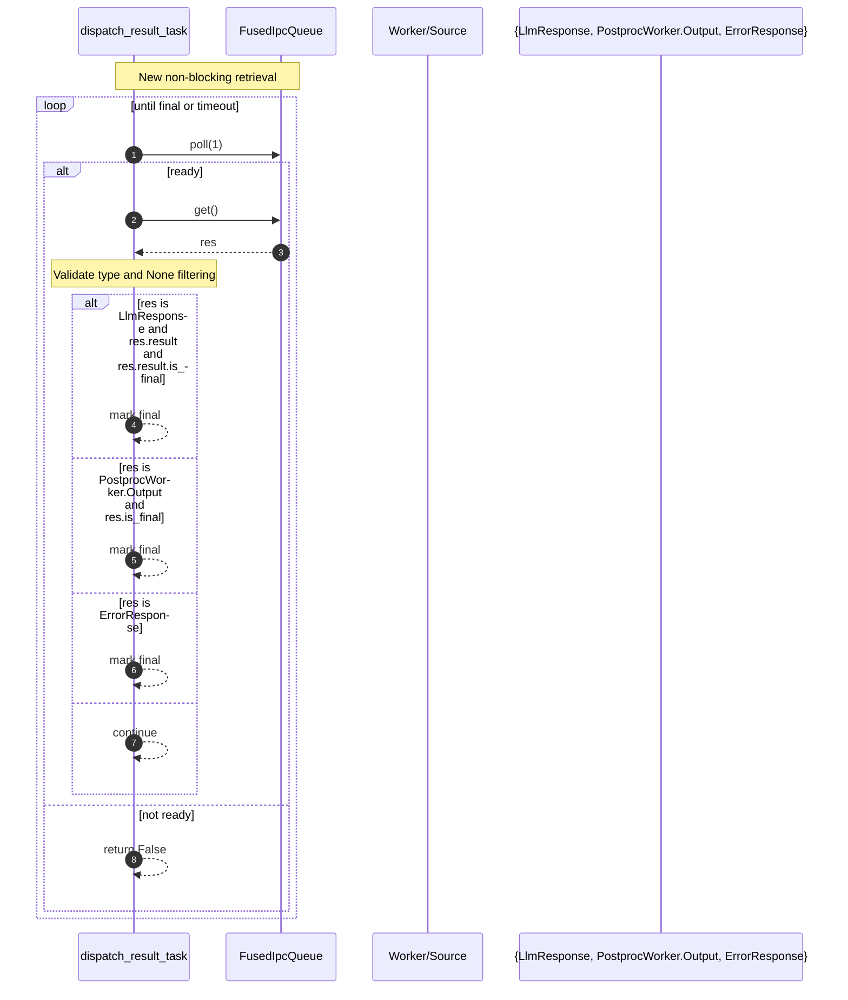
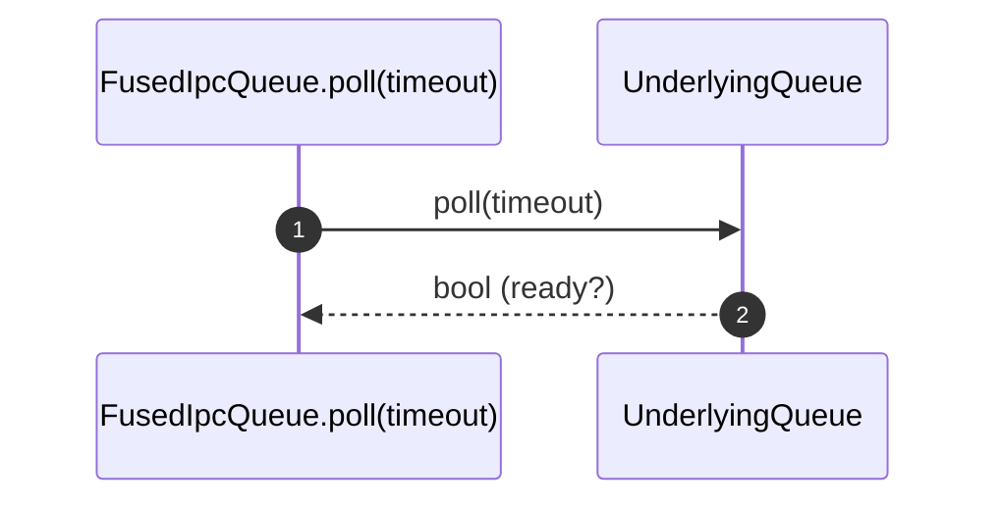

# [PR #5972] [https://nvbugs/5385167][fix] Potential fix for response queue size

source: https://github.com/NVIDIA/TensorRT-LLM/pull/5972
state: open | updated: 2026-09-22T23:13:16Z
labels: Community want to contribute

## 正文

[MLPerf] Potential fix for response queue clear

## Description

Response queue was not being cleared after completion of response. This PR is a possible fix for it. Needs more understanding on what changed around `is_llm_response` or whether this is logically correct. 

When post-processing workers are enabled, the result is of type 'Output' and when we do not have post-processing workers, the result type is `llm_request.LlmResponse`. The PR fixes it so an assertion fails when the type constraints are not satisfied. 

The effect of this bug is that when running with post-processing workers, the result queue doesn't get cleared leading to spikes in execution, likely due to resizing of the queue. A symptom of this was error messages at server shutdown indicating that requests couldn't be cancelled. 


## Without fix:
Terminating the server after running 640 requests produces the following output on main. The requests are still maintained in the data structure causing the destructor to go over them and attempt to abort them.

```
[09/02/2025-02:36:34] [TRT-LLM] [W] Request of client_id 639 is finished, cannot abort it.
[09/02/2025-02:36:34] [TRT-LLM] [W] Request of client_id 640 is finished, cannot abort it.
[09/02/2025-02:36:34] [TRT-LLM] [W] Request of client_id 641 is finished, cannot abort it.
[09/02/2025-02:36:34] [TRT-LLM] [W] Request of client_id 642 is finished, cannot abort it.
[09/02/2025-02:36:34] [TRT-LLM] [I] Thread proxy_dispatch_result_thread stopped.
[09/02/2025-02:36:34] [TRT-LLM] [I] Thread proxy_dispatch_kv_cache_events_thread stopped.
[09/02/2025-02:36:34] [TRT-LLM] [I] Thread proxy_dispatch_stats_thread stopped.
[09/02/2025-02:36:34] [TRT-LLM] [I] Thread await_response_thread stopped.
[09/02/2025-02:36:34] [TRT-LLM] [I] Thread dispatch_stats_thread stopped.
[09/02/2025-02:36:34] [TRT-LLM] [I] Thread dispatch_kv_cache_events_thread stopped.
INFO:     Application shutdown complete.
INFO:     Finished server process [19628]
```

## With fix:
With this PR, we see a clean termination of the server - logs show that the server terminates right after processing requests.
```
[09/02/2025-14:05:14] [TRT-LLM] [I] iter = 496, global_rank = 0, rank = 0, currank_total_requests = 0/0, host_step_time = 11.262893676757812ms, prev_device_step_time = 11.711135864257812ms, timestamp = 2025-09-02 14:05:14, num_scheduled_requests: 5, states = {'num_ctx_requests': 0, 'num_ctx_tokens': 0, 'num_generation_tokens': 5}
[09/02/2025-14:05:14] [TRT-LLM] [I] iter = 497, global_rank = 0, rank = 0, currank_total_requests = 0/0, host_step_time = 11.097908020019531ms, prev_device_step_time = 11.484928131103516ms, timestamp = 2025-09-02 14:05:14, num_scheduled_requests: 2, states = {'num_ctx_requests': 0, 'num_ctx_tokens': 0, 'num_generation_tokens': 2}
^CINFO:     Shutting down
INFO:     Waiting for application shutdown.
[09/02/2025-14:05:39] [TRT-LLM] [I] Thread proxy_dispatch_result_thread stopped.
[09/02/2025-14:05:39] [TRT-LLM] [I] Thread proxy_dispatch_kv_cache_events_thread stopped.
[09/02/2025-14:05:39] [TRT-LLM] [I] Thread proxy_dispatch_stats_thread stopped.
[09/02/2025-14:05:39] [TRT-LLM] [I] Thread await_response_thread stopped.
[09/02/2025-14:05:39] [TRT-LLM] [I] Thread dispatch_stats_thread stopped.
[09/02/2025-14:05:39] [TRT-LLM] [I] Thread dispatch_kv_cache_events_thread stopped.
INFO:     Application shutdown complete.
INFO:     Finished server process [54575]

Aborted!

```


<!-- This is an auto-generated comment: release notes by coderabbit.ai -->
## Summary by CodeRabbit

* New Features
  * Added readiness polling to the fused queue, improving responsiveness of result dispatch.
  * Treated post-processing outputs as valid streamable responses with proper finalization.

* Bug Fixes
  * Reduced stalls by using timed polling before retrieval, avoiding unnecessary blocking.
  * Skips null entries in response lists instead of failing, improving robustness.
  * More reliable finalization and error handling for streamed responses, reducing premature or missed completions.
<!-- end of auto-generated comment: release notes by coderabbit.ai -->

## 评论 (50)

### coderabbitai[bot] · 2025-07-17

<!-- This is an auto-generated comment: summarize by coderabbit.ai -->
<!-- walkthrough_start -->

<details>
<summary>📝 Walkthrough</summary>

## Walkthrough
- Added FusedIpcQueue.poll(timeout) delegating to underlying queue.
- In proxy dispatch, switched from blocking get() to poll(1)+get(), introduced local imports, replaced is_llm_response with isinstance checks, broadened finalization logic, and skipped None items rather than failing.

## Changes
| Cohort / File(s) | Summary |
|---|---|
| **IPC queue API update**<br>`tensorrt_llm/executor/ipc.py` | Added `FusedIpcQueue.poll(self, timeout: int) -> bool`, forwarding to the underlying queue’s `poll(timeout)`. No changes to put/get semantics. |
| **Proxy dispatch flow adjustments**<br>`tensorrt_llm/executor/proxy.py` | Moved certain imports inside `dispatch_result_task`. Switched result retrieval to `poll(1)` then `get()`, returning False if none. Replaced `is_llm_response` with explicit `isinstance` checks (LlmResponse, PostprocWorker.Output, ErrorResponse). Broadened finalization conditions and skipped `None` items in response lists. |

## Sequence Diagram(s)




## Estimated code review effort
🎯 3 (Moderate) | ⏱️ ~25 minutes

</details>


<!-- pre_merge_checks_walkthrough_start -->

## Pre-merge checks (3 warnings)
<details>
<summary>❌ Failed checks (3 warnings)</summary>

|     Check name     | Status     | Explanation                                                                                                                                                                                                                                                                                                                                                                                                                                                                | Resolution                                                                                                                                                                                                                                                             |
| :----------------: | :--------- | :------------------------------------------------------------------------------------------------------------------------------------------------------------------------------------------------------------------------------------------------------------------------------------------------------------------------------------------------------------------------------------------------------------------------------------------------------------------------- | :--------------------------------------------------------------------------------------------------------------------------------------------------------------------------------------------------------------------------------------------------------------------- |
|     Title Check    | ⚠️ Warning | The current title “[https://nvbugs/5385167][fix] Potential fix for response queue size” is misleading and does not accurately convey the primary changes, which add a poll method to the fused IPC queue and update response dispatch logic to use explicit type‐based polling rather than relying on queue sizing. The phrase “response queue size” suggests a sizing adjustment that is not present, and the wording “Potential fix” adds ambiguity rather than clarity. | Rename the PR title to clearly summarize the main functionality change—for example, “Add poll to FusedIpcQueue and refactor response dispatch for proper queue clearing”—and ensure it follows the “[ticket][type] Summary” convention without ambiguous qualifiers.   |
|  Description Check | ⚠️ Warning | The description does not follow the repository’s template: it lacks the required “@coderabbitai summary” header, omits the “## Test Coverage” section to list relevant tests, and does not include the completed “## PR Checklist” section, so it is missing several mandatory sections despite having a detailed “## Description.”                                                                                                                                        | Update the PR description to include the top‐level “@coderabbitai summary” line, add a “## Test Coverage” section specifying which tests cover these changes, and fill out the “## PR Checklist” to confirm coding guidelines, tests, and documentation are addressed. |
| Docstring Coverage | ⚠️ Warning | Docstring coverage is 16.67% which is insufficient. The required threshold is 80.00%.                                                                                                                                                                                                                                                                                                                                                                                      | You can run `@coderabbitai generate docstrings` to improve docstring coverage.                                                                                                                                                                                         |

</details>

<!-- pre_merge_checks_walkthrough_end -->

<!-- walkthrough_end -->

<!-- announcements_start -->

> [!TIP]
> <details>
```bash
> <summary>👮 Agentic pre-merge checks are now available in preview!</summary>
> 
> Pro plan users can now enable pre-merge checks in their settings to enforce checklists before merging PRs.
> 
> 	- Built-in checks – Quickly apply ready-made checks to enforce title conventions, require pull request descriptions that follow templates, validate linked issues for compliance, and more.
> 	- Custom agentic checks – Define your own rules using CodeRabbit’s advanced agentic capabilities to enforce organization-specific policies and workflows. For example, you can instruct CodeRabbit’s agent to verify that API documentation is updated whenever API schema files are modified in a PR. Note: Upto 5 custom checks are currently allowed during the preview period. Pricing for this feature will be announced in a few weeks.
> 
> Please see the [documentation](https://docs.coderabbit.ai/pr-reviews/pre-merge-checks) for more information.
> 
> Example:
> 
> ```yaml
> reviews:
>   pre_merge_checks:
>     custom_checks:
>       - name: "Undocumented Breaking Changes"
>         mode: "warning"
>         instructions: |
>           Pass/fail criteria: All breaking changes to public APIs, CLI flags, environment variables, configuration keys, database schemas, or HTTP/GraphQL endpoints must be documented in the "Breaking Change" section of the PR description and in CHANGELOG.md. Exclude purely internal or private changes (e.g., code not exported from package entry points or explicitly marked as internal).
> ```
> 
> Please share your feedback with us on this [Discord post](https://discord.com/channels/1134356397673414807/1414771631775158383).
> 
```
> </details>

<!-- announcements_end -->
<!-- internal state start -->


<!-- DwQgtGAEAqAWCWBnSTIEMB26CuAXA9mAOYCmGJATmriQCaQDG+Ats2bgFyQAOFk+AIwBWJBrngA3EsgEBPRvlqU0AgfFwA6NPEgQAfACgjoCEYDEZyAAUASpETZWaCrI5Ho6gDYkuAbQBm8AAeALrW+DQY4miekIFBcfh8FNLc+BiIJJAAjtgkefbwAF5ZABS2kGYArACcAOwATACUkHLoKQDWaLIANPb42BQMWQJUGAywkNiZFIgA9BRd3iTMc/EA+im50rjr23nrady6epC4zqS4rWMTkMzaGBqQAMIp1HSQDQAMDVVgX3UwABGIHQIF1DgAFgAbBwAMxAgBaTwAyudcNMuPhuGQnjYSBJ4CQAO6ULgYCTEbAseAYIhFDRGAAi0gYFHg3HE6S4cCyFTQtFoKUQmWQaFa2CIkGJsEoWVwssgwrSGSy+yyxLQyAwEUY3mcHzQ/hoyVS6UyCmY3G8XIwfQYaGmtKlCrVeQKBCVJHOtLitKQsvoWzyiFwYow9H1tGdZ3w9m48A60hQWBIQVEeHg6XQEfssDwtHwxKwmooGGdYoEAyuwZ2yAV1AU2E8tAwAHIrgIsg7xiRPN5aE9eV60hQaPRo/5/HLeyh67BGzKyDx8KGwLx8MMRTHiUkk7N2lkyCoB31hc2w4f+P4zrIcZAAPJ4bh4Poy+DeaXqWDVldrjdbogO57pQyDnp4l4Gtet73v2zCbCQ2yhhoAAynjMPiiAqpkQ6KhMmCkHcaBJuG6AipQtqxnE2ixEuWC4He3bmrgVC0pBKSQDqVyINQSCBHQuFZI6CpJJxETJtgvZjg8DHoFWeDSrKrp8PhdLJs4Ay5kg6xwQhWHmkJHHKua8ACJ+olLspZyKp4+BEPADBzgoFApGIOaRiofbzqgWroCukTRLE8Rerk8DsnScSDFZklKLM5wRs6TwoXZYocRuhJKPQiA/sSMYbmZKy8Y5XYLoSFnfr+rp+gkpSluWdKVr+gTltlHy1qGyC0IMMbZQWRYYC0mD0PAVoUPgUj0Aw+r0ZQzC0rx2a5Qq1lZPEjIGBYLwsGwUTIA4TguG4BhQAAsheHKflWVxDVMMyWvcEbIEgDgfL6VUVEwrDsNZby0FwcxXUqkl9ADuopNMJDrhyfa0iQIOA7KnjcPDYOSboYChmgpBgJ4SC4CjNZoxA0Y8QVYD+DR5Navj7kjiQ7z0KDhNYLSEibgtGStPIEN8AaXTyDdESyrMjJQM8ACSkCIzifClJEiBJGOYAMA5tAtCx8BEKQKT0BgjiUAMyC2OsADi37YAIkBCIIyClOLTLILjoYfCQGhEBofRAg0DSQg0ns+18AAcnuQjUNSQp70LQginuNIHcKx3CjSx5CcJVCnkJfBn6eQOCVRVMHud1HUIKx3UcIJ0XgeQkCnuB0HQItEtkwPfIFCScgn3Wt6Ma+pjNCQCiACqzzPAAoiiKKJHwVXS5QVuCBKVyFsWoZvMwkBzChKEnXM9y0lvXzrCdlCkPiSG7BUCY4rj5B0wznjyF3NofM39jotMkAAGIAILiyhQ8bBj2nvYAkyhYjXxhnfdunNSiQNvlkPWzAuwHhVuOLgNQvg1D9pAbBvxPZAjhA0SuXtISBzqP7MOtdc5wi+FUChNCgQAk9giJhLDvhZxoWnBhhD86V29AwDQTRRaDxYFkOefBraWxgZ3Fg3dxxfmWv3LIv9/6AOAaUV27s+jGzNgqC2lQvY+xwWYcEkJM6DVzArNgijJhMnFiiH+AAhFCY8mSQE0W7D21gbCm3NpbUxxdS6GOLhXFoXV5RxhQl8M4OwYxdhjLjOaCjPS8CzOycQJR6A80QAAbjuNIHihEuISTunzboTkuIph4OyJI6higfCdjTXgYCogxmibE0MMZ/CiREhaGRIiURgKoLEBwDBAKSCyDI6Ucp0C4BoFacc+TrHiL7DLBe0iO72GwOMkgdAPilGUYPEe49J5NwQJ+KqWoFYqwZpADp8DYbvw/LEFIo4FGqIAUAkRP8vQQyhjfJ51AFmci9BiMsHxh6jwnlPHpM9FQSI2UvMSCj5pqFxrJT04MLTihaWVaYj9v5/1ce4qRIiABycZoyuSuEwJQYAUiEhJPddgyB/BjQ3oyokpIDxQRaZkKI1SqrpXgJlH69NaD5KqrZKU7B2TqTSuye47JCUSyRf3T+2BuC0HeOGeggNPoPXoKIH80h1r6GMOAKAZB6D4BvMJQgpByBUAUYa9gXBeD8GEKIcQUgZBP0UMoVQ6gtA6AtSYKAcBUA+SwA64gZBlCuu2u6pUaBiTbIOvINodKg1qE0NodGhhLWmAMPLRWuw4JzDTBmAgFA5gckEdwVwBgABEbaNqWD/vG51dz9rKvkHaxgC41KICMFAH+gpDScWZWkfshy+z+D6OINg1YuBsRaGAU4VZ8CxDYCJegnov4Q1oOLbgDAACK7p5QLiuHC0stB5zdhiLET0VUYqUEfjGdUbZkCzs8HLEaJBqzCJgAgZAx4CpgQlbDEUQ7RAdGQNmKq/hj05CvVzSAShvBEF4hFV9ipaTOrQ/kEgP6Vz9kSXZByTxKX8Csih8YtoYhDoItIfJL5cBzEuK0EgpV0len3pzSSqlSCDiMOYTtEFE1Zk5vhrISgprOA5ohm8aZ3kfFEi+MyDlIDsHqdIMdkAT77vQJOv6kAAAGSgbx/vnZ4RdZxAOrpTLgDdW78A7os9UxTsGLNHsyCes9l6SNed9BZstLkK3oSremBgeAkj1rPRoJtFmjBjy6fcJNSgvRMvTSQKcSROBGboPARwrb23HRLRFscOlovVri7WuYG4giyGS82ttLaO2QC7U6xNHw+3OAHTeETBnjqQHxMwcar1EC1fgsZVUcQOUrTuIoZsWQRrvMgE0/JOoeAW1xo5H+VhJYjZESTbg1AJh6QvOsc4iAOhiXTRtwrjt0IIQvrTKwq5cAAQAOogT4LZB0/Z5C0iAtl5DwnbQiMwheMF8qJDMZG/QdlLBWhA46DGS4pQm7fj8mkAK8BmOUrvp6cUOoMBgDMpuTHEVbON0SP2IsHw2jY6aPk+AN4uIIAij5RHH4Txw2WwxsQMmwWDE5l/GIOExsAUKXpR7ZEZiXgbDWZMqB0hZDtVwXS7VNBoQwmaVUOjvt/YBxoJ8P3Xz8D4GPFySRMLYVdmNr+81cZFA5goBKlFRj4AFAm8zeKswErbjDDTLMZu66N5kUowpLFBjNeBTQ2lmrMdEnbsaFBHcGR20WW60g3CQF0HOMH8Vhix+kH0KPF9ULoWz6qePXpEAaCT7TYULfpAXg0Cnt3Bgi9QFEkgUvmBy/Cj6Bnh30eSBND78XwfQEMhl5IBXxAJvQxm8WJQC3z48CN/bz3jAMQxsAAkhq3ylIO9QKwnr0UVPNi0TSWNqRR0tlI4L6pSgpp4C02ZMDyBJ5EoUFaISvdhyAmBFAAZAIjp4CGCIg+FICMp4FXm9vft2LKAwAhleG8p4GgMMPQG/GpgduoCXoviPmgfBmKDhqXigFaIVh8AxDiHkuEOvmNAwP9pvhQNvlblcKgCxPTAor5OKNAaKk3k7jBBqHjuoIhsWH6Ifu7p7jKtRuJl1j/FJi6jJvWHGFVApjgeoeaNBGpnQbanwFpgdrpm0uIKNlALRoYWOHQE1vtg5BjJrIfuCmgaxp1N6D6gJGlhlncjmjltyrpgVmOFwMfprLAOVp1pVkWhGuYbavavFt2n1pNMmlEFwFQOmgNi4BhjmlQMGvmmGpugYHEYauoOsKKjNlyiSHQOsJjGOIWsWlALUFUDqtCLwoHOHMXK0WgECCQHCGQoHNCAwECIHP4JCHUPnHsgwHCCQGMYHI0SUVavdOUZUQhLlrUTao0XES0usGwBQKQOsBMBQXUecA0RagYAAN6z4tpIC2BOIY50DPBpG4BfbOy0AtpcBf6ZA9A3HZQDAtgPE062CfHUTf5ww3FIDwGUDsiToYCgnfEQlF4trRi0A2CSRMibhojhRECIDPDoEdCgksR5C/HImonokYAeC4DeD4nwZEntxImQAomioUksiIBsgci2i0kYH0kkk3G3xJgnoighjYmgltqklMk4GhjckdCw4QSICgm+Cz5F7XFF5qlMnHEYHkpoBsBilUmfgyktoSnqktoaoKlfHS6MkmmEGYAcx6l4SDApCCriDUlZCAA4BL4LAPMtwIgBwHMHMBSAIJKPMFUHCIHFUECNCHUCEAEMEGEF9oTsxsFHCqIQZMRgUEBCUIALgETkc0iAUYMYN0hYyYVSuBcWLqfYAaFIJA8gwqSqg2T+pAq+ikDkkwAo9AuKO6u63oP4B6WhioKGAWkA4sVgzw6ZQkuYWqOqA8qBmGSAF2uAtwihjknoEMumQQ1oDkxBDBJAgACAQCBagfB/oxgurCzWSYBeifoRTZjqiFBFCJSgZZDcCwBUAWhumzm3mZkkA5kOBax1h+SZmFm0BCDTC4A7RXCq6VK6j8rsB9A3RVS7gUDRgRRukJl6ZJnBA5ntlijIKazYDqBtzUBnkNhYCKYZKtZGnKlqktrCg7qZjpBin4iH42LvR2AumXJxhTT0wUAgGODKoNLLaCaRSMYyYxAEWNkkCAAoBCmWmDqd3H0G6ROvQH+lRP5nQKeheuhjdCkBTGIKJLOedpdpMCmRuOsreVxc4M6FmZJTdGQA4BxMQT0kzsSI+pAB6eIBgd6DGTuWECiHxYNjmUwNWW0otBVApDqWoEQNSJ/LkGJfxCLJReqciZNkoGKXVM6IlUlTRaIOkIEFFSkAiZacadRXUvZHITKdqbqVwC2uxSQJ1uqQAL7FWqlZWakdCVV1XVVskcmchi6GnFXIlmmFXgkDVMk2muEyb2nyasjsi9XZjFnai6hOW2TppVRvKrjqBJCyCACYBPWCsNaO8GulcDgRga5cGGFB8G6QAAJ5EqB5oFrZGyA5myj+4UB9A0gq6KhumbTQA7BbQIFYzfmgKi5IZxiP4pDeCI7Ol1hwW5gLUoophTTYAQ54RyIvz0DfWWAVAylNI/k+oyZ9AKwoA8HIB5kL5SiZAA27pDTUBbXA22ieFYRX5SxoCEgRTihKA+gDhuWbTdWzXQ5ZmZUmm0UwG2hilDzarvDLYVBKDsn81i6ei0hI0o2RLcC7mQ19huU3WBr5H3U6CPU5kIJwWCh+SY0wB/XPEA2kB40g1YBYSiCc6yA7gIC3A0AdQKAIErQWgjbNk3SBD9j8AKRVRm3Y0Em41URBWBAUAbx0pY74VYYwZLow20yFhxbgWe5QTtnCgBYaBC3UUpWdVMnpV0h53ImuS5V4UFUWkjVUXImlVu4VU6mF0okzWcmTVUVNVUUtUmltUdVimYkMBrwxiW3KCkCl1MlDXV0/G11jUbk4ETUMVdWbhD0RRMBW3rbICRkaBRkACkLZtw0aGQ2AU4W57AgkIU+FOs4q/xLYTk9cGgXwXwO9udo12VCsotk11VAAmgMIwBeTApZtrbFHdeoAWr1hWZhsvRrA1F5oraNFNpA4PdA1KGvaPa7OPS2gXWlc4B/hg/XeVQSX3dVanSvbifVWqQ1bPiEBKS2lKa8TYHzW3YvUyb4CdChFYJQP4PGeJG0hhQkCmR+ehhZRQAADqiMYBiMiMYC82t1zUSPiOSMYD14Wi3maiLWdgkAxjCOGjGjzzPw9zZiDqoG4SoAVA+R/hAQFTVQgIhqQDkp7IPorYcTvpxRDQxiLQ3oSUdljQxSWbaRR76SqheYWRKTEVgZOTLnPoBouQ+pPCKOKO/ayhYBpD/isGFLAQcGpRHiH4FS0BLp36d4QROSDo7mQBtiW4cZti0x0QzKQMI2lRPnfbrhpPbgRSIX7jNlrWFMQWMROQWbV4hj6515T4Wbn0VDxDq7cRxgXnXIURi4UwfjIA1NVSlNBVrwyRZMI08TiCID8SDiQDxPiPDj5bThuQlPhNBlSi8GeM1MwIf62J/i4DNObjpNtMA6dMFMOBFO3kLXthXDcbaORjQZ4ZxhM0kTVL1b0V2hbaJiVmYYehxjCjFDuM3hVTqhPC/KICyCLJo7nOoBqO6b258BsAiiA1ijcSUCe29S4ArwswJQOjiB4aeN66yLNitgdg8Z/29j9gCQHMKP8tSObS/ZhW3rBAcCKO/XR3zSMsuiKgzCe1GgmhAwYD3PQiZwX3/kbhdRbjC5dlFjuM75XDZiCbn0stXhdIB2CY+jkDDS37ybUDihrw7JuF/1OhMvTVOt6UzxxhEBxhTbworC0zAr7UQXTNVgNGujMAaCHNSMWZxuKO+BYJzA/BzDfC/D/ANDwiwgDFhC+DQA2DQBgDbwnS5u/ZhDnyDPQRTREhRAVH0DRw1BOTNQBh0D2iYClnhs8GaAJtJsptpt/A/BZvwiQi5v5uFvFulvluISVuDrVvsB1uQBqsxKoDNutR5NcsduFbE3RviOJs1DJsNCps/ADuZtwjZsjuQB5sFtFs7yTvjbTt/Wzu4zzsiFqtAhNv+hrttsqu6gqBbsho9v7t9vHsZtDs5uXtjs3sluXtlv3sfZPs1u7Cvu+wfstSBjfubsNEAe7u9uHv9ugdnvDujvXsTuXvixhBwC/Q1L4AtbrCGWLmwDXYQS3YvkSrvzYg4iDiAcHtHvpuDuEfgdXvju3tkcUescCjUe0f0dXYdASBHG4GyjrCtJhgsdUehgccCTcfAd8envnvEfCfQe+DkegZUfNayB0fzlGWnHUAzYKhqcEDcCcc7tSN7s8f4f8d6cQckcidGdidUdpraC7CoGqdsfqeOeac4dAd4cgcedEdecGe5vGeUdsfSeMf9y2fidZQOdOdafRc6dgcXtCdQeJd+cpeWcMfrCyfyfHFKdSC7QhcSdhc5fiPizkpfwPhcDqk/yOcHae7Uu0uWjyKuyKOtfteddqmu5of9aUvzxy6wa+BAg1DQgNCBwhCKNxsWYxvSOWDCvLTxDiviO7eTAKimM2BvhZCZBCR6j0wzRSsL1YDnMXczd8BQAyp7Q5TnkQVyvPexJ3e6pKgRHXS6MmEtPk0asdTOcYAbe5e8d/BAiQgcB0IcDw/6fFeifE3zwAC8kAoc0IfQRAtkB5ngmwmAD22PnCYwZPkAnC5ZlPt2EQMQ72gzyA5PybfQP4oYpxJA3At2gGkA2PIIGgDQy3nRZ7dQUZ9CgcXszAzZeKdHBIDkJAXPPPy6WQAvQIGgJcIIacQxvskv0vnTgGmMVo/PnwMXNQGbucCPSP8PfQSCdRxxXUA4TPdYXAOcyiLPkAlxbY9vYgQQLvHUbYXAnCPvjgRxuA/vBASYGQQf1PfQof8E4DHM9P0fiAsfVQDVMP+H8PiPVQyPhXkHpHvnGPfA2PocDCBPggjPlPpvFPpPtf9ojppP9P5wxPZrrPnCHPuwzsKvfP6vD99QmC9cHCi3oZQIMvfQcvSghIwwyvvPNi/fZCocK3hCIIXwackZE/jmJL5wJv2P7nFvPwVvuf+fdvYf7JgYa2tAAfYYXAOCHvpv3vvvEfN/afwf8fz/kf+AqfsfIf9vSftoFPnZVj4NBM+4jAAHoSw2uHXJKiiHzDzIYwtLEbtAPG5F5fsgXbpKJDQA9cHIfXeAbS0h6udtOcPa3nnzhA1BUeRfJLpl0k7mdUuTHXYHZ1C7ZcIuLnXDrD2BCkD4QFA+Lmj2L7JcJOZnCzlhCs5VcHQNXZThl3s4acuOkXNziBxz5I9yBlAnztQNM5jQpO5XK7Olwa5ZcZBhA9gdny4HKDeBVA0rhJwC7lFguTAxriwNkFsCouHAxQWQJ4FFczBJnMriIIq46CbBeg8LvYIwBEC8uJAk/iYLcGqDzBE4LQYxzEEKclekg3Qex38GQ9RuMArrjgIZZi5+u/UQbi/BSEoCkqk3FtllB+5zdkAvgKoJCHoRVA1uArDAD/E7Z0AQAW3DbplVobUxbA+pZup6W9K+l/SgZYMnMFDLhlIy0ZWMqEHCCJkgowQEBIIxIx3k6qBgShksQgA1Ile+xQ4m1RmxbF9AQAA=== -->

<!-- internal state end -->
<!-- finishing_touch_checkbox_start -->

<details>
<summary>✨ Finishing Touches</summary>

- [ ] <!-- {"checkboxId": "7962f53c-55bc-4827-bfbf-6a18da830691"} --> 📝 Generate Docstrings
<details>
<summary>🧪 Generate unit tests</summary>

- [ ] <!-- {"checkboxId": "f47ac10b-58cc-4372-a567-0e02b2c3d479", "radioGroupId": "utg-output-choice-group-unknown_comment_id"} -->   Create PR with unit tests
- [ ] <!-- {"checkboxId": "07f1e7d6-8a8e-4e23-9900-8731c2c87f58", "radioGroupId": "utg-output-choice-group-unknown_comment_id"} -->   Post copyable unit tests in a comment

</details>

</details>

<!-- finishing_touch_checkbox_end -->
<!-- tips_start -->

---

Thanks for using CodeRabbit! It's free for OSS, and your support helps us grow. If you like it, consider giving us a shout-out.

<details>
<summary>❤️ Share</summary>

- [X](https://twitter.com/intent/tweet?text=I%20just%20used%20%40coderabbitai%20for%20my%20code%20review%2C%20and%20it%27s%20fantastic%21%20It%27s%20free%20for%20OSS%20and%20offers%20a%20free%20trial%20for%20the%20proprietary%20code.%20Check%20it%20out%3A&url=https%3A//coderabbit.ai)
- [Mastodon](https://mastodon.social/share?text=I%20just%20used%20%40coderabbitai%20for%20my%20code%20review%2C%20and%20it%27s%20fantastic%21%20It%27s%20free%20for%20OSS%20and%20offers%20a%20free%20trial%20for%20the%20proprietary%20code.%20Check%20it%20out%3A%20https%3A%2F%2Fcoderabbit.ai)
- [Reddit](https://www.reddit.com/submit?title=Great%20tool%20for%20code%20review%20-%20CodeRabbit&text=I%20just%20used%20CodeRabbit%20for%20my%20code%20review%2C%20and%20it%27s%20fantastic%21%20It%27s%20free%20for%20OSS%20and%20offers%20a%20free%20trial%20for%20proprietary%20code.%20Check%20it%20out%3A%20https%3A//coderabbit.ai)
- [LinkedIn](https://www.linkedin.com/sharing/share-offsite/?url=https%3A%2F%2Fcoderabbit.ai&mini=true&title=Great%20tool%20for%20code%20review%20-%20CodeRabbit&summary=I%20just%20used%20CodeRabbit%20for%20my%20code%20review%2C%20and%20it%27s%20fantastic%21%20It%27s%20free%20for%20OSS%20and%20offers%20a%20free%20trial%20for%20proprietary%20code)

</details>

<sub>Comment `@coderabbitai help` to get the list of available commands and usage tips.</sub>

<!-- tips_end -->

### nvzhihanj · 2025-07-17

/bot run

### tensorrt-cicd · 2025-07-17

[PR_Github #12242](https://nv/trt-llm-cicd/job/helpers/job/PR_Github/12242/) [ run ] triggered by Bot

### tensorrt-cicd · 2025-07-17

[PR_Github #12242](https://nv/trt-llm-cicd/job/helpers/job/PR_Github/12242/) [ run ] completed with state `FAILURE`
[/LLM/main/L0_MergeRequest_PR pipeline #9092](https://nv/trt-llm-cicd/job/main/job/L0_MergeRequest_PR/9092/) completed with status: 'FAILURE'


### arekay · 2025-07-21

/bot run

### tensorrt-cicd · 2025-07-21

[PR_Github #12408](https://nv/trt-llm-cicd/job/helpers/job/PR_Github/12408/) [ run ] triggered by Bot

### tensorrt-cicd · 2025-07-21

[PR_Github #12408](https://nv/trt-llm-cicd/job/helpers/job/PR_Github/12408/) [ run ] completed with state `SUCCESS`
[/LLM/main/L0_MergeRequest_PR pipeline #9225](https://nv/trt-llm-cicd/job/main/job/L0_MergeRequest_PR/9225/) completed with status: 'FAILURE'


### arekay · 2025-08-12

/bot run

### tensorrt-cicd · 2025-08-12

[PR_Github #14994](https://nv/trt-llm-cicd/job/helpers/job/PR_Github/14994/) [ run ] triggered by Bot

### tensorrt-cicd · 2025-08-12

[PR_Github #14994](https://nv/trt-llm-cicd/job/helpers/job/PR_Github/14994/) [ run ] completed with state `SUCCESS`
[/LLM/main/L0_MergeRequest_PR pipeline #11323](https://nv/trt-llm-cicd/job/main/job/L0_MergeRequest_PR/11323/) completed with status: 'FAILURE'


### arekay · 2025-08-27

/bot run

### tensorrt-cicd · 2025-08-27

[PR_Github #16631](https://nv/trt-llm-cicd/job/helpers/job/PR_Github/16631/) [ run ] triggered by Bot

### tensorrt-cicd · 2025-08-27

[PR_Github #16631](https://nv/trt-llm-cicd/job/helpers/job/PR_Github/16631/) [ run ] completed with state `SUCCESS`
[/LLM/main/L0_MergeRequest_PR pipeline #12487](https://nv/trt-llm-cicd/job/main/job/L0_MergeRequest_PR/12487/) completed with status: 'FAILURE'


### arekay · 2025-09-02

/bot run

### tensorrt-cicd · 2025-09-02

[PR_Github #17283](https://nv/trt-llm-cicd/job/helpers/job/PR_Github/17283/) [ run ] triggered by Bot

### tensorrt-cicd · 2025-09-02

[PR_Github #17283](https://nv/trt-llm-cicd/job/helpers/job/PR_Github/17283/) [ run ] completed with state `SUCCESS`
[/LLM/main/L0_MergeRequest_PR pipeline #12991](https://nv/trt-llm-cicd/job/main/job/L0_MergeRequest_PR/12991/) completed with status: 'FAILURE'


### arekay · 2025-09-02

/bot run

### tensorrt-cicd · 2025-09-02

[PR_Github #17372](https://nv/trt-llm-cicd/job/helpers/job/PR_Github/17372/) [ run ] triggered by Bot

### tensorrt-cicd · 2025-09-02

[PR_Github #17372](https://nv/trt-llm-cicd/job/helpers/job/PR_Github/17372/) [ run ] completed with state `SUCCESS`
[/LLM/main/L0_MergeRequest_PR pipeline #13057](https://nv/trt-llm-cicd/job/main/job/L0_MergeRequest_PR/13057/) completed with status: 'FAILURE'


### arekay · 2025-09-03

/bot reuse-pipeline

### tensorrt-cicd · 2025-09-03

[PR_Github #17435](https://nv/trt-llm-cicd/job/helpers/job/PR_Github/17435/) [ reuse-pipeline ] triggered by Bot

### tensorrt-cicd · 2025-09-03

[PR_Github #17435](https://nv/trt-llm-cicd/job/helpers/job/PR_Github/17435/) [ reuse-pipeline ] completed with state `SUCCESS`
Can't reuse [PR_Github #17372](https://prod.blsm.nvidia.com/sw-tensorrt-top-1/job/LLM/job/helpers/job/PR_Github/17372/) with status: `FAILED`


### arekay · 2025-09-03

/bot help

### github-actions[bot] · 2025-09-03

## GitHub Bot Help

`/bot [-h] ['run', 'kill', 'skip', 'reuse-pipeline'] ...`

Provide a user friendly way for developers to interact with a Jenkins server.

Run `/bot [-h|--help]` to print this help message.

See details below for each supported subcommand.

<details>

`run  [--reuse-test (optional)pipeline-id --disable-fail-fast --skip-test --stage-list "A10-PyTorch-1, xxx" --gpu-type "A30, H100_PCIe" --test-backend "pytorch, cpp" --add-multi-gpu-test --only-multi-gpu-test --disable-multi-gpu-test --post-merge --extra-stage "H100_PCIe-TensorRT-Post-Merge-1, xxx" --detailed-log --debug(experimental)]`

Launch build/test pipelines. All previously running jobs will be killed.

`--reuse-test (optional)pipeline-id ` *(OPTIONAL)* : Allow the new pipeline to reuse build artifacts and skip successful test stages from a specified pipeline or the last pipeline if no pipeline-id is indicated. If the Git commit ID has changed, this option will be always ignored. The DEFAULT behavior of the bot is to reuse build artifacts and successful test results from the last pipeline.

`--disable-reuse-test ` *(OPTIONAL)* : Explicitly prevent the pipeline from reusing build artifacts and skipping successful test stages from a previous pipeline. Ensure that all builds and tests are run regardless of previous successes.

`--disable-fail-fast ` *(OPTIONAL)* : Disable fail fast on build/tests/infra failures.

`--skip-test ` *(OPTIONAL)* : Skip all test stages, but still run build stages, package stages and sanity check stages. Note: Does **NOT** update GitHub check status.

`--stage-list "A10-PyTorch-1, xxx"` *(OPTIONAL)* : Only run the specified test stages. Examples: "A10-PyTorch-1, xxx". Note: Does **NOT** update GitHub check status.

`--gpu-type "A30, H100_PCIe"` *(OPTIONAL)* : Only run the test stages on the specified GPU types. Examples: "A30, H100_PCIe". Note: Does **NOT** update GitHub check status.

`--test-backend "pytorch, cpp"` *(OPTIONAL)* : Skip test stages which don't match the specified backends. Only support [pytorch, cpp, tensorrt, triton]. Examples: "pytorch, cpp" (does not run test stages with tensorrt or triton backend). Note: Does **NOT** update GitHub pipeline status.

`--only-multi-gpu-test ` *(OPTIONAL)* : Only run the multi-GPU tests. Note: Does **NOT** update GitHub check status.

`--disable-multi-gpu-test ` *(OPTIONAL)* : Disable the multi-GPU tests. Note: Does **NOT** update GitHub check status.

`--add-multi-gpu-test ` *(OPTIONAL)* : Force run the multi-GPU tests in addition to running L0 pre-merge pipeline.

`--post-merge ` *(OPTIONAL)* : Run the L0 post-merge pipeline instead of the ordinary L0 pre-merge pipeline.

`--extra-stage "H100_PCIe-TensorRT-Post-Merge-1, xxx"` *(OPTIONAL)* : Run the ordinary L0 pre-merge pipeline and specified test stages. Examples: --extra-stage "H100_PCIe-TensorRT-Post-Merge-1, xxx".

`--detailed-log ` *(OPTIONAL)* : Enable flushing out all logs to the Jenkins console. This will significantly increase the log volume and may slow down the job.

`--debug ` *(OPTIONAL)* : **Experimental feature**. Enable access to the CI container for debugging purpose. Note: Specify exactly one stage in the `stage-list` parameter to access the appropriate container environment. Note: Does **NOT** update GitHub check status.

### kill

`kill  `

Kill all running builds associated with pull request.

### skip

`skip --comment COMMENT `

Skip testing for latest commit on pull request. `--comment "Reason for skipping build/test"` is required. IMPORTANT NOTE: This is dangerous since lack of user care and validation can cause top of tree to break.

### reuse-pipeline

`reuse-pipeline `

Reuse a previous pipeline to validate current commit. This action will also kill all currently running builds associated with the pull request. IMPORTANT NOTE: This is dangerous since lack of user care and validation can cause top of tree to break.

</details>

### arekay · 2025-09-03

/bot run --stage-list GB200-PyTorch-1

### tensorrt-cicd · 2025-09-03

[PR_Github #17440](https://nv/trt-llm-cicd/job/helpers/job/PR_Github/17440/) [ run ] triggered by Bot

### tensorrt-cicd · 2025-09-03

[PR_Github #17440](https://nv/trt-llm-cicd/job/helpers/job/PR_Github/17440/) [ run ] completed with state `FAILURE`
[/LLM/main/L0_MergeRequest_PR pipeline #13107 `(Partly Tested)`](https://nv/trt-llm-cicd/job/main/job/L0_MergeRequest_PR/13107/) completed with status: 'FAILURE'


### arekay · 2025-09-03

/bot run

### tensorrt-cicd · 2025-09-03

[PR_Github #17445](https://nv/trt-llm-cicd/job/helpers/job/PR_Github/17445/) [ run ] triggered by Bot

### tensorrt-cicd · 2025-09-03

[PR_Github #17445](https://nv/trt-llm-cicd/job/helpers/job/PR_Github/17445/) [ run ] completed with state `SUCCESS`
[/LLM/main/L0_MergeRequest_PR pipeline #13110](https://nv/trt-llm-cicd/job/main/job/L0_MergeRequest_PR/13110/) completed with status: 'FAILURE'


### arekay · 2025-09-03

/bot run --stage-list "A100X-PyTorch-1"

### tensorrt-cicd · 2025-09-03

[PR_Github #17558](https://nv/trt-llm-cicd/job/helpers/job/PR_Github/17558/) [ run ] triggered by Bot

### tensorrt-cicd · 2025-09-03

[PR_Github #17558](https://nv/trt-llm-cicd/job/helpers/job/PR_Github/17558/) [ run ] completed with state `SUCCESS`
[/LLM/main/L0_MergeRequest_PR pipeline #13200 `(Partly Tested)`](https://nv/trt-llm-cicd/job/main/job/L0_MergeRequest_PR/13200/) completed with status: 'FAILURE'


### arekay · 2025-09-04

/bot run --disable-fail-fast 

### tensorrt-cicd · 2025-09-04

[PR_Github #17711](https://nv/trt-llm-cicd/job/helpers/job/PR_Github/17711/) [ run ] triggered by Bot

### tensorrt-cicd · 2025-09-04

[PR_Github #17711](https://nv/trt-llm-cicd/job/helpers/job/PR_Github/17711/) [ run ] completed with state `DISABLED`
L0 testing is limited to prioritized users. User arekay is not in the prioritized list. L0 testing cannot be triggered.

### arekay · 2025-09-05

/bot run

### tensorrt-cicd · 2025-09-05

[PR_Github #17733](https://nv/trt-llm-cicd/job/helpers/job/PR_Github/17733/) [ run ] triggered by Bot

### tensorrt-cicd · 2025-09-05

[PR_Github #17733](https://nv/trt-llm-cicd/job/helpers/job/PR_Github/17733/) [ run ] completed with state `DISABLED`
L0 testing is limited to prioritized users. User arekay is not in the prioritized list. L0 testing cannot be triggered.

### arekay · 2025-09-06

/bot run

### tensorrt-cicd · 2025-09-06

[PR_Github #17841](https://nv/trt-llm-cicd/job/helpers/job/PR_Github/17841/) [ run ] triggered by Bot

### tensorrt-cicd · 2025-09-06

[PR_Github #17841](https://nv/trt-llm-cicd/job/helpers/job/PR_Github/17841/) [ run ] completed with state `SUCCESS`
[/LLM/main/L0_MergeRequest_PR pipeline #13357](https://nv/trt-llm-cicd/job/main/job/L0_MergeRequest_PR/13357/) completed with status: 'FAILURE'


### arekay-nv · 2025-09-08

/bot run

### arekay · 2025-09-08

/bot run

### tensorrt-cicd · 2025-09-08

[PR_Github #18081](https://nv/trt-llm-cicd/job/helpers/job/PR_Github/18081/) [ run ] triggered by Bot

### tensorrt-cicd · 2025-09-08

[PR_Github #18081](https://nv/trt-llm-cicd/job/helpers/job/PR_Github/18081/) [ run ] completed with state `SUCCESS`
[/LLM/main/L0_MergeRequest_PR pipeline #13553](https://nv/trt-llm-cicd/job/main/job/L0_MergeRequest_PR/13553/) completed with status: 'FAILURE'


### juney-nvidia · 2026-05-18

@arekay can you help validate to see whether this issue still exist in the ToT and whether this fix is still needed on ToT? 

Thanks
June 

### juney-nvidia · 2026-05-18

@arekay  Hi Rashild, 

Can you help confirm whether this PR is still needed on ToT?

Thanks
June

### github-actions[bot] · 2026-09-15

@arekay this pull request has had no activity for more than 120 days and currently has merge conflicts. Is it still active? Please resolve the conflicts or post an update. Otherwise, it will be closed after another 60 days of inactivity.

<!-- stale-pr-cleanup:34925719429:5972:conflict-warning -->

### arekay-nv · 2026-09-22

Closing in favor of #7771 

## Review (2)

### coderabbitai[bot] · 2025-07-17 · COMMENTED

**Actionable comments posted: 0**

<details>
<summary>🧹 Nitpick comments (1)</summary><blockquote>

<details>
<summary>tensorrt_llm/executor/proxy.py (1)</summary><blockquote>

`169-171`: **Type assertion improves runtime validation.**

The type assertion ensures only valid response types are processed, which helps with debugging and prevents unexpected response types from causing issues. This aligns well with the MLPerf response queue fix objectives.

Consider whether this should be a warning in production environments rather than a hard assertion to avoid potential runtime failures if new response types are added.

</blockquote></details>

</blockquote></details>

<details>
<summary>📜 Review details</summary>

**Configuration used: .coderabbit.yaml**
**Review profile: CHILL**
**Plan: Pro**


<details>
<summary>📥 Commits</summary>

Reviewing files that changed from the base of the PR and between ae28b3a664e5b278d8412b72cff3e13915062d3b and 2c5295aec43946719d163029f416e0cf6abcbd63.

</details>

<details>
<summary>📒 Files selected for processing (1)</summary>

* `tensorrt_llm/executor/proxy.py` (4 hunks)

</details>

<details>
<summary>🧰 Additional context used</summary>

<details>
<summary>🧠 Learnings (1)</summary>

<details>
<summary>tensorrt_llm/executor/proxy.py (1)</summary>

```
Learnt from: amitz-nv
PR: NVIDIA/TensorRT-LLM#5616
File: tensorrt_llm/executor/worker.py:375-384
Timestamp: 2025-07-17T09:01:27.374Z
Learning: In tensorrt_llm/executor/worker.py, the LoRA adapter cache optimization logic that checks `is_adapter_in_cpu_cache()` and conditionally passes None for weights/config has a known race condition issue that cannot be solved with simple error handling or verification checks. This is a known limitation that requires a more comprehensive solution.
```

</details>

</details>

</details>

<details>
<summary>🔇 Additional comments (5)</summary><blockquote>

<details>
<summary>tensorrt_llm/executor/proxy.py (5)</summary>

`12-12`: **Import addition supports type validation improvements.**

The import of `llm_request` from the PyTorch executor module is correctly added to support the enhanced type validation in the `dispatch_result_task` method.

---

`24-24`: **Import modification correctly adds PostprocWorker for type validation.**

The addition of `PostprocWorker` to the import statement is necessary to support the expanded type validation that includes `PostprocWorker.Output` as a valid response type.

---

`29-29`: **Import addition for debugging utility.**

The addition of `print_alive_threads` to the import statement supports debugging functionality used in the shutdown process.

---

`185-188`: **Conditional logic expansion fixes response queue cleanup.**

The expanded conditional logic correctly handles `PostprocWorker.Output` responses that are marked as final, ensuring they are properly removed from the results dictionary. This directly addresses the MLPerf response queue size issue mentioned in the PR objectives by ensuring the response queue is cleared when responses are completed.

---

`195-196`: **Confirm intentional skip of None in `dispatch_result_task`.**

The code now silently ignores `None` entries in the first loop of `dispatch_result_task`, rather than aborting the thread:

• File: `tensorrt_llm/executor/proxy.py` at ~lines 190–198  
  ```python
        for i in res:
            global_tracer().log_instant("IPC.get")
            if i is not None:
                process_res(i)
  ```

• This change improves resilience by continuing on spurious `None` responses.  
• Ensure this behavior is deliberate and that upstream logic won’t emit `None` unexpectedly (or add a warning log when skipping).  

Please verify that skipping `None` items here won’t mask deeper bugs.

</details>

</blockquote></details>

</details>

<!-- This is an auto-generated comment by CodeRabbit for review status -->

### coderabbitai[bot] · 2025-09-10 · COMMENTED

**Actionable comments posted: 3**

<details>
<summary>🧹 Nitpick comments (3)</summary><blockquote>

<details>
<summary>tensorrt_llm/executor/ipc.py (1)</summary><blockquote>

`304-306`: **Broaden poll() to accept float/None and normalize to milliseconds**

Several call sites (e.g., mpi_session.poll) pass sub-second floats. Align the wrapper to accept Optional[float] and forward unchanged. Also update ZeroMqQueue.poll to handle None (infinite) and cast to int ms.


Apply within this hunk:
```diff
-    def poll(self, timeout: int) -> bool:
-        return self.queue.poll(timeout)
+    def poll(self, timeout: Optional[float] = None) -> bool:
+        return self.queue.poll(timeout)
```

And outside this hunk (ZeroMqQueue.poll):
```diff
-    def poll(self, timeout: int) -> bool:
+    def poll(self, timeout: Optional[float] = None) -> bool:
         """
-        Parameters:
-            timeout (int): Timeout in seconds
+        Parameters:
+            timeout (float | None): Timeout in seconds (sub-second allowed). None = wait forever.
         """
         self.setup_lazily()
-
-        events = dict(self.poller.poll(timeout=timeout * 1000))
+        ms = -1 if timeout is None else max(0, int(timeout * 1000))
+        events = dict(self.poller.poll(timeout=ms))
         if self.socket in events and events[self.socket] == zmq.POLLIN:
             return True
         else:
             return False
```

</blockquote></details>
<details>
<summary>tensorrt_llm/executor/proxy.py (2)</summary><blockquote>

`160-163`: **Localize imports: keep if avoiding cycles; otherwise move to module scope**

If this is to break import cycles, add a brief comment to document it. If not, prefer top-level imports to avoid repeated lookups on a hot path.

```diff
-    def dispatch_result_task(self) -> bool:
-        from tensorrt_llm._torch.pyexecutor import llm_request
-        from .postproc_worker import PostprocWorker
+    def dispatch_result_task(self) -> bool:
+        # Local import to avoid import cycles during module import time.
+        from tensorrt_llm._torch.pyexecutor import llm_request
+        from .postproc_worker import PostprocWorker
```

---

`167-171`: **Non-blocking poll+get is a good change; consider sub-second timeouts**

This avoids blocking and enables clean shutdown. Once ipc.FusedIpcQueue/ZeroMqQueue accept float/None timeouts, consider a smaller timeout (e.g., 0.1) to improve responsiveness without busy-waiting.

```diff
-            if self.result_queue.poll(1):
+            if self.result_queue.poll(0.1):
                 res = self.result_queue.get()
             else:
                 return False
```

</blockquote></details>

</blockquote></details>

<details>
<summary>📜 Review details</summary>

**Configuration used**: Path: .coderabbit.yaml

**Review profile**: CHILL

**Plan**: Pro

<details>
<summary>📥 Commits</summary>

Reviewing files that changed from the base of the PR and between 222e01662cc61a55f35038e9ce58a88d38f2fb88 and 595da6135894775da1e34886c18f4755eec3e8f8.

</details>

<details>
<summary>📒 Files selected for processing (2)</summary>

* `tensorrt_llm/executor/ipc.py` (1 hunks)
* `tensorrt_llm/executor/proxy.py` (3 hunks)

</details>

<details>
<summary>🧰 Additional context used</summary>

<details>
<summary>📓 Path-based instructions (3)</summary>

<details>
<summary>**/*.{h,hpp,hh,hxx,cpp,cxx,cc,cu,cuh,py}</summary>


**📄 CodeRabbit inference engine (CODING_GUIDELINES.md)**

> Use only spaces, no tabs; indent with 4 spaces.

Files:
- `tensorrt_llm/executor/proxy.py`
- `tensorrt_llm/executor/ipc.py`

</details>
<details>
<summary>**/*.py</summary>


**📄 CodeRabbit inference engine (CODING_GUIDELINES.md)**

```bash
> `**/*.py`: Python code must target Python 3.8+.
> Indent Python code with 4 spaces; do not use tabs.
> Maintain module namespace when importing; prefer 'from package.subpackage import foo' then 'foo.SomeClass()' instead of importing the class directly.
> Python filenames should be snake_case (e.g., some_file.py).
> Python classes use PascalCase names.
> Functions and methods use snake_case names.
> Local variables use snake_case; prefix 'k' for variables that start with a number (e.g., k_99th_percentile).
> Global variables use upper SNAKE_CASE prefixed with 'G' (e.g., G_MY_GLOBAL).
> Constants use upper SNAKE_CASE (e.g., MY_CONSTANT).
> Avoid shadowing variables from an outer scope.
> Initialize all externally visible members of a class in the constructor.
> Prefer docstrings for interfaces that may be used outside a file; comments for in-function or file-local interfaces.
> Use Google-style docstrings for classes and functions (Sphinx-parsable).
> Document attributes and variables inline so they render under the class/function docstring.
> Avoid reflection when a simpler, explicit approach suffices (e.g., avoid dict(**locals()) patterns).
> In try/except, catch the most specific exceptions possible.
> For duck-typing try/except, keep the try body minimal and use else for the main logic.
```

Files:
- `tensorrt_llm/executor/proxy.py`
- `tensorrt_llm/executor/ipc.py`

</details>
<details>
<summary>**/*.{cpp,cxx,cc,h,hpp,hh,hxx,cu,cuh,py}</summary>


**📄 CodeRabbit inference engine (CODING_GUIDELINES.md)**

> Prepend the NVIDIA Apache-2.0 copyright header with current year to the top of all source files (e.g., .cpp, .h, .cu, .py).

Files:
- `tensorrt_llm/executor/proxy.py`
- `tensorrt_llm/executor/ipc.py`

</details>

</details><details>
<summary>🧬 Code graph analysis (2)</summary>

<details>
<summary>tensorrt_llm/executor/proxy.py (3)</summary><blockquote>

<details>
<summary>tensorrt_llm/executor/utils.py (3)</summary>

* `poll` (128-137)
* `get` (122-123)
* `ErrorResponse` (107-110)

</details>
<details>
<summary>tensorrt_llm/executor/postproc_worker.py (2)</summary>

* `PostprocWorker` (53-217)
* `Output` (67-72)

</details>
<details>
<summary>tensorrt_llm/_torch/pyexecutor/llm_request.py (1)</summary>

* `LlmResponse` (274-281)

</details>

</blockquote></details>
<details>
<summary>tensorrt_llm/executor/ipc.py (2)</summary><blockquote>

<details>
<summary>tensorrt_llm/llmapi/mpi_session.py (1)</summary>

* `poll` (317-327)

</details>
<details>
<summary>tensorrt_llm/executor/utils.py (1)</summary>

* `poll` (128-137)

</details>

</blockquote></details>

</details>

</details>

<details>
<summary>⏰ Context from checks skipped due to timeout of 90000ms. You can increase the timeout in your CodeRabbit configuration to a maximum of 15 minutes (900000ms). (1)</summary>

* GitHub Check: Pre-commit Check

</details>

<details>
<summary>🔇 Additional comments (1)</summary><blockquote>

<details>
<summary>tensorrt_llm/executor/proxy.py (1)</summary><blockquote>

`29-29`: **Import addition looks fine**

print_alive_threads is used under debug in shutdown; import addition is consistent.

</blockquote></details>

</blockquote></details>

</details>

<!-- This is an auto-generated comment by CodeRabbit for review status -->
