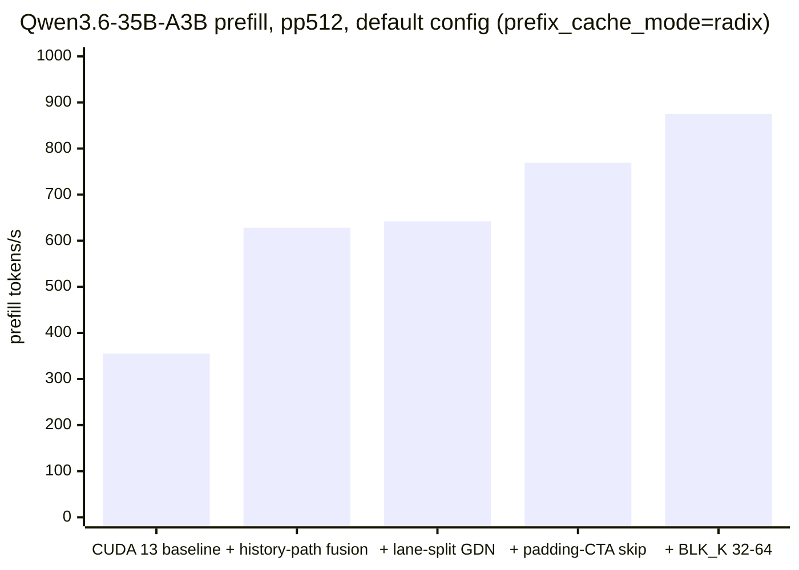
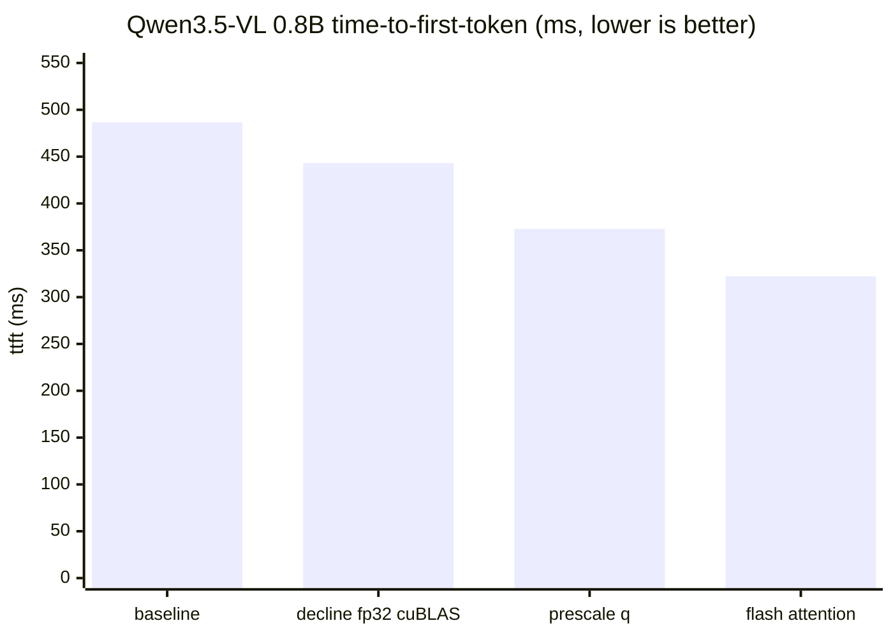

# [Issue #3492] POC for qwen3.5 / qwen3.6 support optimized for AGX Orin

source: https://github.com/mlc-ai/mlc-llm/issues/3492
state: open | updated: 2026-07-27T22:30:10Z
labels: new-models

## 正文

https://github.com/alansrobotlab2/mlc-llm/tree/qwen3_5
https://github.com/alansrobotlab2/mlc-llm/blob/qwen3_5/qwen3_5.md
https://github.com/alansrobotlab2/mlc-llm/blob/qwen3_5/worklog.md
https://github.com/alansrobotlab2/mlc-llm/tree/qwen3_5/.claude/plans

I had a need to get qwen3.6-35b-a3b working on my orin agx. Here are the results from claude code hacking away at it for about 3 days.  If there's anything here worthwhile you're welcome to it.   

approx 2x performance compared to unsloth q4 35b model, 1.3x unsloth 0.8b model.  Probably also benefits the other qwen3.5 and qwen3.6 models.  ymmv.

### qwen3.6-35b-a3b benchmark results
| tg     | MLC q4f16_1 v2+FI | llama.cpp Q4_K_S¹ | llama.cpp Q4_K_XL² | ratio (vs Q4_K_XL) |
|---:|---:|---:|---:|---:|
|  512   | **54.46**         | 29.19              | 28.26              | **1.927×**         |
| 1024   | **54.30**         | 29.30              | 28.21              | **1.925×**         |
| 2048   | **54.07**         | 29.31              | 28.13              | **1.922×**         |
| 4096   | **53.69**         | 29.04              | 28.07              | **1.913×**         |
| 8192   | **53.00**         | 28.48              | 27.86              | **1.902×**         |
| **Δ tg512→tg8192** | **−2.7 %** | **−2.4 %**        | **−1.4 %**        | flat              |

### qwen3.5-0.8b benchmark results
| tg   | llama.cpp Q4_K_XL (pure tg) | MLC q4f16_g16e + FI | ratio |
|---:|---:|---:|---:|
|  512 | 100.3 | **134.82** | **1.345×** |
| 1024 | 100.1 | **134.29** | **1.341×** |
| 2048 |  99.7 | **133.54** | **1.340×** |
| 4096 |  98.0 | **132.17** | **1.349×** |
| 8192 |  96.5 | **129.59** | **1.343×** |

### Claude's summary
Starting point (~10 tps). Bench harness was reporting blended pp+tg numbers, batch_decode was being routed through the wrong path, and the dlight-default GEMM grid was tuned for Hopper.

Phase 1–4 — kernel & router fixes (10 → 52.6 tps). Pinned batch_decode batch_size=1 to unlock the gemv MoE path (+128%); replaced the serial top-k softmax router with a parallel kernel (+6.3%); fixed the sm_87 dlight GEMV tile (+6.9%); register-cached gdn_func state (+2.4%). MTP self-spec + B-ext spec decode were both empirically ruled out — token-agreement collapsed under fp16 drift.

Phase 5–7 — KV cache experiments. fp8 was a structural loss on Orin; int8 shipped throughput-neutral as a capacity lever; mxfp4 lost to LUT cost. Plumbing kept for sm_89+ ports.

Phase 8 — hybrid prefix cache. TTFT 17.7× on the 35B. Spec-batch hang fixed en route.

Phase 9b — the prefill unlock. Stage 9.2's tile-tuning lever returned only +2.9%, confirming the hand-schedule was near-locally-optimal. The real win was Stage 2d: a tensor-core (wmma) MoE GEMM with int4-dequant and lookup-table dispatch, hitting 16.9 TFLOPS in the hottest kernel vs ~0.5 TFLOPS scalar. Combined with re-enabling FlashInfer (the Phase 8 rebuild had silently flipped flashinfer=0), pp512 went 207.95 → 561.16 tps (2.70×) and tg recovered to 54.35.

End state: pp 561.5 ± 0.4, tg flat from 54.46 → 53.00 across 512 → 8K depth, 1.85× over llama.cpp Q4_K_XL at every depth. The old §14.1 long-ctx crossover is closed; both stacks are now weight-BW bound with near-identical decay shape.

It includes changes to TVM as well as exploring:
- mtp>1 (net negative on orin)
- fp8 kv cache (net negative on orin)
- int8 kv cache (possibly improves long contexts)
- mxfp4 kv cache
- improved prefill 2x over baseline

## 评论 (4)

### EricEttes · 2026-05-01

I read your note on sm_87 missing for FlashInfer; I have a PR open at FlashInfer to add that for the Jetson Orin Nano/NX/AGX. Feel free to checkout my fork to test whether it works with your branch, on my tests, speed increased with around 20%. Hopefully they’ll merge is someday :-)

https://github.com/EricEttes/flashinfer

Make sure to add the correct CUDA arch (.bashrc entry is the easiest)

echo 'export FLASHINFER_CUDA_ARCH_LIST="8.7"' >> ~/.bashrc
source ~/.bashrc

### wangk-ge · 2026-05-13

The TVM submodule hasn't been submitted? I can't see the code changes for TVM.

### alansrobotlab2 · 2026-07-12

Apologies @wangk-ge , I didn't know what was happening with my commits to a detached head submodule.
TVM was the only submodule I needed to make changes to.
All tvm changes are here:
https://github.com/alansrobotlab2/relax/tree/qwen3_5-tvm

### alansrobotlab2 · 2026-07-27

So after upgrading jetpack to 7.2 with cuda 13.2 and anthropic releasing opus 5 i thought we'd take another crack at the codebase.

Claude's summary:

## Update: same branch, re-measured and re-optimized on JetPack 7.2 / CUDA 13.2

Follow-up to the original post. The box was re-bootstrapped from JetPack 6.2.2 / CUDA 12.6 onto
**JetPack 7.2 / CUDA 13.2 / LLVM 18**, which raised an obvious question — *how much of the original
result was CUDA 12.6, and what is left on the table in the new toolchain?*

**Answer to the first half: none of it.** The toolchain move is a wash to within noise. Answer to the
second half: quite a lot, and not where the original write-up said it was. Everything below is on the
same branch, all of it committed.

> Branch: https://github.com/alansrobotlab2/mlc-llm/tree/qwen3_5
> Full working record (measurements, refutations, traps): [`workplan-cuda-13.md`](https://github.com/alansrobotlab2/mlc-llm/blob/qwen3_5/workplan-cuda-13.md)

---

### TL;DR

| | before this work (on CUDA 13.2) | now | Δ |
|---|---:|---:|---:|
| **35B-A3B decode**, tg512 | 54.13 tps | **60.0 tps** | **+10.8%** |
| **35B-A3B prefill**, pp512, *default* config | 355 tps | **875 tps** | **+146%** |
| **Qwen3.5-VL 0.8B**, ttft | 486.7 ms | **322.2 ms** | **−33.8%** |
| **Qwen3.5-VL 0.8B**, `image_embed` | 337.3 ms | **172.7 ms** | **−48.8%** |

Both prefill figures are filler-prompt numbers, measured like-for-like; on real prose the current
lib is **839 tps** at pp512 and **945** at pp2048. (Why that distinction matters: trap 3 in §6.)

Nothing here changes model output. Every state-touching change is gated bit-exact or against a
high-margin token gate; the VL work gates **184/184 exact** at every step.

---

### 1. CUDA 13 itself is a wash — that is the finding, not a preamble

Three runs plus warmup, clocks pinned, identical protocol and identical libs on both stacks —
**Qwen3.6-35B-A3B**, `q4f16_1`, MoE GEMM v2 + FlashInfer:

| tg | CUDA 12.6 | CUDA 13.2 | Δ |
|---:|---:|---:|---:|
| 512 | 54.46 | 54.13 | −0.6% |
| 1024 | 54.30 | 54.00 | −0.6% |
| 2048 | 54.07 | 53.83 | −0.4% |
| 4096 | 53.69 | 53.34 | −0.7% |
| 8192 | 53.00 | 52.68 | −0.6% |
| pp512 | 561.5 | 566.33 | +0.9% |

**Qwen3.5-0.8B** in the original post's config (`q4f16_g16e` + FlashInfer): tg512 134.82 →
**133.47** (−1.0%), tg8192 129.59 → **128.16**, pp512 2870 → **2889** (+0.7%).

Run-to-run spread across engine loads is ~0.5%, so the decode delta is at the edge of noise. Prefill
marginally up, decode marginally down, depth-flat behaviour preserved. **Verdict: parity.**

nvcc 13.2 also reproduces 12.6 codegen — the hot MoE kernels come out at 1.002 / 0.948 ms against
1.0016 / 0.9495 ms, matching within 0.1%.

If you are on JetPack 6.x and wondering whether the upgrade buys throughput: **it does not.** It buys
a supported toolchain, and it costs you a few landmines (§6).

The re-measurement was still worth doing, because it surfaced that **the default configuration had
never been benchmarked at all** — see §3.

---

### 2. Prefill: 355 → 875 tps on the default configuration

| milestone | pp512 (tps) | what landed |
|---|---:|---|
| CUDA 13 baseline | 355 | — |
| + history-path conv & recurrent fusion | 628 | in-place GDN state on the *copy* path |
| + lane-split GDN recurrence | 642 | wider grid on the recurrence kernel |
| + padding-CTA skip | 769 | MoE GEMM: zero trip count for sentinel tiles |
| + `BLK_K` 32 → 64 | **875** | one k-step = one 32 B sector, half the barriers |

⚠️ Those are **filler-prompt** numbers, which run ~4% optimistic on a MoE (see §6). On real prose the
current lib measures:

| 35B-A3B, prose, `radix` | tps |
|---|---:|
| pp128 | 549.7 |
| **pp512** | **839.4** |
| pp2048 | 945.1 |

Decode is unchanged by all of it (59.2–60.1 tps across the three prompt lengths).

---

### 3. The reason prefill was that far down: the default path was never measured

This is the part worth stealing regardless of the kernels.

**`prefix_cache_mode` decides which forward path prefill takes on a hybrid (GDN + attention) model.**
Under the default `radix`, prefill goes through `forward_with_history` — a *copy* path. Only
`disable` uses the fused path. The bench harness hardcoded `prefix_cache_mode="disable"` **and**
reused one prompt across runs, so radix runs 2+ were pure cache hits.

Net effect: every prefill number in the original write-up was measured on a configuration users do
not get. On the default, the 35B was getting **355 tps against a 645 tps headline** — 55%. The
history-path fusions above are what closed it:

| radix ÷ disable, prefill | before | after |
|---|---:|---:|
| 35B-A3B | 1.64× slower | **1.03×** |
| 0.8B | 2.77× slower | **1.04×** |

Generalised, and it cost most of a session to learn: **an A/B is only an A/B if the two libs differ
by the change under test, and a benchmark only measures what its harness lets it configure.**

---

### 4. Decode: 54.13 → 60.0 tps

Four landed changes, each measured and gated separately:

| change | effect |
|---|---|
| GDN input-projection merge (`in_proj_qkvzab`) | +2.8% tg / −1.1% pp |
| **In-place GDN recurrent state** | **+6.0% decode**, prefill neutral |
| **In-place GDN conv state** | **+2.4% decode, +15.3% prefill** |
| Concurrent serving on hybrid models | correctness fix — 6 requests at 2.67× serial wall clock |

The conv-state result was the surprise: the TE conv it replaces is ~42× off roofline, and the prefill
win was larger than the decode win it was built for.

**The concurrency item was a real bug, not an optimization.** Multi-sequence *prefill* was broken on
hybrid models — decode was fine, which is why it had not shown up. Two pre-existing grammar-path
aborts got fixed on the way.

---

### 5. New: Qwen3.5-VL — the vision tower had never been measured

`image_embed` turned out to be **69% of time-to-first-token** and had never had a number taken on it
in any configuration. Three changes, all gated **184/184 exact**:

| VL 0.8B, cat fixture (2520 patches) | start | now | Δ |
|---|---:|---:|---:|
| `image_embed` | 337.3 ms | **172.7 ms** | **−48.8%** |
| prefill (652 tok) | 149.4 | 149.5 | — |
| decode | 88.1 tok/s | 87.8 | — |
| **ttft** | **486.7 ms** | **322.2 ms** | **−33.8%** |

1. **cuBLAS was net-negative on this tower** — offloading the fp32 QK matmul cost 47 ms, entirely
   from a DRAM round trip a broken fusion forced. Declining fp32 offloads: −8.9% ttft.
2. **Prescaling `q`** — `matmul(q,k^T)·c ≡ matmul(q·c,k^T)`, algebraically free. Worth **0.00 ms by
   itself**, and that null result is the whole point: it proved the fusion cuBLAS was being blocked
   by was worthless, so the matmul became eligible after all and step 1's guard could be **retired**
   (it was buying 3 ms and giving up 70). Net −70 ms, and the shipped config now has cuBLAS *on*.
3. **Flash attention in TIR** (new) — one kernel replaces `QK^T` + `softmax` + `P@V` and never
   materializes the `(12, 2520, 2520)` fp32 score matrix, **305 MB**. `image_embed` −22.6%, ttft
   −13.5%.

The flash kernel is fp32 throughout — fp16 collapses tower parity on this model (max diff 2.03 /
rel 39%), so the fp16 tensor-core path every reference implementation uses is off the table, and HF
runs this tower with eager attention so there was nothing to port.

---

### 6. Traps, for anyone reproducing

Each of these cost real time:

1. **Compiling the 35B needs `MLC_MOE_GEMM_V2=1` in the environment and nothing warns you.** Without
   it the int4 MoE GEMM silently falls back to a scalar loop: pp512 reads 225 instead of 645. Check a
   build with `nm -D --defined-only lib.so | grep -c 'group_gemm_v2\|moe_dispatch_tables'` — expect 4.
2. **`prefix_cache_mode` decides the forward path** (§3). A prefill gate run at the default tests
   nothing you think it does.
3. **The default bench prompt picks winners on a MoE.** `PROMPT_FILLER` is one sentence repeated —
   **11 distinct tokens per 512**, against 219 for prose. Harmless on a dense model; on a MoE the
   router keys on hidden states, so it concentrates routing, and expert concentration sets the GEMM's
   tile count. It made every pp512 figure ~4% optimistic and got one A/B's **sign** wrong.
4. **`-DCMAKE_CUDA_ARCHITECTURES=87` is mandatory on CUDA 13.** Without an explicit arch, TVM falls
   through to `75;80;86;89;90` and **sm_75 was removed in CUDA 13**. Also `USE_NVTX OFF` (CUDA 13
   dropped `libnvToolsExt`), and `cudaDeviceProp::clockRate` is gone (the attribute query survives).
5. **`cutlass=1` is inert on sm_87** — it is gated to `sm_90a`/`sm_100a`, so it does nothing. Same for
   `cublas_gemm=1` on the text path.
6. **`jetson_clocks` is worth ~1.4%** even though `nvpmodel` already reports max clocks. Always
   `sudo nvpmodel -m 0 && sudo jetson_clocks` before benching.
7. **`ncu` needs root** on this box (`RmProfilingAdminOnly: 1`). Everything here came from `nsys`,
   which works unprivileged.

---

### 7. Things that were measured and refuted

Recorded because a negative result that cost a day is worth as much as a win, and because several of
these are the "obvious next thing" someone else will otherwise try:

- **A cudagraph allowlist for the eager `rnn_state` launches** — eager launches went *up* after the
  in-place state change, GPU idle did not move, and an eager launch costs ~0.9 µs at the margin.
- **Widening the MoE GEMM's `BLK_M`** — dies at short prompts, and the reason is not what four of my
  own earlier write-ups claimed. It is not padding-row compute; removing that entirely
  recovers 2 points of a 31-point gap. It is **register pressure**: a wider tile needs 4× the wmma
  accumulator and A-matrix fragments, which is exactly 24 more registers per thread, which drops
  resident CTAs 6 → 4. Full occupancy on sm_87 needs ≤40 registers and the shipped tile sits at
  exactly 40 — so **no wide tile can ever be occupancy-neutral here**.
- **Shared memory as the wide tile's cost** — worth 1.00×. It never binds; registers do.
- **Guarding the padding rows' shared-memory stores** — *removes* work and costs 25–32%, because the
  branch stops four independent global loads being issued together. A guard that removes work can
  still lose 30% by collapsing memory-level parallelism.
- **Static-shape specialization for the VL tower** — 6.5%, not the 4× it was assumed to be worth.

Two general TVM/TIR findings from the flash-attention work, both invisible in the TIR source, both
worth 2.25× together, and neither of which warns:

- **A `scope="local"` buffer indexed by a loop variable is local *memory*, not registers.** Use
  `T.unroll` on register-tile loops so the indices are literals.
- **`CompactBufferAllocation` shrinks a buffer to the region actually touched**, so bank-conflict
  padding that is never written does not exist. Write the pad column, or set the stride with
  `sch.storage_align`.

---

### 8. Comparison notes / caveats

- **llama.cpp figures have not been re-taken on JetPack 7.2.** Against the numbers in the original
  post (Q4_K_XL tg512 = 28.26, measured on 6.2.2), 60.0 tps is **2.12×** — but that ratio mixes two
  toolchains and should be treated as indicative, not measured.
- **Two different 0.8B configs appear here.** §1's parity numbers are `q4f16_g16e`, the original
  post's config. The optimization work used `q0f16` (unquantized fp16) as its correctness and
  fast-iteration vehicle — pp512 4787, pp2048 5073, tg512 90.8 on prose. The two are **not**
  comparable to each other.
- All 35B numbers are `q4f16_1` + MoE GEMM v2 + FlashInfer, `prefix_cache_mode=radix`, 3 runs after
  1 warmup, real-prose prompts.
- Every VL number is at the one fixture's 2520 patches. The flash result was checked at 1260 / 2520 /
  5040 and the ratio is flat, but the rest of the VL work rests on that single shape.

---

### 9. Still open

- **`MLCEngine` cannot drive this vision tower at all** — its `image_embed` call site uses the llava
  signature and `ImageData` hardcodes the embed size. Every VL number above came from the raw VM. The
  model is measurable but **not servable**; that is its own project.
- Chunked GDN recurrence (~12.5% ceiling by Amdahl, and it gives up bit-exactness).
- A dual-tile MoE dispatch, now re-costed down to a single prompt-length cell.

As before — if any of this is useful, it is yours.

