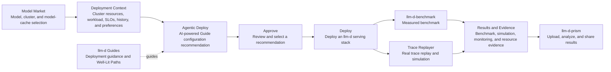

# [Issue #2475] llm-d-lens: An AI-Powered llm-d Extension for Easier Deployment with Optimal Configurations

source: https://github.com/llm-d/llm-d/issues/2475
state: open | updated: 2026-09-22T13:44:37Z
labels: 

## 正文

## What is llm-d-lens?

**llm-d-lens** is a unified workspace for turning llm-d Guides into deployable serving stacks for real workloads and cluster constraints. It brings models, infrastructure, AI-powered recommendations, deployment, and real-world simulation into one workflow, making optimal resource-aware deployments easier to realize.

## Interoperability with llm-d-prism

llm-d-lens and [`llm-d/llm-d-prism`](https://github.com/llm-d/llm-d-prism) are interoperable projects. Lens manages the decision workflow from cluster and model context through Agentic Deployment, evaluation, and simulation; Prism provides a destination for publishing evaluation results for cross-source analysis, sharing, and review.

| Focus | llm-d-prism | llm-d-lens |
| --- | --- | --- |
| Core question | "What performance, cost, and quality tradeoffs do the available benchmark data show?" | "Given known workload and resource constraints, which llm-d Well-Lit Path and configuration should be evaluated or adopted?" |
| Interoperability | Receives published Lens evaluation results for cross-source analysis, sharing, and review. | Publishes evaluation results and supporting evidence to Prism when teams need cross-source analysis, sharing, and review. |

llm-d-lens turns focused Guide guidance into an executable plan for the target environment. It combines target-cluster resources, workload requirements, historical evidence, and operator preferences to recommend, deploy, and validate a serving stack through measured benchmarks or real-world trace replay and simulation. Teams can publish the resulting evidence to Prism for analysis, sharing, and review.

## What does llm-d-lens offer?

**llm-d-lens** streamlines the adoption of llm-d Guides for real clusters, workloads, and operational requirements. AI-powered recommendations translate model, resource, workload, and operational context into deployable Guide configurations. Lens unifies deployment, monitoring, and real-world trace replay and simulation in one workflow for production-representative validation and continuous improvement. Its capabilities are organized into core themes:

### AI-Powered Configuration Recommendations and Deployment

Model Market is the entry point for selecting a model, target cluster, and model-cache storage. Agentic Deploy uses AI-powered recommendations to produce deployable configurations for supported Guides. Recommendations combine the selected model, current cluster capacity, resource budget, workload shape, latency SLOs, historical performance evidence, and operator preferences. Each recommendation explains the selected option, alternatives, and contributing factors.

Teams review the recommendation, approve the preferred candidate, and deploy it with its configuration and evidence preserved for later evaluation and review.

### Cluster and Resource Management

llm-d-lens manages cluster connections, hardware discovery, resource allocation, and cluster snapshots in one workspace, while continuously surfacing cluster and deployment status. These provide the real target-environment context that Agentic Deploy needs to recommend deployable candidates rather than abstract configurations.

### MCP Playground

The MCP Playground lets teams select a deployed model or external provider and chat with Lens through the platform's MCP tools, making cluster, deployment, and evaluation information available in a single conversational workspace. Tool activity is visible in the conversation, and actions that change resources require user approval.

### Real-World Trace Replay and Simulation

The built-in Trace Player replays registered real request traces and runs simulations with tools such as AIPerf and Trace Replayer, producing latency, throughput, and error results. Teams can explore capacity and SLO assumptions with workloads that approximate real traffic before or after a benchmark; simulation results remain clearly distinct from measured benchmark results.

### Well-Lit Path Evaluation, Evidence, and Reproduction

llm-d-lens treats an end-to-end stack, rather than an individual component, metric, or configuration fragment, as the decision unit. It provides a shared framework for comparing Well-Lit Paths and alternative configurations against workloads, resource use, performance, and SLOs. The Evaluation workspace records configurations, deployment attempts, results, and available monitoring and resource evidence, and supports comparison and analysis. Teams can publish results to Prism for sharing and review or archive them locally for traceability and reproduction.

### Built for the llm-d Ecosystem

llm-d-lens adopts the Well-Lit Path definitions from `llm-d`, reuses experiments and reports from `llm-d-benchmark`, and organizes its own cluster, deployment, monitoring, and simulation capabilities into an adoption workflow. It does not recreate an inference runtime, benchmarking protocol, or control plane. Instead, it aligns with llm-d Well-Lit Paths and specialized projects so stack evaluation and adoption benefit from the evolving ecosystem.

### Guided Installation

The Install Wizard provides an interactive or unattended path to install and run llm-d-lens on supported Ubuntu systems, including HTTPS setup and service lifecycle management.

## Implemented Capabilities

| Capability | Implementation | Value | llm-d Ecosystem Boundary |
| --- | --- | --- | --- |
| Agentic Deployment | Model Market sends the selected model, cluster, and model-cache context to Agentic Deploy. AI-powered recommendations combine capacity, workload and SLO needs, historical evidence, and operator preferences, then guide the user to an approved, deployable configuration. | Connects AI-powered recommendations with resource-aware deployment, preserving the recommendation and supporting evidence as part of the deployment record. | Adopts the definitions of `llm-d` Well-Lit Paths without redefining official paths; users approve recommendations before deployment. |
| MCP Playground | Lets users chat with Lens through MCP tools using a selected deployment or external provider, with visible tool activity and user approval for resource-changing actions. | Brings conversational access to cluster, deployment, and evaluation workflows while keeping tool use transparent and controlled. | Exposes llm-d-lens capabilities through MCP; it does not replace an inference runtime or external MCP clients. |
| Simulation | A resident Simulation service that replays registered request traces against OpenAI-compatible serving endpoints. It supports AIPerf and Trace Replayer and produces normalized latency, throughput, and error results. | Adds lower-cost capacity and SLO exploration before and after real benchmarks, and links outputs to deployment evidence and audit records. | It does not provide general vLLM runtime modeling; simulation results are not labeled as measured benchmark results, and it does not train prediction models or offer request-level latency scores. |
| Evaluate | Defines candidates and supported controls, workloads, traffic sweeps, and SLOs; serializes execution; tracks deployment readiness, retries, cancellation, cleanup, and historical attempts. | Makes the evaluated conditions and lifecycle visible, so comparisons are grounded in actual deployed candidates and compatible measurement points. | Uses `llm-d-benchmark` tooling and workload inputs for measured benchmarks; Lens does not redefine its benchmark protocol or report schema. |
| Cluster | Cluster sources and connection sessions, environment and hardware discovery, resource allocation, cluster snapshots, and use of the selected cluster as context for configuration, deployment, and evaluation. | Grounds Well-Lit Path decisions in the accelerators, nodes, and resource conditions of the target cluster rather than abstract configurations. | Builds on existing Kubernetes and monitoring capabilities to provide cluster context in Lens; it does not overlap with a separate llm-d project. |
| Monitor and evidence | Monitoring API integration, deployment observability context, saved resource and monitoring evidence, request-level SLO goodput, and compatible KV working-set collection. | Presents runtime state beside performance outcomes and retains evidence after temporary deployments are cleaned up. | Does not replace Prometheus collection or a real-time autoscaling control loop. |
| Results and reproduction | Provides Guide-aware result analysis, same-condition comparisons, result and evidence exports, and Benchmark Report integration in Prism for sharing and review. | Allows every Well-Lit Path decision to be traced back to the evaluated object, runtime state, measured or simulated result, and supporting evidence. | `llm-d-prism` remains the entry point for cross-source analysis, report upload, sharing, and review. |
| Install Wizard | Provides interactive and unattended installation, HTTPS setup, service startup, and uninstall support for Ubuntu x86_64. | Reduces the effort required to install, operate, and remove a local llm-d-lens environment. | Installation automation for llm-d-lens; it does not install or manage an llm-d cluster. |

Together, these capabilities form an **adoption loop**: cluster facts constrain candidate options, deployment evidence identifies the evaluated object, monitoring explains runtime state, and benchmarks or trace-driven simulations provide evidence for review and decision-making.

## Adoption Workflow

Model Market establishes the selected model, cluster, and model-cache context. Lens then gathers target-cluster resources, workload and SLO requirements, applicable historical evidence, and operator preferences before Agentic Deploy recommends a deployable Guide configuration. Teams review and approve a recommendation, then Lens deploys the configuration according to the applicable Guide. Teams can run a measured benchmark or replay real traces through the Simulation service. The Evaluation workspace preserves execution, monitoring, and resource evidence; Prism supports cross-source analysis, sharing, and review of published results and evidence.

## Next Steps

- Add RAG-based historical evidence retrieval so Agentic Deploy can use relevant deployment, evaluation, and simulation results to improve recommendation quality and explain its rationale.
- Add role-based access control (RBAC) for platform resources and workflows, including appropriate permissions for MCP tools.
- Enhance MCP and the MCP Playground with broader workflow coverage, stronger contextual assistance, and improved operator controls.

## Conclusion

llm-d-lens is an AI-powered llm-d extension for easier deployment with optimal configurations. It combines hardware discovery and available resources with workload requirements, SLOs, historical evidence, and operator preferences to recommend a deployable Guide configuration for the target cluster. Lens preserves the configuration, recommendation, and supporting evidence throughout the deployment lifecycle. Measured benchmarks and real-world trace replay and simulation then validate performance, capacity, and service quality without requiring teams to reconstruct what was deployed or why.

The platform removes the operational gap between a Guide and a production-oriented deployment: it grounds choices in the cluster that is actually available, helps teams select and approve an optimal configuration, deploys it through a single workflow, and retains the context needed to operate and improve it.

## 评论 (2)

### seanhorgan · 2026-09-16

Thanks for submitting this @VincyZhang and for your presentation during the community meeting today.

What's the best way to learn more about the integration points with llm-d-prism ? 

Related: I'd really like to make sure we align on a source of truth for validated benchmarks, which we are building the llm-d results store: https://prism.llm-d.ai/?view=results-store. I want to distinguish this from prism, which provides a visual layer on top of the results store.

### maugustosilva · 2026-09-18

@chcost We (@maugustosilva @Vezio @mengmeiye) has a deep dive demo and discussion with the authors of this proposal and agreed to recommend its incorporation as a new repository under `llm-d-incubation` as soon as possible. 

In addition to using several of already existing projects, such as `llm-d-prism` and `llm-d-benchmark`, the framework fills a sorely needed gap - `llm-d` stack (parameter) design and lifecycle - and it is already (at least externally, since we did not have direct access to the code yet) at a level of maturity that would allow for a quick adoption.

I have discussed with the main stakeholders on `llm-d-lens` (@xiaojun-zhang @VincyZhang @joshuayao) and they communicated to me that their main goal has been, from the beginning, to incorporate this framework back into the core of `llm-d`
