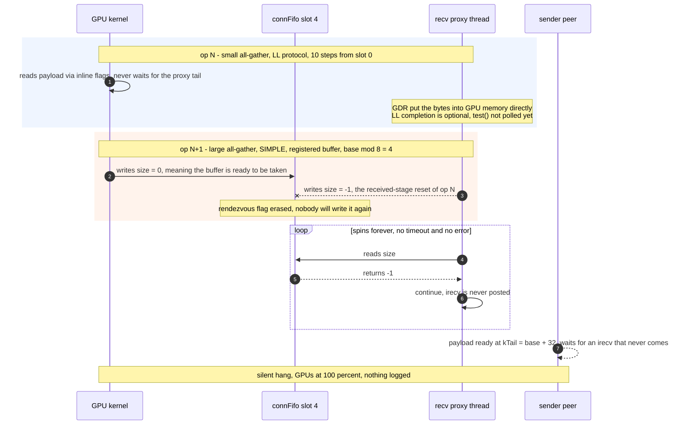

# [Issue #2389] [Issue]: Silent hang: recv proxy erases the netReg rendezvous flag written by the kernel

source: https://github.com/NVIDIA/nccl/issues/2389
state: closed | updated: 2026-09-14T04:33:25Z
labels: 

## 正文

### How is this issue impacting you?

Application hang.

A receiving proxy clears a `connFifo` slot as part of retiring an earlier op, and in doing
so erases the one-shot rendezvous flag that the GPU has already published for a *later*
network-registered op. The gate waiting for that flag then spins forever: no error, no
timeout, no log line. GPUs stay at 100 % utilization and the job never progresses again.

Reproducible on current master within seconds by a 90-line PyTorch script on two nodes,
with no model involved. We have a candidate patch that removes the hang and has been
running in production since; it will follow as a separate pull request.

### Share Your Debug Logs

All excerpts below come from one capture on master `fd168324`, run with
`NCCL_DEBUG=INFO NCCL_DEBUG_SUBSYS=INIT,GRAPH,ENV,TUNING,NET,REG,ALLOC` and per-rank
`NCCL_DEBUG_FILE`. Full per-rank logs from all 16 ranks, `NCCL_TOPO_DUMP_FILE` /
`NCCL_GRAPH_DUMP_FILE`, and `nvidia-smi` / `ibv_devinfo` snapshots from both nodes are
available — say the word and we will post them or run any additional capture you want.

**Init, rank 0 — the preconditions of the bug are all visible here:**

```
NCCL INFO NCCL version 2.31.2+cuda12.9
NCCL INFO [Rank 0] ncclCommInitRankConfig comm 0xaf9d8c0 rank 0 nranks 16 cudaDev 0 nvmlDev 0 busId 19000 commId 0x34f62d82d3a1f91d - Init START
NCCL INFO NCCL_PXN_DISABLE set by environment to 1.
NCCL INFO Using network IB
NCCL INFO NET/IB : Using [0]mlx5_0:1/IB [1]mlx5_3:1/IB [2]mlx5_4:1/IB [3]mlx5_5:1/IB [4]mlx5_6:1/IB [5]mlx5_9:1/IB [6]mlx5_10:1/IB [7]mlx5_11:1/IB [RO]; OOB eth0
NCCL INFO Connected all rings, use ring PXN 0 GDR 1
NCCL INFO Channel 00/0 : 9[1] -> 0[0] [receive] via NET/IB/0/GDRDMA/flush=None
```

**Buffer registration is live** — this is what makes the affected path reachable:

```
NCCL INFO rank 0 - NET register userbuff 0x7fe232600000 (handle 0x7fe208458a70), buffSize 25165824
NCCL INFO register comm 0xaf9d8c0 buffer 0x7fe1ec000000 size 402653184
NCCL INFO rank 0 - NET reuse buffer 0x7fe1ec000000 size 402653184 (baseAddr 0x7fe1ec000000 size 402653184) handle 0x7fe2083ef900
```

**The hang.** All 16 ranks stop at the same replay step and never resume. The `STALL`
lines are printed by the reproducer's own watchdog after its 120 s timeout — NCCL and CUDA
log nothing at all, and the per-rank NCCL logs simply end mid-steady-state:

```
repro: world=16 graph=60 colls (tiny 24 KiB + large 24 MiB, alternating)

STALL rank 0 on node0: no progress past step 324 for 120s
STALL rank 3 on node0: no progress past step 324 for 120s
STALL rank 4 on node0: no progress past step 324 for 120s
...
STALL rank 14 on node1: no progress past step 324 for 120s
STALL rank 15 on node1: no progress past step 324 for 120s
```

**`nvidia-smi` during the hang** — every GPU pinned at 100 % with a flat footprint,
because each kernel is spinning on a flag that will never be set:

```
| 0  NVIDIA H100 80GB HBM3   On | 119W / 700W | 1897MiB / 81559MiB | 100%  Default |
| 1  NVIDIA H100 80GB HBM3   On | 120W / 700W | 1913MiB / 81559MiB | 100%  Default |
| 2  NVIDIA H100 80GB HBM3   On | 117W / 700W | 1897MiB / 81559MiB | 100%  Default |
...
| 7  NVIDIA H100 80GB HBM3   On | 119W / 700W | 1913MiB / 81559MiB | 100%  Default |
```

**Where the CPU time goes inside a hung rank.** `cuda-gdb` (the only debugger in this
container) never finished attaching to a hung process, so this is a thread census taken
from `/proc`, two samples 5 s apart. Exactly one thread is on CPU with no wait channel and
its counters keep growing — the proxy progress thread, spinning:

```
TID      COMM               ST   WCHAN                     UTIME    STIME
11034    python             R    0                         72225    90548   <- sample 1
11034    python             R    0                         72447    90835   <- sample 2 (+2.2 s of CPU in 5 s wall)

8876     python             S    futex_wait_queue_me         155      152   main thread
10996    python             S    ib_uverbs_event_read          0        0   CQ threads, all idle
10931    pt_nccl_watchdg    S    futex_wait_queue_me           3        2
```

Nothing is waiting on the network — every completion-queue thread is idle. `py-spy` on the
same rank shows the main thread blocked inside `torch.cuda.CUDAGraph.replay()`, i.e. the
launch queue is full because the previous replay never completed:

```
Thread 8873 (idle): "MainThread"
    replay (torch/cuda/graphs.py:139)
    main (nccl_reg_stall_repro.py:125)
```

### Steps to Reproduce the Issue

Two nodes × 8 GPUs. A CUDA graph alternates a tiny all-gather (24 KiB, so it runs LL) with
a large all-gather (24 MiB per rank, so it runs SIMPLE out of a network-registered buffer)
on the same communicator, and the graph is replayed in a loop. No model, no checkpoint.

```bash
# same command on both nodes
NCCL_PXN_DISABLE=1 NCCL_NET_GDR_READ=1 NCCL_NET_GDR_LEVEL=SYS \
NCCL_CUMEM_ENABLE=0 NCCL_NVLS_ENABLE=0 \
NCCL_DEBUG=INFO NCCL_DEBUG_SUBSYS=INIT,GRAPH,ENV,TUNING,NET,REG,ALLOC \
torchrun --nnodes=2 --nproc-per-node=8 \
         --rdzv-backend=c10d --rdzv-endpoint=<node0>:29500 \
         nccl_reg_stall_repro.py --stall-secs 120
```

Three independent runs hung at replay step 17, 18 and 324 — the spread is what you would
expect from a race, and it matches production, where the same bug took between 40 minutes
and 3 hours to surface per engine.

What changes the outcome:

| Configuration | Result |
|---|---|
| as above | hangs within seconds |
| `NCCL_PXN_DISABLE=0` (PXN enabled) | no hang — the user buffer is never registered |
| GDR unavailable on any leg of the ring | no hang — same reason |

`comm->useGdr` is a global AND across every connection of every rank, so a single non-GDR
leg disables registration comm-wide and makes the whole cluster look healthy. To confirm
registration is actually live in your run, check for `NET register userbuff` /
`NET reuse buffer` and `use ring PXN 0 GDR 1` in the log.

<details>
<summary><b><code>nccl_reg_stall_repro.py</code></b></summary>

```python
#!/usr/bin/env python3
"""Standalone reproducer: NCCL silent hang on graph-registered recv buffers.

Two nodes x 8 GPUs, PyTorch + NCCL only. A CUDA graph alternates a tiny
all-gather (LL protocol, inline flags) with a large all-gather (SIMPLE
protocol, network-registered buffers) on the same connections. Replaying that
graph makes the receiving proxy erase the one-shot rendezvous flag the kernel
has already published, and the transfer never starts again: every rank keeps
spinning with 100% GPU utilization and no error is ever reported.

Expected on an affected build: "STALL" within minutes (usually < 5).
Expected on a fixed build: "step ..." lines forever.
"""

import argparse
import os
import socket
import sys
import threading
import time

import torch
import torch.distributed as dist


class StallWatch(threading.Thread):
    """Report a stall from a side thread: the main thread is inside the driver."""

    def __init__(self, timeout: int, rank: int):
        super().__init__(daemon=True)
        self.timeout = timeout
        self.rank = rank
        self.step = 0

    def run(self) -> None:
        last_step, last_seen = -1, time.monotonic()
        while True:
            time.sleep(5)
            if self.step != last_step:
                last_step, last_seen = self.step, time.monotonic()
                continue
            if time.monotonic() - last_seen < self.timeout:
                continue
            print(
                f"STALL rank {self.rank} on {socket.gethostname()}: "
                f"no progress past step {self.step} for {self.timeout}s",
                flush=True,
            )
            return


def build_graph(args, tiny_in, tiny_out, big_in, big_out):
    """Capture pairs of (tiny LL op, large SIMPLE op) into one CUDA graph."""
    graph = torch.cuda.CUDAGraph()
    with torch.cuda.graph(graph):
        for _ in range(args.colls_per_graph // 2):
            dist.all_gather_into_tensor(tiny_out, tiny_in)
            dist.all_gather_into_tensor(big_out, big_in)
    return graph


def main() -> int:
    parser = argparse.ArgumentParser()
    parser.add_argument("--hidden", type=int, default=6144)
    parser.add_argument("--tokens", type=int, default=2048, help="large op, SIMPLE")
    parser.add_argument("--tiny-tokens", type=int, default=2, help="small op, LL")
    parser.add_argument("--colls-per-graph", type=int, default=60)
    parser.add_argument("--report-every", type=int, default=2000)
    parser.add_argument("--stall-secs", type=int, default=180)
    parser.add_argument("--max-steps", type=int, default=1_000_000)
    args = parser.parse_args()

    rank = int(os.environ["RANK"])
    local_rank = int(os.environ["LOCAL_RANK"])
    world = int(os.environ["WORLD_SIZE"])
    torch.cuda.set_device(local_rank)
    dist.init_process_group("nccl")

    device = torch.device("cuda", local_rank)
    dtype = torch.bfloat16
    tiny_numel = args.tiny_tokens * args.hidden
    big_numel = args.tokens * args.hidden
    tiny_in = torch.randn(tiny_numel, dtype=dtype, device=device)
    tiny_out = torch.empty(tiny_numel * world, dtype=dtype, device=device)
    big_in = torch.randn(big_numel, dtype=dtype, device=device)
    big_out = torch.empty(big_numel * world, dtype=dtype, device=device)

    # Warm the communicator up outside the graph: capture requires the
    # connections (and their proxy threads) to exist already.
    for _ in range(3):
        dist.all_gather_into_tensor(tiny_out, tiny_in)
        dist.all_gather_into_tensor(big_out, big_in)
    torch.cuda.synchronize()
    dist.barrier()

    graph = build_graph(args, tiny_in, tiny_out, big_in, big_out)
    torch.cuda.synchronize()
    dist.barrier()

    if rank == 0:
        mb = big_numel * 2 / 2**20
        print(
            f"repro: world={world} graph={args.colls_per_graph} colls "
            f"(tiny {tiny_numel * 2 / 1024:.0f} KiB + large {mb:.0f} MiB, alternating)",
            flush=True,
        )

    watch = StallWatch(args.stall_secs, rank)
    watch.start()

    t0 = time.monotonic()
    for step in range(1, args.max_steps + 1):
        graph.replay()
        # Sync every step: replay only enqueues, a stuck kernel is visible here.
        torch.cuda.synchronize()
        watch.step = step
        if rank == 0 and step % args.report_every == 0:
            dt = time.monotonic() - t0
            print(
                f"step {step}  {step / dt:.1f} replays/s  "
                f"{step * args.colls_per_graph / dt:.0f} colls/s  "
                f"elapsed {dt / 60:.1f}m",
                flush=True,
            )
    return 0


if __name__ == "__main__":
    sys.exit(main())
```

</details>

### NCCL Version

2.31.2 + cuda 12.9 (master `fd168324`). Also reproduced on 2.28.9.

### Your platform details

| | |
|---|---|
| NCCL | master `fd168324` (2.31.2) and 2.28.9, both built from source, unmodified |
| CUDA | 12.9 (driver API 12090) |
| GPUs | 2 nodes × 8 × H100 80GB HBM3 |
| Network | InfiniBand, 8 HCAs per node (`mlx5_0`, `mlx5_3`, `mlx5_4`, `mlx5_5`, `mlx5_6`, `mlx5_9`, `mlx5_10`, `mlx5_11`), GDRDMA enabled |
| Topology in use | `Connected all rings, use ring PXN 0 GDR 1` |
| Launcher | `torchrun`, PyTorch NCCL backend |

### Error Message & Behavior

**Expected:** the loop keeps replaying, or NCCL reports an error.
**Actual:** every rank spins forever inside `ncclProxyProgress`; no error path is taken and
nothing is logged.

## Analysis

Line references are to master `fd168324` (2.31.2).



**1. The received stage resets the slot of every completed receive step, for every
protocol** — `src/transport/net.cc:1649-1654`:

```c
int buffSlot = (sub->base + sub->received) % NCCL_STEPS;
struct recvNetResources* resources = (struct recvNetResources*)(sub->connection->transportResources);
volatile struct ncclConnFifo* connFifo = (volatile struct ncclConnFifo*)resources->recvMem->connFifo;
connFifo[buffSlot].size = -1;
```

**2. An LL receiver finishes long before the proxy notices.** LL carries its flags inline
and is consumed by a `ld.volatile` spin (`src/device/prims_ll.h:114`, `:132`, `:144`);
`conn->tail` is never consulted. With GDRDMA the NIC writes the payload straight into GPU
memory, and for LL receives the completion is decoupled outright — the request is replaced
by `NCCL_NET_OPTIONAL_RECV_COMPLETION` (`src/transport/net.cc:1612`). The GPU can therefore
retire an LL op while the proxy still holds unpolled completions for it.

**3. The GPU enters the next op and publishes the rendezvous flag** — if that op is a
graph-registered SIMPLE op, `RoleWaitRecv` writes it at `src/device/prims_simple.h:517-522`:

```c
if (netRegFlag) {
  if (conn->flags & NCCL_DIRECT_NIC) {
    flags |= NetRegMode;
    connFifo[step % NCCL_STEPS].size = 0;
  }
}
```

**4. The late reset from (1) lands on the same physical slot and erases it.** `NCCL_STEPS`
is 8, so `(base_LL + received) % 8` and `base_next % 8` collide routinely — a 10-step LL op
walks over every slot, including the one the next op claims as its base:

```text
slot index = (base + step) % 8

op N   LL, base%8 = 0, 10 steps :  0  1  2  3 [4] 5  6  7  0  1
op N+1 SIMPLE registered, base%8 = 4        ^
                                     same physical slot
```

The gate then waits for a value that will never be written again, with no timeout and no
error — `src/transport/net.cc:1569` and `:1584`:

```c
if (!sub->regBufferReady && connFifo[sub->base % NCCL_STEPS].size == -1) continue;
sub->regBufferReady = 1;
```

The receiver never posts `irecv`, so the registered sender cannot begin its rendezvous
`isend` either, and the ring stalls silently.

Nothing orders the kernel's entry into an op against the proxy's bookkeeping: the kernel
advances `conn->step` from the LL op's destructor on the device while the proxy still has
unpolled completions for that same op. This looks like a genuine race between device
consumption and host-side bookkeeping rather than a lost wakeup.

## Evidence from production

Before building the reproducer we hit this in production five times (a large MoE inference
workload, `tp=16` across two nodes, CUDA graphs on, MTTF 0.7–3 h per engine). An
instrumented build with per-op proxy telemetry gave the same picture every time.

<details>
<summary><b>Proxy snapshots at the moment of a production hang</b></summary>

The stuck receive — the kernel has entered the op (`kHead == base`, so `RolePostRecv`
already ran), the buffer is registered (`reg=1`), the protocol is SIMPLE (`proto=2`), and
all eight FIFO slots read `-1`:

```
snap pid=5032 recv ch=1 op=49922 STUCK-SPINNING: base=948496 nsteps=60
     posted=0 received=0 transmitted=0 done=0
     kTail=948495 kHead=948496          <- kernel is inside the op
     fifo[base%8]=-1  reg=1 proto=2     <- gate waits for connFifo[0].size != -1
     fifo8=[-1, -1, -1, -1, -1, -1, -1, -1]
```

Its sender peer has the payload ready but cannot start the rendezvous without the
receiver's `irecv`:

```
snap pid=5031 send ch=1 op=49924 STUCK-SPINNING: base=948496 nsteps=60
     posted=40 received=60 transmitted=32 done=32
     kTail=948528 = base+32           <- payload published by the kernel
     fifo[base%8]=786432 reg=1 proto=2
```

Proxy threads are alive and spinning — the poll loop simply has nothing to do:

```
hb pid=5031 tid=11502 SPINNING 587521 loops/2s activeOps=4
hb pid=5032 tid=11503 SPINNING 592375 loops/2s activeOps=4
```

Per-channel accounting of steps staged by the producer versus steps retired by the proxy:

```
delta +8970  ch 1  asked 1881000  delivered 1872030
delta +8850  ch 0  asked 1881002  delivered 1872152
```

The op history on the stuck channel shows the alternation that drives the race — a 15-step
LL op, then a 60-step registered SIMPLE op, on the same connection:

```
tail pid=5032 ch=1 BaseRecv op=49588 nsteps=15
tail pid=5032 ch=1 Done     op=49588 nsteps=15
tail pid=5032 ch=1 BaseRecv op=49590 nsteps=60
tail pid=5032 ch=1 Done     op=49590 nsteps=60
tail pid=5032 ch=1 BaseRecv op=49592 nsteps=15
```

</details>

<details>
<summary><b>Invariants across all five production hangs</b></summary>

* The stuck op is always the **first registered SIMPLE op following a run of LL ops** — a
  phase boundary in the workload, not a random op.
* `base % NCCL_STEPS == 4` in all five, and the preceding op is always a 10-step LL op
  starting at slot 0, which covers slot 4 on its fifth step.
* `kTail == base - 2` on the paired sender in all five.
* The host never lost `NCCL_DIRECT_NIC` (zero clearing events), and the device-side work
  descriptor read out of a CUDA core dump had `netRegUsed=1` — the flag **was** written, so
  only an eraser explains `size == -1`.
* Nodes with PXN enabled, or where a single ring leg lacks GDR, never hang. This is why the
  hang rate varied wildly between otherwise identical node sets, and why the bug can look
  like flaky hardware.

</details>

Happy to run any instrumented build or collect further diagnostics on this hardware — a
hung job is still up.


## 评论 (2)

### KaimingOuyang · 2026-09-09

/mirror dev

### xiaofanl-nvidia · 2026-09-14

This issue has been fixed on dev branch: https://github.com/NVIDIA/nccl/commit/eb6d302bd8090c3c9bdb466bf8b65e4a5b8ffcc4. 
It will be part of the 2.32u1 release. Closing. 
