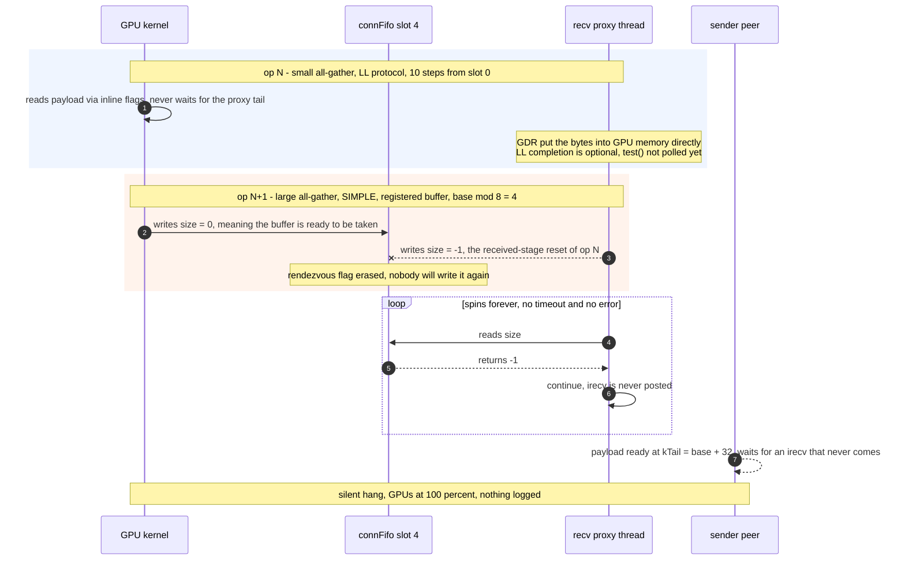
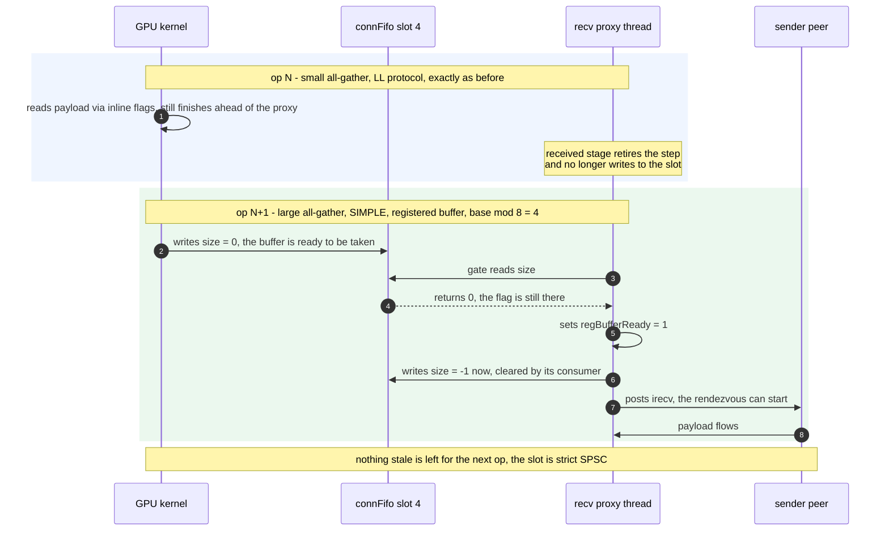

# [PR #2390] net: fix hang from erased netReg rendezvous flag

source: https://github.com/NVIDIA/nccl/pull/2390
state: closed | updated: 2026-09-14T04:32:50Z
labels: 

## 正文

## Description

With network-registered buffers a receiving proxy erases a one-shot rendezvous flag that
the GPU has already published, and the transfer never restarts: no error, no timeout, no
log line, every GPU at 100 % utilization. The issue carries the full symptom, proxy
telemetry from five production hangs and a standalone PyTorch reproducer that hits the
hang within seconds on two nodes.

`recvProxyProgress` resets the `connFifo` slot of every completed receive step in its
received stage, for every protocol (`src/transport/net.cc:1649-1654`). An LL receiver,
however, consumes its payload through inline flags and never waits for the proxy, so the
kernel can retire an LL op while the proxy still holds unpolled completions for it — with
GDRDMA the NIC writes straight into GPU memory and the LL completion is decoupled outright
(`NCCL_NET_OPTIONAL_RECV_COMPLETION`, `src/transport/net.cc:1612`). The kernel then enters
the next op and, if that op is network-registered, publishes the rendezvous flag
`connFifo[step % NCCL_STEPS].size = 0` (`src/device/prims_simple.h:517-522`). `NCCL_STEPS`
is 8, so the LL op's late reset lands on the very same slot and erases the flag. The gate
at `src/transport/net.cc:1569` / `:1584` then spins on `-1` forever: the receiver never
posts `irecv`, the registered sender cannot start its rendezvous either, and the ring
hangs silently.

**Before this patch:**



The collision is plain arithmetic — a 10-step LL op walks over every one of the 8 slots,
including the one the next op claims as its base:

```text
slot index = (base + step) % 8

op N   LL, base%8 = 0, 10 steps :  0  1  2  3 [4] 5  6  7  0  1
op N+1 SIMPLE registered, base%8 = 4        ^
                                     same physical slot
```

## Related Issues

Fixes #2389

## Changes & Impact

One place, `src/transport/net.cc`, inside `recvProxyProgress`: the two registered-buffer
gates become one-shot and clear the slot on the readiness transition, and the reset in the
received stage goes away.

The slot has exactly one writer, the device, and exactly one reader, the gate. This patch
removes the protocol-agnostic reset from the received stage and clears the slot at its
consumer instead, right after the gate passes, on both registered paths. The slot becomes
strict SPSC, so no assumption about the ordering of proxy bookkeeping against device
consumption remains.

```diff
@@ recvProxyProgress, both registered-buffer gates
-                if (!sub->regBufferReady && connFifo[sub->base % NCCL_STEPS].size == -1) continue;
-                sub->regBufferReady = 1;
+                if (!sub->regBufferReady) {
+                  if (connFifo[sub->base % NCCL_STEPS].size == -1) continue;
+                  sub->regBufferReady = 1;
+                  connFifo[sub->base % NCCL_STEPS].size = -1;
+                }

@@ recvProxyProgress, received stage
              int receivedStepId = sub->received;
-             int buffSlot = (sub->base + sub->received) % NCCL_STEPS;
-             struct recvNetResources* resources = (struct recvNetResources*)(sub->connection->transportResources);
-             volatile struct ncclConnFifo* connFifo = (volatile struct ncclConnFifo*)resources->recvMem->connFifo;
-             connFifo[buffSlot].size = -1;
              sub->transSize = sizes[i];
```

The clear runs once per op, on the transition where readiness is consumed, and both branches
stay inside the existing `if (sub->reg)` guards, so the non-registered path keeps its
current behaviour byte for byte.

**After this patch:**



The kernel still runs ahead of the proxy — that is inherent to LL and is not what this
patch touches. What changes is that the late bookkeeping of op N no longer writes to a slot
that by then belongs to op N+1. As a side effect this also closes a pre-existing aliasing
window between two registered ops whose bases collide modulo `NCCL_STEPS`, where the second
op's flag could be cleared by the first op's bookkeeping.

The obvious smaller edit — keeping the received-stage reset but skipping it for registered
subs — is **not** equivalent and would trade the hang for silent corruption. The gate waits
for `size != -1`, so the slot has to be back at `-1` before the kernel of the next op writes
its `0`; if nothing restores it, the gate sees a stale `0` from the previous op, declares
the buffer ready before the kernel has entered the op, and posts `irecv` into a buffer the
device has not published yet. Clearing at the consumer keeps that invariant while removing
the race.

Another alternative considered was clearing the slot when the next op is posted rather than
when the flag is consumed. It removes the same hang, but it keeps a dependency on the order
in which the proxy scheduler walks sub-args, and it does not close the aliasing window
above.

### Testing

Tested on two nodes × 8 H100 80GB HBM3 over InfiniBand with GDRDMA (`PXN 0 GDR 1`), CUDA
12.9, on top of `dev` (2.32.0).

The reproducer from #2389 — a CUDA graph alternating a tiny LL all-gather with a large
network-registered SIMPLE all-gather on one communicator, replayed in a loop — hangs the
unpatched build at replay step 17, 18 and 324 in three independent runs, within seconds of
the loop starting. With this patch the same command on the same nodes ran 6000+ replay
steps at 860 collectives/s and was stopped healthy by hand. As a control, the unpatched
build with `NCCL_GRAPH_REGISTER=0` does not hang either and logs no `NET register userbuff`
lines at all, which is what the analysis predicts: the race exists only on the registered
path.

nccl-tests was run on both builds, 16 ranks over the two nodes, sizes from 8 B to 2 GB
with correctness checking on (`-c 1`), in two modes each: plain, and with registration and
CUDA graphs (`-R 1 -G 20`) so that the patched code is actually exercised — the gates this
patch touches live under `if (sub->reg)` and are never reached otherwise. Both libraries
ran back to back inside one job on the same nodes, and the unpatched build was measured
twice, before and after, to bound run-to-run drift. Every run reports
`Out of bounds values : 0 OK`.

Average bus bandwidth, GB/s:

| Test | Mode | `dev` (1st) | `dev` (2nd) | `dev` + patch | Patch vs. `dev` mean |
|---|---|---|---|---|---|
| all_reduce | plain | 67.56 | 67.57 | 67.66 | +0.1 % |
| all_reduce | reg + graph | 67.03 | 67.20 | 67.21 | +0.1 % |
| all_gather | plain | 36.76 | 36.73 | 36.72 | −0.1 % |
| all_gather | reg + graph | 36.14 | 36.18 | 36.08 | −0.2 % |
| reduce_scatter | plain | 36.47 | 36.82 | 36.34 | −0.8 % |
| reduce_scatter | reg + graph | 35.74 | 35.87 | 35.58 | −0.6 % |
| broadcast | plain | 31.48 | 31.57 | 31.61 | +0.3 % |
| broadcast | reg + graph | 31.54 | 31.60 | 31.51 | −0.2 % |

The largest deviation of the patched build from the mean of the two unpatched runs is
0.8 %, on a test where the two unpatched runs themselves differ by 1.0 %, so the patch is
inside the measurement noise. The patched revision also builds clean with `WERROR=1`
(`-Werror`, `-Werror=all-warnings`), zero warnings.

Beyond the microbenchmarks, the same patch on top of 2.28.9 has been carrying our
production inference fleet since, where the unpatched build used to hang every 0.7–3 hours
per engine.

Not tested: non-IB transports (no such fabric here), the PXN path and any configuration
where buffer registration is disabled comm-wide — in those the touched code is not reached
at all; single-node-only paths such as NVLS; protocols other than LL and SIMPLE on the same
connection; Windows.

## Performance Impact

None on the data path. One store moves from one place in the proxy loop to another: the
received stage does one store less per completed step, the two registered gates do one
store more per op, and both of those sit inside branches that only registered receives
take. No new synchronization, no extra polling, no change to the non-registered path.


## 评论 (5)

### enpimashin · 2026-09-05

@sylvesterkaczmarek 

Thank you for pointing out, made with your block of code

Ran same testing as before:

6000 steps with no hang
Perf tests updated in PR description

### enpimashin · 2026-09-09

@xiaofanl-nvidia sorry for the ping — I think this PR may have been missed because the
head branch doesn't follow CONTRIBUTING.md (it's `dev`, not a feature branch). My mistake 

Should I recreate it from a named branch, or is it fine as is? 

Fix for the silent hang in #2389.

### sjeaugey · 2026-09-09

Hi @enpimashin, it wasn't missed, we've been reviewing it. Sorry for the lack of communication on this thread.

The patch looks ok to me; we're going to test the patch internally to ensure it doesn't break anything.

I'll let @KaimingOuyang drive its merge.

### sjeaugey · 2026-09-09

/mirror dev

### xiaofanl-nvidia · 2026-09-14

This has been merged to dev branch here: https://github.com/NVIDIA/nccl/commit/eb6d302bd8090c3c9bdb466bf8b65e4a5b8ffcc4

Closing. 

## Review (2)

### sylvesterkaczmarek · 2026-09-05 · COMMENTED

I think the new clear is still wider than the one-shot consumer transition described in the PR. Once `sub->regBufferReady` becomes `1`, the guard no longer reads the FIFO state, but every later pass through the registered posting path still executes `connFifo[sub->base % NCCL_STEPS].size = -1`. Since the receive side revisits this path while `sub->posted < sub->nsteps`, the same slot can be cleared repeatedly rather than only when readiness is first consumed.

That seems important for the aliasing argument: if the device advances far enough to publish a later operation’s rendezvous flag into the same physical slot while this sub still has posting work, a subsequent unconditional store can erase the new flag again. The code would match the stated SPSC/consume-once invariant more directly if the transition were structured as:

```cpp
if (!sub->regBufferReady) {
  if (connFifo[sub->base % NCCL_STEPS].size == -1) continue;
  sub->regBufferReady = 1;
  connFifo[sub->base % NCCL_STEPS].size = -1;
}
```

Could you either make the clear one-shot in both registered branches, or explain why repeated stores after `regBufferReady` is set cannot overlap a subsequent device publication? A targeted stress/regression for that timing would be useful if the repeated store is intentional.

### sylvesterkaczmarek · 2026-09-06 · APPROVED

The rendezvous flag is now consumed exactly once when `regBufferReady` transitions from false to true, in both registered receive paths. Later posting passes no longer clear the reused FIFO slot. This matches the consume-once invariant from my previous review and resolves that concern.
