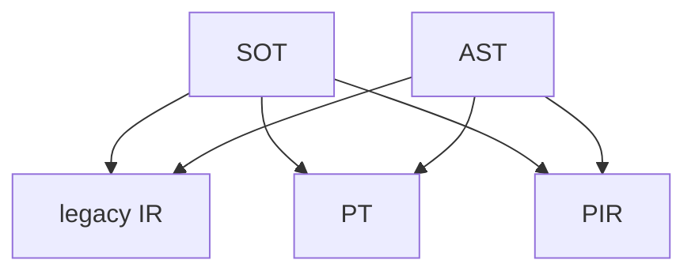

# [Issue #61464] 动转静单测开发调试手册

source: https://github.com/PaddlePaddle/Paddle/issues/61464
state: closed | updated: 2026-09-22T15:37:01Z
labels: 

## 正文

## 背景

由于动转静是静态图的主要出口，因此动转静单测同时承担了动转静本身功能验证和静态图子图级别功能验证，而随着新一代静态图 IR 表示的推出和动转静 SOT 模式的引入，动转静单测需要同时验证 2 种动转静模式（SOT 和 AST）和 3 种 IR 模式（legacy IR、PT 和 PIR）的功能，也就是 2x3=6 种模式需要测试。为了确保开发推进过程中所有组合模式的功能都能够正常工作，我们为动转静单测添加了一个测试机制，确保不仅能够全面测试 6 种组合模式的情况，还能灵活启用和禁用某些模式。

## 开发示例

从一个示例开始

```python
from dygraph_to_static_utils import (
    Dy2StTestBase,
    test_legacy_and_pt_and_pir,
)

def foo():
    ...

class TestCaseA(Dy2StTestBase):
    @test_legacy_and_pt_and_pir
    def test_case_a(self):
        input = ...
        static_fn = paddle.jit.to_static(foo)
        static_res = static_fn(input)
        dygraph_res = foo(input)
        np.testing.assert_allclose(static_res.numpy(), dygraph_res.numpy())

if __name__ == '__main__':
    unittest.main()
```

一个最简动转静单测如上所示，这里需要注意几点（CI 中均有检查项），之后会在机制讲解里详细说明原因

### 1. 继承 `Dy2StTestBase`

原则上动转静单测都应该继承自 `Dy2StTestBase`，以自动生成多种模式的 case，非端到端单测除外（不使用 `to_static` 接口）

错误示例：

```python
class TestCaseA(unittest.TestCase):
    @test_legacy_and_pt_and_pir
    def test_case_a(self):
        ...
```

这种情况是完全错误的，使用 `test_legacy_and_pt_and_pir` 但没有继承 `Dy2StTestBase`，最后单测仍然只会跑一次，因为没有生成多个 case

### 2. 不应该使用 `to_static` 的装饰器形式

不应该在测试 case 外使用 `@to_static` 装饰原来的函数，而应该在测试 case 內直接调用 `to_static`，否则在测试 case 內访问到的可能是已经转换后的函数

错误示例：

```python
@to_static
def foo():
    ...

class TestCaseA(Dy2StTestBase):
    @test_legacy_and_pt_and_pir
    def test_case_a(self):
        static_fn = foo
        static_res = static_fn(input)
        dygraph_res = foo(input)
        np.testing.assert_allclose(static_res.numpy(), dygraph_res.numpy())
```

这里 `to_static` 只会执行一次，可能会影响不同 case 间的模式切换

应该改为上面示例中的写法

## CI 检查

我们为上述几种模式添加了 CI 检查，如果遇到了 CI 拦截，可本地执行如下命令复现：

```bash
python test/dygraph_to_static/check_approval.py test/dygraph_to_static
```

## 模式组合

动转静单测中目前存在 2 种动转静模式和 3 种 IR 模式，因此一共有 2x3=6 种组合模式，如下图所示：

> [!NOTE]
>
> 实际动转静 SOT 中还有一个特殊的 SOT + MIN_GRAPH_SIZE=0 的模式，也就是实际上会跑 7 次，但为了简化说明，以下讲解都会忽略掉该模式



在不装饰任何装饰器的情况下，动转静单测会自动测试动转静 AST + SOT 2 种和 IR legacy IR + PT 2 种共 4 种组合模式，PIR 模式目前正在推进，并没有作为默认模式启用

为了能够灵活地控制一个单测的模式，我们在 `dygraph_to_static_utils` 里提供了一些装饰器，可以用来控制单测的模式，这些装饰器都是以 `test_` 开头的，目前有以下几种：

-  控制动转静模式的
   -  `test_ast_only` 该单测仅在 AST 模式下运行
   -  `test_sot_only` 该单测仅在 SOT 模式下运行
-  控制 IR 模式的
   -  `test_legacy_only` 该单测仅在 legacy IR 模式下运行
   -  `test_pt_only` 该单测仅在 PT 模式下运行
   -  `test_pir_only` 该单测仅在 PIR 模式下运行
   -  `test_legacy_and_pt` 该单测仅在 legacy IR 和 PT 模式下运行（默认，等同于不装饰）
   -  `test_legacy_and_pir` 该单测仅在 legacy IR 和 PIR 模式下运行
   -  `test_legacy_and_pt_and_pir` 该单测在 legacy IR、PT 和 PIR 全模式下运行（正在推进中，大多数单测都已经装饰了本装饰器）

这里举几个例子：

-  仅装饰 `test_ast_only`，则该单测只会跑 1 种动转静模式和 2 种默认的 IR 模式，即跑 2 次
-  仅装饰 `test_legacy_only`，则该单测只会跑 1 种 IR 模式和 2 种默认的动转静模式，即跑 2 次
-  同时装饰 `test_ast_only` 和 `test_pir_only`，则该单测只会跑 1 种动转静模式和 1 种 IR 模式，即跑 1 次

> [!TIP]
>
> 这里的「同时装饰 `test_ast_only` 和 `test_pir_only`」是在调试 PIR 模式时非常常见的技巧，可以确保该单测只会跑一次，比较推荐在调试时候使用。

新增单测如无特殊理由都应该装饰 `test_legacy_and_pt_and_pir`，同时监控老 IR 和 PIR 理想态。

## 单测生成机制

与其它装饰器不同（如 `test_with_pir_api`），动转静单测的装饰器并不会直接修改原来的函数，而是在原来的函数基础上 patch 一个属性，然后在创建 class 时，通过 metaclass 来动态生成多个 case，以确保了多种模式可以灵活组合和控制启停，可以保证不同模式切换的平稳推进

这里以一个简单的例子来说明单测生成机制

```python
class MyTest(Dy2StTestBase):
    @set_to_static_mode(
        ToStaticMode.AST | ToStaticMode.SOT
    )
    @set_ir_mode(IrMode.LEGACY_IR | IrMode.PIR)
    def test_case1(self):
        ...
```

我们最终大概会生成如下 4 个单测

```python
class MyTest(unittest.TestCase):
    def test_case1__ast_legacy_ir(self):
        fn = MyTest.test_case1
        fn = to_legacy_ir_test(fn)
        fn = to_ast_test(fn)
        fn(self)

    def test_case1__ast_pir(self):
        fn = MyTest.test_case1
        fn = to_pir_test(fn)
        fn = to_ast_test(fn)
        fn(self)

    def test_case1__sot_legacy_ir(self):
        fn = MyTest.test_case1
        fn = to_legacy_ir_test(fn)
        fn = to_sot_test(fn)
        fn(self)

    def test_case1__sot_pir(self):
        fn = MyTest.test_case1
        fn = to_pir_test(fn)
        fn = to_sot_test(fn)
        fn(self)
```

原来的 `test_case1` 并没有被修改，而是基于此生成多个不同的函数挂在了测试 class 上，测试 case 的生成是在 `Dy2StTestBase` 创建时做的，因此如果不继承 `Dy2StTestBase` 直接用 `test_legacy_and_pt_and_pir` 是没有任何效果的，因为它只会 patch 一个属性而已

同样地，如果同时使用 `Dy2StTestBase` 和 `test_with_pir_api` 这类装饰器是有风险的，因为它们的机制完全不同

> [!TIP]
>
> 由于这里单测生成名字是有规律的，因此也可以利用生成名字的规律来指定跑某一个单测，方便调试，比如：
>
> ```bash
> python test/dygraph_to_static/test_foo.py MyTest.test_case1__ast_pir
> ```

这样就可以只跑 AST+PIR 模式的 case 了

如果仍有不清楚的问题，请联系 @SigureMo 或者直接在本 issue comment

## 评论 (4)

### SigureMo · 2024-09-14

- #68229 默认 IR 模式切换为 PT + PIR

### SigureMo · 2025-04-30

- #72165 添加新的 mode `BackendMode`，并将默认模式替换为如下五种：

| ToStaticMode | IrMode | BackendMode |
| - | - | - |
| `SOT` | `PIR` | `PHI` |
| `SOT` | `PIR` | `CINN`<sup>new</sup> |
| `AST` | `PIR` | `PHI` |
| `AST` | `PT` | `PHI` |
| `SOT_MGS10` | `PIR` | `PHI` |


### SigureMo · 2025-08-18

- #74698 彻底退掉老 IR（含 PT），默认模式为如下 4 种：

| ToStaticMode | IrMode | BackendMode |
| - | - | - |
| `SOT` | `PIR` | `PHI` |
| `SOT` | `PIR` | `CINN` |
| `AST` | `PIR` | `PHI` |
| `SOT_MGS10` | `PIR` | `PHI` |


### SigureMo · 2025-08-18

- #74715 彻底移除 `IrMode`，只保留 `ToStaticMode` 和 `BackendMode`
