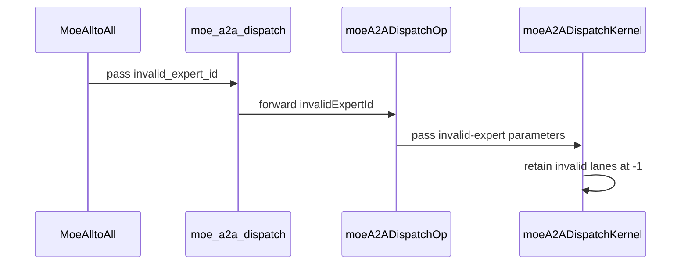

# [PR #4017] skip invalid experts in dispatch

source: https://github.com/flashinfer-ai/flashinfer/pull/4017
state: open | updated: 2026-09-24T15:05:16Z
labels: run-ci, op: comm

## 正文

<!-- .github/pull_request_template.md -->

## 📌 Description

When running data parallel deployments, the input batch size is often padded to the largest batch size across all ranks. Inference engines can save communication b/w and compute by marking these pad tokens with an invalid expert id (for example see: https://github.com/vllm-project/vllm/blob/67fe73b2b47e2927af1e5ec6fb91e16e3b075940/vllm/model_executor/layers/fused_moe/modular_kernel.py#L1155-L1160). 

I found that DeepEP has an explicit check for `-1` destination expert id (https://github.com/deepseek-ai/DeepEP/blob/main/deep_ep/include/deep_ep/impls/dispatch.cuh#L104C24-L104C36), but the NVLink One-Sided dispatch in flashinfer does not have such a check. Instead, this kernel currently dispatches all of these pad tokens to rank 0, which can actually degrade performance in cases where the input is heavily padded

This PR adds logic to skip dispatching pad tokens, reusing the existing optional `invalid_token_expert_id` parameter of `MoeAlltoAll.dispatch()`.

### Benchmarks

Benchmarks results were collected using `moe_comm.py` on 4xGB200. Padding was added to simulate one rank processing the full batch size, while others process only 50% of the full batch size worth of tokens.

| Num Tokens             | Before (ms) | After this change (ms) |
| ---------------------- | ----------- | ---------------------- |
| 1024 (3 ranks w/ 512)  | 0.136       | 0.098                  |
| 2048 (3 ranks w/ 1024) | 0.252       | 0.145                  |
| 4096 (3 ranks w/ 2048) | 0.474       | 0.276                  |
| 8192 (3 ranks w/ 4096) | 0.974       | 0.478                  |

## 🚀 Pull Request Checklist

Thank you for contributing to FlashInfer! Before we review your pull request, please make sure the following items are complete.

### ✅ Pre-commit Checks

- [x] I have installed `pre-commit` by running `pip install pre-commit` (or used your preferred method).
- [x] I have installed the hooks with `pre-commit install`.
- [x] I have run the hooks manually with `pre-commit run --all-files` and fixed any reported issues.

> If you are unsure about how to set up `pre-commit`, see [the pre-commit documentation](https://pre-commit.com/).

## 🧪 Tests

- [x] Tests have been added or updated as needed.
- [x] All tests are passing (`unittest`, etc.).


<!-- This is an auto-generated comment: release notes by coderabbit.ai -->
## Summary by CodeRabbit

## New Features

* Added optional support for marking invalid expert assignments during MoE all-to-all dispatch.
* Invalid assignments are treated as padding and excluded from routing and data movement.
* Exposed the invalid-expert option through the public Python dispatch API.

## Bug Fixes

* Prevented invalid expert entries from producing destination routing or copy indices.
* Improved validation for configurations containing invalid expert assignments.

<!-- end of auto-generated comment: release notes by coderabbit.ai -->

## 评论 (17)

### coderabbitai[bot] · 2026-07-17

<!-- This is an auto-generated comment: summarize by coderabbit.ai -->
<!-- review_stack_entry_start -->

[](https://app.coderabbit.ai/change-stack/flashinfer-ai/flashinfer/pull/4017?utm_source=github_walkthrough&utm_medium=github&utm_campaign=change_stack)

<!-- review_stack_entry_end -->
<!-- recent_review_start -->

No actionable comments were generated in the recent review. 🎉

<details>
<summary>ℹ️ Recent review info</summary>

<details>
<summary>⚙️ Run configuration</summary>

**Configuration used**: defaults

**Review profile**: CHILL

**Plan**: Pro Plus

**Run ID**: `4b48c3b7-f4f2-4294-a762-583f59dc8ff8`

</details>

<details>
<summary>📥 Commits</summary>

Reviewing files that changed from the base of the PR and between 76c583655cf789051fca5870fef2adb8e544b576 and d3381b54f46e7dcb7cfa8e526098b551bda690f4.

</details>

<details>
<summary>📒 Files selected for processing (4)</summary>

* `csrc/nv_internal/tensorrt_llm/kernels/communicationKernels/moeAlltoAllKernels.cu`
* `csrc/nv_internal/tensorrt_llm/kernels/communicationKernels/moeAlltoAllKernels.h`
* `csrc/trtllm_moe_alltoall.cu`
* `flashinfer/comm/trtllm_moe_alltoall.py`

</details>

<details>
<summary>🚧 Files skipped from review as they are similar to previous changes (4)</summary>

* csrc/nv_internal/tensorrt_llm/kernels/communicationKernels/moeAlltoAllKernels.h
* csrc/trtllm_moe_alltoall.cu
* csrc/nv_internal/tensorrt_llm/kernels/communicationKernels/moeAlltoAllKernels.cu
* flashinfer/comm/trtllm_moe_alltoall.py

</details>

</details>

---


<!-- recent_review_end -->
<!-- walkthrough_start -->

<details>
<summary>📝 Walkthrough</summary>

## Walkthrough

MoE all-to-all dispatch now accepts an optional invalid expert id across the Python API, C++ entrypoint, dispatch parameters, and CUDA kernel. Matching expert entries retain `-1` routing indices and are skipped during dispatch.

### Changes

**Invalid expert dispatch**

|Layer / File(s)|Summary|
|---|---|
|**Dispatch contract and API plumbing** <br> `csrc/nv_internal/tensorrt_llm/kernels/communicationKernels/moeAlltoAllKernels.h`, `csrc/trtllm_moe_alltoall.cu`, `flashinfer/comm/trtllm_moe_alltoall.py`|The dispatch parameters and Python/C++ entrypoints accept and forward an optional invalid expert id.|
|**Kernel invalid-entry routing** <br> `csrc/nv_internal/tensorrt_llm/kernels/communicationKernels/moeAlltoAllKernels.cu`|The CUDA kernel identifies matching expert entries, skips destination allocation, and receives the new parameter through both launch paths.|
|**MoE dispatch integration** <br> `flashinfer/comm/trtllm_moe_alltoall.py`|`MoeAlltoAll.dispatch` validates `expert_id_payload_index`, forwards the invalid token expert id, and retains conditional sanitization.|

**Estimated code review effort:** 2 (Simple) | ~10 minutes

<!-- final_review_risk_start -->
**Merge Risk:** _⚪ Minimal_ · up to `d3381`

The change skips padded tokens marked with invalid expert IDs during dispatch; no actionable merge-blocking risk remains, so it is merge-ready after normal checks and review.
<!-- final_review_risk_end -->

### Sequence Diagram(s)



**Suggested reviewers:** `anerudhan`

</details>

<!-- walkthrough_end -->
<!-- pre_merge_checks_walkthrough_start -->

<details>
<summary>🚥 Pre-merge checks | ✅ 5</summary>

<details>
<summary>✅ Passed checks (5 passed)</summary>

|         Check name         | Status   | Explanation                                                                                                |
| :------------------------: | :------- | :--------------------------------------------------------------------------------------------------------- |
|         Title check        | ✅ Passed | The title clearly and concisely summarizes the main change: skipping invalid experts during dispatch.      |
|      Description check     | ✅ Passed | The description explains the problem, implementation, benchmarks, testing, and completed checklist items.  |
|     Docstring Coverage     | ✅ Passed | No functions found in the changed files to evaluate docstring coverage. Skipping docstring coverage check. |
|     Linked Issues check    | ✅ Passed | Check skipped because no linked issues were found for this pull request.                                   |
| Out of Scope Changes check | ✅ Passed | Check skipped because no linked issues were found for this pull request.                                   |

</details>

</details>

<!-- pre_merge_checks_walkthrough_end -->
<!-- finishing_touch_checkbox_start -->

<details>
<summary>✨ Finishing Touches 💡 1</summary>

<!-- finishing_touch_suggestion:fix_ci -->
<details open>
<summary>🛠️ Fix failing CI checks 💡</summary>

- [ ] <!-- {"checkboxId": "6d21cfe8-ec3f-40e2-9222-b8318b64d3b0", "radioGroupId": "fix-ci-output-choice-group-unknown_comment_id"} -->   Create stacked PR
- [ ] <!-- {"checkboxId": "9f0d24fb-b419-4f01-baf0-8b26b6424f34", "radioGroupId": "fix-ci-output-choice-group-unknown_comment_id"} -->   Commit on current branch

</details>
<details>
<summary>🧪 Generate unit tests (beta)</summary>

- [ ] <!-- {"checkboxId": "f47ac10b-58cc-4372-a567-0e02b2c3d479", "radioGroupId": "utg-output-choice-group-unknown_comment_id"} -->   Create PR with unit tests

</details>

</details>

<!-- finishing_touch_checkbox_end -->
<!-- tips_start -->

---

Thanks for using [CodeRabbit](https://coderabbit.ai?utm_source=oss&utm_medium=github&utm_campaign=flashinfer-ai/flashinfer&utm_content=4017)! It's free for OSS, and your support helps us grow. If you like it, consider giving us a shout-out.

<details>
<summary>❤️ Share</summary>

- [X](https://twitter.com/intent/tweet?text=I%20just%20used%20%40coderabbitai%20for%20my%20code%20review%2C%20and%20it%27s%20fantastic%21%20It%27s%20free%20for%20OSS%20and%20offers%20a%20free%20trial%20for%20the%20proprietary%20code.%20Check%20it%20out%3A&url=https%3A//coderabbit.ai)
- [Mastodon](https://mastodon.social/share?text=I%20just%20used%20%40coderabbitai%20for%20my%20code%20review%2C%20and%20it%27s%20fantastic%21%20It%27s%20free%20for%20OSS%20and%20offers%20a%20free%20trial%20for%20the%20proprietary%20code.%20Check%20it%20out%3A%20https%3A%2F%2Fcoderabbit.ai)
- [Reddit](https://www.reddit.com/submit?title=Great%20tool%20for%20code%20review%20-%20CodeRabbit&text=I%20just%20used%20CodeRabbit%20for%20my%20code%20review%2C%20and%20it%27s%20fantastic%21%20It%27s%20free%20for%20OSS%20and%20offers%20a%20free%20trial%20for%20proprietary%20code.%20Check%20it%20out%3A%20https%3A//coderabbit.ai)
- [LinkedIn](https://www.linkedin.com/sharing/share-offsite/?url=https%3A%2F%2Fcoderabbit.ai&mini=true&title=Great%20tool%20for%20code%20review%20-%20CodeRabbit&summary=I%20just%20used%20CodeRabbit%20for%20my%20code%20review%2C%20and%20it%27s%20fantastic%21%20It%27s%20free%20for%20OSS%20and%20offers%20a%20free%20trial%20for%20proprietary%20code)

</details>


<sub>Comment `@coderabbitai help` to get the list of available commands.</sub>

<!-- tips_end -->

### aleozlx · 2026-07-17

/bot run tests/comm

### aleozlx · 2026-07-17

pls address conflict

### flashinfer-bot · 2026-07-17

GitLab MR [!993](https://nv/flashinfer/-/merge_requests/993) has been created, and the CI pipeline [#58511594](https://nv/flashinfer-ci/-/pipelines/58511594) is currently running. I'll report back once the pipeline job completes.

### aleozlx · 2026-07-17

code review: looks good

waiting for testing

### flashinfer-bot · 2026-07-17

[FAILED] Pipeline [#58511594](https://nv/flashinfer-ci/-/pipelines/58511594): 11/20 passed

### aleozlx · 2026-07-20

/bot run tests/comm

### flashinfer-bot · 2026-07-20

GitLab MR [!993](https://nv/flashinfer/-/merge_requests/993) has been updated with latest changes, and the CI pipeline [#58835331](https://nv/flashinfer-ci/-/pipelines/58835331) is currently running. I'll report back once the pipeline job completes.

### flashinfer-bot · 2026-07-21

[FAILED] Pipeline [#58835331](https://nv/flashinfer-ci/-/pipelines/58835331): 11/20 passed

### gnovack · 2026-07-22

Addressed the most recent merge conflicts. @aleozlx @bobboli  please take another look when you get a chance. thanks!

### aleozlx · 2026-07-31

/bot run tests/comm

### flashinfer-bot · 2026-07-31

GitLab MR [!993](https://nv/flashinfer/-/merge_requests/993) has been updated with latest changes, and the CI pipeline [#60394939](https://nv/flashinfer-ci/-/pipelines/60394939) is currently running. I'll report back once the pipeline job completes.

### flashinfer-bot · 2026-07-31

[SUCCESS] Pipeline [#60394939](https://nv/flashinfer-ci/-/pipelines/60394939): 18/18 executed test jobs passed

### coderabbitai[bot] · 2026-08-14

<!-- This is an auto-generated comment by CodeRabbit -->
> [!NOTE]
> GitHub couldn't provide a complete incremental comparison for this pull request, so CodeRabbit is performing a full review instead. This review may take a little longer.

### WoosukKwon · 2026-08-14

@aleozlx Can you please help merge this?

### flashinfer-bot · 2026-09-10

[SUCCESS] Pipeline [#60394939](https://nv/flashinfer-ci/-/pipelines/60394939): 18/18 executed test jobs passed

### flashinfer-bot · 2026-09-14

[SUCCESS] Pipeline [#60394939](https://nv/flashinfer-ci/-/pipelines/60394939): 18/18 executed test jobs passed

## Review (12)

### gemini-code-assist[bot] · 2026-07-17 · COMMENTED

## Code Review

This pull request introduces support for skipping dispatching of invalid/padding expert IDs in the MoE All-to-All communication kernels, saving bandwidth by treating specified expert IDs as padding. The changes span the CUDA kernels, C++ wrappers, and Python bindings. The review feedback focuses on improving robustness and safety by suggesting bounds checks for expert IDs in the CUDA kernel, initializing struct members to prevent uninitialized memory reads, and adding bounds checks for type casting in C++ and list indexing in Python.

> [!IMPORTANT]
> The [consumer version of Gemini Code Assist on GitHub](https://developers.google.com/gemini-code-assist/docs/review-repo-code) is being sunset. Starting **June 18, 2026**, new organization installations will be blocked, and all code review activity will officially cease on **July 17, 2026**.
> For more details on the timeline and next steps, please review the [Help Documentation](https://developers.google.com/gemini-code-assist/docs/deprecations/consumer-code-review).

### coderabbitai[bot] · 2026-07-17 · COMMENTED


<details>
<summary>🧹 Nitpick comments (1)</summary><blockquote>

<details>
<summary>flashinfer/comm/trtllm_moe_alltoall.py (1)</summary><blockquote>

`931-934`: _📐 Maintainability & Code Quality_ | _🔵 Trivial_ | _💤 Low value_

**Update docstring to reflect the new skip-dispatch behavior.**

The docstring for `invalid_token_expert_id` currently only mentions the legacy sanitization behavior ("expert IDs not owned by the current rank are rewritten to this value"). Consider updating it to also document the new functionality added in this PR, where tokens matching this ID are actively treated as padding and skipped during dispatch to save bandwidth.


<details>
<summary>📝 Proposed docstring update</summary>

```diff
-        invalid_token_expert_id : int, optional
-            If supplied, expert IDs not owned by the current rank are
-            rewritten to this value.  Requires ``expert_id_payload_index``.
+        invalid_token_expert_id : int, optional
+            If supplied, tokens assigned to this expert ID are treated as
+            padding and skipped during dispatch. Additionally, expert IDs
+            not owned by the current rank are rewritten to this value.
+            Requires ``expert_id_payload_index``.
```
</details>

<details>
<summary>🤖 Prompt for AI Agents</summary>

```
Verify each finding against current code. Fix only still-valid issues, skip the
rest with a brief reason, keep changes minimal, and validate.

In `@flashinfer/comm/trtllm_moe_alltoall.py` around lines 931 - 934, Update the
docstring for invalid_token_expert_id to document both behaviors: non-local
expert IDs are rewritten to this value, and tokens matching this value are
treated as padding and skipped during dispatch to reduce bandwidth. Preserve the
existing requirement that expert_id_payload_index must be supplied.
```

</details>

<!-- cr-comment:v1:8ba57d6ff8f04d54f512db4b -->

</blockquote></details>

</blockquote></details>

<details>
<summary>🤖 Prompt for all review comments with AI agents</summary>

```
Verify each finding against current code. Fix only still-valid issues, skip the
rest with a brief reason, keep changes minimal, and validate.

Nitpick comments:
In `@flashinfer/comm/trtllm_moe_alltoall.py`:
- Around line 931-934: Update the docstring for invalid_token_expert_id to
document both behaviors: non-local expert IDs are rewritten to this value, and
tokens matching this value are treated as padding and skipped during dispatch to
reduce bandwidth. Preserve the existing requirement that expert_id_payload_index
must be supplied.
```

</details>

---

<details>
<summary>ℹ️ Review info</summary>

<details>
<summary>⚙️ Run configuration</summary>

**Configuration used**: defaults

**Review profile**: CHILL

**Plan**: Pro

**Run ID**: `8c0a9f13-5ba0-4059-9215-595994f9c272`

</details>

<details>
<summary>📥 Commits</summary>

Reviewing files that changed from the base of the PR and between c862e8dbce40fd86dd9d7c233937b8a8c8e36c37 and 5c6605b3115ad45c502140c6663daea0cb20c9eb.

</details>

<details>
<summary>📒 Files selected for processing (4)</summary>

* `csrc/nv_internal/tensorrt_llm/kernels/communicationKernels/moeAlltoAllKernels.cu`
* `csrc/nv_internal/tensorrt_llm/kernels/communicationKernels/moeAlltoAllKernels.h`
* `csrc/trtllm_moe_alltoall.cu`
* `flashinfer/comm/trtllm_moe_alltoall.py`

</details>

</details>

<!-- This is an auto-generated comment by CodeRabbit for review status -->

### aleozlx · 2026-07-17 · COMMENTED

(no text)

### gnovack · 2026-07-17 · COMMENTED

(no text)

### bobboli · 2026-07-18 · COMMENTED

(no text)

### gnovack · 2026-07-20 · COMMENTED

(no text)

### gnovack · 2026-07-20 · COMMENTED

(no text)

### gnovack · 2026-07-20 · COMMENTED

(no text)

### gnovack · 2026-07-20 · COMMENTED

(no text)

### bobboli · 2026-07-21 · APPROVED

(no text)

### coderabbitai[bot] · 2026-07-22 · COMMENTED

**Actionable comments posted: 1**

> [!CAUTION]
> Some comments are outside the diff and can’t be posted inline due to platform limitations.
> 
> 
> 
> <details>
> <summary>⚠️ Outside diff range comments (3)</summary><blockquote>
> 
> <details>
> <summary>flashinfer/comm/trtllm_moe_alltoall.py (2)</summary><blockquote>
> 
> `1119-1124`: _🎯 Functional Correctness_ | _🟠 Major_ | _⚡ Quick win_
> 
> **`checkpoint_restore` doesn't forward `eplb_stats_num_experts` when re-initializing, causing a false-positive metainfo mismatch for EPLB-enabled instances.**
> 
> `__init__` calls `moe_a2a_initialize(..., eplb_stats_num_experts=eplb_stats_num_experts)`, but this re-init call omits it, defaulting to `0`. For any instance constructed with `eplb_stats_num_experts > 0`, the recomputed `refreshed_metainfo` will legitimately differ from `self.metainfo`, and the subsequent `torch.equal` check will always raise `RuntimeError("MoeAlltoAll metainfo changed during MNNVL handle remap...")` even on a correct restore — breaking `checkpoint_restore` for EPLB users.
> 
> 
> 
> 
> <details>
> <summary>🐛 Proposed fix</summary>
> 
> ```diff
>          refreshed_metainfo = moe_a2a_initialize(
>              self.workspace,
>              self.ep_rank,
>              self.ep_size,
>              self.max_num_tokens,
> +            self.eplb_stats_num_experts,
>          )
> ```
> </details>
> 
> <details>
> <summary>🤖 Prompt for AI Agents</summary>
> 
> ```
> Verify each finding against current code. Fix only still-valid issues, skip the
> rest with a brief reason, keep changes minimal, and validate.
> 
> In `@flashinfer/comm/trtllm_moe_alltoall.py` around lines 1119 - 1124, Update the
> moe_a2a_initialize call in checkpoint_restore to forward the instance’s
> configured eplb_stats_num_experts value, matching the initialization performed
> in __init__. Preserve the existing refreshed_metainfo comparison and restore
> flow.
> ```
> 
> </details>
> 
> <!-- cr-comment:v1:fc2aa026908cf68062c29858 -->
> 
> ---
> 
> `1174-1176`: _📐 Maintainability & Code Quality_ | _🟠 Major_ | _⚡ Quick win_
> 
> **Docstring for `invalid_token_expert_id` doesn't mention the new dispatch-skip behavior.**
> 
> This describes only the post-dispatch sanitization semantics ("expert IDs not owned by the current rank are rewritten to this value"). It doesn't mention that this same value, forwarded as `invalid_expert_id` to `moe_a2a_dispatch` (line 1237), now also causes input tokens whose expert id already equals this sentinel to be skipped/excluded from dispatch entirely — the actual PR change. Callers relying on this docstring won't discover the new padding-skip contract.
> 
> 
> 
> 
> As per coding guidelines, "Keep documentation in sync with code changes... Match existing coding style... document intentional departures with rationale."
> 
> <details>
> <summary>🤖 Prompt for AI Agents</summary>
> 
> ```
> Verify each finding against current code. Fix only still-valid issues, skip the
> rest with a brief reason, keep changes minimal, and validate.
> 
> In `@flashinfer/comm/trtllm_moe_alltoall.py` around lines 1174 - 1176, Update the
> docstring for invalid_token_expert_id in the relevant API documentation to
> describe both behaviors: rewriting non-local expert IDs and treating input
> tokens already carrying this sentinel as skipped or excluded during dispatch via
> moe_a2a_dispatch. Preserve the existing requirement that expert_id_payload_index
> must be supplied.
> ```
> 
> </details>
> 
> <!-- cr-comment:v1:172bf7658bf8c6125b992a93 -->
> 
> _Source: Coding guidelines_
> 
> </blockquote></details>
> <details>
> <summary>csrc/nv_internal/tensorrt_llm/kernels/communicationKernels/moeAlltoAllKernels.cu (1)</summary><blockquote>
> 
> `455-458`: _🩺 Stability & Availability_ | _🔴 Critical_ | _⚡ Quick win_
> 
> **Guard invalid target ranks before checking the rank mask.**
> 
> When invalid experts produce `target_rank == -1`, Line [457] calls `is_rank_active()` before Line [461] checks `target_rank >= 0`. That indexes the mask with a negative rank and can cause an out-of-bounds device-memory access when rank masking is enabled. The supplied dispatch contract uses `-1` as the default invalid sentinel, so this combination is reachable.
> 
> 
> 
> 
> 
> 
> <details>
> <summary>Proposed fix</summary>
> 
> ```diff
>          bool is_valid = is_first;
>          if constexpr (ENABLE_RANK_MASK) {
> -          is_valid = is_valid && is_rank_active(ptrs.active_rank_mask, target_rank);
> +          is_valid = is_valid && target_rank >= 0 &&
> +                     is_rank_active(ptrs.active_rank_mask, target_rank);
>          }
> ```
> </details>
> 
> <details>
> <summary>🤖 Prompt for AI Agents</summary>
> 
> ```
> Verify each finding against current code. Fix only still-valid issues, skip the
> rest with a brief reason, keep changes minimal, and validate.
> 
> In
> `@csrc/nv_internal/tensorrt_llm/kernels/communicationKernels/moeAlltoAllKernels.cu`
> around lines 455 - 458, Update the is_valid calculation in the ENABLE_RANK_MASK
> branch to first require target_rank >= 0 before calling is_rank_active. Preserve
> the existing is_first condition and ensure invalid target_rank == -1 values
> never reach rank-mask indexing.
> ```
> 
> </details>
> 
> <!-- cr-comment:v1:8b44852c9a2bdcd858d9e427 -->
> 
> </blockquote></details>
> 
> </blockquote></details>

<details>
<summary>🤖 Prompt for all review comments with AI agents</summary>

```
Verify each finding against current code. Fix only still-valid issues, skip the
rest with a brief reason, keep changes minimal, and validate.

Inline comments:
In `@flashinfer/comm/trtllm_moe_alltoall.py`:
- Around line 134-135: Update the descriptions for invalid_expert_id in both the
internal wrapper docstring and the public moe_a2a_dispatch docstring, replacing
“skipped during dispatched” with “skipped during dispatch” while preserving the
rest of the wording.

---

Outside diff comments:
In
`@csrc/nv_internal/tensorrt_llm/kernels/communicationKernels/moeAlltoAllKernels.cu`:
- Around line 455-458: Update the is_valid calculation in the ENABLE_RANK_MASK
branch to first require target_rank >= 0 before calling is_rank_active. Preserve
the existing is_first condition and ensure invalid target_rank == -1 values
never reach rank-mask indexing.

In `@flashinfer/comm/trtllm_moe_alltoall.py`:
- Around line 1119-1124: Update the moe_a2a_initialize call in
checkpoint_restore to forward the instance’s configured eplb_stats_num_experts
value, matching the initialization performed in __init__. Preserve the existing
refreshed_metainfo comparison and restore flow.
- Around line 1174-1176: Update the docstring for invalid_token_expert_id in the
relevant API documentation to describe both behaviors: rewriting non-local
expert IDs and treating input tokens already carrying this sentinel as skipped
or excluded during dispatch via moe_a2a_dispatch. Preserve the existing
requirement that expert_id_payload_index must be supplied.
```

</details>

<details>
<summary>🪄 Autofix (Beta)</summary>

Fix all unresolved CodeRabbit comments on this PR:

- [ ] <!-- {"checkboxId": "4b0d0e0a-96d7-4f10-b296-3a18ea78f0b9"} --> Push a commit to this branch (recommended)
- [ ] <!-- {"checkboxId": "ff5b1114-7d8c-49e6-8ac1-43f82af23a33"} --> Create a new PR with the fixes

</details>

---

<details>
<summary>ℹ️ Review info</summary>

<details>
<summary>⚙️ Run configuration</summary>

**Configuration used**: defaults

**Review profile**: CHILL

**Plan**: Pro

**Run ID**: `3d20b08d-bbdb-4586-8e8c-d7ec19ffc29e`

</details>

<details>
<summary>📥 Commits</summary>

Reviewing files that changed from the base of the PR and between 96d336cef09e1e1d67aadba12ec3f50819f74189 and c277ae3ba454204f7a28fa9cf37b348fdd40af6d.

</details>

<details>
<summary>📒 Files selected for processing (4)</summary>

* `csrc/nv_internal/tensorrt_llm/kernels/communicationKernels/moeAlltoAllKernels.cu`
* `csrc/nv_internal/tensorrt_llm/kernels/communicationKernels/moeAlltoAllKernels.h`
* `csrc/trtllm_moe_alltoall.cu`
* `flashinfer/comm/trtllm_moe_alltoall.py`

</details>

<details>
<summary>🚧 Files skipped from review as they are similar to previous changes (2)</summary>

* csrc/trtllm_moe_alltoall.cu
* csrc/nv_internal/tensorrt_llm/kernels/communicationKernels/moeAlltoAllKernels.h

</details>

</details>

<!-- This is an auto-generated comment by CodeRabbit for review status -->

### aleozlx · 2026-08-03 · APPROVED

(no text)
