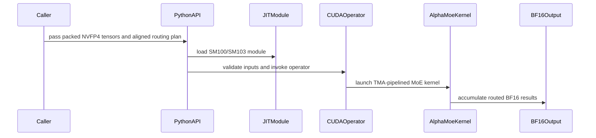

# [PR #4340] feat(cake_alpha_moe): add Blackwell AlphaMoE NVFP4 expert up/down compute

source: https://github.com/flashinfer-ai/flashinfer/pull/4340
state: open | updated: 2026-09-26T11:29:16Z
labels: run-ci, op: moe

## 正文

## 📌 Description

Add SM100a/SM103a **AlphaMoE NVFP4** expert compute (fused gate/up projection + SwiGLU + intermediate requantization, down projection, route alignment and BF16 finalize) as a routed-MoE operator that consumes the same prequantized activations, NVFP4 weights with E4M3 block scales and supplied route ids/weights as `trtllm_fp4_block_scale_routed_moe`, and produces the same BF16 output.

This head supersedes the earlier head of this PR (`c691f3b5`), whose six measured shapes were all below 1x (0.08x to 0.31x). The kernels were re-derived shape by shape; the current package selects one of 16 host-side routes from `(M, N, K, block_m, prepared-weight inputs)`:

- **Decode (M = 1 / 8 .. 16)**: one-token GEMV chain with bitmask-rank alignment fused into the up kernel, persistent split-K down, deferred finalize with a caller-supplied BF16 seed.
- **Batched (M = 128 / 512)**: BM16/BM8 whole-owner up kernels with L2 `evict_last` W1 streaming, and down kernels that stream **prepared W2 panels** with `evict_first` so the row buffers of the following finalize stay L2-resident.
- **General path** for every other shape (BM8 whole-owner up/down, alignment, row-buffer finalize).

Every route is bitwise identical to the general path on its shape; the GLM-geometry shapes are bitwise identical to the Stock operator.

### Public API

```python
from flashinfer.fused_moe import (
    alphamoe_nvfp4_routed_moe, alphamoe_nvfp4_routed_moe_deferred, alphamoe_nvfp4_aligned_moe,
    prepare_nvfp4_w1_scales, prepare_nvfp4_w2_scales, prepare_nvfp4_w1_data,
    prepare_nvfp4_w1_gate_up_data, prepare_nvfp4_w1_gate_up_scales, prepare_nvfp4_w2_data,
)
```

The `prepare_*` helpers are one-time model-load layout permutations (exact byte permutations, no arithmetic). `prepare_nvfp4_w2_data(w2)` turns the contiguous uint8 W2 `[E, K, N/4]` into `[E*(K/128)*(N/256), 128, 64]` panels so each expert / 128-row output tile / 128-wide intermediate block is one contiguous 8 KB TMA box. The M = 128 and M = 512 fast routes require both `w1_data_prepared` and `w2_data_prepared`; without them the selector keeps the general routes. All optional inputs default to `None`, so existing callers are unaffected.

### GPU performance (NVIDIA GB300, sm_103a)

Boundary: complete routed operator, prequantized activations + route ids/weights in, BF16 out, for both arms. Stock = `trtllm_fp4_block_scale_routed_moe` (permutation, both GEMMs, intermediate quantization and finalization; autotuned once, untimed). Candidate = route alignment + the AlphaMoE kernels + finalize. Metric = sum of correlated GPU kernel durations from strict CUPTI activity tracing with a cold L2 before every sample, 5 paired rounds x 30 samples, medians of the paired ratios. Speedup = Stock / candidate.

| Shape | Route | Stock GPU sum (us) | AlphaMoE GPU sum (us) | Speedup (Stock / AlphaMoE) | max abs diff vs Stock |
|---|---:|---:|---:|---:|---:|
| M=8, H=7168, I=128, E=256, top-k=8, BM=8 | 0 | 42.69 | 38.43 | **1.1108x** | 1 |
| M=128, H=7168, I=128, E=256, top-k=8, BM=16 | 0 (aligned entry; BM16 has no routed companion) | 116.26 | 101.34 | **1.1472x** | 2 |
| M=1, H=6144, I=512, E=256, top-k=8, BM=8 | 1 | 24.86 | 19.42 | **1.2801x** | 0 |
| M=8, H=6144, I=512, E=256, top-k=8, BM=8 | 9 | 74.08 | 71.10 | **1.0414x** | 0 |
| M=128, H=6144, I=512, E=256, top-k=8, BM=8 | 10 | 223.78 | 217.04 | **1.0310x** | 0 |
| M=512, H=6144, I=512, E=256, top-k=8, BM=8 | 12 | 241.70 | 241.12 | **1.0025x** | 0 |

GPU: NVIDIA GB300; 5 paired rounds; all 6/6 rows above 1x.

The GLM M = 512 row is the tightest margin (0.6 us); every one of its five paired rounds was above 1x (1.0021x to 1.0029x).

Deterministic fixtures with unit expert global scales; seeds 28104/28105 (H=7168 rows) and 28110..28113 (GLM rows). Measured on the exact commit of this PR head with the current `main` merged in.

**Known gap (not addressed by this PR head):** at token counts above the tuned shapes the general path is slower than Stock (M = 1000: 0.80x, M = 2048: 0.65x, M = 4096: 0.53x, M = 8192: 0.46x, outputs bitwise equal). Stock's 128x128 token tiles stream each expert's weights once per 128 tokens; the BM8 general path re-streams them per 8 rows. A 128-row-tile large-M route is the next step.

### Real-model evidence (GLM-5.2-NVFP4, TP4, GB300, SGLang `flashinfer_alphamoe` MoE backend vs `flashinfer_trtllm`)

Measured on this exact kernel package (2026-09-26):

- GSM8K 1314-question accuracy: **1260 / 1314 correct vs Stock 1264** (threshold 1258): PASS. The previous package revisions scored 1253 and 1257 with kernels identical on every route this workload exercises, so this protocol's run-to-run spread is at least +-4.
- Paired clean serving throughput at concurrency 1 / 8 / 16 (5 seeds each, same node class, same seeds both arms): **0.967x / 0.914x / 0.906x of Stock, 0 wins out of 15**. This is the large-M general-path gap described above (decode batches of ~1000 tokens, prefill chunks of 6k..16k tokens run on the general route); it is not addressed by this head.
- Instrumented layer capture at M = 2 / M = 4 (TP4 layer 3): PASS, bitwise against the reference replay.

The serving integration loads the prepared W1 / W2 layouts once at model load through a small weight-carrier helper; the kernels and library are the ones validated below.

### Validation on this head

- Native gate: the built `alphamoe_nvfp4_sm100` library's SASS is compared kernel by kernel against the audited reference build; 16 package tests pass on GB300.
- compute-sanitizer memcheck / synccheck / racecheck on the prepared-weight routes: 0 errors / 0 hazards (memcheck with `--report-api-errors no`; the only reports with API errors on were host-side `cuGetProcAddress_v2` probes during `import flashinfer`).
- Pre-commit hooks (ruff check + format, mypy, clang-format with the AlphaMoE csrc units excluded) pass on the changed files.

### Baselines and their source PRs

| baseline | origin | files | used for |
|---|---|---|---|
| `trtllm_fp4_block_scale_routed_moe` (trtllm-gen NVFP4 fused MoE, artifacts `4e73ccb7.../batched_gemm-b738138-6923fec`) | flashinfer-ai/flashinfer `main` @ `e34a1735` (2026-09-25, PR #5149 bumped the BMM artifact set) | `flashinfer/fused_moe/core.py`, `csrc/trtllm_fused_moe_runner.cu`, `csrc/trtllm_fused_moe_kernel_launcher.cu`, `csrc/trtllm_fused_moe_routing_binding.cu` | GPU six-shape and large-M rows above (Stock arm) |
| SGLang `flashinfer_trtllm` MoE runner backend | sglang `5407ec1a` (unchanged from the earlier head of this PR) | `python/sglang/srt/layers/moe/...` | real-model accuracy / serving Stock arm |

## 🔍 Related Issues

Supersedes the measurements posted earlier in this PR.

## 🚀 Pull Request Checklist

- [x] I have read the [contributing guidelines](https://github.com/flashinfer-ai/flashinfer/blob/main/CONTRIBUTING.md)
- [x] Pre-commit hooks pass on the changed files
- [x] Tests added: `tests/moe/test_alphamoe_nvfp4_sm100.py` (16 cases: routed / aligned / deferred paths, prepared-weight layouts, W1/W2 panel permutations)
- [x] Documentation: `docs/api/fused_moe.rst`, `examples/pytorch/alphamoe_nvfp4_aligned_moe.py`


## 评论 (13)

### gemini-code-assist[bot] · 2026-08-04

> [!CAUTION]
> The consumer version of Gemini Code Assist on GitHub has been sunset. All code review activity has officially ceased.


### coderabbitai[bot] · 2026-08-04

<!-- This is an auto-generated comment: summarize by coderabbit.ai -->
<!-- review_stack_entry_start -->

<a href="https://app.coderabbit.ai/change-stack/flashinfer-ai/flashinfer/pull/4340"></a>

Navigate logical layers of code changes, visualize relationships, and explore their blast radius.

<!-- review_stack_entry_end -->
<!-- This is an auto-generated comment: review paused by coderabbit.ai -->

> [!NOTE]
> ## Reviews paused
> 
> It looks like this branch is under active development. To avoid overwhelming you with review comments due to an influx of new commits, CodeRabbit has automatically paused this review. You can configure this behavior by changing the `reviews.auto_review.auto_pause_after_reviewed_commits` setting.
> 
> Use the following commands to manage reviews:
> - `@coderabbitai resume` to resume automatic reviews.
> - `@coderabbitai review` to trigger a single review.
> 
> Use the checkboxes below for quick actions:
> - [ ] <!-- {"checkboxId":"7f6cc2e2-2e4e-497a-8c31-c9e4573e93d1"} --> ▶️ Resume reviews
> - [ ] <!-- {"checkboxId":"e9bb8d72-00e8-4f67-9cb2-caf3b22574fe"} --> 🔍 Trigger review

<!-- end of auto-generated comment: review paused by coderabbit.ai -->
<!-- walkthrough_start -->

<details>
<summary>📝 Walkthrough</summary>

## Walkthrough

Added aligned and routed AlphaMoE NVFP4 APIs for SM100 and SM103. The change includes CUDA kernels, prepared-weight and deferred-output paths, build integration, benchmarks, tracing, documentation, an example, and correctness tests.

### Changes

**AlphaMoE NVFP4 MoE**

|Layer / File(s)|Summary|
|---|---|
|**Python APIs and routed execution** <br> `flashinfer/fused_moe/alphamoe_nvfp4_sm100.py`, `flashinfer/fused_moe/__init__.py`|Added aligned and routed APIs, validation, route selection, prepared-weight helpers, alignment seeding, deferred execution, and finalization.|
|**Aligned SM100/SM103 CUDA kernel** <br> `csrc/alphamoe_nvfp4_sm100.cu`|Added host validation and launch wiring, plus a pipelined kernel for NVFP4 projections, SwiGLU requantization, routed weighting, and BF16 output reduction.|
|**Routed CUDA kernels** <br> `csrc/alphamoe_nvfp4_c*.cu`|Added route-plan alignment, gate/up projection workspace, and weighted route-finalization kernels.|
|**JIT and AOT integration** <br> `flashinfer/jit/...`, `flashinfer/aot.py`|Added SM100a and SM103a JIT flags and module generation, AOT registration, and the JIT package export.|
|**Benchmark and example** <br> `benchmarks/routines/...`, `examples/pytorch/...`|Added benchmark registration and backend mapping, `block_m` result support, a reference-checking benchmark, and a standalone example.|
|**Tests, tracing, and documentation** <br> `tests/moe/...`, `tests/trace/...`, `docs/...`, `.pre-commit-config.yaml`|Added CUDA correctness and contract tests, aligned and routed trace definitions and checks, API and trace documentation, and CUDA formatting exclusions.|

<!-- change_assessment_start -->
**Priority:** ➖ Normal


**Estimated code review effort:** 5 (Critical) | ~120 minutes

<!-- change_assessment_commit:"d62684bcf3ec363187ebf9a0471bab4649e17232" -->
**Change:** Feature
<!-- change_assessment_end -->

### Sequence Diagram(s)



</details>

<!-- walkthrough_end -->
<!-- final_review_risk_start -->
**Merge Risk:** _🟡 Moderate_ · up to `d6268`
<!-- final_review_risk_coverage:{"sourceCommitId":"d62684bcf3ec363187ebf9a0471bab4649e17232","coveredCommitId":"d62684bcf3ec363187ebf9a0471bab4649e17232","kind":"reviewed"} -->

The new AlphaMoE NVFP4 MoE path adds new kernels and APIs. Its trace output does not record some inputs that choose the kernel route, so replays can run a different kernel than the traced call. The documentation also omits one of the prepared weights needed for the fast routes. The correctness tests use unit output scales and cannot detect incorrect scale handling. Resolve these issues, or explicitly accept them, before merging.
<!-- final_review_risk_end -->
<!-- architecture_review_start -->
### Security Architecture Review

**Security architecture risk:** _🟡 Moderate_ · up to `d6268`

Malformed routing data may reach GPU kernels that use expert IDs as array indices. The risk depends on whether an application permits untrusted callers to supply routing plans; ordinary model-generated routing has a narrower exposure.

**Retained concerns**
- **Medium · security · inferred:** The public aligned operator relies on callers to supply valid device-side expert IDs, while an active CUDA route uses those IDs to index per-expert arrays without a visible value check. If an application admits untrusted routing plans, malformed IDs can cause out-of-bounds device access or a GPU fault.

<details>
<summary>Security review details</summary>

**Security Blast Radius**
- _inferred_ — A malformed plan could affect GPU work in the invoking application's device context. The evidence does not establish remote access to raw plans, cross-tenant reachability, or exposure beyond that context.

**Security Findings and Attack Paths**
- _inferred_ — The conditional attack path is caller influence over an active expert ID, followed by CUDA indexing of a per-expert scale array with that ID. Shape and capacity checks do not establish that device-side ID values are in range.

**Trust Boundaries and Controls**
- _observed_ — The public aligned API leaves active plan values to its caller. At the native boundary, CUDA checks metadata, devices, capacity, alignment, and storage overlap before launch, but the inspected checks do not inspect the plan's device-side expert-ID values.

**Resilience and Maintainability Implications**
- _observed_ — For deferred CUDA routes, the native finalize entrypoint checks seed overlap and matches the retained route accumulator to the requested output dimensions before launching. This rules out those particular malformed-seed and partial-overlap paths.

**Hardening Proposals**
- _proposed_ — Where routing plans can originate outside trusted model execution, require plan construction through a validated alignment path or check active device-side expert and token ID ranges before compute.

</details>

<!-- architecture_review_end -->
<!-- pre_merge_checks_walkthrough_start -->

<details>
<summary>🚥 Pre-merge checks | ✅ 4 | ❌ 1</summary>

### ❌ Failed checks (1 warning)

|     Check name     | Status     | Explanation                                                                                                                                                                                               | Resolution                                                                         |
| :----------------: | :--------- | :-------------------------------------------------------------------------------------------------------------------------------------------------------------------------------------------------------- | :--------------------------------------------------------------------------------- |
| Docstring Coverage | ⚠️ Warning | Docstring coverage is 26.40% which is insufficient. The required threshold is 80.00%. Docstring coverage is scoped to functions touched by this diff. Analyzed 178 functions across 19 files. (4 skipped… | Write docstrings for the functions missing them to satisfy the coverage threshold. |

<details>
<summary>✅ Passed checks (4 passed)</summary>

|         Check name         | Status   | Explanation                                                                                                                                                                                               |
| :------------------------: | :------- | :-------------------------------------------------------------------------------------------------------------------------------------------------------------------------------------------------------- |
|     Linked Issues check    | ✅ Passed | Check skipped because no linked issues were found for this pull request.                                                                                                                                  |
| Out of Scope Changes check | ✅ Passed | Check skipped because no linked issues were found for this pull request.                                                                                                                                  |
|         Title check        | ✅ Passed | The title clearly identifies the main change: adding Blackwell AlphaMoE NVFP4 expert up/down compute. It is concise and specific.                                                                         |
|      Description check     | ✅ Passed | The description is detailed and follows the repository template. It explains the implementation, public APIs, performance results, known limitations, validation, tests, and documentation. The related-… |

</details>

<details>
<summary>Full details: Docstring Coverage</summary>

**Explanation**

Docstring coverage is 26.40% which is insufficient. The required threshold is 80.00%. Docstring coverage is scoped to functions touched by this diff. Analyzed 178 functions across 19 files. (4 skipped: 4 unsupported.)

</details>

</details>

<!-- pre_merge_checks_walkthrough_end -->

- [ ] <!-- {"checkboxId":"585bb3f6-faf5-4dbf-96d2-74e382adf19a"} --> Fix all pre-merge checks with AI
<!-- finishing_touch_checkbox_start -->

<details>
<summary>✨ Finishing Touches 💡 1</summary>

<!-- finishing_touch_suggestion:fix_ci -->
<details open>
<summary>🛠️ Fix failing CI checks 💡</summary>

- [ ] <!-- {"checkboxId": "9f0d24fb-b419-4f01-baf0-8b26b6424f34", "radioGroupId": "fix-ci-output-choice-group-unknown_comment_id"} --> Commit to this branch
- [ ] <!-- {"checkboxId": "6d21cfe8-ec3f-40e2-9222-b8318b64d3b0", "radioGroupId": "fix-ci-output-choice-group-unknown_comment_id"} --> Create a new PR

</details>
<details open>
<summary>🧪 Generate unit tests (beta)</summary>

- [ ] <!-- {"checkboxId": "f47ac10b-58cc-4372-a567-0e02b2c3d479", "radioGroupId": "utg-output-choice-group-unknown_comment_id"} --> Create a new PR

</details>

</details>

<!-- finishing_touch_checkbox_end -->
<!-- tips_start -->

---

Thanks for using [CodeRabbit](https://coderabbit.ai?utm_source=oss&utm_medium=github&utm_campaign=flashinfer-ai/flashinfer&utm_content=4340)! It's free for OSS, and your support helps us grow. If you like it, consider giving us a shout-out.

<details>
<summary>❤️ Share</summary>

- [X](https://twitter.com/intent/tweet?text=I%20just%20used%20%40coderabbitai%20for%20my%20code%20review%2C%20and%20it%27s%20fantastic%21%20It%27s%20free%20for%20OSS%20and%20offers%20a%20free%20trial%20for%20the%20proprietary%20code.%20Check%20it%20out%3A&url=https%3A//coderabbit.ai)
- [Mastodon](https://mastodon.social/share?text=I%20just%20used%20%40coderabbitai%20for%20my%20code%20review%2C%20and%20it%27s%20fantastic%21%20It%27s%20free%20for%20OSS%20and%20offers%20a%20free%20trial%20for%20the%20proprietary%20code.%20Check%20it%20out%3A%20https%3A%2F%2Fcoderabbit.ai)
- [Reddit](https://www.reddit.com/submit?title=Great%20tool%20for%20code%20review%20-%20CodeRabbit&text=I%20just%20used%20CodeRabbit%20for%20my%20code%20review%2C%20and%20it%27s%20fantastic%21%20It%27s%20free%20for%20OSS%20and%20offers%20a%20free%20trial%20for%20proprietary%20code.%20Check%20it%20out%3A%20https%3A//coderabbit.ai)
- [LinkedIn](https://www.linkedin.com/sharing/share-offsite/?url=https%3A%2F%2Fcoderabbit.ai&mini=true&title=Great%20tool%20for%20code%20review%20-%20CodeRabbit&summary=I%20just%20used%20CodeRabbit%20for%20my%20code%20review%2C%20and%20it%27s%20fantastic%21%20It%27s%20free%20for%20OSS%20and%20offers%20a%20free%20trial%20for%20proprietary%20code)

</details>


<sub>Comment `@coderabbitai help` to get the list of available commands.</sub>

<!-- tips_end -->

### yyihuang · 2026-09-12

The current compilation context normalizes unsuffixed 10.0/10.3 targets to 10.0a/10.3a before JIT and AOT selection. AlphaMoE's AOT registration uses the exact-target capability flags from that context, matching its JIT filtering. Explicit family targets remain excluded: this implementation requires the architecture-specific instruction set. No family-target support is being claimed. The updated source retains this behavior; fresh model E2E remains pending before merge.


### yyihuang · 2026-09-12

@flashinfer-bot run tests/moe/test_alphamoe_nvfp4_sm100.py


### yyihuang · 2026-09-13

/bot run tests/moe/test_alphamoe_nvfp4_sm100.py

### flashinfer-bot · 2026-09-13

GitLab MR [!1507](https://nv/flashinfer/-/merge_requests/1507) has been created, and the CI pipeline [#67588301](https://nv/flashinfer-ci/-/pipelines/67588301) is currently running. I'll report back once the pipeline job completes.

### yyihuang · 2026-09-13

@flashinfer-bot run

### flashinfer-bot · 2026-09-13

[SUCCESS] Pipeline [#67588301](https://nv/flashinfer-ci/-/pipelines/67588301): 18/19 executed test jobs passed

### yyihuang · 2026-09-26

/bot run tests/moe/test_alphamoe_nvfp4_sm100.py tests/trace/test_fi_trace_template_consistency.py


### yyihuang · 2026-09-26

@flashinfer-bot run tests/moe/test_alphamoe_nvfp4_sm100.py tests/trace/test_fi_trace_template_consistency.py


### flashinfer-bot · 2026-09-26

GitLab MR [!1507](https://nv/flashinfer/-/merge_requests/1507) has been updated with latest changes, and the CI pipeline [#69909801](https://nv/flashinfer-ci/-/pipelines/69909801) is currently running. I'll report back once the pipeline job completes.

### github-actions[bot] · 2026-09-26

<!-- flashinfer-pr-documentation-summary -->
## Documentation checks ⚠️

6 new documentation finding(s):

- `docs/api:1` — flashinfer.fused_moe.prepare_nvfp4_w1_data is documented but no longer public
- `docs/api:1` — flashinfer.fused_moe.prepare_nvfp4_w1_gate_up_data is documented but no longer public
- `docs/api:1` — flashinfer.fused_moe.prepare_nvfp4_w1_gate_up_scales is documented but no longer public
- `docs/api:1` — flashinfer.fused_moe.prepare_nvfp4_w1_scales is documented but no longer public
- `docs/api:1` — flashinfer.fused_moe.prepare_nvfp4_w2_scales is documented but no longer public
- `flashinfer/fused_moe/alphamoe_nvfp4_sm100.py:861` — flashinfer.fused_moe.alphamoe_nvfp4_sm100.alphamoe_nvfp4_routed_moe: Missing 'Parameters' / 'Args' section in docstring

[View the full check run](https://github.com/flashinfer-ai/flashinfer/actions/runs/36229211063)

### flashinfer-bot · 2026-09-26

[SUCCESS] Pipeline [#69909801](https://nv/flashinfer-ci/-/pipelines/69909801): 25/25 executed test jobs passed
