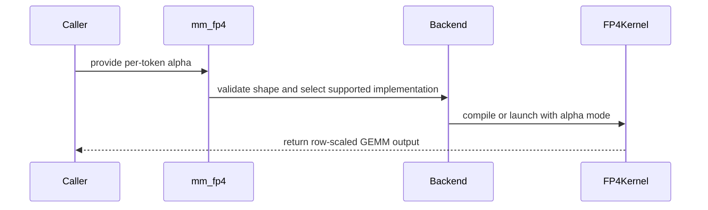

# [PR #4441] Per Token quantization for NVFP4 in mm_fp4

source: https://github.com/flashinfer-ai/flashinfer/pull/4441
state: closed | updated: 2026-09-27T04:21:31Z
labels: priority: must have (P0), run-ci, op: gemm, op: misc

## 正文

<!-- .github/pull_request_template.md -->

## 📌 Description

Need this for online quant of dense layers of MoE and dense models.

Only add it to cute-dsl nvfp4 and cutedsl nvfp4 quantize

<!-- What does this PR do? Briefly describe the changes and why they’re needed. -->

## 🔍 Related Issues

<!-- Link any related issues here -->

## 🚀 Pull Request Checklist

Thank you for contributing to FlashInfer! Before we review your pull request, please make sure the following items are complete.

### ✅ Pre-commit Checks

- [ ] I have installed `pre-commit` by running `pip install pre-commit` (or used your preferred method).
- [ ] I have installed the hooks with `pre-commit install`.
- [ ] I have run the hooks manually with `pre-commit run --all-files` and fixed any reported issues.

> If you are unsure about how to set up `pre-commit`, see [the pre-commit documentation](https://pre-commit.com/).

## 🧪 Tests

- [ ] Tests have been added or updated as needed.
- [ ] All tests are passing (`unittest`, etc.).

## Reviewer Notes

<!-- Optional: anything you'd like reviewers to focus on, concerns, etc. -->


<!-- This is an auto-generated comment: release notes by coderabbit.ai -->
## Summary by CodeRabbit

* **New Features**
  * Added per-token scaling support for FP4 GEMM, including scalar, row-wise, and column-wise scaling where supported.
  * Added optional output-scale folding for per-token NVFP4 quantization.
  * Extended support across compatible hardware, backends, autotuning, kernel caching, and precompilation.

* **Bug Fixes**
  * Improved validation for unsupported hardware, backends, batching, and scaling combinations.
  * Kept cached kernel variants distinct across scaling modes.

* **Tests**
  * Added coverage across supported shapes, data types, backends, and autotuning modes.
<!-- end of auto-generated comment: release notes by coderabbit.ai -->

## 评论 (18)

### coderabbitai[bot] · 2026-08-10

<!-- This is an auto-generated comment: summarize by coderabbit.ai -->
<!-- review_stack_entry_start -->

[](https://app.coderabbit.ai/change-stack/flashinfer-ai/flashinfer/pull/4441?utm_source=github_walkthrough&utm_medium=github&utm_campaign=change_stack)

<!-- review_stack_entry_end -->
<!-- This is an auto-generated comment: review paused by coderabbit.ai -->

> [!NOTE]
> ## Reviews paused
> 
> It looks like this branch is under active development. To avoid overwhelming you with review comments due to an influx of new commits, CodeRabbit has automatically paused this review. You can configure this behavior by changing the `reviews.auto_review.auto_pause_after_reviewed_commits` setting.
> 
> Use the following commands to manage reviews:
> - `@coderabbitai resume` to resume automatic reviews.
> - `@coderabbitai review` to trigger a single review.
> 
> Use the checkboxes below for quick actions:
> - [ ] <!-- {"checkboxId": "7f6cc2e2-2e4e-497a-8c31-c9e4573e93d1"} --> ▶️ Resume reviews
> - [ ] <!-- {"checkboxId": "e9bb8d72-00e8-4f67-9cb2-caf3b22574fe"} --> 🔍 Trigger review

<!-- end of auto-generated comment: review paused by coderabbit.ai -->
<!-- walkthrough_start -->

<details>
<summary>📝 Walkthrough</summary>

## Walkthrough

FP4 GEMM now accepts scalar or per-token alpha scales. Supported backends propagate this mode through validation, caching, compilation, dispatch, and epilogues. NVFP4 quantization can fold output scales into per-token scale results.

### Changes

**Per-token NVFP4 alpha scaling**

|Layer / File(s)|Summary|
|---|---|
|**Validation and backend orchestration** <br> `flashinfer/gemm/gemm_base.py`, `flashinfer/gemm/gemm_mm_fp4_cute_dsl.py`|Validation, backend selection, tuning, compilation, launch preparation, and cache keys support per-token alpha mode.|
|**CUTLASS dispatch and scaling contracts** <br> `include/flashinfer/gemm/fp4_gemm_*.h`, `include/flashinfer/gemm/fp4_gemm_template_sm120.h`, `csrc/fp4_gemm_cutlass*.cu`, `3rdparty/cutlass`|CUTLASS interfaces and SM-specific launch paths forward `per_token_alpha`. SM120 accepts row-sized scales.|
|**Per-token alpha epilogues** <br> `include/flashinfer/gemm/fp4_gemm_per_token_scale.h`, `flashinfer/gemm/kernels/dense_blockscaled_gemm_sm100.py`, `flashinfer/gemm/kernels/dense_blockscaled_gemm_sm120_b12x.py`|SM100 and SM120 kernels apply row or column alpha values and retain scalar alpha handling.|
|**Per-token quantization scale folding** <br> `flashinfer/quantization/fp4_quantization.py`, `flashinfer/quantization/kernels/nvfp4_quantize.py`|NVFP4 per-token quantization accepts `out_scale`, handles padded rows, and specializes folded and non-folded kernels.|
|**Functional and cache validation** <br> `tests/gemm/test_mm_fp4.py`, `tests/jit/test_cute_dsl_cache.py`|Tests cover supported backends, row-scaled output, scalar equivalence, and distinct cache identities.|

**Estimated code review effort:** 4 (Complex) | ~60 minutes

**Possibly related issues**

- `flashinfer-ai/flashinfer#4300` — Implements per-token NVFP4 activation scaling for dense `mm_fp4`, including row-sized scales across supported backends.

**Possibly related PRs**

- [flashinfer-ai/flashinfer#4263](https://github.com/flashinfer-ai/flashinfer/pull/4263) — Both changes modify per-token NVFP4 quantization and include 64-bit row addressing.
- [flashinfer-ai/flashinfer#4290](https://github.com/flashinfer-ai/flashinfer/pull/4290) — Both changes use shared SM120/SM121 CuTe DSL FP4 infrastructure.

**Suggested labels:** `run-ci`

**Suggested reviewers:** `aleozlx`, `sricketts`, `yzh119`

### Sequence Diagram(s)



</details>

<!-- walkthrough_end -->
<!-- pre_merge_checks_walkthrough_start -->

<details>
<summary>🚥 Pre-merge checks | ✅ 4 | ❌ 1</summary>

### ❌ Failed checks (1 warning)

|     Check name     | Status     | Explanation                                                                           | Resolution                                                                         |
| :----------------: | :--------- | :------------------------------------------------------------------------------------ | :--------------------------------------------------------------------------------- |
| Docstring Coverage | ⚠️ Warning | Docstring coverage is 46.67% which is insufficient. The required threshold is 80.00%. | Write docstrings for the functions missing them to satisfy the coverage threshold. |

<details>
<summary>✅ Passed checks (4 passed)</summary>

|         Check name         | Status   | Explanation                                                                                                                   |
| :------------------------: | :------- | :---------------------------------------------------------------------------------------------------------------------------- |
|     Linked Issues check    | ✅ Passed | Check skipped because no linked issues were found for this pull request.                                                      |
| Out of Scope Changes check | ✅ Passed | Check skipped because no linked issues were found for this pull request.                                                      |
|         Title check        | ✅ Passed | The title clearly identifies the main change: per-token NVFP4 quantization support in mm_fp4.                                 |
|      Description check     | ✅ Passed | The description explains the purpose and scope and includes all template sections, although checklist items remain unchecked. |

</details>

</details>

<!-- pre_merge_checks_walkthrough_end -->
<!-- finishing_touch_checkbox_start -->

<details>
<summary>✨ Finishing Touches 💡 1</summary>

<!-- finishing_touch_suggestion:fix_ci -->
<details open>
<summary>🛠️ Fix failing CI checks 💡</summary>

- [ ] <!-- {"checkboxId": "6d21cfe8-ec3f-40e2-9222-b8318b64d3b0", "radioGroupId": "fix-ci-output-choice-group-unknown_comment_id"} -->   Create stacked PR
- [ ] <!-- {"checkboxId": "9f0d24fb-b419-4f01-baf0-8b26b6424f34", "radioGroupId": "fix-ci-output-choice-group-unknown_comment_id"} -->   Commit on current branch

</details>
<details>
<summary>🧪 Generate unit tests (beta)</summary>

- [ ] <!-- {"checkboxId": "f47ac10b-58cc-4372-a567-0e02b2c3d479", "radioGroupId": "utg-output-choice-group-unknown_comment_id"} -->   Create PR with unit tests

</details>

</details>

<!-- finishing_touch_checkbox_end -->
<!-- tips_start -->

---

Thanks for using [CodeRabbit](https://coderabbit.ai?utm_source=oss&utm_medium=github&utm_campaign=flashinfer-ai/flashinfer&utm_content=4441)! It's free for OSS, and your support helps us grow. If you like it, consider giving us a shout-out.

<details>
<summary>❤️ Share</summary>

- [X](https://twitter.com/intent/tweet?text=I%20just%20used%20%40coderabbitai%20for%20my%20code%20review%2C%20and%20it%27s%20fantastic%21%20It%27s%20free%20for%20OSS%20and%20offers%20a%20free%20trial%20for%20the%20proprietary%20code.%20Check%20it%20out%3A&url=https%3A//coderabbit.ai)
- [Mastodon](https://mastodon.social/share?text=I%20just%20used%20%40coderabbitai%20for%20my%20code%20review%2C%20and%20it%27s%20fantastic%21%20It%27s%20free%20for%20OSS%20and%20offers%20a%20free%20trial%20for%20the%20proprietary%20code.%20Check%20it%20out%3A%20https%3A%2F%2Fcoderabbit.ai)
- [Reddit](https://www.reddit.com/submit?title=Great%20tool%20for%20code%20review%20-%20CodeRabbit&text=I%20just%20used%20CodeRabbit%20for%20my%20code%20review%2C%20and%20it%27s%20fantastic%21%20It%27s%20free%20for%20OSS%20and%20offers%20a%20free%20trial%20for%20proprietary%20code.%20Check%20it%20out%3A%20https%3A//coderabbit.ai)
- [LinkedIn](https://www.linkedin.com/sharing/share-offsite/?url=https%3A%2F%2Fcoderabbit.ai&mini=true&title=Great%20tool%20for%20code%20review%20-%20CodeRabbit&summary=I%20just%20used%20CodeRabbit%20for%20my%20code%20review%2C%20and%20it%27s%20fantastic%21%20It%27s%20free%20for%20OSS%20and%20offers%20a%20free%20trial%20for%20proprietary%20code)

</details>


<sub>Comment `@coderabbitai help` to get the list of available commands.</sub>

<!-- tips_end -->

### coderabbitai[bot] · 2026-08-10

<!-- This is an auto-generated comment by CodeRabbit -->
> [!NOTE]
> GitHub couldn't provide a complete incremental comparison for this pull request, so CodeRabbit is performing a full review instead. This review may take a little longer.

### leejnau · 2026-08-10

/bot run

### flashinfer-bot · 2026-08-10

GitLab MR [!1180](https://nv/flashinfer/-/merge_requests/1180) has been created, and the CI pipeline [#62021470](https://nv/flashinfer-ci/-/pipelines/62021470) is currently running. I'll report back once the pipeline job completes.

### flashinfer-bot · 2026-08-12

[FAILED] Pipeline [#62021470](https://nv/flashinfer-ci/-/pipelines/62021470) — 4/18 executed test jobs passed

Compared with nightly [#61930115](https://nv/flashinfer-ci/-/pipelines/61930115).

### Unit Tests

| GPU | CUDA 12.9 | CUDA 13.0 | Notes |
|---|---|---|---|
| 5090 | ⚠️ Infra | ⚠️ Infra | **Infrastructure:** `CI infrastructure failure` (2 jobs; CUDA 12.9, CUDA 13.0) |
| B300 | ❌ New | ❌ New | **PR-related:** `tests.jit.test_cute_dsl_cache` (2 failures; CUDA 12.9, CUDA 13.0)<br>**Old:** `tests.attention.test_cute_dsl_hca_dsv4` (10 failures; CUDA 12.9, CUDA 13.0)<br>**Test timeout:** `3 test files timed out: tests/moe/test_trtllm_gen_fused_moe.py, tests/attention/test_blackwell_fmha.py, tests/attention/test_trtllm_gen_attention_prefill.py` (2 jobs; CUDA 12.9, CUDA 13.0) |
| GB200 | ❌ New | ❌ New | **PR-related:** `tests.jit.test_cute_dsl_cache` (2 failures; CUDA 12.9, CUDA 13.0)<br>**Old:** `tests.attention.test_cute_dsl_hca_dsv4` (10 failures; CUDA 12.9, CUDA 13.0)<br>**Infrastructure:** `test infrastructure interrupted the job` (2 jobs; CUDA 12.9, CUDA 13.0) |
| GB300 | ❌ New | ❌ New | **PR-related:** `tests.jit.test_cute_dsl_cache` (2 failures; CUDA 12.9, CUDA 13.0)<br>**Old:** `tests.attention.test_cute_dsl_hca_dsv4` (10 failures; CUDA 12.9, CUDA 13.0)<br>**Infrastructure:** `test infrastructure interrupted the job` (2 jobs; CUDA 12.9, CUDA 13.0) |
| H100 | ❌ New | ❌ New | **PR-related:** `tests.jit.test_cute_dsl_cache` (2 failures; CUDA 12.9, CUDA 13.0) |
| RTX Pro 6000 Blackwell | ❌ New | ❔ Unknown | **PR-related:** `tests.jit.test_cute_dsl_cache` (1 failure; CUDA 12.9)<br>**Unknown:** `script failed before producing a JUnit report` (1 job; CUDA 13.0) |

✅ Pass · 🟡 Old failure · ❌ New failure · ⏱ Test timeout · ⚠️ Infrastructure · ❔ Unknown or unclassified · — Not run

### Multi-GPU and Multi-Node Tests — 4/6 passed

| GPU | CUDA 12.9 | CUDA 13.0 | Notes |
|---|---|---|---|
| B300 (multi-GPU) | ❔ Failed | ❔ Failed | — |
| GB200 (multi-node) | ✅ Pass | ✅ Pass | — |
| GB300 (multi-node) | ✅ Pass | ✅ Pass | — |

<details>
<summary>Failure details</summary>

### PR-related regressions
- `tests.jit.test_cute_dsl_cache` — 9 failures on B300 / CUDA 12.9, B300 / CUDA 13.0, GB200 / CUDA 12.9, GB200 / CUDA 13.0, GB300 / CUDA 12.9, GB300 / CUDA 13.0, H100 / CUDA 12.9, H100 / CUDA 13.0, RTX Pro 6000 Blackwell / CUDA 12.9
  - AssertionError: _get_compiled_kernel_nvfp4_per_token has codegen parameter(s) ['fold_out_scale'] that _nvfp4_kernel_name cannot encode. Add them to the name function (or, if pro…

### Pre-existing failures
- `tests.attention.test_cute_dsl_hca_dsv4` — 30 failures on B300 / CUDA 12.9, B300 / CUDA 13.0, GB200 / CUDA 12.9, GB200 / CUDA 13.0, GB300 / CUDA 12.9, GB300 / CUDA 13.0
  - AttributeError: module 'cutlass.cute.nvgpu.cpasync' has no attribute 'CopyBulkTensor2DGather4G2SOp'. Did you mean: 'CopyBulkTensorTileG2SOp'?

### Timeouts, infrastructure, or incomplete jobs
- **Infrastructure:** CI infrastructure failure — 5090 / CUDA 12.9, 5090 / CUDA 13.0
  - Jobs: [unit_test_5090: [cu130]](https://nv/flashinfer-ci/-/jobs/392807115), [unit_test_5090: [cu129]](https://nv/flashinfer-ci/-/jobs/392793732)
- **Infrastructure:** test infrastructure interrupted the job — GB200 / CUDA 12.9, GB200 / CUDA 13.0, GB300 / CUDA 12.9, GB300 / CUDA 13.0
  - Jobs: [unit_test_gb200: [cu130]](https://nv/flashinfer-ci/-/jobs/392007053), [unit_test_gb200: [cu129]](https://nv/flashinfer-ci/-/jobs/392007052), [unit_test_gb300: [cu130]](https://nv/flashinfer-ci/-/jobs/392007051), [unit_test_gb300: [cu129]](https://nv/flashinfer-ci/-/jobs/392007050)
- **Test timeout:** 3 test files timed out: tests/moe/test_trtllm_gen_fused_moe.py, tests/attention/test_blackwell_fmha.py, tests/attention/test_trtllm_gen_attention_prefill.py — B300 / CUDA 12.9, B300 / CUDA 13.0
  - Jobs: [unit_test_b300: [cu130]](https://nv/flashinfer-ci/-/jobs/392007059), [unit_test_b300: [cu129]](https://nv/flashinfer-ci/-/jobs/392007058)
- **Unknown:** script failed before producing a JUnit report — RTX Pro 6000 Blackwell / CUDA 13.0
  - Jobs: [unit_test_rtx-pro-6000-blackwell: [cu130]](https://nv/flashinfer-ci/-/jobs/392007070)

</details>

### leejnau · 2026-08-12

/bot run

### flashinfer-bot · 2026-08-12

GitLab MR [!1180](https://nv/flashinfer/-/merge_requests/1180) has been updated with latest changes, and the CI pipeline [#62356697](https://nv/flashinfer-ci/-/pipelines/62356697) is currently running. I'll report back once the pipeline job completes.

### leejnau · 2026-08-13

> looks good.
> 
> i'll let Dhiraj take another look

cc @dhiraj113 

### flashinfer-bot · 2026-08-13

[FAILED] Pipeline [#62356697](https://nv/flashinfer-ci/-/pipelines/62356697) — 10/18 executed test jobs passed

Compared with nightly [#62301362](https://nv/flashinfer-ci/-/pipelines/62301362).

### Unit Tests

| GPU | CUDA 12.9 | CUDA 13.0 | Notes |
|---|---|---|---|
| 5090 | ⚠️ Infra | ⚠️ Infra | **Infrastructure:** `CI infrastructure failure` (2 jobs; CUDA 12.9, CUDA 13.0) |
| B300 | 🟡 Old | 🟡 Old | **Old:** `tests.attention.test_cute_dsl_hca_dsv4` (10 failures; CUDA 12.9, CUDA 13.0) |
| GB200 | 🟡 Old | 🟡 Old | **Old:** `tests.attention.test_cute_dsl_hca_dsv4` (10 failures; CUDA 12.9, CUDA 13.0)<br>**Infrastructure:** `test infrastructure interrupted the job` (2 jobs; CUDA 12.9, CUDA 13.0) |
| GB300 | 🟡 Old | 🟡 Old | **Old:** `tests.attention.test_cute_dsl_hca_dsv4` (10 failures; CUDA 12.9, CUDA 13.0)<br>**Infrastructure:** `test infrastructure interrupted the job` (2 jobs; CUDA 12.9, CUDA 13.0) |
| H100 | ✅ Pass | ✅ Pass | — |
| RTX Pro 6000 Blackwell | ✅ Pass | ✅ Pass | — |

✅ Pass · 🟡 Old failure · ❌ New failure · ⏱ Test timeout · ⚠️ Infrastructure · ❔ Unknown or unclassified · — Not run

### Multi-GPU and Multi-Node Tests — 6/6 passed

| GPU | CUDA 12.9 | CUDA 13.0 | Notes |
|---|---|---|---|
| B300 (multi-GPU) | ✅ Pass | ✅ Pass | — |
| GB200 (multi-node) | ✅ Pass | ✅ Pass | — |
| GB300 (multi-node) | ✅ Pass | ✅ Pass | — |

<details>
<summary>Failure details</summary>

### Pre-existing failures
- `tests.attention.test_cute_dsl_hca_dsv4` — 30 failures on B300 / CUDA 12.9, B300 / CUDA 13.0, GB200 / CUDA 12.9, GB200 / CUDA 13.0, GB300 / CUDA 12.9, GB300 / CUDA 13.0
  - AttributeError: module 'cutlass.cute.nvgpu.cpasync' has no attribute 'CopyBulkTensor2DGather4G2SOp'. Did you mean: 'CopyBulkTensorTileG2SOp'?

### Timeouts, infrastructure, or incomplete jobs
- **Infrastructure:** CI infrastructure failure — 5090 / CUDA 12.9, 5090 / CUDA 13.0
  - Jobs: [unit_test_5090: [cu130]](https://nv/flashinfer-ci/-/jobs/395483075), [unit_test_5090: [cu129]](https://nv/flashinfer-ci/-/jobs/395480804)
- **Infrastructure:** test infrastructure interrupted the job — GB200 / CUDA 12.9, GB200 / CUDA 13.0, GB300 / CUDA 12.9, GB300 / CUDA 13.0
  - Jobs: [unit_test_gb200: [cu130]](https://nv/flashinfer-ci/-/jobs/394599255), [unit_test_gb200: [cu129]](https://nv/flashinfer-ci/-/jobs/394599254), [unit_test_gb300: [cu130]](https://nv/flashinfer-ci/-/jobs/394599253), [unit_test_gb300: [cu129]](https://nv/flashinfer-ci/-/jobs/394599252)

</details>

### b8zhong · 2026-08-14

Fixed a merge conflict and documentation issue.

### leejnau · 2026-08-14

/bot run

### flashinfer-bot · 2026-08-14

GitLab MR [!1180](https://nv/flashinfer/-/merge_requests/1180) has been updated with latest changes, and the CI pipeline [#62717801](https://nv/flashinfer-ci/-/pipelines/62717801) is currently running. I'll report back once the pipeline job completes.

### flashinfer-bot · 2026-08-14

[FAILED] Pipeline [#62717801](https://nv/flashinfer-ci/-/pipelines/62717801) — 8/22 executed test jobs passed

Compared with nightly [#62491866](https://nv/flashinfer-ci/-/pipelines/62491866) (different CI configuration).

### Unit Tests

| GPU | CUDA 12.9 | CUDA 13.0 | cu129--0 | cu129--1 | cu129--2 | cu129--3 | cu130--0 | cu130--1 | cu130--2 | cu130--3 | Notes |
|---|---|---|---|---|---|---|---|---|---|---|---|
| B300 | ❌ New | ❌ New | — | — | — | — | — | — | — | — | **New:** `tests.attention.test_xqa.py` (86456 failures; CUDA 12.9, CUDA 13.0)<br>**New:** `tests.attention.test_batch_attention.py` (46146 failures; CUDA 12.9, CUDA 13.0)<br>**New:** `tests.attention.test_sliding_window.py` (23584 failures; CUDA 12.9, CUDA 13.0)<br>… and 183 more |
| GB200 | ❌ New | ❌ New | — | — | — | — | — | — | — | — | **New:** `tests.attention.test_xqa.py` (102720 failures; CUDA 12.9, CUDA 13.0)<br>**New:** `tests.attention.test_rope.py` (61762 failures; CUDA 12.9, CUDA 13.0)<br>**New:** `tests.gemm.test_sm_constraint_gemm.py` (55296 failures; CUDA 12.9, CUDA 13.0)<br>… and 302 more |
| GB300 | ❔ Unknown | ❌ New | — | — | — | — | — | — | — | — | **New:** `tests.attention.test_xqa.py` (51360 failures; CUDA 13.0)<br>**New:** `tests.attention.test_rope.py` (30881 failures; CUDA 13.0)<br>**New:** `tests.gemm.test_sm_constraint_gemm.py` (27648 failures; CUDA 13.0)<br>… and 722 more |
| H100 | — | — | ❔ Unknown | ✅ Pass | ❔ Unknown | ❔ Unknown | ✅ Pass | ⚠️ Infra | ❔ Unknown | ❔ Unknown | **Infrastructure:** `GPU environment became unavailable` (1 job; cu130--1)<br>**Not compared:** `tests.attention.test_trtllm_gen_attention_decode.py` (388836 failures; cu129--2, cu129--3, cu130--2, cu130--3)<br>**Not compared:** `tests.attention.test_trtllm_gen_attention_decode_xqa.py` (359040 failures; cu129--0, cu129--2, cu129--3, cu130--2, cu130--3)<br>… and 409 more |
| RTX Pro 6000 Blackwell | ❌ New | ❌ New | — | — | — | — | — | — | — | — | **New:** `tests.attention.test_xqa.py` (102720 failures; CUDA 12.9, CUDA 13.0)<br>**New:** `tests.attention.test_batch_attention.py` (46146 failures; CUDA 12.9, CUDA 13.0)<br>**New:** `tests.attention.test_rope.py` (42888 failures; CUDA 12.9, CUDA 13.0)<br>… and 365 more |

✅ Pass · 🟡 Old failure · ❌ New failure · ⏱ Test timeout · ⚠️ Infrastructure · ❔ Unknown or unclassified · — Not run

### Multi-GPU and Multi-Node Tests — 6/6 passed

| GPU | CUDA 12.9 | CUDA 13.0 | cu129--0 | cu129--1 | cu129--2 | cu129--3 | cu130--0 | cu130--1 | cu130--2 | cu130--3 | Notes |
|---|---|---|---|---|---|---|---|---|---|---|---|
| B300 (multi-GPU) | ✅ Pass | ✅ Pass | — | — | — | — | — | — | — | — | — |
| GB200 (multi-node) | ✅ Pass | ✅ Pass | — | — | — | — | — | — | — | — | — |
| GB300 (multi-node) | ✅ Pass | ✅ Pass | — | — | — | — | — | — | — | — | — |

<details>
<summary>Failure details</summary>

### PR-related regressions
- `tests.gemm.test_mm_fp4.py` — 103364 failures on B300 / CUDA 12.9, B300 / CUDA 13.0, GB200 / CUDA 12.9, GB200 / CUDA 13.0, GB300 / CUDA 13.0
  - not executed due to timeout
- `tests.jit.test_cute_dsl_cache.py` — 210 failures on B300 / CUDA 12.9, B300 / CUDA 13.0, GB200 / CUDA 12.9, GB200 / CUDA 13.0, GB300 / CUDA 13.0, RTX Pro 6000 Blackwell / CUDA 12.9, RTX Pro 6000 Blackwell / CUDA 13.0
  - not executed due to timeout

### New relative to nightly (attribution uncertain)
- `tests.attention.test_xqa.py` — 343256 failures on B300 / CUDA 12.9, B300 / CUDA 13.0, GB200 / CUDA 12.9, GB200 / CUDA 13.0, GB300 / CUDA 13.0, RTX Pro 6000 Blackwell / CUDA 12.9, RTX Pro 6000 Blackwell / CUDA 13.0
  - not executed due to timeout
- `tests.attention.test_batch_attention.py` — 161511 failures on B300 / CUDA 12.9, B300 / CUDA 13.0, GB200 / CUDA 12.9, GB200 / CUDA 13.0, GB300 / CUDA 13.0, RTX Pro 6000 Blackwell / CUDA 12.9, RTX Pro 6000 Blackwell / CUDA 13.0
  - not executed due to timeout
- `tests.attention.test_rope.py` — 135531 failures on GB200 / CUDA 12.9, GB200 / CUDA 13.0, GB300 / CUDA 13.0, RTX Pro 6000 Blackwell / CUDA 12.9, RTX Pro 6000 Blackwell / CUDA 13.0
  - not executed due to timeout
- `tests.attention.test_deepseek_mla.py` — 89160 failures on GB200 / CUDA 12.9, GB200 / CUDA 13.0, GB300 / CUDA 13.0, RTX Pro 6000 Blackwell / CUDA 12.9, RTX Pro 6000 Blackwell / CUDA 13.0
  - not executed due to timeout
- `tests.gemm.test_sm_constraint_gemm.py` — 82944 failures on GB200 / CUDA 12.9, GB200 / CUDA 13.0, GB300 / CUDA 13.0
  - not executed due to timeout
- `tests.attention.test_sliding_window.py` — 82544 failures on B300 / CUDA 12.9, B300 / CUDA 13.0, GB200 / CUDA 12.9, GB200 / CUDA 13.0, GB300 / CUDA 13.0, RTX Pro 6000 Blackwell / CUDA 12.9, RTX Pro 6000 Blackwell / CUDA 13.0
  - not executed due to timeout
- `tests.attention.test_batch_prefill_kernels.py` — 79355 failures on GB200 / CUDA 12.9, GB200 / CUDA 13.0, GB300 / CUDA 13.0, RTX Pro 6000 Blackwell / CUDA 12.9, RTX Pro 6000 Blackwell / CUDA 13.0
  - not executed due to timeout
- `tests.attention.test_trtllm_gen_mla.py` — 40822 failures on RTX Pro 6000 Blackwell / CUDA 12.9, RTX Pro 6000 Blackwell / CUDA 13.0
  - not executed due to timeout
- `tests.attention.test_trtllm_gen_attention_prefill.py` — 36269 failures on GB300 / CUDA 13.0, RTX Pro 6000 Blackwell / CUDA 12.9, RTX Pro 6000 Blackwell / CUDA 13.0
  - not executed due to timeout
- `tests.gemm.test_mm_bf16.py` — 26799 failures on B300 / CUDA 12.9, B300 / CUDA 13.0, GB200 / CUDA 12.9, GB200 / CUDA 13.0, GB300 / CUDA 13.0
  - not executed due to timeout
- `tests.moe.test_trtllm_gen_routed_fused_moe.py` — 25998 failures on B300 / CUDA 12.9, B300 / CUDA 13.0, GB200 / CUDA 12.9, GB200 / CUDA 13.0, GB300 / CUDA 13.0, RTX Pro 6000 Blackwell / CUDA 12.9, RTX Pro 6000 Blackwell / CUDA 13.0
  - not executed due to timeout
- `tests.model_optimizations.test_dsv3_fused_routing.py` — 23760 failures on GB200 / CUDA 12.9, GB200 / CUDA 13.0, GB300 / CUDA 13.0, RTX Pro 6000 Blackwell / CUDA 12.9, RTX Pro 6000 Blackwell / CUDA 13.0
  - not executed due to timeout
- … and 359 more failing test groups

### Could not compare
- `tests.attention.test_trtllm_gen_attention_decode.py` — 388836 failures on H100 / cu129--2, H100 / cu129--3, H100 / cu130--2, H100 / cu130--3
  - not executed due to timeout
- `tests.attention.test_trtllm_gen_attention_decode_xqa.py` — 359040 failures on H100 / cu129--0, H100 / cu129--2, H100 / cu129--3, H100 / cu130--2, H100 / cu130--3
  - not executed due to timeout
- `tests.attention.test_xqa.py` — 308160 failures on GB300 / CUDA 12.9, H100 / cu129--0, H100 / cu129--2, H100 / cu129--3, H100 / cu130--2, H100 / cu130--3
  - not executed due to timeout
- `tests.attention.test_rope.py` — 185286 failures on GB300 / CUDA 12.9, H100 / cu129--0, H100 / cu129--2, H100 / cu129--3, H100 / cu130--2, H100 / cu130--3
  - not executed due to timeout
- `tests.gemm.test_sm_constraint_gemm.py` — 165888 failures on GB300 / CUDA 12.9, H100 / cu129--0, H100 / cu129--2, H100 / cu129--3, H100 / cu130--2, H100 / cu130--3
  - not executed due to timeout
- `tests.gemm.test_mm_fp4.py` — 144714 failures on GB300 / CUDA 12.9, H100 / cu129--0, H100 / cu129--2, H100 / cu129--3, H100 / cu130--2, H100 / cu130--3
  - not executed due to timeout
- `tests.attention.test_batch_attention.py` — 138438 failures on GB300 / CUDA 12.9, H100 / cu129--0, H100 / cu129--2, H100 / cu129--3, H100 / cu130--2, H100 / cu130--3
  - not executed due to timeout
- `tests.attention.test_deepseek_mla.py` — 106992 failures on GB300 / CUDA 12.9, H100 / cu129--0, H100 / cu129--2, H100 / cu129--3, H100 / cu130--2, H100 / cu130--3
  - not executed due to timeout
- `tests.attention.test_trtllm_gen_mla.py` — 102055 failures on H100 / cu129--0, H100 / cu129--2, H100 / cu129--3, H100 / cu130--2, H100 / cu130--3
  - not executed due to timeout
- `tests.attention.test_trtllm_gen_attention_prefill.py` — 77720 failures on GB300 / CUDA 12.9, H100 / cu129--0, H100 / cu129--2, H100 / cu129--3, H100 / cu130--2, H100 / cu130--3
  - not executed due to timeout
- `tests.attention.test_batch_prefill_kernels.py` — 72638 failures on GB300 / CUDA 12.9, H100 / cu129--0, H100 / cu129--2, H100 / cu130--2, H100 / cu130--3
  - not executed due to timeout
- `tests.gemm.test_mm_bf16.py` — 57925 failures on GB300 / CUDA 12.9, H100 / cu129--0, H100 / cu129--2, H100 / cu129--3, H100 / cu130--2, H100 / cu130--3
  - not executed due to timeout
- … and 399 more failing test groups

### Timeouts, infrastructure, or incomplete jobs
- **Infrastructure:** GPU environment became unavailable — H100 / cu130--1
  - Jobs: [unit_test_h100: [cu130, 1]](https://nv/flashinfer-ci/-/jobs/397450012)

</details>

### bkryu · 2026-08-14

/bot run tests/gemm

### flashinfer-bot · 2026-08-14

GitLab MR [!1180](https://nv/flashinfer/-/merge_requests/1180) has been created, and the CI pipeline [#62788576](https://nv/flashinfer-ci/-/pipelines/62788576) is currently running. I'll report back once the pipeline job completes.

### flashinfer-bot · 2026-08-15

[FAILED] Pipeline [#62788576](https://nv/flashinfer-ci/-/pipelines/62788576) — 15/22 executed test jobs passed

Compared with nightly [#62677476](https://nv/flashinfer-ci/-/pipelines/62677476).

### Unit Tests

| GPU | CUDA 12.9 | CUDA 13.0 | cu129--0 | cu129--1 | cu129--2 | cu129--3 | cu130--0 | cu130--1 | cu130--2 | cu130--3 | Notes |
|---|---|---|---|---|---|---|---|---|---|---|---|
| B300 | ❔ Failed | ❔ Failed | — | — | — | — | — | — | — | — | — |
| GB200 | 🟡 Old | 🟡 Old | — | — | — | — | — | — | — | — | **Old:** `tests.gemm.test_bmm_fp8.py` (1728 failures; CUDA 12.9, CUDA 13.0) |
| GB300 | 🟡 Old | 🟡 Old | — | — | — | — | — | — | — | — | **Old:** `tests.gemm.test_bmm_fp8.py` (1728 failures; CUDA 12.9, CUDA 13.0) |
| H100 | — | — | ✅ Pass | ✅ Pass | ✅ Pass | ✅ Pass | ✅ Pass | ✅ Pass | ✅ Pass | ✅ Pass | — |
| RTX Pro 6000 Blackwell | ❔ Unknown | ✅ Pass | — | — | — | — | — | — | — | — | **Unknown:** `script failed before producing a JUnit report` (1 job; CUDA 12.9) |

✅ Pass · 🟡 Old failure · ❌ New failure · ⏱ Test timeout · ⚠️ Infrastructure · ❔ Unknown or unclassified · — Not run

### Multi-GPU and Multi-Node Tests — 6/6 passed

| GPU | CUDA 12.9 | CUDA 13.0 | cu129--0 | cu129--1 | cu129--2 | cu129--3 | cu130--0 | cu130--1 | cu130--2 | cu130--3 | Notes |
|---|---|---|---|---|---|---|---|---|---|---|---|
| B300 (multi-GPU) | ✅ Pass | ✅ Pass | — | — | — | — | — | — | — | — | — |
| GB200 (multi-node) | ✅ Pass | ✅ Pass | — | — | — | — | — | — | — | — | — |
| GB300 (multi-node) | ✅ Pass | ✅ Pass | — | — | — | — | — | — | — | — | — |

<details>
<summary>Failure details</summary>

### Pre-existing failures
- `tests.gemm.test_bmm_fp8.py` — 3456 failures on GB200 / CUDA 12.9, GB200 / CUDA 13.0, GB300 / CUDA 12.9, GB300 / CUDA 13.0
  - not executed due to timeout

### Timeouts, infrastructure, or incomplete jobs
- **Unknown:** script failed before producing a JUnit report — RTX Pro 6000 Blackwell / CUDA 12.9
  - Jobs: [unit_test_rtx-pro-6000-blackwell: [cu129]](https://nv/flashinfer-ci/-/jobs/398018084)

</details>

### aleozlx · 2026-09-23

Thanks @b8zhong for the feature and @dhiraj113 for the review. To get this landed I have carried the branch into #5504 (your commits, authorship preserved, plus one follow-up commit), since this PR does not allow maintainer edits. Follow-up mapping to the open threads:

- **Blocker (`gemm_base.py`, auto fallback bypassing the requirement):** `_heuristic_func_mm_fp4` now returns `cute-dsl` for a per-token alpha and `_cute_dsl_gemm_fp4_requirement` gates the per-token path on the full compute capability (SM100/SM103). The unconditional fallback in `mm_fp4` is gone; only a backstop for `skip_check=True` remains. Pinned by `test_mm_fp4_per_token_alpha_auto_misaligned_n_raises`.
- **SM-major keying (`_PER_TOKEN_ALPHA_BACKENDS_BY_SM_MAJOR`, "is this API now?"):** table removed; the requirement function is the single source of truth and the test no longer imports it.
- **`fold_out_scale` test gap:** `test_nvfp4_quantize_per_token_out_scale_fold` covers all three layouts at m in {1, 17, 130}, asserts `per_token_scale(out_scale=s) == s * per_token_scale()` exactly, and checks the padding rows of the `torch.empty` scale buffer against the zero-padded reference layout. `test_nvfp4_quantize_out_scale_rejected_off_the_fold_path` covers the rejection paths.
- **SM103 tactics profiled and raising:** filtered in `get_valid_tactics` when the alpha is per-token; the raise in `forward()` stays as a backstop.
- **8x4 + per-token tuning config:** per-token config is selected first.
- **`dataclasses.replace`:** done.
- **Error message unions all SM majors:** message now names the backend and SM100/SM103 explicitly, on every arch.
- **Docstring order:** fixed.
- **Test matrix cost:** 160 -> 80 cases (`k` fixed at 256, `m` sweep kept in full). Scale logic in the test is documented in comments.
- **Skip/error reporting from the implementation:** the new rejection tests assert the implementation refuses per-token alpha on other backends; the positive test keeps the file's existing arch-skip convention.
- **Epilogue per-element alpha load:** unchanged; the larger-M per-token-vs-scalar measurement is still owed and will be posted on #5504.

Review continues on #5504. I will close this one once that merges.


### aleozlx · 2026-09-27

Landed on main via #5504 as 7d9679390 with your commits and authorship preserved (co-authored trailer on the squash). Thank you @b8zhong. Closing this one as superseded.

## Review (9)

### coderabbitai[bot] · 2026-08-10 · COMMENTED

**Actionable comments posted: 1**

<details>
<summary>🧹 Nitpick comments (2)</summary><blockquote>

<details>
<summary>flashinfer/gemm/kernels/dense_blockscaled_gemm_sm120_b12x.py (1)</summary><blockquote>

`1566-1569`: _🚀 Performance & Scalability_ | _🔵 Trivial_ | _💤 Low value_

**The swap_ab path loads alpha once per output element instead of once per row segment.**

`alpha[m_coord]` sits in the innermost `acc_n` loop. For a 128x128 tile this issues up to four orders of magnitude more global loads than the non-swap path, which loads once per accumulator row. The cache absorbs most of the traffic, so this is a throughput concern rather than a correctness one.

`m_coord` depends on `coord[1]`, so it cannot be hoisted out of `acc_n` directly, as the comment states. Two options can still reduce the load count:
- Precompute the distinct `m_coord` values for the thread's fragment into a small register array before the store loop, then index that array.
- Reorder the loops so `acc_n` is outer and `acc_m` inner, if the M coordinate is constant along the inner mode after the transpose.

Measure before changing; the epilogue may already be store-bound.

<details>
<summary>🤖 Prompt for AI Agents</summary>

```
Verify each finding against current code. Fix only still-valid issues, skip the
rest with a brief reason, keep changes minimal, and validate.

In `@flashinfer/gemm/kernels/dense_blockscaled_gemm_sm120_b12x.py` around lines
1566 - 1569, In the swap_ab epilogue around per_token_alpha handling, reduce
repeated alpha[m_coord] global loads from the innermost acc_n loop after
measuring the current performance. Preserve the existing m_coord dependency on
coord[1] by either caching each thread fragment’s distinct m_coord values in
registers before the store loop or reordering acc_n/acc_m when that keeps M
constant, while retaining identical alpha selection semantics.
```

</details>

<!-- cr-comment:v1:3217e2417e0221b9e09b02cc -->

</blockquote></details>
<details>
<summary>include/flashinfer/gemm/fp4_gemm_template_sm120.h (1)</summary><blockquote>

`118-124`: _📐 Maintainability & Code Quality_ | _🔵 Trivial_ | _💤 Low value_

**Add a `static_assert` so an unexpected alpha stride type fails at compile time.**

The `if constexpr` selects the per-column layout for any `StrideAlpha` whose element 0 is not `bool`. Today only `Stride<bool, _0, int64_t>` and `Stride<_0, bool, int64_t>` reach this code, so the choice is correct. If a future fusion uses a different stride, for example `Stride<int64_t, _0, int64_t>`, the else branch runs and writes `per_token_alpha` into the N slot without any diagnostic.

Assert the two supported forms instead of inferring from one element.


<details>
<summary>♻️ Proposed assertion</summary>

```diff
   using StrideAlpha = decltype(operator_args.epilogue.thread.dAlpha);
+  static_assert(cute::is_same_v<StrideAlpha, cute::Stride<bool, cute::_0, int64_t>> ||
+                    cute::is_same_v<StrideAlpha, cute::Stride<cute::_0, bool, int64_t>>,
+                "Alpha stride must be per-row Stride<bool,_0,int64_t> or per-col "
+                "Stride<_0,bool,int64_t>.");
   if constexpr (cute::is_same_v<cute::remove_cvref_t<decltype(cute::get<0>(StrideAlpha{}))>,
                                 bool>) {
```
</details>

<details>
<summary>🤖 Prompt for AI Agents</summary>

```
Verify each finding against current code. Fix only still-valid issues, skip the
rest with a brief reason, keep changes minimal, and validate.

In `@include/flashinfer/gemm/fp4_gemm_template_sm120.h` around lines 118 - 124,
Add a compile-time assertion in the StrideAlpha handling near the if constexpr
to require StrideAlpha to match exactly one of the two supported layouts,
Stride<bool, cute::_0, int64_t> or Stride<cute::_0, bool, int64_t>. Keep the
existing assignments for those valid forms, and make unsupported alpha stride
types fail during compilation instead of selecting the else branch.
```

</details>

<!-- cr-comment:v1:856e1294c30737d3c5248da9 -->

</blockquote></details>

</blockquote></details>

<details>
<summary>🤖 Prompt for all review comments with AI agents</summary>

```
Verify each finding against current code. Fix only still-valid issues, skip the
rest with a brief reason, keep changes minimal, and validate.

Inline comments:
In `@flashinfer/gemm/gemm_base.py`:
- Line 6354: Confirm which compile factory the b12x path binds by tracing
_compile_block_scaled_gemm into _make_blockscaled_gemm_compile_fn and checking
the Sm120B12xBlockScaledDenseGemmKernel contract. Normalize per_token_alpha at
both b12x call sites (the kernel construction and _compile_block_scaled_gemm
invocation) to the single representation expected by the factory, preserving
scalar-alpha and per-token m/n behavior.

---

Nitpick comments:
In `@flashinfer/gemm/kernels/dense_blockscaled_gemm_sm120_b12x.py`:
- Around line 1566-1569: In the swap_ab epilogue around per_token_alpha
handling, reduce repeated alpha[m_coord] global loads from the innermost acc_n
loop after measuring the current performance. Preserve the existing m_coord
dependency on coord[1] by either caching each thread fragment’s distinct m_coord
values in registers before the store loop or reordering acc_n/acc_m when that
keeps M constant, while retaining identical alpha selection semantics.

In `@include/flashinfer/gemm/fp4_gemm_template_sm120.h`:
- Around line 118-124: Add a compile-time assertion in the StrideAlpha handling
near the if constexpr to require StrideAlpha to match exactly one of the two
supported layouts, Stride<bool, cute::_0, int64_t> or Stride<cute::_0, bool,
int64_t>. Keep the existing assignments for those valid forms, and make
unsupported alpha stride types fail during compilation instead of selecting the
else branch.
```

</details>

<details>
<summary>🪄 Autofix</summary>

Fix all unresolved CodeRabbit comments on this PR:

- [ ] <!-- {"checkboxId": "4b0d0e0a-96d7-4f10-b296-3a18ea78f0b9"} --> Push a commit to this branch (recommended)
- [ ] <!-- {"checkboxId": "ff5b1114-7d8c-49e6-8ac1-43f82af23a33"} --> Create a new PR with the fixes

</details>

---

<details>
<summary>ℹ️ Review info</summary>

<details>
<summary>⚙️ Run configuration</summary>

**Configuration used**: defaults

**Review profile**: CHILL

**Plan**: Pro Plus

**Run ID**: `6c17ac02-bf51-4221-adcf-5b7091a18cce`

</details>

<details>
<summary>📥 Commits</summary>

Reviewing files that changed from the base of the PR and between 2ab910c58fdd2392914ea05e2a8714946ac0eef6 and 617e479012fef583bbe974c1243917ee5d00e324.

</details>

<details>
<summary>📒 Files selected for processing (16)</summary>

* `3rdparty/cutlass`
* `csrc/fp4_gemm_cutlass.cu`
* `csrc/fp4_gemm_cutlass_sm103.cu`
* `csrc/fp4_gemm_cutlass_sm120.cu`
* `flashinfer/gemm/gemm_base.py`
* `flashinfer/gemm/gemm_mm_fp4_cute_dsl.py`
* `flashinfer/gemm/kernels/dense_blockscaled_gemm_sm100.py`
* `flashinfer/gemm/kernels/dense_blockscaled_gemm_sm120_b12x.py`
* `include/flashinfer/gemm/fp4_gemm_cutlass.h`
* `include/flashinfer/gemm/fp4_gemm_cutlass_template.h`
* `include/flashinfer/gemm/fp4_gemm_cutlass_template_sm103.h`
* `include/flashinfer/gemm/fp4_gemm_cutlass_template_sm120.h`
* `include/flashinfer/gemm/fp4_gemm_per_token_scale.h`
* `include/flashinfer/gemm/fp4_gemm_template_sm120.h`
* `tests/gemm/test_mm_fp4.py`
* `tests/jit/test_cute_dsl_cache.py`

</details>

</details>

<!-- This is an auto-generated comment by CodeRabbit for review status -->

### coderabbitai[bot] · 2026-08-10 · COMMENTED

**Actionable comments posted: 2**

> [!CAUTION]
> Some comments are outside the diff and can’t be posted inline due to platform limitations.
> 
> 
> 
> <details>
> <summary>⚠️ Outside diff range comments (1)</summary><blockquote>
> 
> <details>
> <summary>flashinfer/quantization/kernels/nvfp4_quantize.py (1)</summary><blockquote>
> 
> `2319-2346`: _🗄️ Data Integrity & Integration_ | _🟠 Major_ | _⚡ Quick win_
> 
> **Normalize `out_scale` before passing it to the compiled kernel.**
> 
> The compiled kernel is specialized on `out_scale_fake` at Lines 1667-1669: float32, one element, aligned 4. The kernel then reads `mOutScale[Int32(0)]`. Line 2345 forwards `out_scale` with no dtype, shape, device, or contiguity normalization, unlike `global_scale_inv` at Lines 2294-2301.
> 
> Consequences for a caller that passes a float16/float64, 0-d, multi-element, or non-CUDA-matching `out_scale`: the TVM-FFI call either raises an opaque signature error or reinterprets the value, which produces a silently wrong GEMM alpha. A Python `float` also fails, although `global_scale_inv` accepts one here and flashinfer/quantization/fp4_quantization.py documents `out_scale` as a scalar.
> 
> Reuse the same normalization path. Also add `out_scale` to this function's Parameters section, because it is currently undocumented here.
> 
> 
> 
> 
> <details>
> <summary>🛠️ Proposed normalization</summary>
> 
> ```diff
>      fold_out_scale = out_scale is not None
> +    if fold_out_scale:
> +        if isinstance(out_scale, torch.Tensor):
> +            out_scale_tensor = (
> +                out_scale.float().reshape(1).contiguous().to(input.device)
> +            )
> +        else:
> +            out_scale_tensor = torch.tensor(
> +                [float(out_scale)], dtype=torch.float32, device=input.device
> +            )
>      kernel_fn = _get_compiled_kernel_nvfp4_per_token(
> ```
> 
> ```diff
>          m,
>          padded_m,
>          global_scale_inv_tensor,
> -        out_scale if fold_out_scale else global_scale_inv_tensor,
> +        out_scale_tensor if fold_out_scale else global_scale_inv_tensor,
>      )
> ```
> 
> Docstring addition after the `enable_pdl` entry:
> 
> ```diff
> +    out_scale : torch.Tensor, optional
> +        Scalar (``float32``, one element) folded into the returned
> +        ``per_token_scale``. When ``None``, no folding is applied and a
> +        separate kernel specialization is used. Quantization is unchanged.
> ```
> </details>
> 
> <details>
> <summary>🤖 Prompt for AI Agents</summary>
> 
> ```
> Verify each finding against current code. Fix only still-valid issues, skip the
> rest with a brief reason, keep changes minimal, and validate.
> 
> In `@flashinfer/quantization/kernels/nvfp4_quantize.py` around lines 2319 - 2346,
> Normalize out_scale before the kernel_fn call using the same scalar CUDA float32
> contiguous-tensor path as global_scale_inv, while preserving the existing
> fold_out_scale selection. Ensure Python scalars and 0-d or otherwise mismatched
> tensors become one-element, aligned float32 CUDA tensors before passing them to
> the compiled kernel. Add out_scale to this function’s Parameters documentation
> after enable_pdl.
> ```
> 
> </details>
> 
> <!-- cr-comment:v1:ccf15e30f98e1a16cde60d34 -->
> 
> </blockquote></details>
> 
> </blockquote></details>

<details>
<summary>🤖 Prompt for all review comments with AI agents</summary>

```
Verify each finding against current code. Fix only still-valid issues, skip the
rest with a brief reason, keep changes minimal, and validate.

Inline comments:
In `@flashinfer/quantization/fp4_quantization.py`:
- Line 1343: Update the quantization function around the `out_scale` handling so
any supplied `out_scale` is rejected with `ValueError` on the per-token `cuda`
path and both non-per-token paths, while preserving its use in the per-token
`cute-dsl` branch. Place the guard before the existing `elif backend == "cuda":`
branch and follow the function’s existing validation style.
- Around line 1379-1384: Update nvfp4_quantize_trace and its template inputs to
cover the out_scale parameter in per-token mode, including the inlined reference
and init functions. Regenerate
tests/trace/fi_trace_out/nvfp4_quantize_k4096.json and update the associated
trace tests so the new traced combination is validated.

---

Outside diff comments:
In `@flashinfer/quantization/kernels/nvfp4_quantize.py`:
- Around line 2319-2346: Normalize out_scale before the kernel_fn call using the
same scalar CUDA float32 contiguous-tensor path as global_scale_inv, while
preserving the existing fold_out_scale selection. Ensure Python scalars and 0-d
or otherwise mismatched tensors become one-element, aligned float32 CUDA tensors
before passing them to the compiled kernel. Add out_scale to this function’s
Parameters documentation after enable_pdl.
```

</details>

<details>
<summary>🪄 Autofix</summary>

Fix all unresolved CodeRabbit comments on this PR:

- [ ] <!-- {"checkboxId": "4b0d0e0a-96d7-4f10-b296-3a18ea78f0b9"} --> Push a commit to this branch (recommended)
- [ ] <!-- {"checkboxId": "ff5b1114-7d8c-49e6-8ac1-43f82af23a33"} --> Create a new PR with the fixes

</details>

---

<details>
<summary>ℹ️ Review info</summary>

<details>
<summary>⚙️ Run configuration</summary>

**Configuration used**: defaults

**Review profile**: CHILL

**Plan**: Pro Plus

**Run ID**: `5d6ecdcc-3623-4758-80d3-cf4b11a44261`

</details>

<details>
<summary>📥 Commits</summary>

Reviewing files that changed from the base of the PR and between 5861f7c9a721fd4e80d609a307ca94fed9527705 and 24cc757f1b9716a2346c7df0e0769d3244fa5c28.

</details>

<details>
<summary>📒 Files selected for processing (2)</summary>

* `flashinfer/quantization/fp4_quantization.py`
* `flashinfer/quantization/kernels/nvfp4_quantize.py`

</details>

</details>

<!-- This is an auto-generated comment by CodeRabbit for review status -->

### aleozlx · 2026-08-12 · COMMENTED

looks good.

i'll let Dhiraj take another look

### dhiraj113 · 2026-08-17 · COMMENTED

(no text)

### dhiraj113 · 2026-08-17 · COMMENTED

(no text)

### dhiraj113 · 2026-08-17 · COMMENTED

(no text)

### dhiraj113 · 2026-08-17 · COMMENTED

(no text)

### dhiraj113 · 2026-08-17 · COMMENTED

Nice piece of work -- the scalar-vs-per-token cross-check in the new test is the right way to validate a per-row epilogue, and the `out_scale` fold is a genuinely clean way to collapse the pipeline. I verified the fold is numerically exact on a B200 across all three `sf_layout` values at `m` in {1, 17, 130}, and `pre-commit` is clean on all 7 files.

One blocker and one test gap:

1. **`backend="auto"` + per-token alpha bypasses `_cute_dsl_gemm_fp4_requirement` entirely.** Reachable from the documented public API; crashes with a `TypeError` instead of the clear `ValueError` the requirement function already defines.
2. **`out_scale` / `fold_out_scale` has no numerical test** -- only a cache-key naming assertion. Half the feature surface is unguarded in CI.

Everything else is polish. Detail inline.


### aleozlx · 2026-09-23 · APPROVED

(no text)
