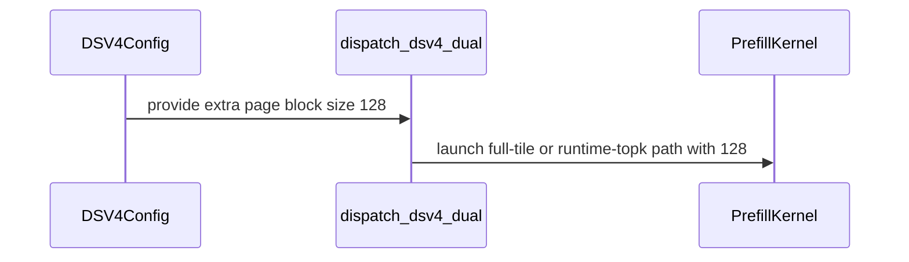

# [PR #5244] Fix/sparse mla sm120 dual pbs128

source: https://github.com/flashinfer-ai/flashinfer/pull/5244
state: open | updated: 2026-09-24T21:05:40Z
labels: op: attention

## 正文

<!-- .github/pull_request_template.md -->

## 📌 Description

Adds SM120 sparse-MLA support for two DeepSeek-V4.1-Flash shapes:

1. **Accept 128-token secondary pages in the DSV4 dual prefill.** DSV4 layers with `compress_ratio=1` use a 128-token secondary page (`extra_page_block_size=128`). The dual-cache prefill dispatcher (`dispatch_dsv4_dual` in `csrc/sparse_mla_sm120_prefill.cu`) accepted only 64 and 2, so those layers failed during warmup with `Unsupported sparse-MLA prefill configuration`. This adds the 128 branch to both dual dispatch paths (fulltile and runtime-length) and declares the page size in the FP8 DSV4 config (`extra_page_block_sizes={2, 64, 128}`). The NVFP4 path takes `extra_page_size` as a runtime argument and is unchanged.
2. **Add `topk=1152` to the DSV4 decode calibration grid.** DeepSeek-V4.1-Flash uses `topk=1152` for sparse MLA. Without a grid entry the crossover sweep could not measure decode-vs-prefill for `(num_heads, 1152)` shapes, leaving the uncalibrated decode-first default active.

Tests are updated in `tests/attention/test_sparse_mla_sm120.py` (dual-prefill configs for `extra_pbs=128`, runtime extra-topk parametrization, decode config `(16, 1152)`) and `tests/attention/test_sparse_mla_sm120_dispatch.py` (config assertions for the accepted page sizes and the topk grid).

## 🔍 Related Issues

Follow-up to the SM120 sparse MLA decode work (#4380); NVFP4 sibling path: #4955.

## 🚀 Pull Request Checklist

Thank you for contributing to FlashInfer! Before we review your pull request, please make sure the following items are complete.

### ✅ Pre-commit Checks

- [x] I have installed `pre-commit` by running `pip install pre-commit` (or used your preferred method).
- [x] I have installed the hooks with `pre-commit install`.
- [x] I have run the hooks manually with `pre-commit run --all-files` and fixed any reported issues.

> If you are unsure how to set up `pre-commit`, see [the pre-commit documentation](https://pre-commit.com/).

## 🧪 Tests

- [x] Tests have been added or updated as needed.
- [x] All tests are passing (`unittest`, etc.).

### Test commands and results

Hardware: 4x NVIDIA RTX PRO 6000 Blackwell (SM120), CUDA 13.0, PyTorch 2.14+cu130.

```bash
python -m pytest tests/attention/test_sparse_mla_sm120_dispatch.py -q
# 35 passed

python -m pytest tests/attention/test_sparse_mla_sm120.py -q
# 655 passed, 6 skipped
```

The full-suite run above includes all cases added here: the 10 new
`extra_pbs=128` dual-prefill configs (all five head counts), the
runtime-length `(1024, 128)` case, and the six decode `(16, 1152)`
production-shape cases.

The 6 skips are the suite's OOM guard (`tests/conftest.py`) on the
heaviest `dsv3_2` prefill configs: the GPU was shared with a serving job
during the run. They are unrelated to this change and run on CI hardware.

## 🔬 Experimental Track

<!-- Only for PRs submitted under the experimental policy (CONTRIBUTING.md → "Experimental APIs and Backends").
     Leave this section untouched for normal PRs. -->

- [ ] This PR is **experimental**: it adds or changes code under `flashinfer/experimental/` and/or an `@flashinfer_experimental_api`. Tracking issue: #
  - [ ] The tracking issue names an owner, the reason for the experimental path, and a graduation plan with a target release.
  - [ ] Core changes are limited to a thin entry point (signature, shared validation, feature-gate check, backend selection, handoff).
  - [ ] Tests live in `tests/experimental/` and were validated on the intended hardware; a runnable example is included.
  - [ ] Nothing is registered in `flashinfer/aot.py`, and no experimental backend is reachable from `backend="auto"` without `FLASHINFER_ALLOW_EXPERIMENTAL_AUTO_BACKENDS=1`. (Calling an `@flashinfer_experimental_api` or naming a backend explicitly is itself the opt-in and needs no environment variable.)
  - [ ] **Test scope declared below.** The experimental CI lane runs exactly these targets, so keep them as narrow as the change allows.

<!-- Required for experimental PRs. Replace the commented lines below with your targets.
     Do not delete the fence or change its `experimental-tests` tag — the experimental-track
     watcher reads it verbatim to decide which targets to ask CI for. -->

```experimental-tests
# One target per line: a directory or a file. (A pytest ::selector is not
# supported -- the sharding runner cannot consume one.) Must be under
# tests/experimental/ and must exist. Delete these comment lines and add yours, e.g.
#
#   tests/experimental/test_my_backend.py
#   tests/experimental/my_backend/
#
# Declaring the whole tree (tests/experimental/) is allowed but means every
# experimental PR pays for every other feature's tests, in every matrix cell.
```

## Reviewer Notes

- Scope is limited to the SM120 sparse-MLA DSV4 family; no other architectures or families are touched.
- The `extra_page_block_size == 128` branch mirrors the existing 64/2 dispatch in both the fulltile and runtime-length paths; `dispatch_dsv4_dual` still rejects any other page size.
- `topk=1152` only joins the calibration grid (`_DECODE_DSV4_TOPKS`); off-grid widths keep riding the runtime-topk decode-first default, and `supported_topk()` is the only public surface that changes. The decode dispatch envelope is untouched — topk remains a runtime kernel argument.
- The NVFP4 config keeps `extra_page_block_sizes={2, 64}`: its prefill/decode entry points take `extra_page_size` at runtime, so the FP8 dual path is the one with a finite dispatch set to declare.
- Pre-commit hooks pass on all changed files (`pre-commit run --files csrc/sparse_mla_sm120_prefill.cu flashinfer/mla/_sparse_mla_sm120.py flashinfer/mla/_sparse_mla_sm120_plan.py tests/attention/test_sparse_mla_sm120.py tests/attention/test_sparse_mla_sm120_dispatch.py`).


<!-- This is an auto-generated comment: release notes by coderabbit.ai -->

## Summary by CodeRabbit

- **New Features**
  - Added support for 128-size page blocks in DeepSeek V4 dual-cache prefill workflows, alongside existing supported sizes.
  - Added support for top-k value 1152 in DeepSeek V4 decode calibration.

- **Tests**
  - Expanded sparse attention coverage for DeepSeek V4.1-Flash configurations.
  - Added validation for dual-cache prefill page sizes of 2, 64, and 128, plus the new 1152 top-k calibration value.

<!-- end of auto-generated comment: release notes by coderabbit.ai -->

## 评论 (2)

### coderabbitai[bot] · 2026-09-15

<!-- This is an auto-generated comment: summarize by coderabbit.ai -->
<!-- review_stack_entry_start -->

<a href="https://app.coderabbit.ai/change-stack/flashinfer-ai/flashinfer/pull/5244#gh-light-mode-only"></a><a href="https://app.coderabbit.ai/change-stack/flashinfer-ai/flashinfer/pull/5244#gh-dark-mode-only"></a>

<!-- review_stack_entry_end -->
<!-- recent_review_start -->

No actionable comments were generated in the recent review. 🎉

<details>
<summary>ℹ️ Recent review info</summary>

<details>
<summary>⚙️ Run configuration</summary>

**Configuration used**: defaults

**Review profile**: CHILL

**Plan**: Advanced

**Run ID**: `c0bb1f46-5cf1-47cc-b5a1-d8b9487f13a2`

</details>

<details>
<summary>📥 Commits</summary>

Reviewing files that changed from the base of the PR and between 24c30bddbe1628e225458380b476de756b506f69 and a6bdb09181c906bcf3422dedaf5e1f5fd25d98dd.

</details>

<details>
<summary>📒 Files selected for processing (5)</summary>

* `csrc/sparse_mla_sm120_prefill.cu`
* `flashinfer/mla/_sparse_mla_sm120.py`
* `flashinfer/mla/_sparse_mla_sm120_plan.py`
* `tests/attention/test_sparse_mla_sm120.py`
* `tests/attention/test_sparse_mla_sm120_dispatch.py`

</details>

**Included review availability:** Your plan provides up to 8 included reviews per hour; 7 remain after this review.

</details>

---


<!-- recent_review_end -->
<!-- walkthrough_start -->

<details>
<summary>📝 Walkthrough</summary>

## Walkthrough

The change adds DSV4 support for extra page block size 128 and calibration top-k 1152. Runtime dispatch, sparse-MLA configuration, calibration data, and SM120 tests now cover the new values.

### Changes

**DSV4 support**

|Layer / File(s)|Summary|
|---|---|
|**DSV4 configuration and calibration** <br> `flashinfer/mla/_sparse_mla_sm120.py`, `flashinfer/mla/_sparse_mla_sm120_plan.py`|The DSV4 configuration declares extra page block sizes 2, 64, and 128. The calibration top-k set includes 1152.|
|**Dual-cache page size 128 dispatch** <br> `csrc/sparse_mla_sm120_prefill.cu`|`dispatch_dsv4_dual` accepts page size 128 and dispatches both full-tile and runtime-topk prefill paths with page size 128.|
|**DSV4 coverage validation** <br> `tests/attention/test_sparse_mla_sm120.py`, `tests/attention/test_sparse_mla_sm120_dispatch.py`|Tests cover top-k 1152 and dual-cache prefill cases using extra page block size 128.|

<!-- change_assessment_start -->
**Priority:** ⬇️ Low

**Estimated code review effort:** 2 (Simple) | ~10 minutes

<!-- change_assessment_commit:"a6bdb09181c906bcf3422dedaf5e1f5fd25d98dd" -->
**Change:** Bug fix
<!-- change_assessment_end -->

### Sequence Diagram(s)



**Suggested reviewers:** `lucifer1004`

</details>

<!-- walkthrough_end -->
<!-- final_review_risk_start -->
**Merge Risk:** _⚪ Minimal_ · up to `a6bdb`
<!-- final_review_risk_coverage:{"sourceCommitId":"a6bdb09181c906bcf3422dedaf5e1f5fd25d98dd","coveredCommitId":"a6bdb09181c906bcf3422dedaf5e1f5fd25d98dd","kind":"reviewed"} -->

The requested DSV4 page-size and calibration support is consistently wired through configuration, dispatch, and tests, with no identified merge-blocking risk.
<!-- final_review_risk_end -->
<!-- pre_merge_checks_walkthrough_start -->

<details>
<summary>🚥 Pre-merge checks | ✅ 5</summary>

<details>
<summary>✅ Passed checks (5 passed)</summary>

|         Check name         | Status   | Explanation                                                                                                                                                                                               |
| :------------------------: | :------- | :-------------------------------------------------------------------------------------------------------------------------------------------------------------------------------------------------------- |
|         Title check        | ✅ Passed | The title clearly identifies the main change: adding SM120 sparse-MLA dual-prefill support for page block size 128. It does not mention the secondary topk=1152 calibration change, but the title need n… |
|      Description check     | ✅ Passed | The description follows the repository template and explains both functional changes, related issues, test coverage and results, checklist status, scope, and reviewer notes. The experimental section r… |
|     Docstring Coverage     | ✅ Passed | Docstring coverage is 83.33% which is sufficient. The required threshold is 80.00%. Docstring coverage is scoped to functions touched by this diff. Analyzed 6 functions across 5 files.                  |
|     Linked Issues check    | ✅ Passed | Check skipped because no linked issues were found for this pull request.                                                                                                                                  |
| Out of Scope Changes check | ✅ Passed | Check skipped because no linked issues were found for this pull request.                                                                                                                                  |

</details>

</details>

<!-- pre_merge_checks_walkthrough_end -->
<!-- finishing_touch_checkbox_start -->

<details>
<summary>✨ Finishing Touches 💡 1</summary>

<!-- finishing_touch_suggestion:fix_ci -->
<details open>
<summary>🛠️ Fix failing CI checks 💡</summary>

- [ ] <!-- {"checkboxId": "6d21cfe8-ec3f-40e2-9222-b8318b64d3b0", "radioGroupId": "fix-ci-output-choice-group-unknown_comment_id"} -->   Create stacked PR
- [ ] <!-- {"checkboxId": "9f0d24fb-b419-4f01-baf0-8b26b6424f34", "radioGroupId": "fix-ci-output-choice-group-unknown_comment_id"} -->   Commit on current branch

</details>
<details>
<summary>🧪 Generate unit tests (beta)</summary>

- [ ] <!-- {"checkboxId": "f47ac10b-58cc-4372-a567-0e02b2c3d479", "radioGroupId": "utg-output-choice-group-unknown_comment_id"} -->   Create PR with unit tests

</details>

</details>

<!-- finishing_touch_checkbox_end -->
<!-- tips_start -->

---

Thanks for using [CodeRabbit](https://coderabbit.ai?utm_source=oss&utm_medium=github&utm_campaign=flashinfer-ai/flashinfer&utm_content=5244)! It's free for OSS, and your support helps us grow. If you like it, consider giving us a shout-out.

<details>
<summary>❤️ Share</summary>

- [X](https://twitter.com/intent/tweet?text=I%20just%20used%20%40coderabbitai%20for%20my%20code%20review%2C%20and%20it%27s%20fantastic%21%20It%27s%20free%20for%20OSS%20and%20offers%20a%20free%20trial%20for%20the%20proprietary%20code.%20Check%20it%20out%3A&url=https%3A//coderabbit.ai)
- [Mastodon](https://mastodon.social/share?text=I%20just%20used%20%40coderabbitai%20for%20my%20code%20review%2C%20and%20it%27s%20fantastic%21%20It%27s%20free%20for%20OSS%20and%20offers%20a%20free%20trial%20for%20the%20proprietary%20code.%20Check%20it%20out%3A%20https%3A%2F%2Fcoderabbit.ai)
- [Reddit](https://www.reddit.com/submit?title=Great%20tool%20for%20code%20review%20-%20CodeRabbit&text=I%20just%20used%20CodeRabbit%20for%20my%20code%20review%2C%20and%20it%27s%20fantastic%21%20It%27s%20free%20for%20OSS%20and%20offers%20a%20free%20trial%20for%20proprietary%20code.%20Check%20it%20out%3A%20https%3A//coderabbit.ai)
- [LinkedIn](https://www.linkedin.com/sharing/share-offsite/?url=https%3A%2F%2Fcoderabbit.ai&mini=true&title=Great%20tool%20for%20code%20review%20-%20CodeRabbit&summary=I%20just%20used%20CodeRabbit%20for%20my%20code%20review%2C%20and%20it%27s%20fantastic%21%20It%27s%20free%20for%20OSS%20and%20offers%20a%20free%20trial%20for%20proprietary%20code)

</details>


<sub>Comment `@coderabbitai help` to get the list of available commands.</sub>

<!-- tips_end -->

### bluemelov1 · 2026-09-24

Data point from DeepSeek-V4.1-Flash **with image input** on 8× RTX PRO 6000 Blackwell (sm_120, TP8 → 8 heads per rank), vLLM v0.30.0, FlashInfer 0.6.18.post1.

With vision enabled (not `--language-model-only`), vLLM widens the SWA index rows to `sliding_window + max_image_tokens = 128 + 1024 = 1152`, so every prefill row is 1152 wide, not only the decode rows. On our build we needed a `top_k=1152` instantiation in **three** dispatch tables before the model would start and serve images:

1. DSv4 decode (`csrc/sparse_mla_sm120_decode_dsv4.cu`): this PR adds 1152 to the DSv4 top-k set. That covers it, including 8 heads (TP8), not only the `(16, 1152)` TP4 shape in the test.
2. Prefill, single cache (sliding-window-only layers, `csrc/sparse_mla_sm120_prefill.cu`, the 128–2048 table): 1152 missing.
3. Prefill, dual cache (compressed layers, same file): only 128 in our version.

Neither kernel has a real constraint against 1152. Decode uses top_k only as a row stride and clamp, and prefill needs a multiple of 64 (1152 = 18 × 64). Shared memory does not depend on top_k in either kernel. We added only instantiations (8 heads; prefill in the same BF16 mode as the shipped 128 path) and rebuilt the precompiled `sparse_mla_sm120` module.

Results:
- Kernel tests against an fp32 reference, masked (-1) candidates included:
  - prefill 1152 single / dual: relative error 0.37 % / 0.29 %, and bit-identical to the shipped 128 kernel on text rows;
  - decode 1152: 5.8–6.8 %, versus 5.7–6.2 % for the shipped 1024 kernel (FP8 decode, inexact by design).
- End to end, TP8, DSpark speculative decoding, FULL CUDA graphs:
  - images: 32/32 checks with 1–4 images per request, 16/16 with 8 images (~7.8k prompt tokens);
  - text: correctness suite unchanged, throughput unchanged;
  - 0 errors in image load at c4/c8.

So it may be worth adding 1152 to the two prefill tables in this PR as well (or confirming that #5204's runtime path covers them), otherwise DSv4.1 with vision still fails at warmup on sm_120. Happy to test a revision on this hardware.

One related robustness point: masked candidates are routed to KV slot 0 and weighted by zero in P·V, so the SM120 DSv4 decode is only correct while slot 0 holds finite values. We hit this in vLLM, where CUDA-graph warmup left non-finite bytes in the null block; the vLLM-side fix is vllm-project/vllm#58560.

