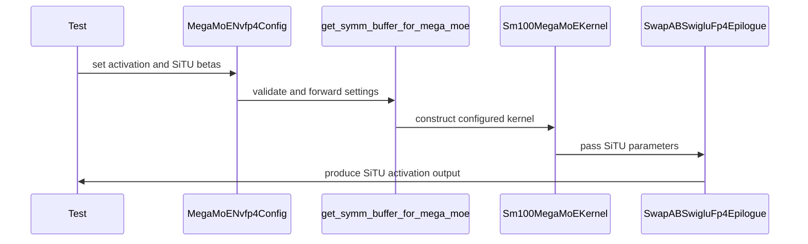

# [PR #5455] feat(moe_ep): Support Kimi K3 SiTU in NVFP4 MegaMoE

source: https://github.com/flashinfer-ai/flashinfer/pull/5455
state: open | updated: 2026-09-24T14:17:45Z
labels: run-ci

## 正文

## 📌 Description
Support Kimi K3 SiTU activation in NVFP4 MegaMoE.

Validated Kimi k3 e2e accuracy with vllm integration with DEP16.

<!-- What does this PR do? Briefly describe the changes and why they’re needed. -->

## 🔍 Related Issues

<!-- Link any related issues here -->

## 🚀 Pull Request Checklist

Thank you for contributing to FlashInfer! Before we review your pull request, please make sure the following items are complete.

### ✅ Pre-commit Checks

- [x] I have installed `pre-commit` by running `pip install pre-commit` (or used your preferred method).
- [x] I have installed the hooks with `pre-commit install`.
- [x] I have run the hooks manually with `pre-commit run --all-files` and fixed any reported issues.

> If you are unsure about how to set up `pre-commit`, see [the pre-commit documentation](https://pre-commit.com/).

## 🧪 Tests

- [x] Tests have been added or updated as needed.
- [x] All tests are passing (`unittest`, etc.).

## 🔬 Experimental Track

<!-- Only for PRs submitted under the experimental policy (CONTRIBUTING.md → "Experimental APIs and Backends").
     Leave this section untouched for normal PRs. -->

- [ ] This PR is **experimental**: it adds or changes code under `flashinfer/experimental/` and/or an `@flashinfer_experimental_api`. Tracking issue: #
  - [ ] The tracking issue names an owner, the reason for the experimental path, and a graduation plan with a target release.
  - [ ] Core changes are limited to a thin entry point (signature, shared validation, feature-gate check, backend selection, handoff).
  - [ ] Tests live in `tests/experimental/` and were validated on the intended hardware; a runnable example is included.
  - [ ] Nothing is registered in `flashinfer/aot.py`, and no experimental backend is reachable from `backend="auto"` without `FLASHINFER_ALLOW_EXPERIMENTAL_AUTO_BACKENDS=1`. (Calling an `@flashinfer_experimental_api` or naming a backend explicitly is itself the opt-in and needs no environment variable.)
  - [ ] **Test scope declared below.** The experimental CI lane runs exactly these targets, so keep them as narrow as the change allows.

<!-- Required for experimental PRs. Replace the commented lines below with your targets.
     Do not delete the fence or change its `experimental-tests` tag — the experimental-track
     watcher reads it verbatim to decide which targets to ask CI for. -->

```experimental-tests
# One target per line: a directory or a file. (A pytest ::selector is not
# supported -- the sharding runner cannot consume one.) Must be under
# tests/experimental/ and must exist. Delete these comment lines and add yours, e.g.
#
#   tests/experimental/test_my_backend.py
#   tests/experimental/my_backend/
#
# Declaring the whole tree (tests/experimental/) is allowed but means every
# experimental PR pays for every other feature's tests, in every matrix cell.
```

## Reviewer Notes

<!-- Optional: anything you'd like reviewers to focus on, concerns, etc. -->


<!-- This is an auto-generated comment: release notes by coderabbit.ai -->
## Summary by CodeRabbit

* **New Features**
  * Added Kimi SiTU activation support for NVFP4 MegaMoE workflows.
  * Added configurable SiTU scaling parameters, including optional linear-path scaling.
  * Added validation for activation modes and compatible parameter combinations.
  * Included activation settings in workspace and compiled-kernel configuration.
  * Preserved SwiGLU as the default activation.
  * Extended SiTU support to multi-rank execution and kernel/reference comparisons.

* **Tests**
  * Added coverage for valid and invalid SiTU configurations and execution scenarios.
<!-- end of auto-generated comment: release notes by coderabbit.ai -->

## 评论 (8)

### coderabbitai[bot] · 2026-09-22

<!-- This is an auto-generated comment: summarize by coderabbit.ai -->
<!-- review_stack_entry_start -->

<a href="https://app.coderabbit.ai/change-stack/flashinfer-ai/flashinfer/pull/5455"></a>

Navigate logical layers of code changes, visualize relationships, and explore their blast radius.

<!-- review_stack_entry_end -->
<!-- recent_review_start -->

No actionable comments were generated in the recent review. 🎉

<details>
<summary>ℹ️ Recent review info</summary>

<details>
<summary>⚙️ Run configuration</summary>

**Configuration used**: defaults

**Review profile**: CHILL

**Plan**: Advanced

**Run ID**: `7192a152-fd06-4cb7-bb61-ce94e33357b2`

</details>

<details>
<summary>📥 Commits</summary>

Reviewing files that changed from the base of the PR and between 2ffcd2939d30ad51a6b7c3677e879ff94c64d868 and 2e77a954b7c18cbebd40a31ee07dd8dc42c0ae1f.

</details>

<details>
<summary>📒 Files selected for processing (1)</summary>

* `tests/moe_ep/test_moe_ep_nvfp4_cutedsl_mega_multirank.py`

</details>

**Included review availability:** Your plan provides up to 8 included reviews per hour; 5 remain after this review.

</details>

---


<!-- recent_review_end -->
<!-- walkthrough_start -->

<details>
<summary>📝 Walkthrough</summary>

## Walkthrough

The NVFP4 MegaMoE path now supports SwiGLU and SiTU activation modes. SiTU parameters are validated, propagated through compilation and workspace allocation, applied in the kernel epilogue, included in cache keys, and covered by reference and multirank tests.

### Changes

**SiTU activation support**

|Layer / File(s)|Summary|
|---|---|
|**Activation configuration and validation** <br> `flashinfer/moe_ep/backends/mega/kernel/sm100/nvfp4_nvfp4_bf16_cutedsl/config.py`, `flashinfer/moe_ep/kernel_src/sm100/cutedsl_megamoe/shim/nvfp4.py`|Configuration objects add `activation`, `situ_beta`, and `situ_linear_beta`. They validate activation values, beta values, and incompatible parameters.|
|**Kernel execution** <br> `flashinfer/moe_ep/kernel_src/sm100/cutedsl_megamoe/src/moe_nvfp4_swapab/...`|Kernel constructors forward SiTU parameters to the epilogue. The epilogue applies the SiTU gate and optional up-path transformation. Cache keys include the SiTU parameters.|
|**Compilation and workspace wiring** <br> `flashinfer/moe_ep/kernel_src/sm100/cutedsl_megamoe/shim/nvfp4.py`, `flashinfer/moe_ep/backends/mega/kernel/sm100/nvfp4_nvfp4_bf16_cutedsl/backend.py`|The shim forwards activation settings to kernel construction, symmetric-memory buffers, dummy inputs, and compile keys. Workspace allocation and pool keys include the new fields.|
|**Reference and multirank validation** <br> `tests/moe_ep/test_nvfp4_cutedsl_kernel_vs_reference.py`, `tests/moe_ep/test_moe_ep_nvfp4_cutedsl_mega_multirank.py`|Torch references and test cases cover SiTU activation. Multirank oracle tests and configuration validation tests cover the new mode. SiTU cases skip SwiGLU clamp preprocessing.|

<!-- change_assessment_start -->
**Priority:** ➖ Normal


**Estimated code review effort:** 3 (Moderate) | ~25 minutes

<!-- change_assessment_commit:"2e77a954b7c18cbebd40a31ee07dd8dc42c0ae1f" -->
**Change:** Feature
<!-- change_assessment_end -->

### Sequence Diagram(s)



</details>

<!-- walkthrough_end -->
<!-- final_review_risk_start -->
**Merge Risk:** _⚪ Minimal_ · up to `2e77a`
<!-- final_review_risk_coverage:{"sourceCommitId":"2e77a954b7c18cbebd40a31ee07dd8dc42c0ae1f","coveredCommitId":"2e77a954b7c18cbebd40a31ee07dd8dc42c0ae1f","kind":"reviewed"} -->

This adds SiTU activation support while preserving SwiGLU behavior and covering the new path with validation and multirank reference tests. No merge-blocking production risk is identified.
<!-- final_review_risk_end -->
<!-- pre_merge_checks_walkthrough_start -->

<details>
<summary>🚥 Pre-merge checks | ✅ 4 | ❌ 1</summary>

### ❌ Failed checks (1 warning)

|     Check name     | Status     | Explanation                                                                                                                                                                                 | Resolution                                                                         |
| :----------------: | :--------- | :------------------------------------------------------------------------------------------------------------------------------------------------------------------------------------------ | :--------------------------------------------------------------------------------- |
| Docstring Coverage | ⚠️ Warning | Docstring coverage is 42.86% which is insufficient. The required threshold is 80.00%. Docstring coverage is scoped to functions touched by this diff. Analyzed 28 functions across 8 files. | Write docstrings for the functions missing them to satisfy the coverage threshold. |

<details>
<summary>✅ Passed checks (4 passed)</summary>

|         Check name         | Status   | Explanation                                                                                                                                                                                               |
| :------------------------: | :------- | :-------------------------------------------------------------------------------------------------------------------------------------------------------------------------------------------------------- |
|     Linked Issues check    | ✅ Passed | Check skipped because no linked issues were found for this pull request.                                                                                                                                  |
| Out of Scope Changes check | ✅ Passed | Check skipped because no linked issues were found for this pull request.                                                                                                                                  |
|         Title check        | ✅ Passed | The title clearly and concisely identifies the main change: adding Kimi K3 SiTU support to NVFP4 MegaMoE.                                                                                                 |
|      Description check     | ✅ Passed | The description explains the feature and reports end-to-end validation with vLLM and DEP16. It includes the required sections and marks pre-commit and test checks as complete. No related issue is list… |

</details>

</details>

<!-- pre_merge_checks_walkthrough_end -->

- [ ] <!-- {"checkboxId":"585bb3f6-faf5-4dbf-96d2-74e382adf19a"} --> Fix all pre-merge checks with AI
<!-- finishing_touch_checkbox_start -->

<details>
<summary>✨ Finishing Touches 💡 1</summary>

<!-- finishing_touch_suggestion:fix_ci -->
<details open>
<summary>🛠️ Fix failing CI checks 💡</summary>

- [ ] <!-- {"checkboxId": "9f0d24fb-b419-4f01-baf0-8b26b6424f34", "radioGroupId": "fix-ci-output-choice-group-unknown_comment_id"} --> Commit to this branch
- [ ] <!-- {"checkboxId": "6d21cfe8-ec3f-40e2-9222-b8318b64d3b0", "radioGroupId": "fix-ci-output-choice-group-unknown_comment_id"} --> Create a new PR

</details>
<details open>
<summary>🧪 Generate unit tests (beta)</summary>

- [ ] <!-- {"checkboxId": "f47ac10b-58cc-4372-a567-0e02b2c3d479", "radioGroupId": "utg-output-choice-group-unknown_comment_id"} --> Create a new PR

</details>

</details>

<!-- finishing_touch_checkbox_end -->
<!-- tips_start -->

---

Thanks for using [CodeRabbit](https://coderabbit.ai?utm_source=oss&utm_medium=github&utm_campaign=flashinfer-ai/flashinfer&utm_content=5455)! It's free for OSS, and your support helps us grow. If you like it, consider giving us a shout-out.

<details>
<summary>❤️ Share</summary>

- [X](https://twitter.com/intent/tweet?text=I%20just%20used%20%40coderabbitai%20for%20my%20code%20review%2C%20and%20it%27s%20fantastic%21%20It%27s%20free%20for%20OSS%20and%20offers%20a%20free%20trial%20for%20the%20proprietary%20code.%20Check%20it%20out%3A&url=https%3A//coderabbit.ai)
- [Mastodon](https://mastodon.social/share?text=I%20just%20used%20%40coderabbitai%20for%20my%20code%20review%2C%20and%20it%27s%20fantastic%21%20It%27s%20free%20for%20OSS%20and%20offers%20a%20free%20trial%20for%20the%20proprietary%20code.%20Check%20it%20out%3A%20https%3A%2F%2Fcoderabbit.ai)
- [Reddit](https://www.reddit.com/submit?title=Great%20tool%20for%20code%20review%20-%20CodeRabbit&text=I%20just%20used%20CodeRabbit%20for%20my%20code%20review%2C%20and%20it%27s%20fantastic%21%20It%27s%20free%20for%20OSS%20and%20offers%20a%20free%20trial%20for%20proprietary%20code.%20Check%20it%20out%3A%20https%3A//coderabbit.ai)
- [LinkedIn](https://www.linkedin.com/sharing/share-offsite/?url=https%3A%2F%2Fcoderabbit.ai&mini=true&title=Great%20tool%20for%20code%20review%20-%20CodeRabbit&summary=I%20just%20used%20CodeRabbit%20for%20my%20code%20review%2C%20and%20it%27s%20fantastic%21%20It%27s%20free%20for%20OSS%20and%20offers%20a%20free%20trial%20for%20proprietary%20code)

</details>


<sub>Comment `@coderabbitai help` to get the list of available commands.</sub>

<!-- tips_end -->

### wzhao18 · 2026-09-22

@samuellees Can you help review? Thanks!

### Anerudhan · 2026-09-22

Thanks for the contribution @wzhao18 . Can you point me to the PR for vLLM integration?

### Anerudhan · 2026-09-22

/bot run tests/moe_ep

### flashinfer-bot · 2026-09-22

GitLab MR [!1635](https://nv/flashinfer/-/merge_requests/1635) has been created, and the CI pipeline [#69306985](https://nv/flashinfer-ci/-/pipelines/69306985) is currently running. I'll report back once the pipeline job completes.

### wzhao18 · 2026-09-22

@Anerudhan Thanks for the review! The vllm integration draft PR is https://github.com/vllm-project/vllm/pull/58199 I've only validated that the integration is functional. Haven't polished the PR yet.

### flashinfer-bot · 2026-09-23

[SUCCESS] Pipeline [#69306985](https://nv/flashinfer-ci/-/pipelines/69306985): 25/25 executed test jobs passed

### wzhao18 · 2026-09-24

@Anerudhan ready to merge?

## Review (1)

### Anerudhan · 2026-09-22 · APPROVED

(no text)
