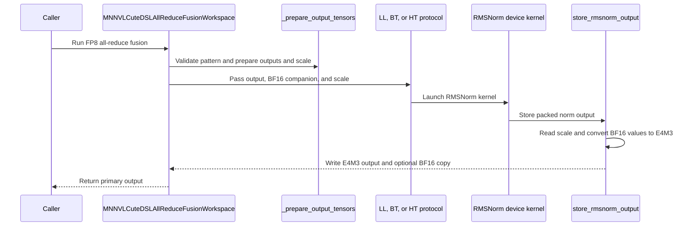

# [PR #5533] feat(allreduce): Add support for Static FP8 Output Quant in CUTEDSL MNNVL AR

source: https://github.com/flashinfer-ai/flashinfer/pull/5533
state: open | updated: 2026-09-24T16:56:50Z
labels: op: comm

## 正文

## 📌 Description

This PR adds support for FP8 output quant fusion in CUTEDSL MNNVL AR, significantly improving performance when the subsequent op is a static FP8 quant op.

## 🔍 Related Issues

https://github.com/flashinfer-ai/flashinfer/issues/2364 -- this PR only adds static FP8, not dynamic FP8

## 🚀 Pull Request Checklist

### ✅ Pre-commit Checks

- [x] I have installed `pre-commit` by running `pip install pre-commit` (or used your preferred method).
- [x] I have installed the hooks with `pre-commit install`.
- [x] I have run the hooks manually with `pre-commit run --all-files` and fixed any reported issues.

## 🧪 Tests

- [x] Tests have been added or updated as needed.
- [x] All tests are passing (`unittest`, etc.).

## 🔬 Experimental Track

<!-- Only for PRs submitted under the experimental policy (CONTRIBUTING.md → "Experimental APIs and Backends").
     Leave this section untouched for normal PRs. -->

- [ ] This PR is **experimental**: it adds or changes code under `flashinfer/experimental/` and/or an `@flashinfer_experimental_api`. Tracking issue: #
  - [ ] The tracking issue names an owner, the reason for the experimental path, and a graduation plan with a target release.
  - [ ] Core changes are limited to a thin entry point (signature, shared validation, feature-gate check, backend selection, handoff).
  - [ ] Tests live in `tests/experimental/` and were validated on the intended hardware; a runnable example is included.
  - [ ] Nothing is registered in `flashinfer/aot.py`, and no experimental backend is reachable from `backend="auto"` without `FLASHINFER_ALLOW_EXPERIMENTAL_AUTO_BACKENDS=1`. (Calling an `@flashinfer_experimental_api` or naming a backend explicitly is itself the opt-in and needs no environment variable.)
  - [ ] **Test scope declared below.** The experimental CI lane runs exactly these targets, so keep them as narrow as the change allows.

<!-- Required for experimental PRs. Replace the commented lines below with your targets.
     Do not delete the fence or change its `experimental-tests` tag — the experimental-track
     watcher reads it verbatim to decide which targets to ask CI for. -->

```experimental-tests
# One target per line: a directory or a file. (A pytest ::selector is not
# supported -- the sharding runner cannot consume one.) Must be under
# tests/experimental/ and must exist. Delete these comment lines and add yours, e.g.
#
#   tests/experimental/test_my_backend.py
#   tests/experimental/my_backend/
#
# Declaring the whole tree (tests/experimental/) is allowed but means every
# experimental PR pays for every other feature's tests, in every matrix cell.
```

## Reviewer Notes

Apologies for slop. Most of the implementation is codex-generated. I'm not too familiar with FI, but the code looks good enough to my eye.

<!-- This is an auto-generated comment: release notes by coderabbit.ai -->
## Summary by CodeRabbit

* **New Features**
  * Added static E4M3 FP8 normalized-output support for supported all-reduce fusion patterns in the reference MNNVL CuTe DSL backend.
  * FP8 outputs use a supplied scale and can optionally include a BF16 copy of the normalized result. Communication and residual outputs remain BF16.
  * Scale values can be updated between CUDA Graph replays; per-token scale estimation is not supported.
* **Documentation**
  * Clarified output dtype options, scale requirements, pattern behavior, and BF16 output requirements.
<!-- end of auto-generated comment: release notes by coderabbit.ai -->

## 评论 (1)

### coderabbitai[bot] · 2026-09-24

<!-- This is an auto-generated comment: summarize by coderabbit.ai -->
<!-- review_stack_entry_start -->

<a href="https://app.coderabbit.ai/change-stack/flashinfer-ai/flashinfer/pull/5533"></a>

Navigate logical layers of code changes, visualize relationships, and explore their blast radius.

<!-- review_stack_entry_end -->
<!-- recent_review_start -->

No actionable comments were generated in the recent review. 🎉

<details>
<summary>ℹ️ Recent review info</summary>

<details>
<summary>⚙️ Run configuration</summary>

**Configuration used**: defaults

**Review profile**: CHILL

**Plan**: Advanced

**Run ID**: `49fd3488-d0a6-4522-8527-febdaf00fc7b`

</details>

<details>
<summary>📥 Commits</summary>

Reviewing files that changed from the base of the PR and between 46d44c2d66335d61efaa7a6733afeffbb5cd8b5d and e7a64456ccb47f2bba0a1a9933907c5163692d86.

</details>

<details>
<summary>📒 Files selected for processing (9)</summary>

* `flashinfer/comm/mnnvl_cutedsl/kernel_bt/device_kernels.py`
* `flashinfer/comm/mnnvl_cutedsl/kernel_bt/protocol.py`
* `flashinfer/comm/mnnvl_cutedsl/kernel_ht/device_kernel.py`
* `flashinfer/comm/mnnvl_cutedsl/kernel_ht/protocol.py`
* `flashinfer/comm/mnnvl_cutedsl/kernel_ll/device_kernels.py`
* `flashinfer/comm/mnnvl_cutedsl/kernel_ll/protocol.py`
* `flashinfer/comm/mnnvl_cutedsl/runtime.py`
* `flashinfer/comm/mnnvl_cutedsl_ar.py`
* `tests/comm/test_mnnvl_cutedsl_config.py`

</details>

**Included review availability:** Your plan provides up to 8 included reviews per hour; 6 remain after this review.

</details>

---


<!-- recent_review_end -->
<!-- walkthrough_start -->

<details>
<summary>📝 Walkthrough</summary>

## Walkthrough

The MNNVL CuTe DSL all-reduce fusion workspace adds static E4M3 norm output for LL, BT, and HT protocols. It supports an optional BF16 norm-output copy and a device scale tensor. The change also adds output validation, FP8 tensor export handling, and GPU validation tests.

### Changes

**Static FP8 all-reduce output**

|Layer / File(s)|Summary|
|---|---|
|**Workspace output contract and dispatch** <br> `flashinfer/comm/mnnvl_cutedsl_ar.py`, `flashinfer/comm/allreduce.py`|The workspace accepts BF16 or E4M3 output modes, validates pattern and output arguments, prepares output and scale tensors, and routes the FP8 patterns through all-reduce. The documentation describes pattern requirements, scale constraints, and returned output.|
|**Shared FP8 conversion and tensor export** <br> `flashinfer/comm/mnnvl_cutedsl/static_fp8_epilogue.py`, `flashinfer/comm/mnnvl_cutedsl/runtime.py`|The shared epilogue converts scaled packed BF16 values to E4M3 and can also write BF16 output. The runtime exports FP8 tensors through a uint8 view for DLPack and restores their CuTe element type.|
|**LL, BT, and HT output plumbing** <br> `flashinfer/comm/mnnvl_cutedsl/kernel_{ll,bt,ht}/protocol.py`|Each protocol propagates the output dtype and optional BF16 output and scale tensors. Output allocation and compile-time tensor types reflect the selected output mode.|
|**Kernel output stores and validation** <br> `flashinfer/comm/mnnvl_cutedsl/kernel_{ll,bt,ht}/device_kernel.py`, `tests/comm/test_mnnvl_cutedsl_static_fp8.py`, `tests/comm/test_mnnvl_cutedsl_config.py`|The LL, BT, and HT kernels call the shared epilogue for norm output stores. The tests cover protocol and pattern variants, CUDA Graph replays with changing scales, numerical comparisons, and invalid configurations.|

**Estimated code review effort:** 4 (Complex) | ~45 minutes

### Sequence Diagram(s)



</details>

<!-- walkthrough_end -->
<!-- final_review_risk_start -->
**Merge Risk:** _⚪ Minimal_ · up to `e7a64`
<!-- final_review_risk_coverage:{"sourceCommitId":"e7a64456ccb47f2bba0a1a9933907c5163692d86","coveredCommitId":"e7a64456ccb47f2bba0a1a9933907c5163692d86","kind":"reviewed"} -->

The FP8 output contract and inspected store paths show no actionable issue remaining before merge. Normal validation can proceed.
<!-- final_review_risk_end -->
<!-- pre_merge_checks_walkthrough_start -->

<details>
<summary>🚥 Pre-merge checks | ✅ 4 | ❌ 1</summary>

### ❌ Failed checks (1 warning)

|     Check name     | Status     | Explanation                                                                                                                                                                                 | Resolution                                                                         |
| :----------------: | :--------- | :------------------------------------------------------------------------------------------------------------------------------------------------------------------------------------------ | :--------------------------------------------------------------------------------- |
| Docstring Coverage | ⚠️ Warning | Docstring coverage is 6.52% which is insufficient. The required threshold is 80.00%. Docstring coverage is scoped to functions touched by this diff. Analyzed 46 functions across 12 files. | Write docstrings for the functions missing them to satisfy the coverage threshold. |

<details>
<summary>✅ Passed checks (4 passed)</summary>

|         Check name         | Status   | Explanation                                                                                                                                                                                               |
| :------------------------: | :------- | :-------------------------------------------------------------------------------------------------------------------------------------------------------------------------------------------------------- |
|         Title check        | ✅ Passed | The title clearly and concisely identifies the main change: static FP8 output quantization support for CUTEDSL MNNVL all-reduce.                                                                          |
|      Description check     | ✅ Passed | The description includes the required sections, explains the feature scope, links the related issue, and reports pre-commit and test checklist status. The experimental-track section remains correctly … |
|     Linked Issues check    | ✅ Passed | Check skipped because no linked issues were found for this pull request.                                                                                                                                  |
| Out of Scope Changes check | ✅ Passed | Check skipped because no linked issues were found for this pull request.                                                                                                                                  |

</details>

</details>

<!-- pre_merge_checks_walkthrough_end -->

- [ ] <!-- {"checkboxId":"585bb3f6-faf5-4dbf-96d2-74e382adf19a"} --> Fix all pre-merge checks with AI
<!-- finishing_touch_checkbox_start -->

<details>
<summary>✨ Finishing Touches 💡 1</summary>

<!-- finishing_touch_suggestion:fix_ci -->
<details open>
<summary>🛠️ Fix failing CI checks 💡</summary>

- [ ] <!-- {"checkboxId": "9f0d24fb-b419-4f01-baf0-8b26b6424f34", "radioGroupId": "fix-ci-output-choice-group-unknown_comment_id"} --> Commit to this branch
- [ ] <!-- {"checkboxId": "6d21cfe8-ec3f-40e2-9222-b8318b64d3b0", "radioGroupId": "fix-ci-output-choice-group-unknown_comment_id"} --> Create a new PR

</details>
<details open>
<summary>🧪 Generate unit tests (beta)</summary>

- [ ] <!-- {"checkboxId": "f47ac10b-58cc-4372-a567-0e02b2c3d479", "radioGroupId": "utg-output-choice-group-unknown_comment_id"} --> Create a new PR

</details>

</details>

<!-- finishing_touch_checkbox_end -->
<!-- tips_start -->

---

Thanks for using [CodeRabbit](https://coderabbit.ai?utm_source=oss&utm_medium=github&utm_campaign=flashinfer-ai/flashinfer&utm_content=5533)! It's free for OSS, and your support helps us grow. If you like it, consider giving us a shout-out.

<details>
<summary>❤️ Share</summary>

- [X](https://twitter.com/intent/tweet?text=I%20just%20used%20%40coderabbitai%20for%20my%20code%20review%2C%20and%20it%27s%20fantastic%21%20It%27s%20free%20for%20OSS%20and%20offers%20a%20free%20trial%20for%20the%20proprietary%20code.%20Check%20it%20out%3A&url=https%3A//coderabbit.ai)
- [Mastodon](https://mastodon.social/share?text=I%20just%20used%20%40coderabbitai%20for%20my%20code%20review%2C%20and%20it%27s%20fantastic%21%20It%27s%20free%20for%20OSS%20and%20offers%20a%20free%20trial%20for%20the%20proprietary%20code.%20Check%20it%20out%3A%20https%3A%2F%2Fcoderabbit.ai)
- [Reddit](https://www.reddit.com/submit?title=Great%20tool%20for%20code%20review%20-%20CodeRabbit&text=I%20just%20used%20CodeRabbit%20for%20my%20code%20review%2C%20and%20it%27s%20fantastic%21%20It%27s%20free%20for%20OSS%20and%20offers%20a%20free%20trial%20for%20proprietary%20code.%20Check%20it%20out%3A%20https%3A//coderabbit.ai)
- [LinkedIn](https://www.linkedin.com/sharing/share-offsite/?url=https%3A%2F%2Fcoderabbit.ai&mini=true&title=Great%20tool%20for%20code%20review%20-%20CodeRabbit&summary=I%20just%20used%20CodeRabbit%20for%20my%20code%20review%2C%20and%20it%27s%20fantastic%21%20It%27s%20free%20for%20OSS%20and%20offers%20a%20free%20trial%20for%20proprietary%20code)

</details>


<sub>Comment `@coderabbitai help` to get the list of available commands.</sub>

<!-- tips_end -->
