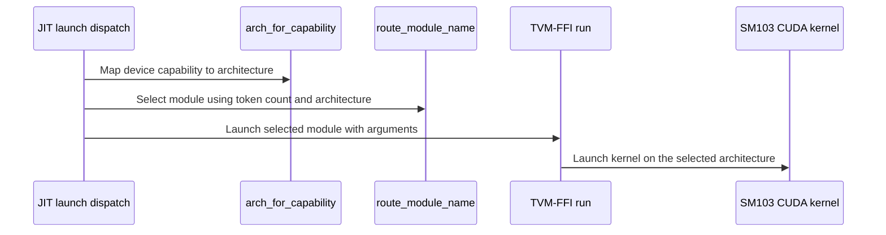

# [PR #5540] feat(cake_fused_norm_combine): add SM103 (B300) eight-peer fused norm-combine beside SM100

source: https://github.com/flashinfer-ai/flashinfer/pull/5540
state: open | updated: 2026-09-25T05:39:49Z
labels: run-ci, op: comm

## 正文

## Summary

Follow-up to #5528 (SM100 only): the Cake eight-peer fused residual-add + two-track RMSNorm + BF16 combine now also ships for **SM103 (B300)**.

* `csrc/cake_fused_norm_combine/sm_103a/*.cu` — generated device + binding translation units for the two dispatch variants (`parallel_lamport` below 256 tokens, `owner_lamport` at and above), the same schedules as SM100 built for `sm_103a`.
* `flashinfer/jit/cake_fused_norm_combine.py` — `MODULES` records carry `arch`; `ROUTES` is keyed by architecture then variant; `ARCH_BY_CAPABILITY` / `arch_for_capability` resolve the module from the device capability (10.0 → `sm_100a`, 10.3 → `sm_103a`); each module compiles with exactly its own `-gencode` (`sm100a_nvcc_flags` / `sm103a_nvcc_flags`).
* `flashinfer/comm/cake_fused_norm_combine.py` — API unchanged; the route scope now accepts uniform eight-GPU SM100 or SM103 nodes.
* `tests/comm/test_cake_fused_norm_combine.py` — inventory / dispatch / scope tests cover both architectures; the eight-GPU distributed test runs on a uniform SM100 or SM103 node.

No behaviour change on SM100: the `sm_100a` translation units are byte-identical to #5528 (the module SHA-256 pins in the loader are unchanged).

## Validation (8x B300 SXM6, driver 615.71.09, torch 2.13 / CUDA 13.3)

Every row is run with all eight ranks live (world size 8, hidden 2560, two RMSNorm tracks, epsilon 1e-6). Correctness compares the exported program bitwise against the generating Cake source kernel and against a PyTorch reference of the fused op on every rank; timing is CUPTI kernel time per rank with a cold L2 before every sample, counterbalanced source/export arms, 200 ms of samples per arm and group, three groups.

| tokens | variant | source us | export us | source / export | customer fused kernel us | customer / export |
|---:|---|---:|---:|---:|---:|---:|
| 1 | parallel_lamport | 18.37 | 18.24 | 1.007x | 19.33 | 1.060x |
| 8 | parallel_lamport | 19.14 | 18.94 | 1.010x | 20.93 | 1.105x |
| 64 | parallel_lamport | 19.46 | 19.39 | 1.003x | 22.14 | 1.142x |
| 256 | owner_lamport | 22.27 | 22.08 | 1.009x | 33.98 | 1.539x |
| 1024 | owner_lamport | 36.93 | 36.80 | 1.003x | n/a | — |
| 2048 | owner_lamport | 58.21 | 57.66 | 1.009x | n/a | — |

All six rows pass correctness and every timing gate (source/export agreement, directional agreement between counterbalanced groups, endpoint drift). The customer's own fused one-shot kernel (the workload this replaces) only resolves up to 256 tokens; the geometric mean over those four rows is 1.198x in favour of the exported program.

`pytest tests/comm/test_cake_fused_norm_combine.py` on the same node: 17 passed (CPU inventory / dispatch / scope tests plus the eight-GPU distributed test).

## Validation (8x B200, driver 615.71.09, torch 2.13 / CUDA 13.3)

Same protocol on eight B200 GPUs. The `sm_100a` units and loader pins are unchanged from #5528; this run regresses the two-architecture loader and tests on SM100.

| tokens | variant | source us | export us | source / export | customer fused kernel us | customer / export |
|---:|---|---:|---:|---:|---:|---:|
| 1 | parallel_lamport | 18.59 | 18.30 | 1.016x | 19.97 | 1.091x |
| 8 | parallel_lamport | 18.94 | 18.66 | 1.015x | 20.77 | 1.113x |
| 64 | parallel_lamport | 18.91 | 18.72 | 1.010x | 21.54 | 1.151x |
| 256 | owner_lamport | 21.98 | 21.82 | 1.007x | 33.54 | 1.537x |
| 1024 | owner_lamport | 38.24 | 37.86 | 1.010x | n/a | — |
| 2048 | owner_lamport | 58.46 | 58.35 | 1.002x | n/a | — |

All six rows pass correctness and every timing gate; customer geometric mean 1.210x over the four resolvable rows. `pytest tests/comm/test_cake_fused_norm_combine.py`: 17 passed. The B200 export regenerated this PR's files independently and produced byte-identical `sm_103a` units and Python modules.

## Test plan

- [x] `pytest tests/comm/test_cake_fused_norm_combine.py` on 8x B300 (CPU tests + distributed test) — 17 passed
- [x] export gates on 8x B300: 6/6 rows correct, source/export within 1.0-1.1 %
- [x] `pytest tests/comm/test_cake_fused_norm_combine.py` on 8x B200 (CPU tests + distributed test) — 17 passed
- [x] export gates on 8x B200: 6/6 rows correct, source/export within 0.2-1.6 %

🤖 Generated with [Claude Code](https://claude.com/claude-code)

## 评论 (5)

### coderabbitai[bot] · 2026-09-25

<!-- This is an auto-generated comment: summarize by coderabbit.ai -->
<!-- review_stack_entry_start -->

Navigate logical layers of code changes, visualize relationships, and explore their blast radius.

<!-- review_stack_entry_end -->
<!-- recent_review_start -->

ℹ️ Recent review info

⚙️ Run configuration

**Configuration used**: defaults

**Review profile**: CHILL

**Plan**: Advanced

**Run ID**: `91386cf6-eb76-4c32-ad4a-99ab9d025f6d`

📥 Commits

Reviewing files that changed from the base of the PR and between 71f72440588611143c46952f5323026e2c9dee44 and 5c9b1d5b576c6ae45e888084eed975469ff273ab.

📒 Files selected for processing (7)

* `csrc/cake_fused_norm_combine/sm_103a/cake_fused_norm_combine_bf16_a4503e9f297ee7549f0d_binding.cu`
* `csrc/cake_fused_norm_combine/sm_103a/cake_fused_norm_combine_bf16_a4503e9f297ee7549f0d_kernel.cu`
* `csrc/cake_fused_norm_combine/sm_103a/cake_fused_norm_combine_bf16_ee481367764d334ab381_binding.cu`
* `csrc/cake_fused_norm_combine/sm_103a/cake_fused_norm_combine_bf16_ee481367764d334ab381_kernel.cu`
* `flashinfer/comm/cake_fused_norm_combine.py`
* `flashinfer/jit/cake_fused_norm_combine.py`
* `tests/comm/test_cake_fused_norm_combine.py`

Files not reviewed due to moderation or processing errors (7)

* csrc/cake_fused_norm_combine/sm_103a/cake_fused_norm_combine_bf16_a4503e9f297ee7549f0d_kernel.cu
* csrc/cake_fused_norm_combine/sm_103a/cake_fused_norm_combine_bf16_ee481367764d334ab381_kernel.cu
* csrc/cake_fused_norm_combine/sm_103a/cake_fused_norm_combine_bf16_ee481367764d334ab381_binding.cu
* csrc/cake_fused_norm_combine/sm_103a/cake_fused_norm_combine_bf16_a4503e9f297ee7549f0d_binding.cu
* flashinfer/jit/cake_fused_norm_combine.py
* flashinfer/comm/cake_fused_norm_combine.py
* tests/comm/test_cake_fused_norm_combine.py

**Included review availability:** Your plan provides up to 8 included reviews per hour; 6 remain after this review.

---

<!-- recent_review_end -->
<!-- walkthrough_start -->

📝 Walkthrough

## Walkthrough

The change adds two SM103 BF16 fused norm-combine CUDA implementations and their TVM-FFI bindings. JIT dispatch now supports SM100 and SM103 module routes. The communication module and tests reflect both architectures.

### Changes

**Cake Fused Norm-Combine**

|Layer / File(s)|Summary|
|---|---|
|**SM103 BF16 kernel implementations**   `csrc/cake_fused_norm_combine/sm_103a/*_kernel.cu`|Adds two kernels that compute normalized residual tracks and workspace contributions, then coordinate peer data to write collective outputs. The kernels use different peer-combine paths.|
|**Kernel host bindings**   `csrc/cake_fused_norm_combine/sm_103a/*_binding.cu`|Adds TVM-FFI shims that validate tensors, scalars, and launch-grid dimensions, select the CUDA device, and launch each kernel with its configured block size and attributes.|
|**Architecture-specific JIT modules and dispatch**   `flashinfer/jit/cake_fused_norm_combine.py`|Adds SM103 module records and routes. Capability lookup, module selection, and NVCC flags now use the selected architecture.|
|**Communication routing and coverage**   `flashinfer/comm/cake_fused_norm_combine.py`, `tests/comm/test_cake_fused_norm_combine.py`|Updates the exported architecture capability mapping and route message. Tests cover module inventory, dispatch, route constraints, build flags, and distributed-test GPU eligibility for SM100 and SM103.|

<!-- change_assessment_start -->
**Priority:** ➖ Normal

**Estimated code review effort:** 4 (Complex) | ~60 minutes

<!-- change_assessment_commit:"5c9b1d5b576c6ae45e888084eed975469ff273ab" -->
**Change:** Feature
<!-- change_assessment_end -->

### Sequence Diagram(s)

**Suggested reviewers:** `aleozlx`

<!-- walkthrough_end -->
<!-- final_review_risk_start -->
**Merge Risk:** _⚪ Minimal_ · up to `5c9b1`
<!-- final_review_risk_coverage:{"sourceCommitId":"5c9b1d5b576c6ae45e888084eed975469ff273ab","coveredCommitId":"5c9b1d5b576c6ae45e888084eed975469ff273ab","kind":"reviewed"} -->

This change adds B300 (SM103) support for the eight-GPU fused norm-combine alongside the existing B200 path, selecting the correct build for each device. No concrete defect was found, and removing the old capability constant does not break any remaining code in the repository. The change appears ready to merge; confirming the B200 path still loads correctly before release would be prudent.
<!-- final_review_risk_end -->
<!-- architecture_review_start -->
### Security Architecture Review

**Security architecture risk:** _🟡 Moderate_ · up to `5c9b1`

The new GPU route preserves source verification and local device checks, but it does not verify that all eight peers use the supported uniform configuration. An unsupported group could enter a collective that has no bounded recovery from a stalled peer. No security vulnerability was verified.

**Retained concerns**
- **Medium · reliability · inferred:** The uniform eight-peer architecture assumed by the new SM103 route is not enforced across the process group. Each rank can select a locally supported kernel in a mixed SM100/SM103 group, while interoperability is unverified; a stalled peer would leave the collective without bounded recovery.

Security review details

**Security Blast Radius**
- _inferred_ — A failed peer can affect the eight-rank workspace and its peer-mapped GPU allocations. Evidence does not establish exposure across process groups, tenants, or nodes.

**Trust Boundaries and Controls**
- _observed_ — Direct module loading can be requested by registered name without normal route-applicability checks, but still passes through source verification and architecture-specific compilation. The direct-loading mechanism predates this PR; whether same-process callers are an untrusted boundary is not established.

**Resilience and Maintainability Implications**
- _observed_ — Peer polling and collective destruction have no evidenced timeout or abort transition. This is an inherited collective limitation extended to the SM103 route, not a demonstrated new attacker-controlled path.

**Hardening Proposals**
- _proposed_ — Establish or verify uniform peer capability before entering the collective, and define how callers contain or terminate a group after peer failure. These are proposals, not verified security findings.

<!-- architecture_review_end -->
<!-- pre_merge_checks_walkthrough_start -->

🚥 Pre-merge checks | ✅ 4 | ❌ 1

### ❌ Failed checks (1 warning)

|     Check name     | Status     | Explanation                                                                                                                                                                                 | Resolution                                                                         |
| :----------------: | :--------- | :------------------------------------------------------------------------------------------------------------------------------------------------------------------------------------------ | :--------------------------------------------------------------------------------- |
| Docstring Coverage | ⚠️ Warning | Docstring coverage is 16.00% which is insufficient. The required threshold is 80.00%. Docstring coverage is scoped to functions touched by this diff. Analyzed 50 functions across 7 files. | Write docstrings for the functions missing them to satisfy the coverage threshold. |

✅ Passed checks (4 passed)

|         Check name         | Status   | Explanation                                                                                                                                                                                               |
| :------------------------: | :------- | :-------------------------------------------------------------------------------------------------------------------------------------------------------------------------------------------------------- |
|     Linked Issues check    | ✅ Passed | Check skipped because no linked issues were found for this pull request.                                                                                                                                  |
| Out of Scope Changes check | ✅ Passed | Check skipped because no linked issues were found for this pull request.                                                                                                                                  |
|         Title check        | ✅ Passed | The title clearly and concisely identifies the primary change: adding SM103/B300 support for the eight-peer fused norm-combine beside SM100.                                                              |
|      Description check     | ✅ Passed | The description provides a detailed summary, implementation scope, validation results for B300 and B200, test results, and a completed test plan. It does not reproduce every template heading, such as … |

<!-- pre_merge_checks_walkthrough_end -->

- [ ] <!-- {"checkboxId":"585bb3f6-faf5-4dbf-96d2-74e382adf19a"} --> Fix all pre-merge checks with AI
<!-- finishing_touch_checkbox_start -->

✨ Finishing Touches 💡 1

<!-- finishing_touch_suggestion:fix_ci -->

🛠️ Fix failing CI checks 💡

- [ ] <!-- {"checkboxId": "9f0d24fb-b419-4f01-baf0-8b26b6424f34", "radioGroupId": "fix-ci-output-choice-group-unknown_comment_id"} --> Commit to this branch
- [ ] <!-- {"checkboxId": "6d21cfe8-ec3f-40e2-9222-b8318b64d3b0", "radioGroupId": "fix-ci-output-choice-group-unknown_comment_id"} --> Create a new PR

🧪 Generate unit tests (beta)

- [ ] <!-- {"checkboxId": "f47ac10b-58cc-4372-a567-0e02b2c3d479", "radioGroupId": "utg-output-choice-group-unknown_comment_id"} --> Create a new PR

<!-- finishing_touch_checkbox_end -->
<!-- This is an auto-generated comment: resource warnings by coderabbit.ai -->

> [!WARNING]
> Review coverage is incomplete: 7 files could not be fully reviewed. Findings from completed review steps are included; see review info for details.

<!-- end of auto-generated comment: resource warnings by coderabbit.ai -->
<!-- tips_start -->

---

Thanks for using [CodeRabbit](https://coderabbit.ai?utm_source=oss&utm_medium=github&utm_campaign=flashinfer-ai/flashinfer&utm_content=5540)! It's free for OSS, and your support helps us grow. If you like it, consider giving us a shout-out.

❤️ Share

- [X](https://twitter.com/intent/tweet?text=I%20just%20used%20%40coderabbitai%20for%20my%20code%20review%2C%20and%20it%27s%20fantastic%21%20It%27s%20free%20for%20OSS%20and%20offers%20a%20free%20trial%20for%20the%20proprietary%20code.%20Check%20it%20out%3A&url=https%3A//coderabbit.ai)
- [Mastodon](https://mastodon.social/share?text=I%20just%20used%20%40coderabbitai%20for%20my%20code%20review%2C%20and%20it%27s%20fantastic%21%20It%27s%20free%20for%20OSS%20and%20offers%20a%20free%20trial%20for%20the%20proprietary%20code.%20Check%20it%20out%3A%20https%3A%2F%2Fcoderabbit.ai)
- [Reddit](https://www.reddit.com/submit?title=Great%20tool%20for%20code%20review%20-%20CodeRabbit&text=I%20just%20used%20CodeRabbit%20for%20my%20code%20review%2C%20and%20it%27s%20fantastic%21%20It%27s%20free%20for%20OSS%20and%20offers%20a%20free%20trial%20for%20proprietary%20code.%20Check%20it%20out%3A%20https%3A//coderabbit.ai)
- [LinkedIn](https://www.linkedin.com/sharing/share-offsite/?url=https%3A%2F%2Fcoderabbit.ai&mini=true&title=Great%20tool%20for%20code%20review%20-%20CodeRabbit&summary=I%20just%20used%20CodeRabbit%20for%20my%20code%20review%2C%20and%20it%27s%20fantastic%21%20It%27s%20free%20for%20OSS%20and%20offers%20a%20free%20trial%20for%20proprietary%20code)

Comment `@coderabbitai help` to get the list of available commands.

<!-- tips_end -->

### yyihuang · 2026-09-25

/bot run tests/comm/test_cake_fused_norm_combine.py

### yyihuang · 2026-09-25

@flashinfer-bot run tests/comm/test_cake_fused_norm_combine.py

### flashinfer-bot · 2026-09-25

GitLab MR [!1692](https://nv/flashinfer/-/merge_requests/1692) has been created, and the CI pipeline [#69745296](https://nv/flashinfer-ci/-/pipelines/69745296) is currently running. I'll report back once the pipeline job completes.

### flashinfer-bot · 2026-09-25

[SUCCESS] Pipeline [#69745296](https://nv/flashinfer-ci/-/pipelines/69745296): 25/25 executed test jobs passed
