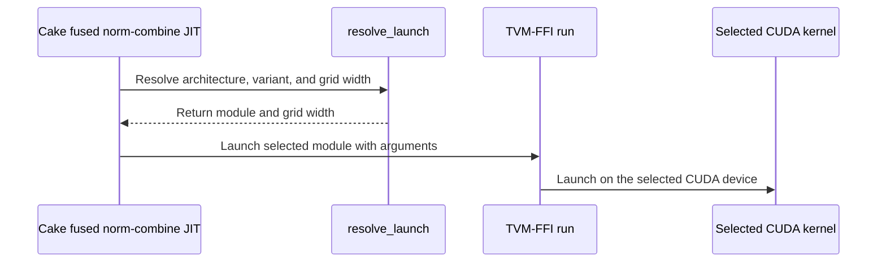

# [PR #5540] feat(cake_fused_norm_combine): add SM103 (B300) eight-peer fused norm-combine beside SM100 and a pipelined persistent owner reduce for 1024+ tokens

source: https://github.com/flashinfer-ai/flashinfer/pull/5540
state: closed | updated: 2026-09-26T21:50:23Z
labels: run-ci, op: comm

## 正文

## Summary

Follow-up to #5528 (SM100 only): the Cake eight-peer fused residual-add + two-track RMSNorm + BF16 combine now also ships for **SM103 (B300)**.

* `csrc/cake_fused_norm_combine/sm_103a/*.cu` — generated device + binding translation units for the two dispatch variants (`parallel_lamport` below 256 tokens, `owner_lamport` at and above), the same schedules as SM100 built for `sm_103a`.
* `flashinfer/jit/cake_fused_norm_combine.py` — `MODULES` records carry `arch`; `ROUTES` is keyed by architecture then variant; `ARCH_BY_CAPABILITY` / `arch_for_capability` resolve the module from the device capability (10.0 → `sm_100a`, 10.3 → `sm_103a`); each module compiles with exactly its own `-gencode` (`sm100a_nvcc_flags` / `sm103a_nvcc_flags`).
* `flashinfer/comm/cake_fused_norm_combine.py` — API unchanged; the route scope now accepts uniform eight-GPU SM100 or SM103 nodes.
* `tests/comm/test_cake_fused_norm_combine.py` — inventory / dispatch / scope tests cover both architectures; the eight-GPU distributed test runs on a uniform SM100 or SM103 node.

No behaviour change on SM100: the `sm_100a` translation units are byte-identical to #5528 (the module SHA-256 pins in the loader are unchanged).

### Third dispatch band: pipelined persistent owner reduce for T >= 1024 (SM100 + SM103)

The one-CTA-per-token owner reduce runs 3-7 waves deep at 1024-2048 tokens and every wave serialises both cross-GPU latency rounds. The new `owner_lamport_pipelined` module keeps the same arithmetic, workspace layout, three-slot Lamport rotation and PDL, but each CTA of a co-resident odd grid walks tokens `b, b+G, ...`: per step it publishes token `k` while reducing and broadcasting its owned token of step `k-2`, so the two latency rounds overlap with the publish stream. Outputs are bitwise identical to the existing kernels.

* `csrc/cake_fused_norm_combine/{sm_100a,sm_103a}/*.cu` — one new generated device + binding pair per architecture (the binding bakes the cooperative-grid launch attribute); the existing units are unchanged.
* `flashinfer/jit/cake_fused_norm_combine.py` — `ROUTES[arch]` gains `owner_lamport_pipelined`; `WIDE_MIN_TOKENS = 1024`; each module record carries a `grid_rule` (`per_token`, or `co_resident_odd` with the measured `ctas_per_sm` / `sm_count`); `persistent_grid` launches `tokens` CTAs when they fit, else the largest odd grid not above the co-resident capacity; on a device whose SM count differs from the verified receipt the loader falls back to the one-CTA-per-token `owner_lamport` module; `WIDE_COOPERATIVE` records the launch attribute.
* `flashinfer/comm/cake_fused_norm_combine.py` — API unchanged; re-exports `WIDE_MIN_TOKENS`.
* `tests/comm/test_cake_fused_norm_combine.py` — three-band inventory / dispatch tests, the `persistent_grid` formula and the grid-rule fallback; the eight-GPU distributed test exercises all three bands (T1 ... T2048).

Measured co-resident capacity of the pipelined kernel: 4 CTAs/SM on 148 SMs (592 CTAs) on both B200 and B300; T1024 and T2048 launch 591 CTAs (odd, so the token-to-owner assignment rotates across CTAs).

Paired receipts of the new wide route against the previous `owner_lamport` route on the same GPUs (10000 warmup / 100000 CUPTI samples per rank, max-rank medians): **8x B200** T1024 35.49 -> 31.87 us (1.113x), T2048 57.60 -> 49.50 us (1.164x); **8x B300** T1024 34.43 -> 30.98 us (1.112x), T2048 56.00 -> 49.15 us (1.139x). Rows below 1024 keep their previous modules.

## Validation (8x B300 SXM6, driver 615.71.09, torch 2.13 / CUDA 13.3)

Every row is run with all eight ranks live (world size 8, hidden 2560, two RMSNorm tracks, epsilon 1e-6). Correctness compares the exported program bitwise against the generating Cake source kernel and against a PyTorch reference of the fused op on every rank; timing is CUPTI kernel time per rank with a cold L2 before every sample, counterbalanced source/export arms, 200 ms of samples per arm and group, three groups.

| tokens | variant | source us | export us | source / export | customer fused kernel us | customer / export |
|---:|---|---:|---:|---:|---:|---:|
| 1 | parallel_lamport | 18.37 | 18.24 | 1.007x | 19.33 | 1.060x |
| 8 | parallel_lamport | 19.14 | 18.94 | 1.010x | 20.93 | 1.105x |
| 64 | parallel_lamport | 19.46 | 19.39 | 1.003x | 22.14 | 1.142x |
| 256 | owner_lamport | 22.27 | 22.08 | 1.009x | 33.98 | 1.539x |
| 1024 | owner_lamport | 36.93 | 36.80 | 1.003x | n/a | — |
| 2048 | owner_lamport | 58.21 | 57.66 | 1.009x | n/a | — |

All six rows pass correctness and every timing gate (source/export agreement, directional agreement between counterbalanced groups, endpoint drift). The customer's own fused one-shot kernel (the workload this replaces) only resolves up to 256 tokens; the geometric mean over those four rows is 1.198x in favour of the exported program.

`pytest tests/comm/test_cake_fused_norm_combine.py` on the same node: 17 passed (CPU inventory / dispatch / scope tests plus the eight-GPU distributed test).

## Validation (8x B200, driver 615.71.09, torch 2.13 / CUDA 13.3)

Same protocol on eight B200 GPUs. The `sm_100a` units and loader pins are unchanged from #5528; this run regresses the two-architecture loader and tests on SM100.

| tokens | variant | source us | export us | source / export | customer fused kernel us | customer / export |
|---:|---|---:|---:|---:|---:|---:|
| 1 | parallel_lamport | 18.59 | 18.30 | 1.016x | 19.97 | 1.091x |
| 8 | parallel_lamport | 18.94 | 18.66 | 1.015x | 20.77 | 1.113x |
| 64 | parallel_lamport | 18.91 | 18.72 | 1.010x | 21.54 | 1.151x |
| 256 | owner_lamport | 21.98 | 21.82 | 1.007x | 33.54 | 1.537x |
| 1024 | owner_lamport | 38.24 | 37.86 | 1.010x | n/a | — |
| 2048 | owner_lamport | 58.46 | 58.35 | 1.002x | n/a | — |

All six rows pass correctness and every timing gate; customer geometric mean 1.210x over the four resolvable rows. `pytest tests/comm/test_cake_fused_norm_combine.py`: 17 passed. The B200 export regenerated this PR's files independently and produced byte-identical `sm_103a` units and Python modules.

## Validation of the third band (export run at the three-band loader)

### 8x B300 SXM6 (driver 615.71.09, torch 2.13 / CUDA 13.3)

Same protocol as above (world size 8, hidden 2560, two tracks, epsilon 1e-6; bitwise correctness of the exported program against the generating Cake source kernel and a PyTorch reference on every rank; CUPTI kernel time per rank with a cold L2 before every sample, counterbalanced source/export arms, 200 ms of samples per arm and group, three groups). The 1024- and 2048-token rows now resolve to the new `owner_lamport_pipelined` module (591-CTA cooperative grid).

| tokens | route | source us | export us | source / export | customer fused kernel us | customer / export |
|---:|---|---:|---:|---:|---:|---:|
| 1 | parallel_lamport | 17.25 | 17.28 | 0.998x | 18.62 | 1.078x |
| 8 | parallel_lamport | 17.57 | 17.47 | 1.005x | 19.42 | 1.112x |
| 64 | parallel_lamport | 20.10 | 19.90 | 1.010x | 22.46 | 1.129x |
| 256 | owner_lamport | 23.04 | 22.82 | 1.010x | 34.98 | 1.533x |
| 1024 | owner_lamport_pipelined | 34.72 | 34.69 | 1.001x | n/a | — |
| 2048 | owner_lamport_pipelined | 51.87 | 51.94 | 0.999x | n/a | — |

All six rows pass correctness and every timing gate; source/export geometric mean 1.004x; customer geometric mean 1.200x over the four rows the customer kernel resolves. `pytest tests/comm/test_cake_fused_norm_combine.py` on the same node: 25 passed (three-band inventory / dispatch / grid-rule tests plus the eight-GPU distributed test).

### 8x B200 (driver 615.71.09, torch 2.13 / CUDA 13.3)

Same protocol on eight B200 GPUs; the B200 export regenerated the delivery independently and produced byte-identical generated units and Python modules to the B300 run.

| tokens | route | source us | export us | source / export | customer fused kernel us | customer / export |
|---:|---|---:|---:|---:|---:|---:|
| 1 | parallel_lamport | 17.38 | 17.28 | 1.005x | 18.66 | 1.080x |
| 8 | parallel_lamport | 17.54 | 17.47 | 1.004x | 19.81 | 1.134x |
| 64 | parallel_lamport | 19.23 | 18.91 | 1.017x | 21.82 | 1.154x |
| 256 | owner_lamport | 21.86 | 21.41 | 1.021x | 33.38 | 1.559x |
| 1024 | owner_lamport_pipelined | 33.95 | 33.95 | 1.000x | n/a | — |
| 2048 | owner_lamport_pipelined | 50.53 | 50.72 | 0.996x | n/a | — |

All six rows pass correctness and every timing gate; source/export geometric mean 1.007x; customer geometric mean 1.218x over the four rows the customer kernel resolves. `pytest tests/comm/test_cake_fused_norm_combine.py` on the same node: 25 passed.

The published Python modules are the exported modules after the upstream `ruff-format` hook (two line wraps); their ASTs are identical to the measured modules. The generated CUDA units are byte-identical to the measured ones.

## Test plan

- [x] `pytest tests/comm/test_cake_fused_norm_combine.py` on 8x B300 (CPU tests + distributed test) — 17 passed
- [x] export gates on 8x B300: 6/6 rows correct, source/export within 1.0-1.1 %
- [x] `pytest tests/comm/test_cake_fused_norm_combine.py` on 8x B200 (CPU tests + distributed test) — 17 passed
- [x] export gates on 8x B200: 6/6 rows correct, source/export within 0.2-1.6 %
- [x] three-band export gates on 8x B300: 6/6 rows correct, source/export within 0.2-1.0 %; `pytest tests/comm/test_cake_fused_norm_combine.py` 25 passed
- [x] three-band export gates on 8x B200: 6/6 rows correct, source/export within 0.4-2.1 %; `pytest tests/comm/test_cake_fused_norm_combine.py` 25 passed
- [x] `pre-commit run --files` on the three Python modules (upstream hook versions)

🤖 Generated with [Claude Code](https://claude.com/claude-code)

<!-- This is an auto-generated comment: release notes by coderabbit.ai -->

## Summary by CodeRabbit

* **New Features**
  * Added support for fused bfloat16 normalization and combine operations on SM103 GPUs, alongside existing SM100 support.
  * Added a pipelined processing option for workloads with 1,024 or more tokens on supported architectures. Other workload sizes continue to use existing processing routes.
  * Added architecture and launch configuration information to the public JIT interface.

<!-- end of auto-generated comment: release notes by coderabbit.ai -->

## 评论 (9)

### coderabbitai[bot] · 2026-09-25

<!-- This is an auto-generated comment: summarize by coderabbit.ai -->
<!-- review_stack_entry_start -->

Navigate logical layers of code changes, visualize relationships, and explore their blast radius.

<!-- review_stack_entry_end -->
<!-- recent_review_start -->

No actionable comments were generated in the recent review. 🎉

ℹ️ Recent review info

⚙️ Run configuration

**Configuration used**: defaults

**Review profile**: CHILL

**Plan**: Advanced

**Run ID**: `e90f66cd-1a24-4671-a803-f0db5acd9137`

📥 Commits

Reviewing files that changed from the base of the PR and between 5c9b1d5b576c6ae45e888084eed975469ff273ab and 501dcf7ab978f07546b66e8afab9f76aef7e86e7.

📒 Files selected for processing (7)

* `csrc/cake_fused_norm_combine/sm_100a/cake_fused_norm_combine_bf16_fc0be1404d798e2dcbb9_binding.cu`
* `csrc/cake_fused_norm_combine/sm_100a/cake_fused_norm_combine_bf16_fc0be1404d798e2dcbb9_kernel.cu`
* `csrc/cake_fused_norm_combine/sm_103a/cake_fused_norm_combine_bf16_a7ccd61bc956f00010a9_binding.cu`
* `csrc/cake_fused_norm_combine/sm_103a/cake_fused_norm_combine_bf16_a7ccd61bc956f00010a9_kernel.cu`
* `flashinfer/comm/cake_fused_norm_combine.py`
* `flashinfer/jit/cake_fused_norm_combine.py`
* `tests/comm/test_cake_fused_norm_combine.py`

**Included review availability:** Your plan provides up to 8 included reviews per hour; 5 remain after this review.

---

<!-- recent_review_end -->
<!-- walkthrough_start -->

📝 Walkthrough

## Walkthrough

The change adds BF16 fused norm-combine CUDA kernels and TVM-FFI bindings for SM100 and SM103. JIT dispatch adds a pipelined variant for larger token counts and resolves launch grids by architecture. Communication routing and tests cover both architectures.

### Changes

**Cake Fused Norm-Combine**

|Layer / File(s)|Summary|
|---|---|
|**BF16 kernel computation and peer reduction**   `csrc/cake_fused_norm_combine/sm_100a/*_kernel.cu`, `csrc/cake_fused_norm_combine/sm_103a/*_kernel.cu`|Adds kernels that compute normalized residual tracks and workspace contributions, combine peer payloads, and write collective outputs. The SM103 kernels use distinct peer-reduction paths.|
|**Validated TVM-FFI kernel launches**   `csrc/cake_fused_norm_combine/sm_100a/*_binding.cu`, `csrc/cake_fused_norm_combine/sm_103a/*_binding.cu`|Adds host bindings that validate tensors, scalar values, and grid dimensions, select the CUDA device, and launch the corresponding kernel.|
|**Architecture-specific JIT dispatch and launch grids**   `flashinfer/jit/cake_fused_norm_combine.py`|Adds SM103 module records and a pipelined variant for token counts of 1024 or more. Launch resolution uses architecture-specific module records and grid rules, with a per-token owner-reduce fallback when the recorded grid does not apply.|
|**Communication routing and validation tests**   `flashinfer/comm/cake_fused_norm_combine.py`, `tests/comm/test_cake_fused_norm_combine.py`|Updates architecture exports and route messaging. Tests cover SM100 and SM103 module inventory, dispatch, launch grids, route constraints, and distributed-test GPU eligibility.|

<!-- change_assessment_start -->
**Priority:** ➖ Normal

**Estimated code review effort:** 4 (Complex) | ~60 minutes

<!-- change_assessment_commit:"501dcf7ab978f07546b66e8afab9f76aef7e86e7" -->
**Change:** Feature
<!-- change_assessment_end -->

### Sequence Diagram(s)

```mermaid
sequenceDiagram
  participant JIT as Cake fused norm-combine JIT
  participant Resolver as resolve_launch
  participant FFI as TVM-FFI run
  participant Kernel as Selected CUDA kernel
  JIT->>Resolver: Resolve architecture, variant, and grid width
  Resolver-->>JIT: Return module and grid width
  JIT->>FFI: Launch selected module with arguments
  FFI->>Kernel: Launch on the selected CUDA device
```

<!-- walkthrough_end -->
<!-- final_review_risk_start -->
**Merge Risk:** _⚪ Minimal_ · up to `501dc`
<!-- final_review_risk_coverage:{"sourceCommitId":"501dcf7ab978f07546b66e8afab9f76aef7e86e7","coveredCommitId":"501dcf7ab978f07546b66e8afab9f76aef7e86e7","kind":"reviewed"} -->

This change adds B300 (SM103) support and a pipelined path for large batches (1024 or more tokens) to the eight-GPU fused norm-combine operation. It leaves the public API unchanged and falls back to the non-pipelined path on devices whose SM count differs from the verified configuration. Review found no concrete defect, so the change appears ready to merge.
<!-- final_review_risk_end -->
<!-- architecture_review_start -->
### Security Architecture Review

**Security architecture risk:** _🟡 Moderate_ · up to `501dc`

The normal API checks device, tensor, and workspace requirements, but the newly exposed GPU launcher accepts weaker arguments, and the eight-peer protocol has no visible way to stop waiting when a peer does not publish. The demonstrated scope is the participating GPU job, not a proven remote or cross-tenant boundary.

**Retained concerns**
- **Medium · security · inferred:** The new SM103 typed launcher permits direct callers to supply a short or forged workspace pointer table, out-of-range rank, or undersized tensors. The kernel indexes peer pointers and writes outputs using those arguments, creating a GPU memory-safety and job-containment risk outside the validated high-level API.
- **Medium · reliability · inferred:** The newly reachable SM103 collective relies on every peer publishing in the expected launch sequence. If a peer fails or launches with different token work, another peer can remain in unbounded sentinel polling, while collective workspace teardown cannot complete a stuck launch.

Security review details

**Security Blast Radius**
- _inferred_ — A malformed direct launch can affect GPU memory accessible to the calling process, including peer mappings it holds; a nonpublishing peer can stall the participating eight-rank job. The inspected paths do not establish cross-tenant access or remote reachability.

**Security Findings and Attack Paths**
- _inferred_ — A caller able to invoke the exported typed run function directly can supply valid-typed, same-device tensors without supplying the required extents or workspace table. The binding passes their pointers to a kernel that indexes fixed peer-table positions; this path does not require passing through the stronger communication API.

**Trust Boundaries and Controls**
- _observed_ — The high-level caller validates shapes, workspace lifetime and capacity, and local device capability. The binding independently checks device and dtype but trusts workspace pointer contents; source hashes protect the build inputs, not launch arguments.

**Resilience and Maintainability Implications**
- _inferred_ — The shared workspace’s normal completion and teardown depend on ordered, live peers. No inspected per-launch generation or in-kernel cancellation state releases a peer waiting for a missing publication; external CUDA or job-level recovery remains unknown.

**Hardening Proposals**
- _proposed_ — Enforce rank, tensor extents, pointer-table length and provenance, and variant-specific grid constraints at the exported launch boundary, or restrict direct launches to a validated workspace handle.
- _proposed_ — Define a coordinated failure and reuse contract for the eight peers, including agreement on launch parameters, prevention of concurrent workspace reuse, and a bounded abort or job-level recovery path when publication cannot complete.

<!-- architecture_review_end -->
<!-- pre_merge_checks_walkthrough_start -->

🚥 Pre-merge checks | ✅ 4 | ❌ 1

### ❌ Failed checks (1 warning)

|     Check name     | Status     | Explanation                                                                                                                                                                                  | Resolution                                                                         |
| :----------------: | :--------- | :------------------------------------------------------------------------------------------------------------------------------------------------------------------------------------------- | :--------------------------------------------------------------------------------- |
| Docstring Coverage | ⚠️ Warning | Docstring coverage is 14.44% which is insufficient. The required threshold is 80.00%. Docstring coverage is scoped to functions touched by this diff. Analyzed 90 functions across 11 files. | Write docstrings for the functions missing them to satisfy the coverage threshold. |

✅ Passed checks (4 passed)

|         Check name         | Status   | Explanation                                                                                                                                                                                               |
| :------------------------: | :------- | :-------------------------------------------------------------------------------------------------------------------------------------------------------------------------------------------------------- |
|     Linked Issues check    | ✅ Passed | Check skipped because no linked issues were found for this pull request.                                                                                                                                  |
| Out of Scope Changes check | ✅ Passed | Check skipped because no linked issues were found for this pull request.                                                                                                                                  |
|         Title check        | ✅ Passed | The title clearly identifies the SM103 support and the pipelined persistent owner-reduce change for 1024+ tokens. It is specific and related to the primary changes, although it is longer than ideal.    |
|      Description check     | ✅ Passed | The description provides a detailed summary, related issue reference, implementation scope, validation results, test coverage, performance data, and pre-commit status. It does not reproduce every temp… |

<!-- pre_merge_checks_walkthrough_end -->

- [ ] <!-- {"checkboxId":"585bb3f6-faf5-4dbf-96d2-74e382adf19a"} --> Fix all pre-merge checks with AI
<!-- finishing_touch_checkbox_start -->

✨ Finishing Touches 💡 1

<!-- finishing_touch_suggestion:fix_ci -->

🛠️ Fix failing CI checks 💡

- [ ] <!-- {"checkboxId": "9f0d24fb-b419-4f01-baf0-8b26b6424f34", "radioGroupId": "fix-ci-output-choice-group-unknown_comment_id"} --> Commit to this branch
- [ ] <!-- {"checkboxId": "6d21cfe8-ec3f-40e2-9222-b8318b64d3b0", "radioGroupId": "fix-ci-output-choice-group-unknown_comment_id"} --> Create a new PR

🧪 Generate unit tests (beta)

- [ ] <!-- {"checkboxId": "f47ac10b-58cc-4372-a567-0e02b2c3d479", "radioGroupId": "utg-output-choice-group-unknown_comment_id"} --> Create a new PR

<!-- finishing_touch_checkbox_end -->
<!-- tips_start -->

---

Thanks for using [CodeRabbit](https://coderabbit.ai?utm_source=oss&utm_medium=github&utm_campaign=flashinfer-ai/flashinfer&utm_content=5540)! It's free for OSS, and your support helps us grow. If you like it, consider giving us a shout-out.

❤️ Share

- [X](https://twitter.com/intent/tweet?text=I%20just%20used%20%40coderabbitai%20for%20my%20code%20review%2C%20and%20it%27s%20fantastic%21%20It%27s%20free%20for%20OSS%20and%20offers%20a%20free%20trial%20for%20the%20proprietary%20code.%20Check%20it%20out%3A&url=https%3A//coderabbit.ai)
- [Mastodon](https://mastodon.social/share?text=I%20just%20used%20%40coderabbitai%20for%20my%20code%20review%2C%20and%20it%27s%20fantastic%21%20It%27s%20free%20for%20OSS%20and%20offers%20a%20free%20trial%20for%20the%20proprietary%20code.%20Check%20it%20out%3A%20https%3A%2F%2Fcoderabbit.ai)
- [Reddit](https://www.reddit.com/submit?title=Great%20tool%20for%20code%20review%20-%20CodeRabbit&text=I%20just%20used%20CodeRabbit%20for%20my%20code%20review%2C%20and%20it%27s%20fantastic%21%20It%27s%20free%20for%20OSS%20and%20offers%20a%20free%20trial%20for%20proprietary%20code.%20Check%20it%20out%3A%20https%3A//coderabbit.ai)
- [LinkedIn](https://www.linkedin.com/sharing/share-offsite/?url=https%3A%2F%2Fcoderabbit.ai&mini=true&title=Great%20tool%20for%20code%20review%20-%20CodeRabbit&summary=I%20just%20used%20CodeRabbit%20for%20my%20code%20review%2C%20and%20it%27s%20fantastic%21%20It%27s%20free%20for%20OSS%20and%20offers%20a%20free%20trial%20for%20proprietary%20code)

Comment `@coderabbitai help` to get the list of available commands.

<!-- tips_end -->

### yyihuang · 2026-09-25

/bot run tests/comm/test_cake_fused_norm_combine.py

### yyihuang · 2026-09-25

@flashinfer-bot run tests/comm/test_cake_fused_norm_combine.py

### flashinfer-bot · 2026-09-25

GitLab MR [!1692](https://nv/flashinfer/-/merge_requests/1692) has been created, and the CI pipeline [#69745296](https://nv/flashinfer-ci/-/pipelines/69745296) is currently running. I'll report back once the pipeline job completes.

### flashinfer-bot · 2026-09-25

[SUCCESS] Pipeline [#69745296](https://nv/flashinfer-ci/-/pipelines/69745296): 25/25 executed test jobs passed

### yyihuang · 2026-09-25

/bot run tests/comm/test_cake_fused_norm_combine.py

### yyihuang · 2026-09-25

@flashinfer-bot run tests/comm/test_cake_fused_norm_combine.py

### flashinfer-bot · 2026-09-25

GitLab MR [!1692](https://nv/flashinfer/-/merge_requests/1692) has been updated with latest changes, and the CI pipeline [#69802251](https://nv/flashinfer-ci/-/pipelines/69802251) is currently running. I'll report back once the pipeline job completes.

### flashinfer-bot · 2026-09-25

[SUCCESS] Pipeline [#69802251](https://nv/flashinfer-ci/-/pipelines/69802251): 25/25 executed test jobs passed

## Review (1)

### yzh119 · 2026-09-26 · APPROVED

(no text)
