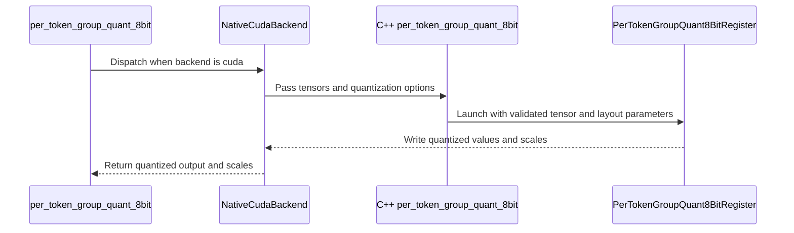

# [PR #5546] perf(quantization): add register-resident CUDA backend

source: https://github.com/flashinfer-ai/flashinfer/pull/5546
state: open | updated: 2026-09-25T09:15:11Z
labels: op: misc

## 正文

## 📌 Description

Add an explicit `backend="cuda"` for `per_token_group_quant_8bit` when `group_size=128`.

The native CUDA kernel assigns one 16-lane half warp to each quantization group. Each lane keeps eight FP16/BF16 values in registers, participates in a half-warp absmax reduction, and writes eight FP8/INT8 values with vectorized I/O. This removes the shared-memory round trip and block-wide synchronization from the group reduction path.

The backend supports:

- FP16 and BF16 input; FP8 E4M3, FP8 E5M2, and INT8 output.
- Row-major and column-major scales, TMA-aligned scale storage, and UE8M0 scales.
- Unaligned contiguous input through a scalar-load path.
- Empty tensors without launching a zero-sized grid.

`"cutile"` remains the default. Unsupported CUDA configurations raise a clear error instead of silently falling back to another backend.

### Performance

Environment: H100 and B200, CUDA 13.0.1 FlashInfer CI image. Measurements use `bench_gpu_time` with 5 dry runs, 30 repeats, cold-L2 mode, and CUDA events because CUPTI was unavailable.

Reproduction:

```bash
python3 benchmarks/bench_per_token_group_quant_8bit.py \
  --providers cuda,cutile --baseline cutile --dst-dtype fp8_e4m3
python3 benchmarks/bench_per_token_group_quant_8bit.py \
  --providers cuda,cutile --baseline cutile --dst-dtype int8
```

Across the benchmark's 33-shape `(num_tokens, hidden_dim)` sweep:

| GPU | Output | Geomean speedup vs cuTile | CUDA faster |
|---|---:|---:|---:|
| H100 | FP8 E4M3 | 1.64x | 33/33 shapes |
| H100 | INT8 | 1.74x | 33/33 shapes |
| B200 | FP8 E4M3 | 1.61x | 26/33 shapes |

Representative absolute latencies (CUDA / cuTile):

| GPU | Output | Shape | CUDA | cuTile | Speedup |
|---|---:|---:|---:|---:|---:|
| H100 | FP8 E4M3 | `(128, 4096)` | 0.00658 ms | 0.00819 ms | 1.24x |
| H100 | FP8 E4M3 | `(512, 7168)` | 0.01042 ms | 0.02293 ms | 2.20x |
| H100 | FP8 E4M3 | `(4096, 7168)` | 0.04064 ms | 0.14374 ms | 3.54x |
| H100 | INT8 | `(2048, 7168)` | 0.02320 ms | 0.07496 ms | 3.23x |
| B200 | FP8 E4M3 | `(128, 4096)` | 0.00717 ms | 0.00918 ms | 1.28x |
| B200 | FP8 E4M3 | `(4096, 7168)` | 0.03376 ms | 0.12592 ms | 3.73x |

The B200 path is launch-bound for the smallest inputs; the worst observed point was 0.99x (`0.00720 ms` CUDA vs `0.00715 ms` cuTile at `(16, 7168)`).

## 🔍 Related Issues

No FlashInfer issue. The register-resident design was motivated by [vLLM PR #55330](https://github.com/vllm-project/vllm/pull/55330).

## 🚀 Pull Request Checklist

Thank you for contributing to FlashInfer! Before we review your pull request, please make sure the following items are complete.

### ✅ Pre-commit Checks

- [x] I have installed `pre-commit` by running `pip install pre-commit` (or used your preferred method).
- [ ] I have installed the hooks with `pre-commit install`.
- [x] I have run the hooks manually with `pre-commit run --all-files` and fixed any reported issues.

`pre-commit` was run through `uvx`. Hook installation was skipped because this checkout has a centrally configured `core.hooksPath`; the full all-files run passed.

> If you are unsure about how to set up `pre-commit`, see [the pre-commit documentation](https://pre-commit.com/).

## 🧪 Tests

- [x] Tests have been added or updated as needed.
- [x] All tests are passing (`unittest`, etc.).

H100 / CUDA 13.0.1:

```text
pytest tests/quantization/test_per_token_group_quant_8bit_cuda.py -q
30 passed, 1 unrelated deprecation warning in 25.93s
```

The tests compare quantized values and scales bit-for-bit across FP16/BF16 inputs, FP8 E4M3/E5M2 and INT8 outputs, row/column-major scales, TMA alignment, UE8M0, tail CTAs, unaligned contiguous input, and empty input.

## 🔬 Experimental Track

<!-- Only for PRs submitted under the experimental policy (CONTRIBUTING.md → "Experimental APIs and Backends").
     Leave this section untouched for normal PRs. -->

- [ ] This PR is **experimental**: it adds or changes code under `flashinfer/experimental/` and/or an `@flashinfer_experimental_api`. Tracking issue: #
  - [ ] The tracking issue names an owner, the reason for the experimental path, and a graduation plan with a target release.
  - [ ] Core changes are limited to a thin entry point (signature, shared validation, feature-gate check, backend selection, handoff).
  - [ ] Tests live in `tests/experimental/` and were validated on the intended hardware; a runnable example is included.
  - [ ] Nothing is registered in `flashinfer/aot.py`, and no experimental backend is reachable from `backend="auto"` without `FLASHINFER_ALLOW_EXPERIMENTAL_AUTO_BACKENDS=1`. (Calling an `@flashinfer_experimental_api` or naming a backend explicitly is itself the opt-in and needs no environment variable.)
  - [ ] **Test scope declared below.** The experimental CI lane runs exactly these targets, so keep them as narrow as the change allows.

<!-- Required for experimental PRs. Replace the commented lines below with your targets.
     Do not delete the fence or change its `experimental-tests` tag — the experimental-track
     watcher reads it verbatim to decide which targets to ask CI for. -->

```experimental-tests
# One target per line: a directory or a file. (A pytest ::selector is not
# supported -- the sharding runner cannot consume one.) Must be under
# tests/experimental/ and must exist. Delete these comment lines and add yours, e.g.
#
#   tests/experimental/test_my_backend.py
#   tests/experimental/my_backend/
#
# Declaring the whole tree (tests/experimental/) is allowed but means every
# experimental PR pays for every other feature's tests, in every matrix cell.
```

## Reviewer Notes

The concept was inspired by vLLM #55330, but this is an independent FlashInfer implementation: it uses 16 lanes × 8 values per group rather than vLLM's 8 lanes × 16 values schedule and integrates FlashInfer's TVM-FFI/JIT and scale-layout APIs. Please focus review on half-warp masking, vector alignment, and column-major scale indexing.


<!-- This is an auto-generated comment: release notes by coderabbit.ai -->

## Summary by CodeRabbit

* **New Features**
  * Added a native CUDA backend for per-token-group 8-bit quantization, supporting FP8 and INT8 outputs, row- or column-major scales, and optional UE8M0 scales.
  * Added the CUDA backend to the quantization benchmark alongside existing providers.
* **Bug Fixes**
  * Improved handling of empty inputs and validation of unsupported quantization settings.

<!-- end of auto-generated comment: release notes by coderabbit.ai -->

## 评论 (2)

### coderabbitai[bot] · 2026-09-25

<!-- This is an auto-generated comment: summarize by coderabbit.ai -->
<!-- review_stack_entry_start -->

<a href="https://app.coderabbit.ai/change-stack/flashinfer-ai/flashinfer/pull/5546"></a>

Navigate logical layers of code changes, visualize relationships, and explore their blast radius.

<!-- review_stack_entry_end -->
<!-- recent_review_start -->

No actionable comments were generated in the recent review. 🎉

<details>
<summary>ℹ️ Recent review info</summary>

<details>
<summary>⚙️ Run configuration</summary>

**Configuration used**: defaults

**Review profile**: CHILL

**Plan**: Advanced

**Run ID**: `c536e2e9-45f7-43fe-a091-8959d074c6cd`

</details>

<details>
<summary>📥 Commits</summary>

Reviewing files that changed from the base of the PR and between bf82326b0c524048c7f810da9f0022f8316ac3ff and e648f3f1f2e7382e33924cd4fe241c1fbdc73651.

</details>

<details>
<summary>📒 Files selected for processing (6)</summary>

* `benchmarks/bench_per_token_group_quant_8bit.py`
* `csrc/flashinfer_quantization_binding.cu`
* `csrc/quantization.cu`
* `flashinfer/quantization/fp8_quantization.py`
* `include/flashinfer/quantization.cuh`
* `tests/quantization/test_per_token_group_quant_8bit_cuda.py`

</details>

**Included review availability:** Your plan provides up to 8 included reviews per hour; 7 remain after this review.

</details>

---


<!-- recent_review_end -->
<!-- walkthrough_start -->

<details>
<summary>📝 Walkthrough</summary>

## Walkthrough

Adds a native CUDA backend for per-token-group 8-bit quantization. The Python API can select it alongside cuTile. The change also adds CUDA kernel validation, test coverage, and benchmark provider support.

### Changes

**CUDA quantization backend**

|Layer / File(s)|Summary|
|---|---|
|**CUDA kernel and entry point** <br> `include/flashinfer/quantization.cuh`, `csrc/quantization.cu`, `csrc/flashinfer_quantization_binding.cu`|Adds a register-based kernel for 128-value groups, C++ checks for tensor and scale layout requirements, and a typed FFI export. Supports FP8 and INT8 outputs.|
|**Python backend, tests, and benchmark** <br> `flashinfer/quantization/fp8_quantization.py`, `tests/quantization/test_per_token_group_quant_8bit_cuda.py`, `benchmarks/bench_per_token_group_quant_8bit.py`|Adds cached CUDA backend loading and dispatch while retaining cuTile as the default. Tests cover output types, scale layouts, unaligned inputs, invalid group size, and empty inputs. The benchmark detects and runs the CUDA provider when available.|

<!-- change_assessment_start -->
**Priority:** ➖ Normal

**Estimated code review effort:** 3 (Moderate) | ~25 minutes

<!-- change_assessment_commit:"e648f3f1f2e7382e33924cd4fe241c1fbdc73651" -->
**Change:** Feature
<!-- change_assessment_end -->

### Sequence Diagram(s)



**Suggested reviewers:** `cyx-6`, `bkryu`

</details>

<!-- walkthrough_end -->
<!-- final_review_risk_start -->
**Merge Risk:** _⚪ Minimal_ · up to `e648f`
<!-- final_review_risk_coverage:{"sourceCommitId":"e648f3f1f2e7382e33924cd4fe241c1fbdc73651","coveredCommitId":"e648f3f1f2e7382e33924cd4fe241c1fbdc73651","kind":"reviewed"} -->

No identified issue blocks merging the CUDA backend after normal checks.
<!-- final_review_risk_end -->
<!-- architecture_review_start -->
### Security Architecture Review

**Security architecture risk:** _🔵 Low_ · up to `e648f`

The new GPU backend requires explicit selection and validates its supported inputs before launch. No security issue was confirmed, but the native path and its use by downstream applications merit review.

**Retained concerns**
No architecture-level concerns identified.

<details>
<summary>Security review details</summary>

**Security Blast Radius**
- _inferred_ — The new native execution path is reachable through the public quantization API only when a caller selects the CUDA backend. The available caller evidence does not establish an external request or cross-tenant entrypoint.

**Trust Boundaries and Controls**
- _observed_ — Caller-provided tensors and layout choices cross from Python into the native binding only after Python-side checks; the binding applies its own device and storage checks before kernel dispatch.

**Resilience and Maintainability Implications**
- _observed_ — The CUDA wrapper creates outputs for each invocation and does not return them if module loading or native validation raises before the call completes.

**Hardening Proposals**
- _proposed_ — If an application exposes backend selection or tensor sizes to untrusted requests, constrain those choices and GPU workload size at that application's boundary; this PR does not establish that such an entrypoint exists.

</details>

<!-- architecture_review_end -->
<!-- pre_merge_checks_walkthrough_start -->

<details>
<summary>🚥 Pre-merge checks | ✅ 4 | ❌ 1</summary>

### ❌ Failed checks (1 warning)

|     Check name     | Status     | Explanation                                                                                                                                                                                               | Resolution                                                                         |
| :----------------: | :--------- | :-------------------------------------------------------------------------------------------------------------------------------------------------------------------------------------------------------- | :--------------------------------------------------------------------------------- |
| Docstring Coverage | ⚠️ Warning | Docstring coverage is 47.37% which is insufficient. The required threshold is 80.00%. Docstring coverage is scoped to functions touched by this diff. Analyzed 19 functions across 5 files. (1 skipped: … | Write docstrings for the functions missing them to satisfy the coverage threshold. |

<details>
<summary>✅ Passed checks (4 passed)</summary>

|         Check name         | Status   | Explanation                                                                                                                                                                                               |
| :------------------------: | :------- | :-------------------------------------------------------------------------------------------------------------------------------------------------------------------------------------------------------- |
|      Description check     | ✅ Passed | The description is complete and follows the repository template. It explains the CUDA backend, supported configurations, performance results, tests, checklist status, related context, and reviewer foc… |
|         Title check        | ✅ Passed | The title clearly identifies the main change: adding a register-resident CUDA backend for quantization. It is concise, specific, and relevant to the changeset.                                           |
|     Linked Issues check    | ✅ Passed | Check skipped because no linked issues were found for this pull request.                                                                                                                                  |
| Out of Scope Changes check | ✅ Passed | Check skipped because no linked issues were found for this pull request.                                                                                                                                  |

</details>

<details>
<summary>Full details: Docstring Coverage</summary>

**Explanation**

Docstring coverage is 47.37% which is insufficient. The required threshold is 80.00%. Docstring coverage is scoped to functions touched by this diff. Analyzed 19 functions across 5 files. (1 skipped: 1 unsupported.)

</details>

</details>

<!-- pre_merge_checks_walkthrough_end -->

- [ ] <!-- {"checkboxId":"585bb3f6-faf5-4dbf-96d2-74e382adf19a"} --> Fix all pre-merge checks with AI
<!-- finishing_touch_checkbox_start -->

<details>
<summary>✨ Finishing Touches 💡 1</summary>

<!-- finishing_touch_suggestion:fix_ci -->
<details open>
<summary>🛠️ Fix failing CI checks 💡</summary>

- [ ] <!-- {"checkboxId": "9f0d24fb-b419-4f01-baf0-8b26b6424f34", "radioGroupId": "fix-ci-output-choice-group-unknown_comment_id"} --> Commit to this branch
- [ ] <!-- {"checkboxId": "6d21cfe8-ec3f-40e2-9222-b8318b64d3b0", "radioGroupId": "fix-ci-output-choice-group-unknown_comment_id"} --> Create a new PR

</details>
<details open>
<summary>🧪 Generate unit tests (beta)</summary>

- [ ] <!-- {"checkboxId": "f47ac10b-58cc-4372-a567-0e02b2c3d479", "radioGroupId": "utg-output-choice-group-unknown_comment_id"} --> Create a new PR

</details>

</details>

<!-- finishing_touch_checkbox_end -->
<!-- tips_start -->

---

Thanks for using [CodeRabbit](https://coderabbit.ai?utm_source=oss&utm_medium=github&utm_campaign=flashinfer-ai/flashinfer&utm_content=5546)! It's free for OSS, and your support helps us grow. If you like it, consider giving us a shout-out.

<details>
<summary>❤️ Share</summary>

- [X](https://twitter.com/intent/tweet?text=I%20just%20used%20%40coderabbitai%20for%20my%20code%20review%2C%20and%20it%27s%20fantastic%21%20It%27s%20free%20for%20OSS%20and%20offers%20a%20free%20trial%20for%20the%20proprietary%20code.%20Check%20it%20out%3A&url=https%3A//coderabbit.ai)
- [Mastodon](https://mastodon.social/share?text=I%20just%20used%20%40coderabbitai%20for%20my%20code%20review%2C%20and%20it%27s%20fantastic%21%20It%27s%20free%20for%20OSS%20and%20offers%20a%20free%20trial%20for%20the%20proprietary%20code.%20Check%20it%20out%3A%20https%3A%2F%2Fcoderabbit.ai)
- [Reddit](https://www.reddit.com/submit?title=Great%20tool%20for%20code%20review%20-%20CodeRabbit&text=I%20just%20used%20CodeRabbit%20for%20my%20code%20review%2C%20and%20it%27s%20fantastic%21%20It%27s%20free%20for%20OSS%20and%20offers%20a%20free%20trial%20for%20proprietary%20code.%20Check%20it%20out%3A%20https%3A//coderabbit.ai)
- [LinkedIn](https://www.linkedin.com/sharing/share-offsite/?url=https%3A%2F%2Fcoderabbit.ai&mini=true&title=Great%20tool%20for%20code%20review%20-%20CodeRabbit&summary=I%20just%20used%20CodeRabbit%20for%20my%20code%20review%2C%20and%20it%27s%20fantastic%21%20It%27s%20free%20for%20OSS%20and%20offers%20a%20free%20trial%20for%20proprietary%20code)

</details>


<sub>Comment `@coderabbitai help` to get the list of available commands.</sub>

<!-- tips_end -->

### github-actions[bot] · 2026-09-25

<!-- flashinfer-pr-documentation-summary -->
# 🚨 POTENTIAL BREAKING PUBLIC API CHANGE DETECTED 🚨

> [!CAUTION]
> **THIS PR APPEARS TO BREAK THE PUBLIC API. AUTHORS AND REVIEWERS: DO NOT MISS THIS.**
>
> This is an advisory warning and does not gate merging. Confirm compatibility and provide a deprecation or migration path, or track the fix in a follow-up PR.

1 public API finding(s):

- `flashinfer/quantization/fp8_quantization.py:681` — Public API `flashinfer.quantization.fp8_quantization.per_token_group_quant_8bit` signature changed in a potentially breaking way. Before: `def per_token_group_quant_8bit(x: torch.Tensor, group_size: int, eps: float=1e-10, dst_dtype: Optional[torch.dtype]=None, column_major_scales: bool=False, scale_tma_aligned: bool=False, scale_ue8m0: bool=False, backend: Literal['cutile']='cutile') -&gt; Tuple[torch.Tensor, torch.Tensor]`; after: `def per_token_group_quant_8bit(x: torch.Tensor, group_size: int

[View the full check run](https://github.com/flashinfer-ai/flashinfer/actions/runs/36116581106)
