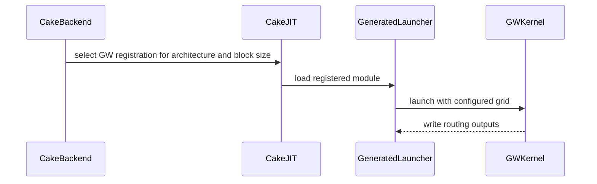

# [PR #5564] perf(cake_backend): warp-per-row selection arm for the largest Kimi-K3 fused router batches (SM100/SM103)

source: https://github.com/flashinfer-ai/flashinfer/pull/5564
state: closed | updated: 2026-09-26T07:05:28Z
labels: run-ci

## 正文

## Kimi-K3 fused MoE router: warp-per-row two-join arm for the largest batches (SM100 / SM103)

Follow-up to #5531 / #5548 (same source family; one new dispatch arm). Same K3 semantics (sigmoid gate, top-16 on `sigmoid(logit) + bias`, renormalized unbiased weights, lower expert id on ties) and the same expert-aligned route plan for `block_m` 8/16; the public entries `flashinfer.fused_moe.kimi_k3_fused_router` / `prepare_kimi_k3_fused_router` are unchanged.

### What changed
The four largest routed shapes (`num_tokens` 4096 and 8192 x `block_m` 8/16) move from the previous two-join arm (`G`: thread-per-expert selection, four CTAs per SM on CC 10.0 and six on CC 10.3) to a new arm `GW`:

- **Warp-per-row selection.** Each warp owns one token row and selects its 16 experts with a packed-key radix pass over the 896 biased scores (key = biased score bits | expert id, so ties resolve to the lower expert id exactly as before), instead of the thread-per-expert selection of arm `G`.
- **Dual-expert sort phase.** With four CTAs per SM the segment-sort phase hands two of the 896 expert segments to about half of the CTAs; arm `GW` processes a CTA's two segments together through two shared-memory pools (clear, scatter, prefix and gather of both segments between the same barriers), so the phase costs one latency round instead of two. The per-segment ordering is unchanged.
- **Launch bounds** `__launch_bounds__(224, 4)` on both architectures; persistent grid `min(num_tokens, 4 x SM count)` (`ARM_GW_CTAS_PER_SM`), so the CC 10.3 grid for these rows changes from six to four CTAs per SM.

`cake_backend.py`: route table `G -> GW` for the four shapes, `ARM_G_CTAS_PER_SM -> ARM_GW_CTAS_PER_SM = {(10, 0): 4, (10, 3): 4}`, `launch_grid("GW", ...)`. `cake_jit.py` MODULES: the four `G` records are replaced by four `GW` records per arch (`cake_kimi_k3_fused_router_gw_bm{8,16}_sm_10{0,3}a`); the 24 other programs per arch are byte-identical to #5548 (their generated sources and module names are unchanged). Tests: the route-table and launch-grid assertions follow the new arm.

Source-side paired cold-L2 CUPTI A/B against the #5548 programs (same session, same node; `previous / new` kernel time): B200 `m4096_bm8` **1.230**, `m4096_bm16` **1.206**, `m8192_bm8` **1.319**, `m8192_bm16` **1.312** (geomean 1.266); GB300 **1.144** / **1.145** / **1.179** / **1.186** (geomean 1.163). Rows of the other arms are unchanged code (same-session interleaved controls on the 24 unchanged rows, previous/new kernel time on byte-identical binaries: B200 mid rows geomean 1.004, GB300 mid rows 1.000 and small rows 1.005 / 0.994 over two runs; B200 small rows 0.994; per-row spread is within the +-3-7 % cohort noise of these 5-20 us kernels).

### Exactness
Source-side gates on both arches: exact43 43/43, affected slice + registered e2e, compute-sanitizer synccheck and racecheck (separate runs): all green on both architectures (sanitizers on the 8 frozen shapes plus the four large rows). Export receipts (source <-> export bitwise parity on all 28 shapes per arch, generated grid == source grid): B200 (sm_100a) 28/28 rows correct, source/export time ratio `0.95-1.04`; GB300 (sm_103a) 28/28 rows correct, ratio `0.97-1.02`. `tests/experimental/test_cake_kimi_k3_fused_router.py`: B200 `44/44` passed, GB300 `44/44` passed.

### Benchmark
`benchmarks/bench_cake_kimi_k3_fused_router.py --cupti --rounds 5` (interleaved A/B rounds, CUPTI kernel time with a cold L2) against SGLang `route_radix` + `moe_align_block_size` (pinned SGLang revision 83bd2c47, kernel-only):

| row | arm (B200 / GB300) | B200 fused us | B200 SGLang us | B200 speedup | GB300 fused us | GB300 SGLang us | GB300 speedup |
|---|---|---:|---:|---:|---:|---:|---:|
| m1_bm8 | L / L | 5.79 | 9.44 | **1.630** | 5.89 | 13.34 | **2.266** |
| m2_bm8 | LC / LC | 5.44 | 9.70 | **1.782** | 5.44 | 13.02 | **2.394** |
| m4_bm8 | LC / LC | 5.92 | 9.66 | **1.633** | 5.70 | 13.02 | **2.287** |
| m8_bm8 | LC / LC | 5.89 | 9.76 | **1.658** | 5.79 | 12.64 | **2.182** |
| m16_bm8 | L / L | 6.14 | 9.76 | **1.589** | 6.18 | 13.41 | **2.171** |
| m32_bm8 | L / L | 6.27 | 9.89 | **1.577** | 6.14 | 13.25 | **2.156** |
| m64_bm8 | L / L | 7.04 | 10.14 | **1.441** | 6.91 | 13.57 | **1.963** |
| m128_bm8 | L / L | 8.03 | 10.50 | **1.307** | 7.65 | 13.60 | **1.778** |
| m256_bm8 | M / M | 8.51 | 10.98 | **1.289** | 8.13 | 14.56 | **1.791** |
| m512_bm8 | Q4S / Q4S | 10.53 | 13.09 | **1.243** | 10.21 | 15.78 | **1.545** |
| m1024_bm8 | Q4S / Q4S | 14.34 | 18.59 | **1.297** | 13.79 | 18.98 | **1.376** |
| m2048_bm8 | Q4S / Q4S | 20.99 | 28.64 | **1.364** | 20.00 | 27.30 | **1.365** |
| m4096_bm8 | GW / GW | 30.91 | 48.19 | **1.559** | 29.25 | 46.08 | **1.575** |
| m8192_bm8 | GW / GW | 47.17 | 88.54 | **1.877** | 45.02 | 83.74 | **1.860** |
| m1_bm16 | L / L | 6.46 | 9.76 | **1.510** | 6.05 | 13.18 | **2.180** |
| m2_bm16 | LC / LC | 5.95 | 9.60 | **1.613** | 5.73 | 13.25 | **2.313** |
| m4_bm16 | LC / LC | 5.57 | 9.79 | **1.759** | 5.57 | 13.25 | **2.379** |
| m8_bm16 | LC / LC | 5.70 | 10.05 | **1.764** | 5.86 | 13.54 | **2.311** |
| m16_bm16 | L / L | 6.02 | 10.11 | **1.681** | 5.98 | 13.34 | **2.230** |
| m32_bm16 | L / L | 6.43 | 9.89 | **1.537** | 6.14 | 13.76 | **2.240** |
| m64_bm16 | L / L | 7.14 | 10.05 | **1.408** | 6.91 | 13.54 | **1.958** |
| m128_bm16 | L / L | 8.19 | 10.30 | **1.258** | 7.87 | 13.89 | **1.764** |
| m256_bm16 | M / M | 8.32 | 11.10 | **1.335** | 8.29 | 14.34 | **1.730** |
| m512_bm16 | Q4S / Q4S | 10.50 | 12.80 | **1.220** | 10.05 | 15.87 | **1.580** |
| m1024_bm16 | Q4S / Q4S | 14.02 | 18.02 | **1.285** | 13.66 | 19.23 | **1.407** |
| m2048_bm16 | Q4S / Q4S | 20.99 | 27.04 | **1.288** | 19.94 | 26.30 | **1.319** |
| m4096_bm16 | GW / GW | 31.26 | 45.70 | **1.462** | 30.05 | 44.26 | **1.473** |
| m8192_bm16 | GW / GW | 47.61 | 83.01 | **1.743** | 44.80 | 79.46 | **1.774** |

Geomean speedup vs SGLang: **NVIDIA B200 1.492** (min `1.220`, `28`/28 rows > 1.0), **NVIDIA GB300 1.873** (min `1.319`, `28`/28 rows > 1.0). #5548 on the same benchmark: B200 1.447 (min 1.211), GB300 1.837 (min 1.287).

🤖 Generated with [Claude Code](https://claude.com/claude-code)

<!-- This is an auto-generated comment: release notes by coderabbit.ai -->

## Summary by CodeRabbit

* **Performance**
  * Improved large-batch routing across supported GPU architectures by optimizing token selection and processing pairs of experts in parallel.
  * Standardized the large-batch launch limit to four blocks per SM on both supported architectures.

<!-- end of auto-generated comment: release notes by coderabbit.ai -->

## 评论 (6)

### coderabbitai[bot] · 2026-09-26

<!-- This is an auto-generated comment: summarize by coderabbit.ai -->
<!-- review_stack_entry_start -->

Navigate logical layers of code changes, visualize relationships, and explore their blast radius.

<!-- review_stack_entry_end -->
<!-- recent_review_start -->

No actionable comments were generated in the recent review. 🎉

ℹ️ Recent review info

⚙️ Run configuration

**Configuration used**: defaults

**Review profile**: CHILL

**Plan**: Advanced

**Run ID**: `59b07fe8-7b31-4626-9435-54542648849d`

📥 Commits

Reviewing files that changed from the base of the PR and between 5d9f8c8d97fa53e22952ce8672f475d235f07478 and 8b5491d9825790cc30ca7cd45ba5465f1b7341e0.

📒 Files selected for processing (12)

* `flashinfer/experimental/kimi_k3_fused_router/README.md`
* `flashinfer/experimental/kimi_k3_fused_router/cake_backend.py`
* `flashinfer/experimental/kimi_k3_fused_router/cake_jit.py`
* `flashinfer/experimental/kimi_k3_fused_router/csrc/cake_kimi_k3_fused_router/sm_100a/cake_kimi_k3_fused_router_ee5ceecd9d07a3b62bf4_binding.cu`
* `flashinfer/experimental/kimi_k3_fused_router/csrc/cake_kimi_k3_fused_router/sm_100a/cake_kimi_k3_fused_router_ee5ceecd9d07a3b62bf4_kernel.cu`
* `flashinfer/experimental/kimi_k3_fused_router/csrc/cake_kimi_k3_fused_router/sm_100a/cake_kimi_k3_fused_router_ef42df39862269c07a1d_binding.cu`
* `flashinfer/experimental/kimi_k3_fused_router/csrc/cake_kimi_k3_fused_router/sm_100a/cake_kimi_k3_fused_router_ef42df39862269c07a1d_kernel.cu`
* `flashinfer/experimental/kimi_k3_fused_router/csrc/cake_kimi_k3_fused_router/sm_103a/cake_kimi_k3_fused_router_e7b548f804a751cb0c4a_binding.cu`
* `flashinfer/experimental/kimi_k3_fused_router/csrc/cake_kimi_k3_fused_router/sm_103a/cake_kimi_k3_fused_router_e7b548f804a751cb0c4a_kernel.cu`
* `flashinfer/experimental/kimi_k3_fused_router/csrc/cake_kimi_k3_fused_router/sm_103a/cake_kimi_k3_fused_router_eba0da520bfae74745f3_binding.cu`
* `flashinfer/experimental/kimi_k3_fused_router/csrc/cake_kimi_k3_fused_router/sm_103a/cake_kimi_k3_fused_router_eba0da520bfae74745f3_kernel.cu`
* `tests/experimental/test_cake_kimi_k3_fused_router.py`

**Included review availability:** This review used your included allowance. Your plan provides up to 8 included reviews per hour; 6 remain after this review.

---

<!-- recent_review_end -->
<!-- walkthrough_start -->

📝 Walkthrough

## Walkthrough

The largest-batch routing arm changes from G to GW. Its CUDA kernels use warp-local top-k selection and paired large-expert sorting on SM 10.0 and SM 10.3. Dispatch, launcher registrations, launch bounds, tests, and documentation are updated for GW.

### Changes

**Kimi K3 fused router**

|Layer / File(s)|Summary|
|---|---|
|**Warp-local top-k selection**   `flashinfer/experimental/kimi_k3_fused_router/csrc/cake_kimi_k3_fused_router/sm_100a/*_kernel.cu`, `flashinfer/experimental/kimi_k3_fused_router/csrc/cake_kimi_k3_fused_router/sm_103a/*_kernel.cu`|Both architecture variants stage bias and assign token work across warps. Warp-local radix histograms and ballots select top-k candidates, then the kernels write normalized weights and packed expert IDs.|
|**Paired large-expert sorting**   `flashinfer/experimental/kimi_k3_fused_router/csrc/cake_kimi_k3_fused_router/sm_100a/*_kernel.cu`, `flashinfer/experimental/kimi_k3_fused_router/csrc/cake_kimi_k3_fused_router/sm_103a/*_kernel.cu`|For experts with more than 32 routes, blocks process expert pairs using separate bitmap and route buffers, prefix scans, and sorted output ranges.|
|**GW dispatch and launcher wiring**   `flashinfer/experimental/kimi_k3_fused_router/README.md`, `flashinfer/experimental/kimi_k3_fused_router/cake_backend.py`, `flashinfer/experimental/kimi_k3_fused_router/cake_jit.py`, `flashinfer/experimental/kimi_k3_fused_router/csrc/cake_kimi_k3_fused_router/*/*_binding.cu`, `tests/experimental/test_cake_kimi_k3_fused_router.py`|The largest-batch arm and its registrations use GW. Both architectures use a four-CTA-per-SM launch bound. Tests and documentation reflect the updated arm and bound.|

<!-- change_assessment_start -->
**Priority:** ➖ Normal

**Estimated code review effort:** 4 (Complex) | ~60 minutes

<!-- change_assessment_commit:"8b5491d9825790cc30ca7cd45ba5465f1b7341e0" -->
**Change:** Refactor
<!-- change_assessment_end -->

### Sequence Diagram(s)

**Suggested reviewers:** `yzh119`

<!-- walkthrough_end -->
<!-- final_review_risk_start -->
**Merge Risk:** _⚪ Minimal_ · up to `8b549`
<!-- final_review_risk_coverage:{"sourceCommitId":"8b5491d9825790cc30ca7cd45ba5465f1b7341e0","coveredCommitId":"8b5491d9825790cc30ca7cd45ba5465f1b7341e0","kind":"reviewed"} -->

The four largest Kimi-K3 router shapes now use a new warp-per-row kernel on SM100 and SM103. The dispatch tables, launch bounds, and tests are updated consistently. Output correctness is covered by the existing exactness and plan tests, and no concrete defect was found, so the change appears ready to merge.
<!-- final_review_risk_end -->
<!-- pre_merge_checks_walkthrough_start -->

🚥 Pre-merge checks | ✅ 3 | ❌ 2

### ❌ Failed checks (2 warnings)

|     Check name     | Status     | Explanation                                                                                                                                                                                               | Resolution                                                                                                                                                                                                                                        |
| :----------------: | :--------- | :-------------------------------------------------------------------------------------------------------------------------------------------------------------------------------------------------------- | :------------------------------------------------------------------------------------------------------------------------------------------------------------------------------------------------------------------------------------------------ |
| Docstring Coverage | ⚠️ Warning | Docstring coverage is 6.67% which is insufficient. The required threshold is 80.00%. Docstring coverage is scoped to functions touched by this diff. Analyzed 15 functions across 11 files. (1 skipped: … | Write docstrings for the functions missing them to satisfy the coverage threshold.                                                                                                                                                                |
|  Description check | ⚠️ Warning | The description gives detailed technical scope, affected shapes, exactness results, tests, and benchmarks. However, it omits the required Pull Request Checklist and the required Experimental Track sec… | Add the required Pull Request Checklist and complete the Experimental Track section. Include the tracking issue, owner, reason for the experimental path, graduation plan, required experimental-policy confirmations, and an experimental-tests… |

✅ Passed checks (3 passed)

|         Check name         | Status   | Explanation                                                                                                                                                 |
| :------------------------: | :------- | :---------------------------------------------------------------------------------------------------------------------------------------------------------- |
|     Linked Issues check    | ✅ Passed | Check skipped because no linked issues were found for this pull request.                                                                                    |
| Out of Scope Changes check | ✅ Passed | Check skipped because no linked issues were found for this pull request.                                                                                    |
|         Title check        | ✅ Passed | The title clearly identifies the performance change, the warp-per-row selection arm, the largest Kimi-K3 fused router batches, and the SM100/SM103 targets. |

Full details: Docstring Coverage

**Explanation**

Docstring coverage is 6.67% which is insufficient. The required threshold is 80.00%. Docstring coverage is scoped to functions touched by this diff. Analyzed 15 functions across 11 files. (1 skipped: 1 unsupported.)

Full details: Description check

**Explanation**

The description gives detailed technical scope, affected shapes, exactness results, tests, and benchmarks. However, it omits the required Pull Request Checklist and the required Experimental Track section, including the experimental-tests target block, even though the changes are under flashinfer/experimental/ and tests/experimental/.

**Resolution**

Add the required Pull Request Checklist and complete the Experimental Track section. Include the tracking issue, owner, reason for the experimental path, graduation plan, required experimental-policy confirmations, and an experimental-tests fenced block listing tests/experimental/test_cake_kimi_k3_fused_router.py.

<!-- pre_merge_checks_walkthrough_end -->

- [ ] <!-- {"checkboxId":"585bb3f6-faf5-4dbf-96d2-74e382adf19a"} --> Fix all pre-merge checks with AI
<!-- finishing_touch_checkbox_start -->

✨ Finishing Touches 💡 1

<!-- finishing_touch_suggestion:fix_ci -->

🛠️ Fix failing CI checks 💡

- [ ] <!-- {"checkboxId": "9f0d24fb-b419-4f01-baf0-8b26b6424f34", "radioGroupId": "fix-ci-output-choice-group-unknown_comment_id"} --> Commit to this branch
- [ ] <!-- {"checkboxId": "6d21cfe8-ec3f-40e2-9222-b8318b64d3b0", "radioGroupId": "fix-ci-output-choice-group-unknown_comment_id"} --> Create a new PR

🧪 Generate unit tests (beta)

- [ ] <!-- {"checkboxId": "f47ac10b-58cc-4372-a567-0e02b2c3d479", "radioGroupId": "utg-output-choice-group-unknown_comment_id"} --> Create a new PR

<!-- finishing_touch_checkbox_end -->
<!-- tips_start -->

---

Thanks for using [CodeRabbit](https://coderabbit.ai?utm_source=oss&utm_medium=github&utm_campaign=flashinfer-ai/flashinfer&utm_content=5564)! It's free for OSS, and your support helps us grow. If you like it, consider giving us a shout-out.

❤️ Share

- [X](https://twitter.com/intent/tweet?text=I%20just%20used%20%40coderabbitai%20for%20my%20code%20review%2C%20and%20it%27s%20fantastic%21%20It%27s%20free%20for%20OSS%20and%20offers%20a%20free%20trial%20for%20the%20proprietary%20code.%20Check%20it%20out%3A&url=https%3A//coderabbit.ai)
- [Mastodon](https://mastodon.social/share?text=I%20just%20used%20%40coderabbitai%20for%20my%20code%20review%2C%20and%20it%27s%20fantastic%21%20It%27s%20free%20for%20OSS%20and%20offers%20a%20free%20trial%20for%20the%20proprietary%20code.%20Check%20it%20out%3A%20https%3A%2F%2Fcoderabbit.ai)
- [Reddit](https://www.reddit.com/submit?title=Great%20tool%20for%20code%20review%20-%20CodeRabbit&text=I%20just%20used%20CodeRabbit%20for%20my%20code%20review%2C%20and%20it%27s%20fantastic%21%20It%27s%20free%20for%20OSS%20and%20offers%20a%20free%20trial%20for%20proprietary%20code.%20Check%20it%20out%3A%20https%3A//coderabbit.ai)
- [LinkedIn](https://www.linkedin.com/sharing/share-offsite/?url=https%3A%2F%2Fcoderabbit.ai&mini=true&title=Great%20tool%20for%20code%20review%20-%20CodeRabbit&summary=I%20just%20used%20CodeRabbit%20for%20my%20code%20review%2C%20and%20it%27s%20fantastic%21%20It%27s%20free%20for%20OSS%20and%20offers%20a%20free%20trial%20for%20proprietary%20code)

Comment `@coderabbitai help` to get the list of available commands.

<!-- tips_end -->

### yyihuang · 2026-09-26

/bot run tests/experimental/test_cake_kimi_k3_fused_router.py

### yyihuang · 2026-09-26

@flashinfer-bot run tests/experimental/test_cake_kimi_k3_fused_router.py

### flashinfer-bot · 2026-09-26

GitLab MR [!1705](https://nv/flashinfer/-/merge_requests/1705) has been created, and the CI pipeline [#69892051](https://nv/flashinfer-ci/-/pipelines/69892051) is currently running. I'll report back once the pipeline job completes.

### flashinfer-bot · 2026-09-26

[SUCCESS] Pipeline [#69892051](https://nv/flashinfer-ci/-/pipelines/69892051): 25/25 executed test jobs passed

### yyihuang · 2026-09-26

CI status for head `8b5491d9`: the authorized **PR Test** run [36220975126](https://github.com/flashinfer-ai/flashinfer/actions/runs/36220975126) is green — Permission Check, Setup, Targeted Unittest (H100), all four AOT Build Import jobs (x64/arm64 × cu129/cu130) and Test Results Summary passed; pre-commit, docs build, API/documentation checks and the labeler passed as well.

The one red "Test Results Summary" check on this PR is from run [36220827202](https://github.com/flashinfer-ai/flashinfer/actions/runs/36220827202), which fired on PR open and exited with "CI skipped — pending authorization" before any test ran; it was superseded by the authorized run above.

## Review (1)

### yzh119 · 2026-09-26 · APPROVED

(no text)
