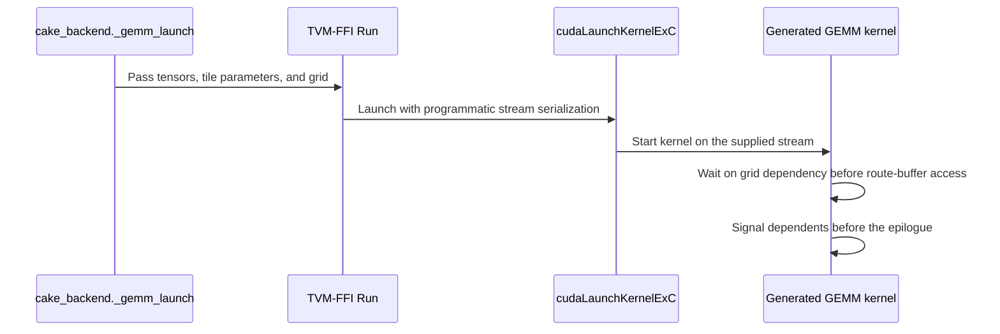

# [PR #5570] perf(cake_vision_backend): Kimi-K3 vision tower Cake backend round 2 (SM100a/SM103a): packed epilogues, f16x2 RoPE table, PDL

source: https://github.com/flashinfer-ai/flashinfer/pull/5570
state: closed | updated: 2026-09-26T21:36:37Z
labels: run-ci

## 正文

## Summary

Round 2 of the generated-program export of the Cake Kimi-K3 vision tower (MoonViT-3D encoder, 27 layers, + PatchMergerV2) for `sm_100a` (B200) and `sm_103a` (B300/GB300) into `flashinfer/experimental/kimi_k3_vision_tower` (#4568, tracker #4254; round 1 = #5554).

- The first commit (`fd757bf11`) mirrors the round-2 Cake host policy in the scaffold: `TileConfig` carries the tail / packed / prefetch / RoPE-table fields and the full Cake tile catalogue (packed residual-epilogue twins `*_p` / `*_pf`, packed f16x2 RoPE-table twins `*_cs`, opt-in tail twins `*_t` the policy never selects); `select_tile_config` reproduces the production selection for every variant and token count; the GEMM launches bind the kernels' new parameters (`CS`, `WS`, `FLAGS`, `full_tiles`, `tail_split`); the plan derives the packed `[T, 64]` u32 f16x2 (cos, sin) table next to the FP32 tables. The exported bindings own the programmatic-stream-serialization launch attribute (Cake PDL default is on for every stage of the tower).
- The second commit is the generated delivery only: `cake_jit.py` `MODULES` / `KERNELS` registries (54 exact-architecture programs: 27 per arch = 23 tile-config GEMM programs + 2 attention layouts + final-norm/merge + rmsnorm-apply) and `csrc/cake_kimi_k3_vision_tower/{sm_100a,sm_103a}/*_{kernel,binding}.cu` (108 generated sources, replacing the round-1 set; excluded from the formatting hooks via `csrc/.clang-format`; identities are receipt-bound). Both literals are generated; do not edit by hand.

Kernel changes behind the regenerated programs (Cake CAKE-663): packed bf16x2 residual epilogues (no register spills), residual-row / norm-weight prefetch before the mainloop wait, packed f16x2 RoPE table, TMA-descriptor prefetch in the attention loader, and programmatic dependent launch across every launch of the tower.

## Evidence (Cake export protocol, producer `5964871e82a`, target `fd757bf11f`)

Every contract row is measured on the source (Cake production launcher) and the exported programs in counterbalanced groups; `source_ms / export_ms >= 0.97`, directional disagreement `<= 0.02`, endpoint drift `<= 0.02`, correctness = bitwise `source == export` plus the contract's FP32-oracle fairness gate against the fastest FlashInfer ragged-attention chain (`fa2` / `cudnn` / `cutlass` / `cute-dsl`, chosen by timing per row; rows with < 64 output tokens pool 8 pixel seeds). One uninterrupted single-cache round per architecture (fresh exporter state, all 22 rows, 4 GPUs).

| arch | GPU | rows measured | passed | source/export (min .. max) | directional disagreement | endpoint drift |
|---|---|---|---|---|---|---|
| sm_100a | B200 (4 GPUs, one build session) | 22 | 22 | 0.9747 .. 1.0079 (geomean 0.9983) | <= 0.0038 | <= 0.0171 |
| sm_103a | B300 (4 GPUs, one build session) | 22 | 22 | 0.9706 .. 1.0057 (geomean 0.9983) | <= 0.0007 | <= 0.0160 |

Pooled smoke rows (8 seeds, candidate/reference-chain mean-error ratio): B200 `smoke_2x2` 0.9993 / `smoke_ragged` 1.0011 / `smoke_t3` 0.9977; B300 `smoke_2x2` 0.9993 / `smoke_ragged` 1.0001 / `smoke_t3` 0.9993 (violation ratios 0.9949-1.0070; all pass). Delivery is byte-identical from both rounds (delivery.patch SHA-256 `cf982040c1c9a069c8d91d827374b57afb9ef0b3551864475a11118e1f5676ec`).

Speed vs the round-1 programs and vs the FlashInfer chain: see the Cake MR (CAKE-663) design doc; the export protocol measures source == export parity, not speed vs peers.

Receipts, raw timings and state copies stay on the cluster (host / path / size / SHA-256 recorded in the Cake MR's design doc and `exports/kimi_k3_vision_tower/README.md`).

## Baselines and their source PRs

The export's correctness gate compares both arms against the FP32 tower oracle relative to the HF BF16 chain whose attention is the fastest FlashInfer ragged BF16 route of this checkout (`BatchPrefillWithRaggedKVCacheWrapper(kv_layout="NHD", backend=...)`, chosen by timing per row). Branch upstream merge-base: `e34a1735a` (2026-09-25, "feat(moe): wire dynamic FP8 FC2 quantization for per-channel MoE (#5149)").

- `fa2` route: `flashinfer/prefill.py` (last upstream change #5350 `7685a893e`, 2026-09-24), `csrc/batch_prefill.cu` (#5176 `e0a18900c`, 2026-09-21), `include/flashinfer/attention/prefill.cuh` (#5239 `b8107c7fd`, 2026-09-17).
- `cudnn` route: `flashinfer/cudnn/prefill.py` (#5350 `7685a893e`, 2026-09-24).
- `cutlass` route: `csrc/fmha_cutlass_sm100.cu` (#3064 `1aa32d03e`, 2026-05-08), `csrc/fmha_cutlass_sm100_binding.cu` (#2047 `db2aacbd3`, 2025-12-17).
- `cute-dsl` route: `flashinfer/cute_dsl/attention/fmha/` (#4859 `f17b77260`, 2026-09-18; cubin refresh #4997 `75038cdf6`, 2026-09-10).
- Chain RMSNorm: `flashinfer/norm/` (#5305 `012542c85`, 2026-09-18).
- Previous programs (replaced by this PR): round-1 delivery from #5554 (`6dd3104a7`, 2026-09-25); the package tests / FP32-oracle stage tests of that PR (`tests/experimental/test_cake_kimi_k3_vision_tower.py`) are the test oracle, extended in `fd757bf11` for the round-2 tile policy.

No upstream commit after the merge-base touched any of these files (`git log e34a1735a..origin/main -- <files>` is empty at `78c6e1fbf`, the two later commits are #5564 and #5530).

## Test

```
pytest tests/experimental/test_cake_kimi_k3_vision_tower.py
```

🤖 Generated with [Claude Code](https://claude.com/claude-code)


<!-- This is an auto-generated comment: release notes by coderabbit.ai -->

## Summary by CodeRabbit

* **Performance**
  * Optimized Kimi K3 vision-tower processing with packed RoPE data and more efficient residual, normalization, and output handling.
  * Added programmatic coordination between GPU workloads, including support for CUDA graph capture.
* **Compatibility**
  * Updated kernel selection across supported GPU architectures; production tile selection avoids tail-split configurations.

<!-- end of auto-generated comment: release notes by coderabbit.ai -->

## 评论 (5)

### yyihuang · 2026-09-26

/bot run tests/experimental/test_cake_kimi_k3_vision_tower.py

### yyihuang · 2026-09-26

@flashinfer-bot run tests/experimental/test_cake_kimi_k3_vision_tower.py

### coderabbitai[bot] · 2026-09-26

<!-- This is an auto-generated comment: summarize by coderabbit.ai -->
<!-- review_stack_entry_start -->

<a href="https://app.coderabbit.ai/change-stack/flashinfer-ai/flashinfer/pull/5570"></a>

Navigate logical layers of code changes, visualize relationships, and explore their blast radius.

<!-- review_stack_entry_end -->
<!-- recent_review_start -->

No actionable comments were generated in the recent review. 🎉

<details>
<summary>ℹ️ Recent review info</summary>

<details>
<summary>⚙️ Run configuration</summary>

**Configuration used**: defaults

**Review profile**: CHILL

**Plan**: Advanced

**Run ID**: `5b75d5ee-d968-4c5a-9eb6-ae5237156bab`

</details>

<details>
<summary>📥 Commits</summary>

Reviewing files that changed from the base of the PR and between 78c6e1fbfcb65043cdee92506c077259e7e878b7 and b98793814d400cac47442ce1af391e5261cdf0e4.

</details>

<details>
<summary>📒 Files selected for processing (144)</summary>

* `flashinfer/experimental/kimi_k3_vision_tower/README.md`
* `flashinfer/experimental/kimi_k3_vision_tower/cake_backend.py`
* `flashinfer/experimental/kimi_k3_vision_tower/cake_jit.py`
* `flashinfer/experimental/kimi_k3_vision_tower/csrc/cake_kimi_k3_vision_tower/sm_100a/cake_kimi_k3_vision_tower_05798ab4f949721f1486_binding.cu`
* `flashinfer/experimental/kimi_k3_vision_tower/csrc/cake_kimi_k3_vision_tower/sm_100a/cake_kimi_k3_vision_tower_05798ab4f949721f1486_kernel.cu`
* `flashinfer/experimental/kimi_k3_vision_tower/csrc/cake_kimi_k3_vision_tower/sm_100a/cake_kimi_k3_vision_tower_06967bebce6430b87a11_binding.cu`
* `flashinfer/experimental/kimi_k3_vision_tower/csrc/cake_kimi_k3_vision_tower/sm_100a/cake_kimi_k3_vision_tower_06967bebce6430b87a11_kernel.cu`
* `flashinfer/experimental/kimi_k3_vision_tower/csrc/cake_kimi_k3_vision_tower/sm_100a/cake_kimi_k3_vision_tower_070f3e4fed51e9bcb2ff_binding.cu`
* `flashinfer/experimental/kimi_k3_vision_tower/csrc/cake_kimi_k3_vision_tower/sm_100a/cake_kimi_k3_vision_tower_070f3e4fed51e9bcb2ff_kernel.cu`
* `flashinfer/experimental/kimi_k3_vision_tower/csrc/cake_kimi_k3_vision_tower/sm_100a/cake_kimi_k3_vision_tower_108065fc063a77a439ff_binding.cu`
* `flashinfer/experimental/kimi_k3_vision_tower/csrc/cake_kimi_k3_vision_tower/sm_100a/cake_kimi_k3_vision_tower_108065fc063a77a439ff_kernel.cu`
* `flashinfer/experimental/kimi_k3_vision_tower/csrc/cake_kimi_k3_vision_tower/sm_100a/cake_kimi_k3_vision_tower_166d723f9a1466854b55_binding.cu`
* `flashinfer/experimental/kimi_k3_vision_tower/csrc/cake_kimi_k3_vision_tower/sm_100a/cake_kimi_k3_vision_tower_166d723f9a1466854b55_kernel.cu`
* `flashinfer/experimental/kimi_k3_vision_tower/csrc/cake_kimi_k3_vision_tower/sm_100a/cake_kimi_k3_vision_tower_1cb70bf9d01f255bb375_binding.cu`
* `flashinfer/experimental/kimi_k3_vision_tower/csrc/cake_kimi_k3_vision_tower/sm_100a/cake_kimi_k3_vision_tower_1cb70bf9d01f255bb375_kernel.cu`
* `flashinfer/experimental/kimi_k3_vision_tower/csrc/cake_kimi_k3_vision_tower/sm_100a/cake_kimi_k3_vision_tower_21c97faae8373e3fa4b2_binding.cu`
* `flashinfer/experimental/kimi_k3_vision_tower/csrc/cake_kimi_k3_vision_tower/sm_100a/cake_kimi_k3_vision_tower_21c97faae8373e3fa4b2_kernel.cu`
* `flashinfer/experimental/kimi_k3_vision_tower/csrc/cake_kimi_k3_vision_tower/sm_100a/cake_kimi_k3_vision_tower_2c9410cb55e83813059b_binding.cu`
* `flashinfer/experimental/kimi_k3_vision_tower/csrc/cake_kimi_k3_vision_tower/sm_100a/cake_kimi_k3_vision_tower_43feaccd0cef4ee3c68a_binding.cu`
* `flashinfer/experimental/kimi_k3_vision_tower/csrc/cake_kimi_k3_vision_tower/sm_100a/cake_kimi_k3_vision_tower_43feaccd0cef4ee3c68a_kernel.cu`
* `flashinfer/experimental/kimi_k3_vision_tower/csrc/cake_kimi_k3_vision_tower/sm_100a/cake_kimi_k3_vision_tower_490785d9d81ac0cff316_binding.cu`
* `flashinfer/experimental/kimi_k3_vision_tower/csrc/cake_kimi_k3_vision_tower/sm_100a/cake_kimi_k3_vision_tower_490785d9d81ac0cff316_kernel.cu`
* `flashinfer/experimental/kimi_k3_vision_tower/csrc/cake_kimi_k3_vision_tower/sm_100a/cake_kimi_k3_vision_tower_4948f45a76970693a137_binding.cu`
* `flashinfer/experimental/kimi_k3_vision_tower/csrc/cake_kimi_k3_vision_tower/sm_100a/cake_kimi_k3_vision_tower_4948f45a76970693a137_kernel.cu`
* `flashinfer/experimental/kimi_k3_vision_tower/csrc/cake_kimi_k3_vision_tower/sm_100a/cake_kimi_k3_vision_tower_4a02ee8fb05b64907184_binding.cu`
* `flashinfer/experimental/kimi_k3_vision_tower/csrc/cake_kimi_k3_vision_tower/sm_100a/cake_kimi_k3_vision_tower_4b069de31665b36ac2c4_binding.cu`
* `flashinfer/experimental/kimi_k3_vision_tower/csrc/cake_kimi_k3_vision_tower/sm_100a/cake_kimi_k3_vision_tower_6f287fa965c3de28d091_binding.cu`
* `flashinfer/experimental/kimi_k3_vision_tower/csrc/cake_kimi_k3_vision_tower/sm_100a/cake_kimi_k3_vision_tower_6f287fa965c3de28d091_kernel.cu`
* `flashinfer/experimental/kimi_k3_vision_tower/csrc/cake_kimi_k3_vision_tower/sm_100a/cake_kimi_k3_vision_tower_818fd9be8f8d89dbc91b_binding.cu`
* `flashinfer/experimental/kimi_k3_vision_tower/csrc/cake_kimi_k3_vision_tower/sm_100a/cake_kimi_k3_vision_tower_818fd9be8f8d89dbc91b_kernel.cu`
* `flashinfer/experimental/kimi_k3_vision_tower/csrc/cake_kimi_k3_vision_tower/sm_100a/cake_kimi_k3_vision_tower_84efbca591a137244872_binding.cu`
* `flashinfer/experimental/kimi_k3_vision_tower/csrc/cake_kimi_k3_vision_tower/sm_100a/cake_kimi_k3_vision_tower_8a9d596bcb18eb70d1f0_binding.cu`
* `flashinfer/experimental/kimi_k3_vision_tower/csrc/cake_kimi_k3_vision_tower/sm_100a/cake_kimi_k3_vision_tower_8a9d596bcb18eb70d1f0_kernel.cu`
* `flashinfer/experimental/kimi_k3_vision_tower/csrc/cake_kimi_k3_vision_tower/sm_100a/cake_kimi_k3_vision_tower_8d3482326641c54c725a_binding.cu`
* `flashinfer/experimental/kimi_k3_vision_tower/csrc/cake_kimi_k3_vision_tower/sm_100a/cake_kimi_k3_vision_tower_8d3482326641c54c725a_kernel.cu`
* `flashinfer/experimental/kimi_k3_vision_tower/csrc/cake_kimi_k3_vision_tower/sm_100a/cake_kimi_k3_vision_tower_8e2e37692fb7955b2c92_binding.cu`
* `flashinfer/experimental/kimi_k3_vision_tower/csrc/cake_kimi_k3_vision_tower/sm_100a/cake_kimi_k3_vision_tower_8eb8e53f87769b31fe96_binding.cu`
* `flashinfer/experimental/kimi_k3_vision_tower/csrc/cake_kimi_k3_vision_tower/sm_100a/cake_kimi_k3_vision_tower_8eb8e53f87769b31fe96_kernel.cu`
* `flashinfer/experimental/kimi_k3_vision_tower/csrc/cake_kimi_k3_vision_tower/sm_100a/cake_kimi_k3_vision_tower_9dab32b1df263885b207_binding.cu`
* `flashinfer/experimental/kimi_k3_vision_tower/csrc/cake_kimi_k3_vision_tower/sm_100a/cake_kimi_k3_vision_tower_9dab32b1df263885b207_kernel.cu`
* `flashinfer/experimental/kimi_k3_vision_tower/csrc/cake_kimi_k3_vision_tower/sm_100a/cake_kimi_k3_vision_tower_9e9111cfadc59ea0ef6c_binding.cu`
* `flashinfer/experimental/kimi_k3_vision_tower/csrc/cake_kimi_k3_vision_tower/sm_100a/cake_kimi_k3_vision_tower_9e9111cfadc59ea0ef6c_kernel.cu`
* `flashinfer/experimental/kimi_k3_vision_tower/csrc/cake_kimi_k3_vision_tower/sm_100a/cake_kimi_k3_vision_tower_a325b971de69565e5b1e_binding.cu`
* `flashinfer/experimental/kimi_k3_vision_tower/csrc/cake_kimi_k3_vision_tower/sm_100a/cake_kimi_k3_vision_tower_a325b971de69565e5b1e_kernel.cu`
* `flashinfer/experimental/kimi_k3_vision_tower/csrc/cake_kimi_k3_vision_tower/sm_100a/cake_kimi_k3_vision_tower_a97068df87c712231d20_binding.cu`
* `flashinfer/experimental/kimi_k3_vision_tower/csrc/cake_kimi_k3_vision_tower/sm_100a/cake_kimi_k3_vision_tower_a97068df87c712231d20_kernel.cu`
* `flashinfer/experimental/kimi_k3_vision_tower/csrc/cake_kimi_k3_vision_tower/sm_100a/cake_kimi_k3_vision_tower_ac998a99b2f85bd88554_binding.cu`
* `flashinfer/experimental/kimi_k3_vision_tower/csrc/cake_kimi_k3_vision_tower/sm_100a/cake_kimi_k3_vision_tower_b08fc1d3d2ffc5fc6c94_binding.cu`
* `flashinfer/experimental/kimi_k3_vision_tower/csrc/cake_kimi_k3_vision_tower/sm_100a/cake_kimi_k3_vision_tower_b08fc1d3d2ffc5fc6c94_kernel.cu`
* `flashinfer/experimental/kimi_k3_vision_tower/csrc/cake_kimi_k3_vision_tower/sm_100a/cake_kimi_k3_vision_tower_b30dbd389f58654a05d2_binding.cu`
* `flashinfer/experimental/kimi_k3_vision_tower/csrc/cake_kimi_k3_vision_tower/sm_100a/cake_kimi_k3_vision_tower_b30dbd389f58654a05d2_kernel.cu`
* `flashinfer/experimental/kimi_k3_vision_tower/csrc/cake_kimi_k3_vision_tower/sm_100a/cake_kimi_k3_vision_tower_ba2009d871dd7a5205b4_binding.cu`
* `flashinfer/experimental/kimi_k3_vision_tower/csrc/cake_kimi_k3_vision_tower/sm_100a/cake_kimi_k3_vision_tower_bcff75feff930ae04377_binding.cu`
* `flashinfer/experimental/kimi_k3_vision_tower/csrc/cake_kimi_k3_vision_tower/sm_100a/cake_kimi_k3_vision_tower_bcff75feff930ae04377_kernel.cu`
* `flashinfer/experimental/kimi_k3_vision_tower/csrc/cake_kimi_k3_vision_tower/sm_100a/cake_kimi_k3_vision_tower_d2646625c7cd4e975045_binding.cu`
* `flashinfer/experimental/kimi_k3_vision_tower/csrc/cake_kimi_k3_vision_tower/sm_100a/cake_kimi_k3_vision_tower_d2646625c7cd4e975045_kernel.cu`
* `flashinfer/experimental/kimi_k3_vision_tower/csrc/cake_kimi_k3_vision_tower/sm_100a/cake_kimi_k3_vision_tower_d3f07fd30e607c90e120_binding.cu`
* `flashinfer/experimental/kimi_k3_vision_tower/csrc/cake_kimi_k3_vision_tower/sm_100a/cake_kimi_k3_vision_tower_d3f07fd30e607c90e120_kernel.cu`
* `flashinfer/experimental/kimi_k3_vision_tower/csrc/cake_kimi_k3_vision_tower/sm_100a/cake_kimi_k3_vision_tower_dbd633ecfe6f96292ea7_kernel.cu`
* `flashinfer/experimental/kimi_k3_vision_tower/csrc/cake_kimi_k3_vision_tower/sm_100a/cake_kimi_k3_vision_tower_dcb7e47bbc6ff3f35716_binding.cu`
* `flashinfer/experimental/kimi_k3_vision_tower/csrc/cake_kimi_k3_vision_tower/sm_100a/cake_kimi_k3_vision_tower_dcb7e47bbc6ff3f35716_kernel.cu`
* `flashinfer/experimental/kimi_k3_vision_tower/csrc/cake_kimi_k3_vision_tower/sm_100a/cake_kimi_k3_vision_tower_dd62e4b5eb4a13e1d5cd_binding.cu`
* `flashinfer/experimental/kimi_k3_vision_tower/csrc/cake_kimi_k3_vision_tower/sm_100a/cake_kimi_k3_vision_tower_dd62e4b5eb4a13e1d5cd_kernel.cu`
* `flashinfer/experimental/kimi_k3_vision_tower/csrc/cake_kimi_k3_vision_tower/sm_100a/cake_kimi_k3_vision_tower_e53152ca1aff7904f79f_binding.cu`
* `flashinfer/experimental/kimi_k3_vision_tower/csrc/cake_kimi_k3_vision_tower/sm_100a/cake_kimi_k3_vision_tower_e53152ca1aff7904f79f_kernel.cu`
* `flashinfer/experimental/kimi_k3_vision_tower/csrc/cake_kimi_k3_vision_tower/sm_100a/cake_kimi_k3_vision_tower_f5fec367a9800dc604f9_binding.cu`
* `flashinfer/experimental/kimi_k3_vision_tower/csrc/cake_kimi_k3_vision_tower/sm_100a/cake_kimi_k3_vision_tower_fb5098ba3b4866b810f3_binding.cu`
* `flashinfer/experimental/kimi_k3_vision_tower/csrc/cake_kimi_k3_vision_tower/sm_100a/cake_kimi_k3_vision_tower_fb5098ba3b4866b810f3_kernel.cu`
* `flashinfer/experimental/kimi_k3_vision_tower/csrc/cake_kimi_k3_vision_tower/sm_100a/cake_kimi_k3_vision_tower_fbd5e5d2222acd44732f_binding.cu`
* `flashinfer/experimental/kimi_k3_vision_tower/csrc/cake_kimi_k3_vision_tower/sm_100a/cake_kimi_k3_vision_tower_fbd5e5d2222acd44732f_kernel.cu`
* `flashinfer/experimental/kimi_k3_vision_tower/csrc/cake_kimi_k3_vision_tower/sm_103a/cake_kimi_k3_vision_tower_0412cee3db4a6cf0e44a_binding.cu`
* `flashinfer/experimental/kimi_k3_vision_tower/csrc/cake_kimi_k3_vision_tower/sm_103a/cake_kimi_k3_vision_tower_0412cee3db4a6cf0e44a_kernel.cu`
* `flashinfer/experimental/kimi_k3_vision_tower/csrc/cake_kimi_k3_vision_tower/sm_103a/cake_kimi_k3_vision_tower_0510597d848ab681b29a_binding.cu`
* `flashinfer/experimental/kimi_k3_vision_tower/csrc/cake_kimi_k3_vision_tower/sm_103a/cake_kimi_k3_vision_tower_0510597d848ab681b29a_kernel.cu`
* `flashinfer/experimental/kimi_k3_vision_tower/csrc/cake_kimi_k3_vision_tower/sm_103a/cake_kimi_k3_vision_tower_06ebbf8c1cbb463a324f_binding.cu`
* `flashinfer/experimental/kimi_k3_vision_tower/csrc/cake_kimi_k3_vision_tower/sm_103a/cake_kimi_k3_vision_tower_0a54c48e4360f09e32af_binding.cu`
* `flashinfer/experimental/kimi_k3_vision_tower/csrc/cake_kimi_k3_vision_tower/sm_103a/cake_kimi_k3_vision_tower_0a54c48e4360f09e32af_kernel.cu`
* `flashinfer/experimental/kimi_k3_vision_tower/csrc/cake_kimi_k3_vision_tower/sm_103a/cake_kimi_k3_vision_tower_0b464a26bb0b01f5a1dc_binding.cu`
* `flashinfer/experimental/kimi_k3_vision_tower/csrc/cake_kimi_k3_vision_tower/sm_103a/cake_kimi_k3_vision_tower_0b464a26bb0b01f5a1dc_kernel.cu`
* `flashinfer/experimental/kimi_k3_vision_tower/csrc/cake_kimi_k3_vision_tower/sm_103a/cake_kimi_k3_vision_tower_205e18aed1faa07ca1a1_binding.cu`
* `flashinfer/experimental/kimi_k3_vision_tower/csrc/cake_kimi_k3_vision_tower/sm_103a/cake_kimi_k3_vision_tower_205e18aed1faa07ca1a1_kernel.cu`
* `flashinfer/experimental/kimi_k3_vision_tower/csrc/cake_kimi_k3_vision_tower/sm_103a/cake_kimi_k3_vision_tower_2b659f15e777ce4a0ac9_binding.cu`
* `flashinfer/experimental/kimi_k3_vision_tower/csrc/cake_kimi_k3_vision_tower/sm_103a/cake_kimi_k3_vision_tower_2b659f15e777ce4a0ac9_kernel.cu`
* `flashinfer/experimental/kimi_k3_vision_tower/csrc/cake_kimi_k3_vision_tower/sm_103a/cake_kimi_k3_vision_tower_31d463c64e2f293e1549_binding.cu`
* `flashinfer/experimental/kimi_k3_vision_tower/csrc/cake_kimi_k3_vision_tower/sm_103a/cake_kimi_k3_vision_tower_37a3f33ba08309a52dc4_binding.cu`
* `flashinfer/experimental/kimi_k3_vision_tower/csrc/cake_kimi_k3_vision_tower/sm_103a/cake_kimi_k3_vision_tower_37a3f33ba08309a52dc4_kernel.cu`
* `flashinfer/experimental/kimi_k3_vision_tower/csrc/cake_kimi_k3_vision_tower/sm_103a/cake_kimi_k3_vision_tower_394ddce48c70908dd421_binding.cu`
* `flashinfer/experimental/kimi_k3_vision_tower/csrc/cake_kimi_k3_vision_tower/sm_103a/cake_kimi_k3_vision_tower_394ddce48c70908dd421_kernel.cu`
* `flashinfer/experimental/kimi_k3_vision_tower/csrc/cake_kimi_k3_vision_tower/sm_103a/cake_kimi_k3_vision_tower_3cceb593ea9572a7910e_binding.cu`
* `flashinfer/experimental/kimi_k3_vision_tower/csrc/cake_kimi_k3_vision_tower/sm_103a/cake_kimi_k3_vision_tower_4617796171e3a15b7b01_binding.cu`
* `flashinfer/experimental/kimi_k3_vision_tower/csrc/cake_kimi_k3_vision_tower/sm_103a/cake_kimi_k3_vision_tower_49f4284b6369c12b848c_binding.cu`
* `flashinfer/experimental/kimi_k3_vision_tower/csrc/cake_kimi_k3_vision_tower/sm_103a/cake_kimi_k3_vision_tower_49f4284b6369c12b848c_kernel.cu`
* `flashinfer/experimental/kimi_k3_vision_tower/csrc/cake_kimi_k3_vision_tower/sm_103a/cake_kimi_k3_vision_tower_4d3c93cbd1d4fcdd0d1f_binding.cu`
* `flashinfer/experimental/kimi_k3_vision_tower/csrc/cake_kimi_k3_vision_tower/sm_103a/cake_kimi_k3_vision_tower_4d3c93cbd1d4fcdd0d1f_kernel.cu`
* `flashinfer/experimental/kimi_k3_vision_tower/csrc/cake_kimi_k3_vision_tower/sm_103a/cake_kimi_k3_vision_tower_5530ee096459f73333d8_binding.cu`
* `flashinfer/experimental/kimi_k3_vision_tower/csrc/cake_kimi_k3_vision_tower/sm_103a/cake_kimi_k3_vision_tower_5530ee096459f73333d8_kernel.cu`
* `flashinfer/experimental/kimi_k3_vision_tower/csrc/cake_kimi_k3_vision_tower/sm_103a/cake_kimi_k3_vision_tower_5b3fb2223cf6e81014d8_binding.cu`
* `flashinfer/experimental/kimi_k3_vision_tower/csrc/cake_kimi_k3_vision_tower/sm_103a/cake_kimi_k3_vision_tower_5b3fb2223cf6e81014d8_kernel.cu`
* `flashinfer/experimental/kimi_k3_vision_tower/csrc/cake_kimi_k3_vision_tower/sm_103a/cake_kimi_k3_vision_tower_625a2435628f973645d5_binding.cu`
* `flashinfer/experimental/kimi_k3_vision_tower/csrc/cake_kimi_k3_vision_tower/sm_103a/cake_kimi_k3_vision_tower_625a2435628f973645d5_kernel.cu`
* `flashinfer/experimental/kimi_k3_vision_tower/csrc/cake_kimi_k3_vision_tower/sm_103a/cake_kimi_k3_vision_tower_6454095ab0c3891b3b41_binding.cu`
* `flashinfer/experimental/kimi_k3_vision_tower/csrc/cake_kimi_k3_vision_tower/sm_103a/cake_kimi_k3_vision_tower_66d5db914b74a11f2ca8_binding.cu`
* `flashinfer/experimental/kimi_k3_vision_tower/csrc/cake_kimi_k3_vision_tower/sm_103a/cake_kimi_k3_vision_tower_66d5db914b74a11f2ca8_kernel.cu`
* `flashinfer/experimental/kimi_k3_vision_tower/csrc/cake_kimi_k3_vision_tower/sm_103a/cake_kimi_k3_vision_tower_68703b18d9ed8bd395ab_binding.cu`
* `flashinfer/experimental/kimi_k3_vision_tower/csrc/cake_kimi_k3_vision_tower/sm_103a/cake_kimi_k3_vision_tower_68703b18d9ed8bd395ab_kernel.cu`
* `flashinfer/experimental/kimi_k3_vision_tower/csrc/cake_kimi_k3_vision_tower/sm_103a/cake_kimi_k3_vision_tower_6a152899377da7f945f8_binding.cu`
* `flashinfer/experimental/kimi_k3_vision_tower/csrc/cake_kimi_k3_vision_tower/sm_103a/cake_kimi_k3_vision_tower_6cdd5d63ae17746c33b7_binding.cu`
* `flashinfer/experimental/kimi_k3_vision_tower/csrc/cake_kimi_k3_vision_tower/sm_103a/cake_kimi_k3_vision_tower_6cdd5d63ae17746c33b7_kernel.cu`
* `flashinfer/experimental/kimi_k3_vision_tower/csrc/cake_kimi_k3_vision_tower/sm_103a/cake_kimi_k3_vision_tower_7262f77479083cd892dd_binding.cu`
* `flashinfer/experimental/kimi_k3_vision_tower/csrc/cake_kimi_k3_vision_tower/sm_103a/cake_kimi_k3_vision_tower_7262f77479083cd892dd_kernel.cu`
* `flashinfer/experimental/kimi_k3_vision_tower/csrc/cake_kimi_k3_vision_tower/sm_103a/cake_kimi_k3_vision_tower_759fd61ba107871b97df_binding.cu`
* `flashinfer/experimental/kimi_k3_vision_tower/csrc/cake_kimi_k3_vision_tower/sm_103a/cake_kimi_k3_vision_tower_759fd61ba107871b97df_kernel.cu`
* `flashinfer/experimental/kimi_k3_vision_tower/csrc/cake_kimi_k3_vision_tower/sm_103a/cake_kimi_k3_vision_tower_7f0fd228059fee782a48_binding.cu`
* `flashinfer/experimental/kimi_k3_vision_tower/csrc/cake_kimi_k3_vision_tower/sm_103a/cake_kimi_k3_vision_tower_7f35f9b1001151fb27d6_binding.cu`
* `flashinfer/experimental/kimi_k3_vision_tower/csrc/cake_kimi_k3_vision_tower/sm_103a/cake_kimi_k3_vision_tower_87112501e776709b45e9_binding.cu`
* `flashinfer/experimental/kimi_k3_vision_tower/csrc/cake_kimi_k3_vision_tower/sm_103a/cake_kimi_k3_vision_tower_87112501e776709b45e9_kernel.cu`
* `flashinfer/experimental/kimi_k3_vision_tower/csrc/cake_kimi_k3_vision_tower/sm_103a/cake_kimi_k3_vision_tower_8a80269e13d6f0e3a1b2_binding.cu`
* `flashinfer/experimental/kimi_k3_vision_tower/csrc/cake_kimi_k3_vision_tower/sm_103a/cake_kimi_k3_vision_tower_8a80269e13d6f0e3a1b2_kernel.cu`
* `flashinfer/experimental/kimi_k3_vision_tower/csrc/cake_kimi_k3_vision_tower/sm_103a/cake_kimi_k3_vision_tower_915b2ca02e4aad2a1673_binding.cu`
* `flashinfer/experimental/kimi_k3_vision_tower/csrc/cake_kimi_k3_vision_tower/sm_103a/cake_kimi_k3_vision_tower_915b2ca02e4aad2a1673_kernel.cu`
* `flashinfer/experimental/kimi_k3_vision_tower/csrc/cake_kimi_k3_vision_tower/sm_103a/cake_kimi_k3_vision_tower_91c98b33f9957920fa4c_binding.cu`
* `flashinfer/experimental/kimi_k3_vision_tower/csrc/cake_kimi_k3_vision_tower/sm_103a/cake_kimi_k3_vision_tower_91c98b33f9957920fa4c_kernel.cu`
* `flashinfer/experimental/kimi_k3_vision_tower/csrc/cake_kimi_k3_vision_tower/sm_103a/cake_kimi_k3_vision_tower_960f3b2a869391cc6f07_binding.cu`
* `flashinfer/experimental/kimi_k3_vision_tower/csrc/cake_kimi_k3_vision_tower/sm_103a/cake_kimi_k3_vision_tower_966a512a7c27fdba70f3_binding.cu`
* `flashinfer/experimental/kimi_k3_vision_tower/csrc/cake_kimi_k3_vision_tower/sm_103a/cake_kimi_k3_vision_tower_a93555503f0e9c0b2833_binding.cu`
* `flashinfer/experimental/kimi_k3_vision_tower/csrc/cake_kimi_k3_vision_tower/sm_103a/cake_kimi_k3_vision_tower_a93555503f0e9c0b2833_kernel.cu`
* `flashinfer/experimental/kimi_k3_vision_tower/csrc/cake_kimi_k3_vision_tower/sm_103a/cake_kimi_k3_vision_tower_acf234f3085cd986cfa3_binding.cu`
* `flashinfer/experimental/kimi_k3_vision_tower/csrc/cake_kimi_k3_vision_tower/sm_103a/cake_kimi_k3_vision_tower_acf234f3085cd986cfa3_kernel.cu`
* `flashinfer/experimental/kimi_k3_vision_tower/csrc/cake_kimi_k3_vision_tower/sm_103a/cake_kimi_k3_vision_tower_b25c45827e3f841871b9_binding.cu`
* `flashinfer/experimental/kimi_k3_vision_tower/csrc/cake_kimi_k3_vision_tower/sm_103a/cake_kimi_k3_vision_tower_b25c45827e3f841871b9_kernel.cu`
* `flashinfer/experimental/kimi_k3_vision_tower/csrc/cake_kimi_k3_vision_tower/sm_103a/cake_kimi_k3_vision_tower_b34f22a7310f0e9f98c0_binding.cu`
* `flashinfer/experimental/kimi_k3_vision_tower/csrc/cake_kimi_k3_vision_tower/sm_103a/cake_kimi_k3_vision_tower_b34f22a7310f0e9f98c0_kernel.cu`
* `flashinfer/experimental/kimi_k3_vision_tower/csrc/cake_kimi_k3_vision_tower/sm_103a/cake_kimi_k3_vision_tower_b3b7b67f1a8424fa2807_binding.cu`
* `flashinfer/experimental/kimi_k3_vision_tower/csrc/cake_kimi_k3_vision_tower/sm_103a/cake_kimi_k3_vision_tower_bc8a78f82867c5725259_binding.cu`
* `flashinfer/experimental/kimi_k3_vision_tower/csrc/cake_kimi_k3_vision_tower/sm_103a/cake_kimi_k3_vision_tower_c92fcc6b026469a4486e_binding.cu`
* `flashinfer/experimental/kimi_k3_vision_tower/csrc/cake_kimi_k3_vision_tower/sm_103a/cake_kimi_k3_vision_tower_c92fcc6b026469a4486e_kernel.cu`
* `flashinfer/experimental/kimi_k3_vision_tower/csrc/cake_kimi_k3_vision_tower/sm_103a/cake_kimi_k3_vision_tower_d96515fe262f77ad0e3b_binding.cu`
* `flashinfer/experimental/kimi_k3_vision_tower/csrc/cake_kimi_k3_vision_tower/sm_103a/cake_kimi_k3_vision_tower_d96515fe262f77ad0e3b_kernel.cu`
* `flashinfer/experimental/kimi_k3_vision_tower/csrc/cake_kimi_k3_vision_tower/sm_103a/cake_kimi_k3_vision_tower_e540c6015253f7d092f1_binding.cu`
* `flashinfer/experimental/kimi_k3_vision_tower/csrc/cake_kimi_k3_vision_tower/sm_103a/cake_kimi_k3_vision_tower_e540c6015253f7d092f1_kernel.cu`
* `flashinfer/experimental/kimi_k3_vision_tower/csrc/cake_kimi_k3_vision_tower/sm_103a/cake_kimi_k3_vision_tower_e6a3524123298177f1a6_binding.cu`
* `flashinfer/experimental/kimi_k3_vision_tower/csrc/cake_kimi_k3_vision_tower/sm_103a/cake_kimi_k3_vision_tower_e6a3524123298177f1a6_kernel.cu`
* `flashinfer/experimental/kimi_k3_vision_tower/csrc/cake_kimi_k3_vision_tower/sm_103a/cake_kimi_k3_vision_tower_f7b6a99bc33e171fe63b_binding.cu`
* `tests/experimental/test_cake_kimi_k3_vision_tower.py`

</details>

<details>
<summary>💤 Files with no reviewable changes (12)</summary>

* flashinfer/experimental/kimi_k3_vision_tower/csrc/cake_kimi_k3_vision_tower/sm_100a/cake_kimi_k3_vision_tower_2c9410cb55e83813059b_binding.cu
* flashinfer/experimental/kimi_k3_vision_tower/csrc/cake_kimi_k3_vision_tower/sm_100a/cake_kimi_k3_vision_tower_dd62e4b5eb4a13e1d5cd_kernel.cu
* flashinfer/experimental/kimi_k3_vision_tower/csrc/cake_kimi_k3_vision_tower/sm_100a/cake_kimi_k3_vision_tower_4b069de31665b36ac2c4_binding.cu
* flashinfer/experimental/kimi_k3_vision_tower/csrc/cake_kimi_k3_vision_tower/sm_100a/cake_kimi_k3_vision_tower_dbd633ecfe6f96292ea7_kernel.cu
* flashinfer/experimental/kimi_k3_vision_tower/csrc/cake_kimi_k3_vision_tower/sm_100a/cake_kimi_k3_vision_tower_a97068df87c712231d20_binding.cu
* flashinfer/experimental/kimi_k3_vision_tower/csrc/cake_kimi_k3_vision_tower/sm_100a/cake_kimi_k3_vision_tower_ac998a99b2f85bd88554_binding.cu
* flashinfer/experimental/kimi_k3_vision_tower/csrc/cake_kimi_k3_vision_tower/sm_100a/cake_kimi_k3_vision_tower_8e2e37692fb7955b2c92_binding.cu
* flashinfer/experimental/kimi_k3_vision_tower/csrc/cake_kimi_k3_vision_tower/sm_100a/cake_kimi_k3_vision_tower_ba2009d871dd7a5205b4_binding.cu
* flashinfer/experimental/kimi_k3_vision_tower/csrc/cake_kimi_k3_vision_tower/sm_100a/cake_kimi_k3_vision_tower_4a02ee8fb05b64907184_binding.cu
* flashinfer/experimental/kimi_k3_vision_tower/csrc/cake_kimi_k3_vision_tower/sm_100a/cake_kimi_k3_vision_tower_84efbca591a137244872_binding.cu
* flashinfer/experimental/kimi_k3_vision_tower/csrc/cake_kimi_k3_vision_tower/sm_100a/cake_kimi_k3_vision_tower_a97068df87c712231d20_kernel.cu
* flashinfer/experimental/kimi_k3_vision_tower/csrc/cake_kimi_k3_vision_tower/sm_100a/cake_kimi_k3_vision_tower_dd62e4b5eb4a13e1d5cd_binding.cu

</details>

**Included review availability:** This review used your included allowance. Your plan provides up to 8 included reviews per hour; 6 remain after this review.

</details>

---


<!-- recent_review_end -->
<!-- walkthrough_start -->

<details>
<summary>📝 Walkthrough</summary>

## Walkthrough

The Kimi K3 vision-tower plan now selects packed GEMM variants, constructs a packed RoPE table, and passes expanded launch parameters. Generated CUDA kernels and bindings are refreshed for SM100a and SM103a, with packed epilogues and programmatic stream serialization.

### Changes

**Vision-tower GEMM path**

|Layer / File(s)|Summary|
|---|---|
|**Packed tile selection and launch planning** <br> `flashinfer/experimental/kimi_k3_vision_tower/cake_backend.py`, `tests/experimental/test_cake_kimi_k3_vision_tower.py`, `flashinfer/experimental/kimi_k3_vision_tower/README.md`|The plan constructs a packed f16x2 RoPE table, selects packed residual, positional, and RoPE variants, and returns expanded launch geometry. Tests cover the updated tile choices, geometry, and packed table. The README documents the selected variants and serving preparation.|
|**Generated module registry** <br> `flashinfer/experimental/kimi_k3_vision_tower/cake_jit.py`|The module records and architecture mappings are refreshed for SM100a and SM103a, including GEMM variants, attention layouts, merge, and RMSNorm-apply modules.|
|**CUDA kernels and launch bindings** <br> `flashinfer/experimental/kimi_k3_vision_tower/csrc/cake_kimi_k3_vision_tower/sm_100a/*`, `flashinfer/experimental/kimi_k3_vision_tower/csrc/cake_kimi_k3_vision_tower/sm_103a/*`|Generated GEMM kernels add packed RoPE or epilogue data paths and expanded tile arguments. Bindings validate the added tensors and scalars and enable programmatic stream serialization. Kernels add grid-dependency wait and dependent-launch instructions. Related generated kernel modules and bindings are also refreshed or removed.|

<!-- change_assessment_start -->
**Priority:** ⬇️ Low

**Estimated code review effort:** 5 (Critical) | ~120 minutes

<!-- change_assessment_commit:"b98793814d400cac47442ce1af391e5261cdf0e4" -->

<!-- change_assessment_end -->

### Sequence Diagram(s)



</details>

<!-- walkthrough_end -->
<!-- final_review_risk_start -->
**Merge Risk:** _⚪ Minimal_ · up to `b9879`
<!-- final_review_risk_coverage:{"sourceCommitId":"b98793814d400cac47442ce1af391e5261cdf0e4","coveredCommitId":"b98793814d400cac47442ce1af391e5261cdf0e4","kind":"reviewed"} -->

This change regenerates the Kimi-K3 vision-tower kernels with packed RoPE and programmatic dependent launch. The packed table encoding and the launch ordering are consistent across the plan, the bindings, and the kernels. No blocking issues were found, and the reported bitwise parity supports correctness.
<!-- final_review_risk_end -->
<!-- architecture_review_start -->
### Architecture Summary

**Architecture risk:** _🔵 Low_ · up to `b9879`

The change affects 2 systems.

**Changed systems:** `flashinfer`, `tests`

**Architecture concerns**
No architecture-level concerns identified.

<details>
<summary>Review details</summary>

**Systems and components**
- _observed_ — flashinfer (service) was modified; 123 changed files map to changed impact.
- _observed_ — tests (service) was modified; 1 changed file maps to changed impact.

**Before / after behavior**
- _observed_ — Modified behavior in flashinfer/experimental/kimi_k3_vision_tower/README.md: The documented `layer_norm_qkv_rope` program changes from `gemm:norm_qkv_rope:*` to the `*_cs` variant and specifies that its epilogue uses the plan’s packed f16x2 RoPE table with FP32 rotation.
- _observed_ — Modified behavior in flashinfer/experimental/kimi_k3_vision_tower/README.md: The tile-selection description adds the residual and positional `*_p`/`*_pf` variants with pre-mainloop residual prefetch, and identifies the QKV packed-RoPE-table `*_cs` variants. It retains the stated tile configurations and attention-layout selection.
- _observed_ — Modified behavior in flashinfer/experimental/kimi_k3_vision_tower/README.md: The README adds the production PDL launch behavior: generated bindings use programmatic stream serialization; kernels overlap their prologue with the preceding launch, wait before touching route buffers, and signal dependents before the epilogue. The host launch sequence and numerics remain unchanged, and CUDA graphs capture the dependency edge.
- _observed_ — Modified behavior in flashinfer/experimental/kimi_k3_vision_tower/README.md: The serving-preparation description adds the packed f16x2 RoPE table to the per-`grid_thws` data derived before binding the launches.

</details>

<!-- architecture_review_end -->
<!-- pre_merge_checks_walkthrough_start -->

<details>
<summary>🚥 Pre-merge checks | ✅ 3 | ❌ 1 | ❓ 1</summary>

### ❌ Failed checks (1 warning, 1 inconclusive)

|     Check name     | Status         | Explanation                                                                                                                                                                                               | Resolution                                                                                                                                                                                                                                        |
| :----------------: | :------------- | :-------------------------------------------------------------------------------------------------------------------------------------------------------------------------------------------------------- | :------------------------------------------------------------------------------------------------------------------------------------------------------------------------------------------------------------------------------------------------ |
|  Description check | ⚠️ Warning     | The description provides detailed scope, objectives, evidence, baselines, and a test command. However, it omits the required Pull Request Checklist and the required Experimental Track section, includi… | Add the required Pull Request Checklist and complete the Experimental Track section. Declare at least one existing target under tests/experimental/ in the experimental-tests fence, provide the tracking issue and required experimental-policy… |
| Docstring Coverage | ❓ Inconclusive | Docstring coverage is 22.59% which is insufficient. The required threshold is 80.00%. Docstring coverage is scoped to functions touched by this diff. Analyzed 301 functions across 50 files. (62 skippe… | Write docstrings for the functions missing them to satisfy the coverage threshold.                                                                                                                                                                |

<details>
<summary>✅ Passed checks (3 passed)</summary>

|         Check name         | Status   | Explanation                                                                                                                                               |
| :------------------------: | :------- | :-------------------------------------------------------------------------------------------------------------------------------------------------------- |
|         Title check        | ✅ Passed | The title clearly identifies the Kimi-K3 Cake backend update and its main changes: packed epilogues, the f16x2 RoPE table, and PDL for SM100a and SM103a. |
|     Linked Issues check    | ✅ Passed | Check skipped because no linked issues were found for this pull request.                                                                                  |
| Out of Scope Changes check | ✅ Passed | Check skipped because no linked issues were found for this pull request.                                                                                  |

</details>

<details>
<summary>Full details: Description check</summary>

**Explanation**

The description provides detailed scope, objectives, evidence, baselines, and a test command. However, it omits the required Pull Request Checklist and the required Experimental Track section, including the experimental-tests declaration, tracking issue details, and checklist confirmations.

**Resolution**

Add the required Pull Request Checklist and complete the Experimental Track section. Declare at least one existing target under tests/experimental/ in the experimental-tests fence, provide the tracking issue and required experimental-policy details, and record the pre-commit and test checklist results.

</details>

<details>
<summary>Full details: Docstring Coverage</summary>

**Explanation**

Docstring coverage is 22.59% which is insufficient. The required threshold is 80.00%. Docstring coverage is scoped to functions touched by this diff. Analyzed 301 functions across 50 files. (62 skipped: 1 unsupported, 61 over the file limit.)

</details>

</details>

<!-- pre_merge_checks_walkthrough_end -->

- [ ] <!-- {"checkboxId":"585bb3f6-faf5-4dbf-96d2-74e382adf19a"} --> Fix all pre-merge checks with AI
<!-- finishing_touch_checkbox_start -->

<details>
<summary>✨ Finishing Touches 💡 1</summary>

<!-- finishing_touch_suggestion:fix_ci -->
<details open>
<summary>🛠️ Fix failing CI checks 💡</summary>

- [ ] <!-- {"checkboxId": "9f0d24fb-b419-4f01-baf0-8b26b6424f34", "radioGroupId": "fix-ci-output-choice-group-unknown_comment_id"} --> Commit to this branch
- [ ] <!-- {"checkboxId": "6d21cfe8-ec3f-40e2-9222-b8318b64d3b0", "radioGroupId": "fix-ci-output-choice-group-unknown_comment_id"} --> Create a new PR

</details>
<details open>
<summary>🧪 Generate unit tests (beta)</summary>

- [ ] <!-- {"checkboxId": "f47ac10b-58cc-4372-a567-0e02b2c3d479", "radioGroupId": "utg-output-choice-group-unknown_comment_id"} --> Create a new PR

</details>

</details>

<!-- finishing_touch_checkbox_end -->
<!-- tips_start -->

---

Thanks for using [CodeRabbit](https://coderabbit.ai?utm_source=oss&utm_medium=github&utm_campaign=flashinfer-ai/flashinfer&utm_content=5570)! It's free for OSS, and your support helps us grow. If you like it, consider giving us a shout-out.

<details>
<summary>❤️ Share</summary>

- [X](https://twitter.com/intent/tweet?text=I%20just%20used%20%40coderabbitai%20for%20my%20code%20review%2C%20and%20it%27s%20fantastic%21%20It%27s%20free%20for%20OSS%20and%20offers%20a%20free%20trial%20for%20the%20proprietary%20code.%20Check%20it%20out%3A&url=https%3A//coderabbit.ai)
- [Mastodon](https://mastodon.social/share?text=I%20just%20used%20%40coderabbitai%20for%20my%20code%20review%2C%20and%20it%27s%20fantastic%21%20It%27s%20free%20for%20OSS%20and%20offers%20a%20free%20trial%20for%20the%20proprietary%20code.%20Check%20it%20out%3A%20https%3A%2F%2Fcoderabbit.ai)
- [Reddit](https://www.reddit.com/submit?title=Great%20tool%20for%20code%20review%20-%20CodeRabbit&text=I%20just%20used%20CodeRabbit%20for%20my%20code%20review%2C%20and%20it%27s%20fantastic%21%20It%27s%20free%20for%20OSS%20and%20offers%20a%20free%20trial%20for%20proprietary%20code.%20Check%20it%20out%3A%20https%3A//coderabbit.ai)
- [LinkedIn](https://www.linkedin.com/sharing/share-offsite/?url=https%3A%2F%2Fcoderabbit.ai&mini=true&title=Great%20tool%20for%20code%20review%20-%20CodeRabbit&summary=I%20just%20used%20CodeRabbit%20for%20my%20code%20review%2C%20and%20it%27s%20fantastic%21%20It%27s%20free%20for%20OSS%20and%20offers%20a%20free%20trial%20for%20proprietary%20code)

</details>


<sub>Comment `@coderabbitai help` to get the list of available commands.</sub>

<!-- tips_end -->

### flashinfer-bot · 2026-09-26

GitLab MR [!1711](https://nv/flashinfer/-/merge_requests/1711) has been created, and the CI pipeline [#69928129](https://nv/flashinfer-ci/-/pipelines/69928129) is currently running. I'll report back once the pipeline job completes.

### flashinfer-bot · 2026-09-26

[SUCCESS] Pipeline [#69928129](https://nv/flashinfer-ci/-/pipelines/69928129): 25/25 executed test jobs passed

## Review (1)

### yzh119 · 2026-09-26 · APPROVED

(no text)
