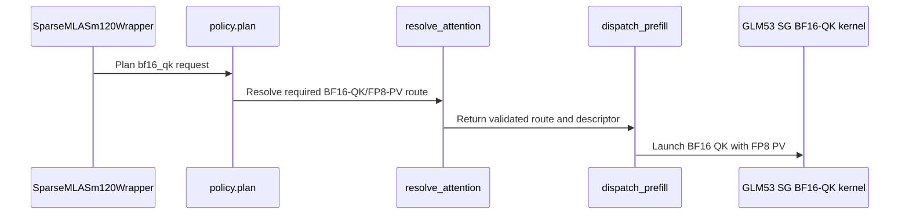

# [PR #5488] feat(mla): add explicit GLM53 BF16-QK compute on SM120

source: https://github.com/flashinfer-ai/flashinfer/pull/5488
state: open | updated: 2026-09-24T08:19:37Z
labels: op: attention

## 正文

<!-- .github/pull_request_template.md -->

## 📌 Description

GLM53 NoPE currently has no explicit way to select the existing BF16 query/key compute path: the default resolves to FP8 QK, and the explicit full-BF16 option is restricted to DSV4.1. Add `compute_precision="bf16_qk"` to `SparseMLASm120Wrapper` for BF16 QK with FP8 PV and the existing compact FP8 cache.

The initial envelope is T>0, H=16, page size 64, a single cache, and index-table width 2112 or 2176. The option uses the existing SG kernel, including for short queries. A distinct strict request prevents fallback to FP8 QK, and the execution descriptor accounts for BF16 shared memory and zero split-K scratch. The default route is unchanged. A fixed SG route has no phase/CPB tuning choice, so it does not consume FP8 calibration profiles.

A weight-free reproducer compares both table widths against an independent FP32 oracle over packed cache bytes. Tests cover unsupported forms, descriptor/workspace requirements, masked and tail indices, and two graph replays with changed inputs.

Validated on one RTX PRO 6000 Blackwell Server Edition (SM120), driver 580.126.20, PyTorch 2.13.0+cu130, CUDA 13.0. H16, page64, 528-byte FP8 cache rows, widths 2112/2176, seed 20260918, attention scale `1/sqrt(256)`. The same public cache writer, packed-byte FP32 oracle and thresholds were used throughout.

| Route | Cases passing | Maximum case relative RMS | Maximum absolute error |
| --- | ---: | ---: | ---: |
| Default wrapper, base `5871b667` | 8/26 | 0.02966133 | 0.10018444 |
| Forced FP8 SG, same base | 8/26 | 0.02960903 | 0.10213757 |
| Explicit BF16-QK wrapper, `cb9e34ae` | 26/26 | 0.00218414 | 0.01339340 |

The reproducer's fixed screening limits are relative RMS <=0.02 and maximum absolute error <=0.03; they are not an upstream documented FP8 accuracy guarantee. Selecting SG alone leaves the same 18 failing cases. Both widths have identical numerical results. Native compilation and all 49 regression tests passed with no skips, including policy/calibration isolation, unsupported forms, descriptor/workspace/shared-memory checks and changed-input CUDA Graph replay.

The BF16-QK SG descriptor uses 90,256 shared bytes and 384 threads, versus 82,320 shared bytes for FP8 SG. It uses no split-K scratch. This initial implementation deliberately forces SG even for decode and can trade performance for precision. Full-model accuracy, model-level graphs, throughput, other head counts and SM121 have not been validated.

Reproduce on the respective source checkout with an isolated JIT workspace and no AOT provider:

```sh
python benchmarks/repro_glm53_sm120_precision.py --route wrapper --precision default --widths 2112 2176 --timing
python benchmarks/repro_glm53_sm120_precision.py --route fp8-sg --precision default --widths 2112 2176 --timing
# Candidate checkout:
python benchmarks/repro_glm53_sm120_precision.py --route wrapper --precision bf16_qk --widths 2112 2176 --timing
pytest --noconftest tests/attention/test_glm53_precision_reproducer.py tests/attention/test_sparse_mla_sm120_glm53_bf16_qk.py -q
```

The first two measurements used unchanged library source at `5871b667` with this PR's standalone reproducer copied alongside it. This source reports package version 0.7.0 but is distinct from the v0.7.0 release tag. Native candidate measurements use `cb9e34ae`; it merges cleanly with main `d2c7d153`, whose relevant kernel/JIT sources and dependencies are unchanged.

<details>
<summary>Observed eager-call timings, 10 warmups / 30 CUDA-event samples per case</summary>

These events bracket Python calls and include host launch gaps; the direct FP8 SG route has a different Python call path. Timings vary across otherwise numerically equivalent widths. No isolated arithmetic-cost or model-speedup claim is made.

| Width | Case | Wrapper FP8 (us) | Direct FP8 SG (us) | Wrapper BF16-QK (us) |
| ---: | --- | ---: | ---: | ---: |
| 2112 | decode | 700.864 | 12.912 | 339.168 |
| 2112 | decode-all-masked | 337.920 | 13.296 | 343.888 |
| 2112 | verify-shaped | 736.800 | 116.480 | 603.536 |
| 2112 | verify-shaped-all-masked | 407.888 | 12.432 | 333.648 |
| 2112 | prefill | 646.240 | 116.576 | 765.808 |
| 2112 | prefill-all-masked | 568.160 | 12.864 | 343.808 |
| 2112 | tail-0 | 803.952 | 112.752 | 564.720 |
| 2112 | tail-1 | 584.304 | 115.296 | 534.144 |
| 2112 | tail-2 | 525.616 | 116.064 | 690.832 |
| 2112 | tail-3 | 358.368 | 115.168 | 612.160 |
| 2112 | tail-after-holes | 371.808 | 115.008 | 698.672 |
| 2176 | decode | 735.552 | 13.104 | 364.512 |
| 2176 | decode-all-masked | 542.224 | 12.784 | 335.232 |
| 2176 | verify-shaped | 712.240 | 115.824 | 594.960 |
| 2176 | verify-shaped-all-masked | 751.152 | 12.416 | 333.696 |
| 2176 | prefill | 800.608 | 116.368 | 734.656 |
| 2176 | prefill-all-masked | 325.664 | 14.176 | 340.272 |
| 2176 | tail-0 | 353.504 | 112.320 | 492.752 |
| 2176 | tail-1 | 511.904 | 114.784 | 749.952 |
| 2176 | tail-2 | 363.632 | 114.816 | 663.968 |
| 2176 | tail-3 | 530.048 | 116.192 | 460.864 |
| 2176 | tail-after-holes | 677.840 | 115.136 | 572.160 |

</details>

## 🔍 Related Issues

Builds on the compact GLM53 cache work in [#5075](https://github.com/flashinfer-ai/flashinfer/pull/5075) and the resolver/descriptor refactor in [#5197](https://github.com/flashinfer-ai/flashinfer/pull/5197). The SGLang adapter work in [sgl-project/sglang#38430](https://github.com/sgl-project/sglang/pull/38430) is separate; this change supplies the explicit FlashInfer precision choice.

## 🚀 Pull Request Checklist

Thank you for contributing to FlashInfer! Before we review your pull request, please make sure the following items are complete.

### ✅ Pre-commit Checks

- [x] I have installed `pre-commit` by running `pip install pre-commit` (or used your preferred method).
- [x] I have installed the hooks with `pre-commit install`.
- [x] I have run the hooks manually with `pre-commit run --all-files` and fixed any reported issues.

> If you are unsure about how to set up `pre-commit`, see [the pre-commit documentation](https://pre-commit.com/).

## 🧪 Tests

- [x] Tests have been added or updated as needed.
- [x] All tests are passing (`unittest`, etc.).

## 🔬 Experimental Track

<!-- Only for PRs submitted under the experimental policy (CONTRIBUTING.md → "Experimental APIs and Backends").
     Leave this section untouched for normal PRs. -->

- [ ] This PR is **experimental**: it adds or changes code under `flashinfer/experimental/` and/or an `@flashinfer_experimental_api`. Tracking issue: #
  - [ ] The tracking issue names an owner, the reason for the experimental path, and a graduation plan with a target release.
  - [ ] Core changes are limited to a thin entry point (signature, shared validation, feature-gate check, backend selection, handoff).
  - [ ] Tests live in `tests/experimental/` and were validated on the intended hardware; a runnable example is included.
  - [ ] Nothing is registered in `flashinfer/aot.py`, and no experimental backend is reachable from `backend="auto"` without `FLASHINFER_ALLOW_EXPERIMENTAL_AUTO_BACKENDS=1`. (Calling an `@flashinfer_experimental_api` or naming a backend explicitly is itself the opt-in and needs no environment variable.)
  - [ ] **Test scope declared below.** The experimental CI lane runs exactly these targets, so keep them as narrow as the change allows.

<!-- Required for experimental PRs. Replace the commented lines below with your targets.
     Do not delete the fence or change its `experimental-tests` tag — the experimental-track
     watcher reads it verbatim to decide which targets to ask CI for. -->

```experimental-tests
# One target per line: a directory or a file. (A pytest ::selector is not
# supported -- the sharding runner cannot consume one.) Must be under
# tests/experimental/ and must exist. Delete these comment lines and add yours, e.g.
#
#   tests/experimental/test_my_backend.py
#   tests/experimental/my_backend/
#
# Declaring the whole tree (tests/experimental/) is allowed but means every
# experimental PR pays for every other feature's tests, in every matrix cell.
```

## Reviewer Notes

Validation scope: the two contributed test files collected and passed 49 tests on SM120; the independent timed suite passed 26/26 cases afterward. The entire repository test suite was not run. Pre-commit checks and the commit hook passed. Separate source/install/JIT caches and verified installed import paths were used for each source variant.

Please review the strict numeric-request handling, narrow supported shapes and the decision to bypass phase/CPB calibration for this fixed SG specialization. Existing default selection remains unchanged; unsupported strict requests fail instead of silently reverting to FP8 QK. Kernel graph replay evidence does not establish full-model graph support.

Suggested GPU CI scope: `tests/attention/test_glm53_precision_reproducer.py` and `tests/attention/test_sparse_mla_sm120_glm53_bf16_qk.py`, particularly the SM120 lane. Maintainer-triggered CI is still pending.


<!-- This is an auto-generated comment: release notes by coderabbit.ai -->
## Summary by CodeRabbit

* **New Features**
  * Added a `bf16_qk` precision option for supported GLM53 NoPE workloads, combining BF16 query-key computation with FP8 value processing. Supported configurations use a dedicated single-group attention route, without FP8 calibration fallback.
* **Bug Fixes**
  * Unsupported `bf16_qk` configurations, including zero-token queries, now raise a clear error rather than proceeding through an incompatible or empty execution path.
<!-- end of auto-generated comment: release notes by coderabbit.ai -->

## 评论 (2)

### coderabbitai[bot] · 2026-09-23

<!-- This is an auto-generated comment: summarize by coderabbit.ai -->
<!-- review_stack_entry_start -->

<a href="https://app.coderabbit.ai/change-stack/flashinfer-ai/flashinfer/pull/5488"></a>

Navigate logical layers of code changes, visualize relationships, and explore their blast radius.

<!-- review_stack_entry_end -->
<!-- recent_review_start -->

No actionable comments were generated in the recent review. 🎉

<details>
<summary>ℹ️ Recent review info</summary>

<details>
<summary>⚙️ Run configuration</summary>

**Configuration used**: defaults

**Review profile**: CHILL

**Plan**: Advanced

**Run ID**: `7740e978-1b58-4ea7-9e0c-5e23cc9ed64e`

</details>

<details>
<summary>📥 Commits</summary>

Reviewing files that changed from the base of the PR and between cb9e34ae376e32d1132c98998afe6b696162061a and 3761963a94616e7710f09a9ee8a99c75fe698af4.

</details>

<details>
<summary>📒 Files selected for processing (8)</summary>

* `benchmarks/repro_glm53_sm120_precision.py`
* `csrc/sparse_mla_sm120/attention_resolve.cu`
* `csrc/sparse_mla_sm120/prefill_dispatch.cu`
* `flashinfer/mla/_sparse_mla_sm120/_api.py`
* `flashinfer/mla/_sparse_mla_sm120/_policy.py`
* `flashinfer/mla/_sparse_mla_sm120/_prepared.py`
* `tests/attention/test_glm53_precision_reproducer.py`
* `tests/attention/test_sparse_mla_sm120_glm53_bf16_qk.py`

</details>

<details>
<summary>🚧 Files skipped from review as they are similar to previous changes (8)</summary>

* flashinfer/mla/_sparse_mla_sm120/_prepared.py
* csrc/sparse_mla_sm120/prefill_dispatch.cu
* flashinfer/mla/_sparse_mla_sm120/_policy.py
* benchmarks/repro_glm53_sm120_precision.py
* tests/attention/test_sparse_mla_sm120_glm53_bf16_qk.py
* csrc/sparse_mla_sm120/attention_resolve.cu
* tests/attention/test_glm53_precision_reproducer.py
* flashinfer/mla/_sparse_mla_sm120/_api.py

</details>

**Included review availability:** Your plan provides up to 8 included reviews per hour; 7 remain after this review.

</details>

---


<!-- recent_review_end -->
<!-- walkthrough_start -->

<details>
<summary>📝 Walkthrough</summary>

## Walkthrough

Adds `bf16_qk` support for GLM53 NoPE sparse MLA on SM120/121. The route selects BF16 QK with FP8 PV under specified shape and cache constraints. A benchmark script and tests cover the route and packed-cache precision checks.

### Changes

**GLM53 BF16-QK route**

|Layer / File(s)|Summary|
|---|---|
|**Expose and plan BF16-QK requests** <br> `include/flashinfer/attention/sparse_mla_sm120/execution/attention_plan.h`, `flashinfer/mla/_sparse_mla_sm120/{_api.py,_execution.py,_policy.py,_prepared.py}`|Adds the required numeric route and accepts `bf16_qk` in the wrapper and execution code. Policy routes valid requests to `PREFILL_SG` without profile calibration. The wrapper rejects unsupported configurations and zero-token queries.|
|**Resolve and dispatch the strict route** <br> `csrc/sparse_mla_sm120/{attention_resolve.cu,prefill_dispatch.cu}`|The resolver validates the GLM53 route and selects BF16-QK/FP8-PV resources. Prefill dispatch launches the BF16 single-group kernel for the resolved route.|
|**Build the precision reproducer and tests** <br> `benchmarks/repro_glm53_sm120_precision.py`, `tests/attention/test_glm53_precision_reproducer.py`, `tests/attention/test_sparse_mla_sm120_glm53_bf16_qk.py`|Adds a packed-cache reference, error metrics, and a 13-case benchmark. CPU tests check the reference and input helpers. SM12x tests check route constraints, descriptor selection, and benchmark results.|

<!-- change_assessment_start -->
**Priority:** ⬇️ Low

**Estimated code review effort:** 4 (Complex) | ~45 minutes

<!-- change_assessment_commit:"3761963a94616e7710f09a9ee8a99c75fe698af4" -->
**Change:** Feature
<!-- change_assessment_end -->

### Sequence Diagram(s)



</details>

<!-- walkthrough_end -->
<!-- final_review_risk_start -->
**Merge Risk:** _⚪ Minimal_ · up to `37619`
<!-- final_review_risk_coverage:{"sourceCommitId":"3761963a94616e7710f09a9ee8a99c75fe698af4","coveredCommitId":"3761963a94616e7710f09a9ee8a99c75fe698af4","kind":"reviewed"} -->

No actionable merge-blocking issue is established from the supplied evidence; proceed with normal checks.
<!-- final_review_risk_end -->
<!-- pre_merge_checks_walkthrough_start -->

<details>
<summary>🚥 Pre-merge checks | ✅ 5</summary>

<details>
<summary>✅ Passed checks (5 passed)</summary>

|         Check name         | Status   | Explanation                                                                                                                                                                                               |
| :------------------------: | :------- | :-------------------------------------------------------------------------------------------------------------------------------------------------------------------------------------------------------- |
|         Title check        | ✅ Passed | The title clearly and concisely identifies the main change: adding explicit GLM53 BF16-QK compute support on SM120.                                                                                       |
|      Description check     | ✅ Passed | The description is complete and directly related to the changes. It explains the purpose, supported configuration, implementation details, validation results, limitations, reproduction steps, related … |
|     Docstring Coverage     | ✅ Passed | Docstring coverage is 91.11% which is sufficient. The required threshold is 80.00%. Docstring coverage is scoped to functions touched by this diff. Analyzed 45 functions across 10 files.                |
|     Linked Issues check    | ✅ Passed | Check skipped because no linked issues were found for this pull request.                                                                                                                                  |
| Out of Scope Changes check | ✅ Passed | Check skipped because no linked issues were found for this pull request.                                                                                                                                  |

</details>

</details>

<!-- pre_merge_checks_walkthrough_end -->
<!-- finishing_touch_checkbox_start -->

<details>
<summary>✨ Finishing Touches 💡 1</summary>

<!-- finishing_touch_suggestion:fix_ci -->
<details open>
<summary>🛠️ Fix failing CI checks 💡</summary>

- [ ] <!-- {"checkboxId": "9f0d24fb-b419-4f01-baf0-8b26b6424f34", "radioGroupId": "fix-ci-output-choice-group-unknown_comment_id"} --> Commit to this branch
- [ ] <!-- {"checkboxId": "6d21cfe8-ec3f-40e2-9222-b8318b64d3b0", "radioGroupId": "fix-ci-output-choice-group-unknown_comment_id"} --> Create a new PR

</details>
<details open>
<summary>🧪 Generate unit tests (beta)</summary>

- [ ] <!-- {"checkboxId": "f47ac10b-58cc-4372-a567-0e02b2c3d479", "radioGroupId": "utg-output-choice-group-unknown_comment_id"} --> Create a new PR

</details>

</details>

<!-- finishing_touch_checkbox_end -->
<!-- tips_start -->

---

Thanks for using [CodeRabbit](https://coderabbit.ai?utm_source=oss&utm_medium=github&utm_campaign=flashinfer-ai/flashinfer&utm_content=5488)! It's free for OSS, and your support helps us grow. If you like it, consider giving us a shout-out.

<details>
<summary>❤️ Share</summary>

- [X](https://twitter.com/intent/tweet?text=I%20just%20used%20%40coderabbitai%20for%20my%20code%20review%2C%20and%20it%27s%20fantastic%21%20It%27s%20free%20for%20OSS%20and%20offers%20a%20free%20trial%20for%20the%20proprietary%20code.%20Check%20it%20out%3A&url=https%3A//coderabbit.ai)
- [Mastodon](https://mastodon.social/share?text=I%20just%20used%20%40coderabbitai%20for%20my%20code%20review%2C%20and%20it%27s%20fantastic%21%20It%27s%20free%20for%20OSS%20and%20offers%20a%20free%20trial%20for%20the%20proprietary%20code.%20Check%20it%20out%3A%20https%3A%2F%2Fcoderabbit.ai)
- [Reddit](https://www.reddit.com/submit?title=Great%20tool%20for%20code%20review%20-%20CodeRabbit&text=I%20just%20used%20CodeRabbit%20for%20my%20code%20review%2C%20and%20it%27s%20fantastic%21%20It%27s%20free%20for%20OSS%20and%20offers%20a%20free%20trial%20for%20proprietary%20code.%20Check%20it%20out%3A%20https%3A//coderabbit.ai)
- [LinkedIn](https://www.linkedin.com/sharing/share-offsite/?url=https%3A%2F%2Fcoderabbit.ai&mini=true&title=Great%20tool%20for%20code%20review%20-%20CodeRabbit&summary=I%20just%20used%20CodeRabbit%20for%20my%20code%20review%2C%20and%20it%27s%20fantastic%21%20It%27s%20free%20for%20OSS%20and%20offers%20a%20free%20trial%20for%20proprietary%20code)

</details>


<sub>Comment `@coderabbitai help` to get the list of available commands.</sub>

<!-- tips_end -->

### fparisio · 2026-09-24

@saltyminty @bkryu  this builds on your #5197 and #5075, so you're probably the best reviewers. Would appreciate a look when you have time. CI still needs a maintainer trigger. Thanks!
