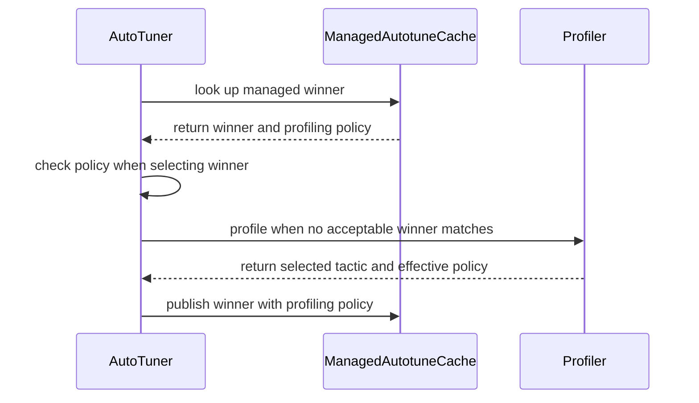

# [PR #5495] fix(autotuner): reuse managed winners with matching profiling policy

source: https://github.com/flashinfer-ai/flashinfer/pull/5495
state: open | updated: 2026-09-24T09:05:45Z
labels: 

## 正文

<!-- .github/pull_request_template.md -->

## 📌 Description

Fix managed autotuner v2 cache reuse when profiling uses cold L2 or a non-default CUDA-graph replay count. The managed lookup inherited the legacy file-policy gate: persisted winners could be written successfully but ignored on the next process's tuning pass. Simply removing that gate would also allow tuning to reuse winners with unknown or mismatched measurement provenance.

- Persist optional per-entry `profiling_policy` metadata for the effective replay count (`null` without graphs) and hot/cold L2 policy, after context and measurement-policy overrides.
- At `choose_one`'s profiling decision and post-profile selection, opt into provenance matching with `require_profiling_policy=True`. Missing, malformed, or different provenance is a profiling miss, not deletion. Direct `search_cache` calls remain lookup-only and permissive by default, even inside a tuning context, for both managed-store winners and promoted in-memory winners; replay and bare inference are also permissive, subject to existing tactic validation.
- Missing provenance triggers a one-time retune even under the default policy, including for stores retained across a same-version build upgrade; newly published winners carry provenance for subsequent matching reuse.
- Retuning updates the same entry and decoded memo only when the winning runner's key is unchanged. If a different runner wins, its entry is published under that runner's key and the old runner's entry remains, preserving the existing main-branch behavior. A fresh-process replay can still return that old entry depending on runner ordering.
- Carry provenance through internal lookup/preload records, reload, and promotion into memory, partitioned with the winner by cache root and environment identity.
- Keep the v2 schema version, manifest identity, operation keys, and legacy v1 file-policy gating unchanged.

Scope against `dc04`: four files. Production code is in `flashinfer/autotune_cache.py` and `flashinfer/autotuner/autotuner.py`; regression coverage is in `tests/autotuner/test_autotune_cache_v2.py`, and documentation is in `docs/design_docs/autotuner_v2.md`. This is a general managed-autotuner fix, not sparse-MLA-specific; there are no kernel or collective changes.

## 🔍 Related Issues

- Related autotuner discussions: #3920 and #3861; this fix does not claim to close either RFC/discussion.
- Downstream integration context: https://github.com/vllm-project/vllm/pull/55671.
- Searches for `profiling_policy` and cold-L2 managed-cache reuse found no direct duplicate.

## 🚀 Pull Request Checklist

Thank you for contributing to FlashInfer! Before we review your pull request, please make sure the following items are complete.

### ✅ Pre-commit Checks

- [ ] I have installed `pre-commit` by running `pip install pre-commit` (or used your preferred method).
- [ ] I have installed the hooks with `pre-commit install`.
- [ ] I have run the hooks manually with `pre-commit run --all-files` and fixed any reported issues.

> If you are unsure about how to set up `pre-commit`, see [the pre-commit documentation](https://pre-commit.com/).

Validation used `prek` on the four changed files: all checks passed. This was **not** a repository-wide `--all-files` run; hook installation is not asserted above.

## 🧪 Tests

- [x] Tests have been added or updated as needed.
- [ ] All tests are passing (`unittest`, etc.).

**Current review revision — targeted tests:** **310 passed** across core, configs, v2 cache, global timer, and tactics blocklist; **7 passed** in the distributed suite; and **34 passed, 1 xfailed** in PCIe IPC tuning. Standard commands from the FlashInfer checkout (with its test environment active):

```bash
python -m pytest -q tests/autotuner/test_autotuner_core.py tests/autotuner/test_autotuner_configs.py tests/autotuner/test_autotune_cache_v2.py tests/autotuner/test_global_timer.py tests/autotuner/test_tactics_blocklist.py
python -m pytest -q tests/autotuner/test_autotuner_distributed.py
python -m pytest -q tests/comm/test_pcie_ipc_tuning.py
```

The full repository suite was not run. Regression coverage includes inherited/overridden policies, preload/lazy/reload paths, changed-policy retuning, missing-provenance replay followed by one-time tuning, decoded-memo refresh, root-partitioned memory provenance, permissive direct lookups inside tuning (including PCIe lookup without a tune group), and post-profile selection when a different runner wins.

**Earlier real GPU reproduction (before this review revision):** NVIDIA RTX PRO 6000, SM120; public `nvfp4_quantize` → CUTLASS `mm_fp4`, M=128/N=512/K=512, BF16 inputs/output, seed 0, tuning bucket 128. Here cold/warm means an empty/populated managed cache in a **fresh process**, not the L2 measurement policy. The table records the earlier baseline comparison and fixed four-process sequence (replays 1, 1, 20, 20); that full sequence was not rerun for this review revision.

| Version / policy | Cold first-call profiles | Warm first-call profiles |
| --- | ---: | ---: |
| Baseline, graph replays=1 | 33 | 33 |
| Fixed, graph replays=1 | 33 | 0 |
| Fixed, same cache changed to graph replays=20 | 33 | 0 |

The second call in every process profiled **0** times. Counts were measured by wrapping and delegating to the actual `_profile_single_kernel` method, not replacing profiling. Every output had cosine similarity **0.9908581376 > 0.97** against the BF16 reference. Fixed same-policy warm runs preserved cache-file hashes and modification times.

**Current review revision — real FP4 warm-cache rerun:** with graph replays=20 in tuning mode, both calls made **0** `_profile_single_kernel` calls, reported zero cache misses, and passed correctness with cosine similarity **0.9908581376075745 > 0.97**. The existing entry and manifest retained identical SHA-256 hashes and nanosecond modification times before, after each call, and after the run. This is a warm-cache check of the current revision, not a rerun of the earlier cold/policy-change sequence or GLM end-to-end validation.

The following self-contained reproduction uses only public FlashInfer APIs. Run it separately against baseline and fixed installations; each invocation gets a new temporary cache, and each loop iteration starts a fresh process. Inspect autotuner logs and cache JSON files for profiling/reuse and persisted policy; the profiling-call counter used for the measurements above is omitted here.

```bash
cache=$(mktemp -d)
for replays in 1 1 20 20; do
  python - "$cache" "$replays" <<'PY'
import sys
from pathlib import Path
import torch
import torch.nn.functional as F
from flashinfer import SfLayout, mm_fp4, nvfp4_quantize
from flashinfer.autotune_cache import autotune_v2
from flashinfer.autotuner import autotune

cache_root, replays = Path(sys.argv[1]), int(sys.argv[2])
assert torch.cuda.get_device_capability() == (12, 0)
torch.manual_seed(0)
a = torch.randn((128, 512), device="cuda", dtype=torch.bfloat16)
b = torch.randn((512, 512), device="cuda", dtype=torch.bfloat16)
ga = (448 * 6) / a.float().abs().nan_to_num().max()
gb = (448 * 6) / b.float().abs().nan_to_num().max()
aq, sa = nvfp4_quantize(a, ga, sfLayout=SfLayout.layout_128x4, do_shuffle=False)
bq, sb = nvfp4_quantize(b, gb, sfLayout=SfLayout.layout_128x4, do_shuffle=False)
alpha = 1.0 / (ga * gb)
reference = torch.mm(a, b.T).float().flatten()
out = torch.empty((128, 512), device="cuda", dtype=torch.bfloat16)
with autotune(cuda_graph_profile_replays=replays):
    with autotune_v2(mode="tune", cache_root=cache_root, tuning_buckets=(128,)):
        for call in (1, 2):
            mm_fp4(aq, bq.T, sa, sb.T, alpha, torch.bfloat16, out,
                   block_size=16, use_8x4_sf_layout=False, backend="cutlass",
                   use_nvfp4=True, skip_check=False)
            torch.cuda.synchronize()
            cosine = F.cosine_similarity(reference, out.float().flatten(), dim=0).item()
            print(f"replays={replays} call={call} cosine={cosine}", flush=True)
            assert cosine > 0.97
print(f"cache={cache_root}")
PY
done
```

**Earlier local downstream end-to-end validation (before this review revision; not rerun for this revision and not a standalone result for the published vLLM PR):** the local integration combined vLLM #55264 and #55671 with this FlashInfer fix. It used the official NVIDIA GLM-5.3-Flash-NVFP4 checkpoint, 4x RTX PRO 6000 Blackwell, TP4, no speculative decoding, context 65,536, max sequences 32, max batched tokens 4,096, and `FULL_AND_PIECEWISE` CUDA graphs, with no operation skips. Cold smoke returned HTTP 200; warm full GSM8K scored **1,232/1,319 = 0.9340409401**, passing the configured gate. All **211 cache files** retained identical hashes and modification times, with zero added/removed files; warm logs contained zero profiling markers and FP4/MoE managed-cache hits on every rank. The recipe's initial cleanup failed, then an explicit stop was performed and verified.

These results validate cache reuse and correctness only; no throughput, performance-speedup, or accuracy-gain claim is made.

## 🔬 Experimental Track

<!-- Only for PRs submitted under the experimental policy (CONTRIBUTING.md → "Experimental APIs and Backends").
     Leave this section untouched for normal PRs. -->

- [ ] This PR is **experimental**: it adds or changes code under `flashinfer/experimental/` and/or an `@flashinfer_experimental_api`. Tracking issue: #
  - [ ] The tracking issue names an owner, the reason for the experimental path, and a graduation plan with a target release.
  - [ ] Core changes are limited to a thin entry point (signature, shared validation, feature-gate check, backend selection, handoff).
  - [ ] Tests live in `tests/experimental/` and were validated on the intended hardware; a runnable example is included.
  - [ ] Nothing is registered in `flashinfer/aot.py`, and no experimental backend is reachable from `backend="auto"` without `FLASHINFER_ALLOW_EXPERIMENTAL_AUTO_BACKENDS=1`. (Calling an `@flashinfer_experimental_api` or naming a backend explicitly is itself the opt-in and needs no environment variable.)
  - [ ] **Test scope declared below.** The experimental CI lane runs exactly these targets, so keep them as narrow as the change allows.

<!-- Required for experimental PRs. Replace the commented lines below with your targets.
     Do not delete the fence or change its `experimental-tests` tag — the experimental-track
     watcher reads it verbatim to decide which targets to ask CI for. -->

```experimental-tests
# One target per line: a directory or a file. (A pytest ::selector is not
# supported -- the sharding runner cannot consume one.) Must be under
# tests/experimental/ and must exist. Delete these comment lines and add yours, e.g.
#
#   tests/experimental/test_my_backend.py
#   tests/experimental/my_backend/
#
# Declaring the whole tree (tests/experimental/) is allowed but means every
# experimental PR pays for every other feature's tests, in every matrix cell.
```

## Reviewer Notes

AI-assisted implementation and description. Human review is not claimed. Please focus on optional-metadata compatibility, opt-in provenance checks at `choose_one`'s profiling decision and post-profile selection, permissive direct lookups, provenance surviving lookup/preload and memory promotion, and preservation of v1 behavior. The internal lookup/preload record now carries policy alongside runner/tactic; public operation APIs are unchanged.


<!-- This is an auto-generated comment: release notes by coderabbit.ai -->

## Summary by CodeRabbit

* **New Features**
  * Autotuning now checks whether saved results match the effective profiling settings before reusing them. Missing or changed settings trigger retuning, while matching results remain reusable across cache reloads and preloads.
  * Retuning preserves existing results when a different runner wins, and updates the existing result when the same runner wins.
* **Documentation**
  * Added guidance on how profiling settings affect reuse of saved tuning results, including behavior for older entries and direct cache lookups.

<!-- end of auto-generated comment: release notes by coderabbit.ai -->

## 评论 (1)

### coderabbitai[bot] · 2026-09-23

<!-- This is an auto-generated comment: summarize by coderabbit.ai -->
<!-- review_stack_entry_start -->

<a href="https://app.coderabbit.ai/change-stack/flashinfer-ai/flashinfer/pull/5495"></a>

Navigate logical layers of code changes, visualize relationships, and explore their blast radius.

<!-- review_stack_entry_end -->
<!-- recent_review_start -->

No actionable comments were generated in the recent review. 🎉

<details>
<summary>ℹ️ Recent review info</summary>

<details>
<summary>⚙️ Run configuration</summary>

**Configuration used**: defaults

**Review profile**: CHILL

**Plan**: Advanced

**Run ID**: `3f6831d7-5961-4f17-8192-169927fe12fd`

</details>

<details>
<summary>📥 Commits</summary>

Reviewing files that changed from the base of the PR and between 37b4d30eac39b89f198b893dd11914bd76f5fcf8 and 771ac8f4be455e0fe6187396d48d3e0f681dfddd.

</details>

<details>
<summary>📒 Files selected for processing (4)</summary>

* `docs/design_docs/autotuner_v2.md`
* `flashinfer/autotune_cache.py`
* `flashinfer/autotuner/autotuner.py`
* `tests/autotuner/test_autotune_cache_v2.py`

</details>

**Included review availability:** Your plan provides up to 8 included reviews per hour; 7 remain after this review.

</details>

---


<!-- recent_review_end -->
<!-- walkthrough_start -->

<details>
<summary>📝 Walkthrough</summary>

## Walkthrough

Managed autotune v2 entries now store optional profiling-policy provenance. Winner selection checks that provenance when required, and profiling records it when publishing a tuned entry. Tests and design documentation cover policy matching, retuning, and cache reuse.

### Changes

**Managed cache provenance**

|Layer / File(s)|Summary|
|---|---|
|**Managed entry representation and hydration** <br> `flashinfer/autotune_cache.py`|Managed cache lookup, publish, preload, and hydration use entries that include optional profiling-policy provenance. Reload also clears the in-memory policy records.|
|**Policy-aware lookup and winner selection** <br> `flashinfer/autotuner/autotuner.py`|Winner caches use store or policy identity. Managed lookups can require matching provenance when `choose_one` selects a winner; direct lookup callers can leave that check disabled.|
|**Profiling, publishing, and behavior coverage** <br> `flashinfer/autotuner/autotuner.py`, `tests/autotuner/test_autotune_cache_v2.py`, `docs/design_docs/autotuner_v2.md`|Profiling records and publishes the selected policy. Tests cover policy reuse, retuning, and other managed-cache paths. The design document describes the v2 provenance behavior.|

<!-- change_assessment_start -->
**Priority:** ⬇️ Low


**Estimated code review effort:** 3 (Moderate) | ~25 minutes

<!-- change_assessment_commit:"771ac8f4be455e0fe6187396d48d3e0f681dfddd" -->
**Change:** Bug fix
<!-- change_assessment_end -->

### Sequence Diagram(s)



**Suggested reviewers:** `qiching`

</details>

<!-- walkthrough_end -->
<!-- final_review_risk_start -->
**Merge Risk:** _⚪ Minimal_ · up to `771ac`
<!-- final_review_risk_coverage:{"sourceCommitId":"771ac8f4be455e0fe6187396d48d3e0f681dfddd","coveredCommitId":"771ac8f4be455e0fe6187396d48d3e0f681dfddd","kind":"reviewed"} -->

No concrete issue remains that should block merging after normal checks.
<!-- final_review_risk_end -->
<!-- pre_merge_checks_walkthrough_start -->

<details>
<summary>🚥 Pre-merge checks | ✅ 4 | ❌ 1</summary>

### ❌ Failed checks (1 warning)

|     Check name     | Status     | Explanation                                                                                                                                                                                               | Resolution                                                                         |
| :----------------: | :--------- | :-------------------------------------------------------------------------------------------------------------------------------------------------------------------------------------------------------- | :--------------------------------------------------------------------------------- |
| Docstring Coverage | ⚠️ Warning | Docstring coverage is 46.43% which is insufficient. The required threshold is 80.00%. Docstring coverage is scoped to functions touched by this diff. Analyzed 28 functions across 3 files. (1 skipped: … | Write docstrings for the functions missing them to satisfy the coverage threshold. |

<details>
<summary>✅ Passed checks (4 passed)</summary>

|         Check name         | Status   | Explanation                                                                                                                                                                                               |
| :------------------------: | :------- | :-------------------------------------------------------------------------------------------------------------------------------------------------------------------------------------------------------- |
|     Linked Issues check    | ✅ Passed | Check skipped because no linked issues were found for this pull request.                                                                                                                                  |
| Out of Scope Changes check | ✅ Passed | Check skipped because no linked issues were found for this pull request.                                                                                                                                  |
|         Title check        | ✅ Passed | The title clearly and concisely describes the main change: reusing managed autotuner winners when profiling policy matches.                                                                               |
|      Description check     | ✅ Passed | The description follows the template and provides a detailed change summary, related issues, test coverage, validation limits, experimental-track status, and reviewer notes. It explicitly states that … |

</details>

<details>
<summary>Full details: Docstring Coverage</summary>

**Explanation**

Docstring coverage is 46.43% which is insufficient. The required threshold is 80.00%. Docstring coverage is scoped to functions touched by this diff. Analyzed 28 functions across 3 files. (1 skipped: 1 unsupported.)

</details>

</details>

<!-- pre_merge_checks_walkthrough_end -->

- [ ] <!-- {"checkboxId":"585bb3f6-faf5-4dbf-96d2-74e382adf19a"} --> Fix all pre-merge checks with AI
<!-- finishing_touch_checkbox_start -->

<details>
<summary>✨ Finishing Touches 💡 1</summary>

<!-- finishing_touch_suggestion:fix_ci -->
<details open>
<summary>🛠️ Fix failing CI checks 💡</summary>

- [ ] <!-- {"checkboxId": "9f0d24fb-b419-4f01-baf0-8b26b6424f34", "radioGroupId": "fix-ci-output-choice-group-unknown_comment_id"} --> Commit to this branch
- [ ] <!-- {"checkboxId": "6d21cfe8-ec3f-40e2-9222-b8318b64d3b0", "radioGroupId": "fix-ci-output-choice-group-unknown_comment_id"} --> Create a new PR

</details>
<details open>
<summary>🧪 Generate unit tests (beta)</summary>

- [ ] <!-- {"checkboxId": "f47ac10b-58cc-4372-a567-0e02b2c3d479", "radioGroupId": "utg-output-choice-group-unknown_comment_id"} --> Create a new PR

</details>

</details>

<!-- finishing_touch_checkbox_end -->
<!-- tips_start -->

---

Thanks for using [CodeRabbit](https://coderabbit.ai?utm_source=oss&utm_medium=github&utm_campaign=flashinfer-ai/flashinfer&utm_content=5495)! It's free for OSS, and your support helps us grow. If you like it, consider giving us a shout-out.

<details>
<summary>❤️ Share</summary>

- [X](https://twitter.com/intent/tweet?text=I%20just%20used%20%40coderabbitai%20for%20my%20code%20review%2C%20and%20it%27s%20fantastic%21%20It%27s%20free%20for%20OSS%20and%20offers%20a%20free%20trial%20for%20the%20proprietary%20code.%20Check%20it%20out%3A&url=https%3A//coderabbit.ai)
- [Mastodon](https://mastodon.social/share?text=I%20just%20used%20%40coderabbitai%20for%20my%20code%20review%2C%20and%20it%27s%20fantastic%21%20It%27s%20free%20for%20OSS%20and%20offers%20a%20free%20trial%20for%20the%20proprietary%20code.%20Check%20it%20out%3A%20https%3A%2F%2Fcoderabbit.ai)
- [Reddit](https://www.reddit.com/submit?title=Great%20tool%20for%20code%20review%20-%20CodeRabbit&text=I%20just%20used%20CodeRabbit%20for%20my%20code%20review%2C%20and%20it%27s%20fantastic%21%20It%27s%20free%20for%20OSS%20and%20offers%20a%20free%20trial%20for%20proprietary%20code.%20Check%20it%20out%3A%20https%3A//coderabbit.ai)
- [LinkedIn](https://www.linkedin.com/sharing/share-offsite/?url=https%3A%2F%2Fcoderabbit.ai&mini=true&title=Great%20tool%20for%20code%20review%20-%20CodeRabbit&summary=I%20just%20used%20CodeRabbit%20for%20my%20code%20review%2C%20and%20it%27s%20fantastic%21%20It%27s%20free%20for%20OSS%20and%20offers%20a%20free%20trial%20for%20proprietary%20code)

</details>


<sub>Comment `@coderabbitai help` to get the list of available commands.</sub>

<!-- tips_end -->

## Review (4)

### qiching · 2026-09-24 · COMMENTED

(no text)

### qiching · 2026-09-24 · COMMENTED

(no text)

### lucifer1004 · 2026-09-24 · COMMENTED

(no text)

### lucifer1004 · 2026-09-24 · COMMENTED

(no text)
