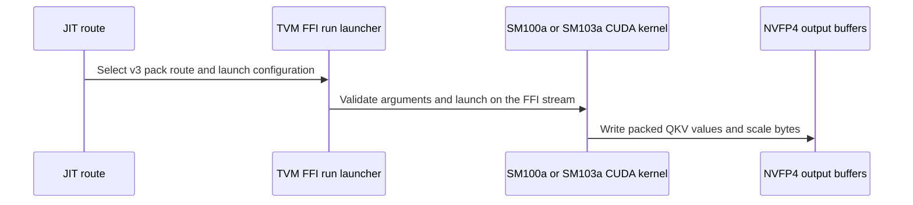

# [PR #5516] feat(cake_backend): pipelined pack stage for MiniMax-H3 NVFP4 pre-attention (SM100a/SM103a)

source: https://github.com/flashinfer-ai/flashinfer/pull/5516
state: open | updated: 2026-09-24T14:07:57Z
labels: run-ci

## 正文

<!-- .github/pull_request_template.md -->

## 📌 Description

Performance follow-up to #5496 (Cake-generated MiniMax-H3 **NVFP4 (W4A4)** pre-attention for
B200 `sm_100a` / B300 `sm_103a`, candidate 2B of #4532). The third stage of the operation
(per-head Q/K RMSNorm + D96 split-half NeoX RoPE + destination-major NVFP4 pack) is regenerated
from a re-scheduled program:

- each warp now streams 16 tokens (four 4-token quads) through a two-stage per-warp `cp.async`
  ring in shared memory (28 KB per CTA) instead of loading one quad straight into registers;
- the arithmetic runs on packed carriers (`fma.rn.ftz.f32x2`, `cvt.rn.bf16x2`, bf16x2 partner
  shuffles), with the RoPE sign folded into the sine word; about 35 % fewer instructions per
  Q/K row at the same 4-CTA-per-SM residency (63 registers, no spills).

Every rounding point of the previous program is reproduced, so the outputs are **byte-identical**
(E2M1 nibbles and physical E4M3 scale bytes) to the merged programs and therefore to the
segmented FlashInfer chain on all 44 contract shapes on both architectures. Stage 1, `mm_fp4`
and the operation's Python surface are unchanged.

### What changes in the delivery

Same program identity as #5496: one shared norm stage plus one pack stage per partition count
`P` (five programs, ten generated `.cu` files per architecture) and four route records per
architecture. The pack-stage route rule now carries `rows_per_warp = 16` (was 4) and a 32 KB
dynamic shared-memory requirement; the operation evaluates the launch grid from the rule as
before. No new source files; the ten generated `.cu` per arch and the two route tables are
regenerated.

### Performance vs the merged programs (Cake contract harness, same-session paired cold-L2 CUPTI)

| Architecture | Rows byte-exact | Stage 3 speedup (geomean, 24 production rows) | Operation speedup (geomean / min / max) |
|---|---:|---:|---|
| B200 / sm_100a | 44/44 | 1.565x | 1.107x / 1.078x / 1.121x |
| B300 / sm_103a | 44/44 | 1.586x | 1.104x / 1.081x / 1.135x |

Against the segmented FlashInfer chain this puts the operation at about 5.9x (B200) / 6.5x (B300).

### Export evidence

Source = the Cake production launcher (the same three launches the operation issues, `mm_fp4` tactic pinned at preparation), export = the exact exported TVM-FFI entries loaded through the FlashInfer JIT route tables, same caller-owned tensors and workspaces. Each row checks the exported callable against the Cake launcher (finite outputs, dequantised tolerance, invalid-AdaLN-row zeroing; bitwise source/export parity recorded), then times both arms interleaved with CUPTI GPU-span timing, cold L2 before every sample, `symmetric_external_cuda_graph` for both arms, 3 counterbalanced groups, 100 ms warmup and 1000 ms reportable budget per arm and group; gates: source/export >= 0.97, directional disagreement <= 0.02, endpoint drift <= 0.02, sampled SM clock >= 0.70 of the observed phase maximum in every warmup/measurement phase (see the SM-clock note above). Rows without `benchmark` are correctness rows and are timed for parity only.

### sm_103a (NVIDIA B300 SXM6 AC, CC 10.3, driver 580.126.09): 35/44 rows sealed, 9 diagnostic; source/export geomean over sealed rows 1.0002x (min 0.9867x, max 1.0131x)

| Shape | P | M | Source ms | Export ms | Source / Export | Correctness | SM clock MHz (phase min–max) | Verdict |
|---|---:|---:|---:|---:|---:|---|---|---|
| center_p1_4s_m33472 | 1 | 33472 | 2.164100 | 2.164228 | 0.999941x | pass | 1425–2032 | pass |
| center_p2_4s_m16736 | 2 | 16736 | 1.074794 | 1.073419 | 1.001281x | pass | 1507–2032 | pass |
| center_p4_4s_m8368 | 4 | 8368 | 0.465349 | 0.465253 | 1.000206x | pass | 1785–2032 | pass |
| center_p8_4s_m4184 | 8 | 4184 | 0.235874 | 0.235234 | 1.002721x | pass | 2010–2032 | pass |
| center_p1_5s_m38592 | 1 | 38592 | — | — | — | fail/incomplete | 1402–2032 | diagnostic: SM-clock qualification only (measurement-phase dips to 1402 MHz for 300 ms, floor 0.70 x max); receipt aborted before recording correctness |
| center_p2_5s_m19296 | 2 | 19296 | 1.255438 | 1.256285 | 0.999326x | pass | 1462–2032 | pass |
| center_p4_5s_m9648 | 4 | 9648 | 0.541286 | 0.540166 | 1.002073x | pass | 1747–2032 | pass |
| center_p8_5s_m4824 | 8 | 4824 | 0.264227 | 0.263875 | 1.001334x | pass | 1980–2032 | pass |
| center_p1_6s_m48768 | 1 | 48768 | 3.013183 | 3.015407 | 0.999262x | pass | 1425–2032 | pass |
| center_p2_6s_m24384 | 2 | 24384 | 1.505200 | 1.505247 | 0.999969x | pass | 1440–2032 | pass |
| center_p4_6s_m12192 | 4 | 12192 | 0.764871 | 0.765543 | 0.999123x | pass | 1627–2032 | pass |
| center_p8_6s_m6096 | 8 | 6096 | 0.336996 | 0.337123 | 0.999623x | pass | 1950–2032 | pass |
| center_p1_8s_m58944 | 1 | 58944 | — | — | — | fail/incomplete | 1395–2032 | diagnostic: SM-clock qualification only (measurement-phase dips to 1395 MHz for 900 ms, floor 0.70 x max); receipt aborted before recording correctness |
| center_p2_8s_m29472 | 2 | 29472 | 1.923636 | 1.922922 | 1.000371x | pass | 1455–2032 | pass |
| center_p4_8s_m14736 | 4 | 14736 | 0.940090 | 0.938890 | 1.001278x | pass | 1537–2032 | pass |
| center_p8_8s_m7368 | 8 | 7368 | 0.410948 | 0.410052 | 1.002185x | pass | 1875–2032 | pass |
| center_p1_10s_m74240 | 1 | 74240 | — | — | — | fail/incomplete | 1357–2032 | diagnostic: SM-clock qualification only (measurement-phase dips to 1357 MHz for 1800 ms, floor 0.70 x max); receipt aborted before recording correctness |
| center_p2_10s_m37120 | 2 | 37120 | — | — | — | fail/incomplete | 1342–2032 | diagnostic: SM-clock qualification only (measurement-phase dips to 1342 MHz for 1210 ms, floor 0.70 x max); receipt aborted before recording correctness |
| center_p4_10s_m18560 | 4 | 18560 | 1.193245 | 1.193197 | 1.000040x | pass | 1485–2032 | pass |
| center_p8_10s_m9280 | 8 | 9280 | 0.507653 | 0.508549 | 0.998238x | pass | 1770–2032 | pass |
| center_p1_15s_m109952 | 1 | 109952 | 6.881097 | 6.884072 | 0.999568x | pass | 1365–2032 | pass |
| center_p2_15s_m54976 | 2 | 54976 | — | — | — | fail/incomplete | 1380–2032 | diagnostic: SM-clock qualification only (measurement-phase dips to 1380 MHz for 1900 ms, floor 0.70 x max); receipt aborted before recording correctness |
| center_p4_15s_m27488 | 4 | 27488 | 1.653170 | 1.652753 | 1.000252x | pass | 1462–2032 | pass |
| center_p8_15s_m13744 | 8 | 13744 | 0.866745 | 0.865481 | 1.001460x | pass | 1560–2032 | pass |
| aligned_p1_5s_minus64_m38528 | 1 | 38528 | — | — | — | fail/incomplete | 1387–2032 | diagnostic: SM-clock qualification only (measurement-phase dips to 1387 MHz for 200 ms, floor 0.70 x max); receipt aborted before recording correctness |
| aligned_p1_5s_plus64_m38656 | 1 | 38656 | — | — | — | fail/incomplete | 1387–2032 | diagnostic: SM-clock qualification only (measurement-phase dips to 1387 MHz for 300 ms, floor 0.70 x max); receipt aborted before recording correctness |
| aligned_p2_5s_minus32_m19264 | 2 | 19264 | 1.247996 | 1.248061 | 0.999948x | pass | 1462–2032 | pass |
| aligned_p2_5s_plus32_m19328 | 2 | 19328 | 1.246062 | 1.244750 | 1.001054x | pass | 1477–2032 | pass |
| aligned_p4_5s_minus16_m9632 | 4 | 9632 | 0.539814 | 0.539525 | 1.000536x | pass | 1732–2032 | pass |
| aligned_p4_5s_plus16_m9664 | 4 | 9664 | 0.540358 | 0.540550 | 0.999646x | pass | 1732–2032 | pass |
| aligned_p8_5s_minus8_m4816 | 8 | 4816 | 0.264643 | 0.265315 | 0.997467x | pass | 1965–2032 | pass |
| aligned_p8_5s_plus8_m4832 | 8 | 4832 | 0.265506 | 0.264707 | 1.003018x | pass | 1965–2032 | pass |
| tail_p1_5s_minus1_m38591 | 1 | 38591 | — | — | — | fail/incomplete | 1395–2032 | diagnostic: SM-clock qualification only (measurement-phase dips to 1395 MHz for 300 ms, floor 0.70 x max); receipt aborted before recording correctness |
| tail_p1_5s_plus1_m38593 | 1 | 38593 | — | — | — | fail/incomplete | 1402–2032 | diagnostic: SM-clock qualification only (measurement-phase dips to 1402 MHz for 200 ms, floor 0.70 x max); receipt aborted before recording correctness |
| tail_p2_5s_minus1_m19295 | 2 | 19295 | 1.242957 | 1.243613 | 0.999473x | pass | 1462–2032 | pass |
| tail_p2_5s_plus1_m19297 | 2 | 19297 | 1.246798 | 1.245485 | 1.001054x | pass | 1462–2032 | pass |
| tail_p4_5s_minus1_m9647 | 4 | 9647 | 0.542950 | 0.544358 | 0.997413x | pass | 1725–2032 | pass |
| tail_p4_5s_plus1_m9649 | 4 | 9649 | 0.542918 | 0.543590 | 0.998764x | pass | 1725–2032 | pass |
| tail_p8_5s_minus1_m4823 | 8 | 4823 | 0.268067 | 0.267939 | 1.000478x | pass | 1950–2032 | pass |
| tail_p8_5s_plus1_m4825 | 8 | 4825 | 0.263587 | 0.262915 | 1.002556x | pass | 1965–2032 | pass |
| smoke_p8_m1 | 8 | 1 | 0.029696 | 0.029313 | 1.013066x | pass | 2032–2032 | pass |
| smoke_p8_m127 | 8 | 127 | 0.038368 | 0.038656 | 0.992550x | pass | 2032–2032 | pass |
| smoke_p8_m128 | 8 | 128 | 0.040321 | 0.040864 | 0.986712x | pass | 2032–2032 | pass |
| smoke_p8_m129 | 8 | 129 | 0.040224 | 0.040065 | 1.003969x | pass | 2032–2032 | pass |

### sm_100a (NVIDIA B200, CC 10.0, driver 580.82.07): 43/44 rows sealed, 1 diagnostic; source/export geomean over sealed rows 1.0000x (min 0.9951x, max 1.0054x)

| Shape | P | M | Source ms | Export ms | Source / Export | Correctness | SM clock MHz (phase min–max) | Verdict |
|---|---:|---:|---:|---:|---:|---|---|---|
| center_p1_4s_m33472 | 1 | 33472 | 2.334817 | 2.334977 | 0.999931x | pass | 1515–1965 | pass |
| center_p2_4s_m16736 | 2 | 16736 | 1.116801 | 1.116608 | 1.000173x | pass | 1612–1965 | pass |
| center_p4_4s_m8368 | 4 | 8368 | 0.540832 | 0.540672 | 1.000296x | pass | 1717–1965 | pass |
| center_p8_4s_m4184 | 8 | 4184 | 0.276865 | 0.276960 | 0.999657x | pass | 1725–1965 | pass |
| center_p1_5s_m38592 | 1 | 38592 | 2.688706 | 2.690516 | 0.999327x | pass | 1507–1965 | pass |
| center_p2_5s_m19296 | 2 | 19296 | 1.306402 | 1.306593 | 0.999854x | pass | 1567–1965 | pass |
| center_p4_5s_m9648 | 4 | 9648 | 0.624129 | 0.623857 | 1.000437x | pass | 1417–1965 | pass |
| center_p8_5s_m4824 | 8 | 4824 | 0.313313 | 0.313536 | 0.999289x | pass | 1807–1965 | pass |
| center_p1_6s_m48768 | 1 | 48768 | 3.404501 | 3.403412 | 1.000320x | pass | 1515–1965 | pass |
| center_p2_6s_m24384 | 2 | 24384 | 1.728964 | 1.729413 | 0.999741x | pass | 1515–1965 | pass |
| center_p4_6s_m12192 | 4 | 12192 | 0.808577 | 0.809025 | 0.999446x | pass | 1665–1965 | pass |
| center_p8_6s_m6096 | 8 | 6096 | 0.386784 | 0.386816 | 0.999917x | pass | 1785–1965 | pass |
| center_p1_8s_m58944 | 1 | 58944 | 4.228631 | 4.230615 | 0.999531x | pass | — | diagnostic: endpoint-drift gate only (clock drift across the measurement window; correctness and parity recorded) |
| center_p2_8s_m29472 | 2 | 29472 | 2.043731 | 2.043314 | 1.000204x | pass | 1522–1965 | pass |
| center_p4_8s_m14736 | 4 | 14736 | 0.974193 | 0.975362 | 0.998802x | pass | 1627–1965 | pass |
| center_p8_8s_m7368 | 8 | 7368 | 0.482625 | 0.482625 | 1.000000x | pass | 1725–1965 | pass |
| center_p1_10s_m74240 | 1 | 74240 | 5.174345 | 5.173752 | 1.000115x | pass | 1447–1965 | pass |
| center_p2_10s_m37120 | 2 | 37120 | 2.632626 | 2.633538 | 0.999654x | pass | 1492–1965 | pass |
| center_p4_10s_m18560 | 4 | 18560 | 1.251921 | 1.251362 | 1.000447x | pass | 1597–1965 | pass |
| center_p8_10s_m9280 | 8 | 9280 | 0.605345 | 0.605138 | 1.000343x | pass | 1650–1965 | pass |
| center_p1_15s_m109952 | 1 | 109952 | 7.608237 | 7.608974 | 0.999903x | pass | 1462–1965 | pass |
| center_p2_15s_m54976 | 2 | 54976 | 3.843158 | 3.842118 | 1.000271x | pass | 1492–1965 | pass |
| center_p4_15s_m27488 | 4 | 27488 | 1.910932 | 1.910371 | 1.000293x | pass | 1545–1965 | pass |
| center_p8_15s_m13744 | 8 | 13744 | 0.908130 | 0.907345 | 1.000865x | pass | 1650–1965 | pass |
| aligned_p1_5s_minus64_m38528 | 1 | 38528 | 2.688213 | 2.686885 | 1.000494x | pass | 1545–1965 | pass |
| aligned_p1_5s_plus64_m38656 | 1 | 38656 | 2.694933 | 2.694660 | 1.000101x | pass | 1507–1965 | pass |
| aligned_p2_5s_minus32_m19264 | 2 | 19264 | 1.306099 | 1.305731 | 1.000281x | pass | 1597–1965 | pass |
| aligned_p2_5s_plus32_m19328 | 2 | 19328 | 1.306914 | 1.306067 | 1.000649x | pass | 1597–1965 | pass |
| aligned_p4_5s_minus16_m9632 | 4 | 9632 | 0.624289 | 0.623393 | 1.001437x | pass | 1597–1965 | pass |
| aligned_p4_5s_plus16_m9664 | 4 | 9664 | 0.636157 | 0.634973 | 1.001865x | pass | 1552–1965 | pass |
| aligned_p8_5s_minus8_m4816 | 8 | 4816 | 0.312993 | 0.313313 | 0.998979x | pass | 1800–1965 | pass |
| aligned_p8_5s_plus8_m4832 | 8 | 4832 | 0.313632 | 0.313664 | 0.999898x | pass | 1762–1965 | pass |
| tail_p1_5s_minus1_m38591 | 1 | 38591 | 2.699987 | 2.698916 | 1.000397x | pass | 1522–1965 | pass |
| tail_p1_5s_plus1_m38593 | 1 | 38593 | 2.696867 | 2.696083 | 1.000291x | pass | 1545–1965 | pass |
| tail_p2_5s_minus1_m19295 | 2 | 19295 | 1.299891 | 1.301330 | 0.998894x | pass | 1597–1965 | pass |
| tail_p2_5s_plus1_m19297 | 2 | 19297 | 1.305442 | 1.306993 | 0.998813x | pass | 1575–1965 | pass |
| tail_p4_5s_minus1_m9647 | 4 | 9647 | 0.623906 | 0.624417 | 0.999181x | pass | 1462–1965 | pass |
| tail_p4_5s_plus1_m9649 | 4 | 9649 | 0.623025 | 0.624225 | 0.998077x | pass | 1470–1965 | pass |
| tail_p8_5s_minus1_m4823 | 8 | 4823 | 0.311136 | 0.311136 | 1.000000x | pass | 1800–1965 | pass |
| tail_p8_5s_plus1_m4825 | 8 | 4825 | 0.310112 | 0.309937 | 1.000566x | pass | 1800–1965 | pass |
| smoke_p8_m1 | 8 | 1 | 0.030464 | 0.030496 | 0.998951x | pass | 1965–1965 | pass |
| smoke_p8_m127 | 8 | 127 | 0.038689 | 0.038880 | 0.995087x | pass | 1965–1965 | pass |
| smoke_p8_m128 | 8 | 128 | 0.041183 | 0.041056 | 1.003093x | pass | 1965–1965 | pass |
| smoke_p8_m129 | 8 | 129 | 0.041792 | 0.041568 | 1.005389x | pass | 1965–1965 | pass |

The nine sm_103a diagnostic rows are the longest P1/P2 shapes: the SM clock boosts to 2032 MHz and
drops to about 1400 MHz inside every measurement window (0.66-0.70 of the phase maximum against the
0.70 floor), on three different GPUs of one node and again on a fresh node, serially as well as with
three workers. With the pack stage 1.6x faster the GEMM's share of the sustained duty cycle rises and
the board sits at its power cap for these rows, so the qualification gate aborts before recording
correctness. Byte-exactness for those rows follows from the source kernel's 44/44 contract result and
from the sealed rows of the same runtime-M programs (every P1 and P2 program is sealed at other M);
the two legs produced byte-identical deliveries (`cmp` equal on the full 30-file patch).

## 🔍 Related Issues

#4532 (candidate 2B), #4254 (tracker), follow-up to #5496.

## 🚀 Pull Request Checklist

- [x] I have read the [CONTRIBUTING.md](https://github.com/flashinfer-ai/flashinfer/blob/main/CONTRIBUTING.md) guide.
- [x] I have run pre-commit on the changed files.
- [x] Tests: `tests/test_minimax_h3_nvfp4.py` on B200 and B300 (18 passed on both, pre-commit clean).

## Reviewer Notes

Generated code: the source of truth is the Cake program that produced #5496; regenerate with the
exporter from that tree rather than editing the `.cu` files by hand. Only the four pack-stage
programs per architecture and the two route tables change in this PR.

🤖 Generated with [Claude Code](https://claude.com/claude-code)

<!-- This is an auto-generated comment: release notes by coderabbit.ai -->

## Summary by CodeRabbit

* **Improvements**
  * Updated MiniMax H3 pre-attention processing on supported NVIDIA GPUs. Q/K normalization, rotary position handling, NVFP4 quantization, and optional debug outputs remain available.
  * Updated execution settings for the Q/K rotary and quantization stage across supported partition configurations.

<!-- end of auto-generated comment: release notes by coderabbit.ai -->

## 评论 (8)

### coderabbitai[bot] · 2026-09-24

<!-- This is an auto-generated comment: summarize by coderabbit.ai -->
<!-- review_stack_entry_start -->

Navigate logical layers of code changes, visualize relationships, and explore their blast radius.

<!-- review_stack_entry_end -->
<!-- This is an auto-generated comment: skip review by coderabbit.ai -->

> [!IMPORTANT]
> ## Review skipped
> 
> Review was skipped as selected files did not have any reviewable changes.
> 
> 
> 
> 
> 
> 

> 
⚙️ Run configuration

> 
> **Configuration used**: defaults
> 
> **Review profile**: CHILL
> 
> **Plan**: Advanced
> 
> **Run ID**: `6cb5986f-fd30-4d04-a730-04dcd8bc5c99`
> 
> 

> 
> 

> 
📥 Commits

> 
> Reviewing files that changed from the base of the PR and between bc7b6bb553b513a5e13990c30a434629a03c768e and 45036b90064db44e5944cd657117f1b2d421aca4.
> 
> 

> 
> You can disable this status message by setting the `reviews.review_status` to `false` in the CodeRabbit configuration file.
> 
> Use the checkbox below for a quick retry:
> - [ ] <!-- {"checkboxId":"e9bb8d72-00e8-4f67-9cb2-caf3b22574fe"} --> 🔍 Trigger review

<!-- end of auto-generated comment: skip review by coderabbit.ai -->

<!-- recent_review_start -->

No actionable comments were generated in the recent review. 🎉

ℹ️ Recent review info

⚙️ Run configuration

**Configuration used**: defaults

**Review profile**: CHILL

**Plan**: Advanced

**Run ID**: `5cc92018-0f6e-4b68-8016-27262cd0f632`

📥 Commits

Reviewing files that changed from the base of the PR and between e550d6a0412d4b858e8615dcf726869ee782b148 and bc7b6bb553b513a5e13990c30a434629a03c768e.

📒 Files selected for processing (30)

* `csrc/cake_minimax_h3_nvfp4_pre_attention/sm_100a/cake_minimax_h3_nvfp4_pre_attention_168e22aec086616f7d05_kernel.cu`
* `csrc/cake_minimax_h3_nvfp4_pre_attention/sm_100a/cake_minimax_h3_nvfp4_pre_attention_2becb19eabe3bd030e00_kernel.cu`
* `csrc/cake_minimax_h3_nvfp4_pre_attention/sm_100a/cake_minimax_h3_nvfp4_pre_attention_40bd7070a5abb11023ed_kernel.cu`
* `csrc/cake_minimax_h3_nvfp4_pre_attention/sm_100a/cake_minimax_h3_nvfp4_pre_attention_43607f08690670a8d7f2_kernel.cu`
* `csrc/cake_minimax_h3_nvfp4_pre_attention/sm_100a/cake_minimax_h3_nvfp4_pre_attention_5589e3d02f8e6ea011a3_binding.cu`
* `csrc/cake_minimax_h3_nvfp4_pre_attention/sm_100a/cake_minimax_h3_nvfp4_pre_attention_5589e3d02f8e6ea011a3_kernel.cu`
* `csrc/cake_minimax_h3_nvfp4_pre_attention/sm_100a/cake_minimax_h3_nvfp4_pre_attention_7610cbc186116fdb121d_binding.cu`
* `csrc/cake_minimax_h3_nvfp4_pre_attention/sm_100a/cake_minimax_h3_nvfp4_pre_attention_7610cbc186116fdb121d_kernel.cu`
* `csrc/cake_minimax_h3_nvfp4_pre_attention/sm_100a/cake_minimax_h3_nvfp4_pre_attention_95873899a8517699a855_binding.cu`
* `csrc/cake_minimax_h3_nvfp4_pre_attention/sm_100a/cake_minimax_h3_nvfp4_pre_attention_95873899a8517699a855_kernel.cu`
* `csrc/cake_minimax_h3_nvfp4_pre_attention/sm_100a/cake_minimax_h3_nvfp4_pre_attention_e4567fb3fbb9937db1c8_binding.cu`
* `csrc/cake_minimax_h3_nvfp4_pre_attention/sm_100a/cake_minimax_h3_nvfp4_pre_attention_e4567fb3fbb9937db1c8_kernel.cu`
* `csrc/cake_minimax_h3_nvfp4_pre_attention/sm_103a/cake_minimax_h3_nvfp4_pre_attention_04e768b12389064a0d67_binding.cu`
* `csrc/cake_minimax_h3_nvfp4_pre_attention/sm_103a/cake_minimax_h3_nvfp4_pre_attention_04e768b12389064a0d67_kernel.cu`
* `csrc/cake_minimax_h3_nvfp4_pre_attention/sm_103a/cake_minimax_h3_nvfp4_pre_attention_33cb5bc5017dd2ad9d66_binding.cu`
* `csrc/cake_minimax_h3_nvfp4_pre_attention/sm_103a/cake_minimax_h3_nvfp4_pre_attention_33cb5bc5017dd2ad9d66_kernel.cu`
* `csrc/cake_minimax_h3_nvfp4_pre_attention/sm_103a/cake_minimax_h3_nvfp4_pre_attention_341330a98b7380153c4b_binding.cu`
* `csrc/cake_minimax_h3_nvfp4_pre_attention/sm_103a/cake_minimax_h3_nvfp4_pre_attention_341330a98b7380153c4b_kernel.cu`
* `csrc/cake_minimax_h3_nvfp4_pre_attention/sm_103a/cake_minimax_h3_nvfp4_pre_attention_48cb6c9930b9457abf81_binding.cu`
* `csrc/cake_minimax_h3_nvfp4_pre_attention/sm_103a/cake_minimax_h3_nvfp4_pre_attention_48cb6c9930b9457abf81_kernel.cu`
* `csrc/cake_minimax_h3_nvfp4_pre_attention/sm_103a/cake_minimax_h3_nvfp4_pre_attention_4e8ea93a995c2b3bbef4_binding.cu`
* `csrc/cake_minimax_h3_nvfp4_pre_attention/sm_103a/cake_minimax_h3_nvfp4_pre_attention_4e8ea93a995c2b3bbef4_kernel.cu`
* `csrc/cake_minimax_h3_nvfp4_pre_attention/sm_103a/cake_minimax_h3_nvfp4_pre_attention_81abed0f0e98f0eb7eb2_binding.cu`
* `csrc/cake_minimax_h3_nvfp4_pre_attention/sm_103a/cake_minimax_h3_nvfp4_pre_attention_81abed0f0e98f0eb7eb2_kernel.cu`
* `csrc/cake_minimax_h3_nvfp4_pre_attention/sm_103a/cake_minimax_h3_nvfp4_pre_attention_a0bedef3295e5b252d45_binding.cu`
* `csrc/cake_minimax_h3_nvfp4_pre_attention/sm_103a/cake_minimax_h3_nvfp4_pre_attention_a0bedef3295e5b252d45_kernel.cu`
* `csrc/cake_minimax_h3_nvfp4_pre_attention/sm_103a/cake_minimax_h3_nvfp4_pre_attention_d4210d4dddb5d2ae6134_binding.cu`
* `csrc/cake_minimax_h3_nvfp4_pre_attention/sm_103a/cake_minimax_h3_nvfp4_pre_attention_d4210d4dddb5d2ae6134_kernel.cu`
* `flashinfer/jit/cake_minimax_h3_nvfp4_pre_attention_sm100a.py`
* `flashinfer/jit/cake_minimax_h3_nvfp4_pre_attention_sm103a.py`

💤 Files with no reviewable changes (12)

* csrc/cake_minimax_h3_nvfp4_pre_attention/sm_103a/cake_minimax_h3_nvfp4_pre_attention_d4210d4dddb5d2ae6134_kernel.cu
* csrc/cake_minimax_h3_nvfp4_pre_attention/sm_103a/cake_minimax_h3_nvfp4_pre_attention_81abed0f0e98f0eb7eb2_kernel.cu
* csrc/cake_minimax_h3_nvfp4_pre_attention/sm_103a/cake_minimax_h3_nvfp4_pre_attention_48cb6c9930b9457abf81_kernel.cu
* csrc/cake_minimax_h3_nvfp4_pre_attention/sm_103a/cake_minimax_h3_nvfp4_pre_attention_04e768b12389064a0d67_kernel.cu
* csrc/cake_minimax_h3_nvfp4_pre_attention/sm_103a/cake_minimax_h3_nvfp4_pre_attention_81abed0f0e98f0eb7eb2_binding.cu
* csrc/cake_minimax_h3_nvfp4_pre_attention/sm_100a/cake_minimax_h3_nvfp4_pre_attention_2becb19eabe3bd030e00_kernel.cu
* csrc/cake_minimax_h3_nvfp4_pre_attention/sm_103a/cake_minimax_h3_nvfp4_pre_attention_d4210d4dddb5d2ae6134_binding.cu
* csrc/cake_minimax_h3_nvfp4_pre_attention/sm_100a/cake_minimax_h3_nvfp4_pre_attention_168e22aec086616f7d05_kernel.cu
* csrc/cake_minimax_h3_nvfp4_pre_attention/sm_100a/cake_minimax_h3_nvfp4_pre_attention_43607f08690670a8d7f2_kernel.cu
* csrc/cake_minimax_h3_nvfp4_pre_attention/sm_103a/cake_minimax_h3_nvfp4_pre_attention_04e768b12389064a0d67_binding.cu
* csrc/cake_minimax_h3_nvfp4_pre_attention/sm_103a/cake_minimax_h3_nvfp4_pre_attention_48cb6c9930b9457abf81_binding.cu
* csrc/cake_minimax_h3_nvfp4_pre_attention/sm_100a/cake_minimax_h3_nvfp4_pre_attention_40bd7070a5abb11023ed_kernel.cu

**Included review availability:** Your plan provides up to 8 included reviews per hour; 5 remain after this review.

---

<!-- recent_review_end -->
<!-- walkthrough_start -->

📝 Walkthrough

## Walkthrough

The SM100a and SM103a MiniMax H3 QK/RoPE NVFP4 pack routes now reference v3 CUDA kernels and bindings. The route records set dynamic shared memory to 28,672 bytes and use 16 rows per warp. Earlier generated kernel variants were removed.

### Changes

**MiniMax H3 NVFP4 QK/RoPE packing**

|Layer / File(s)|Summary|
|---|---|
|**SM100a v3 pack kernels and launch bindings**   `csrc/cake_minimax_h3_nvfp4_pre_attention/sm_100a/*_kernel.cu`, `csrc/cake_minimax_h3_nvfp4_pre_attention/sm_100a/*_binding.cu`|Added kernel variants that stage QKV and RoPE data in shared memory, process Q/K with normalization and RoPE, and quantize Q/K/V to NVFP4. Updated launch bindings to use 28,672 bytes of dynamic shared memory and renamed symbols. Removed prior kernel sources.|
|**SM103a v3 pack kernels and launch bindings**   `csrc/cake_minimax_h3_nvfp4_pre_attention/sm_103a/*_kernel.cu`, `csrc/cake_minimax_h3_nvfp4_pre_attention/sm_103a/*_binding.cu`|Added kernel and TVM FFI launcher variants for the same QK/RoPE NVFP4 pack stage. The launchers validate tensor and scalar arguments, then launch with 28,672 bytes of dynamic shared memory. Removed earlier generated variants.|
|**JIT route records**   `flashinfer/jit/cake_minimax_h3_nvfp4_pre_attention_sm100a.py`, `flashinfer/jit/cake_minimax_h3_nvfp4_pre_attention_sm103a.py`|Updated QK/RoPE pack records for partition counts 1, 2, 4, and 8 to use v3 kernels, 28,672 bytes of dynamic shared memory, and 16 rows per warp. Normalization-stage records are unchanged.|

<!-- change_assessment_start -->
**Priority:** ➖ Normal

**Estimated code review effort:** 4 (Complex) | ~60 minutes

<!-- change_assessment_commit:"bc7b6bb553b513a5e13990c30a434629a03c768e" -->

<!-- change_assessment_end -->

### Sequence Diagram(s)

**Suggested reviewers:** `yzh119`

<!-- walkthrough_end -->
<!-- final_review_risk_start -->
**Merge Risk:** _⚪ Minimal_ · up to `bc7b6`
<!-- final_review_risk_coverage:{"sourceCommitId":"bc7b6bb553b513a5e13990c30a434629a03c768e","coveredCommitId":"bc7b6bb553b513a5e13990c30a434629a03c768e","kind":"reviewed"} -->

This change replaces the MiniMax-H3 NVFP4 QK/RoPE pack kernels on B200 and B300 with faster pipelined variants. The launch grid, shared-memory size, and tail handling are consistent between the Python route records, the launchers, and the kernels. No concrete correctness or stability risk was found, so the change appears ready to merge.
<!-- final_review_risk_end -->
<!-- pre_merge_checks_walkthrough_start -->

🚥 Pre-merge checks | ✅ 4 | ❌ 1

### ❌ Failed checks (1 warning)

|     Check name     | Status     | Explanation                                                                                                                                                                                  | Resolution                                                                         |
| :----------------: | :--------- | :------------------------------------------------------------------------------------------------------------------------------------------------------------------------------------------- | :--------------------------------------------------------------------------------- |
| Docstring Coverage | ⚠️ Warning | Docstring coverage is 2.33% which is insufficient. The required threshold is 80.00%. Docstring coverage is scoped to functions touched by this diff. Analyzed 172 functions across 18 files. | Write docstrings for the functions missing them to satisfy the coverage threshold. |

✅ Passed checks (4 passed)

|         Check name         | Status   | Explanation                                                                                                                                                                                               |
| :------------------------: | :------- | :-------------------------------------------------------------------------------------------------------------------------------------------------------------------------------------------------------- |
|         Title check        | ✅ Passed | The title clearly summarizes the main change: a pipelined MiniMax-H3 NVFP4 pre-attention pack stage for SM100a and SM103a.                                                                                |
|      Description check     | ✅ Passed | The description is detailed, on-topic, and includes the change summary, related issues, testing evidence, performance results, and reviewer notes. It does not reproduce every checklist item from the t… |
|     Linked Issues check    | ✅ Passed | Check skipped because no linked issues were found for this pull request.                                                                                                                                  |
| Out of Scope Changes check | ✅ Passed | Check skipped because no linked issues were found for this pull request.                                                                                                                                  |

<!-- pre_merge_checks_walkthrough_end -->
<!-- finishing_touch_checkbox_start -->

✨ Finishing Touches 💡 1

<!-- finishing_touch_suggestion:fix_ci -->

🛠️ Fix failing CI checks 💡

- [ ] <!-- {"checkboxId": "9f0d24fb-b419-4f01-baf0-8b26b6424f34", "radioGroupId": "fix-ci-output-choice-group-unknown_comment_id"} --> Commit to this branch
- [ ] <!-- {"checkboxId": "6d21cfe8-ec3f-40e2-9222-b8318b64d3b0", "radioGroupId": "fix-ci-output-choice-group-unknown_comment_id"} --> Create a new PR

🧪 Generate unit tests (beta)

- [ ] <!-- {"checkboxId": "f47ac10b-58cc-4372-a567-0e02b2c3d479", "radioGroupId": "utg-output-choice-group-unknown_comment_id"} --> Create a new PR

<!-- finishing_touch_checkbox_end -->
<!-- tips_start -->

---

Thanks for using [CodeRabbit](https://coderabbit.ai?utm_source=oss&utm_medium=github&utm_campaign=flashinfer-ai/flashinfer&utm_content=5516)! It's free for OSS, and your support helps us grow. If you like it, consider giving us a shout-out.

❤️ Share

- [X](https://twitter.com/intent/tweet?text=I%20just%20used%20%40coderabbitai%20for%20my%20code%20review%2C%20and%20it%27s%20fantastic%21%20It%27s%20free%20for%20OSS%20and%20offers%20a%20free%20trial%20for%20the%20proprietary%20code.%20Check%20it%20out%3A&url=https%3A//coderabbit.ai)
- [Mastodon](https://mastodon.social/share?text=I%20just%20used%20%40coderabbitai%20for%20my%20code%20review%2C%20and%20it%27s%20fantastic%21%20It%27s%20free%20for%20OSS%20and%20offers%20a%20free%20trial%20for%20the%20proprietary%20code.%20Check%20it%20out%3A%20https%3A%2F%2Fcoderabbit.ai)
- [Reddit](https://www.reddit.com/submit?title=Great%20tool%20for%20code%20review%20-%20CodeRabbit&text=I%20just%20used%20CodeRabbit%20for%20my%20code%20review%2C%20and%20it%27s%20fantastic%21%20It%27s%20free%20for%20OSS%20and%20offers%20a%20free%20trial%20for%20proprietary%20code.%20Check%20it%20out%3A%20https%3A//coderabbit.ai)
- [LinkedIn](https://www.linkedin.com/sharing/share-offsite/?url=https%3A%2F%2Fcoderabbit.ai&mini=true&title=Great%20tool%20for%20code%20review%20-%20CodeRabbit&summary=I%20just%20used%20CodeRabbit%20for%20my%20code%20review%2C%20and%20it%27s%20fantastic%21%20It%27s%20free%20for%20OSS%20and%20offers%20a%20free%20trial%20for%20proprietary%20code)

Comment `@coderabbitai help` to get the list of available commands.

<!-- tips_end -->

### yyihuang · 2026-09-24

/bot run tests/test_minimax_h3_nvfp4.py

### yyihuang · 2026-09-24

@flashinfer-bot run tests/test_minimax_h3_nvfp4.py

### flashinfer-bot · 2026-09-24

GitLab MR [!1676](https://nv/flashinfer/-/merge_requests/1676) has been created, and the CI pipeline [#69608604](https://nv/flashinfer-ci/-/pipelines/69608604) is currently running. I'll report back once the pipeline job completes.

### yyihuang · 2026-09-24

/bot run tests/test_minimax_h3_nvfp4.py

### yyihuang · 2026-09-24

@flashinfer-bot run tests/test_minimax_h3_nvfp4.py

### flashinfer-bot · 2026-09-24

GitLab MR [!1676](https://nv/flashinfer/-/merge_requests/1676) has been updated with latest changes, and the CI pipeline [#69621633](https://nv/flashinfer-ci/-/pipelines/69621633) is currently running. I'll report back once the pipeline job completes.

### flashinfer-bot · 2026-09-24

[SUCCESS] Pipeline [#69621633](https://nv/flashinfer-ci/-/pipelines/69621633): 25/25 executed test jobs passed
