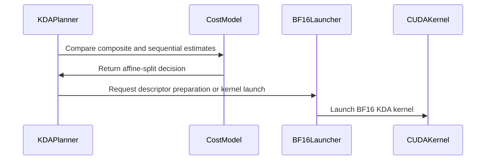

# [PR #5543] feat(cake_kda): dense-beta unbounded coverage, measured affine break-even, sm_103a constants

source: https://github.com/flashinfer-ai/flashinfer/pull/5543
state: open | updated: 2026-09-25T11:52:04Z
labels: run-ci, op: linear attention

## 正文

## KDA prepared prefill: dense-beta unbounded coverage, measured affine break-even, sm_103a constants

Follow-up to #5452 (merged as 71f724405): same program families plus the four dense-beta rows below, a measured affine-split break-even and sm_103a constants. Closes the two follow-ups left open there. A second round added a cheaper plan-cache hit path and 256-token affine windows (section 3).

### 1. Dense H12 beta on the unbounded softplus gate was unexported

A contiguous `[tokens, 12]` beta (token stride 12) selects the pair-packed beta TensorMap. Only bounded-gate programs existed for it, so an unbounded caller with a dense beta raised `NotImplementedError: Unexported KDA schedule specialization` on SM100 and SM103. The registry now carries the unbounded pair-packed variants (sequential body, FP32 checkpoint rows, and the affine slab parts) for both arches, resolved from four new fixture rows (2048, 8192, 8128+64, 4096 without checkpoints) and validated bitwise against the source (359/359 rows per arch, see below).

New test: `tests/kda/test_kda_prefill_plan_cache.py::test_dense_h12_beta_matches_the_strided_carrier_on_the_unbounded_gate` compares the dense and strided layouts bitwise on the sequential body and on the affine split.

### 2. Affine split break-even is now a measured cost model

The packed-call gate compared the longest member against a fixed 256-chunk threshold, so an 8128-token member (254 chunks) ran the sequential body (B200: 1.03 ms vs 0.42 ms composite; unbounded 2×(8128+64) was 0.76–0.87x of Triton) while bounded H16 2×8192 took the split and lost (0.62 vs 0.47 ms).

`cake_kda_tf32_runtime.py` now estimates both routes from a per-arch, per-gate linear model fitted on forced-split / forced-sequential grids (profiler GPU time, plan-cache hits) and splits iff the composite is cheaper:

| arch | gate | composite (us) | sequential (us) |
|---|---|---|---|
| SM100 (B200) | unbounded softplus, FP32 rows | 75 + 14.2 × max chunks per window | 20 + 4.0 × longest chunks |
| SM100 | bounded | 84 + 8.8 × | 16 + 1.75 × |
| SM103 (GB300) | unbounded softplus, FP32 rows | 95 + 11.7 × | 18 + 3.6 × |
| SM103 | bounded | 83 + 7.8 × | 14 + 1.66 × |

Windows: one CTA wave (`sm_count // heads` windows) shared by greedy LPT, at least 8 chunks (256 tokens) each so every launch stays on an exported slab specialization. `FLASHINFER_KDA_AFFINE_POLICY=legacy` restores the previous thresholds.

### 3. Plan-cache hit path and window floor (round 2 of this PR)

The bench rows that lost on CUDA-event time only (GPU ratio above 1) carried ~90 us of host work per plan-cache hit: `KDAPrefillPlanCache.get` re-derived the structural signature and re-pointed all 45 views / 14 TMA descriptors of the affine composite on every call. Four changes in `kda_prefill.py` / `cake_kda_tf32_runtime.py`, all host-side and bitwise-neutral:

- `get` records the address-level facts (`data_ptr`, shape, stride, dtype) of the tensors an entry is bound to (at `put` and after each rebind). A repeat call with identical facts and scalars returns the prepared launch without any rebind (`fast_hits`); a call where only some inputs moved (serving allocates the output and the int32 state indices per call) re-points only those inputs' views and descriptors.
- Signature and facts come from one pass over the inputs (`rebind_signature_and_facts`).
- The parts of the affine composite launch inside the composite's stream context, and the int64 copy of the state indices follows the first chain kernel instead of preceding it.
- `AFFINE_MIN_CHUNKS_PER_WINDOW` 16 → 8 (256-token windows). The 359-row re-export on both arches added no program variant, i.e. the 256..511-token launch class was already exported; only the < 256-token class is not. `FLASHINFER_KDA_AFFINE_WINDOW_WAVES` (default 1) exposes the resident-window budget for A/B; two waves measured slower on every bench_tb shape.

Composite hit cost (B200, cProfile, 200 hits): 89–92 us → 52–55 us; the composite's event time drops 55–70 us per call. Serving-style repeats (fresh output tensor per call) take the partial-rebind path; exact repeats (static buffers, CUDA-graph replay) take the memo path. Tests: `test_repeat_call_on_unchanged_tensors_skips_the_rebind_and_stays_bitwise`, `test_hit_with_a_fresh_output_only_repoints_the_output_and_stays_bitwise`.

### Speedup vs Triton (bench_tb, same GPU, same inputs, FP32 state, rows every 64)

Same harness as #5452 (serving-adapter layer call of the prepared export vs the Triton `chunk_kda` path, fresh identically seeded inputs per arm, FP32 state pool, checkpoint rows every 64 tokens; GPU time = profiler CUDA activity per call, event = CUDA-event wall around the layer call). Numbers are from the final branch head. Rows below 1 are marked; they are the unbounded-gate two-sequence long packs, where the affine composite runs three near-equal chain passes (two of the three rows per arch are within 1–3 % on event time with GPU ratios of 1.05–1.14x; the third takes the sequential body and also loses on GPU time); every K3-shape bounded row and every wrapper row is above 1 on both arches.

**B200 (SM100, 148 SMs), one lane per GPU — K3 shape, bounded lb=-5, H12, layer** (Triton / prepared ms; speedup = Triton ÷ prepared)

| case | GPU Triton | GPU prepared | GPU x | event Triton | event prepared | event x | out relL2 | state relL2 |
|---|---:|---:|---:|---:|---:|---:|---:|---:|
| 8192 | 0.597 | 0.278 | 2.15x | 0.727 | 0.513 | 1.42x | 0.0052 | 0.0036 |
| 16384 | 1.134 | 0.461 | 2.46x | 1.262 | 0.759 | 1.66x | 0.0052 | 0.0041 |
| 2x8192 | 0.833 | 0.462 | 1.80x | 0.959 | 0.718 | 1.34x | 0.0052 | 0.0042 |
| 3000+13384 | 1.031 | 0.487 | 2.12x | 1.155 | 0.786 | 1.47x | 0.0052 | 0.0041 |
| 4x4096 | 0.694 | 0.241 | 2.88x | 0.819 | 0.494 | 1.66x | 0.0052 | 0.0039 |
| 2x(8128+64) | 0.836 | 0.458 | 1.82x | 0.964 | 0.718 | 1.34x | 0.0052 | 0.0042 |
| 8x(1024+64) | 0.372 | 0.123 | 3.02x | 0.514 | 0.327 | 1.57x | 0.0041 | 0.0017 |
| 32768 | 2.240 | 0.808 | 2.77x | 2.371 | 1.240 | 1.91x | 0.0052 | 0.0043 |

**B200 (SM100, 148 SMs), one lane per GPU — K3 shape, bounded lb=-5, H16, layer** (Triton / prepared ms; speedup = Triton ÷ prepared)

| case | GPU Triton | GPU prepared | GPU x | event Triton | event prepared | event x | out relL2 | state relL2 |
|---|---:|---:|---:|---:|---:|---:|---:|---:|
| 8192 | 0.640 | 0.342 | 1.87x | 0.762 | 0.595 | 1.28x | 0.0052 | 0.0038 |
| 16384 | 1.246 | 0.573 | 2.18x | 1.367 | 0.916 | 1.49x | 0.0052 | 0.0040 |
| 2x8192 | 0.948 | 0.464 | 2.04x | 1.068 | 0.759 | 1.41x | 0.0052 | 0.0039 |
| 3000+13384 | 1.144 | 0.587 | 1.95x | 1.263 | 0.947 | 1.33x | 0.0052 | 0.0038 |
| 4x4096 | 0.809 | 0.247 | 3.27x | 0.926 | 0.539 | 1.72x | 0.0052 | 0.0040 |
| 2x(8128+64) | 0.956 | 0.461 | 2.07x | 1.073 | 0.757 | 1.42x | 0.0052 | 0.0039 |
| 8x(1024+64) | 0.442 | 0.111 | 3.99x | 0.577 | 0.340 | 1.70x | 0.0052 | 0.0040 |
| 32768 | 2.423 | 1.031 | 2.35x | 2.560 | 1.550 | 1.65x | 0.0052 | 0.0041 |

**B200 (SM100, 148 SMs), one lane per GPU — Kimi-Linear shape, unbounded, H12, layer** (Triton / prepared ms; speedup = Triton ÷ prepared)

| case | GPU Triton | GPU prepared | GPU x | event Triton | event prepared | event x | out relL2 | state relL2 |
|---|---:|---:|---:|---:|---:|---:|---:|---:|
| 8192 | 0.604 | 0.390 | 1.55x | 0.726 | 0.583 | 1.24x | 0.0040 | 0.0022 |
| 16384 | 1.146 | 0.678 | 1.69x | 1.266 | 0.874 | 1.45x | 0.0040 | 0.0019 |
| 2x8192 | 0.845 | 0.677 | 1.25x | 0.962 | 0.873 | 1.10x | 0.0040 | 0.0019 |
| 3000+13384 | 1.039 | 0.728 | 1.43x | 1.155 | 0.923 | 1.25x | 0.0040 | 0.0024 |
| 4x4096 | 0.706 | 0.538 | 1.31x | 0.819 | 0.672 | 1.22x | 0.0040 | 0.0020 |
| 2x(8128+64) | 0.849 | 0.771 | 1.10x | 0.965 | 0.970 | 0.99x **<1** | 0.0040 | 0.0020 |
| 8x(1024+64) | 0.378 | 0.171 | 2.21x | 0.512 | 0.305 | 1.68x | 0.0039 | 0.0020 |
| 32768 | 2.262 | 1.235 | 1.83x | 2.390 | 1.435 | 1.67x | 0.0040 | 0.0021 |

**B200 (SM100, 148 SMs), one lane per GPU — Kimi-Linear shape, unbounded, H16, layer** (Triton / prepared ms; speedup = Triton ÷ prepared)

| case | GPU Triton | GPU prepared | GPU x | event Triton | event prepared | event x | out relL2 | state relL2 |
|---|---:|---:|---:|---:|---:|---:|---:|---:|
| 8192 | 0.648 | 0.492 | 1.32x | 0.769 | 0.689 | 1.12x | 0.0040 | 0.0020 |
| 16384 | 1.261 | 0.860 | 1.47x | 1.386 | 1.056 | 1.31x | 0.0040 | 0.0021 |
| 2x8192 | 0.964 | 0.919 | 1.05x | 1.087 | 1.122 | 0.97x **<1** | 0.0040 | 0.0021 |
| 3000+13384 | 1.163 | 0.883 | 1.32x | 1.287 | 1.083 | 1.19x | 0.0040 | 0.0025 |
| 4x4096 | 0.823 | 0.548 | 1.50x | 0.945 | 0.699 | 1.35x | 0.0040 | 0.0022 |
| 2x(8128+64) | 0.973 | 1.065 | 0.91x | 1.097 | 1.205 | 0.91x **<1** | 0.0040 | 0.0021 |
| 8x(1024+64) | 0.451 | 0.171 | 2.64x | 0.586 | 0.304 | 1.93x | 0.0040 | 0.0021 |
| 32768 | 2.457 | 1.596 | 1.54x | 2.599 | 1.792 | 1.45x | 0.0040 | 0.0021 |

**B200 (SM100, 148 SMs), one lane per GPU — K3 shape, bounded lb=-5, H12, wrapper** (Triton / prepared ms; speedup = Triton ÷ prepared)

| case | GPU Triton | GPU prepared | GPU x | event Triton | event prepared | event x | out relL2 | state relL2 |
|---|---:|---:|---:|---:|---:|---:|---:|---:|
| BS4 x T64 | 0.054 | 0.015 | 3.72x | 0.247 | 0.157 | 1.57x | 0.0053 | 0.0039 |
| BS16 x T64 | 0.079 | 0.035 | 2.28x | 0.280 | 0.186 | 1.51x | 0.0040 | 0.0017 |
| BS64 x T64 | 0.205 | 0.102 | 2.01x | 0.396 | 0.279 | 1.42x | 0.0040 | 0.0017 |
| BS16 x T128 | 0.114 | 0.045 | 2.54x | 0.368 | 0.198 | 1.86x | 0.0053 | 0.0040 |
| BS16 x T256 | 0.185 | 0.068 | 2.70x | 0.379 | 0.233 | 1.62x | 0.0052 | 0.0039 |
| BS16 x T(17..255) | 0.114 | 0.037 | 3.11x | 0.367 | 0.191 | 1.93x | 0.0052 | 0.0040 |

**B200 (SM100, 148 SMs), one lane per GPU — K3 shape, bounded lb=-5, H16, wrapper** (Triton / prepared ms; speedup = Triton ÷ prepared)

| case | GPU Triton | GPU prepared | GPU x | event Triton | event prepared | event x | out relL2 | state relL2 |
|---|---:|---:|---:|---:|---:|---:|---:|---:|
| BS4 x T64 | 0.054 | 0.015 | 3.60x | 0.242 | 0.159 | 1.52x | 0.0053 | 0.0040 |
| BS16 x T64 | 0.086 | 0.033 | 2.64x | 0.277 | 0.189 | 1.46x | 0.0053 | 0.0040 |
| BS64 x T64 | 0.245 | 0.114 | 2.15x | 0.415 | 0.300 | 1.38x | 0.0052 | 0.0040 |
| BS16 x T128 | 0.133 | 0.047 | 2.81x | 0.362 | 0.204 | 1.77x | 0.0052 | 0.0040 |
| BS16 x T256 | 0.221 | 0.071 | 3.12x | 0.392 | 0.249 | 1.58x | 0.0052 | 0.0040 |
| BS16 x T(17..255) | 0.133 | 0.049 | 2.70x | 0.359 | 0.206 | 1.74x | 0.0052 | 0.0040 |

**B200 (SM100, 148 SMs), one lane per GPU — Kimi-Linear shape, unbounded, H12, wrapper** (Triton / prepared ms; speedup = Triton ÷ prepared)

| case | GPU Triton | GPU prepared | GPU x | event Triton | event prepared | event x | out relL2 | state relL2 |
|---|---:|---:|---:|---:|---:|---:|---:|---:|
| BS4 x T64 | 0.055 | 0.024 | 2.25x | 0.247 | 0.165 | 1.50x | 0.0040 | 0.0021 |
| BS16 x T64 | 0.081 | 0.044 | 1.86x | 0.287 | 0.182 | 1.58x | 0.0039 | 0.0020 |
| BS64 x T64 | 0.212 | 0.128 | 1.65x | 0.406 | 0.274 | 1.48x | 0.0039 | 0.0020 |
| BS16 x T128 | 0.117 | 0.059 | 1.97x | 0.372 | 0.201 | 1.85x | 0.0040 | 0.0021 |
| BS16 x T256 | 0.193 | 0.097 | 1.99x | 0.393 | 0.231 | 1.70x | 0.0039 | 0.0020 |
| BS16 x T(17..255) | 0.119 | 0.051 | 2.34x | 0.370 | 0.193 | 1.92x | 0.0040 | 0.0023 |

**B200 (SM100, 148 SMs), one lane per GPU — Kimi-Linear shape, unbounded, H16, wrapper** (Triton / prepared ms; speedup = Triton ÷ prepared)

| case | GPU Triton | GPU prepared | GPU x | event Triton | event prepared | event x | out relL2 | state relL2 |
|---|---:|---:|---:|---:|---:|---:|---:|---:|
| BS4 x T64 | 0.055 | 0.024 | 2.23x | 0.249 | 0.168 | 1.48x | 0.0040 | 0.0021 |
| BS16 x T64 | 0.089 | 0.045 | 1.98x | 0.281 | 0.183 | 1.54x | 0.0040 | 0.0020 |
| BS64 x T64 | 0.253 | 0.155 | 1.64x | 0.416 | 0.295 | 1.41x | 0.0040 | 0.0021 |
| BS16 x T128 | 0.136 | 0.061 | 2.23x | 0.379 | 0.198 | 1.91x | 0.0039 | 0.0021 |
| BS16 x T256 | 0.230 | 0.100 | 2.29x | 0.399 | 0.236 | 1.69x | 0.0040 | 0.0021 |
| BS16 x T(17..255) | 0.138 | 0.066 | 2.09x | 0.367 | 0.203 | 1.81x | 0.0039 | 0.0023 |

B200: 56 rows, 53 above 1 on both metrics.

**GB300 (SM103, 152 SMs), one lane per GPU — K3 shape, bounded lb=-5, H12, layer** (Triton / prepared ms; speedup = Triton ÷ prepared)

| case | GPU Triton | GPU prepared | GPU x | event Triton | event prepared | event x | out relL2 | state relL2 |
|---|---:|---:|---:|---:|---:|---:|---:|---:|
| 8192 | 0.561 | 0.256 | 2.19x | 0.730 | 0.572 | 1.28x | 0.0052 | 0.0041 |
| 16384 | 1.055 | 0.426 | 2.48x | 1.255 | 0.809 | 1.55x | 0.0052 | 0.0037 |
| 2x8192 | 0.772 | 0.425 | 1.82x | 0.973 | 0.801 | 1.22x | 0.0052 | 0.0039 |
| 3000+13384 | 0.957 | 0.451 | 2.12x | 1.158 | 0.832 | 1.39x | 0.0052 | 0.0039 |
| 4x4096 | 0.636 | 0.225 | 2.82x | 0.832 | 0.532 | 1.57x | 0.0052 | 0.0039 |
| 2x(8128+64) | 0.770 | 0.434 | 1.77x | 0.963 | 0.759 | 1.27x | 0.0052 | 0.0039 |
| 8x(1024+64) | 0.338 | 0.110 | 3.07x | 0.545 | 0.380 | 1.43x | 0.0040 | 0.0016 |
| 32768 | 2.084 | 0.755 | 2.76x | 2.255 | 1.276 | 1.77x | 0.0052 | 0.0034 |

**GB300 (SM103, 152 SMs), one lane per GPU — K3 shape, bounded lb=-5, H16, layer** (Triton / prepared ms; speedup = Triton ÷ prepared)

| case | GPU Triton | GPU prepared | GPU x | event Triton | event prepared | event x | out relL2 | state relL2 |
|---|---:|---:|---:|---:|---:|---:|---:|---:|
| 8192 | 0.609 | 0.314 | 1.94x | 0.774 | 0.651 | 1.19x | 0.0052 | 0.0040 |
| 16384 | 1.187 | 0.531 | 2.24x | 1.383 | 0.937 | 1.48x | 0.0052 | 0.0040 |
| 2x8192 | 0.901 | 0.438 | 2.06x | 1.090 | 0.811 | 1.34x | 0.0052 | 0.0041 |
| 3000+13384 | 1.089 | 0.543 | 2.01x | 1.276 | 0.962 | 1.33x | 0.0052 | 0.0038 |
| 4x4096 | 0.764 | 0.226 | 3.38x | 0.956 | 0.609 | 1.57x | 0.0052 | 0.0040 |
| 2x(8128+64) | 0.906 | 0.437 | 2.07x | 1.096 | 0.814 | 1.35x | 0.0052 | 0.0040 |
| 8x(1024+64) | 0.416 | 0.092 | 4.51x | 0.618 | 0.392 | 1.58x | 0.0052 | 0.0040 |
| 32768 | 2.315 | 0.962 | 2.41x | 2.490 | 1.543 | 1.61x | 0.0052 | 0.0042 |

**GB300 (SM103, 152 SMs), one lane per GPU — Kimi-Linear shape, unbounded, H12, layer** (Triton / prepared ms; speedup = Triton ÷ prepared)

| case | GPU Triton | GPU prepared | GPU x | event Triton | event prepared | event x | out relL2 | state relL2 |
|---|---:|---:|---:|---:|---:|---:|---:|---:|
| 8192 | 0.566 | 0.348 | 1.63x | 0.731 | 0.635 | 1.15x | 0.0040 | 0.0020 |
| 16384 | 1.068 | 0.610 | 1.75x | 1.266 | 0.910 | 1.39x | 0.0040 | 0.0020 |
| 2x8192 | 0.781 | 0.609 | 1.28x | 0.965 | 0.904 | 1.07x | 0.0040 | 0.0019 |
| 3000+13384 | 0.967 | 0.653 | 1.48x | 1.161 | 0.947 | 1.23x | 0.0040 | 0.0024 |
| 4x4096 | 0.646 | 0.484 | 1.33x | 0.925 | 0.695 | 1.33x | 0.0040 | 0.0021 |
| 2x(8128+64) | 0.782 | 0.689 | 1.14x | 0.963 | 0.979 | 0.98x **<1** | 0.0040 | 0.0020 |
| 8x(1024+64) | 0.344 | 0.148 | 2.32x | 0.543 | 0.371 | 1.46x | 0.0040 | 0.0020 |
| 32768 | 2.102 | 1.107 | 1.90x | 2.273 | 1.401 | 1.62x | 0.0040 | 0.0022 |

**GB300 (SM103, 152 SMs), one lane per GPU — Kimi-Linear shape, unbounded, H16, layer** (Triton / prepared ms; speedup = Triton ÷ prepared)

| case | GPU Triton | GPU prepared | GPU x | event Triton | event prepared | event x | out relL2 | state relL2 |
|---|---:|---:|---:|---:|---:|---:|---:|---:|
| 8192 | 0.618 | 0.439 | 1.41x | 0.772 | 0.727 | 1.06x | 0.0040 | 0.0021 |
| 16384 | 1.202 | 0.767 | 1.57x | 1.366 | 1.051 | 1.30x | 0.0040 | 0.0020 |
| 2x8192 | 0.915 | 0.820 | 1.12x | 1.092 | 1.111 | 0.98x **<1** | 0.0040 | 0.0021 |
| 3000+13384 | 1.103 | 0.789 | 1.40x | 1.277 | 1.083 | 1.18x | 0.0039 | 0.0022 |
| 4x4096 | 0.779 | 0.498 | 1.56x | 0.952 | 0.728 | 1.31x | 0.0040 | 0.0021 |
| 2x(8128+64) | 0.921 | 0.983 | 0.94x | 1.105 | 1.212 | 0.91x **<1** | 0.0040 | 0.0021 |
| 8x(1024+64) | 0.425 | 0.149 | 2.85x | 0.620 | 0.368 | 1.68x | 0.0040 | 0.0021 |
| 32768 | 2.343 | 1.415 | 1.66x | 2.517 | 1.708 | 1.47x | 0.0040 | 0.0023 |

**GB300 (SM103, 152 SMs), one lane per GPU — K3 shape, bounded lb=-5, H12, wrapper** (Triton / prepared ms; speedup = Triton ÷ prepared)

| case | GPU Triton | GPU prepared | GPU x | event Triton | event prepared | event x | out relL2 | state relL2 |
|---|---:|---:|---:|---:|---:|---:|---:|---:|
| BS4 x T64 | 0.050 | 0.013 | 3.89x | 0.314 | 0.294 | 1.07x | 0.0053 | 0.0040 |
| BS16 x T64 | 0.073 | 0.031 | 2.33x | 0.396 | 0.281 | 1.41x | 0.0041 | 0.0017 |
| BS64 x T64 | 0.188 | 0.094 | 2.00x | 0.508 | 0.463 | 1.10x | 0.0041 | 0.0017 |
| BS16 x T128 | 0.104 | 0.040 | 2.58x | 0.643 | 0.273 | 2.36x | 0.0053 | 0.0040 |
| BS16 x T256 | 0.167 | 0.062 | 2.70x | 0.480 | 0.298 | 1.61x | 0.0052 | 0.0040 |
| BS16 x T(17..255) | 0.105 | 0.032 | 3.24x | 0.477 | 0.278 | 1.72x | 0.0052 | 0.0041 |

**GB300 (SM103, 152 SMs), one lane per GPU — K3 shape, bounded lb=-5, H16, wrapper** (Triton / prepared ms; speedup = Triton ÷ prepared)

| case | GPU Triton | GPU prepared | GPU x | event Triton | event prepared | event x | out relL2 | state relL2 |
|---|---:|---:|---:|---:|---:|---:|---:|---:|
| BS4 x T64 | 0.052 | 0.013 | 3.91x | 0.304 | 0.247 | 1.23x | 0.0053 | 0.0040 |
| BS16 x T64 | 0.075 | 0.029 | 2.58x | 0.385 | 0.269 | 1.43x | 0.0053 | 0.0040 |
| BS64 x T64 | 0.232 | 0.104 | 2.24x | 0.502 | 0.376 | 1.33x | 0.0052 | 0.0040 |
| BS16 x T128 | 0.124 | 0.042 | 2.95x | 0.492 | 0.280 | 1.76x | 0.0052 | 0.0040 |
| BS16 x T256 | 0.210 | 0.064 | 3.27x | 0.465 | 0.320 | 1.45x | 0.0052 | 0.0039 |
| BS16 x T(17..255) | 0.125 | 0.044 | 2.86x | 0.487 | 0.286 | 1.70x | 0.0052 | 0.0040 |

**GB300 (SM103, 152 SMs), one lane per GPU — Kimi-Linear shape, unbounded, H12, wrapper** (Triton / prepared ms; speedup = Triton ÷ prepared)

| case | GPU Triton | GPU prepared | GPU x | event Triton | event prepared | event x | out relL2 | state relL2 |
|---|---:|---:|---:|---:|---:|---:|---:|---:|
| BS4 x T64 | 0.050 | 0.021 | 2.38x | 0.306 | 0.281 | 1.09x | 0.0039 | 0.0020 |
| BS16 x T64 | 0.074 | 0.039 | 1.90x | 0.400 | 0.256 | 1.56x | 0.0040 | 0.0020 |
| BS64 x T64 | 0.192 | 0.114 | 1.68x | 0.690 | 0.387 | 1.78x | 0.0039 | 0.0020 |
| BS16 x T128 | 0.107 | 0.053 | 2.02x | 0.591 | 0.289 | 2.04x | 0.0040 | 0.0021 |
| BS16 x T256 | 0.177 | 0.086 | 2.04x | 0.534 | 0.315 | 1.69x | 0.0039 | 0.0020 |
| BS16 x T(17..255) | 0.109 | 0.046 | 2.38x | 0.501 | 0.265 | 1.89x | 0.0040 | 0.0023 |

**GB300 (SM103, 152 SMs), one lane per GPU — Kimi-Linear shape, unbounded, H16, wrapper** (Triton / prepared ms; speedup = Triton ÷ prepared)

| case | GPU Triton | GPU prepared | GPU x | event Triton | event prepared | event x | out relL2 | state relL2 |
|---|---:|---:|---:|---:|---:|---:|---:|---:|
| BS4 x T64 | 0.053 | 0.021 | 2.46x | 0.292 | 0.279 | 1.05x | 0.0040 | 0.0021 |
| BS16 x T64 | 0.076 | 0.040 | 1.90x | 0.387 | 0.258 | 1.50x | 0.0040 | 0.0020 |
| BS64 x T64 | 0.232 | 0.139 | 1.67x | 0.524 | 0.367 | 1.43x | 0.0039 | 0.0021 |
| BS16 x T128 | 0.125 | 0.054 | 2.30x | 0.493 | 0.274 | 1.80x | 0.0040 | 0.0020 |
| BS16 x T256 | 0.210 | 0.090 | 2.35x | 0.484 | 0.304 | 1.60x | 0.0040 | 0.0021 |
| BS16 x T(17..255) | 0.126 | 0.059 | 2.14x | 0.473 | 0.274 | 1.73x | 0.0040 | 0.0022 |

GB300: 56 rows, 53 above 1 on both metrics.

### Window floor
Windows are planned with at least 8 chunks (256 tokens); every planned launch maps onto an exported program (the 359-row export confirms no variant is missing for this class). On the 4-head 8192-token single-sequence benchmark in the source harness this restores the 32 × 8-chunk plan: GB300 0.1708 ms vs 0.1724 ms on the merge-base (the first round of this PR had 0.2229 ms with 16-chunk windows); B200 0.1847 ms vs 0.2399 ms in the first round.

### Validation

Source-vs-export validation of the regenerated programs (all 359 inventory rows per arch (350 of the first round plus nine 256-token-window rows), fixed inputs, bitwise compare of output / final state / checkpoint rows against the source implementation, plus the paired latency ratio):

| arch | rows measured | errors | bitwise | export/source latency (median / max) | unbounded rows bitwise |
|---|---:|---:|---:|---|---|
| SM100 (B200) | 359 | 0 | 359 | 0.999 / 1.038 | 14/14 (incl. the 4 dense-beta rows) |
| SM103 (GB300) | 359 | 0 | 359 | 0.999 / 1.028 | 14/14 (incl. the 4 dense-beta rows) |

`tests/kda/test_kda_prefill_plan_cache.py`, `test_bf16_one_wave_route.py`, `test_tf32_prefill.py` on the merged trees: SM100 69 passed (the new dense-beta test 4/4; it failed 4/4 against the previous export), SM103 69 passed; on the final branch head (both exports): SM100 70 passed, SM103 70 passed.

🤖 Generated with [Claude Code](https://claude.com/claude-code)

## 评论 (13)

### yyihuang · 2026-09-25

/bot run tests/kda/test_kda_prefill_plan_cache.py tests/kda/test_bf16_one_wave_route.py tests/kda/test_tf32_prefill.py

### yyihuang · 2026-09-25

@flashinfer-bot run tests/kda/test_kda_prefill_plan_cache.py tests/kda/test_bf16_one_wave_route.py tests/kda/test_tf32_prefill.py

### coderabbitai[bot] · 2026-09-25

<!-- This is an auto-generated comment: summarize by coderabbit.ai -->
<!-- review_stack_entry_start -->

Navigate logical layers of code changes, visualize relationships, and explore their blast radius.

<!-- review_stack_entry_end -->
<!-- This is an auto-generated comment: skip review by coderabbit.ai -->

> [!IMPORTANT]
> ## Review skipped
> 
> Review was skipped as selected files did not have any reviewable changes.
> 
> 

> 
💤 Files selected but had no reviewable changes (6)

> 
> * csrc/kda/cake_kda_affine_epilogue.cu
> * flashinfer/cake_kda_tf32_runtime.py
> * flashinfer/jit/cake_kda_affine_epilogue.py
> * flashinfer/jit/cake_kda_tf32.py
> * flashinfer/kda_prefill.py
> * tests/kda/test_kda_prefill_plan_cache.py
> 
> 

> 
> 
> 
> 

> 
⚙️ Run configuration

> 
> **Configuration used**: defaults
> 
> **Review profile**: CHILL
> 
> **Plan**: Advanced
> 
> **Run ID**: `00f4565d-0ddf-4c84-a2da-6af94c073db1`
> 
> 

> 
> 

> 
📥 Commits

> 
> Reviewing files that changed from the base of the PR and between 1fd37d513027c6cce60dde67340398fad625d405 and 8c660e48760fdd990ef9fbe56fbabee3bd827466.
> 
> 

> 
> 

> 
📒 Files selected for processing (6)

> 
> * `csrc/kda/cake_kda_affine_epilogue.cu`
> * `flashinfer/cake_kda_tf32_runtime.py`
> * `flashinfer/jit/cake_kda_affine_epilogue.py`
> * `flashinfer/jit/cake_kda_tf32.py`
> * `flashinfer/kda_prefill.py`
> * `tests/kda/test_kda_prefill_plan_cache.py`
> 
> 

> 
> You can disable this status message by setting the `reviews.review_status` to `false` in the CodeRabbit configuration file.
> 
> Use the checkbox below for a quick retry:
> - [ ] <!-- {"checkboxId":"e9bb8d72-00e8-4f67-9cb2-caf3b22574fe"} --> 🔍 Trigger review

<!-- end of auto-generated comment: skip review by coderabbit.ai -->

<!-- recent_review_start -->

No actionable comments were generated in the recent review. 🎉

ℹ️ Recent review info

⚙️ Run configuration

**Configuration used**: defaults

**Review profile**: CHILL

**Plan**: Advanced

**Run ID**: `50dd031b-c425-4abf-a8ca-d641b7352d84`

📥 Commits

Reviewing files that changed from the base of the PR and between dc5b19bb74084a9829ca204d7da5930a36bd01a4 and 88f1d92a644f6f3f85af9e32355b52bd4fdb9857.

📒 Files selected for processing (174)

* `csrc/kda/bf16/cake_kda_bf16_0456f616c7428b1eba2183d0967aa1c6b6f85686351fce1321958243354d15fe_binding.cu`
* `csrc/kda/bf16/cake_kda_bf16_0456f616c7428b1eba2183d0967aa1c6b6f85686351fce1321958243354d15fe_kernel.cu`
* `csrc/kda/bf16/cake_kda_bf16_08733bb2c7fb5a35854ddd9aeb8dfb1307cb31e0a8d7425220c0655bb1457f2d_binding.cu`
* `csrc/kda/bf16/cake_kda_bf16_08733bb2c7fb5a35854ddd9aeb8dfb1307cb31e0a8d7425220c0655bb1457f2d_kernel.cu`
* `csrc/kda/bf16/cake_kda_bf16_13be0c565cac27113351116167346ad1efbf2fa4af6321dc6e4718aef7f0a842_binding.cu`
* `csrc/kda/bf16/cake_kda_bf16_13be0c565cac27113351116167346ad1efbf2fa4af6321dc6e4718aef7f0a842_kernel.cu`
* `csrc/kda/bf16/cake_kda_bf16_1cb892d1479faaafc5c9e70cfe92b365b72fb85c6229e8d092be878d8281de61_binding.cu`
* `csrc/kda/bf16/cake_kda_bf16_1cb892d1479faaafc5c9e70cfe92b365b72fb85c6229e8d092be878d8281de61_kernel.cu`
* `csrc/kda/bf16/cake_kda_bf16_2060f799f56301e3f0ee62bb3b7a561e9c32421453978373ad6b1c7cb1e4622c_binding.cu`
* `csrc/kda/bf16/cake_kda_bf16_2060f799f56301e3f0ee62bb3b7a561e9c32421453978373ad6b1c7cb1e4622c_kernel.cu`
* `csrc/kda/bf16/cake_kda_bf16_274c21599ee3d0a7c4e1fef84d8bbc41d710bc6d8ac3ed0758927c4921b47dc0_binding.cu`
* `csrc/kda/bf16/cake_kda_bf16_274c21599ee3d0a7c4e1fef84d8bbc41d710bc6d8ac3ed0758927c4921b47dc0_kernel.cu`
* `csrc/kda/bf16/cake_kda_bf16_2b0bffc8b16a4481de19cbd13f8e12a036585b003c9678609ddba575e4c0e4c3_kernel.cu`
* `csrc/kda/bf16/cake_kda_bf16_2b7c21e4153c68d6ec2881e400e93795b497bc5a16b5444b2f16943ff0782e63_binding.cu`
* `csrc/kda/bf16/cake_kda_bf16_2b7c21e4153c68d6ec2881e400e93795b497bc5a16b5444b2f16943ff0782e63_kernel.cu`
* `csrc/kda/bf16/cake_kda_bf16_2c1ab6924a06a903c9527fc2a813be02453bb8cb9474828e5f31ab4a0dd3fe82_binding.cu`
* `csrc/kda/bf16/cake_kda_bf16_2c1ab6924a06a903c9527fc2a813be02453bb8cb9474828e5f31ab4a0dd3fe82_kernel.cu`
* `csrc/kda/bf16/cake_kda_bf16_2d657c38da52dd2e2d1390b97be85df7eb4f1f2eaa769e687e006a2cc4d2f8e5_binding.cu`
* `csrc/kda/bf16/cake_kda_bf16_2d657c38da52dd2e2d1390b97be85df7eb4f1f2eaa769e687e006a2cc4d2f8e5_kernel.cu`
* `csrc/kda/bf16/cake_kda_bf16_2fe28ac8099226d0a6d982f693cd822c799cf0cd511c29785945c40e16690fe0_binding.cu`
* `csrc/kda/bf16/cake_kda_bf16_2fe28ac8099226d0a6d982f693cd822c799cf0cd511c29785945c40e16690fe0_kernel.cu`
* `csrc/kda/bf16/cake_kda_bf16_3165ba99d92124bc2d8c35061380566420ae5c0a689d8b85f0a75b3f29e92dcb_binding.cu`
* `csrc/kda/bf16/cake_kda_bf16_3165ba99d92124bc2d8c35061380566420ae5c0a689d8b85f0a75b3f29e92dcb_kernel.cu`
* `csrc/kda/bf16/cake_kda_bf16_33b749140d261bb4c40acef112776ebebb5bcf27f6febd3ef2d6dc23bf9b6fcf_binding.cu`
* `csrc/kda/bf16/cake_kda_bf16_33b749140d261bb4c40acef112776ebebb5bcf27f6febd3ef2d6dc23bf9b6fcf_kernel.cu`
* `csrc/kda/bf16/cake_kda_bf16_356abe33dd88ff9550e19dbad99efa1196c2663dacd194cca983605708e7aeb1_binding.cu`
* `csrc/kda/bf16/cake_kda_bf16_356abe33dd88ff9550e19dbad99efa1196c2663dacd194cca983605708e7aeb1_kernel.cu`
* `csrc/kda/bf16/cake_kda_bf16_359a8214d08e7ff172f8eb69e7065d676e02f5d8ec22eafd61fdd082d4018ccb_binding.cu`
* `csrc/kda/bf16/cake_kda_bf16_359a8214d08e7ff172f8eb69e7065d676e02f5d8ec22eafd61fdd082d4018ccb_kernel.cu`
* `csrc/kda/bf16/cake_kda_bf16_364b519b02a91947dde0867bfea35f1fae4a1455d742ff28c7a094c5369317c4_binding.cu`
* `csrc/kda/bf16/cake_kda_bf16_364b519b02a91947dde0867bfea35f1fae4a1455d742ff28c7a094c5369317c4_kernel.cu`
* `csrc/kda/bf16/cake_kda_bf16_39b8d8352ddbf29b06694347e0bb4640f921820ef86a41f300adedce8cadcbc5_binding.cu`
* `csrc/kda/bf16/cake_kda_bf16_39b8d8352ddbf29b06694347e0bb4640f921820ef86a41f300adedce8cadcbc5_kernel.cu`
* `csrc/kda/bf16/cake_kda_bf16_3a32bf3870b190d49fc6ce556d4a832b3324e70bb7c35b03a2eb9100a94cd5fc_binding.cu`
* `csrc/kda/bf16/cake_kda_bf16_3a32bf3870b190d49fc6ce556d4a832b3324e70bb7c35b03a2eb9100a94cd5fc_kernel.cu`
* `csrc/kda/bf16/cake_kda_bf16_3c50169baf163a9385c9557d7b795cf6a5a3168bd1b130e5634c4436e1c64484_binding.cu`
* `csrc/kda/bf16/cake_kda_bf16_3c50169baf163a9385c9557d7b795cf6a5a3168bd1b130e5634c4436e1c64484_kernel.cu`
* `csrc/kda/bf16/cake_kda_bf16_3df657b37cf6dfe3a6627fc95e52a35824bc706176112e5c680e8548f0ebc5d9_binding.cu`
* `csrc/kda/bf16/cake_kda_bf16_3df657b37cf6dfe3a6627fc95e52a35824bc706176112e5c680e8548f0ebc5d9_kernel.cu`
* `csrc/kda/bf16/cake_kda_bf16_3ec8054c1fe770526a5cdc91e4940163219fd480593c30646767b8ad79869f84_binding.cu`
* `csrc/kda/bf16/cake_kda_bf16_3ec8054c1fe770526a5cdc91e4940163219fd480593c30646767b8ad79869f84_kernel.cu`
* `csrc/kda/bf16/cake_kda_bf16_420f685484249fcffc3e38e4befacf1a6e5c3cd6df40789e3dece07a3f40009c_binding.cu`
* `csrc/kda/bf16/cake_kda_bf16_420f685484249fcffc3e38e4befacf1a6e5c3cd6df40789e3dece07a3f40009c_kernel.cu`
* `csrc/kda/bf16/cake_kda_bf16_4293769ebd4faea4b18f34610c04f91a2e48419195ef66717e6631c348bd19a5_binding.cu`
* `csrc/kda/bf16/cake_kda_bf16_4293769ebd4faea4b18f34610c04f91a2e48419195ef66717e6631c348bd19a5_kernel.cu`
* `csrc/kda/bf16/cake_kda_bf16_44fa49b120b82af3f8262ff169adcf5c0d0ce47cf115a39c07874b73e5d95978_kernel.cu`
* `csrc/kda/bf16/cake_kda_bf16_4c11c3d7608667f3d9f7757eb0ad35d3f400a0baf3a289fd008c383a4100d699_binding.cu`
* `csrc/kda/bf16/cake_kda_bf16_4c11c3d7608667f3d9f7757eb0ad35d3f400a0baf3a289fd008c383a4100d699_kernel.cu`
* `csrc/kda/bf16/cake_kda_bf16_4ccd816ccff59306f8416bdc5e909354d8feca0e7db44fab87f00a8d80dfbb76_kernel.cu`
* `csrc/kda/bf16/cake_kda_bf16_4dc654dfacb18cfd36d49950e83683432711e7120cd0636ac4fe3f8398ae51f5_binding.cu`
* `csrc/kda/bf16/cake_kda_bf16_4dc654dfacb18cfd36d49950e83683432711e7120cd0636ac4fe3f8398ae51f5_kernel.cu`
* `csrc/kda/bf16/cake_kda_bf16_50bac42be80987426b40d5aebff5af6fa86b617de5709fbc6e44a747a925ff3e_binding.cu`
* `csrc/kda/bf16/cake_kda_bf16_50bac42be80987426b40d5aebff5af6fa86b617de5709fbc6e44a747a925ff3e_kernel.cu`
* `csrc/kda/bf16/cake_kda_bf16_50bba1059896e14d2074c9392134aeb2f396e582f03537774d633364b4c987bf_binding.cu`
* `csrc/kda/bf16/cake_kda_bf16_50bba1059896e14d2074c9392134aeb2f396e582f03537774d633364b4c987bf_kernel.cu`
* `csrc/kda/bf16/cake_kda_bf16_51c120244322d4f715d98fcffa22405344bc02e2bd712cae6b2ec29f6c8ed815_binding.cu`
* `csrc/kda/bf16/cake_kda_bf16_51c120244322d4f715d98fcffa22405344bc02e2bd712cae6b2ec29f6c8ed815_kernel.cu`
* `csrc/kda/bf16/cake_kda_bf16_5474bcaac740d416f5db391631e10d4f3946d0a0c54f6d9a42e2f11b20fa1455_binding.cu`
* `csrc/kda/bf16/cake_kda_bf16_5474bcaac740d416f5db391631e10d4f3946d0a0c54f6d9a42e2f11b20fa1455_kernel.cu`
* `csrc/kda/bf16/cake_kda_bf16_566c3b2ad95f9466185e6fb92d13d95526dc854737d1517c35f5a36946d094d9_binding.cu`
* `csrc/kda/bf16/cake_kda_bf16_566c3b2ad95f9466185e6fb92d13d95526dc854737d1517c35f5a36946d094d9_kernel.cu`
* `csrc/kda/bf16/cake_kda_bf16_59f7e8cbe880a84027b3c771ea1ef769b90122cb3524acfe068f0203487cd1bd_binding.cu`
* `csrc/kda/bf16/cake_kda_bf16_59f7e8cbe880a84027b3c771ea1ef769b90122cb3524acfe068f0203487cd1bd_kernel.cu`
* `csrc/kda/bf16/cake_kda_bf16_5c95e3c21946e0a2095904e401711eb9e09e51ca11f2df5eeebf8c1355792b30_binding.cu`
* `csrc/kda/bf16/cake_kda_bf16_5c95e3c21946e0a2095904e401711eb9e09e51ca11f2df5eeebf8c1355792b30_kernel.cu`
* `csrc/kda/bf16/cake_kda_bf16_62cff9dbc0bb4f73b7a59bf96baa2a203ff335aec81d8ee0fbd52e0aa48c9abe_binding.cu`
* `csrc/kda/bf16/cake_kda_bf16_62cff9dbc0bb4f73b7a59bf96baa2a203ff335aec81d8ee0fbd52e0aa48c9abe_kernel.cu`
* `csrc/kda/bf16/cake_kda_bf16_6732c9e7a40ca96f9fdf38159c777784751304967587f66302fe69f4a0f3460f_binding.cu`
* `csrc/kda/bf16/cake_kda_bf16_6732c9e7a40ca96f9fdf38159c777784751304967587f66302fe69f4a0f3460f_kernel.cu`
* `csrc/kda/bf16/cake_kda_bf16_6ae9201d8636e6fe2867ddd13720a83a179b8e2922f07a98672f5287041da280_binding.cu`
* `csrc/kda/bf16/cake_kda_bf16_6ae9201d8636e6fe2867ddd13720a83a179b8e2922f07a98672f5287041da280_kernel.cu`
* `csrc/kda/bf16/cake_kda_bf16_6b789c369b814b2338db6f9b81848952c7be9875cd2e840912225e66293a651f_binding.cu`
* `csrc/kda/bf16/cake_kda_bf16_6b789c369b814b2338db6f9b81848952c7be9875cd2e840912225e66293a651f_kernel.cu`
* `csrc/kda/bf16/cake_kda_bf16_6fe2ab2a5ef75b3448ca49f167b0b6482260d4f0c40f287ee48c9081ada3d85b_binding.cu`
* `csrc/kda/bf16/cake_kda_bf16_6fe2ab2a5ef75b3448ca49f167b0b6482260d4f0c40f287ee48c9081ada3d85b_kernel.cu`
* `csrc/kda/bf16/cake_kda_bf16_706ea731f974c765edde8a7582d2db5d050bf80d2e138c5221025d0d9dc3d84e_binding.cu`
* `csrc/kda/bf16/cake_kda_bf16_706ea731f974c765edde8a7582d2db5d050bf80d2e138c5221025d0d9dc3d84e_kernel.cu`
* `csrc/kda/bf16/cake_kda_bf16_775fcdb3e800e364e1233f1dbcc7cc5ee9a7da759f0f4720f8646da003f1fac6_binding.cu`
* `csrc/kda/bf16/cake_kda_bf16_775fcdb3e800e364e1233f1dbcc7cc5ee9a7da759f0f4720f8646da003f1fac6_kernel.cu`
* `csrc/kda/bf16/cake_kda_bf16_7b27918ea53964add7b4be7db1d8cc501c199d274a0cb987e3ef4b84b6427ae8_binding.cu`
* `csrc/kda/bf16/cake_kda_bf16_7b27918ea53964add7b4be7db1d8cc501c199d274a0cb987e3ef4b84b6427ae8_kernel.cu`
* `csrc/kda/bf16/cake_kda_bf16_7ef76e8cd95c1fd7e7ea4e8ffc509c7be8ba9f2e7efc7f0f2b5c6bee92853727_binding.cu`
* `csrc/kda/bf16/cake_kda_bf16_7ef76e8cd95c1fd7e7ea4e8ffc509c7be8ba9f2e7efc7f0f2b5c6bee92853727_kernel.cu`
* `csrc/kda/bf16/cake_kda_bf16_81c08b65a83b0a31320a1e0d2cfe5be085f45641c963c3346e919fd9677a061e_binding.cu`
* `csrc/kda/bf16/cake_kda_bf16_81c08b65a83b0a31320a1e0d2cfe5be085f45641c963c3346e919fd9677a061e_kernel.cu`
* `csrc/kda/bf16/cake_kda_bf16_84b1c4f4d37eab58f2e001e3baae2a933534118220abc316efc36d9dec1e4c51_binding.cu`
* `csrc/kda/bf16/cake_kda_bf16_84b1c4f4d37eab58f2e001e3baae2a933534118220abc316efc36d9dec1e4c51_kernel.cu`
* `csrc/kda/bf16/cake_kda_bf16_876a5811c095304c459ac0db8ffc29e718fb7a2160f95aa7323e71195acb484b_binding.cu`
* `csrc/kda/bf16/cake_kda_bf16_876a5811c095304c459ac0db8ffc29e718fb7a2160f95aa7323e71195acb484b_kernel.cu`
* `csrc/kda/bf16/cake_kda_bf16_8c470e7ee18e02ab4ca291a9ee01fec1e6c80879f607b2a06b3f5a1b56431206_binding.cu`
* `csrc/kda/bf16/cake_kda_bf16_8c470e7ee18e02ab4ca291a9ee01fec1e6c80879f607b2a06b3f5a1b56431206_kernel.cu`
* `csrc/kda/bf16/cake_kda_bf16_933562d9d01278b7574278b36cbf9fa6416657c72a64d16615b3f62d5b328fd2_binding.cu`
* `csrc/kda/bf16/cake_kda_bf16_933562d9d01278b7574278b36cbf9fa6416657c72a64d16615b3f62d5b328fd2_kernel.cu`
* `csrc/kda/bf16/cake_kda_bf16_936ae11e27cf1a62f7bb5d3e25bb3e4a453287515205e5b5284dbb774a11c8a5_binding.cu`
* `csrc/kda/bf16/cake_kda_bf16_936ae11e27cf1a62f7bb5d3e25bb3e4a453287515205e5b5284dbb774a11c8a5_kernel.cu`
* `csrc/kda/bf16/cake_kda_bf16_9876efde903c80a78f4bf0108723081d1c20fba371307ea9ff669a20c80c4a98_binding.cu`
* `csrc/kda/bf16/cake_kda_bf16_9876efde903c80a78f4bf0108723081d1c20fba371307ea9ff669a20c80c4a98_kernel.cu`
* `csrc/kda/bf16/cake_kda_bf16_99c45fc0c64a48627d579b73940402297d6fcfd23ed00bd1f9cf84f9c2fe1bc9_binding.cu`
* `csrc/kda/bf16/cake_kda_bf16_99c45fc0c64a48627d579b73940402297d6fcfd23ed00bd1f9cf84f9c2fe1bc9_kernel.cu`
* `csrc/kda/bf16/cake_kda_bf16_9dd1ee692a27cf92696ae3c61601c8631e9456dbceb34af8f7d270c51812daa6_binding.cu`
* `csrc/kda/bf16/cake_kda_bf16_9dd1ee692a27cf92696ae3c61601c8631e9456dbceb34af8f7d270c51812daa6_kernel.cu`
* `csrc/kda/bf16/cake_kda_bf16_9f0986f1bd284edd261135bed67ff3824b744d6f9f945954d4cf5d6dcd622c74_binding.cu`
* `csrc/kda/bf16/cake_kda_bf16_ad66ef4e856809b8252d88010659daa118d867413577e20cd70e80004ff8eea1_binding.cu`
* `csrc/kda/bf16/cake_kda_bf16_af90c04bfc93be19dc7e8b323c328f49873652bc0d4f428fa9f52af9e6d76ad9_kernel.cu`
* `csrc/kda/bf16/cake_kda_bf16_b064590cd5d540c1d78ad9ea03955723afbfb3ec5a6d7feb9b92c88d74b4f1b0_binding.cu`
* `csrc/kda/bf16/cake_kda_bf16_b064590cd5d540c1d78ad9ea03955723afbfb3ec5a6d7feb9b92c88d74b4f1b0_kernel.cu`
* `csrc/kda/bf16/cake_kda_bf16_b29672a8f360698c00addbd7cb54a1d625a239ff31b398e1f688558a3c110532_binding.cu`
* `csrc/kda/bf16/cake_kda_bf16_b29672a8f360698c00addbd7cb54a1d625a239ff31b398e1f688558a3c110532_kernel.cu`
* `csrc/kda/bf16/cake_kda_bf16_b63e60816e2366f34a24309d20fe3e05a0b783f9d1b81a7dbb0bb7652610cac9_binding.cu`
* `csrc/kda/bf16/cake_kda_bf16_b63e60816e2366f34a24309d20fe3e05a0b783f9d1b81a7dbb0bb7652610cac9_kernel.cu`
* `csrc/kda/bf16/cake_kda_bf16_b7472d483dd28c9eb4643b5b5a63e5148be8e8c4b17c33af6fc1912112986022_binding.cu`
* `csrc/kda/bf16/cake_kda_bf16_b7472d483dd28c9eb4643b5b5a63e5148be8e8c4b17c33af6fc1912112986022_kernel.cu`
* `csrc/kda/bf16/cake_kda_bf16_b83aa1864982070863557d718de746086fbbfefdceb3d64d3406c2cb6c0a7843_binding.cu`
* `csrc/kda/bf16/cake_kda_bf16_b83aa1864982070863557d718de746086fbbfefdceb3d64d3406c2cb6c0a7843_kernel.cu`
* `csrc/kda/bf16/cake_kda_bf16_bf175e7dd6e23515bec5dcd2e2441bfb31f0cb3526da948bc57c3dfa604c33c8_binding.cu`
* `csrc/kda/bf16/cake_kda_bf16_bf175e7dd6e23515bec5dcd2e2441bfb31f0cb3526da948bc57c3dfa604c33c8_kernel.cu`
* `csrc/kda/bf16/cake_kda_bf16_c0f40f15165f1178901e068624eeacb094d1e186a346fa4baec0838cbaa59dde_binding.cu`
* `csrc/kda/bf16/cake_kda_bf16_c0f40f15165f1178901e068624eeacb094d1e186a346fa4baec0838cbaa59dde_kernel.cu`
* `csrc/kda/bf16/cake_kda_bf16_c1f02bbd39685a07847a61e826219ce9fac3020464a60634f79383a689c0140d_binding.cu`
* `csrc/kda/bf16/cake_kda_bf16_c1f02bbd39685a07847a61e826219ce9fac3020464a60634f79383a689c0140d_kernel.cu`
* `csrc/kda/bf16/cake_kda_bf16_c25a51008bde8af84f9b0c6a4bdb3a5b65bb9809640b3c28954181eefd63d29c_binding.cu`
* `csrc/kda/bf16/cake_kda_bf16_c25a51008bde8af84f9b0c6a4bdb3a5b65bb9809640b3c28954181eefd63d29c_kernel.cu`
* `csrc/kda/bf16/cake_kda_bf16_c400a473b2e1647db0bfda48ba506de16f59c14c7a46148b47b5e5bf471957fe_kernel.cu`
* `csrc/kda/bf16/cake_kda_bf16_c5bbd27b0b50e8225b203b81618a2f494268762253eb456ce97caf9960b2b6d5_binding.cu`
* `csrc/kda/bf16/cake_kda_bf16_c5bbd27b0b50e8225b203b81618a2f494268762253eb456ce97caf9960b2b6d5_kernel.cu`
* `csrc/kda/bf16/cake_kda_bf16_c65561ba7a5bac000ab6c56f6953e17f4c03079e8c942e1fce670c0b2bfec93f_binding.cu`
* `csrc/kda/bf16/cake_kda_bf16_c65561ba7a5bac000ab6c56f6953e17f4c03079e8c942e1fce670c0b2bfec93f_kernel.cu`
* `csrc/kda/bf16/cake_kda_bf16_c8867b7a882ae06ff068dbec4df57c670ccf9075aef466777bc141f49103703e_binding.cu`
* `csrc/kda/bf16/cake_kda_bf16_c8867b7a882ae06ff068dbec4df57c670ccf9075aef466777bc141f49103703e_kernel.cu`
* `csrc/kda/bf16/cake_kda_bf16_c9926e2db384e37787d5573232f2e20a3426d53086db330098e70a109f70da5a_binding.cu`
* `csrc/kda/bf16/cake_kda_bf16_c9926e2db384e37787d5573232f2e20a3426d53086db330098e70a109f70da5a_kernel.cu`
* `csrc/kda/bf16/cake_kda_bf16_cccf57ba9807ca502e280de70d2cb14e94dbf47171d6961581b7fff2627588fb_binding.cu`
* `csrc/kda/bf16/cake_kda_bf16_cccf57ba9807ca502e280de70d2cb14e94dbf47171d6961581b7fff2627588fb_kernel.cu`
* `csrc/kda/bf16/cake_kda_bf16_cde166d848c3f61a6cb756e0079f3a6d5a44e0222ef94f526a49bedc0299b90b_binding.cu`
* `csrc/kda/bf16/cake_kda_bf16_cecf542a7d5aad19f47ddac2417b8244f3eb0a6827f645935a8b90634147d54c_binding.cu`
* `csrc/kda/bf16/cake_kda_bf16_cecf542a7d5aad19f47ddac2417b8244f3eb0a6827f645935a8b90634147d54c_kernel.cu`
* `csrc/kda/bf16/cake_kda_bf16_cfbd7bdfa43a9ae584626f17987b16ca3ac4b01a8cd3d5fc56ddbcad637d3c5a_binding.cu`
* `csrc/kda/bf16/cake_kda_bf16_cfbd7bdfa43a9ae584626f17987b16ca3ac4b01a8cd3d5fc56ddbcad637d3c5a_kernel.cu`
* `csrc/kda/bf16/cake_kda_bf16_d7ddbb28bb666fa83629183c045f720a55681af8772236e54ec064b49bbd7c3d_binding.cu`
* `csrc/kda/bf16/cake_kda_bf16_d96026006b82b14ba912b70bb7dbe06fa16e8485c14fadf2253e1de603c65c9c_binding.cu`
* `csrc/kda/bf16/cake_kda_bf16_d96026006b82b14ba912b70bb7dbe06fa16e8485c14fadf2253e1de603c65c9c_kernel.cu`
* `csrc/kda/bf16/cake_kda_bf16_da1f4baaae589b25138a04b2215f51e71cf9d1dc505d7970fb72bf0662f5ef15_binding.cu`
* `csrc/kda/bf16/cake_kda_bf16_dadafede8a0f3f21b44463b53bb45f536f506160dbbe7c07c9dcc91bbd7279a5_binding.cu`
* `csrc/kda/bf16/cake_kda_bf16_dadafede8a0f3f21b44463b53bb45f536f506160dbbe7c07c9dcc91bbd7279a5_kernel.cu`
* `csrc/kda/bf16/cake_kda_bf16_e4851b3f48982071ec3eba545cb0e82cfa69484c1658b719649f2d2c8e9dede6_binding.cu`
* `csrc/kda/bf16/cake_kda_bf16_e4851b3f48982071ec3eba545cb0e82cfa69484c1658b719649f2d2c8e9dede6_kernel.cu`
* `csrc/kda/bf16/cake_kda_bf16_e53a2823b8ee5b1c9710edcdcd7f761e782c21e675c6ccf6cdb51dcc0f3f3aa1_kernel.cu`
* `csrc/kda/bf16/cake_kda_bf16_e6a4ba925eee8dc3fdfd9af13ae710c2d5d655f7d85c5957f62d8189d7479135_binding.cu`
* `csrc/kda/bf16/cake_kda_bf16_e6a4ba925eee8dc3fdfd9af13ae710c2d5d655f7d85c5957f62d8189d7479135_kernel.cu`
* `csrc/kda/bf16/cake_kda_bf16_e7f2e123c72fd5dbc1366713611ab85fadb41f81475ddd39afe737207cdca110_binding.cu`
* `csrc/kda/bf16/cake_kda_bf16_e7f2e123c72fd5dbc1366713611ab85fadb41f81475ddd39afe737207cdca110_kernel.cu`
* `csrc/kda/bf16/cake_kda_bf16_e85afcd1439f51058b81ff46e10a48a97285337ebf57242e3846a31d8d860cf0_binding.cu`
* `csrc/kda/bf16/cake_kda_bf16_e85afcd1439f51058b81ff46e10a48a97285337ebf57242e3846a31d8d860cf0_kernel.cu`
* `csrc/kda/bf16/cake_kda_bf16_e94eeb1ed5b6e0509dbd4f97a625d2cc855b8007b890fcc7ae31eb95043c1ea6_binding.cu`
* `csrc/kda/bf16/cake_kda_bf16_e954f654a2bd86b7afeac398492317d82ad73cba5f598e1aef411c61bf8276c9_binding.cu`
* `csrc/kda/bf16/cake_kda_bf16_e954f654a2bd86b7afeac398492317d82ad73cba5f598e1aef411c61bf8276c9_kernel.cu`
* `csrc/kda/bf16/cake_kda_bf16_ea0a3745d24cd1160f5272edea8df5c4a6ab8f88796a125f2429781458b73ccd_binding.cu`
* `csrc/kda/bf16/cake_kda_bf16_ea0a3745d24cd1160f5272edea8df5c4a6ab8f88796a125f2429781458b73ccd_kernel.cu`
* `csrc/kda/bf16/cake_kda_bf16_ece971f261789d3653233e34ac84ede815c92cc629e67c5015971b57fbda6384_binding.cu`
* `csrc/kda/bf16/cake_kda_bf16_ece971f261789d3653233e34ac84ede815c92cc629e67c5015971b57fbda6384_kernel.cu`
* `csrc/kda/bf16/cake_kda_bf16_ee3ac6fd48be9cebadc726553507f28546449975f811043f96a04fcc9b55af34_binding.cu`
* `csrc/kda/bf16/cake_kda_bf16_ee3ac6fd48be9cebadc726553507f28546449975f811043f96a04fcc9b55af34_kernel.cu`
* `csrc/kda/bf16/cake_kda_bf16_ee4c9459283832017518aba61ade8425ad5cc6813f3ca77dd152ff08ac0bc5d2_binding.cu`
* `csrc/kda/bf16/cake_kda_bf16_ee4c9459283832017518aba61ade8425ad5cc6813f3ca77dd152ff08ac0bc5d2_kernel.cu`
* `csrc/kda/bf16/cake_kda_bf16_f5bb84d94519ff7e9157b819b5eebb7b7635e22114db15c5d161f04cd76c0c9b_binding.cu`
* `csrc/kda/bf16/cake_kda_bf16_f5bb84d94519ff7e9157b819b5eebb7b7635e22114db15c5d161f04cd76c0c9b_kernel.cu`
* `csrc/kda/bf16/cake_kda_bf16_f74be8e79d5d6b98f0b7e382dcfcb0d03fa976f2f093d05dee021a9e8e9b8076_binding.cu`
* `csrc/kda/bf16/cake_kda_bf16_f74be8e79d5d6b98f0b7e382dcfcb0d03fa976f2f093d05dee021a9e8e9b8076_kernel.cu`
* `csrc/kda/bf16/cake_kda_bf16_f7cd0b58ca7988888158a8604984f2843fbf96e157830d3343d8c86fe50c0198_binding.cu`
* `csrc/kda/bf16/cake_kda_bf16_f917340c099e80f8ad04b3fe705f3480bc09d1a0d0e5cfc95f3fe5c06ee8c265_binding.cu`
* `csrc/kda/bf16/cake_kda_bf16_f917340c099e80f8ad04b3fe705f3480bc09d1a0d0e5cfc95f3fe5c06ee8c265_kernel.cu`
* `flashinfer/cake_kda_tf32_runtime.py`
* `flashinfer/jit/cake_kda_tf32.py`
* `tests/kda/test_kda_prefill_plan_cache.py`

**Included review availability:** Your plan provides up to 8 included reviews per hour; 7 remain after this review.

---

<!-- recent_review_end -->
<!-- walkthrough_start -->

📝 Walkthrough

## Walkthrough

The PR updates generated BF16 KDA Cake kernels and bindings, adds a measured affine-split policy for `sm_100a` and `sm_103a`, and adds a test that compares prefill results with strided and contiguous beta storage.

### Changes

**BF16 KDA kernel and launcher updates**

|Layer / File(s)|Summary|
|---|---|
|**Generated kernel and binding updates**   `csrc/kda/bf16/cake_kda_bf16_*_kernel.cu`, `csrc/kda/bf16/cake_kda_bf16_*_binding.cu`|Kernel variants add a non-acquiring CTA barrier try-wait helper and update generated kernel symbols. Bindings update launch references and remove explicit current-device equality checks while retaining tensor-device checks. Some variants also change beta TMA box dimensions, shared-memory limits, or beta staging. New binding variants add TMA descriptor validation, descriptor preparation, and `run`, `run_prepare_tma`, and `run_prepared` launch paths.|
|**Affine-split planning and beta-layout coverage**   `flashinfer/cake_kda_tf32_runtime.py`, `tests/kda/test_kda_prefill_plan_cache.py`|The runtime adds measured BF16 composite-versus-sequential cost estimates and uses them to select affine splitting on modeled architectures. The test compares output, state, and checkpoint bit patterns for strided and contiguous beta storage.|

<!-- change_assessment_start -->
**Priority:** ➖ Normal

**Estimated code review effort:** 5 (Critical) | ~120 minutes

<!-- change_assessment_commit:"88f1d92a644f6f3f85af9e32355b52bd4fdb9857" -->

<!-- change_assessment_end -->

### Sequence Diagram(s)

**Possibly related PRs**

- [flashinfer-ai/flashinfer#5370](https://github.com/flashinfer-ai/flashinfer/pull/5370): Updates the same generated BF16 KDA Cake kernel and binding family.

**Suggested reviewers:** `yzh119`, `aleozlx`

<!-- walkthrough_end -->
<!-- final_review_risk_start -->
**Merge Risk:** _⚪ Minimal_ · up to `88f1d`
<!-- final_review_risk_coverage:{"sourceCommitId":"88f1d92a644f6f3f85af9e32355b52bd4fdb9857","coveredCommitId":"88f1d92a644f6f3f85af9e32355b52bd4fdb9857","kind":"reviewed"} -->

This change regenerates the BF16 KDA kernels and bindings, adds dense `[tokens, 12]` beta support for unbounded gates, and replaces the fixed affine-split threshold with a measured per-architecture cost model. Setting `FLASHINFER_KDA_AFFINE_POLICY=legacy` restores the previous thresholds. Descriptor layouts, device selection, and beta tensor views were checked and found consistent. No concrete defect remains, so the change looks ready to merge once the reported SM103 validation finishes.
<!-- final_review_risk_end -->
<!-- architecture_review_start -->
### Architecture Summary

**Architecture risk:** _🔵 Low_ · up to `88f1d`

The change affects 3 systems.

**Changed systems:** `csrc`, `flashinfer`, `tests`

**Architecture concerns**
No architecture-level concerns identified.

Review details

**Systems and components**
- _observed_ — csrc (service) was modified; 110 changed files map to changed impact.
- _observed_ — flashinfer (service) was modified; 1 changed file maps to changed impact.
- _observed_ — tests (service) was modified; 1 changed file maps to changed impact.

**Before / after behavior**
- _observed_ — Modified behavior in csrc/kda/bf16/cake_kda_bf16_0456f616c7428b1eba2183d0967aa1c6b6f85686351fce1321958243354d15fe_binding.cu: The generated-kernel comment now identifies the `0456f616…` kernel instead of the `101e97a5…` kernel.
- _observed_ — Modified behavior in csrc/kda/bf16/cake_kda_bf16_0456f616c7428b1eba2183d0967aa1c6b6f85686351fce1321958243354d15fe_binding.cu: The kernel declaration and host-shim namespace now use the `0456f616…` identifier; the prior `101e97a5…` declarations are replaced.
- _observed_ — Modified behavior in csrc/kda/bf16/cake_kda_bf16_0456f616c7428b1eba2183d0967aa1c6b6f85686351fce1321958243354d15fe_binding.cu: Removed `CheckCurrentCudaDevice(arg_q, "q")`; the host shim no longer requires the current CUDA device to match `q` at this validation point.
- _observed_ — Modified behavior in csrc/kda/bf16/cake_kda_bf16_0456f616c7428b1eba2183d0967aa1c6b6f85686351fce1321958243354d15fe_binding.cu: The shared-memory attribute setup now references the new kernel symbol.

<!-- architecture_review_end -->
<!-- pre_merge_checks_walkthrough_start -->

🚥 Pre-merge checks | ✅ 4 | ❌ 1

### ❌ Failed checks (1 inconclusive)

|     Check name     | Status         | Explanation                                                                                                                                                                                               | Resolution                                                                         |
| :----------------: | :------------- | :-------------------------------------------------------------------------------------------------------------------------------------------------------------------------------------------------------- | :--------------------------------------------------------------------------------- |
| Docstring Coverage | ❓ Inconclusive | Docstring coverage is 25.76% which is insufficient. The required threshold is 80.00%. Docstring coverage is scoped to functions touched by this diff. Analyzed 361 functions across 43 files. (69 skippe… | Write docstrings for the functions missing them to satisfy the coverage threshold. |

✅ Passed checks (4 passed)

|         Check name         | Status   | Explanation                                                                                                                                                                                               |
| :------------------------: | :------- | :-------------------------------------------------------------------------------------------------------------------------------------------------------------------------------------------------------- |
|     Linked Issues check    | ✅ Passed | Check skipped because no linked issues were found for this pull request.                                                                                                                                  |
| Out of Scope Changes check | ✅ Passed | Check skipped because no linked issues were found for this pull request.                                                                                                                                  |
|         Title check        | ✅ Passed | The title clearly summarizes the main changes: dense-beta coverage, measured affine break-even logic, and SM103 constants.                                                                                |
|      Description check     | ✅ Passed | The description is detailed and covers the motivation, implementation, related issue, tests, validation results, benchmarks, and reviewer-relevant details. It does not reproduce the repository checkli… |

Full details: Docstring Coverage

**Explanation**

Docstring coverage is 25.76% which is insufficient. The required threshold is 80.00%. Docstring coverage is scoped to functions touched by this diff. Analyzed 361 functions across 43 files. (69 skipped: 7 too large, 62 over the file limit.)

<!-- pre_merge_checks_walkthrough_end -->
<!-- finishing_touch_checkbox_start -->

✨ Finishing Touches

🧪 Generate unit tests (beta)

- [ ] <!-- {"checkboxId": "f47ac10b-58cc-4372-a567-0e02b2c3d479", "radioGroupId": "utg-output-choice-group-unknown_comment_id"} --> Create a new PR

<!-- finishing_touch_checkbox_end -->
<!-- tips_start -->

---

Thanks for using [CodeRabbit](https://coderabbit.ai?utm_source=oss&utm_medium=github&utm_campaign=flashinfer-ai/flashinfer&utm_content=5543)! It's free for OSS, and your support helps us grow. If you like it, consider giving us a shout-out.

❤️ Share

- [X](https://twitter.com/intent/tweet?text=I%20just%20used%20%40coderabbitai%20for%20my%20code%20review%2C%20and%20it%27s%20fantastic%21%20It%27s%20free%20for%20OSS%20and%20offers%20a%20free%20trial%20for%20the%20proprietary%20code.%20Check%20it%20out%3A&url=https%3A//coderabbit.ai)
- [Mastodon](https://mastodon.social/share?text=I%20just%20used%20%40coderabbitai%20for%20my%20code%20review%2C%20and%20it%27s%20fantastic%21%20It%27s%20free%20for%20OSS%20and%20offers%20a%20free%20trial%20for%20the%20proprietary%20code.%20Check%20it%20out%3A%20https%3A%2F%2Fcoderabbit.ai)
- [Reddit](https://www.reddit.com/submit?title=Great%20tool%20for%20code%20review%20-%20CodeRabbit&text=I%20just%20used%20CodeRabbit%20for%20my%20code%20review%2C%20and%20it%27s%20fantastic%21%20It%27s%20free%20for%20OSS%20and%20offers%20a%20free%20trial%20for%20proprietary%20code.%20Check%20it%20out%3A%20https%3A//coderabbit.ai)
- [LinkedIn](https://www.linkedin.com/sharing/share-offsite/?url=https%3A%2F%2Fcoderabbit.ai&mini=true&title=Great%20tool%20for%20code%20review%20-%20CodeRabbit&summary=I%20just%20used%20CodeRabbit%20for%20my%20code%20review%2C%20and%20it%27s%20fantastic%21%20It%27s%20free%20for%20OSS%20and%20offers%20a%20free%20trial%20for%20proprietary%20code)

Comment `@coderabbitai help` to get the list of available commands.

<!-- tips_end -->

### flashinfer-bot · 2026-09-25

GitLab MR [!1693](https://nv/flashinfer/-/merge_requests/1693) has been created, and the CI pipeline [#69756833](https://nv/flashinfer-ci/-/pipelines/69756833) is currently running. I'll report back once the pipeline job completes.

### flashinfer-bot · 2026-09-25

[SUCCESS] Pipeline [#69756833](https://nv/flashinfer-ci/-/pipelines/69756833): 25/25 executed test jobs passed

### yyihuang · 2026-09-25

/bot run tests/kda/test_kda_prefill_plan_cache.py tests/kda/test_bf16_one_wave_route.py tests/kda/test_tf32_prefill.py

### yyihuang · 2026-09-25

@flashinfer-bot run tests/kda/test_kda_prefill_plan_cache.py tests/kda/test_bf16_one_wave_route.py tests/kda/test_tf32_prefill.py

### flashinfer-bot · 2026-09-25

GitLab MR [!1693](https://nv/flashinfer/-/merge_requests/1693) has been updated with latest changes, and the CI pipeline [#69778707](https://nv/flashinfer-ci/-/pipelines/69778707) is currently running. I'll report back once the pipeline job completes.

### github-actions[bot] · 2026-09-25

<!-- flashinfer-pr-documentation-summary -->
## Documentation checks ⚠️

1 new documentation finding(s):

- `flashinfer/cake_kda_tf32_runtime.py:307` — env var read in code but not documented: FLASHINFER_KDA_AFFINE_WINDOW_WAVES

[View the full check run](https://github.com/flashinfer-ai/flashinfer/actions/runs/36131599124)

### flashinfer-bot · 2026-09-25

[SUCCESS] Pipeline [#69778707](https://nv/flashinfer-ci/-/pipelines/69778707): 25/25 executed test jobs passed

### yyihuang · 2026-09-25

/bot run tests/kda/test_kda_prefill_plan_cache.py tests/kda/test_bf16_one_wave_route.py tests/kda/test_tf32_prefill.py

### yyihuang · 2026-09-25

@flashinfer-bot run tests/kda/test_kda_prefill_plan_cache.py tests/kda/test_bf16_one_wave_route.py tests/kda/test_tf32_prefill.py

### flashinfer-bot · 2026-09-25

GitLab MR [!1693](https://nv/flashinfer/-/merge_requests/1693) has been updated with latest changes, and the CI pipeline [#69791948](https://nv/flashinfer-ci/-/pipelines/69791948) is currently running. I'll report back once the pipeline job completes.

## Review (1)

### github-actions[bot] · 2026-09-25 · COMMENTED

<!-- flashinfer-pr-documentation-inline -->
1 new documentation finding(s) generated from the static PR check.
