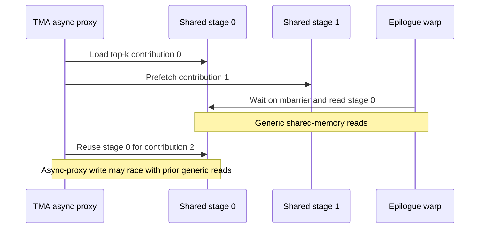
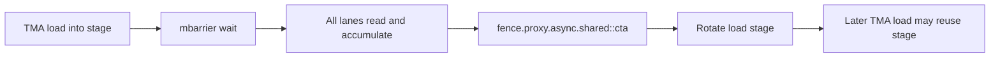

# [PR #389] fix: fence combine buffer reuse in mega moe

source: https://github.com/deepseek-ai/DeepGEMM/pull/389
state: open | updated: 2026-07-23T03:45:48Z
labels: 

## 正文

## Summary

This PR fixes a shared-memory reuse race in the final combine stage of the SM100 Mega MoE kernels:

- `fp8_fp4_mega_moe`
- `bf16_mega_moe`

Both kernels use two shared-memory load stages. A stage is filled by TMA through the async proxy, consumed by the warp through generic shared-memory loads, and then reused by a later TMA load. The old code did not order the generic reads against the next async-proxy write to the same stage.

The fix adds `fence.proxy.async.shared::cta` after every lane has consumed the current stage and before that stage can be selected for reuse.

## Problem

The combine loop overlaps loading and reduction with a two-stage ping-pong buffer:



The mbarrier wait makes the previous TMA load visible before the warp reads the stage. It does not, by itself, order those generic reads before a later TMA async-proxy write that reuses the same shared-memory addresses. Under unlucky timing, the new TMA load can overwrite data while lanes are still consuming the old contribution, corrupting the final reduction.

## Fix



The new fence establishes the required generic-to-async proxy ordering at CTA scope:

```cpp
// Order generic shared-memory reads before the next TMA load reuses this stage.
ptx::fence_proxy_async_shared_cta();
combine_phase ^= load_stage_idx;
load_stage_idx ^= 1;
```

The PTX instruction is exposed through a small helper in `deep_gemm/ptx/utils.cuh` and used by both affected kernels. There are no API, layout, scheduling, or numerical changes.

## 评论 (2)

### ds-review-bot · 2026-07-22

## 🤖 ds-review-bot Code Review

### v6
The added proxy fence correctly orders shared-memory reads before the TMA load stage is reused in both Mega MoE implementations. No breaking or correctness issues were identified.

### v4
The MR fixes a shared-memory reuse ordering (WAR) hazard in the final combine stage of the sm100 bf16/fp8-fp4 Mega MoE kernels, which are the only two kernels using this two-stage shared ping-pong combine buffer. The buffer is filled by TMA via the async proxy, consumed through per-lane generic shared reads after a per-stage mbarrier wait, then reused by a later TMA prefetch. The per-stage mbarrier only orders the previous proxy write before the generic reads; it does NOT order those generic reads before the next proxy write into the SAME stage. The PR closes that gap with a new fence.proxy.async.shared::cta placed between the per-lane accumulate and the load-stage rotation/next prefetch. I verified that: both call sites and the helper are consistent, the fence is reached by every lane (outside all per-lane/elect branches), the CTA scope is required because the reusing TMA load is issued by a single elected lane, the compiler memory clobber/scope are correct, and there are no API/layout/scheduling/numerical changes. The change is minimal and correct; only documentation/robustness nits below.

### v3
This PR fixes a shared-memory reuse race in the final combine stage of the two SM100 Mega MoE kernels (bf16_mega_moe and fp8_fp4_mega_moe). Both kernels use a two-stage ping-pong shared buffer where a stage is filled by TMA through the async proxy, consumed by the epilogue warp via generic shared-memory loads, and later reused by a subsequent TMA load. The mbarrier wait only orders the previous TMA write before the generic reads; it does not order those generic reads against the next async-proxy write that reuses the same addresses. The fix adds `fence.proxy.async.shared::cta` (via a new `ptx::fence_proxy_async_shared_cta()` helper in deep_gemm/ptx/utils.cuh) after all lanes have consumed the current stage and before that stage is rotated for reuse. Verification confirms the helper exists in utils.cuh (with a `memory` clobber that correctly prevents compiler reordering of the generic reads across the fence), and the fence plus explanatory comment are present in both combine loops immediately before `combine_phase ^= load_stage_idx; load_stage_idx ^= 1;`. The fence is placed correctly: after the full per-stage accumulation loop, in the unconditional path reached by every participating lane, and before stage rotation, establishing the required generic-&gt;async-proxy ordering at CTA scope. The fp8_fp4 change mirrors the bf16 change identically. There are no API, layout, scheduling, or numerical changes. The change is correct, minimal, and well-targeted.

**Files reviewed**: 3
**Issues found**: 🔵 3 suggestion
**Inline comments posted**: 3

### Bruce-Lee-LY · 2026-07-22

@LyricZhao @zheanxu hi, could you please take a look at this bug fix

## Review (1)

### ds-review-bot · 2026-07-22 · COMMENTED

(no text)
