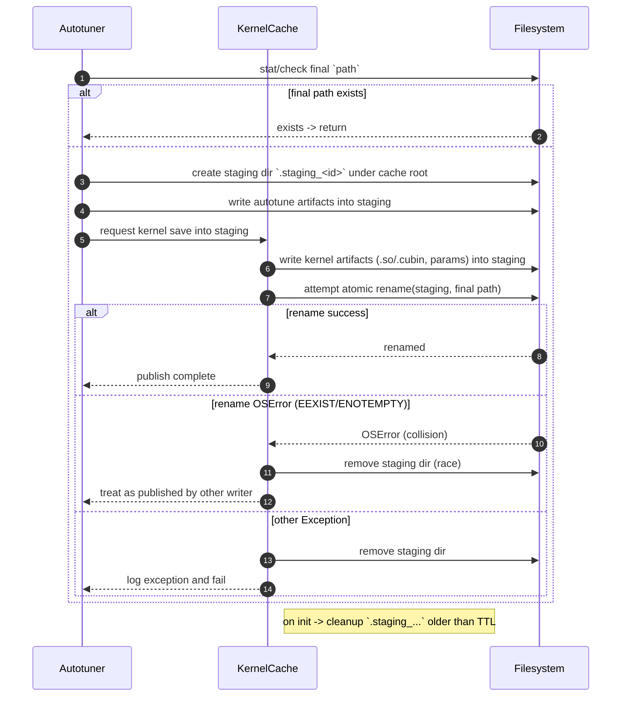

# [PR #1982] [Enhancement] Use atomic directory rename for cache writes

source: https://github.com/tile-ai/tilelang/pull/1982
state: closed | updated: 2026-09-18T11:56:34Z
labels: 

## 正文

## Summary
- Replace per-file `os.replace` with write-to-staging + `os.rename` for both `KernelCache` and `AutotuneResult`, ensuring other processes never observe an incomplete cache directory.
- Add `_cleanup_stale_staging_dirs()` to remove orphaned staging directories (>1h old) left by crashed processes, called on `KernelCache` singleton init.
- Subclass save methods (`_save_kernel_source_code_to_disk`, `_save_wrapper_kernel_code_to_disk`, `_save_so_cubin_to_disk`) require no changes — they receive the staging path as `cache_path`.

## Test plan
- [x] All existing `tvm_ffi` cache tests pass (`pytest testing/python/cache/test_tilelang_kernel_cache.py -v`)
- [x] No `.staging_*` directories remain after successful writes
- [ ] Optional: concurrent multi-process write test for same cache key

<!-- This is an auto-generated comment: release notes by coderabbit.ai -->
## Summary by CodeRabbit

* **Refactor**
  * Save operations now write to per-run staging directories and publish via atomic rename to avoid partial writes and races.
  * Removed broad internal exception swallowing around kernel/parameter saves so failures surface to the atomic staging workflow.
  * Added automatic cleanup of stale staging directories and safer cleanup on publish errors.

* **Tests**
  * Added tests verifying atomic save behavior, incomplete-directory rewrites, and proper error logging/cleanup on write failures.
<!-- end of auto-generated comment: release notes by coderabbit.ai -->

## 评论 (2)

### github-actions[bot] · 2026-03-27

👋 Hi! Thank you for contributing to the **TileLang** project.

Please remember to run `pre-commit run --all-files` in the root directory of the project to ensure your changes are properly linted and formatted. This will help ensure your contribution passes the format check.

We appreciate you taking this step! Our team will review your contribution, and we look forward to your awesome work! 🚀

### coderabbitai[bot] · 2026-03-27

<!-- This is an auto-generated comment: summarize by coderabbit.ai -->
<!-- This is an auto-generated comment: review paused by coderabbit.ai -->

> [!NOTE]
> ## Reviews paused
> 
> It looks like this branch is under active development. To avoid overwhelming you with review comments due to an influx of new commits, CodeRabbit has automatically paused this review. You can configure this behavior by changing the `reviews.auto_review.auto_pause_after_reviewed_commits` setting.
> 
> Use the following commands to manage reviews:
> - `@coderabbitai resume` to resume automatic reviews.
> - `@coderabbitai review` to trigger a single review.
> 
> Use the checkboxes below for quick actions:
> - [ ] <!-- {"checkboxId": "7f6cc2e2-2e4e-497a-8c31-c9e4573e93d1"} --> ▶️ Resume reviews
> - [ ] <!-- {"checkboxId": "e9bb8d72-00e8-4f67-9cb2-caf3b22574fe"} --> 🔍 Trigger review

<!-- end of auto-generated comment: review paused by coderabbit.ai -->
<!-- walkthrough_start -->

<details>
<summary>📝 Walkthrough</summary>

## Walkthrough

Autotuner and kernel-cache writes now use per-operation staging directories under TILELANG_CACHE_DIR and publish atomically via os.rename; stale staging dirs are pruned; helpers determine completeness and remove incomplete results; rename-collision races are treated specially and staging cleaned; write errors are no longer swallowed by broad try/excepts. (41 words)

## Changes

|Cohort / File(s)|Summary|
|---|---|
|**Autotuner atomic save** <br> `tilelang/autotuner/param.py`|`save_to_disk()` now fast-paths if final `path` exists; otherwise writes all artifacts into a unique `.staging_*` dir under `env.TILELANG_CACHE_DIR` and then atomically renames staging -> final. Introduces `_get_kernel_lib_file()` and helpers to detect/remove incomplete result dirs; removes outer/per-block try/except around kernel/params serialization; handles rename collisions and cleans staging on failures.|
|**Kernel cache staging + cleanup** <br> `tilelang/cache/kernel_cache.py`|`_save_kernel_to_disk()` changed to staging-then-rename publish flow: skip if complete cache dir exists, else write into `.staging_<...>` and rename to final. Adds `_cleanup_stale_staging_dirs(max_age_seconds=3600)`, `_get_complete_cache_files()`, `_is_complete_cache_dir()`, `_remove_incomplete_cache_dir()`, and `_is_rename_collision()` helpers. Rename collisions (EEXIST/ENOTEMPTY) treated as races and staging cleaned; other errors logged and staging removed.|
|**Tests for atomic save behavior** <br> `testing/python/autotune/test_tilelang_autotune_atomic_save.py`, `testing/python/cache/test_tilelang_kernel_cache_atomic_save.py`|New tests that validate rewriting of incomplete dirs, pruning of `.staging_*` dirs, and proper logging/cleanup on write `OSError` (ENOSPC). Use temp cache/tmp fixtures and lightweight fake kernel/adapter helpers. |

## Sequence Diagram(s)



## Estimated code review effort

🎯 4 (Complex) | ⏱️ ~40 minutes

## Possibly related PRs

- tile-ai/tilelang#1315: Overlaps refactoring of autotuner/kernel persistence to use atomic/staging-backed writes and adjust kernel file write flow.  
- tile-ai/tilelang#1812: Modifies kernel-lib selection and touches `tilelang/autotuner/param.py` kernel save logic; likely relevant to kernel-artifact naming/selection.  
- tile-ai/tilelang#1972: Adds CuTeDSL-specific kernel handling; intersects with backend-specific artifact writes and selection.

## Suggested reviewers

- SiriusNEO

## Poem

> 🐰  
> I dug a staging burrow neat and round,  
> Wrote kernels safe without a sound.  
> A single hop — a rename true,  
> Stale nests cleared, no races stew.  
> Hop on, cache built, the build is found!

</details>

<!-- walkthrough_end -->

<!-- pre_merge_checks_walkthrough_start -->

<details>
<summary>🚥 Pre-merge checks | ✅ 2 | ❌ 1</summary>

### ❌ Failed checks (1 warning)

|     Check name     | Status     | Explanation                                                                           | Resolution                                                                         |
| :----------------: | :--------- | :------------------------------------------------------------------------------------ | :--------------------------------------------------------------------------------- |
| Docstring Coverage | ⚠️ Warning | Docstring coverage is 17.50% which is insufficient. The required threshold is 80.00%. | Write docstrings for the functions missing them to satisfy the coverage threshold. |

<details>
<summary>✅ Passed checks (2 passed)</summary>

|     Check name    | Status   | Explanation                                                                                                                                                  |
| :---------------: | :------- | :----------------------------------------------------------------------------------------------------------------------------------------------------------- |
| Description Check | ✅ Passed | Check skipped - CodeRabbit’s high-level summary is enabled.                                                                                                  |
|    Title check    | ✅ Passed | The title accurately describes the main change: implementing atomic directory rename for cache writes across both KernelCache and AutotuneResult components. |

</details>

<sub>✏️ Tip: You can configure your own custom pre-merge checks in the settings.</sub>

</details>

<!-- pre_merge_checks_walkthrough_end -->

<!-- finishing_touch_checkbox_start -->

<details>
<summary>✨ Finishing Touches</summary>

<details>
<summary>🧪 Generate unit tests (beta)</summary>

- [ ] <!-- {"checkboxId": "f47ac10b-58cc-4372-a567-0e02b2c3d479", "radioGroupId": "utg-output-choice-group-unknown_comment_id"} -->   Create PR with unit tests
- [ ] <!-- {"checkboxId": "6ba7b810-9dad-11d1-80b4-00c04fd430c8", "radioGroupId": "utg-output-choice-group-unknown_comment_id"} -->   Commit unit tests in branch `feature/atomic-cache-dir-rename`

</details>

</details>

<!-- finishing_touch_checkbox_end -->

<!-- tips_start -->

---

Thanks for using [CodeRabbit](https://coderabbit.ai?utm_source=oss&utm_medium=github&utm_campaign=tile-ai/tilelang&utm_content=1982)! It's free for OSS, and your support helps us grow. If you like it, consider giving us a shout-out.

<details>
<summary>❤️ Share</summary>

- [X](https://twitter.com/intent/tweet?text=I%20just%20used%20%40coderabbitai%20for%20my%20code%20review%2C%20and%20it%27s%20fantastic%21%20It%27s%20free%20for%20OSS%20and%20offers%20a%20free%20trial%20for%20the%20proprietary%20code.%20Check%20it%20out%3A&url=https%3A//coderabbit.ai)
- [Mastodon](https://mastodon.social/share?text=I%20just%20used%20%40coderabbitai%20for%20my%20code%20review%2C%20and%20it%27s%20fantastic%21%20It%27s%20free%20for%20OSS%20and%20offers%20a%20free%20trial%20for%20the%20proprietary%20code.%20Check%20it%20out%3A%20https%3A%2F%2Fcoderabbit.ai)
- [Reddit](https://www.reddit.com/submit?title=Great%20tool%20for%20code%20review%20-%20CodeRabbit&text=I%20just%20used%20CodeRabbit%20for%20my%20code%20review%2C%20and%20it%27s%20fantastic%21%20It%27s%20free%20for%20OSS%20and%20offers%20a%20free%20trial%20for%20proprietary%20code.%20Check%20it%20out%3A%20https%3A//coderabbit.ai)
- [LinkedIn](https://www.linkedin.com/sharing/share-offsite/?url=https%3A%2F%2Fcoderabbit.ai&mini=true&title=Great%20tool%20for%20code%20review%20-%20CodeRabbit&summary=I%20just%20used%20CodeRabbit%20for%20my%20code%20review%2C%20and%20it%27s%20fantastic%21%20It%27s%20free%20for%20OSS%20and%20offers%20a%20free%20trial%20for%20proprietary%20code)

</details>

<sub>Comment `@coderabbitai help` to get the list of available commands and usage tips.</sub>

<!-- tips_end -->

<!-- internal state start -->


<!-- DwQgtGAEAqAWCWBnSTIEMB26CuAXA9mAOYCmGJATmriQCaQDG+Ats2bgFyQAOFk+AIwBWJBrngA3EsgEBPRvlqU0AgfFwA6NPEgQAfACgjoCEYDEZyAAUASpETZWaCrKPR1AGxJcA2gFEMWEwGEjYMXABdSABVRBJ0AmZ4BkhaeApRAhdIDIw0NkgAM3w+BjQGWHiAdwp1aUgACltIMwBGAE4ADgAmAEpISANomwAZLlhcXG5EDgB6WaJ1WGwBDSZmWfEvMG1N+C8PTCJZ7mwPD1mOnoGhuIouEZJ4AHUjjvb2m4BlfGwKEMgAioGAqXEKJGofxIs2oLGSYDKFRIYDSFDAuXy8UASYQwZykXCA4GgyDMbRYQZfXCQmb8bhkSCAFAJIABhDLUOgJLjdAAM3QAbGBuQBmMDdADs0G5fI4AFZ2hxWtyAFpGL6OUkuDgGKA2EjcQ4Aulowr7eL4RAaDL68rVJboSA1OpgAhgRBUxYYIgo9KZErybjUGgULDFc74KocuT8C0YgrFPgCfC4WCQADSlHIHmZ5Uq6Aw9AAgngk9hyLqHB4CYh8Pxk5QeBR8CFEHFkOQpHxBHcpHmUCCWPqSDRGDn4qjfS4NNrIAXaPQAPoMLyYbDcedutBedfu+Ce+eoxANfoEHKhfA9krcILkegbj1EVI+sQleD1fAeJR8ZOYSCtSCwX4+AaLxCgJKMGCoRBKnoXgm2kVtegAbj7CR8AAaw5fAsHTYMSCzUd7F3IgvAILBd3UeBN3gAAvah4CwqcoD8AAPJBxE9ew0B7SoPCNEkhwA2hkAadcuJIecMNwjx10AkJF0UcSCH3JA0IAGkgUSpHnGo0G4I0JIzPD5KUeclLSRA1I0xAxJkxcVl3Uz8GUiz+gyABHbAfUgDAawLKwAElGGvUhEGQut5AyEJJHiOt7B3DiA2TdBkERSp50S2ApwMaBpAJa0MC1KAC3OSASFYt0iMgXAJGYedChNEckSq3LkADFtGm4WQaDdZqKs9E4uoAjBZlS6FutwUzTUOPdJMzRdRw0TrdAkXpGMgAA5GsNDvIj5wAKkfSKslfZAMlJXd0FA+sHAYZtEEKM4HVqbq1oAeW4cQsM3LgmBBP5cgJZgznEMBYLup66l6gl4yq3NrIKUbIAw+RUB8mh6AEPBvKTBRmEHdGsv0YxwCgMh6HwQocBdUhyCodHcbCTgG34YRMmimR5CYT8VDUTRtF0MBDBMKA4FQVAfzQYtiDIZR6fWRmuCoKp7HVZx5HAhSqFUdQtB0InidMAwtjwo4YWLXBS0oE5nHyRbZC1AAiJ2DAsGd/Ol2n2VvVXsgpoKjmkIwdRIQpyiyDkAANNPE2ajLMlSjwjqqazO88YtzX4g0gCPcBcWYypCD6k+/AkPHwIhSHoQAcAj8ChGz4ayJEq2OPEgDx4CBNXk8fCzAFwCdTMHoPD4CSPJ6dio0wAEMuGDQ7Pc9kfPmML3Ak+cX58yRwzW4DKg2Czu5KPb2jPowZCW7bjv7DwtmsJQNtw0YdgqGPjkm7QbP53xAypPnduBDqqaBoZVRB4HohgecAhygYXzL0Nem8W6gxtvva6XFKqoxrGXT09ZdxBjyOceQlB64IklkQCYa0vgj31PAE0kdo4/zmvHCyicFDhEbK3QoZdlZRmYOeSqUDZ5kx7olCoRQSjZwwBICguAGAR3UjnGqdUTRyOzgwPAdBEAeBUYPVIIdJaVj7CeD+boqDwDIbgMA7dyDXwJH7COND87t0KI4uISdO4gkqIgdSVQEBeFPFSciHFYoCJgbQV0dIGA0OSOgaRNCw4Q26o0EgGgiAaHUsybAOUAAiXwRht0lh4+sEdtr4HgeTD64DNzZxbmseyGAI6rWnLqKoJQML0Ajo3RSTlzJoRYSebAcReywiSCkHanpvRHT9KePIBQTHsiIPbFAlMP7rHxvERG45nzZE3GyWghDyq4GQDDYJ0CybqXUP4v4GBkAQgoB4WQyEkyVAoFUJA8QLmOkSZuVuzhxChzEMJXcS5sBpA4hfE0XhED9FwTWD+pZ4AeTwvIGZkdtrxSIPtJOmysjyFLJ+bOZAJAaGgP5EYfgRgFnWgAcXnMyAszIAASfh5xZP8jYFRZAHAZGQLFE0+CeDOHYKVA5XjTy8KkMgDcXhZhAoHCReIvB6J8G5cDUVOi6xYFONPJAnjIDv2zuaS0ZBMQNDGRijK6kMpwLWrOJQ9BGyYzdOQdqMNfpqLrkKz5lBkC0D+JVLV7coJES4HfCOhrYwkCThHV6Xxa71yTq8pKEc/B+AABr+S+NACOsxk3rVetAPwABZKw0AACaKiLm5whIclABI0DIA/lQAEOilwQmuZAVcsN4hmsOo8rAmB5BPPrAXPUp9zkElThKrtcU0D3kOnmegZciDIETSmCOS7SAUA0COipWFinTltRyHifF96CRpFHb+Lc/4d0AV4RO8iv5DnknjeV84VWVlvdIe9n8kDPrWW+6QwNlIUG/VHSd4lZUvqHOJd9E1UTfp0VHX9Eb5LnCQOAvpNYlBBlHusuV0HnWivA32VZ8rSpsJOgPTecQvBiGnUwD1dGL7/yoNkCFxq2BZRdpYYqQY6JYR5TWWKSglw21PsgP2ZVuAlHpuIgN0T2AUUDtOTa5AsojF3PUCoAdaBcAANStD5HyWYYBWitE6EYPwFVSRywUqeJuJBlYh3jEzBlZjYAGCdg7IOhtjbTWOKNWYV7Rp20ds7V2BZ3Y01lhyBwThfaU209gxAQcZxzkjjhTM2YkQaEXMuDAq5tybnEma4Dh5STMXnLOkrogsJCS4LgyAABeSAQo+Tcm5HAhdKF0IcguYURszBs6ZbwtlyouWILVvEgeTD9gyhYAjoS4lpLyWUppXSxlzLWXsrEXwYppWNCHaxU+Y6b4Pz1m/FgWK0BoB5J0cRusQ3TWrl4PBSq7HECyDdKEUqdcShQrWs01pdDOkMLjt0hOh2NBdf6YMiWiRonYr9OiDjCqViBpTJw8MDXobpB6kiWeRzxErPw8OMqbFKobJO1M+7Q4rnIBoQ2aQ7BHl1heW82tCT6jfMarmX5cSAWGNhR2jACLsBIu8pidpaLZ27QAN7IwAL7zjl9weAtBldQ+O5M7IeKilLZJWSil1LaX0qZSytlZSu1YAjTyoIVZ0WHQnPIE8vLdxVIjqNdK1BYAJrtGGmMqP91FXS7QWYAyOTkGVse713dsOUFw7zvDUGaCEcaEhxAf7X1e9REnWYn9v6keg/NJEn7EANO6yeJQZGpXQkg2spPTutknXTwB8VEH+wp/Ejn9IFfFXiJPPJoNQTcxR/IwvNa0RuC0C9p/UHV6mG9Kh11iNv367/kHlYogDXKYB6NSipOod9grrtB/ePYgOSr6YGhxA4D09EJ8hoFN6bM1J3EYtuuj+/B5oLcWstDTx0qo2Qa1kxxYG0cgbRutq9oM7du1HckcXBWdnkihtAPAoQG0MgVYKB/k6BvFfF04zR1E+Ad1T4N98wvBSh8tkBO0e0dEl1kAI4HY41xFfVagOJhlolEZOkHZg9IBdR296AJ4Mgm5fgZASAggRCvx7cm9cB7lGBgC6BZgagkx4gPs+xb8lBVFRxvdkw/dkxM4Z17xZhV8oE65XwKALRzAeNKxZZwFBNp0RNDg6Y7D+BKYpMZNMI+B5MUhFNxBlMQ87V+J9DdNhtt4xtkk8s21Cta8it7wysGgKsqtSB1xat8waRGsWs2sOt+hBYNosJI0+x54ppTZAtgsFpOpeDD16AY8+BT1FAZgDABgoAI4Rt8IctH0Joi8aAS80oPsGgvcMouATEci9BL43QfATEIgI5GjdBQipJwjctf0uju9tD4MBifchjc4RjAR8B3xpimi5issFo28055x69s9Vj0h+jtDBi4oKBtjEw9iZjmjWiFizjM8UNr9A0MMC4uAY1mD7jdBRjHitFpxC0BJFBARxC0FxEktK5GgfJCIiAx4oR/ZsFeguAWiwjjj59t5HJnJekaNCh1JkZNiKASTt4uAAApfyaAVo9SB6EELgbMc4FQPxFrVTEgdSDsRMOILgEE5rSAAAMU3DiC6x8mVjvHqC9WoPzHrA/n23RXnC1xkJp03iH11X1T3wjRUVXVxnxnARGnfG+KwhlU7zWRISamvFoC33U00xSmCjoH006E6BMyFG5E82dm1F81yiIgGn0OGklgIAtnIE2FykmgOCOCq3NktiqwRwYGjlC09O8wiyixljplix9kHUS0dJSwMFtXALH06nGihhJEUDOHTmoD1Sohn0SQjiLGDMtnLGBm2hskXzcWhMkN2wSDhBSERiNFv2+xBGSUgH8gJFwUbF9WbEvnMQjHc2hjQAwnQBnw+itgvlExbG503gVPnFJAwgAwrFXn/Dwj4hPF+hMWwDox/HrJjLLEA0rATQAkGWYw7lY39B9x4HwFwXsI/miwzPaSvX/hKWKRnC0NLwPEP3gGYgtkwN+hNCIHQIJUkWWyNzW1N02wtx20QwNxW2NxpWgGLUwuLhrAjx4EoGdFymajxhKC7gQJOiyjgFULxwJBLIaBznDKDJLHIHoQyBlLOPNIuPAt736Em3ZAbSwCrnOOg17kbwQM5iwgCVF3YOzlrw0FwGgsgq8HUjKHOAYNg1bK0nbO7JLlVJcHUg1WSjuBAOkKk0yA5E4pDPiH53+Vx0hUaAEEorgrMQZNLDEHAXUkOFTwYFkHUiUCbhCFmCfIJBblFRfIEEtWQShRiQVW5U9XwOnVLAyECtiypD8XY3vjFTTloAYrhlSMEMorYvGmjMbO4tB3oO0menEnNCIRKH4u+zQFoHnAplMmAN2nUCqw+JtAr1vyBmyvEp7JGS5xQP2FRJ4SwmRhEQQA4hvJqpIGbMrFy1xN/iMpPFMUGWjVjT+xAwf3wCfzzS+CsGZHUmXxArHNPAYyEhHF0u7gjgctjN3ltg3UoG3WXlHXARUQoFLAYNByMphg/jHypAoHxAFWTCo3oHrSstgKqjxCHFMpRgfgJFEvRgHjbnLnhLYBbGq1YUUuQBriOtSD9XYPjKpi4viFg04ikH7m60RJ7ToukFmDUIaFexNGYg5D1MVNlz3ArzOjJBF3xVii8oQoyHoCpx11kCygixsOcIE27mE1ECcP43bUk2Ymk2kU8J4HRwU3CCUzzKgE2mFV1vRhOENp8ONtwHkEcLExcIjEwN4TSFoVoDCgQB9RoUpiwjkI6sevBsc1LPyr1NwQzCqRLJqPEpgi6kop5pgukDtOdTRMrn00VFdMFEs2s1ny5jppIAcyc3qhkweHDGTJ8zACMHGj9OLKGhGlHDDLdAjJNhmjxK9w4ITM6STK824zdg9hi29ni2zLTuUyqPtAhsordorPTxrv6jrtNMCyqr8yjLKNL07sTIqOPGkIkBrLEsONGxxJsgXwhwsg7IkKVTFouxaQmvhE6Tm2NVqENRgFzHGmoMGRoGorfKT02DxlMpb31QVJ7wsMgugqhDwOSBTF4QwAWuoCRAYJwtQpNw23N22yt0W2QsN1WxNwIqsCIu7iQHfHZCKFNE+2+yG2c0yAtFAvblnKeHMRQKXIvjYvnBFIwlaIrx0VDiXI6t0izhYbYZIFnD4coD70bCbk0PjwoFHgpxSCitmDCuSHiAvmrD+GnJ0Q/m4e7SCGlsvk7myAyhKqYosJYoqvYubrXrSl4saszyku6OAYryxq3OFQpw4i4JWDku7N/OiiwGRmJrJEqgVNUvUqPOtBCAAnO3JOtyeo8AYPoRPoJNurrU3OkTtyrNilsovxloImcrDgwPWQUPoDYsUbkivQyhUQjiirB2knKfkUApvVqezg+uYEz3Kf6HVWkNilrxJGcEkhIb8VQHA1oG0qwhNGkfQQEug3/u50wOsfUFTxGnyw5FYMqm7rcFKt+nKp6kqvDMsfEnqq9S6ruHrjapoA6q6sKB6urT6omnrTfSGv6GgdgZkV1SjlB2rDsjUAgR2pTm0DhwW3+KOuAU/1Ou/xjUuuusOy6x0SeZIFkEWvqE9wWi+q3RIP+u7kihKEXXLn4kJpCg0BnCuj4F3FQjQkqjeePrxPbMAIRsoGsqrMRNludwKqcfoGOVzGRnMukOMQiSiRSDJvXxWapt7Mb06RkoJuslIAdHrVxorlwMr2kMRIFriKTgjukboEomHFZup1qHqBFt3C4z7t41sJVtd1zEduVq1rcJ1o8PJi8JtvHxNtS3NvcL1rD28Mdftt0VE0tZXUoHWUdOKpftQHduWTnELJDpLPyp0SUD5TfAwDkLVf5QaB8gwDAFdfRmPEopqMYEOE3Njp4Hjp6kTvQJTq00Df0zFGM2zoMCs3EBsw5Hzvs1fGLpcy4HBLSEcAru9MMAMGFnI3JmWSlj/LzpYAVggMlKzMBHku5m1j5j1kFj7ZJgZn6vVw+MLpbboCK2kQFl7f7e5E6HaCrbQG6AYD5DQBIA6wABYVA+QGBaB2g0AhROgH3Ch3TugSABBuh6p2hFQ0BDNd2l2IBUgq2GBWgwOhRwRVAr3ugBAugxQZRWgBAZQhR2gZRuQ0B2gGBVB2ghQL2hRIOQ5AP+2T2OqD2GAsOxQsPOgr3IOoFP2oEpQT2+Qj2xRaAKOpRaBCgBAb3iPl2GBCgxQCOSAr2GA2P2hCgGBv3sPH2xQSBT3DM73Chuh+QBAxQzMeRDNKZ9Z+35ZV2hIAMi6t2hEiZ+3XtdzKBkiCc0JM8Nwd39Y5cZiHYkBbAAAhGeNpZkMd9gKwc0dGB2MEUUrkpzpAV6DsWodLDAALlA2J4LgYB2WgJsExIiLzjsarfycISOjwSkdkaLxzgYeLle/qN62ma2PeO2PLmYgryAB2YMzcIU3y8TaL9oVSKrgrh2RkvygTZ4JYLJJL3OIiRAaLoUNrxXVr6r2r4o/qUo9u8o2QSr6rwrpMerxruw6Lszcbxbjr1b7r3r/rtg5daLq90bzbwr30+ewaU0krsacMorjFa7uM3sze+brgfLrburjwBrkEJrrgDbtr+Lzr8THr5MPrhgZLz0IbrgD06rsbtr2r8744Be4aJe27qbjFPZx7kZZ7hb975bz7nb65Zr079rwHuw4H2AUH8Hw7qH0bmY2H+L/OmwHmdQZ4RsGgKwCgdwWQkgaL0OWLzbh2KCX4D8dzpsNCWwXnoLgXtIWgGwUsUHykA7xAZkSoWeaL3OcXaX9XOXjALnrwFX0QNCdXwGuLmrmXnXrJaQCCeAXdDAA3tXwL/npzqxNpfyFscXRARX6Lp2AXvN3Ae3tCdaw5aLnwNrt7ib6z9aTEb3y3xAa323lkVXo34n+LjcC2SHoAzX/7mrqTaaTW73gP+wMlvSDkKALzpQJnudwATAJkAEAyFLFC68IVZh6CrjVp46ANAHYU+au3aeeuAHYqhnAlKiAu/s+HYXwPRNwA+o+2BvelA4/ahbfvMYfifw/2vI/o/++9eA3DfR/Fuau0+Bljes/9+HZc/MB8+t/X7PAnLbo/h2Q5D5/rePKkbzosA4TvAUAoNGZAnqbPHV9XUBEGUugAgjmgZATyNMNiSag6IGytNIPvqXyLhALQe/Lbr3296D9gwREFARN0xYYB4KUISXk71P4T93cWYJPjPz741dxA3PZfgV3p4Fc1+DPcgZvxq6U8BuHEVLsoFIDYD2uh/DPnzziDd8z+OtPPqfBj77dKcacKgFK1QCtAxQGgdDgAFIHQCAURGLGuTYB6oyQV8OEAJaMVTwHkH0IIVgDcoIm9AVAJ0G5AaAOsigzvkIO5TvgwEWEb3qz0hiJcwe7A5dMZVzCk8VaSQFsJVEezdxrI4ge6C7lzBMA0uUrZMKYPfDFUeB8XNAf3wwHD8EhNXEgfgmn4sCEuEgiHrQIGCK4ZiEQX3vWlwC2BY+8fMQf3yradA4OnQM9jKG6BXsxQUoVDlexQ5ChL2MoMDuKAEBntLBZQEgDR3Y60Bn2N7VoEKCvatBCgnQPkA+3Q5cc+QnQNAFewEBChWgKAh2H71sDb9veQoLjle06CFBFQogOQe0FWGdAQ45mfYQ+3aB8gr2JAEgO0B44PDL2D7J4Q+zQDnt2gXHGUNx3MxlAhQMoBDq0H/YTDvMhQoDlAHM5sAoa3eJPpnhM6LsSOxYb3BHiKzdE7OBIBzlsNKFWBJYcQWgAWFwC6gjOtALzqwHUBedSwuAALjKEhEoilIAYdEWn3EhIi9AQAA -->

<!-- internal state end -->

## Review (5)

### coderabbitai[bot] · 2026-03-27 · COMMENTED

**Actionable comments posted: 1**

<details>
<summary>🧹 Nitpick comments (2)</summary><blockquote>

<details>
<summary>tilelang/autotuner/param.py (1)</summary><blockquote>

`430-435`: **Error handling pattern is reasonable.**

The `OSError` catch handles the benign race where another process created the final path. The broad `Exception` catch (flagged by Ruff) is acceptable here since it ensures cleanup and logs the actual exception via `logger.exception()`. However, consider re-raising after cleanup if callers need to know the save failed:

<details>
<summary>♻️ Optional: re-raise after logging</summary>

```diff
         except Exception:
             shutil.rmtree(str(staging_path), ignore_errors=True)
             logger.exception("Error during atomic autotune result save")
+            raise
```
</details>

<details>
<summary>🤖 Prompt for AI Agents</summary>

```
Verify each finding against the current code and only fix it if needed.

In `@tilelang/autotuner/param.py` around lines 430 - 435, The current exception
handling around the atomic autotune result save swallows non-OSError exceptions
after cleaning up staging_path and logging via logger.exception("Error during
atomic autotune result save"); update the except Exception block in the save
routine to perform the same cleanup (shutil.rmtree(str(staging_path),
ignore_errors=True)), call logger.exception with the existing message, and then
re-raise the exception so callers (callers of the atomic save function that uses
staging_path) can detect the failure; reference the staging_path variable and
the logger.exception call when locating the try/except to modify.
```

</details>

</blockquote></details>
<details>
<summary>tilelang/cache/kernel_cache.py (1)</summary><blockquote>

`384-413`: **Partial cache entries can be committed if individual saves fail.**

The inner `try-except` blocks log errors but allow execution to continue to the `os.rename`. If, for example, `_save_kernel_source_code_to_disk` fails but other saves succeed, an incomplete staging directory is still atomically renamed to the final path.

While `_load_kernel_from_disk` and `_build_kernel` handle missing components gracefully (returning `None`), this means:
1. Incomplete cache entries occupy disk space permanently
2. Every subsequent load attempt must re-check and fail

Consider tracking save success and only renaming if all critical files were written:

<details>
<summary>♻️ Optional: gate rename on successful saves</summary>

```diff
+        save_ok = True
         try:
             # Save kernel source code
             try:
                 self._save_kernel_source_code_to_disk(kernel, staging_path, verbose)
             except Exception:
                 self.logger.exception("Error saving kernel source code to disk")
+                save_ok = False
 
             # ... similar for other saves ...
 
+            if not save_ok:
+                shutil.rmtree(staging_path, ignore_errors=True)
+                return
+
             # Atomic rename — makes the complete directory visible in one step.
             os.rename(staging_path, cache_path)
```
</details>

<details>
<summary>🤖 Prompt for AI Agents</summary>

```
Verify each finding against the current code and only fix it if needed.

In `@tilelang/cache/kernel_cache.py` around lines 384 - 413, The staging directory
is being renamed to the final cache_path even if some inner saves fail; update
KernelCache.save (the block around _save_kernel_source_code_to_disk,
_save_wrapper_kernel_code_to_disk, _save_so_cubin_to_disk and
KernelCache._safe_write_file) to track success for each critical write (e.g.,
set an all_succeeded flag, flip to False on any Exception), and only perform
os.rename(staging_path, cache_path) when all_succeeded is True; if not all
succeeded, log a clear error and remove the incomplete staging directory
(shutil.rmtree or equivalent) to avoid persisting partial cache entries and
avoid committing partial state that _load_kernel_from_disk/_build_kernel would
later revisit.
```

</details>

</blockquote></details>

</blockquote></details>

<details>
<summary>🤖 Prompt for all review comments with AI agents</summary>

```
Verify each finding against the current code and only fix it if needed.

Inline comments:
In `@tilelang/autotuner/param.py`:
- Around line 377-383: The staging directory for the autotuner is created under
parent (in param.py within the staging_path creation block using Path(path).name
and os.getpid/uuid) which places it under TILELANG_CACHE_DIR/autotuner, but
KernelCache._cleanup_stale_staging_dirs() only scans env.TILELANG_CACHE_DIR; fix
by either creating staging dirs directly under env.TILELANG_CACHE_DIR in the
staging_path logic (replace parent with env.TILELANG_CACHE_DIR) or modify
KernelCache._cleanup_stale_staging_dirs() to also scan the autotuner
subdirectory (recursively or explicitly include TILELANG_CACHE_DIR /
"autotuner") so orphaned .staging_* directories created by the autotuner are
discovered and removed.

---

Nitpick comments:
In `@tilelang/autotuner/param.py`:
- Around line 430-435: The current exception handling around the atomic autotune
result save swallows non-OSError exceptions after cleaning up staging_path and
logging via logger.exception("Error during atomic autotune result save"); update
the except Exception block in the save routine to perform the same cleanup
(shutil.rmtree(str(staging_path), ignore_errors=True)), call logger.exception
with the existing message, and then re-raise the exception so callers (callers
of the atomic save function that uses staging_path) can detect the failure;
reference the staging_path variable and the logger.exception call when locating
the try/except to modify.

In `@tilelang/cache/kernel_cache.py`:
- Around line 384-413: The staging directory is being renamed to the final
cache_path even if some inner saves fail; update KernelCache.save (the block
around _save_kernel_source_code_to_disk, _save_wrapper_kernel_code_to_disk,
_save_so_cubin_to_disk and KernelCache._safe_write_file) to track success for
each critical write (e.g., set an all_succeeded flag, flip to False on any
Exception), and only perform os.rename(staging_path, cache_path) when
all_succeeded is True; if not all succeeded, log a clear error and remove the
incomplete staging directory (shutil.rmtree or equivalent) to avoid persisting
partial cache entries and avoid committing partial state that
_load_kernel_from_disk/_build_kernel would later revisit.
```

</details>

<details>
<summary>🪄 Autofix (Beta)</summary>

Fix all unresolved CodeRabbit comments on this PR:

- [ ] <!-- {"checkboxId": "4b0d0e0a-96d7-4f10-b296-3a18ea78f0b9"} --> Push a commit to this branch (recommended)
- [ ] <!-- {"checkboxId": "ff5b1114-7d8c-49e6-8ac1-43f82af23a33"} --> Create a new PR with the fixes

</details>

---

<details>
<summary>ℹ️ Review info</summary>

<details>
<summary>⚙️ Run configuration</summary>

**Configuration used**: defaults

**Review profile**: CHILL

**Plan**: Pro

**Run ID**: `4881e1de-890a-4c7c-8e76-58b98e3f8e86`

</details>

<details>
<summary>📥 Commits</summary>

Reviewing files that changed from the base of the PR and between dc60ab8f04cb6fd4bf2cf560219f3784e67c21fe and 08976a2c6ae004ab6cd9a38d9f302eb2ff910a16.

</details>

<details>
<summary>📒 Files selected for processing (2)</summary>

* `tilelang/autotuner/param.py`
* `tilelang/cache/kernel_cache.py`

</details>

</details>

<!-- This is an auto-generated comment by CodeRabbit for review status -->

### coderabbitai[bot] · 2026-04-03 · COMMENTED

**Actionable comments posted: 1**

<details>
<summary>♻️ Duplicate comments (1)</summary><blockquote>

<details>
<summary>tilelang/autotuner/param.py (1)</summary><blockquote>

`411-413`: _⚠️ Potential issue_ | _🟠 Major_

**Staging path still bypasses existing stale-staging cleanup.**

Lines 411-413 create `.staging_*` under `path.parent` (e.g., autotuner subdir), while the current cleanup in `tilelang/cache/kernel_cache.py` scans only `env.TILELANG_CACHE_DIR` root. Crashed writers can still leave orphan staging dirs here.
 

<details>
<summary>💡 Suggested adjustment (reuse existing cleanup scope)</summary>

```diff
-        parent = path.parent if isinstance(path, Path) else Path(path).parent
-        staging_path = parent / f".staging_{Path(path).name}_{os.getpid()}_{uuid.uuid4().hex[:8]}"
-        os.makedirs(staging_path)
+        cache_root = Path(env.TILELANG_CACHE_DIR)
+        staging_path = cache_root / f".staging_{Path(path).name}_{os.getpid()}_{uuid.uuid4().hex[:8]}"
+        os.makedirs(staging_path)
```
</details>

<details>
<summary>🤖 Prompt for AI Agents</summary>

```
Verify each finding against the current code and only fix it if needed.

In `@tilelang/autotuner/param.py` around lines 411 - 413, The staging directory is
being created under parent (via parent / f".staging_{Path(path).name}_...")
which bypasses the global stale-staging cleanup in
tilelang/cache/kernel_cache.py that only scans env.TILELANG_CACHE_DIR; change
the staging root to the shared cache root so orphaned staging dirs are cleaned:
build staging_path from env.TILELANG_CACHE_DIR (e.g., env.TILELANG_CACHE_DIR /
f".staging_{Path(path).name}_{os.getpid()}_{uuid.uuid4().hex[:8]}") instead of
parent, or alternatively invoke the kernel_cache cleanup helper before writing;
update the code that computes staging_path (reference symbols: staging_path,
parent, Path(path).name) to use env.TILELANG_CACHE_DIR so existing cleanup scope
is reused.
```

</details>

</blockquote></details>

</blockquote></details>

<details>
<summary>🤖 Prompt for all review comments with AI agents</summary>

```
Verify each finding against the current code and only fix it if needed.

Inline comments:
In `@tilelang/autotuner/param.py`:
- Around line 462-467: The current OSError except block around the atomic
autotune result save is too broad: change the except OSError to except OSError
as e and only treat it as the benign race if e.errno is errno.EEXIST or
errno.ENOTEMPTY (call shutil.rmtree(str(staging_path), ignore_errors=True) in
that case); for any other errno, log the error with logger.exception (including
context about staging_path / atomic autotune result save) and re-raise the
exception so real filesystem errors aren’t silently swallowed. Ensure you import
errno if not present and keep the existing generic Exception handler for other
errors.

---

Duplicate comments:
In `@tilelang/autotuner/param.py`:
- Around line 411-413: The staging directory is being created under parent (via
parent / f".staging_{Path(path).name}_...") which bypasses the global
stale-staging cleanup in tilelang/cache/kernel_cache.py that only scans
env.TILELANG_CACHE_DIR; change the staging root to the shared cache root so
orphaned staging dirs are cleaned: build staging_path from
env.TILELANG_CACHE_DIR (e.g., env.TILELANG_CACHE_DIR /
f".staging_{Path(path).name}_{os.getpid()}_{uuid.uuid4().hex[:8]}") instead of
parent, or alternatively invoke the kernel_cache cleanup helper before writing;
update the code that computes staging_path (reference symbols: staging_path,
parent, Path(path).name) to use env.TILELANG_CACHE_DIR so existing cleanup scope
is reused.
```

</details>

<details>
<summary>🪄 Autofix (Beta)</summary>

Fix all unresolved CodeRabbit comments on this PR:

- [ ] <!-- {"checkboxId": "4b0d0e0a-96d7-4f10-b296-3a18ea78f0b9"} --> Push a commit to this branch (recommended)
- [ ] <!-- {"checkboxId": "ff5b1114-7d8c-49e6-8ac1-43f82af23a33"} --> Create a new PR with the fixes

</details>

---

<details>
<summary>ℹ️ Review info</summary>

<details>
<summary>⚙️ Run configuration</summary>

**Configuration used**: defaults

**Review profile**: CHILL

**Plan**: Pro

**Run ID**: `27603822-4784-4aee-9e1b-3a0b3021ecff`

</details>

<details>
<summary>📥 Commits</summary>

Reviewing files that changed from the base of the PR and between 08976a2c6ae004ab6cd9a38d9f302eb2ff910a16 and d76c1c13febb42b98751b53950a9cbb93ae33fef.

</details>

<details>
<summary>📒 Files selected for processing (1)</summary>

* `tilelang/autotuner/param.py`

</details>

</details>

<!-- This is an auto-generated comment by CodeRabbit for review status -->

### coderabbitai[bot] · 2026-04-15 · COMMENTED

**Actionable comments posted: 1**

<details>
<summary>🤖 Prompt for all review comments with AI agents</summary>

```
Verify each finding against the current code and only fix it if needed.

Inline comments:
In `@tilelang/cache/kernel_cache.py`:
- Around line 408-410: The except OSError block is too broad and hides real FS
errors; update the handler that surrounds shutil.rmtree(staging_path, ...) so it
only swallows race-condition errors (errno.EEXIST and errno.ENOTEMPTY) and
re-raises any other OSError. Use the errno module to check e.errno from the
OSError caught (reference staging_path and cache_path in the same try/except
area) and only call shutil.rmtree(..., ignore_errors=True) or suppress when the
errno matches the race-case; otherwise raise the exception.
```

</details>

<details>
<summary>🪄 Autofix (Beta)</summary>

Fix all unresolved CodeRabbit comments on this PR:

- [ ] <!-- {"checkboxId": "4b0d0e0a-96d7-4f10-b296-3a18ea78f0b9"} --> Push a commit to this branch (recommended)
- [ ] <!-- {"checkboxId": "ff5b1114-7d8c-49e6-8ac1-43f82af23a33"} --> Create a new PR with the fixes

</details>

---

<details>
<summary>ℹ️ Review info</summary>

<details>
<summary>⚙️ Run configuration</summary>

**Configuration used**: defaults

**Review profile**: CHILL

**Plan**: Pro

**Run ID**: `807fd954-f905-4936-a0cb-e1976893e9c8`

</details>

<details>
<summary>📥 Commits</summary>

Reviewing files that changed from the base of the PR and between d76c1c13febb42b98751b53950a9cbb93ae33fef and a2ad08c9c79c843fbaebba06a26977dc906dfb4a.

</details>

<details>
<summary>📒 Files selected for processing (2)</summary>

* `tilelang/autotuner/param.py`
* `tilelang/cache/kernel_cache.py`

</details>

</details>

<!-- This is an auto-generated comment by CodeRabbit for review status -->

### coderabbitai[bot] · 2026-04-15 · COMMENTED


<details>
<summary>♻️ Duplicate comments (1)</summary><blockquote>

<details>
<summary>tilelang/autotuner/param.py (1)</summary><blockquote>

`457-459`: _⚠️ Potential issue_ | _🟠 Major_

**Narrow OSError handling to specific race condition errno values.**

This catches all `OSError` as if it were a race condition, which silently masks real filesystem errors (permissions, cross-device links, read-only filesystem) and drops the cache write without any logging. The race condition on `os.rename()` only occurs when the destination already exists (`errno.EEXIST` or `errno.ENOTEMPTY`).

Note: `kernel_cache.py` has the same pattern at lines 417-419, so both locations should be updated for consistency.

, 

<details>
<summary>🔧 Proposed fix to narrow race handling</summary>

```diff
+import errno
 ...
-        except OSError:
-            # Race: another process already created the final path.
-            shutil.rmtree(str(staging_path), ignore_errors=True)
+        except OSError as e:
+            shutil.rmtree(str(staging_path), ignore_errors=True)
+            # Expected race only when destination was created concurrently.
+            if e.errno not in (errno.EEXIST, errno.ENOTEMPTY):
+                logger.exception("Unexpected error during atomic autotune result save")
+                raise
```
</details>

<details>
<summary>🤖 Prompt for AI Agents</summary>

```
Verify each finding against the current code and only fix it if needed.

In `@tilelang/autotuner/param.py` around lines 457 - 459, The broad except OSError
in the cache write/rename cleanup should be narrowed: catch OSError as e in the
block around the staging_path rename (the code that currently does
shutil.rmtree(str(staging_path), ignore_errors=True)) and only treat it as the
benign race when e.errno is errno.EEXIST or errno.ENOTEMPTY; for any other
errno, log or re-raise the exception so real filesystem errors (permissions,
cross-device, read-only, etc.) are not silently swallowed. Apply the same change
to the analogous handler in kernel_cache.py to keep behavior consistent.
```

</details>

</blockquote></details>

</blockquote></details>

<details>
<summary>🤖 Prompt for all review comments with AI agents</summary>

```
Verify each finding against the current code and only fix it if needed.

Duplicate comments:
In `@tilelang/autotuner/param.py`:
- Around line 457-459: The broad except OSError in the cache write/rename
cleanup should be narrowed: catch OSError as e in the block around the
staging_path rename (the code that currently does
shutil.rmtree(str(staging_path), ignore_errors=True)) and only treat it as the
benign race when e.errno is errno.EEXIST or errno.ENOTEMPTY; for any other
errno, log or re-raise the exception so real filesystem errors (permissions,
cross-device, read-only, etc.) are not silently swallowed. Apply the same change
to the analogous handler in kernel_cache.py to keep behavior consistent.
```

</details>

---

<details>
<summary>ℹ️ Review info</summary>

<details>
<summary>⚙️ Run configuration</summary>

**Configuration used**: defaults

**Review profile**: CHILL

**Plan**: Pro

**Run ID**: `e6344a5e-a085-4602-824f-367a2d4cf61f`

</details>

<details>
<summary>📥 Commits</summary>

Reviewing files that changed from the base of the PR and between a2ad08c9c79c843fbaebba06a26977dc906dfb4a and cf733e4c7d9fc2fcb9a7e2c166cf226b7112016f.

</details>

<details>
<summary>📒 Files selected for processing (1)</summary>

* `tilelang/autotuner/param.py`

</details>

</details>

<!-- This is an auto-generated comment by CodeRabbit for review status -->

### coderabbitai[bot] · 2026-04-15 · COMMENTED


> [!CAUTION]
> Some comments are outside the diff and can’t be posted inline due to platform limitations.
> 
> 
> 
> <details>
> <summary>⚠️ Outside diff range comments (1)</summary><blockquote>
> 
> <details>
> <summary>tilelang/autotuner/param.py (1)</summary><blockquote>
> 
> `201-221`: _⚠️ Potential issue_ | _🟠 Major_
> 
> **Don't publish a result directory after source-file writes already failed.**
> 
> Lines 201-221 log and suppress failures while writing `device_kernel.cu` / `host_kernel.cu`, but Lines 537-545 still treat those files as required. That means Lines 439-455 can rename a staging dir that `load_from_disk()` immediately considers incomplete.
> 
> Either re-raise those write failures, or validate the staging dir before `os.rename(...)` and abort publication if it is incomplete.
> 
> <details>
> <summary>🔧 Minimal guard before publish</summary>
> 
> ```diff
>              # save kernel
>              self._save_kernel_to_disk(staging_path, self.kernel, verbose)
> 
> +            if not self._is_complete_result_dir(staging_path, self.kernel.execution_backend):
> +                raise OSError(f"Incomplete autotune result staging dir: {staging_path}")
> +
>              # Repair stale/incomplete entries before making the new directory visible.
>              self._remove_incomplete_result_dir(path, self.kernel.execution_backend)
> 
>              # Atomic rename — directory becomes visible in one step.
>              try:
> ```
> </details>
> 
> 
> Also applies to: 439-455, 537-545
> 
> <details>
> <summary>🤖 Prompt for AI Agents</summary>
> 
> ```
> Verify each finding against the current code and only fix it if needed.
> 
> In `@tilelang/autotuner/param.py` around lines 201 - 221, The write block for
> device_kernel_path and host_kernel_path currently swallows exceptions (in the
> try/except around self._safe_write_file) which allows publishing a staging
> directory that load_from_disk() later treats as complete; update the code in the
> write section (the try/except that writes device_kernel.cu and host_kernel.cu
> using _safe_write_file and kernel.adapter.get_* methods) to either re-raise the
> caught exception after logging or set a failure flag, and then before performing
> the staging-to-publish os.rename(...) check that flag (or validate
> presence/contents of device_kernel_path and host_kernel_path) and abort/raise if
> files are missing/invalid so publication is not performed; ensure
> load_from_disk() assumptions remain satisfied.
> ```
> 
> </details>
> 
> </blockquote></details>
> 
> </blockquote></details>

<details>
<summary>🤖 Prompt for all review comments with AI agents</summary>

```
Verify each finding against the current code and only fix it if needed.

Outside diff comments:
In `@tilelang/autotuner/param.py`:
- Around line 201-221: The write block for device_kernel_path and
host_kernel_path currently swallows exceptions (in the try/except around
self._safe_write_file) which allows publishing a staging directory that
load_from_disk() later treats as complete; update the code in the write section
(the try/except that writes device_kernel.cu and host_kernel.cu using
_safe_write_file and kernel.adapter.get_* methods) to either re-raise the caught
exception after logging or set a failure flag, and then before performing the
staging-to-publish os.rename(...) check that flag (or validate presence/contents
of device_kernel_path and host_kernel_path) and abort/raise if files are
missing/invalid so publication is not performed; ensure load_from_disk()
assumptions remain satisfied.
```

</details>

---

<details>
<summary>ℹ️ Review info</summary>

<details>
<summary>⚙️ Run configuration</summary>

**Configuration used**: defaults

**Review profile**: CHILL

**Plan**: Pro

**Run ID**: `88af5a07-dc64-401f-a307-ec54799c46a0`

</details>

<details>
<summary>📥 Commits</summary>

Reviewing files that changed from the base of the PR and between cf733e4c7d9fc2fcb9a7e2c166cf226b7112016f and ecb3c97586ff083b7098e9ff6bcad1e6efb1f738.

</details>

<details>
<summary>📒 Files selected for processing (4)</summary>

* `testing/python/autotune/test_tilelang_autotune_atomic_save.py`
* `testing/python/cache/test_tilelang_kernel_cache_atomic_save.py`
* `tilelang/autotuner/param.py`
* `tilelang/cache/kernel_cache.py`

</details>

<details>
<summary>✅ Files skipped from review due to trivial changes (1)</summary>

* testing/python/autotune/test_tilelang_autotune_atomic_save.py

</details>

<details>
<summary>🚧 Files skipped from review as they are similar to previous changes (1)</summary>

* tilelang/cache/kernel_cache.py

</details>

</details>

<!-- This is an auto-generated comment by CodeRabbit for review status -->
