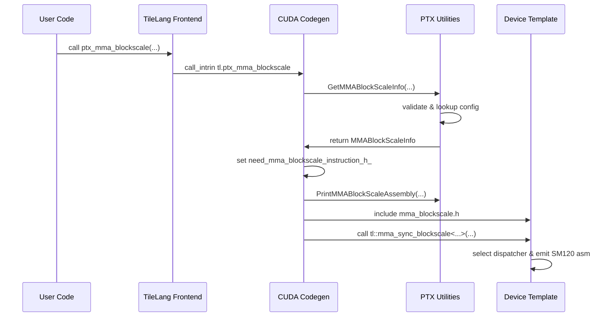

# [PR #2253] Add SM120 dense block-scaled MMA and essential support for SageAttention3

source: https://github.com/tile-ai/tilelang/pull/2253
state: open | updated: 2026-09-20T17:00:19Z
labels: 

## 正文

## Summary

This PR adds SM120 block-scale MMA support and the TileLang compiler/runtime features needed to implement SageAttention3 FP4 raw-core kernels in pure TileLang. It introduces a generic `T.ptx_mma_blockscale` intrinsic for `mxf8f6f4` and `mxf4nvf4`, adds the SM120 SageAttention3 FP4 example kernel, and fixes reduce/storage-sync lowering needed by the new path and existing language tests.

## Changes

- Add `tl.ptx_mma_blockscale` builtin and Python frontend bindings.
- Add CUDA codegen support for lowering block-scale MMA calls through `tl::mma_sync_blockscale`.
- Add `mma_blockscale.h` with SM120 block-scale MMA dispatcher specializations.
- Add PTX-side validation metadata for supported block-scale MMA configs:
  - `mxf8f6f4`, `m16n8k32`, `scale_vec=1`, `ue8m0`
  - `mxf4nvf4`, `m16n8k64`, `scale_vec=2`, `ue8m0`
  - `mxf4nvf4`, `m16n8k64`, `scale_vec=4`, `ue4m3`
- Add `PrintMMABlockScaleAssembly` helpers and shared dtype/string mapping for block-scale MMA validation.

- Add `T.pack_b16` for packing four b16 values into a global store.
- Add `examples/sage_attention_sm120` with a pure TileLang SM120 SageAttention3 FP4 raw-core kernel and helper macros.
- Extend `T.ptx_ldmatrix` with optional matrix shape/dtype metadata and add CUDA lowering for `m8n16.x4.shared.b8x16.b4x16_p64`.
- Add `T.lds32` and CUDA shared-memory 32-bit load helpers for packed scale/FP4 data paths.
- Add strict `T.copy(..., prefer_instruction="ldsm"|"stsm")` handling so matrix-copy requests fail clearly instead of silently falling back.
- Add `T.tma_copy(..., tma_element_dtype=...)` and improve TMA descriptor projection, folded base offsets, `elem_offset` handling, and transaction-byte accounting.
- Preserve explicit pack lanes when reshaping packed byte/sub-byte layouts.
- Add `role_scoped=True` allocation support so branch-local register arrays can stay inside warp-specialized producer/consumer roles.
- Improve CUDA codegen for scoped `pragma_unroll_factor`, aligned narrow local allocations, and FP4 local `address_of`.

- Update `ReduceLowerer` batch handling to clamp requested batch size to the physical per-thread output element count before divisibility checks.
- Use float32 temporary accumulators for fp16/bf16 `sum` and `abssum`, then cast back to the destination dtype.
- Avoid packed fp16/bf16 sum reducers where low-precision pairwise accumulation can exceed existing reduce-test tolerances.
- Remove allocation-wide alias ranges from thread-storage-sync disjointness proofs so pointer/buffer conflict checks stay conservative.

- Add handle byte offset support in TMA descriptor parsing for nvrtc

<!-- This is an auto-generated comment: release notes by coderabbit.ai -->
## Summary by CodeRabbit

* **New Features**
  * Added SM120 block‑scaled MMA intrinsic with scale‑vector support and runtime dispatch.
  * Frontend/TIR/TileLang APIs exposed for the new intrinsic and a pack_b16(v0, v1) helper.
* **Chores**
  * CUDA backend and codegen updated to emit the block‑scale MMA assembly and wire the intrinsic.
  * Backend builtin registered so the intrinsic is available to the compiler stack.

<!-- review_stack_entry_start -->

[](https://app.coderabbit.ai/change-stack/tile-ai/tilelang/pull/2253?utm_source=github_walkthrough&utm_medium=github&utm_campaign=change_stack)

<!-- review_stack_entry_end -->
<!-- end of auto-generated comment: release notes by coderabbit.ai -->

## 评论 (3)

### github-actions[bot] · 2026-05-23

👋 Hi! Thank you for contributing to the **TileLang** project.

Please remember to run `pre-commit run --all-files` in the root directory of the project to ensure your changes are properly linted and formatted. This will help ensure your contribution passes the format check.

We appreciate you taking this step! Our team will review your contribution, and we look forward to your awesome work! 🚀

### coderabbitai[bot] · 2026-05-23

<!-- This is an auto-generated comment: summarize by coderabbit.ai -->
<!-- This is an auto-generated comment: review paused by coderabbit.ai -->

> [!NOTE]
> ## Reviews paused
> 
> It looks like this branch is under active development. To avoid overwhelming you with review comments due to an influx of new commits, CodeRabbit has automatically paused this review. You can configure this behavior by changing the `reviews.auto_review.auto_pause_after_reviewed_commits` setting.
> 
> Use the following commands to manage reviews:
> - `@coderabbitai resume` to resume automatic reviews.
> - `@coderabbitai review` to trigger a single review.
> 
> Use the checkboxes below for quick actions:
> - [ ] <!-- {"checkboxId": "7f6cc2e2-2e4e-497a-8c31-c9e4573e93d1"} --> ▶️ Resume reviews
> - [ ] <!-- {"checkboxId": "e9bb8d72-00e8-4f67-9cb2-caf3b22574fe"} --> 🔍 Trigger review

<!-- end of auto-generated comment: review paused by coderabbit.ai -->
<!-- walkthrough_start -->

<details>
<summary>📝 Walkthrough</summary>

## Walkthrough

Adds a TileLang intrinsic `ptx_mma_blockscale` (SM120 block-scaled MMA) with PTX config/assembly helpers, CUDA device template `mma_sync_blockscale`, codegen emission, and a frontend `pack_b16` helper and exports.

## Changes

**Blackwell SM120 Intrinsics**

|Layer / File(s)|Summary|
|---|---|
|**Op registration** <br> `src/op/builtin.h`, `src/op/builtin.cc`|Declares and registers `tl.ptx_mma_blockscale` (17 inputs, opaque effect).|
|**PTX codegen utilities** <br> `src/backend/cuda/codegen/ptx.h`, `src/backend/cuda/codegen/ptx.cc`|Adds `DTypeToString`, `MMABlockScaleInfo`, `GetMMABlockScaleInfo`, `GetMMABlockScaleOperands`, and `PrintMMABlockScaleAssembly` to validate configs and emit `mma.sync.aligned ... .block_scale` PTX assembly.|
|**SM120 device template** <br> `src/tl_templates/cuda/instruction/mma_blockscale.h`|Implements device-side dispatch, SM120 inline-assembly macros, concrete impls for supported dtype/scale combinations, and `tl::mma_sync_blockscale` API.|
|**CUDA codegen integration** <br> `src/backend/cuda/codegen/codegen_cuda.h`, `src/backend/cuda/codegen/codegen_cuda.cc`|Adds `need_mma_blockscale_instruction_h_` flag; `Finish()` conditionally includes `mma_blockscale.h`; visitor lowers `tl.ptx_mma_blockscale` calls to `tl::mma_sync_blockscale<...>(...)`.|
|**TileLang frontend and helpers** <br> `tilelang/language/builtin.py`, `tilelang/language/__init__.py`, `tilelang/language/ast/ir.py`, `tilelang/language/tir/ir.py`, `tilelang/language/tir/op.py`|Adds `pack_b16` helper, exposes and forwards `ptx_mma_blockscale` through TIR/AST layers, and re-exports helper in package `__init__`.|

## Sequence Diagram



🎯 4 (Complex) | ⏱️ ~45 minutes

- Possibly related issues
  - tile-ai/tilelang#1927 — aligns with adding hardware block-scaled MMA intrinsic and codegen.

- Suggested reviewers
  - chengyupku
  - LeiWang1999

> "🐰 I packed two b16s into a word with care,  
> PTX strings hummed, and templates took the air,  
> From TileLang call down to SM120's lair,  
> Block-scale fma leapt fast and fair,  
> My whiskers twitch — math dancing there."

</details>

<!-- walkthrough_end -->
<!-- pre_merge_checks_walkthrough_start -->

<details>
<summary>🚥 Pre-merge checks | ✅ 4 | ❌ 1</summary>

### ❌ Failed checks (1 warning)

|     Check name     | Status     | Explanation                                                                           | Resolution                                                                         |
| :----------------: | :--------- | :------------------------------------------------------------------------------------ | :--------------------------------------------------------------------------------- |
| Docstring Coverage | ⚠️ Warning | Docstring coverage is 33.33% which is insufficient. The required threshold is 80.00%. | Write docstrings for the functions missing them to satisfy the coverage threshold. |

<details>
<summary>✅ Passed checks (4 passed)</summary>

|         Check name         | Status   | Explanation                                                                                                                                                                                                                     |
| :------------------------: | :------- | :------------------------------------------------------------------------------------------------------------------------------------------------------------------------------------------------------------------------------ |
|     Linked Issues check    | ✅ Passed | Check skipped because no linked issues were found for this pull request.                                                                                                                                                        |
| Out of Scope Changes check | ✅ Passed | Check skipped because no linked issues were found for this pull request.                                                                                                                                                        |
|         Title check        | ✅ Passed | The PR title directly matches the main objective: adding SM120 dense block-scaled MMA support. It accurately summarizes the primary change across multiple files (builtin ops, CUDA codegen, PTX support, and Python bindings). |
|      Description Check     | ✅ Passed | Check skipped - CodeRabbit’s high-level summary is enabled.                                                                                                                                                                     |

</details>

<sub>✏️ Tip: You can configure your own custom pre-merge checks in the settings.</sub>

</details>

<!-- pre_merge_checks_walkthrough_end -->
<!-- finishing_touch_checkbox_start -->

<details>
<summary>✨ Finishing Touches</summary>

<details>
<summary>🧪 Generate unit tests (beta)</summary>

- [ ] <!-- {"checkboxId": "f47ac10b-58cc-4372-a567-0e02b2c3d479", "radioGroupId": "utg-output-choice-group-unknown_comment_id"} -->   Create PR with unit tests

</details>

</details>

<!-- finishing_touch_checkbox_end -->
<!-- tips_start -->

---

Thanks for using [CodeRabbit](https://coderabbit.ai?utm_source=oss&utm_medium=github&utm_campaign=tile-ai/tilelang&utm_content=2253)! It's free for OSS, and your support helps us grow. If you like it, consider giving us a shout-out.

<details>
<summary>❤️ Share</summary>

- [X](https://twitter.com/intent/tweet?text=I%20just%20used%20%40coderabbitai%20for%20my%20code%20review%2C%20and%20it%27s%20fantastic%21%20It%27s%20free%20for%20OSS%20and%20offers%20a%20free%20trial%20for%20the%20proprietary%20code.%20Check%20it%20out%3A&url=https%3A//coderabbit.ai)
- [Mastodon](https://mastodon.social/share?text=I%20just%20used%20%40coderabbitai%20for%20my%20code%20review%2C%20and%20it%27s%20fantastic%21%20It%27s%20free%20for%20OSS%20and%20offers%20a%20free%20trial%20for%20the%20proprietary%20code.%20Check%20it%20out%3A%20https%3A%2F%2Fcoderabbit.ai)
- [Reddit](https://www.reddit.com/submit?title=Great%20tool%20for%20code%20review%20-%20CodeRabbit&text=I%20just%20used%20CodeRabbit%20for%20my%20code%20review%2C%20and%20it%27s%20fantastic%21%20It%27s%20free%20for%20OSS%20and%20offers%20a%20free%20trial%20for%20proprietary%20code.%20Check%20it%20out%3A%20https%3A//coderabbit.ai)
- [LinkedIn](https://www.linkedin.com/sharing/share-offsite/?url=https%3A%2F%2Fcoderabbit.ai&mini=true&title=Great%20tool%20for%20code%20review%20-%20CodeRabbit&summary=I%20just%20used%20CodeRabbit%20for%20my%20code%20review%2C%20and%20it%27s%20fantastic%21%20It%27s%20free%20for%20OSS%20and%20offers%20a%20free%20trial%20for%20proprietary%20code)

</details>


<sub>Comment `@coderabbitai help` to get the list of available commands.</sub>

<!-- tips_end -->

### Rachmanino · 2026-06-11

Thanks for your contribution! A recent pr introduce support for tcgen5 fp4 blockscaled gemm, and I personally recommend following similar API standard:) 

## Review (8)

### coderabbitai[bot] · 2026-05-23 · COMMENTED


> [!CAUTION]
> Some comments are outside the diff and can’t be posted inline due to platform limitations.
> 
> 
> 
> <details>
> <summary>⚠️ Outside diff range comments (1)</summary><blockquote>
> 
> <details>
> <summary>src/backend/cuda/codegen/codegen_cuda.cc (1)</summary><blockquote>
> 
> `4435-4443`: _⚠️ Potential issue_ | _🟠 Major_ | _⚡ Quick win_
> 
> **Apply packed int4/int1 shared-size normalization to `shared.warp` too.**
> 
> `shared.warp` now allocates via the shared-memory path, but the packed-size adjustment still only checks `scope == "shared"`. That over-allocates shared memory for packed int4/int1 buffers and can push kernels over shared-memory limits.
> 
>  
> 
> <details>
> <summary>Suggested fix</summary>
> 
> ```diff
> -    if ((alloc_dtype == DataType::Int(4) || alloc_dtype == DataType::UInt(4)) &&
> -        scope == "shared") {
> +    if ((alloc_dtype == DataType::Int(4) || alloc_dtype == DataType::UInt(4)) &&
> +        (scope == "shared" || scope == "shared.warp")) {
>        constant_size = (constant_size + 1) / 2;
> -    } else if (alloc_dtype == DataType::Int(1) && scope == "shared") {
> +    } else if (alloc_dtype == DataType::Int(1) &&
> +               (scope == "shared" || scope == "shared.warp")) {
>        constant_size = constant_size / 32;
>      }
> ```
> </details>
> 
> <details>
> <summary>🤖 Prompt for AI Agents</summary>
> 
> ```
> Verify each finding against current code. Fix only still-valid issues, skip the
> rest with a brief reason, keep changes minimal, and validate.
> 
> In `@src/backend/cuda/codegen/codegen_cuda.cc` around lines 4435 - 4443, The
> shared-memory size normalization for packed types only runs when scope ==
> "shared", causing over-allocation for scope == "shared.warp"; update the
> normalization logic around alloc_dtype/DataType::Int(4)/DataType::UInt(4) and
> DataType::Int(1) so it applies when scope is "shared" or "shared.warp" (same
> predicate used later where stream emits vid and constant_size), i.e., broaden
> the condition that adjusts constant_size to include "shared.warp" so packed
> int4/int1 buffers get the same division handling before emitting the
> declaration.
> ```
> 
> </details>
> 
> </blockquote></details>
> 
> </blockquote></details>

<details>
<summary>🤖 Prompt for all review comments with AI agents</summary>

```
Verify each finding against current code. Fix only still-valid issues, skip the
rest with a brief reason, keep changes minimal, and validate.

Outside diff comments:
In `@src/backend/cuda/codegen/codegen_cuda.cc`:
- Around line 4435-4443: The shared-memory size normalization for packed types
only runs when scope == "shared", causing over-allocation for scope ==
"shared.warp"; update the normalization logic around
alloc_dtype/DataType::Int(4)/DataType::UInt(4) and DataType::Int(1) so it
applies when scope is "shared" or "shared.warp" (same predicate used later where
stream emits vid and constant_size), i.e., broaden the condition that adjusts
constant_size to include "shared.warp" so packed int4/int1 buffers get the same
division handling before emitting the declaration.
```

</details>

---

<details>
<summary>ℹ️ Review info</summary>

<details>
<summary>⚙️ Run configuration</summary>

**Configuration used**: defaults

**Review profile**: CHILL

**Plan**: Pro

**Run ID**: `c341c0d4-8d51-4c8c-8f60-7f5a9dedefe1`

</details>

<details>
<summary>📥 Commits</summary>

Reviewing files that changed from the base of the PR and between bc310e08d843a693169d704ff2b4ab9abde704a3 and cc551670682088354c9775f3d147f1cd100adff9.

</details>

<details>
<summary>📒 Files selected for processing (9)</summary>

* `src/backend/cuda/codegen/codegen_cuda.cc`
* `src/op/builtin.cc`
* `src/op/builtin.h`
* `src/tl_templates/cuda/instruction/mma.h`
* `tilelang/language/__init__.py`
* `tilelang/language/ast/ir.py`
* `tilelang/language/builtin.py`
* `tilelang/language/tir/ir.py`
* `tilelang/language/tir/op.py`

</details>

</details>

<!-- This is an auto-generated comment by CodeRabbit for review status -->

### coderabbitai[bot] · 2026-05-23 · COMMENTED

**Actionable comments posted: 1**

<details>
<summary>🤖 Prompt for all review comments with AI agents</summary>

```
Verify each finding against current code. Fix only still-valid issues, skip the
rest with a brief reason, keep changes minimal, and validate.

Inline comments:
In `@src/backend/cuda/codegen/codegen_cuda.cc`:
- Around line 4485-4486: The shared.warp allocation path is routed to the same
emitter as "shared" but the packed-size adjustment for int4/int1 only checks
scope == "shared", causing over-allocation; update the packed-size calculation
(the branch that computes constant_size for int4/int1) to include scope ==
"shared.warp" so that constant_size is reduced for packed types when scope is
"shared" or "shared.warp", keeping the allocation emission that writes
vid[constant_size] consistent with the sizing logic.
```

</details>

<details>
<summary>🪄 Autofix (Beta)</summary>

Fix all unresolved CodeRabbit comments on this PR:

- [ ] <!-- {"checkboxId": "4b0d0e0a-96d7-4f10-b296-3a18ea78f0b9"} --> Push a commit to this branch (recommended)
- [ ] <!-- {"checkboxId": "ff5b1114-7d8c-49e6-8ac1-43f82af23a33"} --> Create a new PR with the fixes

</details>

---

<details>
<summary>ℹ️ Review info</summary>

<details>
<summary>⚙️ Run configuration</summary>

**Configuration used**: defaults

**Review profile**: CHILL

**Plan**: Pro

**Run ID**: `bf228a2c-d8d6-4963-b54a-bab9bd7c5652`

</details>

<details>
<summary>📥 Commits</summary>

Reviewing files that changed from the base of the PR and between cc551670682088354c9775f3d147f1cd100adff9 and 47dd240a4f15ae9894ac7d486e055975588a0600.

</details>

<details>
<summary>📒 Files selected for processing (10)</summary>

* `src/backend/cuda/codegen/codegen_cuda.cc`
* `src/op/builtin.cc`
* `src/op/builtin.h`
* `src/tl_templates/cuda/instruction/mma.h`
* `src/tl_templates/cuda/instruction/mma_blockscale.h`
* `tilelang/language/__init__.py`
* `tilelang/language/ast/ir.py`
* `tilelang/language/builtin.py`
* `tilelang/language/tir/ir.py`
* `tilelang/language/tir/op.py`

</details>

<details>
<summary>✅ Files skipped from review due to trivial changes (1)</summary>

* tilelang/language/__init__.py

</details>

</details>

<!-- This is an auto-generated comment by CodeRabbit for review status -->

### coderabbitai[bot] · 2026-05-23 · COMMENTED

**Actionable comments posted: 3**

<details>
<summary>🧹 Nitpick comments (1)</summary><blockquote>

<details>
<summary>src/backend/cuda/codegen/ptx.cc (1)</summary><blockquote>

`1138-1153`: _⚡ Quick win_

**Make the operand numbering explicit.**

This `templates << ... << arg_counter++ ...` chain is already tripping static analysis and is harder than necessary to reason about. Building each placeholder group in separate steps keeps the numbering deterministic and easier to audit.  


<details>
<summary>Proposed cleanup</summary>

```diff
 inline std::tuple<std::string, std::string, std::string>
 GetMMABlockScaleOperands() {
   std::stringstream templates, inputs, outputs;

   int arg_counter = 0;
-  templates << "{%" << arg_counter++ << ", %" << arg_counter++ << ", %"
-            << arg_counter++ << ", %" << arg_counter++ << "}, ";
-  templates << "{%" << arg_counter++ << ", %" << arg_counter++ << ", %"
-            << arg_counter++ << ", %" << arg_counter++ << "}, ";
-  templates << "{%" << arg_counter++ << ", %" << arg_counter++ << "}, ";
-  templates << "{%" << arg_counter++ << ", %" << arg_counter++ << ", %"
-            << arg_counter++ << ", %" << arg_counter++ << "}, ";
-  templates << "{%" << arg_counter++ << "}, {%" << arg_counter++ << ", %"
-            << arg_counter++ << "}, ";
-  templates << "{%" << arg_counter++ << "}, {%" << arg_counter++ << ", %"
-            << arg_counter++ << "}";
+  auto append_group = [&](int count) {
+    templates << "{";
+    for (int i = 0; i < count; ++i) {
+      if (i != 0) {
+        templates << ", ";
+      }
+      templates << "%" << arg_counter++;
+    }
+    templates << "}";
+  };
+  append_group(4);
+  templates << ", ";
+  append_group(4);
+  templates << ", ";
+  append_group(2);
+  templates << ", ";
+  append_group(4);
+  templates << ", ";
+  append_group(1);
+  templates << ", ";
+  append_group(2);
+  templates << ", ";
+  append_group(1);
+  templates << ", ";
+  append_group(2);
```
</details>

<details>
<summary>🤖 Prompt for AI Agents</summary>

```
Verify each finding against current code. Fix only still-valid issues, skip the
rest with a brief reason, keep changes minimal, and validate.

In `@src/backend/cuda/codegen/ptx.cc` around lines 1138 - 1153, The
GetMMABlockScaleOperands function builds a template string using repeated inline
arg_counter++ expressions which is hard to read and flags static analysis;
replace the chained templates << ... << arg_counter++ sequences by constructing
each placeholder group in separate steps: declare arg_counter, then for each
group create a local string or use templates << with explicit placeholders using
arg_counter, incrementing arg_counter in its own statement after each
placeholder (e.g., set int idx = arg_counter++; templates << "{%" << idx << ",
%" << (arg_counter++) << ", %" << (arg_counter++) << ", %" << (arg_counter++) <<
"}, "; etc.), so the numbering is explicit and deterministic while preserving
the exact order produced by the current GetMMABlockScaleOperands implementation.
```

</details>

</blockquote></details>

</blockquote></details>

<details>
<summary>🤖 Prompt for all review comments with AI agents</summary>

```
Verify each finding against current code. Fix only still-valid issues, skip the
rest with a brief reason, keep changes minimal, and validate.

Inline comments:
In `@src/backend/cuda/codegen/codegen_cuda.cc`:
- Around line 2613-2668: The MMA blockscale branch forwards raw element offsets
into the pointer arithmetic registrations "(A_offset)" and "(B_offset)" but for
packed 4-bit dtypes (MXF4/NVF4) those logical element indices must be normalized
to byte offsets (divide by 2) like the ptx_mma()/GetBufferRef() paths do; modify
code around where replacer.register_rule("(A_offset)", a_offset) and
replacer.register_rule("(B_offset)", b_offset) to detect packed 4-bit types (use
the dtype_a_enum/dtype_b_enum values from DTypeFromString/DTypeEnumToString) and
replace a_offset/b_offset with an expression that divides the offset by 2 (or
otherwise converts element index to byte index) before registering the rules.
- Around line 3693-3716: The bf16 packing path in the tl::stg64_pack_b16
lowering in codegen_cuda.cc builds the uint2 payload using __pack_half2 which is
for FP16 and will mispack nv_bfloat16 inputs; update the tl::stg64_pack_b16
branch (the block that prints the uint2{__pack_half2(...), __pack_half2(...)}
payload via PrintExpr on op->args[1..4]) to detect when the operand element type
is bf16 (nv_bfloat16 / bfloat16_t) and emit the BF16-specific vector pack
intrinsic (e.g., __pack_nv_bfloat162 or the appropriate cuda_bf16.h helper)
instead of __pack_half2 for those operands, and ensure the bf16 helper header is
included or the intrinsic is available before emission so the resulting u32
lanes contain correct BF16 encodings.

In `@src/tl_templates/cuda/instruction/mma_blockscale.h`:
- Around line 5-8: The header conditionally excludes <type_traits> and <utility>
when __CUDACC_RTC__ is defined but the file (mma_blockscale.h) uses
std::remove_extent_t, std::extent_v, std::index_sequence,
std::make_index_sequence, std::is_same_v, std::is_void_v and
std::integral_constant unconditionally; update the includes so those headers are
available for the __CUDACC_RTC__ path—i.e., move or add `#include` <type_traits>
and `#include` <utility> outside the `#ifndef` __CUDACC_RTC__ guard (or add
equivalent includes within the RTC branch) so the symbols used by
functions/types in this header resolve during NVRTC/RTC compilation.

---

Nitpick comments:
In `@src/backend/cuda/codegen/ptx.cc`:
- Around line 1138-1153: The GetMMABlockScaleOperands function builds a template
string using repeated inline arg_counter++ expressions which is hard to read and
flags static analysis; replace the chained templates << ... << arg_counter++
sequences by constructing each placeholder group in separate steps: declare
arg_counter, then for each group create a local string or use templates << with
explicit placeholders using arg_counter, incrementing arg_counter in its own
statement after each placeholder (e.g., set int idx = arg_counter++; templates
<< "{%" << idx << ", %" << (arg_counter++) << ", %" << (arg_counter++) << ", %"
<< (arg_counter++) << "}, "; etc.), so the numbering is explicit and
deterministic while preserving the exact order produced by the current
GetMMABlockScaleOperands implementation.
```

</details>

<details>
<summary>🪄 Autofix (Beta)</summary>

Fix all unresolved CodeRabbit comments on this PR:

- [ ] <!-- {"checkboxId": "4b0d0e0a-96d7-4f10-b296-3a18ea78f0b9"} --> Push a commit to this branch (recommended)
- [ ] <!-- {"checkboxId": "ff5b1114-7d8c-49e6-8ac1-43f82af23a33"} --> Create a new PR with the fixes

</details>

---

<details>
<summary>ℹ️ Review info</summary>

<details>
<summary>⚙️ Run configuration</summary>

**Configuration used**: defaults

**Review profile**: CHILL

**Plan**: Pro

**Run ID**: `372a95d2-8b3c-4572-8e0b-abaac6f806a0`

</details>

<details>
<summary>📥 Commits</summary>

Reviewing files that changed from the base of the PR and between 47dd240a4f15ae9894ac7d486e055975588a0600 and 70203e286ff3d62367892d4c1e3b259ba15e3664.

</details>

<details>
<summary>📒 Files selected for processing (12)</summary>

* `src/backend/cuda/codegen/codegen_cuda.cc`
* `src/backend/cuda/codegen/codegen_cuda.h`
* `src/backend/cuda/codegen/ptx.cc`
* `src/backend/cuda/codegen/ptx.h`
* `src/op/builtin.cc`
* `src/op/builtin.h`
* `src/tl_templates/cuda/instruction/mma_blockscale.h`
* `tilelang/language/__init__.py`
* `tilelang/language/ast/ir.py`
* `tilelang/language/builtin.py`
* `tilelang/language/tir/ir.py`
* `tilelang/language/tir/op.py`

</details>

<details>
<summary>✅ Files skipped from review due to trivial changes (2)</summary>

* tilelang/language/tir/ir.py
* tilelang/language/__init__.py

</details>

</details>

<!-- This is an auto-generated comment by CodeRabbit for review status -->

### coderabbitai[bot] · 2026-05-23 · COMMENTED

**Actionable comments posted: 1**

<details>
<summary>🧹 Nitpick comments (1)</summary><blockquote>

<details>
<summary>src/backend/cuda/codegen/ptx.cc (1)</summary><blockquote>

`1142-1153`: _⚡ Quick win_

**Don’t treat this as a correctness bug for C++17 (`<<` is sequenced)**
Given this project builds with C++17 (`CMAKE_CXX_STANDARD 17`), the chained `std::stringstream <<` insertions are sequenced in chain order (each `E1 << E2` sequences side effects of the left operand before the right). So the `%N` placeholder numbering here should not permute, and the reported evaluation-order risk is unlikely to apply.
Optional: refactor the stream-building to avoid `arg_counter++` inline for readability, but it’s not required for correctness.

<details>
<summary>🤖 Prompt for AI Agents</summary>

```
Verify each finding against current code. Fix only still-valid issues, skip the
rest with a brief reason, keep changes minimal, and validate.

In `@src/backend/cuda/codegen/ptx.cc` around lines 1142 - 1153, The stream
construction uses multiple inline arg_counter++ side-effects inside chained
templates << operations (symbols: arg_counter, templates in ptx.cc) which is
legal under C++17 but harms readability and risks future confusion; refactor by
computing the placeholder numbers into local ints (e.g., n0 = arg_counter++; n1
= arg_counter++; ...) or by using a small helper function/loop to generate each
"{%d, ...}" segment and then stream those variables into templates to remove
inline post-increments and make the intent explicit.
```

</details>

</blockquote></details>

</blockquote></details>

<details>
<summary>🤖 Prompt for all review comments with AI agents</summary>

```
Verify each finding against current code. Fix only still-valid issues, skip the
rest with a brief reason, keep changes minimal, and validate.

Inline comments:
In `@tilelang/language/ast/ir.py`:
- Around line 1883-1885: The export for ptx_mma_blockscale is currently exposing
the raw _tir_op.ptx_mma_blockscale and thus doesn't accept the dtype= calling
convention; wrap it with the same helper used for the other PTX MMA helpers by
assigning ptx_mma_blockscale = _dtype_forward(_tir_op.ptx_mma_blockscale) so it
behaves like ptx_mma and ptx_mma_sp and supports the dtype= argument.

---

Nitpick comments:
In `@src/backend/cuda/codegen/ptx.cc`:
- Around line 1142-1153: The stream construction uses multiple inline
arg_counter++ side-effects inside chained templates << operations (symbols:
arg_counter, templates in ptx.cc) which is legal under C++17 but harms
readability and risks future confusion; refactor by computing the placeholder
numbers into local ints (e.g., n0 = arg_counter++; n1 = arg_counter++; ...) or
by using a small helper function/loop to generate each "{%d, ...}" segment and
then stream those variables into templates to remove inline post-increments and
make the intent explicit.
```

</details>

<details>
<summary>🪄 Autofix (Beta)</summary>

Fix all unresolved CodeRabbit comments on this PR:

- [ ] <!-- {"checkboxId": "4b0d0e0a-96d7-4f10-b296-3a18ea78f0b9"} --> Push a commit to this branch (recommended)
- [ ] <!-- {"checkboxId": "ff5b1114-7d8c-49e6-8ac1-43f82af23a33"} --> Create a new PR with the fixes

</details>

---

<details>
<summary>ℹ️ Review info</summary>

<details>
<summary>⚙️ Run configuration</summary>

**Configuration used**: defaults

**Review profile**: CHILL

**Plan**: Pro

**Run ID**: `3a19daae-e26a-4e11-8205-e0bb4c02d8f5`

</details>

<details>
<summary>📥 Commits</summary>

Reviewing files that changed from the base of the PR and between 70203e286ff3d62367892d4c1e3b259ba15e3664 and e4d73c98f4d4b1aba21462510fedb29263d4af89.

</details>

<details>
<summary>📒 Files selected for processing (12)</summary>

* `src/backend/cuda/codegen/codegen_cuda.cc`
* `src/backend/cuda/codegen/codegen_cuda.h`
* `src/backend/cuda/codegen/ptx.cc`
* `src/backend/cuda/codegen/ptx.h`
* `src/op/builtin.cc`
* `src/op/builtin.h`
* `src/tl_templates/cuda/instruction/mma_blockscale.h`
* `tilelang/language/__init__.py`
* `tilelang/language/ast/ir.py`
* `tilelang/language/builtin.py`
* `tilelang/language/tir/ir.py`
* `tilelang/language/tir/op.py`

</details>

<details>
<summary>✅ Files skipped from review due to trivial changes (1)</summary>

* tilelang/language/__init__.py

</details>

</details>

<!-- This is an auto-generated comment by CodeRabbit for review status -->

### coderabbitai[bot] · 2026-05-24 · COMMENTED

**Actionable comments posted: 1**

<details>
<summary>🤖 Prompt for all review comments with AI agents</summary>

```
Verify each finding against current code. Fix only still-valid issues, skip the
rest with a brief reason, keep changes minimal, and validate.

Inline comments:
In `@src/backend/cuda/codegen/ptx.cc`:
- Around line 1399-1402: The registered placeholder keys are wrong:
replacer.register_rule currently uses "{.alayout}" and "{.blayout}" but the
assembly template expects .{alayout} and .{blayout}, so the tokens never match.
Update the calls to register_rule to register "{alayout}" -> "." + A_layout and
"{blayout}" -> "." + B_layout (keep the same values), ensuring
replacer.register_rule is called with "{alayout}" and "{blayout}" so the
template's .{alayout}/.{blayout} are replaced correctly; look for the
replacer.register_rule calls and the A_layout/B_layout variables in the PTX
lowering code.
```

</details>

<details>
<summary>🪄 Autofix (Beta)</summary>

Fix all unresolved CodeRabbit comments on this PR:

- [ ] <!-- {"checkboxId": "4b0d0e0a-96d7-4f10-b296-3a18ea78f0b9"} --> Push a commit to this branch (recommended)
- [ ] <!-- {"checkboxId": "ff5b1114-7d8c-49e6-8ac1-43f82af23a33"} --> Create a new PR with the fixes

</details>

---

<details>
<summary>ℹ️ Review info</summary>

<details>
<summary>⚙️ Run configuration</summary>

**Configuration used**: defaults

**Review profile**: CHILL

**Plan**: Pro

**Run ID**: `dfa45c48-586f-4bef-9532-d87dbc6933b7`

</details>

<details>
<summary>📥 Commits</summary>

Reviewing files that changed from the base of the PR and between e4d73c98f4d4b1aba21462510fedb29263d4af89 and dd693f05e5a5704a39a6ccce8e29ae2e2b0536e3.

</details>

<details>
<summary>📒 Files selected for processing (12)</summary>

* `src/backend/cuda/codegen/codegen_cuda.cc`
* `src/backend/cuda/codegen/codegen_cuda.h`
* `src/backend/cuda/codegen/ptx.cc`
* `src/backend/cuda/codegen/ptx.h`
* `src/op/builtin.cc`
* `src/op/builtin.h`
* `src/tl_templates/cuda/instruction/mma_blockscale.h`
* `tilelang/language/__init__.py`
* `tilelang/language/ast/ir.py`
* `tilelang/language/builtin.py`
* `tilelang/language/tir/ir.py`
* `tilelang/language/tir/op.py`

</details>

</details>

<!-- This is an auto-generated comment by CodeRabbit for review status -->

### Rachmanino · 2026-06-11 · COMMENTED

(no text)

### sepcnt · 2026-06-11 · COMMENTED

(no text)

### Rachmanino · 2026-06-17 · COMMENTED

(no text)
