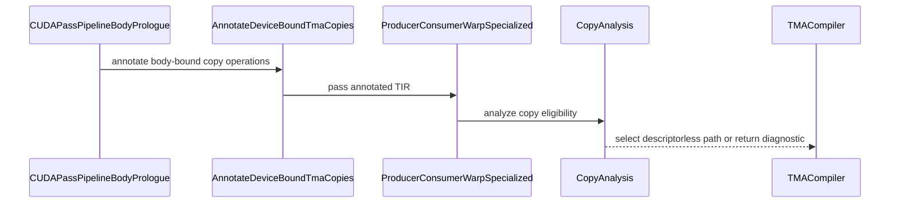

# [PR #2803] [BugFix] Skip descriptor TMA for device-bound copy bases

source: https://github.com/tile-ai/tilelang/pull/2803
state: closed | updated: 2026-09-18T11:55:57Z
labels: 

## 正文

## Summary

This PR is an alternative implementation of a previous PR: https://github.com/tile-ai/tilelang/pull/2687. Thanks @Lyscoria for for the initial exploration and attempts.

- mark tile copies whose global base pointer is bound inside the function body before warp-specialized classification
- make CUDA CopyAnalysis reject only host-side TensorMap descriptor paths for those copies
- preserve descriptorless BulkLoad1D and BulkStore1D selection
- allow pointer-table grouped GEMM to compile and run with the default SM90 pipeline

## Testing

- native CMake and Ninja build
- test_tiled_ws_skips_device_bound_tma_descriptor_base
- test_device_bound_pointer_keeps_descriptorless_bulk1d
- test_copy_prefer_tma_lowers_as_synchronous_tma_load
- test_pointer_table_grouped_matmul on CUDA
- clang-format, Ruff check, and Ruff format

Fixes #2549

<!-- This is an auto-generated comment: release notes by coderabbit.ai -->
## Summary

- Added `attr::kTmaDescriptorBaseIsDeviceBound` and a CUDA PrimFunc pass (`AnnotateDeviceBoundTmaCopies`) that annotates copy/tma ops whose global endpoint base is device-bound (computed in-kernel).
- Updated CUDA copy analysis to record `tma_descriptor_base_is_device_bound` and to forcibly disable descriptor-based TMA bulk lowering paths in this case, while preserving descriptorless `BulkLoad1D`/`BulkStore1D` selection.
- Improved unsupported/rejection diagnostics and instruction selection: `tile::gather4` / `tile::scatter4` now reject descriptor-based TMA when the descriptor base is device-bound, explaining that TensorMap descriptors are host-encoded and that a plain `T.copy`/descriptorless fallback is required.
- Inserted `AnnotateDeviceBoundTmaCopies` into the CUDA pipeline so pointer-table grouped GEMM compiles/runs under the default SM90 warp-specialized pipeline without triggering the previous `MakePackedAPI` failure.
- Added regression tests covering: device-bound pointer behavior staying descriptorless (no `CUtensorMap`), descriptor-based TMA rejection when warp specialization is disabled, and producer/consumer WS behavior skipping the annotated device-bound TMA descriptor-base case.

## C++ style / lint notes

- This PR touches C++ implementation and C++-level exported attributes/passes (`src/cuda/op/copy_analysis.cc`, `src/op/builtin.h`, and the new `src/cuda/transform/annotate_device_bound_tma_copies.cc`), so review against `docs/developer_guide/cpp_style.md` is relevant (notably formatting/includes, naming, and FFI-visible API/registration considerations).
- CI runs the “C++ API Style Audit (warning only)” (`python3 maint/scripts/audit_cpp_api_style.py`); any newly reported advisory findings should be treated as suggestions. Unless a finding indicates an actual new FFI/maintainability risk introduced by this PR, it should not be considered a correctness/build blocker.
<!-- end of auto-generated comment: release notes by coderabbit.ai -->

## 评论 (2)

### github-actions[bot] · 2026-07-29

👋 Hi! Thank you for contributing to the **TileLang** project.

Please remember to run `pre-commit run --all-files` in the root directory of the project to ensure your changes are properly linted and formatted. This will help ensure your contribution passes the format check.

We appreciate you taking this step! Our team will review your contribution, and we look forward to your awesome work! 🚀

### coderabbitai[bot] · 2026-07-29

<!-- This is an auto-generated comment: summarize by coderabbit.ai -->
<!-- review_stack_entry_start -->

<!-- review_stack_entry_end -->
No actionable comments were generated in the recent review. 🎉

ℹ️ Recent review info

⚙️ Run configuration

**Configuration used**: Path: .coderabbit.yaml

**Review profile**: CHILL

**Plan**: Pro Plus

**Run ID**: `191a1d07-5770-4dac-b60d-25980a7ebb8b`

📥 Commits

Reviewing files that changed from the base of the PR and between 1bff87ffa6be6d340f8869449ed8fd1747494fdd and d789b223444ae21e95517afc4fc0742a6927203c.

📒 Files selected for processing (1)

* `tilelang/cuda/pipeline.py`

---
<!-- walkthrough_start -->

📝 Walkthrough

## Walkthrough

Device-bound TMA annotations are introduced, propagated through CUDA lowering, and used to disable descriptor-based paths. A new pass marks matching copy operations before warp specialization, with regression tests covering descriptorless lowering, rejection diagnostics, and pointer-backed compilation.

### Changes

**Device-bound TMA handling**

|Layer / File(s)|Summary|
|---|---|
|**TMA eligibility and diagnostics**   `src/op/builtin.h`, `src/cuda/op/copy_analysis.cc`|Adds the device-bound annotation, records it in copy facts, disables descriptor-based bulk paths, and reports unsupported gather/scatter lowering.|
|**Device-bound copy annotation**   `src/cuda/transform/annotate_device_bound_tma_copies.cc`|Adds a pass that finds body-bound handles and annotates matching tile copy operations.|
|**CUDA pipeline integration**   `tilelang/cuda/pipeline.py`, `tilelang/cuda/transform/__init__.py`, `tilelang/tools/pass_visualizer/core.py`|Exposes and schedules the annotation pass after kernel launch materialization and before later transformations.|
|**Descriptorless lowering regression coverage**   `testing/python/language/test_tilelang_language_tma_copy.py`, `testing/python/transform/test_tilelang_transform_producer_consumer_ws.py`, `testing/python/language/test_tilelang_language_ptr.py`|Adds coverage for descriptorless lowering, rejection diagnostics, annotation behavior, warp-specialization skipping, and pointer-backed compilation defaults.|

**Estimated code review effort:** 3 (Moderate) | ~25 minutes

### Sequence Diagram(s)

**Possibly related PRs**

- [tile-ai/tilelang#2681](https://github.com/tile-ai/tilelang/pull/2681): Both changes modify copy analysis to gate descriptor-based TMA lowering.
- [tile-ai/tilelang#2687](https://github.com/tile-ai/tilelang/pull/2687): Both changes reject descriptor-based TMA for device-bound copy endpoints through copy-analysis tracking.

**Suggested reviewers:** `leiwang1999`

<!-- walkthrough_end -->
<!-- pre_merge_checks_walkthrough_start -->

🚥 Pre-merge checks | ✅ 5

✅ Passed checks (5 passed)

|         Check name         | Status   | Explanation                                                                                                                          |
| :------------------------: | :------- | :----------------------------------------------------------------------------------------------------------------------------------- |
|      Description Check     | ✅ Passed | Check skipped - CodeRabbit’s high-level summary is enabled.                                                                          |
|         Title check        | ✅ Passed | The title is concise and accurately summarizes the main change: skipping descriptor TMA for device-bound copy bases.                 |
|     Linked Issues check    | ✅ Passed | The PR implements device-bound TMA annotation, descriptorless fallback, and default-pipeline tests, matching the linked issue goals. |
| Out of Scope Changes check | ✅ Passed | The changes stay focused on device-bound TMA handling, pipeline integration, and regression tests with no clear unrelated additions. |
|     Docstring Coverage     | ✅ Passed | No functions found in the changed files to evaluate docstring coverage. Skipping docstring coverage check.                           |

<!-- pre_merge_checks_walkthrough_end -->
<!-- finishing_touch_checkbox_start -->

✨ Finishing Touches

📝 Generate docstrings

- [ ] <!-- {"checkboxId": "7962f53c-55bc-4827-bfbf-6a18da830691"} --> Create stacked PR
- [ ] <!-- {"checkboxId": "3e1879ae-f29b-4d0d-8e06-d12b7ba33d98"} --> Commit on current branch

🧪 Generate unit tests (beta)

- [ ] <!-- {"checkboxId": "f47ac10b-58cc-4372-a567-0e02b2c3d479", "radioGroupId": "utg-output-choice-group-unknown_comment_id"} -->   Create PR with unit tests
- [ ] <!-- {"checkboxId": "6ba7b810-9dad-11d1-80b4-00c04fd430c8", "radioGroupId": "utg-output-choice-group-unknown_comment_id"} -->   Commit unit tests in branch `skip-tma`

<!-- finishing_touch_checkbox_end -->
<!-- tips_start -->

---

Thanks for using [CodeRabbit](https://coderabbit.ai?utm_source=oss&utm_medium=github&utm_campaign=tile-ai/tilelang&utm_content=2803)! It's free for OSS, and your support helps us grow. If you like it, consider giving us a shout-out.

❤️ Share

- [X](https://twitter.com/intent/tweet?text=I%20just%20used%20%40coderabbitai%20for%20my%20code%20review%2C%20and%20it%27s%20fantastic%21%20It%27s%20free%20for%20OSS%20and%20offers%20a%20free%20trial%20for%20the%20proprietary%20code.%20Check%20it%20out%3A&url=https%3A//coderabbit.ai)
- [Mastodon](https://mastodon.social/share?text=I%20just%20used%20%40coderabbitai%20for%20my%20code%20review%2C%20and%20it%27s%20fantastic%21%20It%27s%20free%20for%20OSS%20and%20offers%20a%20free%20trial%20for%20the%20proprietary%20code.%20Check%20it%20out%3A%20https%3A%2F%2Fcoderabbit.ai)
- [Reddit](https://www.reddit.com/submit?title=Great%20tool%20for%20code%20review%20-%20CodeRabbit&text=I%20just%20used%20CodeRabbit%20for%20my%20code%20review%2C%20and%20it%27s%20fantastic%21%20It%27s%20free%20for%20OSS%20and%20offers%20a%20free%20trial%20for%20proprietary%20code.%20Check%20it%20out%3A%20https%3A//coderabbit.ai)
- [LinkedIn](https://www.linkedin.com/sharing/share-offsite/?url=https%3A%2F%2Fcoderabbit.ai&mini=true&title=Great%20tool%20for%20code%20review%20-%20CodeRabbit&summary=I%20just%20used%20CodeRabbit%20for%20my%20code%20review%2C%20and%20it%27s%20fantastic%21%20It%27s%20free%20for%20OSS%20and%20offers%20a%20free%20trial%20for%20proprietary%20code)

Comment `@coderabbitai help` to get the list of available commands.

<!-- tips_end -->

## Review (1)

### LeiWang1999 · 2026-07-29 · DISMISSED

(no text)
