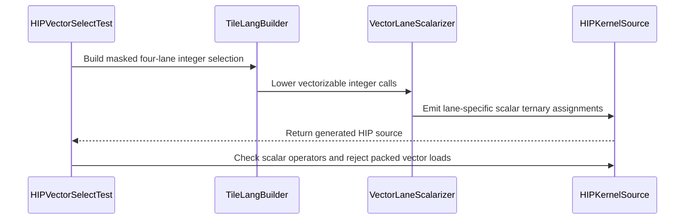

# [PR #2915] [ROCm] Scalarize vectorizable calls in vector Select lowering

source: https://github.com/tile-ai/tilelang/pull/2915
state: closed | updated: 2026-09-26T09:50:06Z
labels: 

## 正文

Follow-up to #2889.

### Problem

When a fixed-length vector `Select` branch contains a vectorizable call, the HIP lane scalarizer falls back to extracting a lane from the original vector expression. For a four-lane result, this can emit the complete vector load and operation four times, then select one different lane from each temporary.

For example, the base source generated for a fixed-size four-element bitwise input contains four separate `*(int4*)(source + 0)` loads, one before each lane assignment.

### Change

Use the existing `TVectorizable` operation attribute to rebuild vectorizable calls from their scalarized arguments. This is the same operation contract used by the TIR vectorizer, and avoids maintaining a separate HIP-specific list. Each `Select` assignment then computes only the requested lane instead of rematerializing the complete vector expression.

Target-specific intrinsic lowering still runs before HIP source generation. For example, supported popcount operations become `__popc` or `__popcll` pure-extern calls and continue through the existing pure-extern scalarization path.

This does not add a lazy-evaluation guarantee to TIR `Select`. The regression uses fixed-size source and mask buffers, so both branches are valid for every lane regardless of the condition.

### Regression coverage

The parameterized source-generation test lowers `bitwise_and`, `bitwise_or`, `bitwise_xor`, `bitwise_not`, `shift_left`, `shift_right`, and unsigned `popcount` through the full HIP pipeline. On the affected base the bitwise and shift expressions rematerialize packed source vectors. With this change, every generated assignment computes its corresponding scalar source lane and no packed source load is materialized. The popcount case also verifies the established `uint32` to `__popc` intrinsic-lowering path.

### Validation

- `cmake --build build -j$(nproc)` passed.
- `python -S -m pytest -q testing/python/amd/test_tilelang_hip_vector_select_codegen.py` passed: 36 passed, 12 hardware-gated tests skipped.
- `pre-commit run --files src/rocm/codegen/codegen_hip.cc testing/python/amd/test_tilelang_hip_vector_select_codegen.py` passed.


<!-- This is an auto-generated comment: release notes by coderabbit.ai -->

## Summary

- Fixed HIP vector `Select` lowering for fixed-length vector branches with vectorizable calls.
- Rebuilds vectorizable calls from lane-scalarized arguments.
- Prevents repeated rematerialization of full vector loads and operations.
- Preserves target-specific intrinsic lowering.
- Added regression coverage for bitwise and shift operations across the HIP pipeline.
- Tests verify per-lane computation and reject packed `int4` source loads.

## Validation

- ROCm build passed.
- HIP vector `Select` tests passed: 35 passed, 12 hardware-gated skips.
- Pre-commit checks passed.
- Supported `uint32` and `uint64` `popcount` lowering remains handled by `hip.FLowerIntrinsic`.

## C++ style / lint notes

- The PR changes C++ code but does not change rules documented in `docs/developer_guide/cpp_style.md`.
- The C++ API Style Audit is warning-only. No correctness or build issue is reported.

<!-- end of auto-generated comment: release notes by coderabbit.ai -->

## 评论 (5)

### coderabbitai[bot] · 2026-08-07

<!-- This is an auto-generated comment: summarize by coderabbit.ai -->
<!-- review_stack_entry_start -->

[](https://app.coderabbit.ai/change-stack/tile-ai/tilelang/pull/2915?utm_source=github_walkthrough&utm_medium=github&utm_campaign=change_stack)

<!-- review_stack_entry_end -->
<!-- This is an auto-generated comment: review paused by coderabbit.ai -->

> [!NOTE]
> ## Reviews paused
> 
> It looks like this branch is under active development. To avoid overwhelming you with review comments due to an influx of new commits, CodeRabbit has automatically paused this review. You can configure this behavior by changing the `reviews.auto_review.auto_pause_after_reviewed_commits` setting.
> 
> Use the following commands to manage reviews:
> - `@coderabbitai resume` to resume automatic reviews.
> - `@coderabbitai review` to trigger a single review.
> 
> Use the checkboxes below for quick actions:
> - [ ] <!-- {"checkboxId": "7f6cc2e2-2e4e-497a-8c31-c9e4573e93d1"} --> ▶️ Resume reviews
> - [ ] <!-- {"checkboxId": "e9bb8d72-00e8-4f67-9cb2-caf3b22574fe"} --> 🔍 Trigger review

<!-- end of auto-generated comment: review paused by coderabbit.ai -->
<!-- walkthrough_start -->

<details>
<summary>📝 Walkthrough</summary>

## Walkthrough

HIP vector scalarization now rebuilds vectorizable calls with scalar element return types. New HIP code-generation tests cover masked four-lane `int32` and `uint32` selection for bitwise operations, shifts, and popcount, and reject packed vector loads.

### Changes

**HIP vector scalarization**

|Layer / File(s)|Summary|
|---|---|
|**Scalarize vector integer operations** <br> `src/rocm/codegen/codegen_hip.cc`|`VectorLaneScalarizer` reads `TVectorizable` attributes and rebuilds vector calls with scalar element return types and lane-scalarized arguments.|
|**Validate masked vector selection** <br> `testing/python/amd/test_tilelang_hip_vector_select_codegen.py`|Parameterized tests lower masked four-lane selections for bitwise operations, shifts, and popcount across `int32` and `uint32`. Tests verify scalar lane assignments and reject packed `int4` and `uint4` loads.|

**Estimated code review effort:** 3 (Moderate) | ~20 minutes

**Possibly related issues**

- tile-ai/tilelang#2911 — Both changes update `VectorLaneScalarizer` for lane-wise HIP vector expression handling.

**Possibly related PRs**

- [tile-ai/tilelang#2889](https://github.com/tile-ai/tilelang/pull/2889) — This change extends the `VectorLaneScalarizer` path to rebuild scalarized `TVectorizable` calls.
- [tile-ai/tilelang#2843](https://github.com/tile-ai/tilelang/pull/2843) — Both changes implement lane-wise scalarization of vectorized operations in GPU code generation.

### Sequence Diagram(s)



</details>

<!-- walkthrough_end -->
<!-- pre_merge_checks_walkthrough_start -->

<details>
<summary>🚥 Pre-merge checks | ✅ 5</summary>

<details>
<summary>✅ Passed checks (5 passed)</summary>

|         Check name         | Status   | Explanation                                                                                                                      |
| :------------------------: | :------- | :------------------------------------------------------------------------------------------------------------------------------- |
|     Docstring Coverage     | ✅ Passed | No functions found in the changed files to evaluate docstring coverage. Skipping docstring coverage check.                       |
|     Linked Issues check    | ✅ Passed | Check skipped because no linked issues were found for this pull request.                                                         |
| Out of Scope Changes check | ✅ Passed | Check skipped because no linked issues were found for this pull request.                                                         |
|      Description Check     | ✅ Passed | Check skipped - CodeRabbit’s high-level summary is enabled.                                                                      |
|         Title check        | ✅ Passed | The title clearly and concisely describes the main change: scalarizing vectorizable calls during vector Select lowering on ROCm. |

</details>

</details>

<!-- pre_merge_checks_walkthrough_end -->
<!-- finishing_touch_checkbox_start -->

<details>
<summary>✨ Finishing Touches</summary>

<details>
<summary>🧪 Generate unit tests (beta)</summary>

- [ ] <!-- {"checkboxId": "f47ac10b-58cc-4372-a567-0e02b2c3d479", "radioGroupId": "utg-output-choice-group-unknown_comment_id"} -->   Create PR with unit tests

</details>

</details>

<!-- finishing_touch_checkbox_end -->
<!-- tips_start -->

---

Thanks for using [CodeRabbit](https://coderabbit.ai?utm_source=oss&utm_medium=github&utm_campaign=tile-ai/tilelang&utm_content=2915)! It's free for OSS, and your support helps us grow. If you like it, consider giving us a shout-out.

<details>
<summary>❤️ Share</summary>

- [X](https://twitter.com/intent/tweet?text=I%20just%20used%20%40coderabbitai%20for%20my%20code%20review%2C%20and%20it%27s%20fantastic%21%20It%27s%20free%20for%20OSS%20and%20offers%20a%20free%20trial%20for%20the%20proprietary%20code.%20Check%20it%20out%3A&url=https%3A//coderabbit.ai)
- [Mastodon](https://mastodon.social/share?text=I%20just%20used%20%40coderabbitai%20for%20my%20code%20review%2C%20and%20it%27s%20fantastic%21%20It%27s%20free%20for%20OSS%20and%20offers%20a%20free%20trial%20for%20the%20proprietary%20code.%20Check%20it%20out%3A%20https%3A%2F%2Fcoderabbit.ai)
- [Reddit](https://www.reddit.com/submit?title=Great%20tool%20for%20code%20review%20-%20CodeRabbit&text=I%20just%20used%20CodeRabbit%20for%20my%20code%20review%2C%20and%20it%27s%20fantastic%21%20It%27s%20free%20for%20OSS%20and%20offers%20a%20free%20trial%20for%20proprietary%20code.%20Check%20it%20out%3A%20https%3A//coderabbit.ai)
- [LinkedIn](https://www.linkedin.com/sharing/share-offsite/?url=https%3A%2F%2Fcoderabbit.ai&mini=true&title=Great%20tool%20for%20code%20review%20-%20CodeRabbit&summary=I%20just%20used%20CodeRabbit%20for%20my%20code%20review%2C%20and%20it%27s%20fantastic%21%20It%27s%20free%20for%20OSS%20and%20offers%20a%20free%20trial%20for%20proprietary%20code)

</details>


<sub>Comment `@coderabbitai help` to get the list of available commands.</sub>

<!-- tips_end -->

### github-actions[bot] · 2026-08-07

👋 Hi! Thank you for contributing to the **TileLang** project.

Please remember to run `pre-commit run --all-files` in the root directory of the project to ensure your changes are properly linted and formatted. This will help ensure your contribution passes the format check.

We appreciate you taking this step! Our team will review your contribution, and we look forward to your awesome work! 🚀

### morluto · 2026-08-07

Addressed the remaining builtin-coverage note in `c4f265ff`.

The full-pipeline regression is now parameterized across `bitwise_and`, `bitwise_or`, `bitwise_xor`, `bitwise_not`, `shift_left`, and `shift_right`, with per-lane source checks and rejection of packed `int4` source loads.

Trying to add the requested raw `popcount` case exposed a separate flaw in the original allowlist: after late scalarization it reaches HIP source codegen as unresolved `tirx.popcount` and aborts. Supported `uint32` and `uint64` popcount is already lowered earlier by `hip.FLowerIntrinsic` to `__popc` or `__popcll`, which the existing pure-extern path scalarizes. I removed the redundant and invalid late `popcount` entry instead of adding code that bypasses that established lowering contract.

The exact-tree ROCm build passes, the HIP vector Select suite is now 35 passed with 12 hardware-gated skips, and pre-commit passes on both changed files.


### coderabbitai[bot] · 2026-08-07

<!-- This is an auto-generated comment by CodeRabbit -->
> [!NOTE]
> GitHub couldn't provide a complete incremental comparison for this pull request, so CodeRabbit is performing a full review instead. This review may take a little longer.

### coderabbitai[bot] · 2026-08-07

<!-- This is an auto-generated comment by CodeRabbit -->
> [!NOTE]
> GitHub couldn't provide a complete incremental comparison for this pull request, so CodeRabbit is performing a full review instead. This review may take a little longer.

## Review (8)

### coderabbitai[bot] · 2026-08-07 · COMMENTED

**Actionable comments posted: 1**

<details>
<summary>🧹 Nitpick comments (1)</summary><blockquote>

<details>
<summary>testing/python/amd/test_tilelang_hip_vector_select_codegen.py (1)</summary><blockquote>

`230-239`: _🎯 Functional Correctness_ | _🔵 Trivial_ | _⚡ Quick win_

**Cover every newly scalarized builtin.**

This test exercises only `bitwise_and`. A regression in `bitwise_or`, `bitwise_xor`, `bitwise_not`, `shift_left`, `shift_right`, or `popcount` would pass. Add parameterized expressions or focused source checks for each operation.

<details>
<summary>🤖 Prompt for AI Agents</summary>

```
Verify each finding against current code. Fix only still-valid issues, skip the
rest with a brief reason, keep changes minimal, and validate.

In `@testing/python/amd/test_tilelang_hip_vector_select_codegen.py` around lines
230 - 239, The test test_bitwise_call_keeps_masked_load_inside_select_branch
currently covers only bitwise_and; extend it with parameterized or focused cases
for bitwise_or, bitwise_xor, bitwise_not, shift_left, shift_right, and popcount,
verifying each scalarized builtin keeps masked loads inside the select branch
and avoids vectorized source loads.
```

</details>

<!-- cr-comment:v1:e0782f4edb78f32e5d2a7561 -->

</blockquote></details>

</blockquote></details>

<details>
<summary>🤖 Prompt for all review comments with AI agents</summary>

```
Verify each finding against current code. Fix only still-valid issues, skip the
rest with a brief reason, keep changes minimal, and validate.

Inline comments:
In `@src/rocm/codegen/codegen_hip.cc`:
- Around line 192-203: The HIP codegen change around the vectorizable operation
handling must not make generic TIR Select semantics lazy or depend on C++
ternary short-circuiting for masked loads. Update
src/rocm/codegen/codegen_hip.cc:192-203 to use an explicitly documented lazy
conditional/backend contract, or ensure both branches are valid for every lane;
update testing/python/amd/test_tilelang_hip_vector_select_codegen.py:199
accordingly so the guarded masked_bitwise_select test does not rely on
out-of-range branch suppression.

---

Nitpick comments:
In `@testing/python/amd/test_tilelang_hip_vector_select_codegen.py`:
- Around line 230-239: The test
test_bitwise_call_keeps_masked_load_inside_select_branch currently covers only
bitwise_and; extend it with parameterized or focused cases for bitwise_or,
bitwise_xor, bitwise_not, shift_left, shift_right, and popcount, verifying each
scalarized builtin keeps masked loads inside the select branch and avoids
vectorized source loads.
```

</details>

<details>
<summary>🪄 Autofix</summary>

Fix all unresolved CodeRabbit comments on this PR:

- [ ] <!-- {"checkboxId": "4b0d0e0a-96d7-4f10-b296-3a18ea78f0b9"} --> Push a commit to this branch (recommended)
- [ ] <!-- {"checkboxId": "ff5b1114-7d8c-49e6-8ac1-43f82af23a33"} --> Create a new PR with the fixes

</details>

---

<details>
<summary>ℹ️ Review info</summary>

<details>
<summary>⚙️ Run configuration</summary>

**Configuration used**: Path: .coderabbit.yaml

**Review profile**: CHILL

**Plan**: Pro Plus

**Run ID**: `fd693d63-abd6-40cd-badd-d67790742b8e`

</details>

<details>
<summary>📥 Commits</summary>

Reviewing files that changed from the base of the PR and between c7fabc4cc65e480b88b7606eb1bc9c340dbd8c8c and c99a7421642c77f0fa0bd9468694eb063e08363d.

</details>

<details>
<summary>📒 Files selected for processing (2)</summary>

* `src/rocm/codegen/codegen_hip.cc`
* `testing/python/amd/test_tilelang_hip_vector_select_codegen.py`

</details>

</details>

<!-- This is an auto-generated comment by CodeRabbit for review status -->

### morluto · 2026-08-07 · COMMENTED

(no text)

### coderabbitai[bot] · 2026-08-07 · COMMENTED

(no text)

### SiriusNEO · 2026-08-07 · CHANGES_REQUESTED

(no text)

### coderabbitai[bot] · 2026-08-07 · COMMENTED

**Actionable comments posted: 1**

<details>
<summary>🧹 Nitpick comments (1)</summary><blockquote>

<details>
<summary>testing/python/amd/test_tilelang_hip_vector_select_codegen.py (1)</summary><blockquote>

`243-247`: _🎯 Functional Correctness_ | _🔵 Trivial_ | _⚡ Quick win_

**Do not depend on generated assignment order.**

`enumerate(assignments)` assumes that HIP source emits lane 0 first and lane 3 last. A valid backend reordering would fail this test. Check exactly one assignment for each lane instead.

<details>
<summary>Suggested assertion</summary>

```diff
-    for lane, assignment in enumerate(assignments):
-        assert f"source[{lane}]" in assignment
-        assert source_pattern in assignment
+    for lane in range(4):
+        lane_assignments = [assignment for assignment in assignments if f"source[{lane}]" in assignment]
+        assert len(lane_assignments) == 1
+        assert source_pattern in lane_assignments[0]
```

</details>

<details>
<summary>🤖 Prompt for AI Agents</summary>

```
Verify each finding against current code. Fix only still-valid issues, skip the
rest with a brief reason, keep changes minimal, and validate.

In `@testing/python/amd/test_tilelang_hip_vector_select_codegen.py` around lines
243 - 247, Update the assignment assertions in the test to avoid
enumerate(assignments) and generated ordering assumptions. Validate that exactly
one assignment exists for each lane 0 through 3, and apply the existing
source_pattern check to each lane-specific assignment regardless of their order.
```

</details>

<!-- cr-comment:v1:8724377ed8b194b7da4150c1 -->

</blockquote></details>

</blockquote></details>

<details>
<summary>🤖 Prompt for all review comments with AI agents</summary>

```
Verify each finding against current code. Fix only still-valid issues, skip the
rest with a brief reason, keep changes minimal, and validate.

Inline comments:
In `@testing/python/amd/test_tilelang_hip_vector_select_codegen.py`:
- Around line 229-237: Extend the parameterized cases in
test_integer_call_is_scalarized_per_select_lane with T.popcount, using the
_popcount source pattern and popcount ID. Ensure the test asserts generated
select branches contain scalar source[0] through source[3] calls for this
operation.

---

Nitpick comments:
In `@testing/python/amd/test_tilelang_hip_vector_select_codegen.py`:
- Around line 243-247: Update the assignment assertions in the test to avoid
enumerate(assignments) and generated ordering assumptions. Validate that exactly
one assignment exists for each lane 0 through 3, and apply the existing
source_pattern check to each lane-specific assignment regardless of their order.
```

</details>

<details>
<summary>🪄 Autofix</summary>

Fix all unresolved CodeRabbit comments on this PR:

- [ ] <!-- {"checkboxId": "4b0d0e0a-96d7-4f10-b296-3a18ea78f0b9"} --> Push a commit to this branch (recommended)
- [ ] <!-- {"checkboxId": "ff5b1114-7d8c-49e6-8ac1-43f82af23a33"} --> Create a new PR with the fixes

</details>

---

<details>
<summary>ℹ️ Review info</summary>

<details>
<summary>⚙️ Run configuration</summary>

**Configuration used**: Path: .coderabbit.yaml

**Review profile**: CHILL

**Plan**: Pro Plus

**Run ID**: `4c19a2ba-7ecb-4eb3-bd72-15e8804300b8`

</details>

<details>
<summary>📥 Commits</summary>

Reviewing files that changed from the base of the PR and between 3ea62e57a23c61c37b64354ef4dc477659be5c81 and c4f265fff02cafc8329d0f5970bb06ca2448b2ab.

</details>

<details>
<summary>📒 Files selected for processing (2)</summary>

* `src/rocm/codegen/codegen_hip.cc`
* `testing/python/amd/test_tilelang_hip_vector_select_codegen.py`

</details>

<details>
<summary>🚧 Files skipped from review as they are similar to previous changes (1)</summary>

* src/rocm/codegen/codegen_hip.cc

</details>

</details>

<!-- This is an auto-generated comment by CodeRabbit for review status -->

### morluto · 2026-08-07 · COMMENTED

(no text)

### morluto · 2026-08-07 · COMMENTED

(no text)

### coderabbitai[bot] · 2026-08-07 · COMMENTED

(no text)
