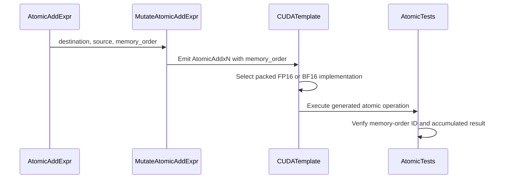

# [PR #2924] [Bugfix] Carry memory_order through vectorized atomic_add

source: https://github.com/tile-ai/tilelang/pull/2924
state: closed | updated: 2026-09-21T17:19:27Z
labels: 

## 正文

Fixes #2688.

## Cause

`vectorize_loop.cc` rebuilt the wide atomic from two operands:

```cpp
return Call(op->dtype, GetVectorizedAtomicOp(vector_size), {dst, src});
```

The region lowering puts `memory_order` in `args[2]`. Codegen appends it only under
`if (op->args.size() > 2)`, so the emitted `AtomicAddx2(dst, src)` picks up the
`= memory_order_relaxed` default on the device function. Legal C++, no diagnostic anywhere.
Everything downstream already accepted the operand, including `num_inputs = 3`; the vectorizer
was under-filling it.

The fix carries the trailing operands through, starting at index 2 because the two-argument form
is legal, and copying rather than visiting because the order is lane-invariant.

## Why atomic.h changes too

Carrying the order makes inline PTX reachable that had never been assembled: the non-relaxed
branches were constant-folded away while the order always defaulted to relaxed. Three of them do
not build.

1. **fp16 used `.v2.f16`**, whose vector operands require sm_90, and fp16 vectorizes to x2 on
   every target. Now uses packed `f16x2`, available from sm_60 and emitting identical SASS on
   sm_90, so fp16 needs no arch guard at all and the per-half pack/unpack goes away.
2. **bf16 was missing `.noftz`**, which ptxas requires for `.bf16`. Syntax error on every target,
   sm_90 included.
3. **bf16 has no ordered atomic below sm_90 at any width**, so unlike fp16 there is nothing to
   fall back to. The sm_90 path is guarded, with `__threadfence()` around a relaxed bf16x2
   atomicAdd below it: two-way where release and acquire need one-way, so conservative rather
   than lossy.

New guards use `__CUDA_ARCH__` rather than the `__CUDA_ARCH_LIST__` spelling elsewhere in this
file, which fails a `-gencode` multi-arch build with `C1012`. The remaining uses guard
declarations, where `__CUDA_ARCH__` is undefined in the host pass, so those stay as they are.

Docstrings for `atomic_add`, `atomic_max` and `atomic_min` claimed the region path ignores
`memory_order`, which is no longer true.

## Testing

Six cases covering acquire, release and acq_rel on fp16 and bf16, since each ordering is a
separately spelled asm string. Each asserts on the generated CUDA, then runs the kernel.

RTX 2000 Ada (sm_89), CUDA 13.3: **56 passed, 3 skipped, 1 failed**. The failure is
`test_tma_atomic_add`, which fails identically on unmodified `main` (TMA needs sm_90 and that
test has no arch guard) and uses no `memory_order`.

Negative control: reverting only the two source files, keeping the new tests, and rebuilding
makes them fail with `AtomicAddx2((&(Out[...])), *(uint1*)(X + ...));`. Restoring and rebuilding
makes them pass.

Every PTX spelling was checked against sm_75 through sm_90 with ptxas. There is no sm_90
hardware here, so those branches are verified to assemble rather than to run.

## One untested path

`AtomicAddx2Ret(bfloat16_t*)` takes the same guard through the shared helper, and
`AtomicAddx4Ret` routes through it. This is the only part with no test, and it cannot have one:
nothing reachable instantiates the bf16 Ret overloads with a non-relaxed order, since
`GetVectorizedAtomicOp` returns only the non-ret ops, `T.atomic_addx2` / `T.atomic_addx4` take no
`memory_order`, and region-form `return_prev=True` raises `NotImplementedError`. Guarded anyway
so the file stays consistent and the path is already correct when `return_prev` is implemented.
Verified by instantiating the template directly: without the guard it fails on sm_80/86/89 with
`Instruction 'atom.add.bf16.global' requires .target sm_90 or higher`, and passes on all four
targets with it.


<!-- This is an auto-generated comment: release notes by coderabbit.ai -->

## Summary

- Preserve trailing operands, including `memory_order`, when vectorizing `T.atomic_add` to `AtomicAddx2` or `AtomicAddx4`.
- Use packed `f16x2` PTX for vector fp16 atomics.
- Add `.noftz` to vector bf16 PTX.
- Add fenced bf16 atomics for architectures below sm_90.
- Update `atomic_add`, `atomic_max`, and `atomic_min` documentation.
- Add six CUDA tests for acquire, release, and acq_rel ordering on fp16 and bf16.

## C++ style / lint notes

- The PR changes C++ code in `src/tl_templates/cuda/atomic.h` and `src/transform/vectorize_loop.cc`.
- The available summary does not identify changes to rules in `docs/developer_guide/cpp_style.md`.
- Review the “C++ API Style Audit (warning only)” CI step for advisory findings.
- Treat TLCPP003/TLCPP004 findings as warning-only unless they indicate a new API, FFI, or maintainability risk.

<!-- end of auto-generated comment: release notes by coderabbit.ai -->

## 评论 (5)

### github-actions[bot] · 2026-08-09

👋 Hi! Thank you for contributing to the **TileLang** project.

Please remember to run `pre-commit run --all-files` in the root directory of the project to ensure your changes are properly linted and formatted. This will help ensure your contribution passes the format check.

We appreciate you taking this step! Our team will review your contribution, and we look forward to your awesome work! 🚀

### coderabbitai[bot] · 2026-08-09

<!-- This is an auto-generated comment: summarize by coderabbit.ai -->
<!-- review_stack_entry_start -->

[](https://app.coderabbit.ai/change-stack/tile-ai/tilelang/pull/2924?utm_source=github_walkthrough&utm_medium=github&utm_campaign=change_stack)

<!-- review_stack_entry_end -->
<!-- recent_review_start -->

No actionable comments were generated in the recent review. 🎉

<details>
<summary>ℹ️ Recent review info</summary>

<details>
<summary>⚙️ Run configuration</summary>

**Configuration used**: Path: .coderabbit.yaml

**Review profile**: CHILL

**Plan**: Pro Plus

**Run ID**: `d14f223a-04f6-43d5-8c54-8ac1116d787b`

</details>

<details>
<summary>📥 Commits</summary>

Reviewing files that changed from the base of the PR and between 6af825e072d305a87ac039be0abd27b83c9a1bdc and 9b6d2707a538482adcfb3af3ba5b4d0b47555dfc.

</details>

<details>
<summary>📒 Files selected for processing (4)</summary>

* `src/tl_templates/cuda/atomic.h`
* `src/transform/vectorize_loop.cc`
* `testing/python/language/test_tilelang_language_atomic.py`
* `tilelang/language/atomic.py`

</details>

<details>
<summary>🚧 Files skipped from review as they are similar to previous changes (4)</summary>

* src/transform/vectorize_loop.cc
* tilelang/language/atomic.py
* testing/python/language/test_tilelang_language_atomic.py
* src/tl_templates/cuda/atomic.h

</details>

</details>

---


<!-- recent_review_end -->
<!-- walkthrough_start -->

<details>
<summary>📝 Walkthrough</summary>

## Walkthrough

Vectorized atomic additions now preserve memory-order operands. CUDA FP16 atomics use packed operations, while BF16 atomics use fenced pre-sm_90 fallbacks. Tests and documentation cover the updated ordering behavior.

### Changes

**Vectorized atomic ordering**

|Layer / File(s)|Summary|
|---|---|
|**Preserve vectorized atomic operands** <br> `src/transform/vectorize_loop.cc`|Vectorized `T.atomic_add` calls retain trailing operands such as `memory_order`.|
|**Update CUDA vector atomic implementations** <br> `src/tl_templates/cuda/atomic.h`|FP16 vector atomics use packed `f16x2` operations. BF16 vector atomics use fenced fallbacks before sm_90 and ordered PTX operations on sm_90+.|
|**Validate and document ordering behavior** <br> `testing/python/language/test_tilelang_language_atomic.py`, `tilelang/language/atomic.py`|CUDA tests verify acquire, release, and acquire-release ordering for FP16 and BF16 vector atomics. Documentation describes backend-specific ordering behavior.|

**Estimated code review effort:** 4 (Complex) | ~45 minutes

**Possibly related issues**

- tile-ai/tilelang#2708 — Covers vectorized `memory_order` preservation and ordered BF16 fallback behavior.

**Possibly related PRs**

- [tile-ai/tilelang#2492](https://github.com/tile-ai/tilelang/pull/2492) — Modifies the same CUDA 16-bit vector atomic implementations and tests.
- [tile-ai/tilelang#2672](https://github.com/tile-ai/tilelang/pull/2672) — Covers related vectorized atomic-add helpers and memory-order propagation.
- [tile-ai/tilelang#2938](https://github.com/tile-ai/tilelang/pull/2938) — Modifies BF16 vector atomic implementations and architecture-specific fallbacks.

**Suggested reviewers:** `leiwang1999`

### Sequence Diagram(s)



</details>

<!-- walkthrough_end -->
<!-- pre_merge_checks_walkthrough_start -->

<details>
<summary>🚥 Pre-merge checks | ✅ 3 | ❌ 2</summary>

### ❌ Failed checks (2 warnings)

|      Check name     | Status     | Explanation                                                                                                                                                              | Resolution                                                                                                                                       |
| :-----------------: | :--------- | :----------------------------------------------------------------------------------------------------------------------------------------------------------------------- | :----------------------------------------------------------------------------------------------------------------------------------------------- |
| Linked Issues check | ⚠️ Warning | The implementation preserves trailing memory_order operands and adds fp16/bf16 coverage, but it lacks the required fp32 AtomicAddx4 regression coverage for issue `#2688`. | Add regression tests for vectorized fp32 AtomicAddx4 operations with non-relaxed memory orders, including generated-code and runtime validation. |
|  Docstring Coverage | ⚠️ Warning | Docstring coverage is 31.82% which is insufficient. The required threshold is 80.00%.                                                                                    | Write docstrings for the functions missing them to satisfy the coverage threshold.                                                               |

<details>
<summary>✅ Passed checks (3 passed)</summary>

|         Check name         | Status   | Explanation                                                                                                                                     |
| :------------------------: | :------- | :---------------------------------------------------------------------------------------------------------------------------------------------- |
|      Description Check     | ✅ Passed | Check skipped - CodeRabbit’s high-level summary is enabled.                                                                                     |
|         Title check        | ✅ Passed | The title clearly identifies the main fix: preserving memory_order during vectorized atomic_add lowering.                                       |
| Out of Scope Changes check | ✅ Passed | The CUDA helper, vectorizer, tests, and documentation changes support ordered vectorized atomic operations and remain within issue `#2688` scope. |

</details>

</details>

<!-- pre_merge_checks_walkthrough_end -->
<!-- finishing_touch_checkbox_start -->

<details>
<summary>✨ Finishing Touches</summary>

<details>
<summary>🧪 Generate unit tests (beta)</summary>

- [ ] <!-- {"checkboxId": "f47ac10b-58cc-4372-a567-0e02b2c3d479", "radioGroupId": "utg-output-choice-group-unknown_comment_id"} -->   Create PR with unit tests

</details>

</details>

<!-- finishing_touch_checkbox_end -->
<!-- tips_start -->

---

Thanks for using [CodeRabbit](https://coderabbit.ai?utm_source=oss&utm_medium=github&utm_campaign=tile-ai/tilelang&utm_content=2924)! It's free for OSS, and your support helps us grow. If you like it, consider giving us a shout-out.

<details>
<summary>❤️ Share</summary>

- [X](https://twitter.com/intent/tweet?text=I%20just%20used%20%40coderabbitai%20for%20my%20code%20review%2C%20and%20it%27s%20fantastic%21%20It%27s%20free%20for%20OSS%20and%20offers%20a%20free%20trial%20for%20the%20proprietary%20code.%20Check%20it%20out%3A&url=https%3A//coderabbit.ai)
- [Mastodon](https://mastodon.social/share?text=I%20just%20used%20%40coderabbitai%20for%20my%20code%20review%2C%20and%20it%27s%20fantastic%21%20It%27s%20free%20for%20OSS%20and%20offers%20a%20free%20trial%20for%20the%20proprietary%20code.%20Check%20it%20out%3A%20https%3A%2F%2Fcoderabbit.ai)
- [Reddit](https://www.reddit.com/submit?title=Great%20tool%20for%20code%20review%20-%20CodeRabbit&text=I%20just%20used%20CodeRabbit%20for%20my%20code%20review%2C%20and%20it%27s%20fantastic%21%20It%27s%20free%20for%20OSS%20and%20offers%20a%20free%20trial%20for%20proprietary%20code.%20Check%20it%20out%3A%20https%3A//coderabbit.ai)
- [LinkedIn](https://www.linkedin.com/sharing/share-offsite/?url=https%3A%2F%2Fcoderabbit.ai&mini=true&title=Great%20tool%20for%20code%20review%20-%20CodeRabbit&summary=I%20just%20used%20CodeRabbit%20for%20my%20code%20review%2C%20and%20it%27s%20fantastic%21%20It%27s%20free%20for%20OSS%20and%20offers%20a%20free%20trial%20for%20proprietary%20code)

</details>


<sub>Comment `@coderabbitai help` to get the list of available commands.</sub>

<!-- tips_end -->

### coderabbitai[bot] · 2026-08-12

<!-- This is an auto-generated comment by CodeRabbit -->
> [!NOTE]
> GitHub couldn't provide a complete incremental comparison for this pull request, so CodeRabbit is performing a full review instead. This review may take a little longer.

### arcusbuilds · 2026-08-12

@SiriusNEO The other paths already carry the order. Scalar `T.atomic_add`, `atomic_max`, and `atomic_min` pass `memory_order` through on both the extern and tile-region paths, and max/min never reach the vectorizer, since `GetVectorizedAtomicOp` maps only the add ops. #2688 is specifically about a supplied order being silently dropped when the region form auto-vectorizes, and that is the bug this PR fixes.

The explicit `T.atomic_addx2` / `T.atomic_addx4` intrinsics are a different case: they take no `memory_order` parameter at the language level, so there is no supplied order to drop; they have always been relaxed. Wiring the parameter through is an API addition (the device helpers already accept it), and it would make the currently unreachable ordered `Ret` paths reachable, which needs its own tests. I'll file a separate issue to track that, so this PR stays scoped to the wrong-code bug.

### arcusbuilds · 2026-08-16

@SiriusNEO  gentle ping, I think this is ready, Let me know your thoughts, and if I've missed anything I'll work on it.

## Review (10)

### coderabbitai[bot] · 2026-08-09 · COMMENTED

**Actionable comments posted: 1**

<details>
<summary>🤖 Prompt for all review comments with AI agents</summary>

```
Verify each finding against current code. Fix only still-valid issues, skip the
rest with a brief reason, keep changes minimal, and validate.

Inline comments:
In `@src/tl_templates/cuda/atomic.h`:
- Around line 676-679: Add a returning fenced BF16x2 helper alongside
tl_atomic_add_v2_bf16_fenced that performs the pre-sm_90 atomic operation and
returns the prior value, preserving relaxed atomicAdd semantics. Update the
pre-sm_90 fallback for AtomicAddx2Ret(bfloat16_t*) to call this helper, while
leaving the existing sm_90+ ordered path and non-returning AtomicAddx2 behavior
unchanged.
```

</details>

<details>
<summary>🪄 Autofix</summary>

Fix all unresolved CodeRabbit comments on this PR:

- [ ] <!-- {"checkboxId": "4b0d0e0a-96d7-4f10-b296-3a18ea78f0b9"} --> Push a commit to this branch (recommended)
- [ ] <!-- {"checkboxId": "ff5b1114-7d8c-49e6-8ac1-43f82af23a33"} --> Create a new PR with the fixes

</details>

---

<details>
<summary>ℹ️ Review info</summary>

<details>
<summary>⚙️ Run configuration</summary>

**Configuration used**: Path: .coderabbit.yaml

**Review profile**: CHILL

**Plan**: Pro Plus

**Run ID**: `57593a52-e4b2-418b-9aba-c33070d0d9ec`

</details>

<details>
<summary>📥 Commits</summary>

Reviewing files that changed from the base of the PR and between 5a9b2a54b9a04831886d9b4dfd7a9ad758cd7ebd and 93d7f1e09c17279da3fc14c422f1e15d88c8a177.

</details>

<details>
<summary>📒 Files selected for processing (4)</summary>

* `src/tl_templates/cuda/atomic.h`
* `src/transform/vectorize_loop.cc`
* `testing/python/language/test_tilelang_language_atomic.py`
* `tilelang/language/atomic.py`

</details>

</details>

<!-- This is an auto-generated comment by CodeRabbit for review status -->

### coderabbitai[bot] · 2026-08-09 · COMMENTED

**Actionable comments posted: 1**

<details>
<summary>🤖 Prompt for all review comments with AI agents</summary>

```
Verify each finding against current code. Fix only still-valid issues, skip the
rest with a brief reason, keep changes minimal, and validate.

Inline comments:
In `@src/tl_templates/cuda/atomic.h`:
- Around line 677-680: Replace the __CUDA_ARCH_LIST__-based architecture guards
with __CUDA_ARCH__ checks requiring architecture 900 or newer. Apply this change
in both the AtomicAddx2(bfloat16_t*) and AtomicAddx2Ret(bfloat16_t*) branches,
leaving their existing implementations unchanged.
```

</details>

<details>
<summary>🪄 Autofix</summary>

Fix all unresolved CodeRabbit comments on this PR:

- [ ] <!-- {"checkboxId": "4b0d0e0a-96d7-4f10-b296-3a18ea78f0b9"} --> Push a commit to this branch (recommended)
- [ ] <!-- {"checkboxId": "ff5b1114-7d8c-49e6-8ac1-43f82af23a33"} --> Create a new PR with the fixes

</details>

---

<details>
<summary>ℹ️ Review info</summary>

<details>
<summary>⚙️ Run configuration</summary>

**Configuration used**: Path: .coderabbit.yaml

**Review profile**: CHILL

**Plan**: Pro Plus

**Run ID**: `df85a7da-9bf8-4258-b4ed-cdb5f4aaeab8`

</details>

<details>
<summary>📥 Commits</summary>

Reviewing files that changed from the base of the PR and between 93d7f1e09c17279da3fc14c422f1e15d88c8a177 and b5c52e65b5e1b2e380d1e98cef2ac4006f3c52a9.

</details>

<details>
<summary>📒 Files selected for processing (1)</summary>

* `src/tl_templates/cuda/atomic.h`

</details>

</details>

<!-- This is an auto-generated comment by CodeRabbit for review status -->

### arcusbuilds · 2026-08-09 · COMMENTED

(no text)

### coderabbitai[bot] · 2026-08-09 · COMMENTED

(no text)

### arcusbuilds · 2026-08-09 · COMMENTED

(no text)

### coderabbitai[bot] · 2026-08-09 · COMMENTED

(no text)

### SiriusNEO · 2026-08-11 · CHANGES_REQUESTED

(no text)

### arcusbuilds · 2026-08-11 · COMMENTED

(no text)

### SiriusNEO · 2026-08-12 · COMMENTED

It seems that only vectorized AtomicAdd is correctly fixed with`memory_order` passed, like atomic_addx2 or x4. Should we fix for all atomic add cases?

### SiriusNEO · 2026-08-20 · APPROVED

(no text)
