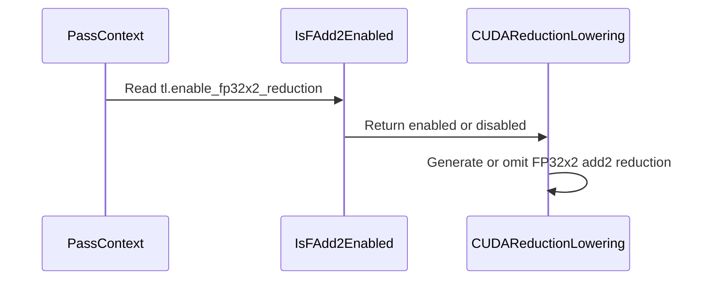

# [PR #3128] [CUDA][Reduce] Add PassConfig for FP32x2 accumulation

source: https://github.com/tile-ai/tilelang/pull/3128
state: closed | updated: 2026-09-18T11:55:49Z
labels: 

## 正文

## Motivation

#2637 enabled packed FP32x2 reducers on SM100+, which changes the accumulation order for FP32 sum and absolute-sum reductions. #3057 added a per-reduction opt-out, but downstream projects may need to disable this behavior globally without annotating every reduction call site.

## Changes

- Add the boolean PassConfig `tl.enable_fp32x2_reduction`.
- Keep it enabled by default, preserving current behavior.
- When disabled, use scalar accumulation for CUDA FP32 sum/absolute-sum reductions on SM100+.
- Preserve the existing per-reduction `enable_fadd2` annotation; a global disable takes precedence.
- Leave packed max/min reducers unchanged.

```python
tilelang.compile(
    kernel,
    pass_configs={
        tilelang.PassConfigKey.TL_ENABLE_FP32X2_REDUCTION: False,
    },
)
```

## Validation

- Incremental CMake build completed successfully.
- `ruff format` and `ruff check` passed for modified Python files.
- `testing/python/cuda/test_cuda_f32x2_intrinsics.py`: 100 passed on CUDA.


<!-- This is an auto-generated comment: release notes by coderabbit.ai -->

## Summary

Adds the `tl.enable_fp32x2_reduction` pass configuration.

- Keeps packed FP32x2 accumulation enabled by default.
- Disables packed accumulation for CUDA FP32 sum and absolute-sum reductions when set to `False`.
- Gives the global setting precedence over `enable_fadd2`.
- Leaves packed max/min reductions unchanged.
- Updates documentation and adds code-generation and correctness tests.
- Validation passed: incremental CMake build, `ruff format`, `ruff check`, and 100 CUDA tests.

## C++ style / lint notes

The PR adds a C++ include and touches the include guidance documented in `docs/developer_guide/cpp_style.md`. The C++ API Style Audit runs in CI as a warning-only step. No correctness or build issues are reported.

<!-- end of auto-generated comment: release notes by coderabbit.ai -->

## 评论 (2)

### github-actions[bot] · 2026-09-01

👋 Hi! Thank you for contributing to the **TileLang** project.

Please remember to run `pre-commit run --all-files` in the root directory of the project to ensure your changes are properly linted and formatted. This will help ensure your contribution passes the format check.

We appreciate you taking this step! Our team will review your contribution, and we look forward to your awesome work! 🚀

### coderabbitai[bot] · 2026-09-01

<!-- This is an auto-generated comment: summarize by coderabbit.ai -->
<!-- review_stack_entry_start -->

[](https://app.coderabbit.ai/change-stack/tile-ai/tilelang/pull/3128)

<!-- review_stack_entry_end -->
<!-- recent_review_start -->

No actionable comments were generated in the recent review. 🎉

<details>
<summary>ℹ️ Recent review info</summary>

<details>
<summary>⚙️ Run configuration</summary>

**Configuration used**: Path: .coderabbit.yaml

**Review profile**: CHILL

**Plan**: Team

**Run ID**: `728284e3-1213-48e7-a82b-204ab2707f4d`

</details>

<details>
<summary>📥 Commits</summary>

Reviewing files that changed from the base of the PR and between e10a13e3a4377206208ae19d3a1d6254af2148df and 88d34e75e36f721c6f00e1f8b441aad3cb4eed34.

</details>

<details>
<summary>📒 Files selected for processing (6)</summary>

* `src/cuda/op/builtin.cc`
* `src/cuda/op/builtin.h`
* `src/cuda/op/reduce.cc`
* `testing/python/cuda/test_cuda_f32x2_intrinsics.py`
* `tilelang/language/reduce_op.py`
* `tilelang/transform/pass_config.py`

</details>

**Included review availability:** Your plan provides up to 8 included reviews per hour; 7 remain after this review.

</details>

---


<!-- recent_review_end -->
<!-- walkthrough_start -->

<details>
<summary>📝 Walkthrough</summary>

## Walkthrough

Adds the `tl.enable_fp32x2_reduction` pass configuration. CUDA reduction lowering reads this setting, defaults it to enabled, and disables FP32x2 accumulation when configured false. Tests cover generated code and numerical correctness.

### Changes

**FP32x2 reduction configuration**

|Layer / File(s)|Summary|
|---|---|
|**Define the pass configuration** <br> `tilelang/transform/pass_config.py`, `src/cuda/op/builtin.h`, `src/cuda/op/builtin.cc`|Defines and registers `tl.enable_fp32x2_reduction` as a Boolean configuration that defaults to enabled.|
|**Apply the global reduction setting** <br> `src/cuda/op/reduce.cc`|`IsFAdd2Enabled` checks the current `PassContext` before evaluating the per-reduction `enable_fadd2` annotation.|
|**Validate and document configuration** <br> `testing/python/cuda/test_cuda_f32x2_intrinsics.py`, `tilelang/language/reduce_op.py`|Tests verify disabled code generation and numerical correctness. Reduction documentation describes the global configuration and per-reduction control.|

**Estimated code review effort:** 3 (Moderate) | ~20 minutes

<!-- final_review_risk_start -->
**Merge Risk:** _⚪ Minimal_ · up to `88d34`

The PR adds an opt-out for packed FP32x2 accumulation while preserving existing behavior by default; no actionable merge-blocking risk remains after normal checks and review.
<!-- final_review_risk_end -->

### Sequence Diagram(s)



**Suggested reviewers:** `leiwang1999`, `yongqi-zhuo`

</details>

<!-- walkthrough_end -->
<!-- pre_merge_checks_walkthrough_start -->

<details>
<summary>🚥 Pre-merge checks | ✅ 4 | ❌ 1</summary>

### ❌ Failed checks (1 warning)

|     Check name     | Status     | Explanation                                                                                                                                                                                 | Resolution                                                                         |
| :----------------: | :--------- | :------------------------------------------------------------------------------------------------------------------------------------------------------------------------------------------ | :--------------------------------------------------------------------------------- |
| Docstring Coverage | ⚠️ Warning | Docstring coverage is 17.65% which is insufficient. The required threshold is 80.00%. Docstring coverage is scoped to functions touched by this diff. Analyzed 17 functions across 6 files. | Write docstrings for the functions missing them to satisfy the coverage threshold. |

<details>
<summary>✅ Passed checks (4 passed)</summary>

|         Check name         | Status   | Explanation                                                                                                                    |
| :------------------------: | :------- | :----------------------------------------------------------------------------------------------------------------------------- |
|      Description Check     | ✅ Passed | Check skipped - CodeRabbit’s high-level summary is enabled.                                                                    |
|         Title check        | ✅ Passed | The title clearly and concisely describes the main change: adding a CUDA pass configuration for FP32x2 reduction accumulation. |
|     Linked Issues check    | ✅ Passed | Check skipped because no linked issues were found for this pull request.                                                       |
| Out of Scope Changes check | ✅ Passed | Check skipped because no linked issues were found for this pull request.                                                       |

</details>

</details>

<!-- pre_merge_checks_walkthrough_end -->

- [ ] <!-- {"checkboxId":"585bb3f6-faf5-4dbf-96d2-74e382adf19a"} --> Fix all pre-merge checks with AI
<!-- finishing_touch_checkbox_start -->

<details>
<summary>✨ Finishing Touches 💡 1</summary>

<!-- finishing_touch_suggestion:docstrings -->
<details>
<summary>📝 Generate docstrings 💡</summary>

- [ ] <!-- {"checkboxId":"7962f53c-55bc-4827-bfbf-6a18da830691"} --> Create stacked PR
- [ ] <!-- {"checkboxId":"3e1879ae-f29b-4d0d-8e06-d12b7ba33d98"} --> Commit on current branch

</details>
<details>
<summary>🧪 Generate unit tests (beta)</summary>

- [ ] <!-- {"checkboxId": "f47ac10b-58cc-4372-a567-0e02b2c3d479", "radioGroupId": "utg-output-choice-group-unknown_comment_id"} -->   Create PR with unit tests
- [ ] <!-- {"checkboxId": "6ba7b810-9dad-11d1-80b4-00c04fd430c8", "radioGroupId": "utg-output-choice-group-unknown_comment_id"} -->   Commit unit tests in branch `configurable-fp32x2-reduce`

</details>

</details>

<!-- finishing_touch_checkbox_end -->
<!-- tips_start -->

---

Thanks for using [CodeRabbit](https://coderabbit.ai?utm_source=oss&utm_medium=github&utm_campaign=tile-ai/tilelang&utm_content=3128)! It's free for OSS, and your support helps us grow. If you like it, consider giving us a shout-out.

<details>
<summary>❤️ Share</summary>

- [X](https://twitter.com/intent/tweet?text=I%20just%20used%20%40coderabbitai%20for%20my%20code%20review%2C%20and%20it%27s%20fantastic%21%20It%27s%20free%20for%20OSS%20and%20offers%20a%20free%20trial%20for%20the%20proprietary%20code.%20Check%20it%20out%3A&url=https%3A//coderabbit.ai)
- [Mastodon](https://mastodon.social/share?text=I%20just%20used%20%40coderabbitai%20for%20my%20code%20review%2C%20and%20it%27s%20fantastic%21%20It%27s%20free%20for%20OSS%20and%20offers%20a%20free%20trial%20for%20the%20proprietary%20code.%20Check%20it%20out%3A%20https%3A%2F%2Fcoderabbit.ai)
- [Reddit](https://www.reddit.com/submit?title=Great%20tool%20for%20code%20review%20-%20CodeRabbit&text=I%20just%20used%20CodeRabbit%20for%20my%20code%20review%2C%20and%20it%27s%20fantastic%21%20It%27s%20free%20for%20OSS%20and%20offers%20a%20free%20trial%20for%20proprietary%20code.%20Check%20it%20out%3A%20https%3A//coderabbit.ai)
- [LinkedIn](https://www.linkedin.com/sharing/share-offsite/?url=https%3A%2F%2Fcoderabbit.ai&mini=true&title=Great%20tool%20for%20code%20review%20-%20CodeRabbit&summary=I%20just%20used%20CodeRabbit%20for%20my%20code%20review%2C%20and%20it%27s%20fantastic%21%20It%27s%20free%20for%20OSS%20and%20offers%20a%20free%20trial%20for%20proprietary%20code)

</details>


<sub>Comment `@coderabbitai help` to get the list of available commands.</sub>

<!-- tips_end -->
